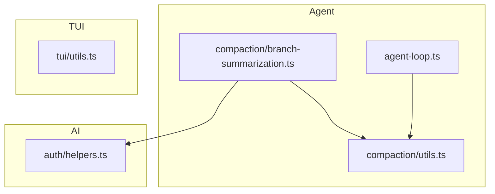
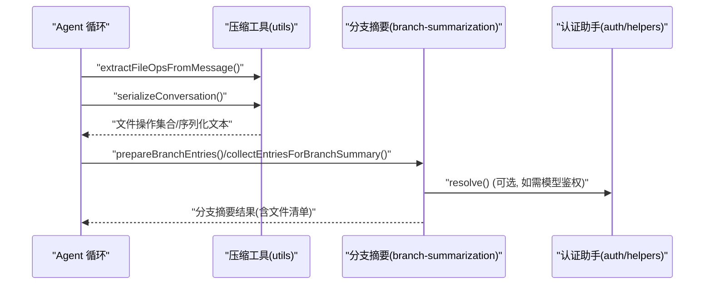
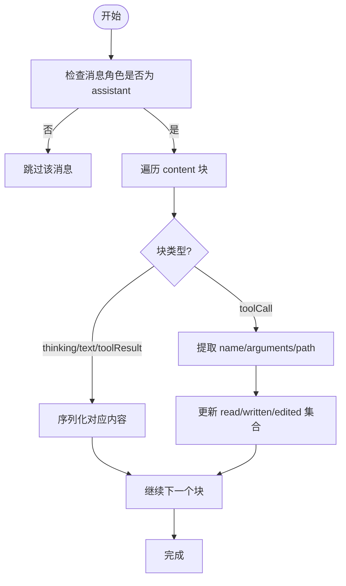
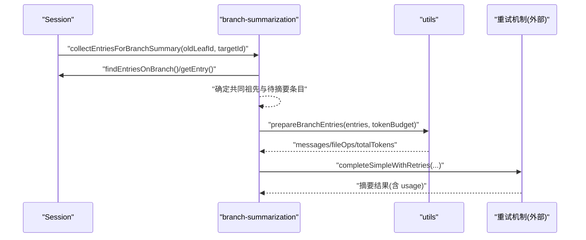
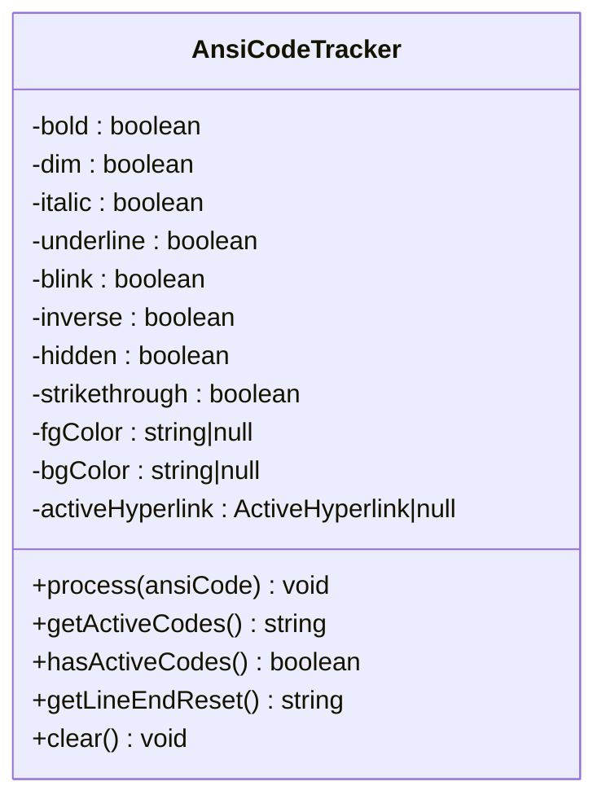
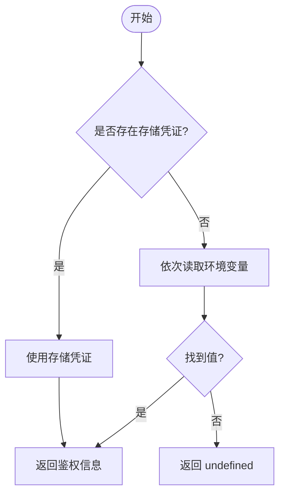
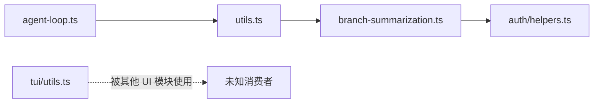

# 工具函数库

<cite>
**本文引用的文件**
- [packages/agent/src/harness/compaction/utils.ts](file://packages/agent/src/harness/compaction/utils.ts)
- [packages/agent/src/harness/compaction/branch-summarization.ts](file://packages/agent/src/harness/compaction/branch-summarization.ts)
- [packages/tui/src/utils.ts](file://packages/tui/src/utils.ts)
- [packages/ai/src/auth/helpers.ts](file://packages/ai/src/auth/helpers.ts)
- [packages/agent/src/agent-loop.ts](file://packages/agent/src/agent-loop.ts)
</cite>

## 目录
1. [简介](#简介)
2. [项目结构](#项目结构)
3. [核心组件](#核心组件)
4. [架构总览](#架构总览)
5. [详细组件分析](#详细组件分析)
6. [依赖关系分析](#依赖关系分析)
7. [性能考量](#性能考量)
8. [故障排查指南](#故障排查指南)
9. [结论](#结论)
10. [附录](#附录)

## 简介
本文件面向“工具函数库”的文档目标，聚焦以下能力：重试机制、数据验证、JSON 解析、文本处理、溢出控制；并覆盖错误处理策略、性能优化技巧与边界情况。同时给出在构建健壮 AI 应用时的使用建议，包括异步操作处理、并发控制与资源管理。

## 项目结构
仓库采用多包（monorepo）组织，工具函数分布在多个子包中：
- agent 包：会话压缩、分支摘要、消息序列化、文件操作提取等工具
- tui 包：终端文本宽度计算、ANSI/OSC/APC 序列处理、图形单元分割、超链接追踪等
- ai 包：认证辅助（API Key、OAuth 懒加载）
- agent-loop：工具参数校验入口



**图表来源**
- [packages/agent/src/harness/compaction/utils.ts:1-133](file://packages/agent/src/harness/compaction/utils.ts#L1-L133)
- [packages/agent/src/harness/compaction/branch-summarization.ts:1-200](file://packages/agent/src/harness/compaction/branch-summarization.ts#L1-L200)
- [packages/tui/src/utils.ts:1-800](file://packages/tui/src/utils.ts#L1-L800)
- [packages/ai/src/auth/helpers.ts:1-60](file://packages/ai/src/auth/helpers.ts#L1-L60)

**章节来源**
- [packages/agent/src/harness/compaction/utils.ts:1-133](file://packages/agent/src/harness/compaction/utils.ts#L1-L133)
- [packages/tui/src/utils.ts:1-800](file://packages/tui/src/utils.ts#L1-L800)
- [packages/ai/src/auth/helpers.ts:1-60](file://packages/ai/src/auth/helpers.ts#L1-L60)
- [packages/agent/src/agent-loop.ts:1-200](file://packages/agent/src/agent-loop.ts#L1-L200)

## 核心组件
- 会话压缩与分支摘要工具：用于将对话消息序列化为可摘要的纯文本、提取文件操作、生成只读/修改文件列表，以及格式化元数据标签
- 终端文本处理工具：精确计算可见宽度、安全截断、剥离 ANSI/OSC/APC 控制序列、识别 OSC 8 超链接、维护 SGR 样式状态
- 认证辅助工具：统一 API Key 解析流程与 OAuth 懒加载封装
- 工具参数校验：在调用工具前对参数进行结构化校验，避免无效或危险输入进入执行层

**章节来源**
- [packages/agent/src/harness/compaction/utils.ts:1-133](file://packages/agent/src/harness/compaction/utils.ts#L1-L133)
- [packages/tui/src/utils.ts:1-800](file://packages/tui/src/utils.ts#L1-L800)
- [packages/ai/src/auth/helpers.ts:1-60](file://packages/ai/src/auth/helpers.ts#L1-L60)
- [packages/agent/src/agent-loop.ts:1-200](file://packages/agent/src/agent-loop.ts#L1-L200)

## 架构总览
下图展示了从“消息到摘要”的关键路径，以及工具参数校验如何保障执行安全。



**图表来源**
- [packages/agent/src/harness/compaction/utils.ts:24-72](file://packages/agent/src/harness/compaction/utils.ts#L24-L72)
- [packages/agent/src/harness/compaction/utils.ts:91-133](file://packages/agent/src/harness/compaction/utils.ts#L91-L133)
- [packages/agent/src/harness/compaction/branch-summarization.ts:82-171](file://packages/agent/src/harness/compaction/branch-summarization.ts#L82-L171)
- [packages/ai/src/auth/helpers.ts:9-31](file://packages/ai/src/auth/helpers.ts#L9-L31)

## 详细组件分析

### 组件A：会话压缩与消息序列化（utils.ts）
职责
- 提取消息中的文件操作（read/write/edit），聚合为只读与已修改两类文件列表
- 将复杂消息结构序列化为便于 LLM 摘要的纯文本，包含用户、助手思考、工具调用与工具结果
- 提供安全的 JSON 序列化与结果长度截断，防止超大输出导致上下文溢出

关键函数
- createFileOps / extractFileOpsFromMessage / computeFileLists / formatFileOperations
- serializeConversation（内部使用 safeJsonStringify 与 truncateForSummary）

复杂度与性能
- 遍历消息块一次，时间复杂度 O(N)，N 为消息块数量
- 使用 Set 去重，排序后生成有序列表，适合后续提示词拼接
- 工具结果按固定上限截断，降低提示词大小

错误与边界
- 非 assistant 角色或无 content 的消息直接跳过
- 工具调用缺少必要字段时跳过
- JSON 序列化失败返回占位符，避免中断流程



**图表来源**
- [packages/agent/src/harness/compaction/utils.ts:24-51](file://packages/agent/src/harness/compaction/utils.ts#L24-L51)
- [packages/agent/src/harness/compaction/utils.ts:91-133](file://packages/agent/src/harness/compaction/utils.ts#L91-L133)

**章节来源**
- [packages/agent/src/harness/compaction/utils.ts:1-133](file://packages/agent/src/harness/compaction/utils.ts#L1-L133)

### 组件B：分支摘要准备与重试集成（branch-summarization.ts）
职责
- 收集需要摘要的会话条目，考虑共享祖先节点，保证上下文连续性
- 基于 token 预算裁剪消息，保留重要摘要类条目
- 通过外部重试机制（RetryPolicy/RetryCallbacks）处理瞬态错误

关键函数
- collectEntriesForBranchSummary
- prepareBranchEntries
- 与 completeSimpleWithRetries、estimateTokens、SUMMARIZATION_SYSTEM_PROMPT 协作

异常与恢复
- 遇到无效 entry 抛出 SessionError
- 支持自定义指令替换或追加，灵活控制摘要风格



**图表来源**
- [packages/agent/src/harness/compaction/branch-summarization.ts:82-171](file://packages/agent/src/harness/compaction/branch-summarization.ts#L82-L171)
- [packages/agent/src/harness/compaction/utils.ts:15-72](file://packages/agent/src/harness/compaction/utils.ts#L15-L72)

**章节来源**
- [packages/agent/src/harness/compaction/branch-summarization.ts:1-200](file://packages/agent/src/harness/compaction/branch-summarization.ts#L1-L200)

### 组件C：终端文本处理（tui/utils.ts）
职责
- 精确计算字符串在终端的可见宽度，正确处理 emoji、组合字符、制表符与 ANSI/OSC/APC 控制序列
- 安全截断文本至指定列宽，保持样式与超链接完整性
- 剥离控制序列、定位图形单元范围、查询 OSC 8 超链接
- 跟踪活跃 SGR 样式码，跨行保持一致性

关键函数与特性
- visibleWidth / stripTerminalSequences / getGraphemeCellRange / getOsc8LinkAtColumn / normalizeTerminalOutput / extractAnsiCode
- AnsiCodeTracker：维护加粗、斜体、下划线、颜色、背景色与活动超链接状态
- 缓存：对可见宽度计算结果进行有限缓存，减少重复开销

性能优化
- 快速路径：纯 ASCII 直接返回长度
- 正则预过滤：emoji 快速判定避免昂贵正则
- 单遍扫描剥离 ANSI/OSC/APC，避免多次遍历
- 限制缓存大小，自动淘汰旧项



**图表来源**
- [packages/tui/src/utils.ts:507-727](file://packages/tui/src/utils.ts#L507-L727)

**章节来源**
- [packages/tui/src/utils.ts:1-800](file://packages/tui/src/utils.ts#L1-L800)

### 组件D：认证辅助（auth/helpers.ts）
职责
- envApiKeyAuth：统一 API Key 登录与解析流程，优先使用存储凭证，其次读取环境变量
- lazyOAuth：延迟加载 OAuth 实现，避免将 Node-only 代码引入浏览器打包产物

使用要点
- 支持 AbortSignal 取消
- 提供 login/refresh/toAuth 接口，适配不同提供商



**图表来源**
- [packages/ai/src/auth/helpers.ts:9-31](file://packages/ai/src/auth/helpers.ts#L9-L31)

**章节来源**
- [packages/ai/src/auth/helpers.ts:1-60](file://packages/ai/src/auth/helpers.ts#L1-L60)

### 组件E：工具参数校验（agent-loop.ts）
职责
- 在工具调用前对参数进行校验，确保类型与必填字段正确，避免下游执行失败
- 与工具定义配合，形成强约束的执行入口

典型流程
- 准备工具调用 -> 调用 validateToolArguments -> 得到 validatedArgs -> 执行工具

```mermaid
sequenceDiagram
participant Loop as "Agent 循环"
participant V as "validateToolArguments"
participant Tool as "工具实现"
Loop->>V : "validateToolArguments(tool, preparedToolCall)"
V-->>Loop : "validatedArgs 或抛出错误"
Loop->>Tool : "执行工具(validatedArgs)"
Tool-->>Loop : "结果"
```

**图表来源**
- [packages/agent/src/agent-loop.ts:618-624](file://packages/agent/src/agent-loop.ts#L618-L624)

**章节来源**
- [packages/agent/src/agent-loop.ts:1-200](file://packages/agent/src/agent-loop.ts#L1-L200)

## 依赖关系分析
- utils.ts 被 branch-summarization.ts 引用，用于消息序列化与文件操作提取
- branch-summarization.ts 依赖外部重试机制与模型抽象，结合 utils.ts 产出摘要
- tui/utils.ts 独立于 agent 模块，提供通用终端文本处理能力
- auth/helpers.ts 被 provider 配置引用，提供统一的鉴权解析



**图表来源**
- [packages/agent/src/harness/compaction/utils.ts:1-133](file://packages/agent/src/harness/compaction/utils.ts#L1-L133)
- [packages/agent/src/harness/compaction/branch-summarization.ts:1-200](file://packages/agent/src/harness/compaction/branch-summarization.ts#L1-L200)
- [packages/ai/src/auth/helpers.ts:1-60](file://packages/ai/src/auth/helpers.ts#L1-L60)
- [packages/tui/src/utils.ts:1-800](file://packages/tui/src/utils.ts#L1-L800)

**章节来源**
- [packages/agent/src/harness/compaction/utils.ts:1-133](file://packages/agent/src/harness/compaction/utils.ts#L1-L133)
- [packages/agent/src/harness/compaction/branch-summarization.ts:1-200](file://packages/agent/src/harness/compaction/branch-summarization.ts#L1-L200)
- [packages/ai/src/auth/helpers.ts:1-60](file://packages/ai/src/auth/helpers.ts#L1-L60)
- [packages/tui/src/utils.ts:1-800](file://packages/tui/src/utils.ts#L1-L800)

## 性能考量
- 会话序列化与文件操作提取：单次遍历消息块，使用 Set 去重与排序，整体 O(N)
- 终端可见宽度计算：
  - 快速路径：纯 ASCII 直接返回长度
  - 缓存：对可见宽度结果进行有限缓存，避免重复计算
  - 正则预过滤：emoji 快速判定，减少昂贵正则匹配
  - 单遍剥离 ANSI/OSC/APC，避免多次扫描
- 摘要 token 预算：在准备阶段按预算裁剪消息，控制提示词大小，降低 LLM 成本与延迟
- 认证解析：优先使用存储凭证，其次环境变量，减少交互与网络开销

[本节为通用性能讨论，不直接分析具体文件]

## 故障排查指南
- 工具参数校验失败：检查工具定义与传入参数是否匹配，确认必填字段与类型
- 会话摘要为空或截断：检查 token 预算设置与消息选择逻辑，必要时调整 reserveTokens 或预算阈值
- 终端显示错位或样式丢失：确认是否正确剥离/保留 ANSI/OSC/APC，检查 AnsiCodeTracker 的状态重置与跨行闭合
- 认证失败：确认存储凭证与环境变量优先级，检查 AbortSignal 是否提前中止

**章节来源**
- [packages/agent/src/agent-loop.ts:618-624](file://packages/agent/src/agent-loop.ts#L618-L624)
- [packages/agent/src/harness/compaction/utils.ts:74-88](file://packages/agent/src/harness/compaction/utils.ts#L74-L88)
- [packages/tui/src/utils.ts:240-312](file://packages/tui/src/utils.ts#L240-L312)
- [packages/ai/src/auth/helpers.ts:9-31](file://packages/ai/src/auth/helpers.ts#L9-L31)

## 结论
本工具函数库围绕“稳健的 AI 应用”提供了关键支撑：
- 通过工具参数校验与消息序列化，确保输入有效、上下文可控
- 借助终端文本处理工具，保证跨平台一致的显示效果与交互体验
- 利用认证辅助与重试机制，提升可靠性与用户体验
- 通过 token 预算与截断策略，控制成本与延迟

建议在构建 AI 应用时，优先采用这些工具函数作为基础设施，并在上层业务逻辑中组合使用，以获得更好的稳定性与可维护性。

[本节为总结性内容，不直接分析具体文件]

## 附录
- 使用示例（以路径引用代替代码片段）
  - 会话压缩与摘要：参考 [packages/agent/src/harness/compaction/utils.ts:24-72](file://packages/agent/src/harness/compaction/utils.ts#L24-L72)、[packages/agent/src/harness/compaction/utils.ts:91-133](file://packages/agent/src/harness/compaction/utils.ts#L91-L133)
  - 分支摘要准备与重试：参考 [packages/agent/src/harness/compaction/branch-summarization.ts:82-171](file://packages/agent/src/harness/compaction/branch-summarization.ts#L82-L171)
  - 终端文本处理：参考 [packages/tui/src/utils.ts:240-312](file://packages/tui/src/utils.ts#L240-L312)、[packages/tui/src/utils.ts:507-727](file://packages/tui/src/utils.ts#L507-L727)
  - 认证辅助：参考 [packages/ai/src/auth/helpers.ts:9-31](file://packages/ai/src/auth/helpers.ts#L9-L31)
  - 工具参数校验：参考 [packages/agent/src/agent-loop.ts:618-624](file://packages/agent/src/agent-loop.ts#L618-L624)

[本节为附录说明，不直接分析具体文件]