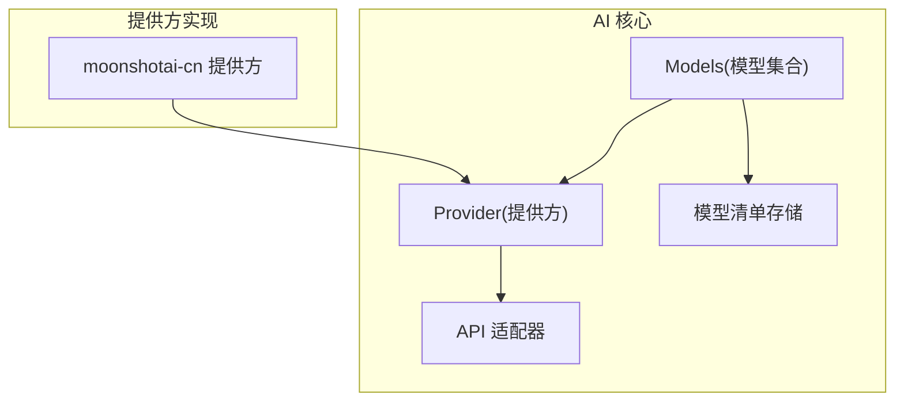
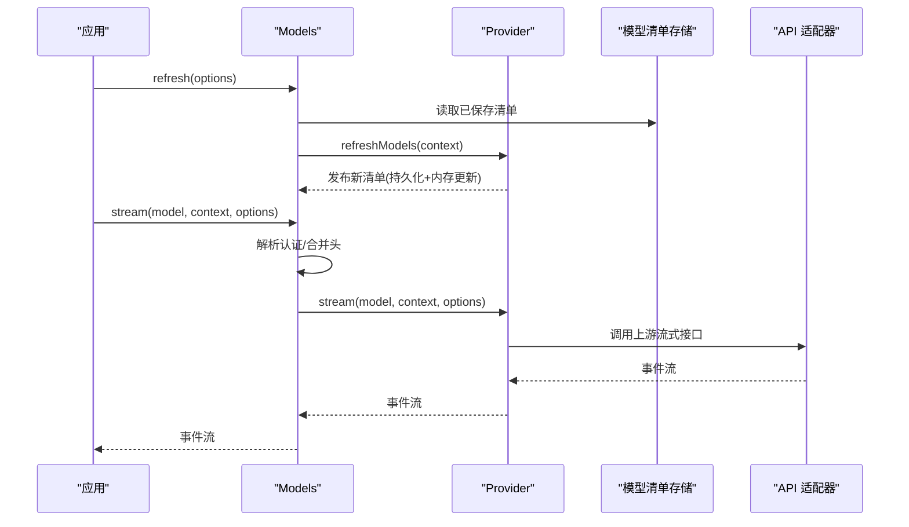
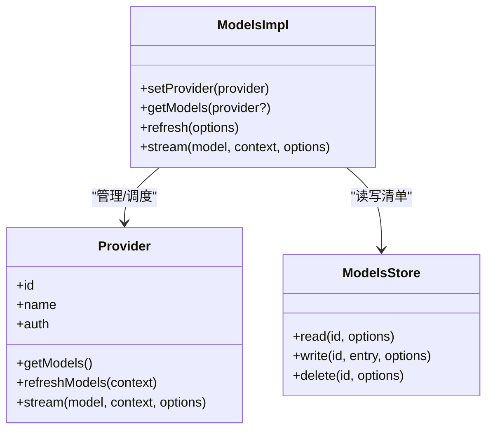
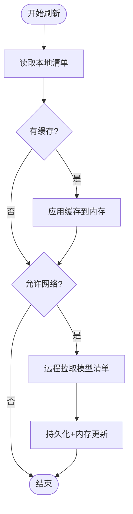
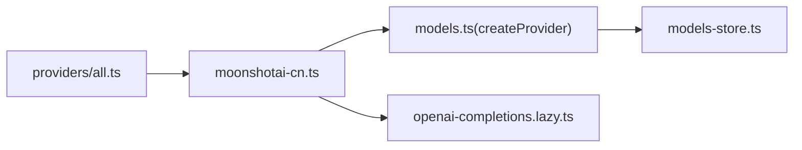

# 模型管理系统

<cite>
**本文引用的文件**
- [models.ts](file://packages/ai/src/models.ts)
- [moonshotai-cn.ts](file://packages/ai/src/providers/moonshotai-cn.ts)
- [all.ts](file://packages/ai/src/providers/all.ts)
- [openai-completions.lazy.ts](file://packages/ai/src/api/openai-completions.lazy.ts)
- [models-store.ts](file://packages/ai/src/models-store.ts)
- [types.ts](file://packages/ai/src/types.ts)
</cite>

## 目录
1. [简介](#简介)
2. [项目结构](#项目结构)
3. [核心组件](#核心组件)
4. [架构总览](#架构总览)
5. [详细组件分析](#详细组件分析)
6. [依赖关系分析](#依赖关系分析)
7. [性能与缓存](#性能与缓存)
8. [故障转移与负载均衡](#故障转移与负载均衡)
9. [配置示例与最佳实践](#配置示例与最佳实践)
10. [监控与可观测性](#监控与可观测性)
11. [结论](#结论)

## 简介
本文件系统性地梳理并文档化“模型管理系统”的能力与实现，重点覆盖：
- 模型发现机制、模型注册表、动态加载策略
- 支持的模型类型（文本生成、图像生成、多模态）与能力检测
- 版本兼容性管理
- 模型选择算法、负载均衡策略、故障转移机制
- 新增模型、优先级与模型特定参数的配置方法
- 缓存策略、性能监控与模型更新机制

该系统以 Provider（提供方）为运行时单元，通过 Models（模型集合）统一管理认证、模型列表刷新、请求路由与流式调用；各 Provider 负责自身鉴权、模型清单与具体 API 流式实现。

## 项目结构
- packages/ai/src/models.ts：定义 Provider、Models 接口与实现，提供模型刷新、认证解析、流式调用封装等核心逻辑。
- packages/ai/src/providers/*：各模型提供方实现（如 moonshotai-cn），使用 createProvider 构造 Provider，声明模型清单与 API 实现。
- packages/ai/src/api/*：具体 API 适配器（如 openai-completions.lazy.ts），将不同上游 API 统一为流式接口。
- packages/ai/src/models-store.ts：模型清单持久化存储抽象（内存/磁盘等）。
- packages/ai/src/types.ts：通用类型定义（Model、Api、Usage、Cost 等）。

图表来源
- [models.ts:254-737](file://packages/ai/src/models.ts#L254-L737)
- [moonshotai-cn.ts:6-14](file://packages/ai/src/providers/moonshotai-cn.ts#L6-L14)
- [models-store.ts:1-200](file://packages/ai/src/models-store.ts#L1-L200)

章节来源
- [models.ts:254-737](file://packages/ai/src/models.ts#L254-L737)
- [moonshotai-cn.ts:6-14](file://packages/ai/src/providers/moonshotai-cn.ts#L6-L14)

## 核心组件
- Provider（提供方）
  - 职责：标识提供方元信息、鉴权方式、模型清单获取、流式调用实现、可选的动态刷新。
  - 关键能力：getModels、refreshModels、filterModels、stream/streamSimple、可选的 fetchDeferred/cancelDeferred。
- Models（模型集合）
  - 职责：聚合多个 Provider，统一认证解析、模型查询、并发刷新、流式调用转发、成本计算、思考级别适配等。
  - 关键能力：setProvider/getProvider、getModels/getModel、refresh、getAvailable、getAuth、stream/complete、fetchDeferred/cancelDeferred。
- 模型清单存储（ModelsStore）
  - 职责：持久化 Provider 的模型清单快照，支持读写与删除，配合刷新流程实现离线恢复与增量更新。
- API 适配器
  - 职责：将不同上游 API（如 OpenAI Completions）统一为流式接口，供 Provider 复用。

章节来源
- [models.ts:97-223](file://packages/ai/src/models.ts#L97-L223)
- [models.ts:254-737](file://packages/ai/src/models.ts#L254-L737)
- [models-store.ts:1-200](file://packages/ai/src/models-store.ts#L1-L200)
- [openai-completions.lazy.ts:1-200](file://packages/ai/src/api/openai-completions.lazy.ts#L1-L200)

## 架构总览
系统采用“Provider + Models”的分层架构：
- 上层 Models 提供统一的模型管理与调用入口，屏蔽认证、刷新、错误处理等横切关注点。
- 下层 Provider 专注各自的上游 API 与模型清单，支持静态清单与动态刷新。
- 模型清单可通过 ModelsStore 持久化，支持离线恢复与网络刷新。
- 所有流式调用通过 Provider 的 stream 或 streamSimple 完成，支持延迟创建与取消。

图表来源
- [models.ts:386-446](file://packages/ai/src/models.ts#L386-L446)
- [models.ts:667-680](file://packages/ai/src/models.ts#L667-L680)
- [models.ts:800-827](file://packages/ai/src/models.ts#L800-L827)

## 详细组件分析

### 模型发现与注册表
- 模型发现
  - 静态清单：Provider 在构造时提供 models 数组。
  - 动态清单：Provider 实现 refreshModels，从远程拉取最新模型并持久化到 ModelsStore，同时更新内存中的动态清单。
- 注册表
  - ModelsImpl 内部维护 providers Map，支持 setProvider/deleteProvider/clearProviders。
  - getModels 会聚合所有 Provider 的模型清单，异常 Provider 会被忽略以保证健壮性。

图表来源
- [models.ts:254-318](file://packages/ai/src/models.ts#L254-L318)
- [models.ts:338-384](file://packages/ai/src/models.ts#L338-L384)
- [models-store.ts:1-200](file://packages/ai/src/models-store.ts#L1-L200)

章节来源
- [models.ts:254-318](file://packages/ai/src/models.ts#L254-L318)
- [models.ts:338-384](file://packages/ai/src/models.ts#L338-L384)

### 动态加载策略
- 首次启动：优先恢复本地存储的清单（offline-first），再根据 allowNetwork 决定是否发起网络刷新。
- 并发刷新：对多个 Provider 的 refreshModels 并发执行，错误收集但不中断其他 Provider。
- 幂等与撤销：通过 generation 与 AbortController 保证刷新操作的原子性与可撤销。
- 发布链：publish 操作串行化，避免并发写冲突。

图表来源
- [models.ts:386-446](file://packages/ai/src/models.ts#L386-L446)
- [models.ts:800-827](file://packages/ai/src/models.ts#L800-L827)

章节来源
- [models.ts:386-446](file://packages/ai/src/models.ts#L386-L446)
- [models.ts:800-827](file://packages/ai/src/models.ts#L800-L827)

### 支持的模型类型与能力检测
- 文本生成：通过 Provider 的 API 适配器（如 openai-completions.lazy.ts）暴露流式接口。
- 图像生成：存在 images 相关模块与模型定义，用于图像类任务。
- 多模态：通过 Model 的 api 字段区分不同 API 协议，结合 hasApi 进行运行时类型收窄。
- 能力检测
  - 思考级别：getSupportedThinkingLevels/clampThinkingLevel 基于 model.thinkingLevelMap 判断可用级别。
  - 成本计算：calculateCost 依据 usage 与 model.cost/tiers 计算费用。
  - 可用性过滤：Provider.filterModels 可按凭证进一步裁剪可用模型。

章节来源
- [models.ts:878-932](file://packages/ai/src/models.ts#L878-L932)
- [models.ts:136-149](file://packages/ai/src/models.ts#L136-L149)
- [openai-completions.lazy.ts:1-200](file://packages/ai/src/api/openai-completions.lazy.ts#L1-L200)

### 版本兼容性管理
- 通过 Model.api 字段区分不同 API 协议版本，createProvider 支持按 model.api 分发到对应实现。
- hasApi 可在运行时安全地窄化模型类型，确保选项与返回类型匹配。
- filterModels 可根据凭证或环境条件过滤模型，间接实现兼容控制。

章节来源
- [models.ts:762-792](file://packages/ai/src/models.ts#L762-L792)
- [models.ts:874-876](file://packages/ai/src/models.ts#L874-L876)

### 模型选择算法、负载均衡与故障转移
- 模型选择
  - 当前未内置自动选择器；通常由上层业务根据模型能力、成本、延迟等指标选择具体 Model。
  - 可通过 getAvailable 仅返回已配置认证的模型，作为候选集。
- 负载均衡
  - 建议在上层实现轮询/加权轮询/最少连接等策略，对同一模型的不同实例或不同 Provider 的等价模型做分流。
- 故障转移
  - 刷新阶段：单个 Provider 的错误被记录且不阻塞其他 Provider。
  - 调用阶段：若某 Provider 不可用，上层可快速切换到备选模型/Provider。
  - 取消与超时：通过 AbortSignal 控制刷新与登录等操作的可取消性。

章节来源
- [models.ts:386-446](file://packages/ai/src/models.ts#L386-L446)
- [models.ts:522-542](file://packages/ai/src/models.ts#L522-L542)

### 认证与请求组装
- 认证解析：getAuth 支持按 providerId 或 Model 解析，合并模型级 headers。
- 请求头合并：mergeHeaders 支持大小写不敏感的去重与覆盖。
- 环境变量与密钥：apiKey 支持从环境变量或外部源解析。

章节来源
- [models.ts:544-563](file://packages/ai/src/models.ts#L544-L563)
- [models.ts:238-252](file://packages/ai/src/models.ts#L238-L252)

## 依赖关系分析
- Models 依赖 Provider 与 ModelsStore，Provider 依赖 API 适配器。
- 提供方 moonshotai-cn 通过 createProvider 组合模型清单与 openai-completions.lazy.ts 的流式实现。
- all.ts 可作为聚合入口，集中注册多个 Provider。

图表来源
- [all.ts:1-200](file://packages/ai/src/providers/all.ts#L1-L200)
- [moonshotai-cn.ts:6-14](file://packages/ai/src/providers/moonshotai-cn.ts#L6-L14)
- [models.ts:762-862](file://packages/ai/src/models.ts#L762-L862)
- [openai-completions.lazy.ts:1-200](file://packages/ai/src/api/openai-completions.lazy.ts#L1-L200)

章节来源
- [all.ts:1-200](file://packages/ai/src/providers/all.ts#L1-L200)
- [moonshotai-cn.ts:6-14](file://packages/ai/src/providers/moonshotai-cn.ts#L6-L14)
- [models.ts:762-862](file://packages/ai/src/models.ts#L762-L862)

## 性能与缓存
- 模型清单缓存
  - 首次离线恢复：refresh 先读取本地清单并立即生效，再按需网络刷新。
  - 并发安全：publicationChains 串行化持久化与内存更新，避免竞态。
- 流式调用优化
  - lazyStream：延迟创建流，减少不必要的初始化开销。
  - 取消与超时：AbortSignal 贯穿刷新、登录、流式调用，提升资源利用率。
- 成本与用量
  - calculateCost 支持按 tier 与缓存写入时长差异化计费。

章节来源
- [models.ts:338-384](file://packages/ai/src/models.ts#L338-L384)
- [models.ts:667-680](file://packages/ai/src/models.ts#L667-L680)
- [models.ts:878-898](file://packages/ai/src/models.ts#L878-L898)

## 故障转移与负载均衡
- 刷新失败隔离：单个 Provider 刷新失败不影响其他 Provider，错误汇总返回。
- 调用失败回退：上层可捕获流式错误后切换至备选模型/Provider。
- 取消传播：刷新与登录均支持信号取消，便于快速回退。

章节来源
- [models.ts:386-446](file://packages/ai/src/models.ts#L386-L446)
- [models.ts:565-615](file://packages/ai/src/models.ts#L565-L615)

## 配置示例与最佳实践
以下示例以路径引用形式给出，避免直接粘贴代码内容：
- 添加新模型（以 moonshotai-cn 为例）
  - 定义模型清单与提供方工厂：[moonshotai-cn.ts:6-14](file://packages/ai/src/providers/moonshotai-cn.ts#L6-L14)
  - 使用 createProvider 组合模型与 API 适配器：[models.ts:762-862](file://packages/ai/src/models.ts#L762-L862)
  - 在聚合入口注册 Provider：[all.ts:1-200](file://packages/ai/src/providers/all.ts#L1-L200)
- 设置模型优先级
  - 通过 getAvailable 获取已认证模型并按业务规则排序选择：[models.ts:522-542](file://packages/ai/src/models.ts#L522-L542)
- 配置模型特定参数
  - 通过 Model.headers 与 requestOptions.headers 合并注入：[models.ts:544-563](file://packages/ai/src/models.ts#L544-L563)
- 启用动态刷新
  - 实现 Provider.refreshModels 并在 Models.refresh 中触发：[models.ts:800-827](file://packages/ai/src/models.ts#L800-L827), [models.ts:386-446](file://packages/ai/src/models.ts#L386-L446)
- 思考级别与成本
  - 获取可用思考级别与裁剪：[models.ts:900-932](file://packages/ai/src/models.ts#L900-L932)
  - 计算成本：[models.ts:878-898](file://packages/ai/src/models.ts#L878-L898)

章节来源
- [moonshotai-cn.ts:6-14](file://packages/ai/src/providers/moonshotai-cn.ts#L6-L14)
- [models.ts:522-563](file://packages/ai/src/models.ts#L522-L563)
- [models.ts:800-827](file://packages/ai/src/models.ts#L800-L827)
- [models.ts:878-932](file://packages/ai/src/models.ts#L878-L932)
- [all.ts:1-200](file://packages/ai/src/providers/all.ts#L1-L200)

## 监控与可观测性
- 刷新结果统计：refresh 返回 errors 映射，便于统计失败 Provider。
- 成本与用量：calculateCost 输出 cost 明细，可用于计费与预算控制。
- 思考级别：getSupportedThinkingLevels 可用于 UI 展示与限制。
- 建议扩展
  - 在 Provider.stream 前后埋点，记录耗时、错误码、重试次数。
  - 将 refresh 的错误与成本指标上报至监控系统。

章节来源
- [models.ts:386-446](file://packages/ai/src/models.ts#L386-L446)
- [models.ts:878-932](file://packages/ai/src/models.ts#L878-L932)

## 结论
该模型管理系统以 Provider 为边界、以 Models 为中枢，实现了：
- 灵活的模型发现与动态刷新（离线优先、并发刷新、幂等发布）
- 统一的认证与请求组装（支持模型级头与覆盖）
- 可扩展的 API 适配与类型安全（按 model.api 分发）
- 完善的成本与能力检测（成本计算、思考级别）
- 健壮的刷新与调用生命周期（取消、错误隔离、可观测）

在实际工程中，建议在上层实现模型选择与负载均衡策略，并结合监控与告警完善可观测性闭环。