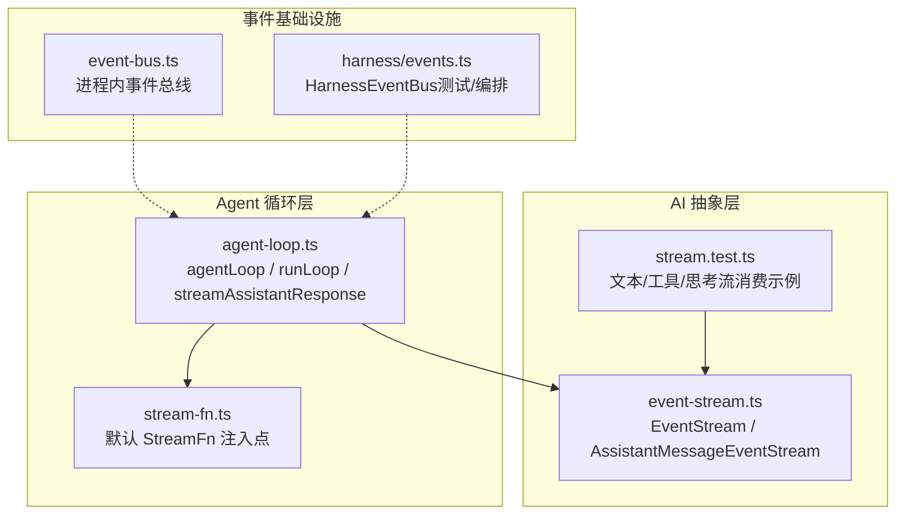
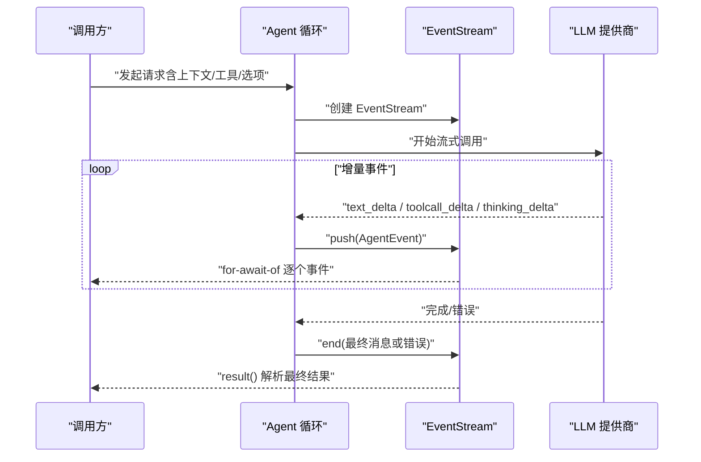
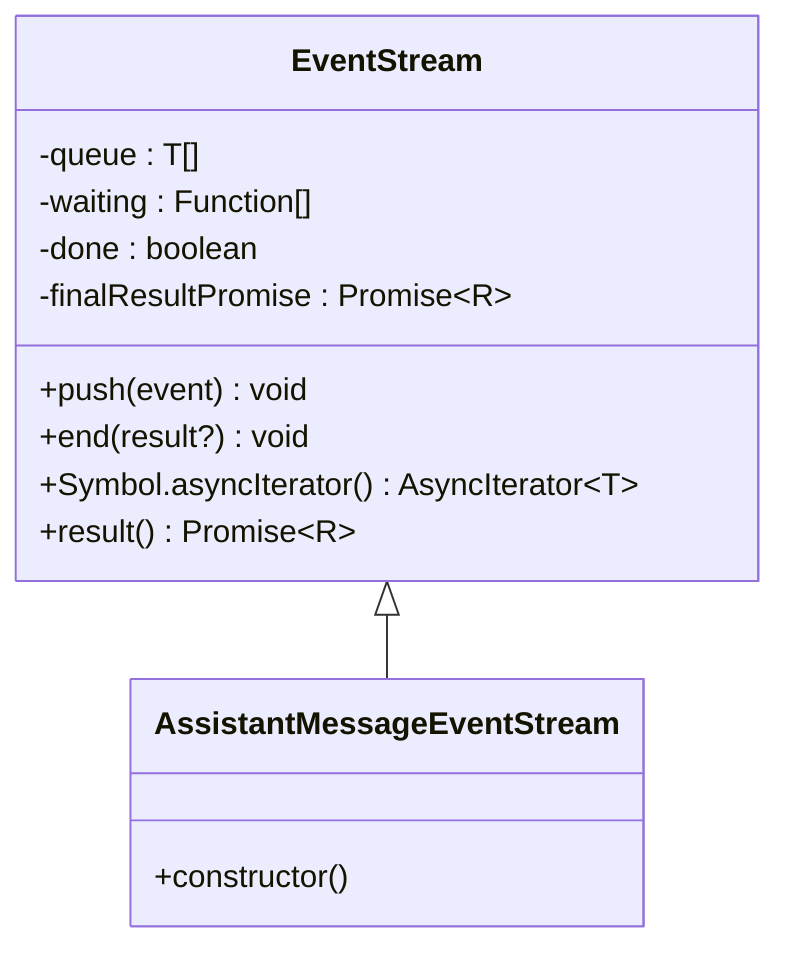
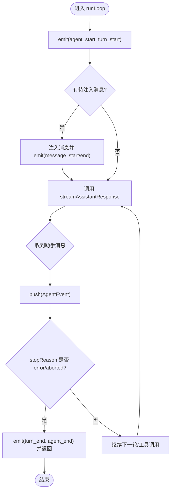
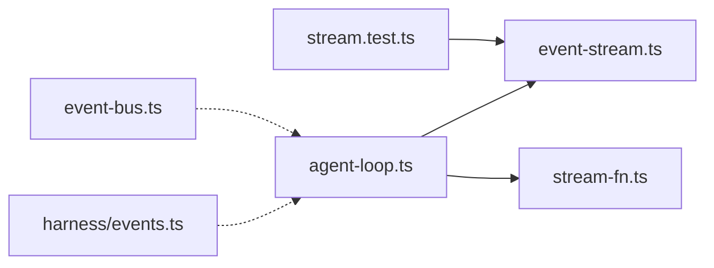

# 流式响应处理

<cite>
**本文引用的文件**
- [packages/agent/src/stream-fn.ts](file://packages/agent/src/stream-fn.ts)
- [packages/agent/src/agent-loop.ts](file://packages/agent/src/agent-loop.ts)
- [packages/ai/src/utils/event-stream.ts](file://packages/ai/src/utils/event-stream.ts)
- [packages/coding-agent/src/core/event-bus.ts](file://packages/coding-agent/src/core/event-bus.ts)
- [packages/agent/src/harness/events.ts](file://packages/agent/src/harness/events.ts)
- [packages/ai/test/stream.test.ts](file://packages/ai/test/stream.test.ts)
</cite>

## 目录
1. [简介](#简介)
2. [项目结构](#项目结构)
3. [核心组件](#核心组件)
4. [架构总览](#架构总览)
5. [详细组件分析](#详细组件分析)
6. [依赖关系分析](#依赖关系分析)
7. [性能与内存管理](#性能与内存管理)
8. [故障排查指南](#故障排查指南)
9. [结论](#结论)
10. [附录：消费流式数据的示例路径](#附录：消费流式数据的示例路径)

## 简介
本文件围绕仓库中的流式响应处理机制，系统阐述事件驱动架构、流式数据传输与增量处理模式。重点覆盖三类流：文本流、工具调用流、进度事件流；并给出缓冲策略、错误恢复、超时处理、背压与内存管理等实践建议。文档同时提供可落地的代码片段路径，便于读者在现有工程内快速集成与扩展。

## 项目结构
本项目采用多包（monorepo）组织，流式能力横跨 AI 抽象层、Agent 循环层与通用事件基础设施：
- AI 抽象层提供统一的流式接口与事件类型，测试用例展示了文本流、工具调用流、思考流的消费方式。
- Agent 循环层将 LLM 的流式事件转换为 AgentEvent，并通过 EventStream 对外暴露增量数据。
- 通用事件基础设施包括通用的异步事件流 EventStream、进程内事件总线 EventBus 以及测试/编排用的 HarnessEventBus。

图表来源
- [packages/ai/src/utils/event-stream.ts:1-89](file://packages/ai/src/utils/event-stream.ts#L1-L89)
- [packages/agent/src/agent-loop.ts:1-200](file://packages/agent/src/agent-loop.ts#L1-L200)
- [packages/agent/src/stream-fn.ts:1-21](file://packages/agent/src/stream-fn.ts#L1-L21)
- [packages/coding-agent/src/core/event-bus.ts:1-34](file://packages/coding-agent/src/core/event-bus.ts#L1-L34)
- [packages/agent/src/harness/events.ts:1-103](file://packages/agent/src/harness/events.ts#L1-L103)

章节来源
- [packages/ai/src/utils/event-stream.ts:1-89](file://packages/ai/src/utils/event-stream.ts#L1-L89)
- [packages/agent/src/agent-loop.ts:1-200](file://packages/agent/src/agent-loop.ts#L1-L200)
- [packages/agent/src/stream-fn.ts:1-21](file://packages/agent/src/stream-fn.ts#L1-L21)
- [packages/coding-agent/src/core/event-bus.ts:1-34](file://packages/coding-agent/src/core/event-bus.ts#L1-L34)
- [packages/agent/src/harness/events.ts:1-103](file://packages/agent/src/harness/events.ts#L1-L103)

## 核心组件
- EventStream：通用异步迭代器实现，支持 push/end、结果聚合 Promise、完成判定回调与提取函数。用于封装任意类型的增量事件流。
- AssistantMessageEventStream：面向助手消息事件的专用流，以 done/error 作为结束条件，并返回最终消息或错误。
- Agent 循环与流：agentLoop/runLoop 将 LLM 的流式输出包装为 AgentEvent 序列，通过 EventStream 对外推送 message_start/message_end、turn_start/turn_end、agent_start/agent_end 等进度事件。
- 默认 StreamFn：允许宿主侧注入默认流处理器，避免强耦合到具体提供者。
- 事件总线：进程内发布/订阅通道，用于解耦模块间的事件传递，并提供安全包装与清理能力。
- HarnessEventBus：面向测试/编排的带缓冲的观察者模式实现，支持快照与延迟启动。

章节来源
- [packages/ai/src/utils/event-stream.ts:1-89](file://packages/ai/src/utils/event-stream.ts#L1-L89)
- [packages/agent/src/agent-loop.ts:1-200](file://packages/agent/src/agent-loop.ts#L1-L200)
- [packages/agent/src/stream-fn.ts:1-21](file://packages/agent/src/stream-fn.ts#L1-L21)
- [packages/coding-agent/src/core/event-bus.ts:1-34](file://packages/coding-agent/src/core/event-bus.ts#L1-L34)
- [packages/agent/src/harness/events.ts:1-103](file://packages/agent/src/harness/events.ts#L1-L103)

## 架构总览
下图展示从上层调用到 LLM 提供商的完整流式链路：Agent 循环创建 EventStream，内部调用流式 API 获取文本/工具/思考增量事件，逐条推送到 EventStream；消费者通过 for-await-of 消费事件，并在结束时获取聚合结果。

图表来源
- [packages/agent/src/agent-loop.ts:1-200](file://packages/agent/src/agent-loop.ts#L1-L200)
- [packages/ai/src/utils/event-stream.ts:1-89](file://packages/ai/src/utils/event-stream.ts#L1-L89)

## 详细组件分析

### 事件流基类 EventStream
- 设计要点
  - 使用队列与等待者列表实现生产者-消费者模型，天然支持背压：当消费者慢时，事件入队；当消费者就绪时，按序交付。
  - 通过 isComplete 与 extractResult 自定义结束条件与最终结果提取，适配不同事件语义。
  - result() 返回最终结果的 Promise，可在流结束后统一处理。
- 复杂度
  - push/end/next 均为 O(1) 均摊操作；内存占用与事件数量线性相关，需结合消费速率控制。
- 适用场景
  - 任何需要“边生产边消费”的增量数据处理管道。

图表来源
- [packages/ai/src/utils/event-stream.ts:1-89](file://packages/ai/src/utils/event-stream.ts#L1-L89)

章节来源
- [packages/ai/src/utils/event-stream.ts:1-89](file://packages/ai/src/utils/event-stream.ts#L1-L89)

### Agent 循环与流式事件
- 关键流程
  - agentLoop/agentLoopContinue 创建 EventStream，并将 runLoop 产生的 AgentEvent 逐一 push。
  - runLoop 负责多轮对话、工具调用与转向消息注入，并在适当时机发出 turn_start/turn_end、message_start/message_end、agent_start/agent_end。
  - 当 stopReason 为 error/aborted 时，提前结束并推送 agent_end。
- 背压与缓冲
  - EventStream 内部队列承载短时缓冲；若下游消费慢，队列增长可能带来内存压力，应配合 UI 节流或丢弃策略。
- 错误与中断
  - 通过 stopReason 与 event.type 区分正常结束与异常结束；上游可通过 AbortSignal 中断运行。

图表来源
- [packages/agent/src/agent-loop.ts:1-200](file://packages/agent/src/agent-loop.ts#L1-L200)

章节来源
- [packages/agent/src/agent-loop.ts:1-200](file://packages/agent/src/agent-loop.ts#L1-L200)

### 默认 StreamFn 注入点
- 作用：为 Agent 与底层循环提供默认的流式处理函数，使宿主无需直接依赖具体提供者即可安装默认行为。
- 用法：在应用启动时设置默认 StreamFn；若未设置且未显式传入，则抛出明确错误提示。

章节来源
- [packages/agent/src/stream-fn.ts:1-21](file://packages/agent/src/stream-fn.ts#L1-L21)

### 进程内事件总线（EventBus）
- 功能：基于 EventEmitter 的轻量发布/订阅，提供 on/emit/clear 接口；on 返回取消订阅函数。
- 健壮性：对监听器进行 try/catch 包裹，避免单个监听器异常影响整体事件分发。
- 用途：适合模块间松耦合通信，如 UI 更新、遥测上报、调试日志等。

章节来源
- [packages/coding-agent/src/core/event-bus.ts:1-34](file://packages/coding-agent/src/core/event-bus.ts#L1-L34)

### 测试/编排事件总线（HarnessEventBus）
- 特性：支持按事件类型注册监听器；watch 模式先缓存事件，start 后再回放，保证顺序一致性。
- 用途：测试与编排场景中，确保在订阅者准备就绪前不丢失事件。

章节来源
- [packages/agent/src/harness/events.ts:1-103](file://packages/agent/src/harness/events.ts#L1-L103)

### 流式数据类型与消费示例
- 文本流：text_start → text_delta* → text_end，最终结果包含文本块。
- 工具调用流：toolcall_start → toolcall_delta* → toolcall_end，增量参数对象逐步填充，结束时可校验完整性。
- 思考流：thinking_start → thinking_delta* → thinking_end，适用于长推理过程的可视化。
- 多轮对话：结合工具调用结果与用户消息，持续推进上下文。

章节来源
- [packages/ai/test/stream.test.ts:75-151](file://packages/ai/test/stream.test.ts#L75-L151)
- [packages/ai/test/stream.test.ts:153-181](file://packages/ai/test/stream.test.ts#L153-L181)
- [packages/ai/test/stream.test.ts:183-218](file://packages/ai/test/stream.test.ts#L183-L218)
- [packages/ai/test/stream.test.ts:267-347](file://packages/ai/test/stream.test.ts#L267-L347)

## 依赖关系分析
- Agent 循环依赖 EventStream 来封装与转发事件，依赖默认 StreamFn 以解耦具体提供者。
- 测试用例依赖 AI 层的流式接口，验证文本/工具/思考流的正确性与鲁棒性。
- 事件总线与 HarnessEventBus 为可选的横向能力，用于跨模块通信与测试编排。

图表来源
- [packages/ai/test/stream.test.ts:1-800](file://packages/ai/test/stream.test.ts#L1-L800)
- [packages/ai/src/utils/event-stream.ts:1-89](file://packages/ai/src/utils/event-stream.ts#L1-L89)
- [packages/agent/src/agent-loop.ts:1-200](file://packages/agent/src/agent-loop.ts#L1-L200)
- [packages/agent/src/stream-fn.ts:1-21](file://packages/agent/src/stream-fn.ts#L1-L21)
- [packages/coding-agent/src/core/event-bus.ts:1-34](file://packages/coding-agent/src/core/event-bus.ts#L1-L34)
- [packages/agent/src/harness/events.ts:1-103](file://packages/agent/src/harness/events.ts#L1-L103)

章节来源
- [packages/ai/test/stream.test.ts:1-800](file://packages/ai/test/stream.test.ts#L1-L800)
- [packages/ai/src/utils/event-stream.ts:1-89](file://packages/ai/src/utils/event-stream.ts#L1-L89)
- [packages/agent/src/agent-loop.ts:1-200](file://packages/agent/src/agent-loop.ts#L1-L200)
- [packages/agent/src/stream-fn.ts:1-21](file://packages/agent/src/stream-fn.ts#L1-L21)
- [packages/coding-agent/src/core/event-bus.ts:1-34](file://packages/coding-agent/src/core/event-bus.ts#L1-L34)
- [packages/agent/src/harness/events.ts:1-103](file://packages/agent/src/harness/events.ts#L1-L103)

## 性能与内存管理
- 背压与缓冲
  - EventStream 使用队列缓冲事件，若消费端慢会导致内存增长。建议在 UI 层对高频事件进行节流（例如每 N 毫秒渲染一次），或在业务层丢弃非关键中间状态。
- 增量处理
  - 文本/工具/思考流均以增量形式到达，应避免在每次 delta 中做昂贵计算；仅在必要时合并或重算。
- 资源释放
  - 及时移除事件监听器（EventBus.on 返回取消函数），防止内存泄漏。
  - 在流结束或错误时，确保关闭外部连接、清理定时器与缓存。
- 超时与重试
  - 结合 AbortSignal 实现请求级超时与取消；在网络抖动时可引入指数退避重试，但需幂等保护。
- 批量化与合并
  - 对高频 UI 更新可采用批量合并策略（如合并最近若干 delta 后一次性渲染）。
- 监控与诊断
  - 利用 HarnessEventBus 记录关键事件时间戳，辅助定位卡顿与丢帧问题。

[本节为通用指导，不直接分析具体文件]

## 故障排查指南
- 常见问题
  - 未配置默认 StreamFn：调用处会抛出明确错误，需在应用启动时设置默认流处理器或显式传入。
  - 流未结束：检查 isComplete 逻辑是否正确识别结束事件（如 done/error）。
  - 事件丢失：确认是否在订阅前已产生事件；如需捕获早期事件，使用 watch 模式或确保订阅早于事件发射。
  - 监听器异常：EventBus 会对监听器进行 try/catch 包裹，但仍需检查具体 handler 实现。
- 定位步骤
  - 打印事件类型与时间戳，确认事件顺序与期望一致。
  - 在 EventStream.push 前后添加日志，观察队列长度变化。
  - 使用 HarnessEventBus 的 watch 模式回放事件，复现问题。

章节来源
- [packages/agent/src/stream-fn.ts:11-20](file://packages/agent/src/stream-fn.ts#L11-L20)
- [packages/ai/src/utils/event-stream.ts:21-48](file://packages/ai/src/utils/event-stream.ts#L21-L48)
- [packages/coding-agent/src/core/event-bus.ts:12-33](file://packages/coding-agent/src/core/event-bus.ts#L12-L33)
- [packages/agent/src/harness/events.ts:75-101](file://packages/agent/src/harness/events.ts#L75-L101)

## 结论
该仓库通过 EventStream 与 Agent 循环构建了稳定可扩展的流式响应体系，既能高效传输文本、工具调用与思考等增量事件，又提供了完善的错误恢复、超时与背压处理能力。借助事件总线与测试编排工具，开发者可以在复杂系统中可靠地消费流式数据、实现实时 UI 更新与稳健的重连策略。

[本节为总结性内容，不直接分析具体文件]

## 附录：消费流式数据的示例路径
- 文本流消费与断言
  - [packages/ai/test/stream.test.ts:153-181](file://packages/ai/test/stream.test.ts#L153-L181)
- 工具调用流消费与参数增量校验
  - [packages/ai/test/stream.test.ts:75-151](file://packages/ai/test/stream.test.ts#L75-L151)
- 思考流消费
  - [packages/ai/test/stream.test.ts:183-218](file://packages/ai/test/stream.test.ts#L183-L218)
- 多轮对话与工具结果回填
  - [packages/ai/test/stream.test.ts:267-347](file://packages/ai/test/stream.test.ts#L267-L347)
- Agent 循环事件推送与结束条件
  - [packages/agent/src/agent-loop.ts:145-150](file://packages/agent/src/agent-loop.ts#L145-L150)
  - [packages/agent/src/agent-loop.ts:192-200](file://packages/agent/src/agent-loop.ts#L192-L200)
- EventStream 基础用法与结果获取
  - [packages/ai/src/utils/event-stream.ts:21-66](file://packages/ai/src/utils/event-stream.ts#L21-L66)
- 默认 StreamFn 注入与错误提示
  - [packages/agent/src/stream-fn.ts:11-20](file://packages/agent/src/stream-fn.ts#L11-L20)
- 事件总线安全监听与清理
  - [packages/coding-agent/src/core/event-bus.ts:12-33](file://packages/coding-agent/src/core/event-bus.ts#L12-L33)
- 测试/编排事件缓冲与回放
  - [packages/agent/src/harness/events.ts:75-101](file://packages/agent/src/harness/events.ts#L75-L101)