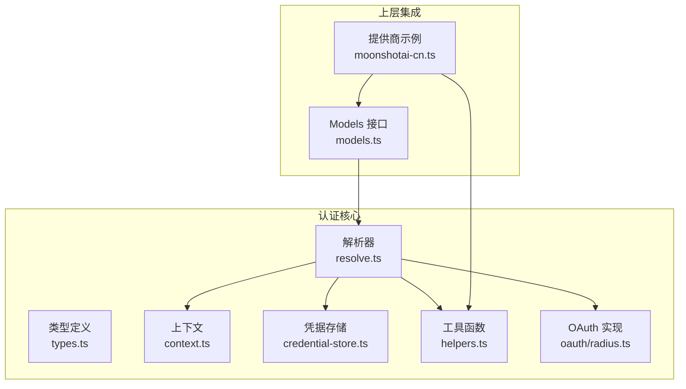
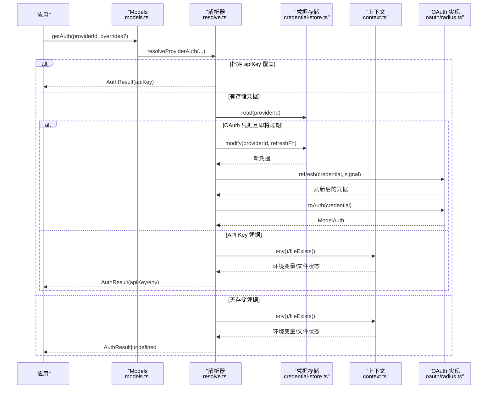
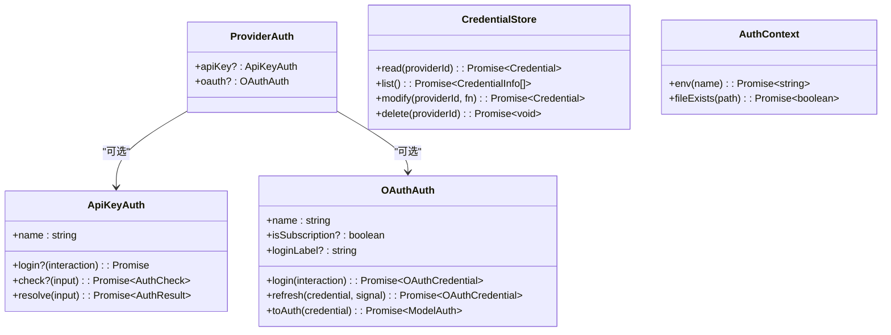
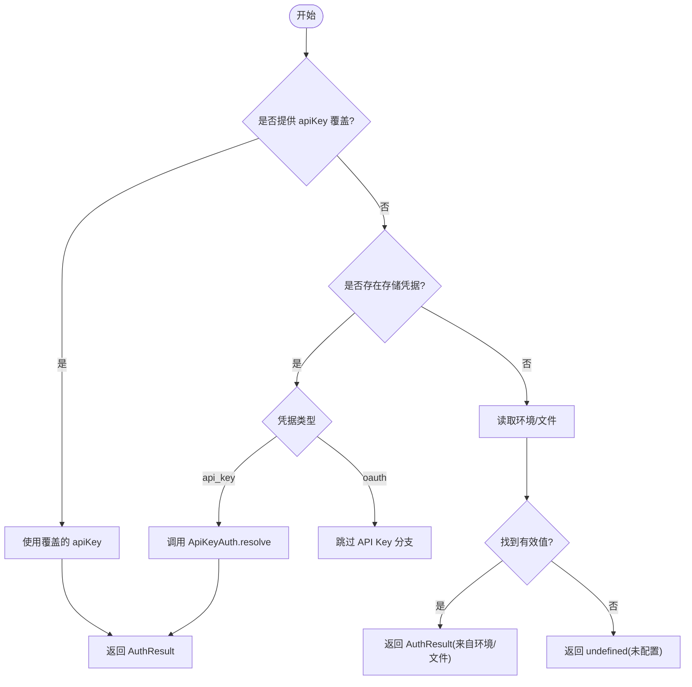
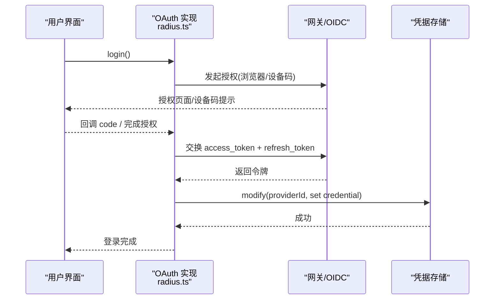
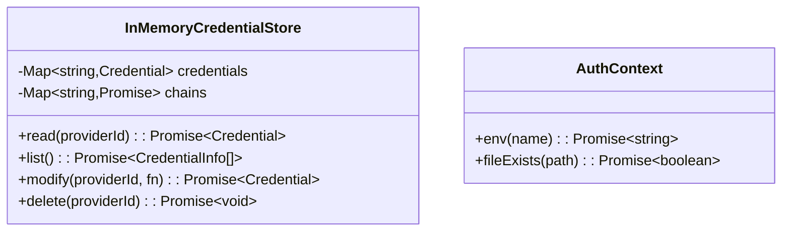
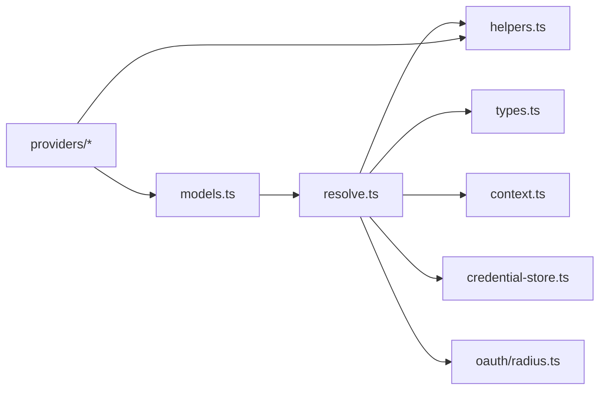

# 认证系统

<cite>
**本文引用的文件**
- [packages/ai/src/auth/types.ts](file://packages/ai/src/auth/types.ts)
- [packages/ai/src/auth/helpers.ts](file://packages/ai/src/auth/helpers.ts)
- [packages/ai/src/auth/context.ts](file://packages/ai/src/auth/context.ts)
- [packages/ai/src/auth/credential-store.ts](file://packages/ai/src/auth/credential-store.ts)
- [packages/ai/src/auth/resolve.ts](file://packages/ai/src/auth/resolve.ts)
- [packages/ai/src/auth/oauth/radius.ts](file://packages/ai/src/auth/oauth/radius.ts)
- [packages/ai/src/models.ts](file://packages/ai/src/models.ts)
- [packages/ai/src/providers/moonshotai-cn.ts](file://packages/ai/src/providers/moonshotai-cn.ts)
</cite>

## 目录
1. [简介](#简介)
2. [项目结构](#项目结构)
3. [核心组件](#核心组件)
4. [架构总览](#架构总览)
5. [详细组件分析](#详细组件分析)
6. [依赖关系分析](#依赖关系分析)
7. [性能考虑](#性能考虑)
8. [故障排查指南](#故障排查指南)
9. [结论](#结论)
10. [附录](#附录)

## 简介
本文件面向统一认证抽象层的设计与实现，覆盖 API Key 管理、OAuth 流程、会话令牌处理、认证上下文管理、凭据存储机制与安全最佳实践。文档同时说明多种认证方式的落地：静态 API Key、环境变量、配置文件、动态获取；并提供配置不同提供商的示例路径、自定义认证提供者的方法、过期与刷新策略、错误处理与调试技巧。

## 项目结构
认证子系统位于 packages/ai/src/auth 下，围绕“类型定义 + 解析器 + 上下文 + 凭据存储 + OAuth 提供者”分层组织：
- 类型与契约：types.ts 定义了凭证、上下文、交互、结果等核心接口。
- 解析与编排：resolve.ts 负责按优先级从覆盖项、已存储凭据、环境/文件等来源解析出最终请求鉴权信息，并处理 OAuth 刷新。
- 上下文与环境：context.ts 提供默认的环境变量与文件系统访问能力（浏览器中降级）。
- 凭据存储：credential-store.ts 提供内存实现的序列化写入与并发安全。
- 通用工具：helpers.ts 提供标准 API Key 解析与懒加载 OAuth 包装。
- OAuth 实现：oauth/radius.ts 演示了基于本地回调的设备码/浏览器授权流程。
- 模型集成：models.ts 将认证解析暴露为 Models.getAuth/login/checkAuth 等高层 API。
- 提供商示例：providers/moonshotai-cn.ts 展示如何使用 envApiKeyAuth 快速接入。

图表来源
- [packages/ai/src/auth/types.ts:1-241](file://packages/ai/src/auth/types.ts#L1-L241)
- [packages/ai/src/auth/resolve.ts:1-206](file://packages/ai/src/auth/resolve.ts#L1-L206)
- [packages/ai/src/auth/context.ts:1-46](file://packages/ai/src/auth/context.ts#L1-L46)
- [packages/ai/src/auth/credential-store.ts:1-68](file://packages/ai/src/auth/credential-store.ts#L1-L68)
- [packages/ai/src/auth/helpers.ts:1-60](file://packages/ai/src/auth/helpers.ts#L1-L60)
- [packages/ai/src/auth/oauth/radius.ts:1-404](file://packages/ai/src/auth/oauth/radius.ts#L1-L404)
- [packages/ai/src/models.ts:1-200](file://packages/ai/src/models.ts#L1-L200)
- [packages/ai/src/providers/moonshotai-cn.ts:1-15](file://packages/ai/src/providers/moonshotai-cn.ts#L1-L15)

章节来源
- [packages/ai/src/auth/types.ts:1-241](file://packages/ai/src/auth/types.ts#L1-L241)
- [packages/ai/src/auth/resolve.ts:1-206](file://packages/ai/src/auth/resolve.ts#L1-L206)
- [packages/ai/src/auth/context.ts:1-46](file://packages/ai/src/auth/context.ts#L1-L46)
- [packages/ai/src/auth/credential-store.ts:1-68](file://packages/ai/src/auth/credential-store.ts#L1-L68)
- [packages/ai/src/auth/helpers.ts:1-60](file://packages/ai/src/auth/helpers.ts#L1-L60)
- [packages/ai/src/auth/oauth/radius.ts:1-404](file://packages/ai/src/auth/oauth/radius.ts#L1-L404)
- [packages/ai/src/models.ts:1-200](file://packages/ai/src/models.ts#L1-L200)
- [packages/ai/src/providers/moonshotai-cn.ts:1-15](file://packages/ai/src/providers/moonshotai-cn.ts#L1-L15)

## 核心组件
- 类型与契约
  - 凭证：ApiKeyCredential、OAuthCredential、Credential、CredentialInfo
  - 上下文：AuthContext（env/fileExists）
  - 交互：AuthInteraction、AuthPrompt、AuthEvent
  - 结果：AuthResult、AuthCheck
  - 提供方认证：ProviderAuth（apiKey 与 oauth 至少其一）
- 解析器
  - resolveProviderAuth：按覆盖项 → 存储凭据 → 环境/文件顺序解析
  - OAuth 双检锁刷新：在临界窗口内串行刷新，避免重复刷新
- 上下文
  - 默认实现读取进程环境变量与本地文件存在性（浏览器中降级）
- 凭据存储
  - InMemoryCredentialStore：按 providerId 序列化写入，支持 read/list/modify/delete
- 工具函数
  - envApiKeyAuth：标准 API Key 登录与解析（优先存储键，其次环境变量）
  - lazyOAuth：懒加载 OAuth 实现，减少包体积
- OAuth 实现
  - Radius：浏览器授权码 + PKCE、设备码两种登录方式，刷新与 toAuth 生成请求头

章节来源
- [packages/ai/src/auth/types.ts:1-241](file://packages/ai/src/auth/types.ts#L1-L241)
- [packages/ai/src/auth/resolve.ts:1-206](file://packages/ai/src/auth/resolve.ts#L1-L206)
- [packages/ai/src/auth/context.ts:1-46](file://packages/ai/src/auth/context.ts#L1-L46)
- [packages/ai/src/auth/credential-store.ts:1-68](file://packages/ai/src/auth/credential-store.ts#L1-L68)
- [packages/ai/src/auth/helpers.ts:1-60](file://packages/ai/src/auth/helpers.ts#L1-L60)
- [packages/ai/src/auth/oauth/radius.ts:1-404](file://packages/ai/src/auth/oauth/radius.ts#L1-L404)

## 架构总览
下图展示了从 Models 到认证解析、凭据存储、环境上下文与 OAuth 调用的整体调用链。

图表来源
- [packages/ai/src/models.ts:156-200](file://packages/ai/src/models.ts#L156-L200)
- [packages/ai/src/auth/resolve.ts:50-110](file://packages/ai/src/auth/resolve.ts#L50-L110)
- [packages/ai/src/auth/credential-store.ts:30-66](file://packages/ai/src/auth/credential-store.ts#L30-L66)
- [packages/ai/src/auth/context.ts:23-45](file://packages/ai/src/auth/context.ts#L23-L45)
- [packages/ai/src/auth/oauth/radius.ts:357-403](file://packages/ai/src/auth/oauth/radius.ts#L357-L403)

## 详细组件分析

### 统一认证抽象层设计
- 目标：以 ProviderAuth 为统一入口，屏蔽 API Key 与 OAuth 的差异，向上提供一致的 AuthResult。
- 关键设计点
  - 优先级：覆盖项 > 存储凭据 > 环境/文件
  - OAuth 刷新：双检锁 + 最小有效期阈值，保证并发安全与稳定性
  - 可插拔：通过 ProviderAuth 组合 apiKey 与 oauth，支持仅环境型提供商
  - 可测试：AuthContext 注入，便于模拟环境与文件

图表来源
- [packages/ai/src/auth/types.ts:166-241](file://packages/ai/src/auth/types.ts#L166-L241)
- [packages/ai/src/auth/types.ts:65-94](file://packages/ai/src/auth/types.ts#L65-L94)
- [packages/ai/src/auth/types.ts:97-110](file://packages/ai/src/auth/types.ts#L97-L110)

章节来源
- [packages/ai/src/auth/types.ts:1-241](file://packages/ai/src/auth/types.ts#L1-L241)

### API Key 管理（静态、环境变量、配置文件、动态获取）
- 静态 API Key：通过覆盖项直接传入，绕过存储与环境
- 环境变量：使用 envApiKeyAuth，按声明的顺序读取环境变量
- 配置文件：通过 AuthContext.fileExists 检测 ~/.aws/credentials 等文件，结合 provider 自定义 resolve 读取
- 动态获取：在 ApiKeyAuth.resolve 中根据上下文动态决定 key/env/baseUrl

图表来源
- [packages/ai/src/auth/resolve.ts:50-110](file://packages/ai/src/auth/resolve.ts#L50-L110)
- [packages/ai/src/auth/helpers.ts:9-31](file://packages/ai/src/auth/helpers.ts#L9-L31)
- [packages/ai/src/auth/context.ts:23-45](file://packages/ai/src/auth/context.ts#L23-L45)

章节来源
- [packages/ai/src/auth/helpers.ts:1-60](file://packages/ai/src/auth/helpers.ts#L1-L60)
- [packages/ai/src/auth/resolve.ts:1-206](file://packages/ai/src/auth/resolve.ts#L1-L206)
- [packages/ai/src/auth/context.ts:1-46](file://packages/ai/src/auth/context.ts#L1-L46)

### OAuth 流程与会话令牌处理
- 登录流程
  - 浏览器授权码 + PKCE：启动本地回调服务器，等待 code，换取 token
  - 设备码：请求 device_code，轮询直至用户完成授权
- 刷新流程
  - 双检锁：在最小有效期阈值内锁定，串行刷新一次，避免并发重复刷新
  - 刷新失败：抛出 ModelsError 并保留原凭据以便重试或重新登录
- toAuth
  - 将凭据转换为请求所需的 ModelAuth（例如注入 Authorization 头）

图表来源
- [packages/ai/src/auth/oauth/radius.ts:220-269](file://packages/ai/src/auth/oauth/radius.ts#L220-L269)
- [packages/ai/src/auth/oauth/radius.ts:305-350](file://packages/ai/src/auth/oauth/radius.ts#L305-L350)
- [packages/ai/src/auth/oauth/radius.ts:357-403](file://packages/ai/src/auth/oauth/radius.ts#L357-L403)
- [packages/ai/src/auth/resolve.ts:127-179](file://packages/ai/src/auth/resolve.ts#L127-L179)

章节来源
- [packages/ai/src/auth/oauth/radius.ts:1-404](file://packages/ai/src/auth/oauth/radius.ts#L1-L404)
- [packages/ai/src/auth/resolve.ts:120-179](file://packages/ai/src/auth/resolve.ts#L120-L179)

### 认证上下文管理与凭据存储机制
- 认证上下文
  - env(name)：读取环境变量（浏览器中不可用）
  - fileExists(path)：检查文件是否存在（支持 ~ 展开）
- 凭据存储
  - 按 providerId 隔离，write 路径唯一（modify），确保并发安全
  - list 不暴露密钥，仅返回元数据
  - delete 用于登出

图表来源
- [packages/ai/src/auth/credential-store.ts:9-66](file://packages/ai/src/auth/credential-store.ts#L9-L66)
- [packages/ai/src/auth/context.ts:23-45](file://packages/ai/src/auth/context.ts#L23-L45)

章节来源
- [packages/ai/src/auth/credential-store.ts:1-68](file://packages/ai/src/auth/credential-store.ts#L1-L68)
- [packages/ai/src/auth/context.ts:1-46](file://packages/ai/src/auth/context.ts#L1-L46)

### 多提供商认证配置示例
- 使用 envApiKeyAuth 快速配置 API Key 提供商
  - 示例路径：[moonshotai-cn 提供商:1-15](file://packages/ai/src/providers/moonshotai-cn.ts#L1-L15)
- 使用 lazyOAuth 懒加载 OAuth 实现（按需引入，减小包体）
  - 参考 helpers 中的包装器：[lazyOAuth:40-59](file://packages/ai/src/auth/helpers.ts#L40-L59)
- 自定义 ApiKeyAuth
  - 在 resolve 中组合 stored.credential.key、ctx.env、provider 特定环境变量或配置文件

章节来源
- [packages/ai/src/providers/moonshotai-cn.ts:1-15](file://packages/ai/src/providers/moonshotai-cn.ts#L1-L15)
- [packages/ai/src/auth/helpers.ts:1-60](file://packages/ai/src/auth/helpers.ts#L1-L60)

### 自定义认证提供者
- 步骤
  - 实现 ProviderAuth：至少包含 apiKey 或 oauth
  - 若为 API Key：实现 ApiKeyAuth.login（可选）、resolve（必须）
  - 若为 OAuth：实现 OAuthAuth.login、refresh、toAuth
  - 通过 createProvider 注册到 Models
- 要点
  - 保持 resolve/toAuth 幂等、无副作用
  - 使用 AuthContext 解耦环境与文件访问
  - 使用 AbortSignal 支持取消与超时

章节来源
- [packages/ai/src/auth/types.ts:166-241](file://packages/ai/src/auth/types.ts#L166-L241)
- [packages/ai/src/models.ts:88-149](file://packages/ai/src/models.ts#L88-L149)

### 认证过期与刷新
- 过期判定：默认剩余有效期小于 5 分钟即触发刷新
- 刷新策略：
  - 在 modify 中串行执行，避免并发重复刷新
  - 刷新失败抛错但保留原凭据，允许重试或引导重新登录
  - 支持 minOAuthValidityMs 强制要求刷新后满足的最小有效期
- 导出场景：某些需要长生命期的 bearer token 的场景可通过设置更高阈值保障

章节来源
- [packages/ai/src/auth/resolve.ts:119-179](file://packages/ai/src/auth/resolve.ts#L119-L179)

### 安全最佳实践
- 最小权限：仅请求必要的 scope
- 传输安全：始终使用 HTTPS
- 本地回调：仅监听 127.0.0.1，校验 state 参数
- 敏感信息：避免日志输出密钥；仅在必要时记录错误摘要
- 超时与取消：所有网络请求支持 AbortSignal，防止悬挂任务
- 刷新保护：使用双检锁与最小有效期，降低重放攻击面

章节来源
- [packages/ai/src/auth/oauth/radius.ts:147-218](file://packages/ai/src/auth/oauth/radius.ts#L147-L218)
- [packages/ai/src/auth/resolve.ts:127-179](file://packages/ai/src/auth/resolve.ts#L127-L179)

### 错误处理与调试技巧
- 错误分类
  - ModelsError.code 区分 auth、oauth、model_source 等
  - OAuth 响应错误封装状态码与描述，便于前端展示
- 常见错误
  - 刷新失败：invalid_grant、网络异常
  - 回调失败：state 不匹配、缺少 code
  - 环境缺失：未设置必要环境变量或配置文件不存在
- 调试建议
  - 启用交互通知：观察 auth_url/device_code/progress
  - 打印来源：AuthResult.source 帮助定位来源（存储/环境/OAuth）
  - 使用覆盖项：临时注入 apiKey 或 env 进行问题隔离

章节来源
- [packages/ai/src/auth/resolve.ts:26-42](file://packages/ai/src/auth/resolve.ts#L26-L42)
- [packages/ai/src/auth/oauth/radius.ts:68-100](file://packages/ai/src/auth/oauth/radius.ts#L68-L100)
- [packages/ai/src/auth/oauth/radius.ts:220-269](file://packages/ai/src/auth/oauth/radius.ts#L220-L269)

## 依赖关系分析
- 模块耦合
  - models.ts 依赖 resolve.ts 暴露高层 API
  - resolve.ts 依赖 types.ts、context.ts、credential-store.ts、helpers.ts、oauth/*
  - providers/* 依赖 helpers.ts 与 models.ts 的 createProvider
- 外部依赖
  - Node.js 环境：node:http（Radius 回调）、node:fs/promises、node:os
  - Web 环境：fetch、crypto.randomUUID

图表来源
- [packages/ai/src/models.ts:1-200](file://packages/ai/src/models.ts#L1-L200)
- [packages/ai/src/auth/resolve.ts:1-206](file://packages/ai/src/auth/resolve.ts#L1-L206)
- [packages/ai/src/auth/types.ts:1-241](file://packages/ai/src/auth/types.ts#L1-L241)
- [packages/ai/src/auth/context.ts:1-46](file://packages/ai/src/auth/context.ts#L1-L46)
- [packages/ai/src/auth/credential-store.ts:1-68](file://packages/ai/src/auth/credential-store.ts#L1-L68)
- [packages/ai/src/auth/helpers.ts:1-60](file://packages/ai/src/auth/helpers.ts#L1-L60)
- [packages/ai/src/auth/oauth/radius.ts:1-404](file://packages/ai/src/auth/oauth/radius.ts#L1-L404)

章节来源
- [packages/ai/src/models.ts:1-200](file://packages/ai/src/models.ts#L1-L200)
- [packages/ai/src/auth/resolve.ts:1-206](file://packages/ai/src/auth/resolve.ts#L1-L206)

## 性能考虑
- 懒加载 OAuth：通过 lazyOAuth 延迟引入，减少初始包体与冷启动时间
- 并发安全：InMemoryCredentialStore 按 providerId 串行化写操作，避免竞态
- 刷新节流：双检锁 + 最小有效期，减少不必要的网络请求
- 信号控制：AbortSignal 与超时，避免长时间阻塞

[本节为通用指导，无需具体文件引用]

## 故障排查指南
- 无法解析 API Key
  - 检查环境变量名与大小写
  - 确认配置文件路径与权限
  - 使用覆盖项快速验证
- OAuth 登录失败
  - 检查回调端口占用与防火墙
  - 核对 state/code_challenge 一致性
  - 查看设备码是否过期或被拒绝
- 刷新失败
  - 检查 refresh_token 是否有效
  - 关注最小有效期是否满足需求
  - 捕获 ModelsError 的 cause 详情

章节来源
- [packages/ai/src/auth/oauth/radius.ts:147-218](file://packages/ai/src/auth/oauth/radius.ts#L147-L218)
- [packages/ai/src/auth/oauth/radius.ts:271-350](file://packages/ai/src/auth/oauth/radius.ts#L271-L350)
- [packages/ai/src/auth/resolve.ts:127-179](file://packages/ai/src/auth/resolve.ts#L127-L179)

## 结论
该认证系统通过统一的 ProviderAuth 抽象，将 API Key 与 OAuth 整合为一致的解析与刷新流程，配合可插拔的上下文与凭据存储，实现了跨环境、可扩展、高可靠的认证体系。借助懒加载、并发安全与严格的错误处理，既保证了易用性，又兼顾了安全性与性能。

[本节为总结，无需具体文件引用]

## 附录
- 常用配置路径
  - 环境变量：process.env（Node）/ import.meta.env（构建期）
  - 配置文件：~/.aws/credentials、~/.config/*（由 provider 自定义读取）
- 典型流程图
  - API Key 解析流程见上文流程图
  - OAuth 登录与刷新序列图见上文

[本节为概念性内容，无需具体文件引用]