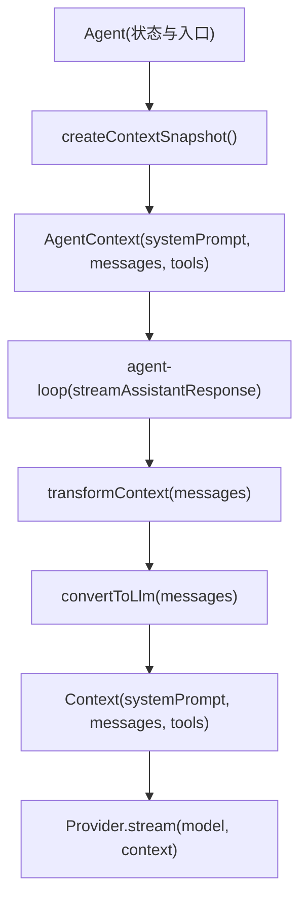
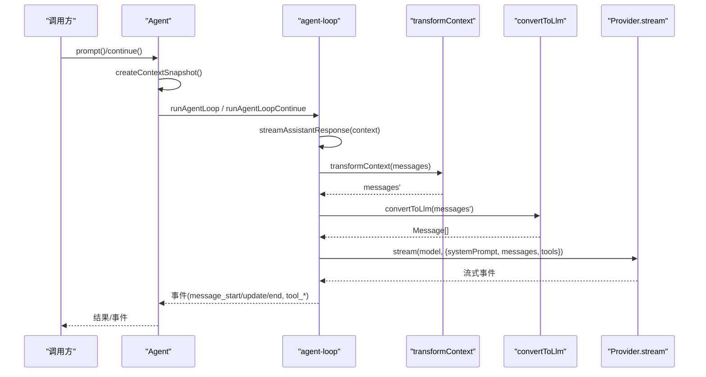
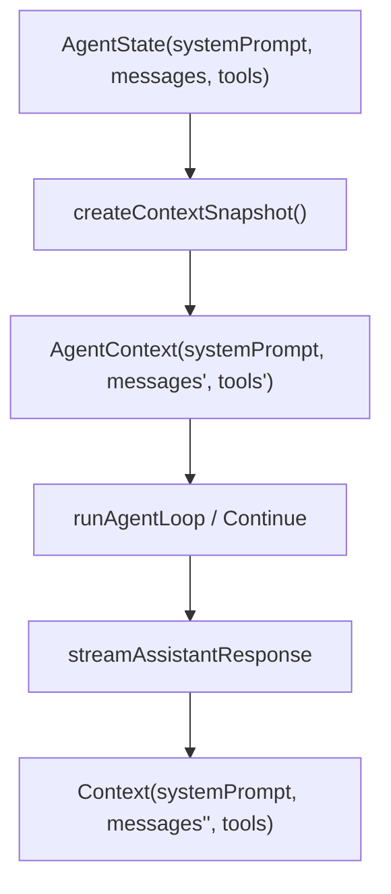
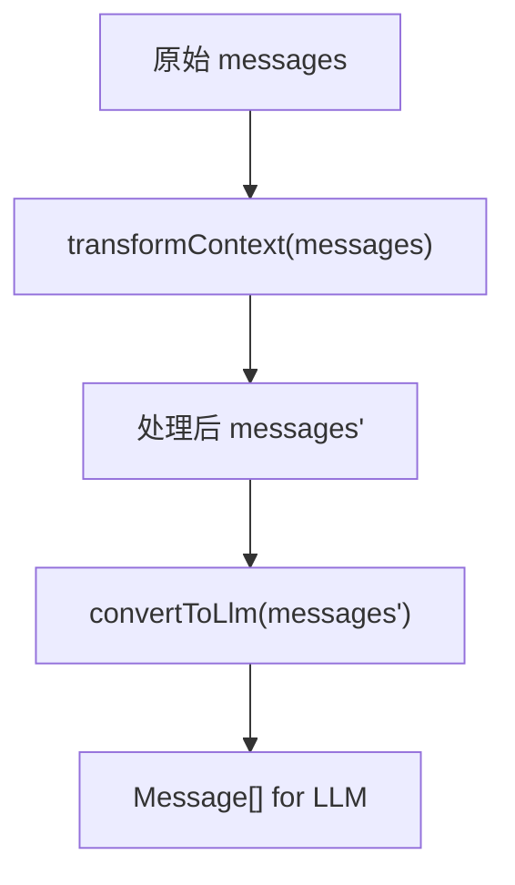
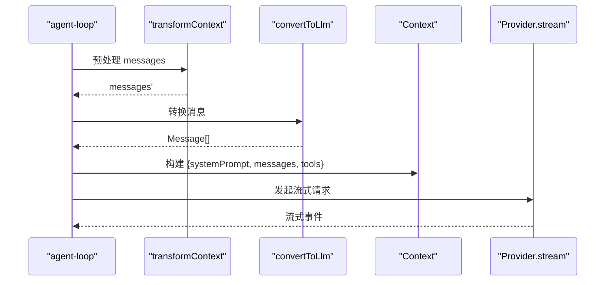
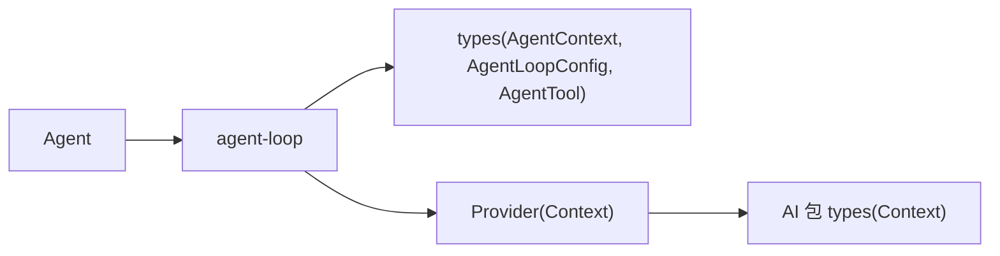

# 上下文管理

<cite>
**本文引用的文件**
- [agent.ts](file://packages/agent/src/agent.ts)
- [agent-loop.ts](file://packages/agent/src/agent-loop.ts)
- [types.ts](file://packages/agent/src/types.ts)
- [README.md](file://packages/agent/README.md)
- [types.ts（AI 包）](file://packages/ai/src/types.ts)
</cite>

## 目录
1. [简介](#简介)
2. [项目结构](#项目结构)
3. [核心组件](#核心组件)
4. [架构总览](#架构总览)
5. [详细组件分析](#详细组件分析)
6. [依赖关系分析](#依赖关系分析)
7. [性能考量](#性能考量)
8. [故障排查指南](#故障排查指南)
9. [结论](#结论)
10. [附录：示例与最佳实践](#附录示例与最佳实践)

## 简介
本技术文档聚焦于 Agent 的上下文管理机制，围绕 AgentContext 的三个核心字段 systemPrompt、messages、tools 展开，解释其含义与管理方式；深入说明 createContextSnapshot() 如何实现上下文快照的创建与隔离；阐述 transformContext 回调在上下文转换中的作用与实现模式；给出设置系统提示、管理对话历史、动态添加工具以及实现上下文预处理/后处理的实践方法；并梳理上下文与 AI 提供商交互的数据流转过程及性能优化策略。

## 项目结构
Agent 的上下文管理由以下关键模块协作完成：
- Agent 类：维护运行时状态（systemPrompt、model、thinkingLevel、tools、messages），提供 prompt/continue 等入口，并在每次调用前创建上下文快照。
- agent-loop：低层循环，负责将 AgentMessage[] 转换为 LLM 可接受的 Message[]，执行工具调用，管理轮次与事件流。
- types：定义 AgentContext、AgentLoopConfig、AgentState、AgentTool 等类型契约。
- AI 包 types：定义 Provider 层使用的 Context（包含 systemPrompt、messages、tools），作为最终发送给模型的数据结构。

图表来源
- [agent.ts:437-443](file://packages/agent/src/agent.ts#L437-L443)
- [agent-loop.ts:281-312](file://packages/agent/src/agent-loop.ts#L281-L312)
- [types.ts:412-419](file://packages/agent/src/types.ts#L412-L419)
- [types.ts（AI 包）:509-513](file://packages/ai/src/types.ts#L509-L513)

章节来源
- [agent.ts:173-238](file://packages/agent/src/agent.ts#L173-L238)
- [agent-loop.ts:155-171](file://packages/agent/src/agent-loop.ts#L155-L171)
- [types.ts:333-358](file://packages/agent/src/types.ts#L333-L358)
- [types.ts:412-419](file://packages/agent/src/types.ts#L412-L419)
- [types.ts（AI 包）:509-513](file://packages/ai/src/types.ts#L509-L513)

## 核心组件
- AgentContext：传递给低层循环的上下文快照，包含：
  - systemPrompt：随请求发送的系统提示。
  - messages：对模型可见的对话历史（AgentMessage[]）。
  - tools：当前运行可用的工具集合（AgentTool[]）。
- AgentState：对外暴露的可变状态，包括 systemPrompt、model、thinkingLevel、tools、messages 等，并提供安全的读写访问器。
- AgentLoopConfig：控制每轮运行的配置，包括 convertToLlm、transformContext、toolExecution、beforeToolCall、afterToolCall、shouldStopAfterTurn、prepareNextTurn 等。
- Context（AI 包）：最终传给 Provider 的结构，包含 systemPrompt、messages、tools。

章节来源
- [types.ts:333-358](file://packages/agent/src/types.ts#L333-L358)
- [types.ts:412-419](file://packages/agent/src/types.ts#L412-L419)
- [types.ts:149-293](file://packages/agent/src/types.ts#L149-L293)
- [types.ts（AI 包）:509-513](file://packages/ai/src/types.ts#L509-L513)

## 架构总览
上下文从 Agent 状态到 Provider 的完整流转如下：
1. Agent.prompt/continue 调用时，通过 createContextSnapshot() 生成 AgentContext 快照。
2. 进入 agent-loop 的 runLoop，逐轮处理消息与工具调用。
3. 在 streamAssistantResponse 中：
   - 可选地执行 transformContext 对 messages 进行预处理（如裁剪旧消息、注入外部上下文）。
   - 通过 convertToLlm 将 AgentMessage[] 转为 LLM 可识别的 Message[]。
   - 构建 Context(systemPrompt, messages, tools) 并调用 Provider.stream。
4. Provider 返回流式响应，agent-loop 将其映射为 AssistantMessage 事件并更新上下文。

图表来源
- [agent.ts:409-435](file://packages/agent/src/agent.ts#L409-L435)
- [agent-loop.ts:281-312](file://packages/agent/src/agent-loop.ts#L281-L312)
- [types.ts:149-200](file://packages/agent/src/types.ts#L149-L200)

## 详细组件分析

### AgentContext 结构与职责
- systemPrompt：字符串，作为系统提示随请求发送，用于设定模型行为与角色。
- messages：AgentMessage[]，对模型可见的对话历史，包含 user、assistant、toolResult 等标准消息，也可扩展自定义消息类型。
- tools：AgentTool[]，当前运行可用的工具列表，供模型在回复中调用。

AgentContext 是“只读”的快照，确保一次运行内的上下文一致性，避免并发或后续修改影响当前轮次的请求。

章节来源
- [types.ts:412-419](file://packages/agent/src/types.ts#L412-L419)
- [agent-loop.ts:297-302](file://packages/agent/src/agent-loop.ts#L297-L302)

### createContextSnapshot()：快照创建与隔离
- 作用：在每次 prompt/continue 启动前，复制当前 AgentState 的 systemPrompt、messages、tools，生成独立的 AgentContext。
- 隔离机制：使用数组切片（slice）创建浅拷贝，避免后续对 state 的修改污染当前运行上下文。
- 传递路径：snapshot 传入 runAgentLoop/runAgentLoopContinue，随后在 streamAssistantResponse 中用于构建最终的 Context。

图表来源
- [agent.ts:437-443](file://packages/agent/src/agent.ts#L437-L443)
- [agent-loop.ts:281-312](file://packages/agent/src/agent-loop.ts#L281-L312)

章节来源
- [agent.ts:437-443](file://packages/agent/src/agent.ts#L437-L443)

### 上下文转换机制：transformContext
- 触发点：在 streamAssistantResponse 中，convertToLlm 之前执行。
- 输入输出：接收 AgentMessage[]，返回新的 AgentMessage[]。
- 典型用途：
  - 上下文窗口管理：根据 token 估算裁剪旧消息，保留最近对话。
  - 注入外部上下文：例如检索增强生成的片段、用户偏好等。
- 安全契约：不得抛出异常；应返回安全降级值。

图表来源
- [agent-loop.ts:288-295](file://packages/agent/src/agent-loop.ts#L288-L295)
- [types.ts:180-200](file://packages/agent/src/types.ts#L180-L200)

章节来源
- [agent-loop.ts:288-295](file://packages/agent/src/agent-loop.ts#L288-L295)
- [types.ts:180-200](file://packages/agent/src/types.ts#L180-L200)
- [README.md:55-63](file://packages/agent/README.md#L55-L63)

### 数据流转：从 AgentMessage 到 Provider Context
- 步骤：
  1) transformContext 对 messages 做预处理。
  2) convertToLlm 过滤/转换自定义消息为标准 LLM 消息。
  3) 构建 Context(systemPrompt, messages, tools)。
  4) 调用 Provider.stream 获取流式响应。
- 关键点：
  - systemPrompt 来自 AgentContext，不经过 transformContext。
  - tools 直接透传到 Provider，供模型在回复中调用。
  - getApiKey 支持动态解析 API Key，适用于短期令牌场景。

图表来源
- [agent-loop.ts:288-312](file://packages/agent/src/agent-loop.ts#L288-L312)
- [types.ts:149-210](file://packages/agent/src/types.ts#L149-L210)
- [types.ts（AI 包）:509-513](file://packages/ai/src/types.ts#L509-L513)

章节来源
- [agent-loop.ts:288-312](file://packages/agent/src/agent-loop.ts#L288-L312)
- [types.ts:149-210](file://packages/agent/src/types.ts#L149-L210)
- [types.ts（AI 包）:509-513](file://packages/ai/src/types.ts#L509-L513)

### 工具管理与执行钩子
- 工具定义：AgentTool 包含 name、description、parameters、execute 等，支持 executionMode 控制并行/串行。
- 执行流程：
  - beforeToolCall：参数校验后、执行前，可阻止执行或附加 terminate 提示。
  - afterToolCall：执行完成后，可覆盖 result 的部分字段（content、details、isError、usage、terminate）。
- 批量执行：支持 sequential 与 parallel 两种模式，parallel 模式下工具可并发执行，但结果按源顺序持久化。

章节来源
- [types.ts:385-409](file://packages/agent/src/types.ts#L385-L409)
- [types.ts:270-293](file://packages/agent/src/types.ts#L270-L293)
- [agent-loop.ts:411-554](file://packages/agent/src/agent-loop.ts#L411-L554)

### 轮次控制与会话延续
- shouldStopAfterTurn：在一轮结束后决定是否提前终止，避免上下文过满。
- prepareNextTurn：可在轮次间替换 context/model/thinkingLevel，实现上下文切换或预算调整。
- continue：从现有上下文继续，不添加新消息，常用于重试。

章节来源
- [types.ts:212-231](file://packages/agent/src/types.ts#L212-L231)
- [agent-loop.ts:226-245](file://packages/agent/src/agent-loop.ts#L226-L245)
- [agent.ts:360-388](file://packages/agent/src/agent.ts#L360-L388)

## 依赖关系分析
- Agent 依赖 agent-loop 提供的低层循环能力，并通过 createLoopConfig 注入转换与执行钩子。
- agent-loop 依赖 types 中的 AgentContext、AgentLoopConfig、AgentTool 等类型契约。
- 最终 Provider 层使用 AI 包的 Context 类型，包含 systemPrompt、messages、tools。

图表来源
- [agent.ts:445-484](file://packages/agent/src/agent.ts#L445-L484)
- [agent-loop.ts:155-171](file://packages/agent/src/agent-loop.ts#L155-L171)
- [types.ts:149-293](file://packages/agent/src/types.ts#L149-L293)
- [types.ts（AI 包）:509-513](file://packages/ai/src/types.ts#L509-L513)

章节来源
- [agent.ts:445-484](file://packages/agent/src/agent.ts#L445-L484)
- [agent-loop.ts:155-171](file://packages/agent/src/agent-loop.ts#L155-L171)
- [types.ts:149-293](file://packages/agent/src/types.ts#L149-L293)
- [types.ts（AI 包）:509-513](file://packages/ai/src/types.ts#L509-L513)

## 性能考量
- 上下文窗口管理：
  - 在 transformContext 中基于 token 估算裁剪旧消息，避免超出模型上下文限制。
  - 使用 shouldStopAfterTurn 在上下文接近上限时主动停止，减少无效请求。
- 工具执行优化：
  - 默认 parallel 模式提升吞吐；对需要严格顺序的工具可设置为 sequential。
  - beforeToolCall/afterToolCall 可用于快速失败或结果合并，降低不必要开销。
- Provider 交互：
  - getApiKey 支持动态刷新短期令牌，避免过期导致的重试成本。
  - sessionId 可启用缓存亲和性，提高缓存命中率。
- 资源清理：
  - finishRun 重置 isStreaming、streamingMessage、pendingToolCalls 等状态，防止内存泄漏。

章节来源
- [agent-loop.ts:288-312](file://packages/agent/src/agent-loop.ts#L288-L312)
- [agent-loop.ts:411-554](file://packages/agent/src/agent-loop.ts#L411-L554)
- [agent.ts:529-535](file://packages/agent/src/agent.ts#L529-L535)
- [types.ts:202-210](file://packages/agent/src/types.ts#L202-L210)

## 故障排查指南
- 常见错误：
  - 无法继续：当上下文为空或最后一条消息为 assistant 时，continue 会报错。
  - 工具未找到：工具名称不存在时，立即返回错误结果。
  - 输出截断：当模型输出被 token 限制截断时，相关工具调用会被标记为错误，需重新发起。
- 调试建议：
  - 订阅事件：监听 message_start/update/end、tool_execution_* 等事件，定位问题阶段。
  - 检查 transformContext：确认是否正确地裁剪或注入了上下文。
  - 验证 convertToLlm：确保自定义消息被正确过滤或转换。
  - 使用 shouldStopAfterTurn：在上下文过大时主动停止，避免无效请求。

章节来源
- [agent-loop.ts:70-76](file://packages/agent/src/agent-loop.ts#L70-L76)
- [agent-loop.ts:600-668](file://packages/agent/src/agent-loop.ts#L600-L668)
- [agent-loop.ts:381-406](file://packages/agent/src/agent-loop.ts#L381-L406)
- [agent.ts:511-527](file://packages/agent/src/agent.ts#L511-L527)

## 结论
Agent 的上下文管理通过 AgentContext 快照、transformContext 预处理、convertToLlm 转换与 Provider Context 构建形成清晰的数据流水线。createContextSnapshot() 确保了运行期的上下文隔离，而工具执行钩子与轮次控制提供了灵活的扩展点。结合上下文窗口管理与并行工具执行，可在保证稳定性的同时提升性能。

## 附录：示例与最佳实践
- 设置系统提示：
  - 通过 initialState.systemPrompt 或在运行期间更新 agent.state.systemPrompt。
- 管理对话历史：
  - 使用 agent.state.messages 追加或替换消息；注意顶部数组赋值会复制。
- 动态添加工具：
  - 通过 agent.state.tools 设置工具列表；支持 per-tool 的 executionMode。
- 上下文预处理/后处理：
  - 在 transformContext 中裁剪旧消息或注入外部上下文。
  - 在 convertToLlm 中过滤 UI 专用消息或转换自定义类型。
- 与 AI 提供商交互：
  - 通过 getApiKey 动态解析令牌；通过 sessionId 启用缓存亲和性。
- 性能优化：
  - 合理设置 toolExecution 模式；使用 shouldStopAfterTurn 控制上下文大小；利用 afterToolCall 合并结果或提前终止。

章节来源
- [README.md:176-243](file://packages/agent/README.md#L176-L243)
- [README.md:289-303](file://packages/agent/README.md#L289-L303)
- [README.md:403-438](file://packages/agent/README.md#L403-L438)
- [types.ts:149-210](file://packages/agent/src/types.ts#L149-L210)
- [agent.ts:68-95](file://packages/agent/src/agent.ts#L68-L95)