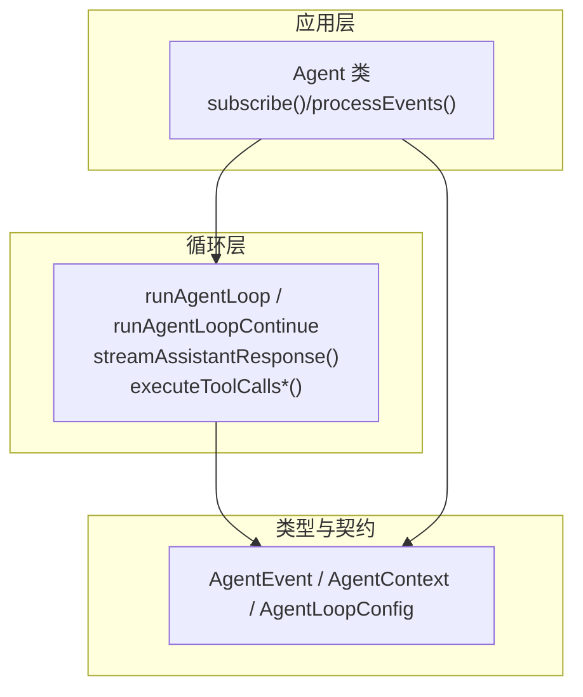
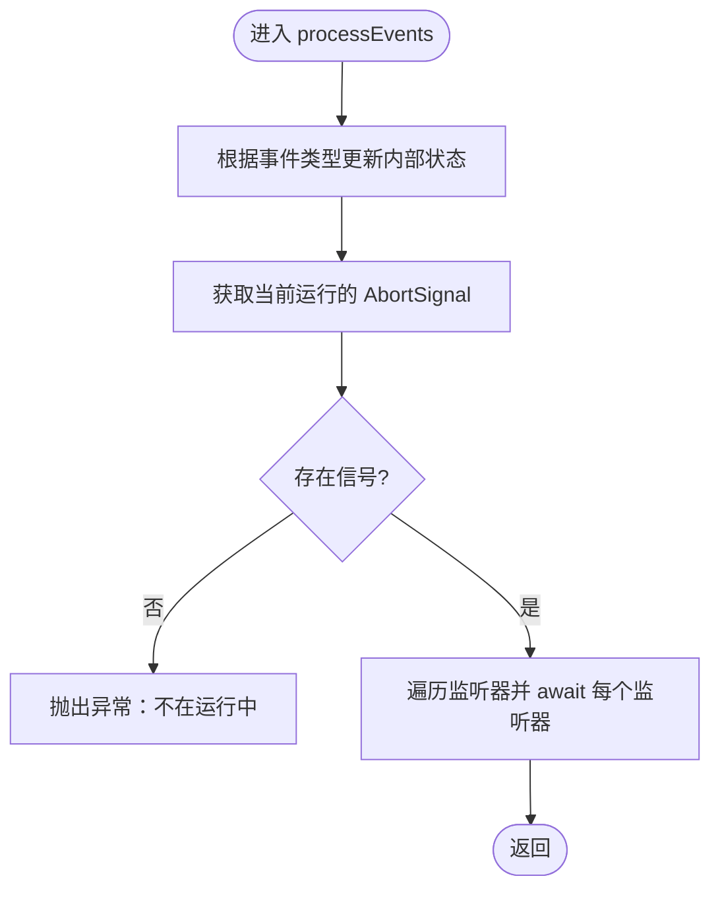
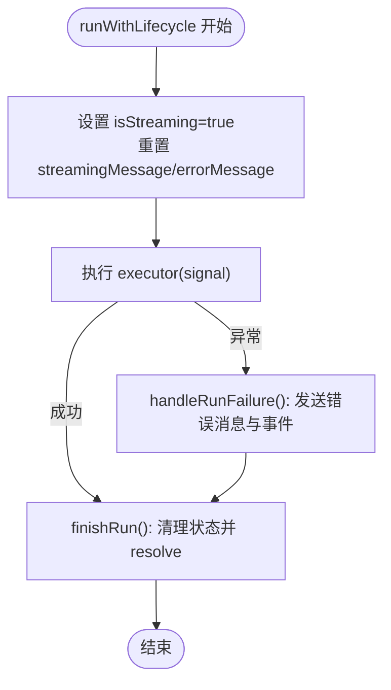
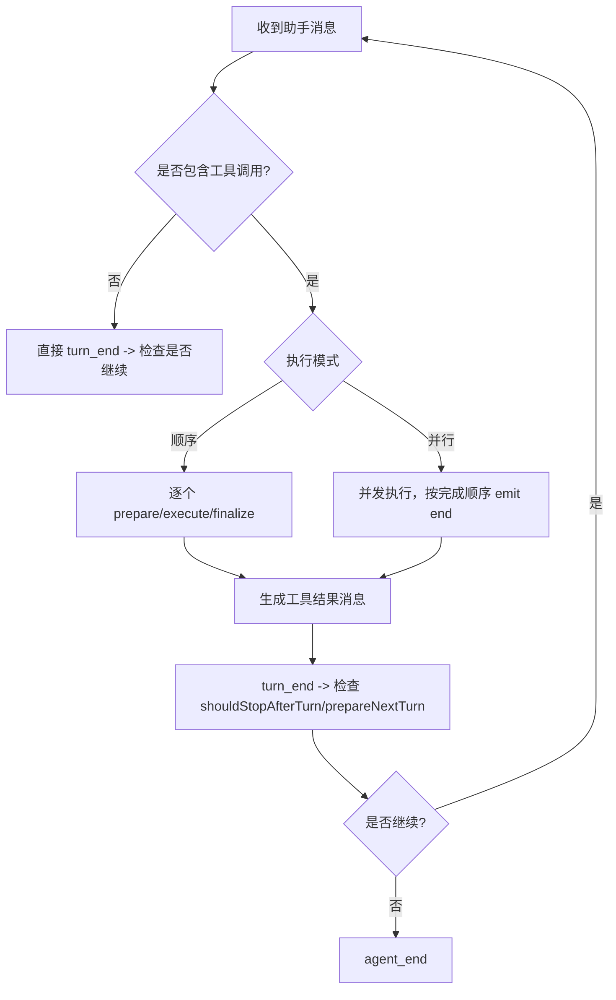
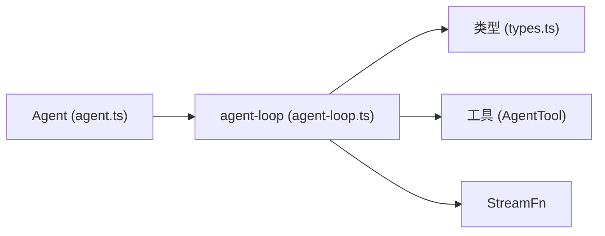

# 事件处理系统

<cite>
**本文引用的文件**
- [agent.ts](file://packages/agent/src/agent.ts)
- [agent-loop.ts](file://packages/agent/src/agent-loop.ts)
- [types.ts](file://packages/agent/src/types.ts)
- [agent.test.ts](file://packages/agent/test/agent.test.ts)
</cite>

## 目录
1. [简介](#简介)
2. [项目结构](#项目结构)
3. [核心组件](#核心组件)
4. [架构总览](#架构总览)
5. [详细组件分析](#详细组件分析)
6. [依赖关系分析](#依赖关系分析)
7. [性能考量](#性能考量)
8. [故障排查指南](#故障排查指南)
9. [结论](#结论)
10. [附录](#附录)

## 简介
本技术文档聚焦于 Agent 类的事件处理系统，系统性阐述以下要点：
- Agent 的订阅机制 subscribe() 与监听器管理
- 各类事件（message_start、message_update、message_end、tool_execution_start、tool_execution_end、turn_end、agent_end）的处理逻辑
- 事件处理流程 processEvents() 的状态更新与监听器调用机制
- 如何注册事件监听器、处理不同类型事件，并在事件中访问 AbortSignal 进行异步控制
- 事件系统与代理状态同步机制及错误传播方式

## 项目结构
Agent 事件系统由三层构成：
- 高层封装：Agent 类负责生命周期、状态维护、事件分发与队列管理
- 循环引擎：agent-loop.ts 实现主循环、消息流式处理、工具调用编排与事件发射
- 类型契约：types.ts 定义事件类型、配置项、上下文与工具接口



图表来源
- [agent.ts:173-591](file://packages/agent/src/agent.ts#L173-L591)
- [agent-loop.ts:95-275](file://packages/agent/src/agent-loop.ts#L95-L275)
- [types.ts:421-444](file://packages/agent/src/types.ts#L421-L444)

章节来源
- [agent.ts:173-591](file://packages/agent/src/agent.ts#L173-L591)
- [agent-loop.ts:95-275](file://packages/agent/src/agent-loop.ts#L95-L275)
- [types.ts:421-444](file://packages/agent/src/types.ts#L421-L444)

## 核心组件
- Agent 类
  - 维护当前会话状态（消息、工具、流式消息、待执行工具集合、错误信息）
  - 提供 subscribe(listener) 注册事件监听器，返回取消订阅函数
  - 通过 processEvents(event) 统一更新内部状态并顺序 await 所有监听器
  - 暴露 steer/followUp 等队列能力，支持运行中注入或追加消息
  - 提供 abort/waitForIdle/reset 等运行时控制

- 事件循环（agent-loop.ts）
  - runAgentLoop/runAgentLoopContinue 启动一轮或多轮对话
  - streamAssistantResponse 将 AgentMessage 转换为 LLM 消息并流式消费，按事件类型发射 message_* 事件
  - executeToolCalls* 负责工具调用的准备、执行、结果汇总与 tool_execution_* 事件发射
  - 在 turn_end 后根据 shouldStopAfterTurn/prepareNextTurn 决定是否继续下一轮

- 类型与配置（types.ts）
  - AgentEvent 联合类型定义了全部事件形态
  - AgentLoopConfig 定义了 convertToLlm、transformContext、before/afterToolCall、shouldStopAfterTurn、prepareNextTurn、getSteeringMessages/getFollowUpMessages 等扩展点
  - AgentState/AgentContext/AgentTool 等用于状态与上下文传递

章节来源
- [agent.ts:173-591](file://packages/agent/src/agent.ts#L173-L591)
- [agent-loop.ts:95-275](file://packages/agent/src/agent-loop.ts#L95-L275)
- [types.ts:149-293](file://packages/agent/src/types.ts#L149-L293)
- [types.ts:320-444](file://packages/agent/src/types.ts#L320-L444)

## 架构总览
下图展示了从 prompt/continue 到事件分发的完整调用链，以及 Agent 状态与事件流的交互。

```mermaid
sequenceDiagram
participant App as "调用方"
participant Agent as "Agent"
participant Loop as "agent-loop"
participant Stream as "StreamFn"
participant Tools as "工具执行"
App->>Agent : prompt()/continue()
Agent->>Loop : runAgentLoop/Continue(...)
Loop->>Stream : 开始流式请求
Stream-->>Loop : start/text_delta/toolcall_delta...
Loop-->>Agent : emit(message_start/update/end)
alt 包含工具调用
Loop->>Tools : executeToolCalls*()
Tools-->>Loop : tool_execution_start/end/update
Loop-->>Agent : emit(tool_execution_*)
end
Loop-->>Agent : emit(turn_end)
Loop-->>Agent : emit(agent_end)
Agent-->>App : 完成await 所有监听器
```

图表来源
- [agent.ts:409-435](file://packages/agent/src/agent.ts#L409-L435)
- [agent-loop.ts:95-275](file://packages/agent/src/agent-loop.ts#L95-L275)
- [agent-loop.ts:281-372](file://packages/agent/src/agent-loop.ts#L281-L372)
- [agent-loop.ts:411-554](file://packages/agent/src/agent-loop.ts#L411-L554)

## 详细组件分析

### Agent 订阅与监听器管理（subscribe）
- 监听器存储：使用 Set 保存监听器，保证插入顺序与去重
- 订阅行为：subscribe(listener) 将监听器加入集合，并返回一个移除监听器的函数
- 事件分发：processEvents(event) 先更新内部状态，再顺序 await 每个监听器；若监听器为 Promise，则等待其 settle
- 中止信号：每次分发事件时，都会传入当前运行的 AbortSignal，供监听器进行异步取消控制
- 空闲语义：waitForIdle() 会等待 activeRun 的 promise 完成，该 promise 在所有 agent_end 监听器 settle 后才 resolve



图表来源
- [agent.ts:544-591](file://packages/agent/src/agent.ts#L544-L591)

章节来源
- [agent.ts:173-253](file://packages/agent/src/agent.ts#L173-L253)
- [agent.ts:313-330](file://packages/agent/src/agent.ts#L313-L330)
- [agent.ts:544-591](file://packages/agent/src/agent.ts#L544-L591)

### 事件类型与处理逻辑
- message_start
  - 触发时机：用户消息、助手消息开始、工具结果消息开始时
  - 状态更新：设置 streamingMessage 为当前消息
  - 典型来源：prompt 初始消息、流式响应 start、工具结果消息

- message_update
  - 触发时机：助手消息流式增量更新（文本/思考/工具调用片段）
  - 状态更新：替换 streamingMessage 的最新副本
  - 典型来源：streamAssistantResponse 中的 text_delta/thinking_delta/toolcall_delta

- message_end
  - 触发时机：一条消息完成（包括最终助手消息与工具结果消息）
  - 状态更新：清空 streamingMessage，并将消息追加到 messages 数组
  - 典型来源：流式 done/error、工具结果消息

- tool_execution_start
  - 触发时机：单个工具调用开始执行前
  - 状态更新：将 toolCallId 加入 pendingToolCalls 集合
  - 典型来源：顺序/并行工具执行入口

- tool_execution_end
  - 触发时机：单个工具调用结束（成功或失败）
  - 状态更新：从 pendingToolCalls 移除 toolCallId
  - 典型来源：工具执行完成后的 finalize 阶段

- turn_end
  - 触发时机：一轮助手响应及其工具调用/结果完成后
  - 状态更新：若消息包含 errorMessage，则记录到 errorMessage
  - 典型来源：每轮循环结束

- agent_end
  - 触发时机：整次运行结束（可能因正常停止、shouldStopAfterTurn、错误或中止）
  - 状态更新：清空 streamingMessage
  - 典型来源：runLoop 末尾或错误路径

章节来源
- [agent.ts:544-591](file://packages/agent/src/agent.ts#L544-L591)
- [agent-loop.ts:109-117](file://packages/agent/src/agent-loop.ts#L109-L117)
- [agent-loop.ts:181-224](file://packages/agent/src/agent-loop.ts#L181-L224)
- [agent-loop.ts:317-371](file://packages/agent/src/agent-loop.ts#L317-L371)
- [agent-loop.ts:444-476](file://packages/agent/src/agent-loop.ts#L444-L476)
- [agent-loop.ts:767-796](file://packages/agent/src/agent-loop.ts#L767-L796)

### 事件处理流程（processEvents）与状态同步
- 状态一致性：所有对 messages/streamingMessage/pendingToolCalls/errorMessage 的变更均在 processEvents 内集中完成，确保事件与状态严格一致
- 监听器顺序：监听器按注册顺序依次 await，避免并发竞争导致 UI 或日志错乱
- 中止传播：processEvents 中获取 activeRun.abortController.signal，并传递给每个监听器，便于外部异步任务及时退出
- 错误路径：当 runWithLifecycle 捕获异常时，构造错误消息并通过 message_start/message_end/turn_end/agent_end 序列发出，保证事件完整性



图表来源
- [agent.ts:486-535](file://packages/agent/src/agent.ts#L486-L535)

章节来源
- [agent.ts:486-535](file://packages/agent/src/agent.ts#L486-L535)

### 工具执行事件与批处理终止
- 顺序执行：逐个工具调用 prepare -> execute -> finalize，期间持续 emit tool_execution_start/update/end
- 并行执行：预检查工具调用参数，随后并发执行；tool_execution_end 按完成顺序发出，工具结果消息按源顺序发出
- 批量终止：当一批工具结果全部设置 terminate=true 时，循环提前结束，不再发起下一次 LLM 调用
- 截断保护：若助手输出被 token 限制截断，对应工具调用会被标记为错误并跳过执行，避免执行不完整参数



图表来源
- [agent-loop.ts:192-275](file://packages/agent/src/agent-loop.ts#L192-L275)
- [agent-loop.ts:411-554](file://packages/agent/src/agent-loop.ts#L411-L554)
- [agent-loop.ts:582-584](file://packages/agent/src/agent-loop.ts#L582-L584)

章节来源
- [agent-loop.ts:411-554](file://packages/agent/src/agent-loop.ts#L411-L554)
- [agent-loop.ts:582-584](file://packages/agent/src/agent-loop.ts#L582-L584)

### 如何在事件中访问 AbortSignal 进行异步控制
- 订阅回调签名：(event, signal) => ...，signal 来自当前运行的 AbortController
- 使用建议：在监听器中进行长耗时操作时，定期检查 signal.aborted，必要时提前退出
- 工具执行：工具 execute 同样接收 signal，可在执行过程中响应中止
- 测试验证：测试用例展示了在 agent_start 事件中捕获 signal，并在后续通过 agent.abort() 使其变为已中止

章节来源
- [agent.ts:250-253](file://packages/agent/src/agent.ts#L250-L253)
- [agent.ts:584-591](file://packages/agent/src/agent.ts#L584-L591)
- [agent.test.ts:263-299](file://packages/agent/test/agent.test.ts#L263-L299)

### 示例：注册事件监听器与处理不同类型事件
- 注册监听器：调用 agent.subscribe(listener)，listener 可区分 event.type 进行处理
- 处理 message_start/update/end：可用于渲染流式文本、累积助手回复
- 处理 tool_execution_start/end：可用于追踪工具进度、统计耗时
- 处理 turn_end/agent_end：可用于刷新界面、提交日志、释放资源
- 参考测试用例中的事件收集与断言，了解事件序列与状态变化

章节来源
- [agent.test.ts:137-188](file://packages/agent/test/agent.test.ts#L137-L188)
- [agent.test.ts:190-261](file://packages/agent/test/agent.test.ts#L190-L261)

## 依赖关系分析
- Agent 依赖 agent-loop 提供的 runAgentLoop/runAgentLoopContinue 与事件发射回调
- agent-loop 依赖 types.ts 定义的 AgentEvent、AgentLoopConfig、AgentContext 等类型
- 工具执行依赖 AgentTool.execute 与 before/afterToolCall 钩子
- 流式响应依赖 StreamFn，将底层模型事件映射为 message_* 事件



图表来源
- [agent.ts:173-591](file://packages/agent/src/agent.ts#L173-L591)
- [agent-loop.ts:95-275](file://packages/agent/src/agent-loop.ts#L95-L275)
- [types.ts:149-293](file://packages/agent/src/types.ts#L149-L293)

章节来源
- [agent.ts:173-591](file://packages/agent/src/agent.ts#L173-L591)
- [agent-loop.ts:95-275](file://packages/agent/src/agent-loop.ts#L95-L275)
- [types.ts:149-293](file://packages/agent/src/types.ts#L149-L293)

## 性能考量
- 监听器顺序 await：避免竞态，但长耗时监听器会阻塞后续事件处理；建议在监听器中使用异步且可中断的逻辑
- 工具并行执行：默认并行提升吞吐，但需关注资源竞争与速率限制；可通过工具级 executionMode 或全局 toolExecution 调整
- 流式更新频率：message_update 高频触发，UI 侧应做节流或合并渲染
- 批量终止：利用 terminate 标志减少不必要的后续 LLM 调用，降低延迟与成本

[本节为通用指导，不直接分析具体文件]

## 故障排查指南
- 常见错误场景
  - 重复运行：同时只能有一个 activeRun，重复 prompt/continue 会抛错
  - 非运行中监听：若在 activeRun 外调用 processEvents 相关逻辑会抛错
  - 工具未找到/参数校验失败：beforeToolCall 或 prepare 阶段会返回错误结果
  - 输出截断：助手消息被截断时，工具调用将被标记为错误并跳过执行

- 定位方法
  - 检查 state.errorMessage 与最后一条消息的 stopReason/errorMessage
  - 通过事件序列确认是否在预期位置发生错误（如 turn_end/agent_end）
  - 在 before/afterToolCall 钩子中打印上下文与信号状态，辅助定位中止原因

章节来源
- [agent.ts:347-388](file://packages/agent/src/agent.ts#L347-L388)
- [agent.ts:486-535](file://packages/agent/src/agent.ts#L486-L535)
- [agent-loop.ts:600-668](file://packages/agent/src/agent-loop.ts#L600-L668)
- [agent-loop.ts:381-406](file://packages/agent/src/agent-loop.ts#L381-L406)

## 结论
Agent 事件系统以“状态优先、事件驱动”的方式组织：
- 所有状态变更集中在 processEvents 中完成，确保事件与状态强一致
- 监听器顺序 await 并提供 AbortSignal，便于构建可中断、可观测的异步管线
- 工具执行支持顺序/并行两种模式，并通过 terminate 实现批级早停
- 错误路径通过标准事件序列上报，保障 UI 与日志的一致性

[本节为总结性内容，不直接分析具体文件]

## 附录
- 事件类型速查
  - agent_start/agent_end：运行生命周期
  - turn_start/turn_end：一轮助手响应与工具调用周期
  - message_start/update/end：消息生命周期（用户/助手/工具结果）
  - tool_execution_start/update/end：工具执行生命周期

- 关键扩展点
  - convertToLlm：将 AgentMessage 转为 LLM 消息
  - transformContext：在转换前对上下文进行裁剪或增强
  - beforeToolCall/afterToolCall：工具执行前后钩子
  - shouldStopAfterTurn/prepareNextTurn：控制是否继续下一轮与下一轮上下文
  - getSteeringMessages/getFollowUpMessages：运行中注入或追加消息

章节来源
- [types.ts:149-293](file://packages/agent/src/types.ts#L149-L293)
- [types.ts:421-444](file://packages/agent/src/types.ts#L421-L444)