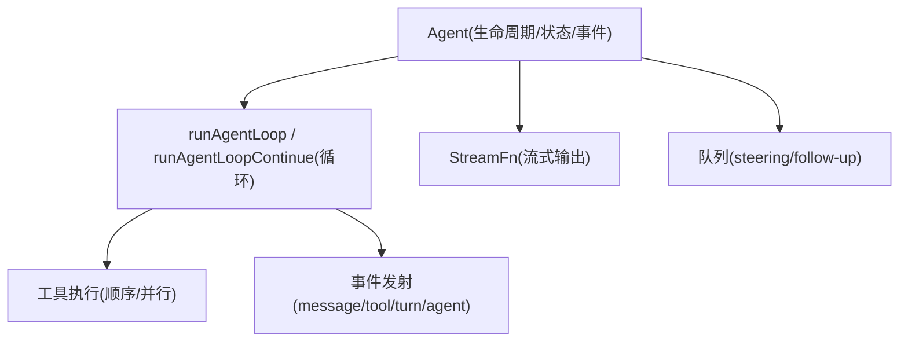
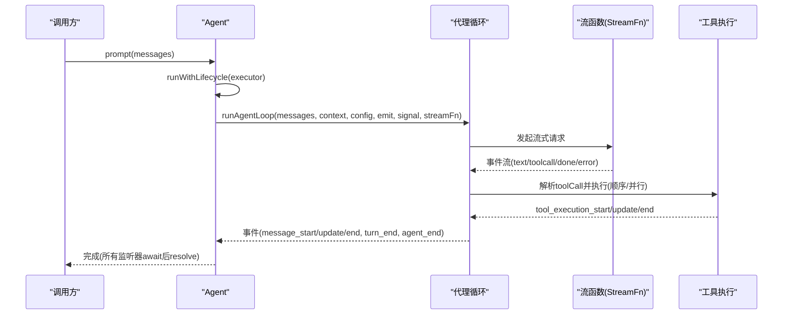
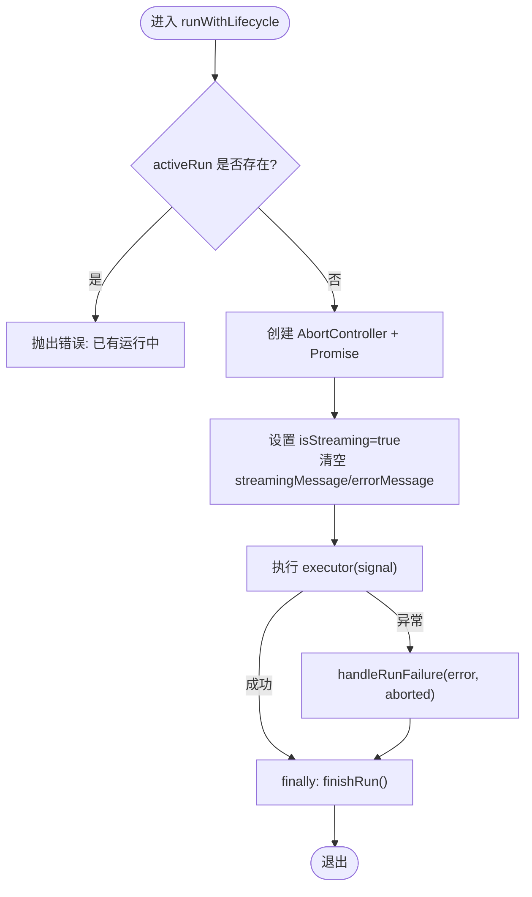
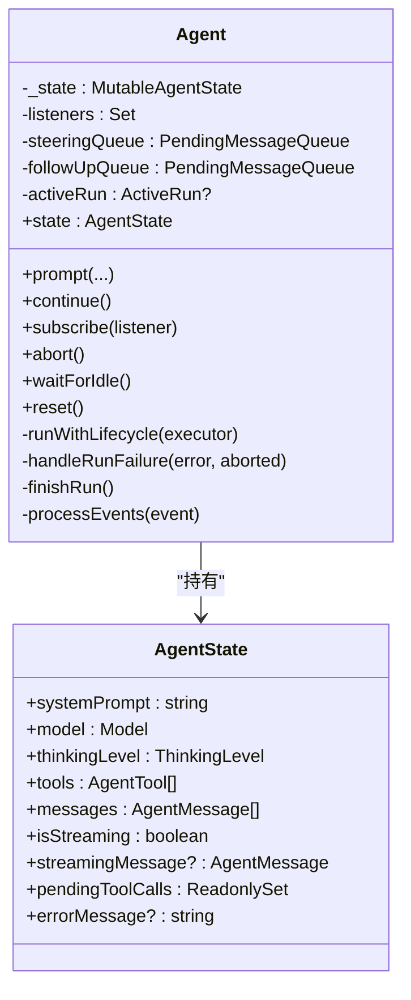
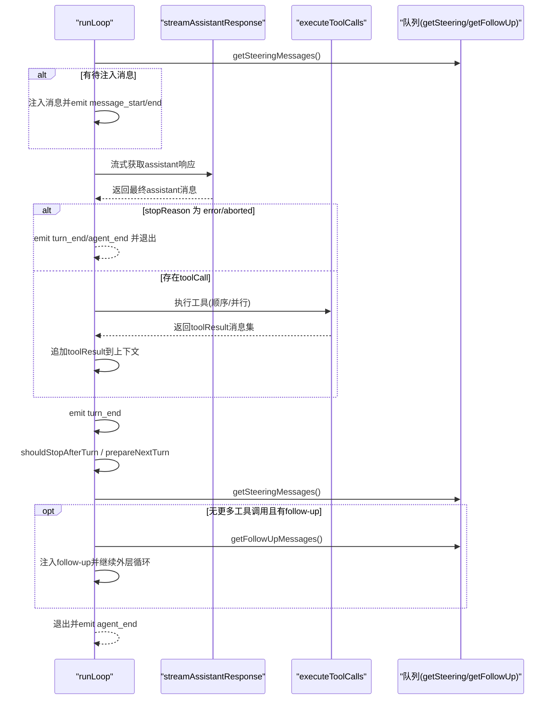
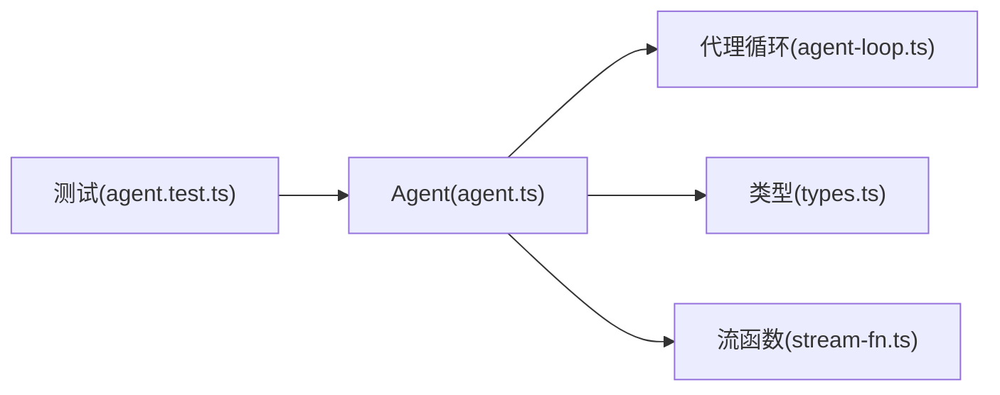

# 代理生命周期管理

<cite>
**本文引用的文件**
- [agent.ts](file://packages/agent/src/agent.ts)
- [types.ts](file://packages/agent/src/types.ts)
- [agent-loop.ts](file://packages/agent/src/agent-loop.ts)
- [stream-fn.ts](file://packages/agent/src/stream-fn.ts)
- [agent.test.ts](file://packages/agent/test/agent.test.ts)
</cite>

## 目录
1. [简介](#简介)
2. [项目结构](#项目结构)
3. [核心组件](#核心组件)
4. [架构总览](#架构总览)
5. [详细组件分析](#详细组件分析)
6. [依赖关系分析](#依赖关系分析)
7. [性能考虑](#性能考虑)
8. [故障排查指南](#故障排查指南)
9. [结论](#结论)
10. [附录：使用示例与最佳实践](#附录使用示例与最佳实践)

## 简介
本技术文档聚焦于 Agent 类的完整生命周期管理，涵盖初始化、状态转换、运行控制机制（启动流程 prompt、执行循环 runWithLifecycle、错误处理 handleRunFailure、清理 finishRun），以及代理状态机字段 isStreaming、pendingToolCalls、errorMessage 的管理。同时提供并发控制、中断处理和资源清理的最佳实践，帮助读者正确创建、配置和管理代理实例的生命周期。

## 项目结构
Agent 相关代码位于 packages/agent/src 下，核心文件包括：
- agent.ts：Agent 类实现，封装生命周期、事件分发、队列管理与状态维护
- types.ts：类型定义，包含 AgentState、AgentEvent、AgentLoopConfig、工具调用上下文等
- agent-loop.ts：低层代理循环，负责消息流式处理、工具调用执行、轮次推进
- stream-fn.ts：默认流函数入口（由 Agent 在构造时注入）
- agent.test.ts：测试用例，覆盖基本行为、事件序列、错误路径等

图表来源
- [agent.ts:173-593](file://packages/agent/src/agent.ts#L173-L593)
- [agent-loop.ts:95-275](file://packages/agent/src/agent-loop.ts#L95-L275)
- [types.ts:149-293](file://packages/agent/src/types.ts#L149-L293)

章节来源
- [agent.ts:173-593](file://packages/agent/src/agent.ts#L173-L593)
- [agent-loop.ts:95-275](file://packages/agent/src/agent-loop.ts#L95-L275)
- [types.ts:149-293](file://packages/agent/src/types.ts#L149-L293)

## 核心组件
- Agent 类：拥有当前对话转录、生命周期事件、工具执行、队列 API；对外暴露 prompt、continue、subscribe、abort、waitForIdle、reset 等方法
- 代理循环：runAgentLoop/runAgentLoopContinue 驱动一轮或多轮交互，处理 assistant 响应、工具调用、转向结束与继续
- 类型系统：AgentState、AgentEvent、AgentLoopConfig、工具调用上下文、执行模式等
- 流函数：StreamFn 抽象模型流式接口，Agent 通过它发起 LLM 请求并消费事件

章节来源
- [agent.ts:173-593](file://packages/agent/src/agent.ts#L173-L593)
- [agent-loop.ts:95-275](file://packages/agent/src/agent-loop.ts#L95-L275)
- [types.ts:149-293](file://packages/agent/src/types.ts#L149-L293)

## 架构总览
Agent 作为状态化包装器，将高层的“提示/继续”语义转换为低层循环的事件流。其关键职责：
- 初始化：构造时设置默认或自定义初始状态、流函数、钩子、队列模式等
- 启动：prompt/continue 进入 runWithLifecycle，创建 AbortController，标记 isStreaming=true
- 执行：runAgentLoop/runAgentLoopContinue 驱动一轮或多轮，处理消息流、工具调用、转向结束
- 错误：handleRunFailure 将异常编码为一条带 stopReason="error"/"aborted" 的 assistant 消息，并触发 agent_end
- 清理：finishRun 重置 isStreaming、清空 pendingToolCalls、释放 activeRun 并 resolve 等待者

图表来源
- [agent.ts:348-435](file://packages/agent/src/agent.ts#L348-L435)
- [agent-loop.ts:95-275](file://packages/agent/src/agent-loop.ts#L95-L275)
- [types.ts:149-293](file://packages/agent/src/types.ts#L149-L293)

## 详细组件分析

### Agent 类与生命周期方法
- 构造函数：接收 AgentOptions，设置 initialState、convertToLlm、transformContext、streamFn、getApiKey、onPayload/onResponse、beforeToolCall/afterToolCall、shouldStopAfterTurn、prepareNextTurn(s)、steeringMode/followUpMode、sessionId/thinkingBudgets/transport/maxRetryDelayMs/toolExecution
- 状态访问：state 返回只读快照；tools/messages 赋值会拷贝数组
- 队列：steer/followUp/clearSteeringQueue/clearFollowUpQueue/clearAllQueues/hasQueuedMessages
- 中断：signal/abort/waitForIdle/reset
- 启动：prompt(normalizePromptInput -> runPromptMessages -> runWithLifecycle -> runAgentLoop)
- 继续：continue(校验最后一条消息角色 -> runContinuation -> runAgentLoopContinue)
- 事件：processEvents 根据事件类型更新内部状态（isStreaming、streamingMessage、pendingToolCalls、errorMessage）并依次 await 订阅者

章节来源
- [agent.ts:97-238](file://packages/agent/src/agent.ts#L97-L238)
- [agent.ts:240-345](file://packages/agent/src/agent.ts#L240-L345)
- [agent.ts:347-435](file://packages/agent/src/agent.ts#L347-L435)
- [agent.ts:544-591](file://packages/agent/src/agent.ts#L544-L591)

### 运行控制：runWithLifecycle
- 并发控制：activeRun 存在时拒绝新的 prompt/continue，避免重入
- 生命周期：设置 isStreaming=true、清空 streamingMessage/errorMessage；try/finally 确保 finishRun 始终执行
- 错误处理：catch 中调用 handleRunFailure，将异常转为标准事件序列并写入 errorMessage
- 清理：finishRun 重置 isStreaming、清空 pendingToolCalls、resolve activeRun.promise、释放 activeRun

图表来源
- [agent.ts:486-535](file://packages/agent/src/agent.ts#L486-L535)

章节来源
- [agent.ts:486-535](file://packages/agent/src/agent.ts#L486-L535)

### 错误处理：handleRunFailure
- 将异常封装为一条 assistant 消息，stopReason 为 "error" 或 "aborted"，errorMessage 为错误信息
- 按顺序触发 message_start/message_end/turn_end/agent_end，保证 UI 和监听者收到一致的事件序列
- 最终 errorMessage 写入 state，便于外部查询最近一次失败原因

章节来源
- [agent.ts:511-527](file://packages/agent/src/agent.ts#L511-L527)

### 清理过程：finishRun
- 重置 isStreaming=false、清空 streamingMessage、重建 pendingToolCalls 集合
- resolve activeRun.promise 并释放 activeRun，使 waitForIdle 可完成

章节来源
- [agent.ts:529-535](file://packages/agent/src/agent.ts#L529-L535)

### 代理状态机与字段管理
- isStreaming：在 runWithLifecycle 开始时置 true，finishRun 时置 false；processEvents 中仅在 message_start/update 时更新 streamingMessage，message_end/agent_end 时清空
- pendingToolCalls：tool_execution_start 加入 toolCallId，tool_execution_end 移除；用于跟踪当前正在执行的工具调用
- errorMessage：turn_end 且 message.role === "assistant" 且 message.errorMessage 非空时写入；用于记录最近一次失败的 assistant 轮次

图表来源
- [agent.ts:173-238](file://packages/agent/src/agent.ts#L173-L238)
- [types.ts:333-358](file://packages/agent/src/types.ts#L333-L358)

章节来源
- [agent.ts:544-591](file://packages/agent/src/agent.ts#L544-L591)
- [types.ts:333-358](file://packages/agent/src/types.ts#L333-L358)

### 执行循环：runAgentLoop / runAgentLoopContinue
- runAgentLoop：追加 prompts 到上下文，发射 agent_start/turn_start 及每个 prompt 的消息事件，然后进入 runLoop
- runAgentLoopContinue：不添加新消息，直接开始 runLoop（要求上下文非空且最后一条不是 assistant）
- runLoop：外层循环处理 follow-up 消息，内层循环处理 steering 消息与工具调用；每次 assistant 响应后检查 stopReason、工具调用、shouldStopAfterTurn、prepareNextTurn、队列注入

图表来源
- [agent-loop.ts:95-275](file://packages/agent/src/agent-loop.ts#L95-L275)
- [agent-loop.ts:281-372](file://packages/agent/src/agent-loop.ts#L281-L372)
- [agent-loop.ts:411-554](file://packages/agent/src/agent-loop.ts#L411-L554)

章节来源
- [agent-loop.ts:95-275](file://packages/agent/src/agent-loop.ts#L95-L275)
- [agent-loop.ts:281-372](file://packages/agent/src/agent-loop.ts#L281-L372)
- [agent-loop.ts:411-554](file://packages/agent/src/agent-loop.ts#L411-L554)

### 工具调用与并发控制
- 执行模式：ToolExecutionMode 支持 sequential 与 parallel；若任一工具声明 executionMode=sequential，则整体走顺序执行
- 顺序执行：逐个准备、执行、finalize，并在每步检查 abort
- 并行执行：先顺序准备所有工具调用，再并发执行；tool_execution_end 按完成顺序发出，tool-result 消息按原始顺序发出
- 提前终止：当所有 finalized 结果均设置 terminate=true 时，批次终止并停止后续轮次

章节来源
- [agent-loop.ts:411-554](file://packages/agent/src/agent-loop.ts#L411-L554)
- [types.ts:35-50](file://packages/agent/src/types.ts#L35-L50)

### 事件系统与监听器
- subscribe：注册监听器，返回取消订阅函数；监听器在 processEvents 中被依次 await，确保顺序与异步完成
- 事件类型：agent_start/agent_end、turn_start/turn_end、message_start/message_update/message_end、tool_execution_start/update/end
- agent_end 仅表示本轮不再产生新事件；真正的空闲需等待所有 agent_end 监听器 settle 并完成 finishRun

章节来源
- [agent.ts:240-253](file://packages/agent/src/agent.ts#L240-L253)
- [agent.ts:544-591](file://packages/agent/src/agent.ts#L544-L591)
- [types.ts:421-444](file://packages/agent/src/types.ts#L421-L444)

## 依赖关系分析
- Agent 依赖 agent-loop 提供的 runAgentLoop/runAgentLoopContinue 进行实际循环控制
- Agent 依赖 types 中的 AgentState、AgentEvent、AgentLoopConfig 等类型约束
- Agent 通过 StreamFn 与底层模型交互，默认使用 getDefaultStreamFn
- 测试文件验证了事件序列、错误路径、默认流函数回退等行为

图表来源
- [agent.ts:1-31](file://packages/agent/src/agent.ts#L1-L31)
- [agent-loop.ts:1-24](file://packages/agent/src/agent-loop.ts#L1-L24)
- [types.ts:1-16](file://packages/agent/src/types.ts#L1-L16)
- [agent.test.ts:1-12](file://packages/agent/test/agent.test.ts#L1-L12)

章节来源
- [agent.ts:1-31](file://packages/agent/src/agent.ts#L1-L31)
- [agent-loop.ts:1-24](file://packages/agent/src/agent-loop.ts#L1-L24)
- [types.ts:1-16](file://packages/agent/src/types.ts#L1-L16)
- [agent.test.ts:1-12](file://packages/agent/test/agent.test.ts#L1-L12)

## 性能考虑
- 工具并行执行：默认 parallel 模式可提升吞吐，但需注意工具本身的并发限制与资源竞争
- 流式处理：streamAssistantResponse 逐步推送文本/思考/工具调用片段，减少首字节延迟
- 上下文变换：transformContext 可用于裁剪历史消息，降低 token 消耗
- 重试与延迟：maxRetryDelayMs 限制 provider 请求的重试延迟，避免长时间阻塞
- 队列模式：steering/follow-up 的 one-at-a-time 与 all 影响注入频率与响应延迟

[本节为通用指导，无需特定文件引用]

## 故障排查指南
- 重复启动错误：prompt/continue 在 activeRun 存在时会抛错，应先 wait 或使用 steer/followUp
- 无法继续：continue 要求最后一条消息不是 assistant，否则抛错
- 流函数未配置：旧版本消费者可能省略 streamFn，可通过 setDefaultStreamFn 设置默认流函数
- 错误事件序列：run 抛错时仍会发出完整的 message_start/end、turn_end、agent_end，且 last message.stopReason="error"/"aborted"，errorMessage 写入 state
- 监听器超时：waitForIdle 在所有 agent_end 监听器 settle 后才 resolve，注意监听器的耗时操作

章节来源
- [agent.ts:347-388](file://packages/agent/src/agent.ts#L347-L388)
- [agent.ts:486-535](file://packages/agent/src/agent.ts#L486-L535)
- [agent.test.ts:159-188](file://packages/agent/test/agent.test.ts#L159-L188)

## 结论
Agent 通过清晰的生命周期方法与状态机设计，提供了可靠的启动、运行、错误处理与清理能力。配合代理循环的工具执行策略、队列注入与事件系统，开发者可以构建高可用、可观测、可中断的 AI 代理应用。遵循并发控制、中断处理与资源清理的最佳实践，能够显著提升系统的稳定性与可维护性。

[本节为总结，无需特定文件引用]

## 附录：使用示例与最佳实践
以下示例以“代码片段路径”形式给出，便于定位具体实现位置：

- 创建与配置 Agent
  - 基础构造与默认状态：[agent.test.ts:106-119](file://packages/agent/test/agent.test.ts#L106-L119)
  - 自定义初始状态（systemPrompt/model/thinkingLevel）：[agent.test.ts:121-135](file://packages/agent/test/agent.test.ts#L121-L135)
  - 订阅事件与取消订阅：[agent.test.ts:137-157](file://packages/agent/test/agent.test.ts#L137-L157)

- 启动与继续
  - prompt 启动流程（normalizePromptInput -> runPromptMessages -> runWithLifecycle -> runAgentLoop）：[agent.ts:347-435](file://packages/agent/src/agent.ts#L347-L435)
  - continue 继续流程（校验最后一条消息 -> runContinuation -> runAgentLoopContinue）：[agent.ts:360-388](file://packages/agent/src/agent.ts#L360-L388)

- 运行控制与中断
  - 并发控制（activeRun 检查）：[agent.ts:486-499](file://packages/agent/src/agent.ts#L486-L499)
  - 中断信号传递与 abort：[agent.ts:313-321](file://packages/agent/src/agent.ts#L313-L321)
  - 等待空闲（waitForIdle）：[agent.ts:323-330](file://packages/agent/src/agent.ts#L323-L330)

- 错误处理与清理
  - 错误事件序列与 errorMessage：[agent.test.ts:159-188](file://packages/agent/test/agent.test.ts#L159-L188)
  - handleRunFailure 与 finishRun：[agent.ts:511-535](file://packages/agent/src/agent.ts#L511-L535)

- 工具执行与并发
  - 顺序/并行执行模式选择：[agent-loop.ts:411-554](file://packages/agent/src/agent-loop.ts#L411-L554)
  - 工具钩子 beforeToolCall/afterToolCall：[types.ts:270-293](file://packages/agent/src/types.ts#L270-L293)

- 队列注入与转向控制
  - steering/follow-up 注入时机与模式：[agent-loop.ts:167-275](file://packages/agent/src/agent-loop.ts#L167-L275)
  - shouldStopAfterTurn/prepareNextTurn：[types.ts:212-232](file://packages/agent/src/types.ts#L212-L232)

[本节为实践指引，结合上述文件路径即可复现与扩展]