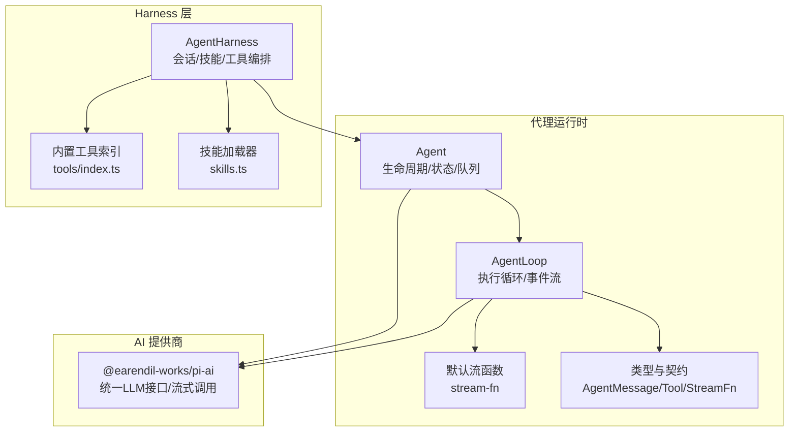
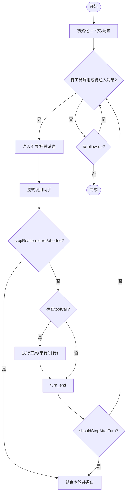
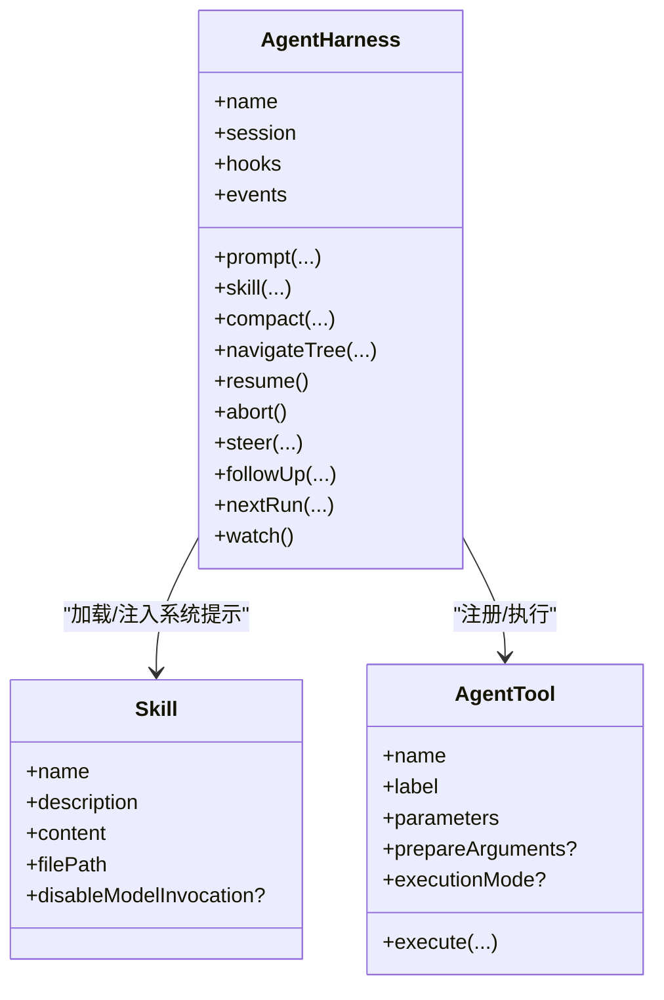
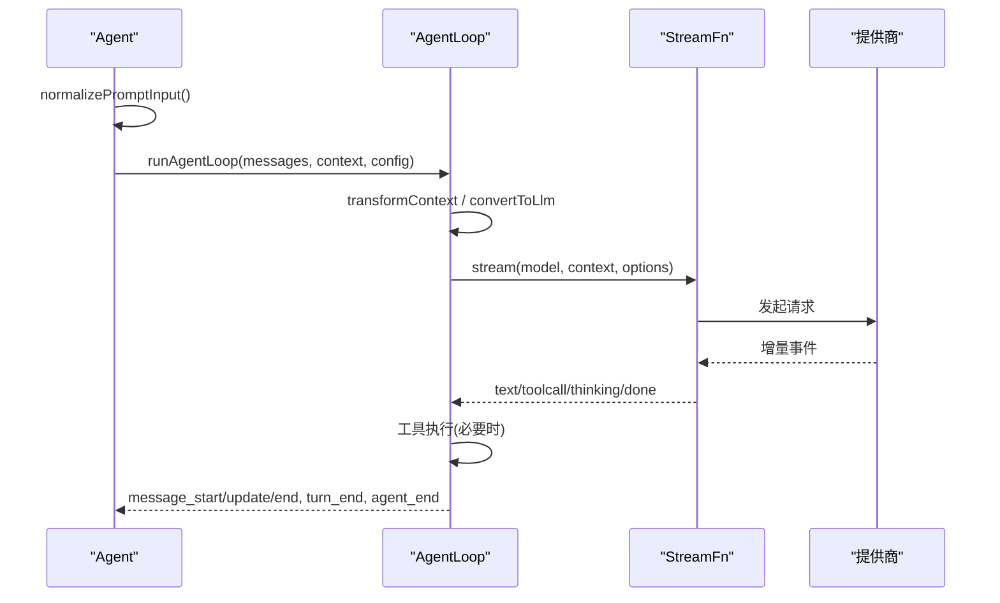
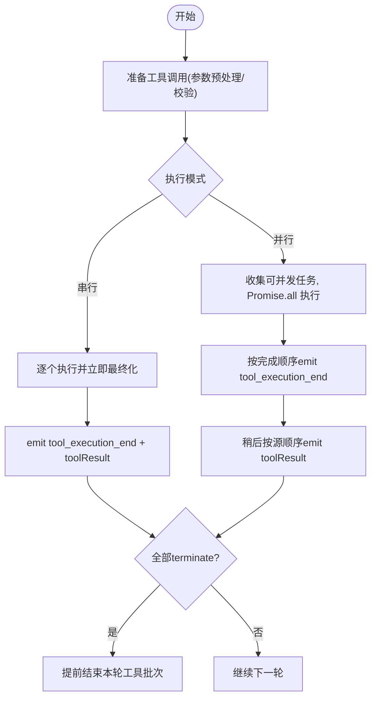
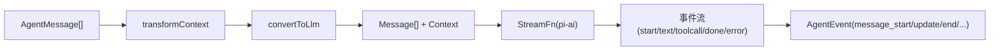
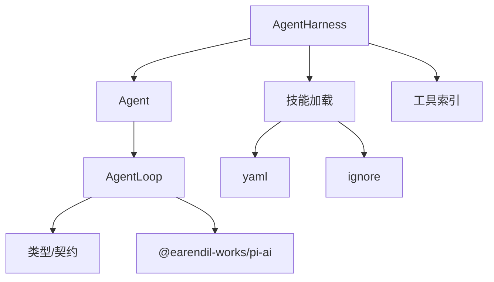

# 代理运行时

<cite>
**本文引用的文件**
- [agent.ts](file://packages/agent/src/agent.ts)
- [agent-loop.ts](file://packages/agent/src/agent-loop.ts)
- [types.ts](file://packages/agent/src/types.ts)
- [stream-fn.ts](file://packages/agent/src/stream-fn.ts)
- [agent-harness.ts](file://packages/agent/src/harness/agent-harness.ts)
- [skills.ts](file://packages/agent/src/harness/skills.ts)
- [types.ts（harness）](file://packages/agent/src/harness/types.ts)
- [index.ts（tools）](file://packages/agent/src/harness/tools/index.ts)
- [package.json（agent）](file://packages/agent/package.json)
- [package.json（ai）](file://packages/ai/package.json)
</cite>

## 目录
1. [简介](#简介)
2. [项目结构](#项目结构)
3. [核心组件](#核心组件)
4. [架构总览](#架构总览)
5. [详细组件分析](#详细组件分析)
6. [依赖关系分析](#依赖关系分析)
7. [性能考量](#性能考量)
8. [故障排查指南](#故障排查指南)
9. [结论](#结论)
10. [附录](#附录)

## 简介
本技术文档聚焦于“代理运行时”的核心实现，覆盖 Agent Core 的代理生命周期管理、状态机设计与执行循环机制；Agent Harness 的工具调用框架、技能系统与会话上下文管理；以及代理初始化、消息处理、错误恢复的完整流程。同时提供创建与配置代理实例的具体路径指引，说明如何处理异步操作与并发请求，并解释代理与 AI 提供商之间的交互模式和数据流转过程。

## 项目结构
仓库采用多包组织，关键代码位于 packages/agent 与 packages/ai：
- packages/agent：提供通用代理运行时（Agent Core）、执行循环、工具与技能系统、会话与持久化抽象等。
- packages/ai：统一 LLM API、模型发现、提供商配置与流式接口。



图表来源
- [agent.ts:173-238](file://packages/agent/src/agent.ts#L173-L238)
- [agent-loop.ts:95-143](file://packages/agent/src/agent-loop.ts#L95-L143)
- [types.ts:149-293](file://packages/agent/src/types.ts#L149-L293)
- [agent-harness.ts:305-345](file://packages/agent/src/harness/agent-harness.ts#L305-L345)
- [skills.ts:49-75](file://packages/agent/src/harness/skills.ts#L49-L75)
- [package.json（agent）:37-43](file://packages/agent/package.json#L37-L43)
- [package.json（ai）:62-73](file://packages/ai/package.json#L62-L73)

章节来源
- [package.json（agent）:1-69](file://packages/agent/package.json#L1-L69)
- [package.json（ai）:1-101](file://packages/ai/package.json#L1-L101)

## 核心组件
- Agent：封装代理生命周期、消息队列（引导/后续）、状态快照、事件订阅、运行控制（启动/继续/中止/空闲等待）。
- AgentLoop：低层执行循环，负责轮询助手响应、工具调用执行（串行/并行）、注入引导/后续消息、回合结束判断与终止条件。
- 类型与契约：定义 AgentMessage、AgentTool、StreamFn、AgentEvent、工具执行模式、队列模式、思考级别等。
- AgentHarness：高层编排器，集成会话、技能、提示模板、重试策略、压缩、工具集与资源，暴露统一的 Lane 接口。
- 技能系统：从文件系统扫描 SKILL.md 或 .md，解析 frontmatter，生成模型可见的技能描述与指令块。
- 工具框架：通过 AgentTool 定义参数 schema、执行逻辑、可选 prepareArguments、执行模式、更新回调等。

章节来源
- [agent.ts:173-593](file://packages/agent/src/agent.ts#L173-L593)
- [agent-loop.ts:155-275](file://packages/agent/src/agent-loop.ts#L155-L275)
- [types.ts:28-50](file://packages/agent/src/types.ts#L28-L50)
- [types.ts:149-293](file://packages/agent/src/types.ts#L149-L293)
- [agent-harness.ts:243-345](file://packages/agent/src/harness/agent-harness.ts#L243-L345)
- [skills.ts:49-75](file://packages/agent/src/harness/skills.ts#L49-L75)

## 架构总览
代理运行时由“高层编排（Harness）—中层控制（Agent）—底层循环（AgentLoop）—提供商（pi-ai）”四层构成。数据流以 AgentMessage 为中心，在 LLM 边界转换为 Message[] 进行流式调用，再将结果写回上下文与事件流。

```mermaid
sequenceDiagram
participant App as "应用"
participant Harness as "AgentHarness"
participant Agent as "Agent"
participant Loop as "AgentLoop"
participant Stream as "StreamFn(pi-ai)"
participant Provider as "AI提供商"
App->>Harness : 创建/配置(模型/工具/技能/会话)
Harness->>Agent : prompt()/continue()
Agent->>Loop : runAgentLoop()/runAgentLoopContinue()
Loop->>Stream : 流式调用(转换后的消息)
Stream-->>Loop : 增量事件(text/toolcall/thinking/done)
Loop->>Loop : 执行工具(串行/并行)
Loop-->>Agent : 事件(message_start/update/end, turn_end, agent_end)
Agent-->>Harness : 事件/状态变化
Harness-->>App : 结果/使用量/可观测性
```

图表来源
- [agent.ts:409-435](file://packages/agent/src/agent.ts#L409-L435)
- [agent-loop.ts:281-372](file://packages/agent/src/agent-loop.ts#L281-L372)
- [agent-loop.ts:411-554](file://packages/agent/src/agent-loop.ts#L411-L554)
- [types.ts:28-32](file://packages/agent/src/types.ts#L28-L32)

## 详细组件分析

### Agent Core：生命周期、状态机与执行循环
- 生命周期
  - 启动：prompt() 将输入标准化为 AgentMessage[]，进入 runPromptMessages -> runAgentLoop。
  - 继续：continue() 校验最后一条消息角色，进入 runContinuation -> runAgentLoopContinue。
  - 中止：abort() 触发 AbortSignal，所有钩子与工具需响应中断。
  - 空闲：waitForIdle() 等待当前运行及所有监听器完成。
- 状态机
  - isStreaming：标记是否处于运行中。
  - streamingMessage：当前流式中的助手消息片段。
  - pendingToolCalls：正在执行的 toolCallId 集合。
  - errorMessage：最近一次失败/中止的助手消息错误信息。
- 执行循环
  - 外层 while：当存在待处理的 follow-up 消息时继续下一轮。
  - 内层 while：处理 steering/follow-up 注入、助手响应、工具调用、回合结束判断。
  - 工具执行：支持 sequential 与 parallel；支持 per-tool executionMode 覆盖。
  - 停止条件：shouldStopAfterTurn 返回 true；或无更多工具/消息。



图表来源
- [agent-loop.ts:155-275](file://packages/agent/src/agent-loop.ts#L155-L275)
- [agent-loop.ts:411-554](file://packages/agent/src/agent-loop.ts#L411-L554)
- [agent.ts:486-535](file://packages/agent/src/agent.ts#L486-L535)

章节来源
- [agent.ts:173-593](file://packages/agent/src/agent.ts#L173-L593)
- [agent-loop.ts:95-275](file://packages/agent/src/agent-loop.ts#L95-L275)
- [types.ts:149-293](file://packages/agent/src/types.ts#L149-L293)

### Agent Harness：工具调用框架、技能系统与上下文管理
- 工具调用框架
  - 通过 AgentTool 定义参数 schema、执行逻辑、可选 prepareArguments、执行模式、更新回调 onUpdate。
  - beforeToolCall/afterToolCall 钩子在工具执行前后介入，支持阻断、替换结果、合并 usage、提前终止提示。
  - 工具执行模式：全局 toolExecution 与 per-tool executionMode 共同决定串行/并行。
- 技能系统
  - loadSkills/loadSourcedSkills：递归扫描目录，读取 SKILL.md 或根 .md，忽略规则来自 .gitignore/.ignore/.fdignore。
  - 解析 frontmatter 提取 name/description/disable-model-invocation，生成模型可见的技能块。
- 会话上下文管理
  - AgentHarness 持有 SessionTree、模型、工具集、提示模板、重试策略、压缩设置、队列模式等。
  - 暴露 Lane 接口：prompt/skill/promptFromTemplate/compact/navigate/resume/steer/followUp/nextRun/abort 等。
  - 通过 hooks/events 扩展生命周期与请求拦截（当前默认实现抛出未实现异常，供具体后端接入）。



图表来源
- [agent-harness.ts:243-345](file://packages/agent/src/harness/agent-harness.ts#L243-L345)
- [skills.ts:49-75](file://packages/agent/src/harness/skills.ts#L49-L75)
- [types.ts:385-409](file://packages/agent/src/types.ts#L385-L409)

章节来源
- [agent-harness.ts:243-509](file://packages/agent/src/harness/agent-harness.ts#L243-L509)
- [skills.ts:49-376](file://packages/agent/src/harness/skills.ts#L49-L376)
- [types.ts:385-409](file://packages/agent/src/types.ts#L385-L409)

### 代理初始化、消息处理与错误恢复
- 初始化
  - 构造 Agent：传入 initialState、convertToLlm、transformContext、streamFn、getApiKey、before/afterToolCall、shouldStopAfterTurn、prepareNextTurn、队列模式、sessionId、thinkingBudgets、transport、maxRetryDelayMs、toolExecution。
  - 构造 AgentHarness：传入 session、models、model、thinkingLevel、activeToolNames、tools、systemPrompt、resources、streamOptions、retry、compaction、队列模式、toProviderMessages 等。
- 消息处理
  - normalizePromptInput：将字符串/图片/消息数组归一化为 AgentMessage[]。
  - streamAssistantResponse：按 transformContext -> convertToLlm -> 构建 Context -> 调用 StreamFn -> 迭代事件 -> 写入上下文与事件流。
- 错误恢复
  - 助手错误/中止：message_stopReason 为 error/aborted 时直接结束本轮。
  - 工具执行失败：createErrorToolResult 包装错误内容，emit tool_execution_end 与 toolResult message。
  - 输出截断保护：若 stopReason=length，批量失败该条消息中的所有 toolCall，避免执行不完整参数。
  - 运行失败封装：handleRunFailure 将错误转为 assistant 消息并走完标准事件序列。



图表来源
- [agent.ts:347-435](file://packages/agent/src/agent.ts#L347-L435)
- [agent-loop.ts:281-372](file://packages/agent/src/agent-loop.ts#L281-L372)
- [agent-loop.ts:381-406](file://packages/agent/src/agent-loop.ts#L381-L406)
- [agent.ts:511-535](file://packages/agent/src/agent.ts#L511-L535)

章节来源
- [agent.ts:347-535](file://packages/agent/src/agent.ts#L347-L535)
- [agent-loop.ts:281-406](file://packages/agent/src/agent-loop.ts#L281-L406)

### 工具执行：串行与并行、更新与终止
- 串行执行：逐个准备、执行、最终化，依次 emit tool_execution_end 与 toolResult message。
- 并行执行：顺序准备，允许的工具并发执行；tool_execution_end 按完成顺序发出；toolResult message 按助手源顺序延迟发出。
- 更新回调：工具 execute 接收 onUpdate，可在执行过程中推送部分结果，最终化后不再接受更新。
- 终止提示：result.terminate=true 参与批次级早停（整批均为 terminate 才提前结束）。



图表来源
- [agent-loop.ts:411-554](file://packages/agent/src/agent-loop.ts#L411-L554)
- [types.ts:35-42](file://packages/agent/src/types.ts#L35-L42)

章节来源
- [agent-loop.ts:411-554](file://packages/agent/src/agent-loop.ts#L411-L554)
- [types.ts:35-42](file://packages/agent/src/types.ts#L35-L42)

### 与 AI 提供商的交互模式与数据流转
- 统一接口：通过 StreamFn 调用 pi-ai 的流式接口，传入 model、context（systemPrompt、messages、tools）与选项（apiKey、signal、transport、timeout、metadata 等）。
- 消息转换：AgentMessage[] 经 transformContext 与 convertToLlm 转换为 LLM 可用的 Message[]。
- 事件映射：provider 的 start/text_delta/toolcall_delta/done/error 等事件被映射为 message_start/message_update/message_end 等内部事件。
- 密钥与传输：getApiKey 动态获取短期令牌；transport 指定首选传输方式；maxRetryDelayMs 限制提供商重试延迟。



图表来源
- [agent-loop.ts:281-372](file://packages/agent/src/agent-loop.ts#L281-L372)
- [types.ts:28-32](file://packages/agent/src/types.ts#L28-L32)
- [types.ts:149-210](file://packages/agent/src/types.ts#L149-L210)

章节来源
- [agent-loop.ts:281-372](file://packages/agent/src/agent-loop.ts#L281-L372)
- [types.ts:28-210](file://packages/agent/src/types.ts#L28-L210)

## 依赖关系分析
- Agent 依赖 AgentLoop、StreamFn、类型定义；AgentLoop 依赖 pi-ai 的事件流与工具校验；AgentHarness 依赖 Session、Skill、工具与资源。
- 外部依赖：@earendil-works/pi-ai 提供统一 LLM 接口与提供商适配；TypeBox 用于参数 schema 校验；yaml 用于技能 frontmatter 解析；ignore 用于忽略规则匹配。



图表来源
- [agent.ts:173-238](file://packages/agent/src/agent.ts#L173-L238)
- [agent-loop.ts:1-24](file://packages/agent/src/agent-loop.ts#L1-L24)
- [skills.ts:1-3](file://packages/agent/src/harness/skills.ts#L1-L3)
- [package.json（agent）:37-43](file://packages/agent/package.json#L37-L43)

章节来源
- [package.json（agent）:37-43](file://packages/agent/package.json#L37-L43)
- [package.json（ai）:62-73](file://packages/ai/package.json#L62-L73)

## 性能考量
- 工具执行模式：parallel 提升吞吐，但需注意工具间副作用与顺序要求；sequential 保证确定性。
- 上下文变换：transformContext 可用于裁剪历史消息，降低 token 消耗与延迟。
- 流式处理：边收边发，减少内存峰值；onUpdate 推送部分结果，便于 UI 实时反馈。
- 重试与超时：通过 retry 策略与 maxRetryDelayMs 控制稳定性与成本；timeoutMs 防止长尾请求。
- 会话压缩：compaction 设置保留近期关键 token，压缩旧上下文，维持窗口大小。

[本节为通用指导，不直接分析具体文件]

## 故障排查指南
- 常见错误
  - 无法继续：上下文为空或最后一条消息为 assistant。
  - 工具未找到：工具名不存在时立即返回错误结果。
  - 输出截断：stopReason=length 时批量失败工具调用，避免执行不完整参数。
  - 运行失败：handleRunFailure 将错误封装为标准事件序列，便于上层统一处理。
- 定位建议
  - 检查 shouldStopAfterTurn 与 prepareNextTurn 是否正确返回。
  - 确认 getApiKey 能返回有效短期令牌。
  - 观察 tool_execution_start/update/end 事件，定位工具执行阶段问题。
  - 使用 watch 或日志记录上下文与消息，核对 convertToLlm 与 transformContext 的输出。

章节来源
- [agent-loop.ts:120-143](file://packages/agent/src/agent-loop.ts#L120-L143)
- [agent-loop.ts:381-406](file://packages/agent/src/agent-loop.ts#L381-L406)
- [agent.ts:511-535](file://packages/agent/src/agent.ts#L511-L535)

## 结论
本运行时以 Agent 为核心控制器、AgentLoop 为执行引擎、AgentHarness 为高层编排，结合 pi-ai 的统一流式接口，实现了可扩展的代理生命周期管理、灵活的工具执行策略、健壮的会话上下文管理与完善的错误恢复机制。通过技能系统与提示模板，可将领域知识注入系统提示；通过队列与钩子，可实现对运行过程的精细控制。

[本节为总结，不直接分析具体文件]

## 附录

### 如何创建与配置代理实例（路径指引）
- 创建 Agent
  - 参考入口与构造参数：[agent.ts:173-238](file://packages/agent/src/agent.ts#L173-L238)
  - 消息标准化与运行入口：[agent.ts:347-435](file://packages/agent/src/agent.ts#L347-L435)
  - 运行生命周期与错误处理：[agent.ts:486-535](file://packages/agent/src/agent.ts#L486-L535)
- 配置 AgentLoop
  - 循环入口与继续：[agent-loop.ts:95-143](file://packages/agent/src/agent-loop.ts#L95-L143)
  - 主循环与停止条件：[agent-loop.ts:155-275](file://packages/agent/src/agent-loop.ts#L155-L275)
  - 助手响应流式处理：[agent-loop.ts:281-372](file://packages/agent/src/agent-loop.ts#L281-L372)
  - 工具执行（串行/并行）：[agent-loop.ts:411-554](file://packages/agent/src/agent-loop.ts#L411-L554)
- 定义工具与技能
  - 工具类型与执行模式：[types.ts:385-409](file://packages/agent/src/types.ts#L385-L409)
  - 技能加载与格式化：[skills.ts:49-75](file://packages/agent/src/harness/skills.ts#L49-L75), [skills.ts:243-288](file://packages/agent/src/harness/skills.ts#L243-L288)
- Harness 编排
  - Harness 选项与能力：[agent-harness.ts:243-345](file://packages/agent/src/harness/agent-harness.ts#L243-L345)
  - 工具与资源管理：[agent-harness.ts:453-509](file://packages/agent/src/harness/agent-harness.ts#L453-L509)

### 异步与并发处理要点
- 使用 AbortSignal 贯穿整个运行链路，确保取消及时生效。
- 工具 execute 支持 onUpdate 推送部分结果，注意在 finally 中关闭更新通道。
- 并行执行工具时，注意工具间的副作用与顺序约束，必要时使用 per-tool executionMode="sequential"。

章节来源
- [agent-loop.ts:411-554](file://packages/agent/src/agent-loop.ts#L411-L554)
- [types.ts:35-42](file://packages/agent/src/types.ts#L35-L42)