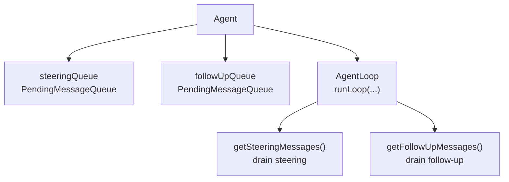
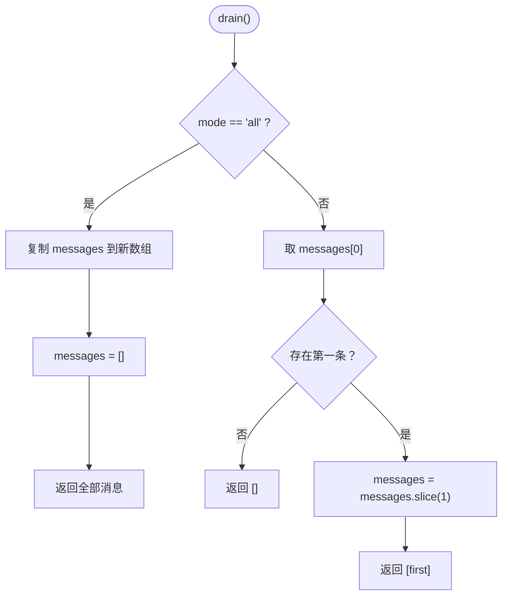
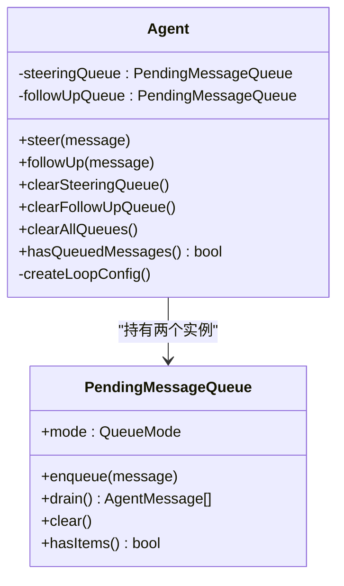
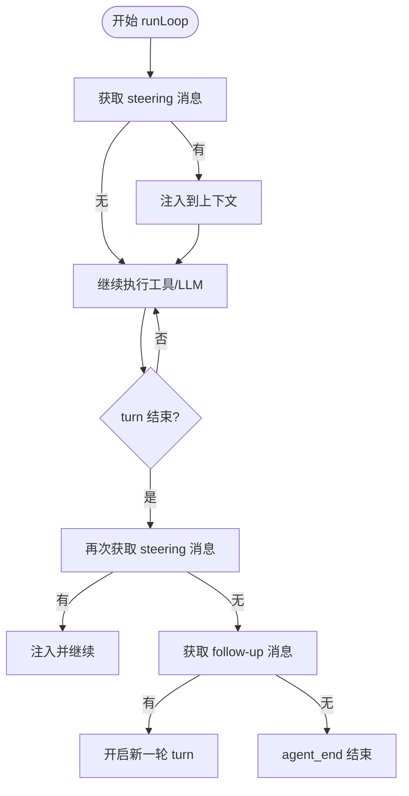
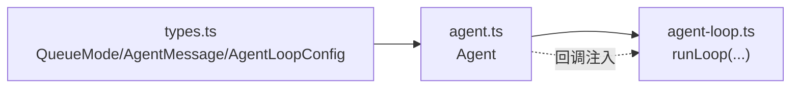

# 消息队列系统

<cite>
**本文引用的文件**
- [agent.ts](file://packages/agent/src/agent.ts)
- [types.ts](file://packages/agent/src/types.ts)
- [agent-loop.ts](file://packages/agent/src/agent-loop.ts)
</cite>

## 目录
1. [简介](#简介)
2. [项目结构](#项目结构)
3. [核心组件](#核心组件)
4. [架构总览](#架构总览)
5. [详细组件分析](#详细组件分析)
6. [依赖关系分析](#依赖关系分析)
7. [性能考量](#性能考量)
8. [故障排查指南](#故障排查指南)
9. [结论](#结论)
10. [附录：使用示例与最佳实践](#附录使用示例与最佳实践)

## 简介
本技术文档聚焦于 Agent 的消息队列子系统，重点解释 PendingMessageQueue 类的设计、steering（引导）与 follow-up（后续）两种队列模式的工作原理，以及 QueueMode 枚举 "one-at-a-time" 与 "all" 的区别与适用场景。同时说明 enqueue、drain、clear 等操作的实现细节，展示 steer() 与 followUp() 的调度方式，以及 clearSteeringQueue()、clearFollowUpQueue() 等状态管理方法。最后阐述队列与代理执行循环的集成方式和优先级处理机制。

## 项目结构
- Agent 层负责维护两个独立的待处理消息队列：
  - steeringQueue：用于在助手回复后、下一轮 LLM 调用前注入“引导”消息，以动态调整当前任务方向。
  - followUpQueue：用于在代理即将停止时注入“后续”消息，使代理继续处理新任务。
- 队列行为由 QueueMode 控制：
  - "one-at-a-time"：每次只取出最老的一条消息，其余保留到下一次 drain 点。
  - "all"：一次性取出全部消息并清空队列。
- AgentLoop 在每轮 turn 结束后检查 steering 队列；当代理准备停止时再检查 follow-up 队列。



图表来源
- [agent.ts:125-159](file://packages/agent/src/agent.ts#L125-L159)
- [agent.ts:173-311](file://packages/agent/src/agent.ts#L173-L311)
- [agent-loop.ts:155-275](file://packages/agent/src/agent-loop.ts#L155-L275)

章节来源
- [agent.ts:125-311](file://packages/agent/src/agent.ts#L125-L311)
- [agent-loop.ts:155-275](file://packages/agent/src/agent-loop.ts#L155-L275)

## 核心组件
- PendingMessageQueue
  - 职责：维护一个 AgentMessage[] 队列，支持按模式批量或单条出队。
  - 关键属性与方法：
    - mode: QueueMode
    - enqueue(message)
    - hasItems()
    - drain(): 根据 mode 返回一条或全部消息
    - clear()
- Agent
  - 持有 steeringQueue 与 followUpQueue，提供 steer()、followUp()、clear* 等方法。
  - 通过 createLoopConfig 将 getSteeringMessages/getFollowUpMessages 接入 AgentLoop。
- AgentLoop
  - 主循环：
    - 每轮 turn 开始前/中：优先处理 pending steering 消息。
    - 每轮 turn 结束后：再次拉取 steering 消息。
    - 当无更多工具调用且无 steering 消息时：检查 follow-up 队列，若有则继续一轮新的 turn。

章节来源
- [agent.ts:125-159](file://packages/agent/src/agent.ts#L125-L159)
- [agent.ts:173-311](file://packages/agent/src/agent.ts#L173-L311)
- [agent-loop.ts:155-275](file://packages/agent/src/agent-loop.ts#L155-L275)

## 架构总览
下图展示了消息从入队到被 AgentLoop 消费的完整流程，包括 steering 与 follow-up 的优先级与触发时机。

```mermaid
sequenceDiagram
participant App as "应用"
participant Agent as "Agent"
participant SQ as "steeringQueue"
participant FQ as "followUpQueue"
participant Loop as "AgentLoop"
App->>Agent : steer(msg) / followUp(msg)
Agent->>SQ : enqueue(msg)
Agent->>FQ : enqueue(msg)
Note over Agent,Loop : 启动 prompt/continue 进入 runLoop
Loop->>SQ : getSteeringMessages()
alt 有 steering 消息
SQ-->>Loop : drain() -> 1条或全部
Loop->>Loop : 注入到上下文并继续本轮
else 无 steering 消息
Loop->>Loop : 继续执行工具调用/LLM
end
Loop->>Loop : 一轮 turn 结束
Loop->>SQ : getSteeringMessages()
alt 仍有 steering 消息
SQ-->>Loop : drain()
Loop->>Loop : 注入并继续
else 无 steering 消息
Loop->>FQ : getFollowUpMessages()
alt 有 follow-up 消息
FQ-->>Loop : drain()
Loop->>Loop : 开启新一轮 turn
else 无 follow-up 消息
Loop->>Loop : 结束 agent_end
end
end
```

图表来源
- [agent.ts:282-311](file://packages/agent/src/agent.ts#L282-L311)
- [agent.ts:445-483](file://packages/agent/src/agent.ts#L445-L483)
- [agent-loop.ts:155-275](file://packages/agent/src/agent-loop.ts#L155-L275)

## 详细组件分析

### PendingMessageQueue 设计与实现
- 数据结构：内部维护 AgentMessage[]。
- 入队 enqueue：直接 push。
- 出队 drain：
  - "all"：复制整个数组并清空，返回所有消息。
  - "one-at-a-time"：仅返回首条并移除它，剩余保留。
- 清空 clear：重置为 []。
- 复杂度：
  - enqueue: O(1)
  - drain("all"): O(n) 复制数组
  - drain("one-at-a-time"): O(n) slice(1)
  - clear: O(1)



图表来源
- [agent.ts:141-154](file://packages/agent/src/agent.ts#L141-L154)

章节来源
- [agent.ts:125-159](file://packages/agent/src/agent.ts#L125-L159)

### QueueMode 枚举与作用
- "one-at-a-time"：适合需要精细控制节奏的场景，例如用户快速输入多条指令时，逐条处理以避免打断当前任务的连贯性。
- "all"：适合批处理场景，例如批量导入任务或在特定阶段一次性注入多条上下文。

章节来源
- [types.ts:44-50](file://packages/agent/src/types.ts#L44-L50)

### Agent 中的队列管理与调度
- steer(message)：将消息加入 steeringQueue。
- followUp(message)：将消息加入 followUpQueue。
- clearSteeringQueue()/clearFollowUpQueue()/clearAllQueues()：清理对应队列。
- hasQueuedMessages()：任一队列非空即返回 true。
- 运行时配置：
  - createLoopConfig 中将 getSteeringMessages 指向 steeringQueue.drain()。
  - getFollowUpMessages 指向 followUpQueue.drain()。
  - 支持 skipInitialSteeringPoll：首次 turn 可跳过初始 steering 拉取，避免重复注入。



图表来源
- [agent.ts:173-311](file://packages/agent/src/agent.ts#L173-L311)
- [agent.ts:125-159](file://packages/agent/src/agent.ts#L125-L159)

章节来源
- [agent.ts:173-311](file://packages/agent/src/agent.ts#L173-L311)
- [agent.ts:445-483](file://packages/agent/src/agent.ts#L445-L483)

### AgentLoop 与队列集成及优先级
- 优先级顺序：
  1) 当前 turn 的工具调用结果
  2) steering 消息（每轮 turn 前后均会检查）
  3) follow-up 消息（仅在代理即将停止时检查）
- 工作流要点：
  - 进入 runLoop 时先尝试获取 steering 消息。
  - 每轮 turn 结束后再次获取 steering 消息。
  - 若无更多工具调用且无 steering 消息，则获取 follow-up 消息；若存在则继续新一轮 turn。
  - 否则结束并发送 agent_end。



图表来源
- [agent-loop.ts:155-275](file://packages/agent/src/agent-loop.ts#L155-L275)

章节来源
- [agent-loop.ts:155-275](file://packages/agent/src/agent-loop.ts#L155-L275)

## 依赖关系分析
- Agent 依赖 types.ts 中的类型定义（如 AgentMessage、QueueMode、AgentLoopConfig）。
- Agent 通过 createLoopConfig 向 AgentLoop 注入 getSteeringMessages/getFollowUpMessages，从而驱动队列消费。
- AgentLoop 不直接持有队列，而是通过配置回调间接访问队列，解耦了队列与循环逻辑。



图表来源
- [types.ts:44-50](file://packages/agent/src/types.ts#L44-L50)
- [agent.ts:445-483](file://packages/agent/src/agent.ts#L445-L483)
- [agent-loop.ts:155-275](file://packages/agent/src/agent-loop.ts#L155-L275)

章节来源
- [types.ts:44-50](file://packages/agent/src/types.ts#L44-L50)
- [agent.ts:445-483](file://packages/agent/src/agent.ts#L445-L483)
- [agent-loop.ts:155-275](file://packages/agent/src/agent-loop.ts#L155-L275)

## 性能考量
- drain("all") 会复制整个数组，适用于小批量或明确批处理边界；高频大批量场景建议谨慎使用，避免频繁 GC。
- drain("one-at-a-time") 每次 slice(1) 仍为 O(n)，但通常 n 较小；若需极致性能，可考虑基于索引的队列实现以降低拷贝成本。
- steering 消息在每轮 turn 前后都会检查，应避免在极短周期内高频入队导致过多 drain 开销。
- follow-up 消息仅在代理即将停止时检查，对主循环影响较小。

## 故障排查指南
- 无法继续：如果 last message 是 assistant，直接 continue 会报错；应确保上下文末尾为用户或 toolResult 消息。
- 运行中重置：reset() 会在 activeRun 存在时抛错；应先等待完成或 abort。
- 事件监听异常：processEvents 要求必须在 active run 上下文中调用，否则会抛出监听器非法错误。
- 队列未消费：确认 createLoopConfig 已正确注入 getSteeringMessages/getFollowUpMessages；若使用了 skipInitialSteeringPoll，注意首轮不会拉取 steering。

章节来源
- [agent.ts:332-345](file://packages/agent/src/agent.ts#L332-L345)
- [agent.ts:360-388](file://packages/agent/src/agent.ts#L360-L388)
- [agent.ts:544-591](file://packages/agent/src/agent.ts#L544-L591)
- [agent-loop.ts:120-143](file://packages/agent/src/agent-loop.ts#L120-L143)

## 结论
PendingMessageQueue 提供了轻量、可控的消息排队能力，配合 Agent 的 steering/follow-up 双队列模型，实现了“即时引导”和“延后处理”两类典型调度需求。QueueMode 允许在不同业务场景下灵活选择批处理或逐条处理策略。AgentLoop 通过回调注入的方式与队列解耦，保证了高内聚低耦合的架构设计。

## 附录：使用示例与最佳实践
- 基本用法路径参考
  - 入队引导消息：steer(message)
    - 参考：[agent.ts:282-285](file://packages/agent/src/agent.ts#L282-L285)
  - 入队后续消息：followUp(message)
    - 参考：[agent.ts:287-290](file://packages/agent/src/agent.ts#L287-L290)
  - 清空队列：
    - clearSteeringQueue()
      - 参考：[agent.ts:292-295](file://packages/agent/src/agent.ts#L292-L295)
    - clearFollowUpQueue()
      - 参考：[agent.ts:297-300](file://packages/agent/src/agent.ts#L297-L300)
    - clearAllQueues()
      - 参考：[agent.ts:302-306](file://packages/agent/src/agent.ts#L302-L306)
  - 查询是否仍有待处理消息：hasQueuedMessages()
    - 参考：[agent.ts:308-311](file://packages/agent/src/agent.ts#L308-L311)
- 队列模式设置
  - steeringMode / followUpMode 可在构造时或通过 setter 设置，默认均为 "one-at-a-time"
    - 参考：[agent.ts:231-233](file://packages/agent/src/agent.ts#L231-L233)
    - 参考：[agent.ts:264-280](file://packages/agent/src/agent.ts#L264-L280)
- 与执行循环的集成
  - getSteeringMessages/getFollowUpMessages 在 createLoopConfig 中绑定到队列 drain
    - 参考：[agent.ts:475-483](file://packages/agent/src/agent.ts#L475-L483)
  - AgentLoop 在 turn 前后与停止前分别消费 steering/follow-up
    - 参考：[agent-loop.ts:166-190](file://packages/agent/src/agent-loop.ts#L166-L190)
    - 参考：[agent-loop.ts:259-275](file://packages/agent/src/agent-loop.ts#L259-L275)
- 最佳实践
  - 高频交互场景使用 "one-at-a-time" 保证响应及时性与上下文稳定。
  - 批处理或阶段注入场景使用 "all" 减少多次 drain 开销。
  - 避免在活跃 run 中调用 reset()；如需中断，优先使用 abort()。
  - 合理设置 shouldStopAfterTurn 与 prepareNextTurn，结合队列模式实现优雅退出与上下文切换。