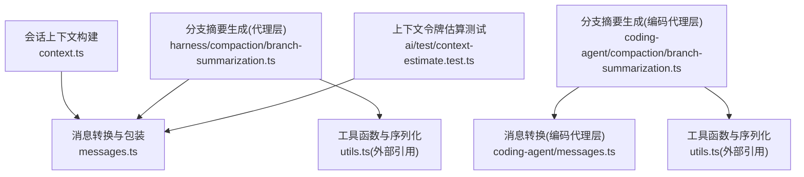
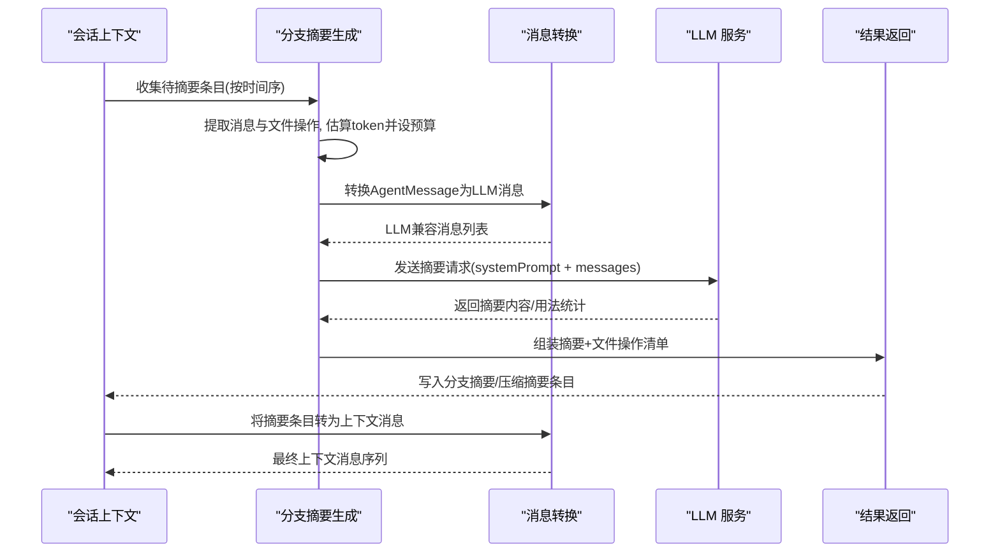
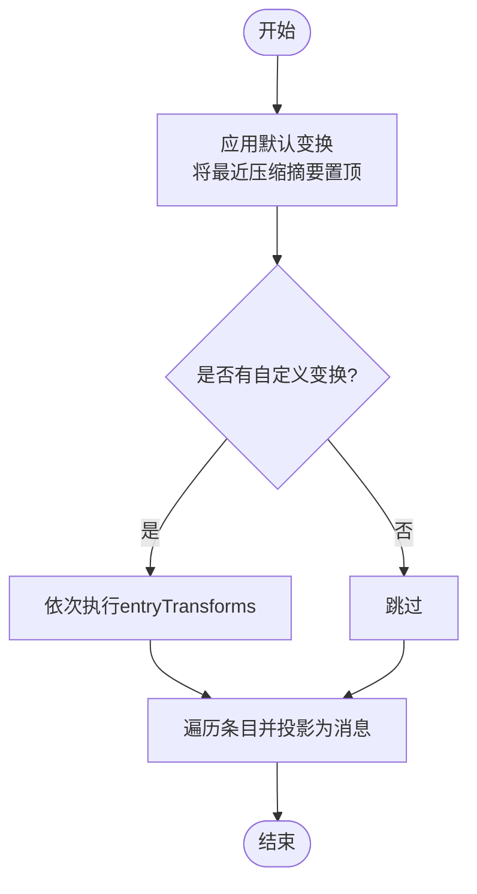
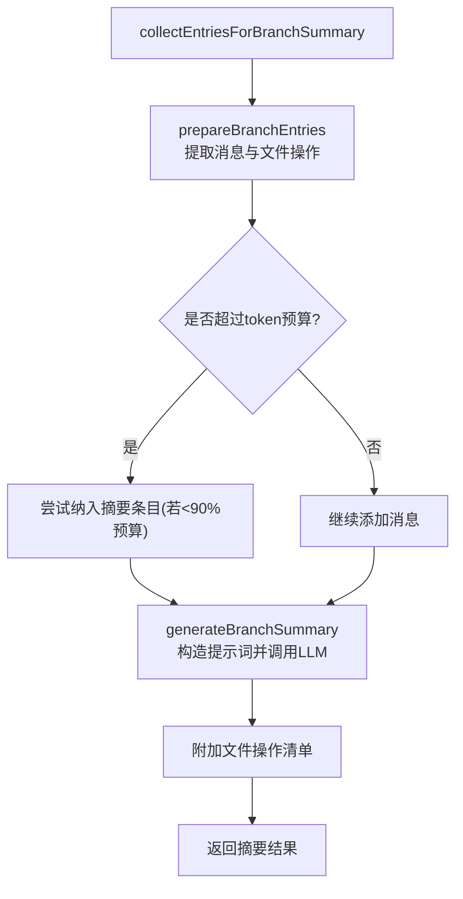
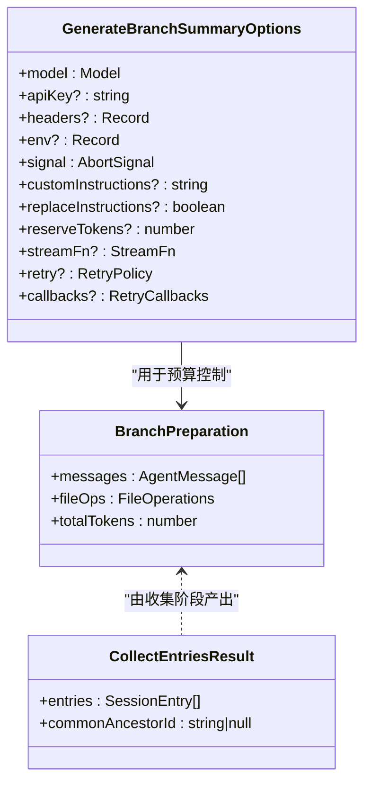
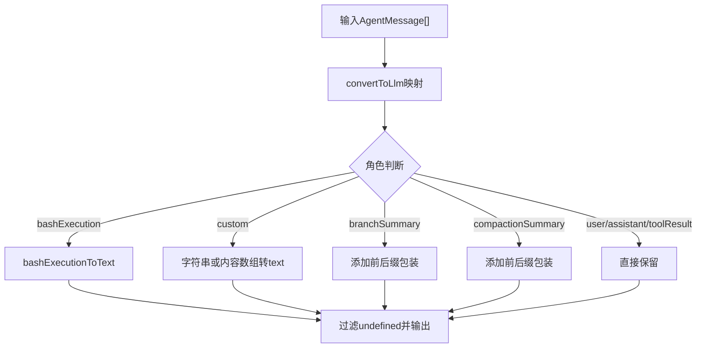
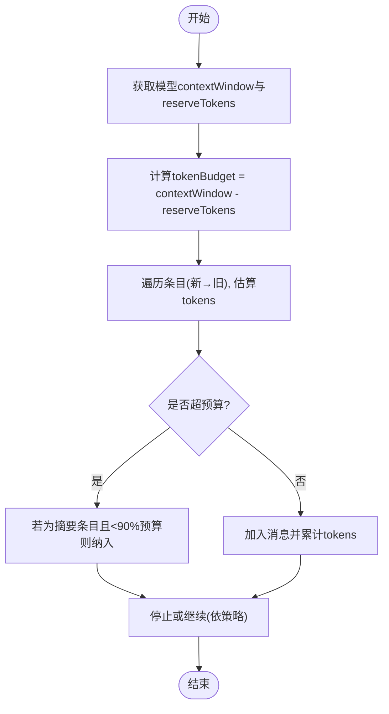
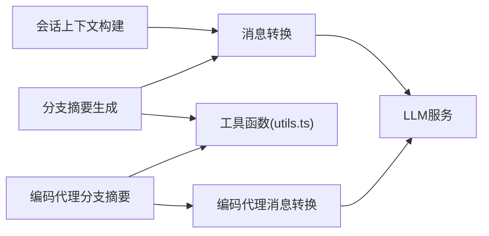

# 上下文压缩策略

<cite>
**本文引用的文件**
- [packages/agent/src/harness/session/context.ts](file://packages/agent/src/harness/session/context.ts)
- [packages/agent/src/harness/messages.ts](file://packages/agent/src/harness/messages.ts)
- [packages/agent/src/harness/compaction/branch-summarization.ts](file://packages/agent/src/harness/compaction/branch-summarization.ts)
- [packages/coding-agent/src/core/compaction/branch-summarization.ts](file://packages/coding-agent/src/core/compaction/branch-summarization.ts)
- [packages/coding-agent/src/core/messages.ts](file://packages/coding-agent/src/core/messages.ts)
- [packages/ai/test/context-estimate.test.ts](file://packages/ai/test/context-estimate.test.ts)
</cite>

## 目录
1. [简介](#简介)
2. [项目结构](#项目结构)
3. [核心组件](#核心组件)
4. [架构总览](#架构总览)
5. [详细组件分析](#详细组件分析)
6. [依赖关系分析](#依赖关系分析)
7. [性能考量](#性能考量)
8. [故障排查指南](#故障排查指南)
9. [结论](#结论)
10. [附录](#附录)

## 简介
本技术文档围绕“上下文压缩策略”展开，系统阐述对话历史摘要生成、重要信息提取与冗余信息过滤的核心算法与实现。文档覆盖不同压缩策略的适用场景与效果评估方法，并给出上下文窗口的智能管理方案（动态调整、优先级排序、关键信息保留）。同时提供配置与优化示例路径，解释数据完整性保证与性能优化技巧，帮助读者在工程实践中高效落地上下文压缩。

## 项目结构
本项目将上下文压缩能力分布在多个模块中：
- 会话上下文构建与消息投影：负责从会话条目序列构建最终上下文消息，支持自定义转换与投影。
- 分支摘要生成：在会话树导航时，对离开分支的内容进行结构化摘要，保留关键决策、进度与下一步。
- 编码代理侧的分支摘要与消息转换：提供更贴近实际使用场景的实现，包含预算控制、重试与流式调用。
- 消息类型与转换：统一封装摘要消息、分支摘要消息等自定义消息到 LLM 可消费格式。
- 上下文令牌估算测试：验证在插入新消息后对旧助手响应 token 计数的处理逻辑。

**图示来源**
- [packages/agent/src/harness/session/context.ts:59-100](file://packages/agent/src/harness/session/context.ts#L59-L100)
- [packages/agent/src/harness/messages.ts:124-168](file://packages/agent/src/harness/messages.ts#L124-L168)
- [packages/agent/src/harness/compaction/branch-summarization.ts:82-281](file://packages/agent/src/harness/compaction/branch-summarization.ts#L82-L281)
- [packages/coding-agent/src/core/compaction/branch-summarization.ts:96-377](file://packages/coding-agent/src/core/compaction/branch-summarization.ts#L96-L377)
- [packages/coding-agent/src/core/messages.ts:148-196](file://packages/coding-agent/src/core/messages.ts#L148-L196)
- [packages/ai/test/context-estimate.test.ts:43-81](file://packages/ai/test/context-estimate.test.ts#L43-L81)

**章节来源**
- [packages/agent/src/harness/session/context.ts:5-100](file://packages/agent/src/harness/session/context.ts#L5-L100)
- [packages/agent/src/harness/messages.ts:1-169](file://packages/agent/src/harness/messages.ts#L1-L169)
- [packages/agent/src/harness/compaction/branch-summarization.ts:1-281](file://packages/agent/src/harness/compaction/branch-summarization.ts#L1-L281)
- [packages/coding-agent/src/core/compaction/branch-summarization.ts:1-377](file://packages/coding-agent/src/core/compaction/branch-summarization.ts#L1-L377)
- [packages/coding-agent/src/core/messages.ts:1-196](file://packages/coding-agent/src/core/messages.ts#L1-L196)
- [packages/ai/test/context-estimate.test.ts:1-82](file://packages/ai/test/context-estimate.test.ts#L1-L82)

## 核心组件
- 会话上下文构建器：将路径上的会话条目转换为最终上下文消息，支持默认变换与自定义变换链，自动定位最近一次压缩摘要并将其置于上下文前端。
- 分支摘要生成器：收集需要摘要的条目，按时间顺序准备消息与文件操作，基于模型上下文窗口计算 token 预算，调用 LLM 生成结构化摘要，附加文件操作清单。
- 消息转换器：将内部 AgentMessage（含 bashExecution、custom、branchSummary、compactionSummary）转换为 LLM 可用的 Message 列表，并对特定类型进行文本化或包裹。
- 编码代理侧增强：在编码代理环境中提供分支摘要的完整流程，包括重试、流式调用、预算控制与更丰富的元数据追踪。

**章节来源**
- [packages/agent/src/harness/session/context.ts:45-100](file://packages/agent/src/harness/session/context.ts#L45-L100)
- [packages/agent/src/harness/compaction/branch-summarization.ts:131-281](file://packages/agent/src/harness/compaction/branch-summarization.ts#L131-L281)
- [packages/agent/src/harness/messages.ts:124-168](file://packages/agent/src/harness/messages.ts#L124-L168)
- [packages/coding-agent/src/core/compaction/branch-summarization.ts:195-377](file://packages/coding-agent/src/core/compaction/branch-summarization.ts#L195-L377)
- [packages/coding-agent/src/core/messages.ts:148-196](file://packages/coding-agent/src/core/messages.ts#L148-L196)

## 架构总览
上下文压缩的整体流程如下：
- 入口：会话上下文构建或分支导航触发。
- 数据准备：收集条目、提取消息与文件操作、估算 token 并设定预算。
- 摘要生成：构造提示词，调用 LLM 生成结构化摘要，附加文件操作清单。
- 上下文组装：将摘要与尾部保留消息组合为最终上下文消息，供后续对话使用。

**图示来源**
- [packages/agent/src/harness/compaction/branch-summarization.ts:82-281](file://packages/agent/src/harness/compaction/branch-summarization.ts#L82-L281)
- [packages/coding-agent/src/core/compaction/branch-summarization.ts:96-377](file://packages/coding-agent/src/core/compaction/branch-summarization.ts#L96-L377)
- [packages/agent/src/harness/messages.ts:124-168](file://packages/agent/src/harness/messages.ts#L124-L168)
- [packages/coding-agent/src/core/messages.ts:148-196](file://packages/coding-agent/src/core/messages.ts#L148-L196)

## 详细组件分析

### 会话上下文构建与消息投影
- 目标：从路径条目序列构建最终上下文消息，确保压缩摘要优先且最新状态正确。
- 关键点：
  - 默认变换将最近的压缩摘要条目移至最前，保持其作为上下文锚点。
  - 支持自定义 entryTransforms 与 entryProjectors，扩展上下文构建行为。
  - 会话状态推导（思考级别、模型切换、活跃工具）与消息映射分离，便于维护。
- 复杂度：线性扫描条目序列，O(n)。

**图示来源**
- [packages/agent/src/harness/session/context.ts:45-100](file://packages/agent/src/harness/session/context.ts#L45-L100)

**章节来源**
- [packages/agent/src/harness/session/context.ts:25-100](file://packages/agent/src/harness/session/context.ts#L25-L100)

### 分支摘要生成（代理层）
- 目标：在会话树导航时，对离开分支的内容生成结构化摘要，保留关键信息与文件操作。
- 关键点：
  - collectEntriesForBranchSummary：找到旧叶子与目标节点之间的公共祖先，收集需摘要的条目。
  - prepareBranchEntries：从新到旧遍历，按 token 预算裁剪；汇总文件操作（读/改），并允许摘要条目在接近预算时仍被纳入。
  - generateBranchSummary：构造提示词，调用 LLM 生成摘要，附加文件操作清单，处理中止与错误。
- 复杂度：条目遍历 O(n)，消息转换与序列化 O(m)，整体 O(n+m)。

**图示来源**
- [packages/agent/src/harness/compaction/branch-summarization.ts:82-281](file://packages/agent/src/harness/compaction/branch-summarization.ts#L82-L281)

**章节来源**
- [packages/agent/src/harness/compaction/branch-summarization.ts:82-281](file://packages/agent/src/harness/compaction/branch-summarization.ts#L82-L281)

### 分支摘要生成（编码代理层）
- 目标：在编码代理环境中提供更完整的摘要流程，包括重试、流式调用与更细粒度的预算控制。
- 关键点：
  - collectEntriesForBranchSummary：与代理层类似，但针对 SessionEntry 类型。
  - prepareBranchEntries：两遍扫描，第一遍累积文件操作（含嵌套分支摘要的 details），第二遍按预算裁剪消息。
  - generateBranchSummary：支持 apiKey、headers、env、streamFn、retry、callbacks 等选项；根据 model.contextWindow 计算预算；处理中止与错误；附加文件操作清单。
- 复杂度：与代理层一致，额外开销来自重试与流式处理。

**图示来源**
- [packages/coding-agent/src/core/compaction/branch-summarization.ts:51-90](file://packages/coding-agent/src/core/compaction/branch-summarization.ts#L51-L90)
- [packages/coding-agent/src/core/compaction/branch-summarization.ts:195-377](file://packages/coding-agent/src/core/compaction/branch-summarization.ts#L195-L377)

**章节来源**
- [packages/coding-agent/src/core/compaction/branch-summarization.ts:96-377](file://packages/coding-agent/src/core/compaction/branch-summarization.ts#L96-L377)

### 消息转换与包装
- 目标：将内部自定义消息（bashExecution、custom、branchSummary、compactionSummary）转换为 LLM 可消费的 Message 列表。
- 关键点：
  - bashExecutionToText：将命令执行结果文本化，支持取消、截断与退出码信息。
  - convertToLlm：按角色映射与过滤，对摘要类消息添加前后缀以明确上下文语义。
  - 编码代理层提供等价实现，保持一致性。
- 复杂度：线性 O(n)。

**图示来源**
- [packages/agent/src/harness/messages.ts:63-168](file://packages/agent/src/harness/messages.ts#L63-L168)
- [packages/coding-agent/src/core/messages.ts:82-196](file://packages/coding-agent/src/core/messages.ts#L82-L196)

**章节来源**
- [packages/agent/src/harness/messages.ts:1-169](file://packages/agent/src/harness/messages.ts#L1-L169)
- [packages/coding-agent/src/core/messages.ts:1-196](file://packages/coding-agent/src/core/messages.ts#L1-L196)

### 上下文令牌估算与预算控制
- 目标：在摘要生成过程中合理分配 token 预算，避免超出模型上下文窗口。
- 关键点：
  - 通过模型 contextWindow 与 reserveTokens 计算可用预算。
  - 从新到旧遍历条目，估算每条消息 token，必要时仅保留摘要条目以确保关键上下文。
  - 测试用例验证插入新消息后对旧助手响应 token 的使用策略。
- 复杂度：估算与预算检查为 O(n)。

**图示来源**
- [packages/agent/src/harness/compaction/branch-summarization.ts:207-281](file://packages/agent/src/harness/compaction/branch-summarization.ts#L207-L281)
- [packages/coding-agent/src/core/compaction/branch-summarization.ts:293-377](file://packages/coding-agent/src/core/compaction/branch-summarization.ts#L293-L377)
- [packages/ai/test/context-estimate.test.ts:43-81](file://packages/ai/test/context-estimate.test.ts#L43-L81)

**章节来源**
- [packages/agent/src/harness/compaction/branch-summarization.ts:207-281](file://packages/agent/src/harness/compaction/branch-summarization.ts#L207-L281)
- [packages/coding-agent/src/core/compaction/branch-summarization.ts:293-377](file://packages/coding-agent/src/core/compaction/branch-summarization.ts#L293-L377)
- [packages/ai/test/context-estimate.test.ts:43-81](file://packages/ai/test/context-estimate.test.ts#L43-L81)

## 依赖关系分析
- 模块耦合：
  - 会话上下文构建依赖消息转换与分支摘要条目类型。
  - 分支摘要生成依赖消息转换与工具函数（序列化、文件操作）。
  - 编码代理层与代理层在消息转换上保持一致接口，便于替换与扩展。
- 外部依赖：
  - LLM 服务通过 models/provider 抽象调用，支持重试与回调。
  - 工具函数 utils.ts 提供文件操作提取与序列化能力（外部引用）。
- 潜在循环依赖：当前实现通过分层与接口隔离避免循环依赖。

**图示来源**
- [packages/agent/src/harness/session/context.ts:59-100](file://packages/agent/src/harness/session/context.ts#L59-L100)
- [packages/agent/src/harness/compaction/branch-summarization.ts:82-281](file://packages/agent/src/harness/compaction/branch-summarization.ts#L82-L281)
- [packages/coding-agent/src/core/compaction/branch-summarization.ts:96-377](file://packages/coding-agent/src/core/compaction/branch-summarization.ts#L96-L377)
- [packages/agent/src/harness/messages.ts:124-168](file://packages/agent/src/harness/messages.ts#L124-L168)
- [packages/coding-agent/src/core/messages.ts:148-196](file://packages/coding-agent/src/core/messages.ts#L148-L196)

**章节来源**
- [packages/agent/src/harness/session/context.ts:59-100](file://packages/agent/src/harness/session/context.ts#L59-L100)
- [packages/agent/src/harness/compaction/branch-summarization.ts:82-281](file://packages/agent/src/harness/compaction/branch-summarization.ts#L82-L281)
- [packages/coding-agent/src/core/compaction/branch-summarization.ts:96-377](file://packages/coding-agent/src/core/compaction/branch-summarization.ts#L96-L377)
- [packages/agent/src/harness/messages.ts:124-168](file://packages/agent/src/harness/messages.ts#L124-L168)
- [packages/coding-agent/src/core/messages.ts:148-196](file://packages/coding-agent/src/core/messages.ts#L148-L196)

## 性能考量
- 预算控制：通过 contextWindow 与 reserveTokens 精确计算可用 token，避免溢出；在接近预算时优先保留摘要条目，确保关键上下文不丢失。
- 线性扫描：条目遍历与消息转换均为线性复杂度，适合大规模会话。
- 重试与流式：编码代理层支持重试策略与流式调用，提升鲁棒性与用户体验。
- 文件操作去重：通过集合结构累积读/改文件，减少重复与冗余。
- 估算精度：结合 estimateTokens 与测试用例验证，确保 token 估算与实际使用一致。

[本节为通用性能讨论，无需具体文件分析]

## 故障排查指南
- 摘要中止：当 stopReason 为 aborted 时，返回中止结果，检查信号与超时设置。
- 摘要失败：当 stopReason 为 error 时，记录错误信息并回退；检查模型配置与网络状况。
- 预算不足：若 messages 为空，说明无内容可摘要；检查条目收集与预算设置。
- 上下文不一致：测试用例显示插入新消息后旧助手响应的 usage 应被忽略；确认时间戳与消息顺序。

**章节来源**
- [packages/agent/src/harness/compaction/branch-summarization.ts:249-281](file://packages/agent/src/harness/compaction/branch-summarization.ts#L249-L281)
- [packages/coding-agent/src/core/compaction/branch-summarization.ts:351-377](file://packages/coding-agent/src/core/compaction/branch-summarization.ts#L351-L377)
- [packages/ai/test/context-estimate.test.ts:43-81](file://packages/ai/test/context-estimate.test.ts#L43-L81)

## 结论
本仓库实现了完整的上下文压缩策略，涵盖对话历史摘要生成、重要信息提取与冗余过滤，并通过 token 预算控制与文件操作追踪保障数据完整性与性能。代理层与编码代理层提供一致的接口与扩展点，便于在不同场景中定制与优化。建议在生产环境中结合业务需求调整 reserveTokens、重试策略与自定义指令，以获得最佳效果。

[本节为总结性内容，无需具体文件分析]

## 附录
- 配置与优化示例路径：
  - 分支摘要生成选项（编码代理层）：[packages/coding-agent/src/core/compaction/branch-summarization.ts:67-90](file://packages/coding-agent/src/core/compaction/branch-summarization.ts#L67-L90)
  - 预算控制与调用流程：[packages/coding-agent/src/core/compaction/branch-summarization.ts:293-377](file://packages/coding-agent/src/core/compaction/branch-summarization.ts#L293-L377)
  - 会话上下文构建与自定义变换：[packages/agent/src/harness/session/context.ts:20-63](file://packages/agent/src/harness/session/context.ts#L20-L63)
  - 消息转换与包装：[packages/agent/src/harness/messages.ts:124-168](file://packages/agent/src/harness/messages.ts#L124-L168)
  - 上下文令牌估算测试：[packages/ai/test/context-estimate.test.ts:43-81](file://packages/ai/test/context-estimate.test.ts#L43-L81)

[本节为参考路径，无需具体文件分析]