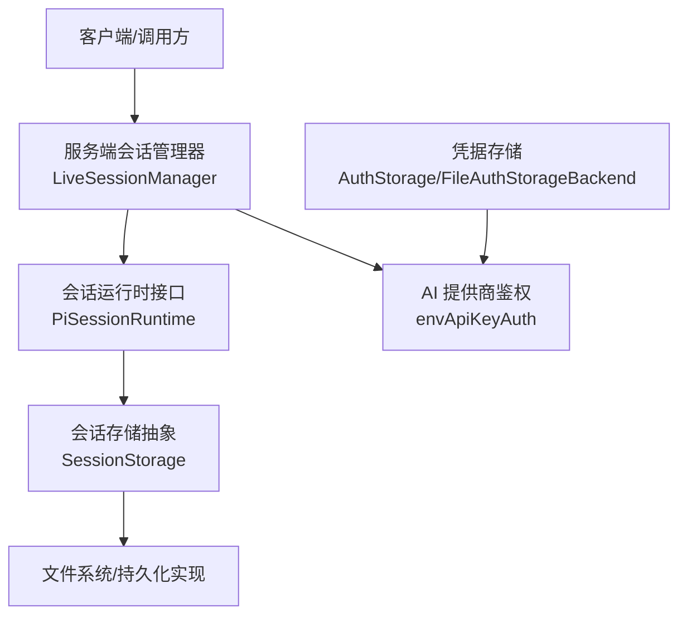
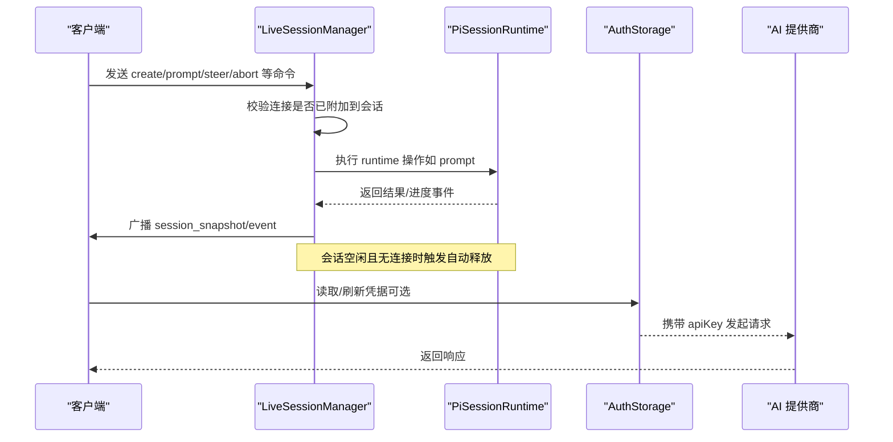
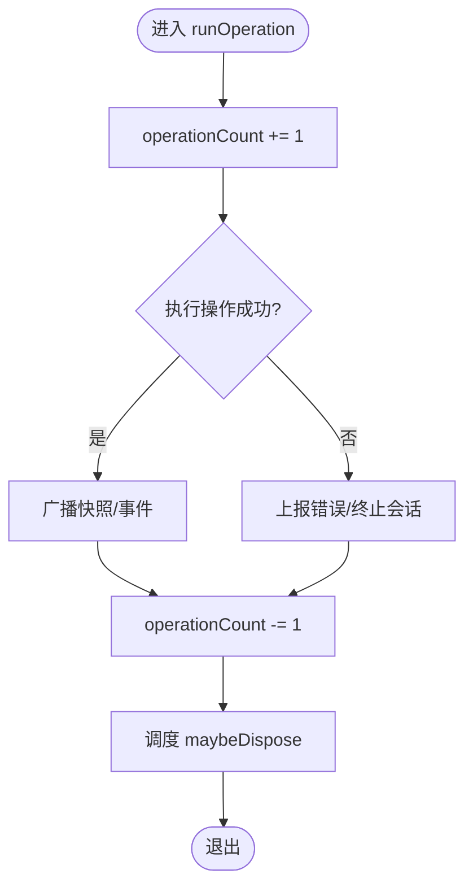
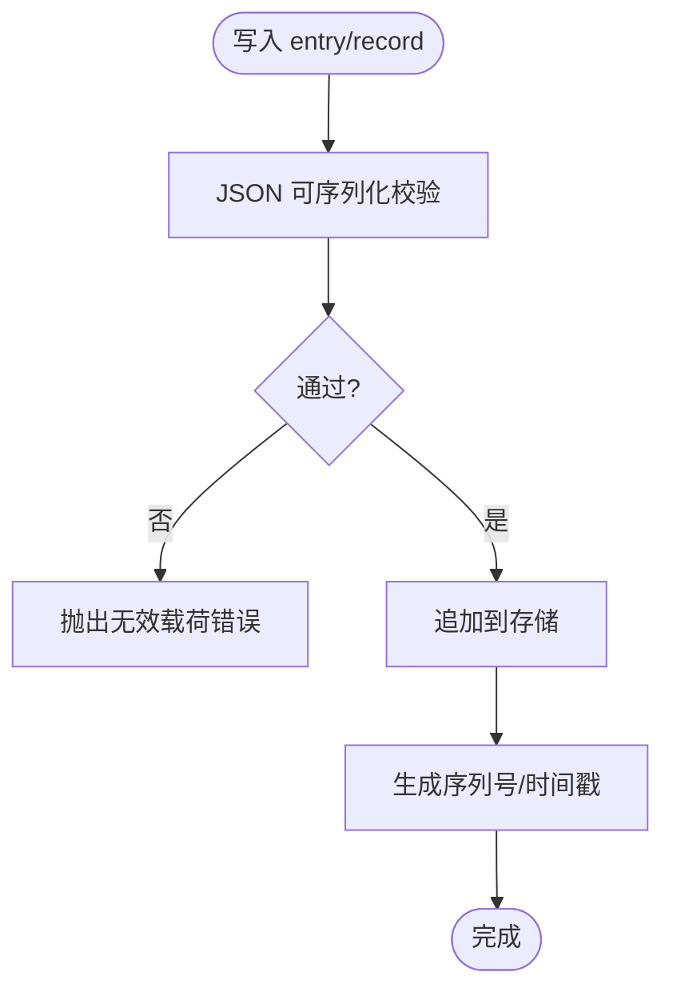
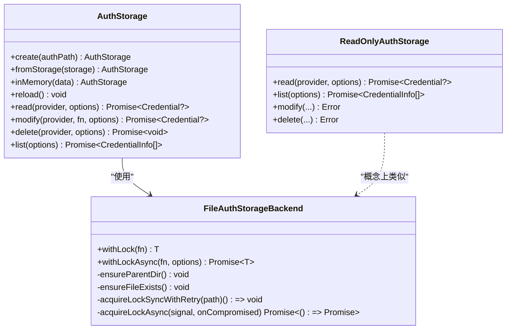
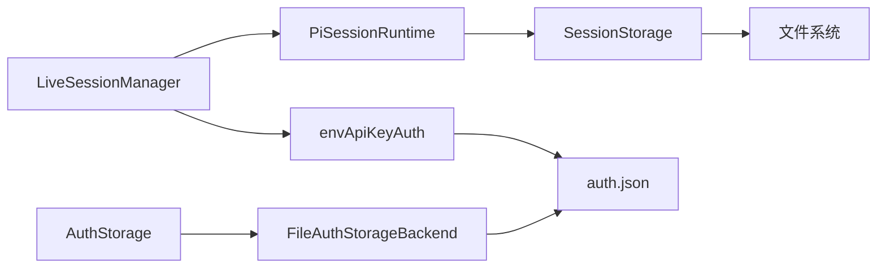

# 会话安全与隐私

<cite>
**本文引用的文件**
- [sessions.ts](file://packages/server/src/sessions.ts)
- [session.ts](file://packages/agent/src/harness/session/session.ts)
- [auth-storage.ts](file://packages/coding-agent/src/core/auth-storage.ts)
- [helpers.ts](file://packages/ai/src/auth/helpers.ts)
- [SECURITY.md](file://SECURITY.md)
</cite>

## 目录
1. [简介](#简介)
2. [项目结构](#项目结构)
3. [核心组件](#核心组件)
4. [架构总览](#架构总览)
5. [详细组件分析](#详细组件分析)
6. [依赖关系分析](#依赖关系分析)
7. [性能与安全权衡](#性能与安全权衡)
8. [故障排查指南](#故障排查指南)
9. [结论](#结论)
10. [附录：配置示例与最佳实践](#附录：配置示例与最佳实践)

## 简介
本技术文档聚焦于“会话安全与隐私保护”，围绕以下目标展开：
- 会话数据的安全防护：敏感信息过滤、访问权限控制、生命周期管理（自动清理、安全删除、审计追踪）。
- 隐私保护机制：用户数据匿名化、日志脱敏、数据传输安全。
- 具体配置示例：如何启用安全功能与隐私保护措施。
- 安全威胁防护与最佳实践建议。

本仓库采用本地优先的编码代理架构，会话在进程内运行并由服务器端管理器协调，认证凭据通过受保护的本地文件存储，AI 提供商通过环境变量或存储的密钥进行鉴权。整体安全边界以“当前本地用户账户”为信任域，强调最小权限、可观测性与可控性。

## 项目结构
与“会话安全与隐私”直接相关的代码分布在以下模块：
- 服务端会话管理：负责会话创建、附加、命令执行、快照广播与生命周期回收。
- 会话持久化与审计：提供会话树、条目追加、记录查询与日志读取能力，内置 JSON 序列化校验。
- 凭据存储：基于文件的凭据存储，具备强锁、只读视图、内存后端与共享状态缓存。
- 认证辅助：标准 API Key 解析流程，支持从存储或环境变量获取密钥。
- 安全策略说明：明确安全范围、报告流程与不在范围内的风险。

图示来源
- [sessions.ts:38-120](file://packages/server/src/sessions.ts#L38-L120)
- [session.ts:102-299](file://packages/agent/src/harness/session/session.ts#L102-L299)
- [auth-storage.ts:47-202](file://packages/coding-agent/src/core/auth-storage.ts#L47-L202)
- [helpers.ts:9-31](file://packages/ai/src/auth/helpers.ts#L9-L31)

章节来源
- [sessions.ts:38-120](file://packages/server/src/sessions.ts#L38-L120)
- [session.ts:102-299](file://packages/agent/src/harness/session/session.ts#L102-L299)
- [auth-storage.ts:47-202](file://packages/coding-agent/src/core/auth-storage.ts#L47-L202)
- [helpers.ts:9-31](file://packages/ai/src/auth/helpers.ts#L9-L31)

## 核心组件
- LiveSessionManager（服务端会话管理器）
  - 职责：会话创建/附加/分离、命令路由、事件广播、连接管理、生命周期回收。
  - 安全要点：操作前校验连接是否已附加到会话；会话终止时关闭连接并断开；空闲且无连接时自动释放资源。
- Session（会话树与审计）
  - 职责：消息与自定义条目追加、分支查询、记录查询、日志读取。
  - 安全要点：写入前进行严格的 JSON 可序列化校验，防止循环引用、非标准对象等不安全载荷。
- FileAuthStorageBackend / AuthStorage（凭据存储）
  - 职责：对 auth.json 的加锁读写、只读视图、内存后端、共享状态缓存与版本感知重载。
  - 安全要点：文件权限设置为仅所有者可读写；使用文件锁避免并发竞争；只读视图禁止修改；错误时保留最后有效快照。
- envApiKeyAuth（API Key 鉴权辅助）
  - 职责：统一从存储或环境变量解析 API Key，支持交互式输入。
  - 安全要点：优先使用存储的密钥，其次按顺序读取环境变量；不将密钥暴露给无关上下文。

章节来源
- [sessions.ts:38-120](file://packages/server/src/sessions.ts#L38-L120)
- [session.ts:42-100](file://packages/agent/src/harness/session/session.ts#L42-L100)
- [auth-storage.ts:47-202](file://packages/coding-agent/src/core/auth-storage.ts#L47-L202)
- [helpers.ts:9-31](file://packages/ai/src/auth/helpers.ts#L9-L31)

## 架构总览
下图展示一次“会话创建与命令执行”的关键流程，体现访问控制、事件广播与生命周期管理。

图示来源
- [sessions.ts:47-120](file://packages/server/src/sessions.ts#L47-L120)
- [auth-storage.ts:442-490](file://packages/coding-agent/src/core/auth-storage.ts#L442-L490)
- [helpers.ts:9-31](file://packages/ai/src/auth/helpers.ts#L9-L31)

## 详细组件分析

### 服务端会话管理器（LiveSessionManager）
- 访问控制
  - 所有针对会话的操作需先校验连接是否已附加到该会话，否则抛出无效请求或未找到错误。
  - 会话处于终止或销毁中时拒绝新操作。
- 生命周期管理
  - 每次操作后计数+1，完成后计数-1，并调度可能的释放。
  - 当无连接、非终端、空闲态时，自动释放运行时资源。
  - 关闭服务时，取消订阅并释放所有会话。
- 事件与快照
  - 运行时事件（进度、错误）被转换为事件信封并广播给所有连接。
  - 标准化快照包含阶段、附加状态与锁定标记，确保一致性。

图示来源
- [sessions.ts:171-184](file://packages/server/src/sessions.ts#L171-L184)
- [sessions.ts:320-345](file://packages/server/src/sessions.ts#L320-L345)

章节来源
- [sessions.ts:47-120](file://packages/server/src/sessions.ts#L47-L120)
- [sessions.ts:171-184](file://packages/server/src/sessions.ts#L171-L184)
- [sessions.ts:309-345](file://packages/server/src/sessions.ts#L309-L345)

### 会话树与审计（Session）
- 数据完整性与安全性
  - 写入前进行严格的 JSON 可序列化校验，拒绝循环引用、非标准数组/对象、不可枚举属性、符号键等。
  - 限制查询参数合法性（limit、cursor），防止异常查询导致资源消耗。
- 审计追踪
  - 提供日志读取接口，便于审计与会话回溯。
  - 支持记录类型查询（如 operation_started），便于追踪关键操作。

图示来源
- [session.ts:42-100](file://packages/agent/src/harness/session/session.ts#L42-L100)
- [session.ts:271-299](file://packages/agent/src/harness/session/session.ts#L271-L299)

章节来源
- [session.ts:42-100](file://packages/agent/src/harness/session/session.ts#L42-L100)
- [session.ts:222-269](file://packages/agent/src/harness/session/session.ts#L222-L269)
- [session.ts:271-299](file://packages/agent/src/harness/session/session.ts#L271-L299)

### 凭据存储（FileAuthStorageBackend / AuthStorage）
- 安全存储
  - 文件权限设置为仅所有者可读写（0o600），目录创建也限制权限（0o700）。
  - 使用文件锁保证并发安全，异步路径支持超时与退避重试。
- 只读视图
  - ReadOnlyAuthStorage 禁止修改或删除，适合只读场景。
- 共享状态与重载
  - 维护共享读取状态与版本号，避免重复 IO；失败时回退到最近有效快照。
- 列表与读取
  - list 仅返回元数据（providerId、type），不暴露密钥值。
  - read 支持从存储或环境变量解析 API Key，避免硬编码。

图示来源
- [auth-storage.ts:47-202](file://packages/coding-agent/src/core/auth-storage.ts#L47-L202)
- [auth-storage.ts:204-291](file://packages/coding-agent/src/core/auth-storage.ts#L204-L291)
- [auth-storage.ts:328-490](file://packages/coding-agent/src/core/auth-storage.ts#L328-L490)

章节来源
- [auth-storage.ts:47-202](file://packages/coding-agent/src/core/auth-storage.ts#L47-L202)
- [auth-storage.ts:204-291](file://packages/coding-agent/src/core/auth-storage.ts#L204-L291)
- [auth-storage.ts:328-490](file://packages/coding-agent/src/core/auth-storage.ts#L328-L490)

### 认证辅助（envApiKeyAuth）
- 解析优先级：存储的密钥 > 环境变量顺序查找。
- 交互登录：支持提示输入密钥，便于首次设置。
- 信号与中止：全程支持 AbortSignal，避免阻塞。

章节来源
- [helpers.ts:9-31](file://packages/ai/src/auth/helpers.ts#L9-L31)

## 依赖关系分析
- 会话管理器依赖运行时接口与服务回调，负责编排与生命周期。
- 会话树依赖存储抽象，提供一致的写入与查询语义，并通过严格校验保障数据安全。
- 凭据存储依赖文件系统与锁机制，提供安全的读写与只读能力。
- 认证辅助依赖凭据存储与环境变量，统一鉴权入口。

图示来源
- [sessions.ts:38-120](file://packages/server/src/sessions.ts#L38-L120)
- [session.ts:102-299](file://packages/agent/src/harness/session/session.ts#L102-L299)
- [auth-storage.ts:47-202](file://packages/coding-agent/src/core/auth-storage.ts#L47-L202)
- [helpers.ts:9-31](file://packages/ai/src/auth/helpers.ts#L9-L31)

章节来源
- [sessions.ts:38-120](file://packages/server/src/sessions.ts#L38-L120)
- [session.ts:102-299](file://packages/agent/src/harness/session/session.ts#L102-L299)
- [auth-storage.ts:47-202](file://packages/coding-agent/src/core/auth-storage.ts#L47-L202)
- [helpers.ts:9-31](file://packages/ai/src/auth/helpers.ts#L9-L31)

## 性能与安全权衡
- 会话自动释放：空闲且无连接时及时释放资源，降低内存占用与泄露风险。
- 并发安全：凭据存储使用文件锁与异步重试，避免竞态条件与死锁。
- 数据校验：写入前严格校验 JSON 可序列化，减少恶意或异常数据带来的风险。
- 只读视图：在不需修改的场景下使用只读存储，降低误写风险。
- 最小权限：文件与目录权限严格控制，仅允许所有者访问。

[本节为通用指导，不直接分析具体文件]

## 故障排查指南
- 会话无法附加或操作失败
  - 检查连接是否已附加到目标会话；若未附加，需先 attach。
  - 若会话处于终止或销毁中，等待或重新创建。
- 凭据读取失败
  - 确认 auth.json 存在且权限正确；检查是否被其他进程锁定。
  - 若使用只读视图，确认未尝试修改或删除。
- 日志与审计
  - 使用会话日志接口获取审计信息，定位问题发生的时间点与上下文。
  - 关注错误事件与进度事件，结合会话快照分析状态变化。

章节来源
- [sessions.ts:309-345](file://packages/server/src/sessions.ts#L309-L345)
- [auth-storage.ts:204-291](file://packages/coding-agent/src/core/auth-storage.ts#L204-L291)
- [session.ts:222-269](file://packages/agent/src/harness/session/session.ts#L222-L269)

## 结论
本仓库在会话安全与隐私方面提供了坚实的基础：
- 访问控制：会话操作前校验连接附加状态，防止越权。
- 数据完整性：写入前严格校验，避免不安全载荷。
- 凭据安全：文件权限与锁机制保护敏感信息，只读视图降低误改风险。
- 生命周期管理：自动释放与有序关闭，减少资源泄露。
- 审计追踪：日志与记录查询支持可观测性与回溯。
结合安全策略文档，明确安全边界与报告流程，有助于持续改进与合规。

[本节为总结，不直接分析具体文件]

## 附录：配置示例与最佳实践

- 启用 API Key 鉴权
  - 通过环境变量注入密钥，或在存储中配置密钥；系统会优先使用存储的密钥，其次按顺序读取环境变量。
  - 参考：[helpers.ts:9-31](file://packages/ai/src/auth/helpers.ts#L9-L31)
- 保护凭据文件
  - 确保 auth.json 所在目录与文件权限为仅所有者可读写。
  - 参考：[auth-storage.ts:54-66](file://packages/coding-agent/src/core/auth-storage.ts#L54-L66)
- 使用只读视图
  - 在仅需读取凭据的场景，使用只读存储以避免意外修改。
  - 参考：[auth-storage.ts:204-291](file://packages/coding-agent/src/core/auth-storage.ts#L204-L291)
- 会话审计
  - 定期导出日志与记录，用于审计与问题定位。
  - 参考：[session.ts:222-269](file://packages/agent/src/harness/session/session.ts#L222-L269)
- 会话生命周期
  - 保持会话空闲时自动释放，避免资源泄露；在服务关闭时有序释放所有会话。
  - 参考：[sessions.ts:152-169](file://packages/server/src/sessions.ts#L152-L169)
- 安全策略与报告
  - 遵循安全策略，明确范围与报告流程；发现安全问题时通过私有渠道报告。
  - 参考：[SECURITY.md:1-88](file://SECURITY.md#L1-L88)

章节来源
- [helpers.ts:9-31](file://packages/ai/src/auth/helpers.ts#L9-L31)
- [auth-storage.ts:54-66](file://packages/coding-agent/src/core/auth-storage.ts#L54-L66)
- [auth-storage.ts:204-291](file://packages/coding-agent/src/core/auth-storage.ts#L204-L291)
- [session.ts:222-269](file://packages/agent/src/harness/session/session.ts#L222-L269)
- [sessions.ts:152-169](file://packages/server/src/sessions.ts#L152-L169)
- [SECURITY.md:1-88](file://SECURITY.md#L1-L88)