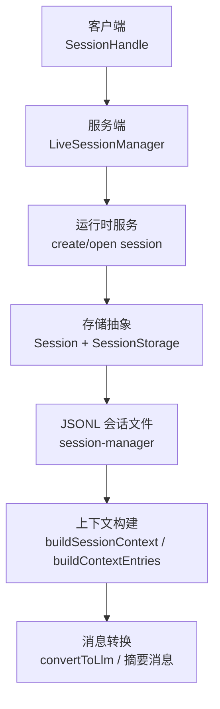
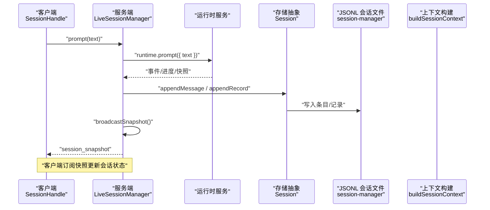
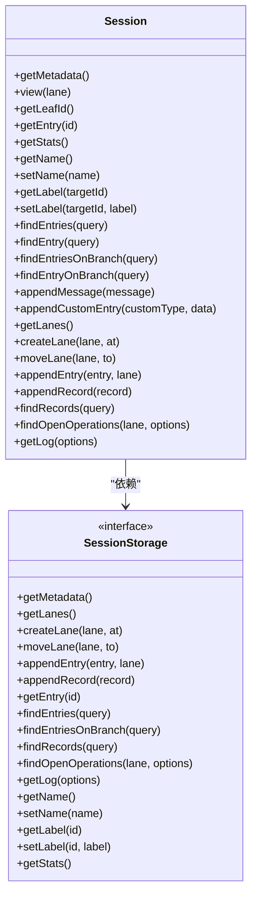
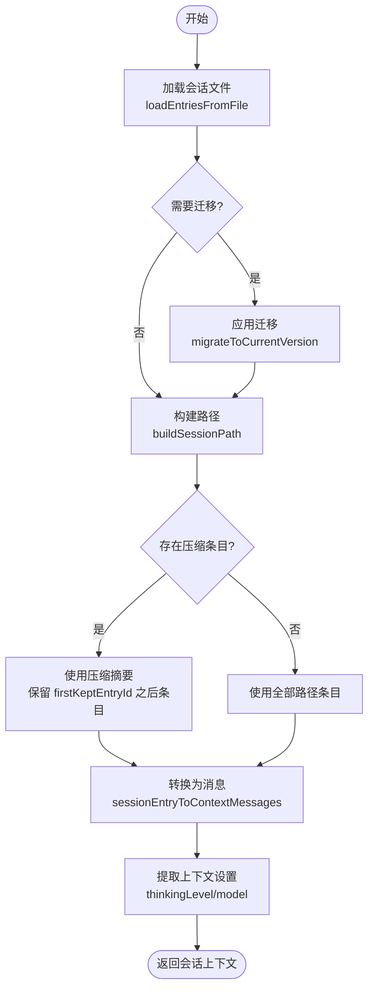
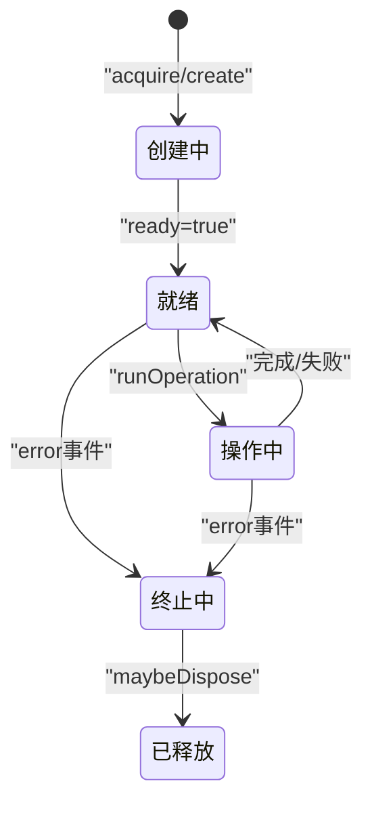
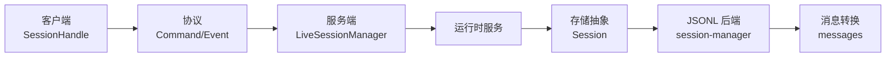

# 会话生命周期管理

<cite>
**本文引用的文件**
- [packages/agent/src/harness/session/session.ts](file://packages/agent/src/harness/session/session.ts)
- [packages/agent/src/harness/session/types.ts](file://packages/agent/src/harness/session/types.ts)
- [packages/coding-agent/src/core/session-manager.ts](file://packages/coding-agent/src/core/session-manager.ts)
- [packages/coding-agent/src/core/messages.ts](file://packages/coding-agent/src/core/messages.ts)
- [packages/server/src/sessions.ts](file://packages/server/src/sessions.ts)
- [packages/client/src/session-handle.ts](file://packages/client/src/session-handle.ts)
</cite>

## 目录
1. [简介](#简介)
2. [项目结构](#项目结构)
3. [核心组件](#核心组件)
4. [架构总览](#架构总览)
5. [详细组件分析](#详细组件分析)
6. [依赖关系分析](#依赖关系分析)
7. [性能与内存优化](#性能与内存优化)
8. [故障排查指南](#故障排查指南)
9. [结论](#结论)
10. [附录：示例与最佳实践](#附录示例与最佳实践)

## 简介
本技术文档围绕“会话生命周期管理”展开，系统阐述从创建、初始化、活跃到终止与清理的完整流程；深入解释状态转换机制、持久化策略与恢复机制；并说明会话上下文（消息历史、上下文窗口控制、内存优化）的管理方式。同时提供基于仓库代码的具体使用路径与错误恢复场景指导，帮助读者正确创建与管理会话，并在异常情况下进行稳健恢复。

## 项目结构
本项目采用分层与多包协作的方式组织会话相关能力：
- 客户端层：SessionHandle 封装对服务器的会话操作（创建、附加、提示、转向、中止、模型/思考级别设置等）。
- 服务端层：LiveSessionManager 负责会话实例的生命周期管理、连接附着、事件广播与自动回收。
- 存储与树抽象：Session 类实现 SessionTree 接口，统一读写入口；SessionStorage 定义后端存储契约。
- 编码代理会话管理器：session-manager 提供 JSONL 文件型会话的加载、迁移、构建上下文、压缩摘要、分支摘要等能力。
- 消息与上下文：messages 将扩展消息转换为 LLM 可消费的消息格式，参与上下文构建。

**图表来源**
- [packages/client/src/session-handle.ts:47-111](file://packages/client/src/session-handle.ts#L47-L111)
- [packages/server/src/sessions.ts:38-120](file://packages/server/src/sessions.ts#L38-L120)
- [packages/agent/src/harness/session/session.ts:102-299](file://packages/agent/src/harness/session/session.ts#L102-L299)
- [packages/coding-agent/src/core/session-manager.ts:418-470](file://packages/coding-agent/src/core/session-manager.ts#L418-L470)
- [packages/coding-agent/src/core/messages.ts:148-196](file://packages/coding-agent/src/core/messages.ts#L148-L196)

**章节来源**
- [packages/client/src/session-handle.ts:47-111](file://packages/client/src/session-handle.ts#L47-L111)
- [packages/server/src/sessions.ts:38-120](file://packages/server/src/sessions.ts#L38-L120)
- [packages/agent/src/harness/session/session.ts:102-299](file://packages/agent/src/harness/session/session.ts#L102-L299)
- [packages/coding-agent/src/core/session-manager.ts:418-470](file://packages/coding-agent/src/core/session-manager.ts#L418-L470)
- [packages/coding-agent/src/core/messages.ts:148-196](file://packages/coding-agent/src/core/messages.ts#L148-L196)

## 核心组件
- 客户端会话句柄（SessionHandle）：对外暴露统一的会话操作 API，内部通过请求命令与服务器交互，支持订阅快照与事件。
- 服务端会话管理器（LiveSessionManager）：维护运行中会话、连接附着、命令分发、事件广播、自动回收与终止处理。
- 会话树与存储（Session + SessionStorage）：提供跨分支的条目追加、查询、记录写入、标签与名称管理等；存储契约解耦具体持久化实现。
- 编码代理会话管理器（session-manager）：实现 JSONL 文件存储的读取、迁移、上下文构建、压缩与分支摘要、最近会话发现等。
- 消息转换（messages）：将扩展消息（如 bash 执行、自定义消息、分支/压缩摘要）转换为 LLM 可用的消息格式。

**章节来源**
- [packages/client/src/session-handle.ts:47-111](file://packages/client/src/session-handle.ts#L47-L111)
- [packages/server/src/sessions.ts:38-120](file://packages/server/src/sessions.ts#L38-L120)
- [packages/agent/src/harness/session/session.ts:102-299](file://packages/agent/src/harness/session/session.ts#L102-L299)
- [packages/agent/src/harness/session/types.ts:290-352](file://packages/agent/src/harness/session/types.ts#L290-L352)
- [packages/coding-agent/src/core/session-manager.ts:418-470](file://packages/coding-agent/src/core/session-manager.ts#L418-L470)
- [packages/coding-agent/src/core/messages.ts:148-196](file://packages/coding-agent/src/core/messages.ts#L148-L196)

## 架构总览
下图展示一次典型的用户提示（prompt）从客户端到服务端再到存储与上下文构建的调用序列。

**图表来源**
- [packages/client/src/session-handle.ts:88-106](file://packages/client/src/session-handle.ts#L88-L106)
- [packages/server/src/sessions.ts:90-118](file://packages/server/src/sessions.ts#L90-L118)
- [packages/agent/src/harness/session/session.ts:178-207](file://packages/agent/src/harness/session/session.ts#L178-L207)
- [packages/coding-agent/src/core/session-manager.ts:418-470](file://packages/coding-agent/src/core/session-manager.ts#L418-L470)

## 详细组件分析

### 会话树与存储（Session + SessionStorage）
- 会话树（Session）：提供统一的读写入口，包括消息与自定义条目的追加、按分支查询、记录写入、标签与名称管理、日志获取等。所有写操作在提交前进行 JSON 可序列化校验，确保持久化安全。
- 存储契约（SessionStorage）：定义会话元数据、分支指针、条目与记录的增删查改、打开操作查询、日志拉取等接口，便于替换不同后端（如 SQLite、文件系统）。

**图表来源**
- [packages/agent/src/harness/session/session.ts:102-299](file://packages/agent/src/harness/session/session.ts#L102-L299)
- [packages/agent/src/harness/session/types.ts:290-352](file://packages/agent/src/harness/session/types.ts#L290-L352)

**章节来源**
- [packages/agent/src/harness/session/session.ts:102-299](file://packages/agent/src/harness/session/session.ts#L102-L299)
- [packages/agent/src/harness/session/types.ts:290-352](file://packages/agent/src/harness/session/types.ts#L290-L352)

### 编码代理会话管理器（session-manager）
- 会话文件结构：以 JSONL 形式存储，首行为会话头（包含 id、时间戳、工作目录、父会话等），后续为各类条目（消息、模型变更、思考级别变更、压缩摘要、分支摘要、自定义条目、标签、会话信息等）。
- 版本迁移：支持 v1→v2（添加 id/parentId 树结构）、v2→v3（重命名角色），保证向后兼容。
- 上下文构建：根据当前叶子节点回溯路径，处理压缩与分支摘要，生成进入 LLM 的上下文消息列表；同时提取思考级别与模型信息。
- 最近会话发现：扫描会话目录，解析头部，按修改时间排序返回最近会话。

**图表来源**
- [packages/coding-agent/src/core/session-manager.ts:230-291](file://packages/coding-agent/src/core/session-manager.ts#L230-L291)
- [packages/coding-agent/src/core/session-manager.ts:418-470](file://packages/coding-agent/src/core/session-manager.ts#L418-L470)
- [packages/coding-agent/src/core/session-manager.ts:514-556](file://packages/coding-agent/src/core/session-manager.ts#L514-L556)

**章节来源**
- [packages/coding-agent/src/core/session-manager.ts:230-291](file://packages/coding-agent/src/core/session-manager.ts#L230-L291)
- [packages/coding-agent/src/core/session-manager.ts:418-470](file://packages/coding-agent/src/core/session-manager.ts#L418-L470)
- [packages/coding-agent/src/core/session-manager.ts:514-556](file://packages/coding-agent/src/core/session-manager.ts#L514-L556)

### 服务端会话管理器（LiveSessionManager）
- 会话生命周期：
  - 创建：分配 ID，调用服务 createSession，获取运行时快照，建立连接集合，标记 ready。
  - 附加/分离：连接加入/离开会话，必要时广播快照。
  - 操作执行：prompt/steer/abort/set_model/set_thinking 等操作通过 runOperation 包装，完成后广播快照并调度可能回收。
  - 终止：收到运行时 error 事件时，标记 terminal，关闭连接，触发 maybeDispose。
  - 回收：当无连接、非终端且处于 idle 阶段时，取消订阅并 dispose 运行时。
- 并发与一致性：openingSessions 防止重复创建同一会话；normalizedSnapshot 校验运行时返回的会话 ID 一致。

**图表来源**
- [packages/server/src/sessions.ts:186-246](file://packages/server/src/sessions.ts#L186-L246)
- [packages/server/src/sessions.ts:248-274](file://packages/server/src/sessions.ts#L248-L274)
- [packages/server/src/sessions.ts:320-345](file://packages/server/src/sessions.ts#L320-L345)

**章节来源**
- [packages/server/src/sessions.ts:47-120](file://packages/server/src/sessions.ts#L47-L120)
- [packages/server/src/sessions.ts:186-246](file://packages/server/src/sessions.ts#L186-L246)
- [packages/server/src/sessions.ts:248-274](file://packages/server/src/sessions.ts#L248-L274)
- [packages/server/src/sessions.ts:320-345](file://packages/server/src/sessions.ts#L320-L345)

### 客户端会话句柄（SessionHandle）
- 功能：封装会话的 prompt、steer、abort、set_model、set_thinking 等操作，以及订阅快照和事件。
- 模式：支持共享或独占租约模式（由上层决定），对外暴露 active/attached/snapshot 等属性。
- 请求转发：内部通过 request 方法发送带 sessionId 的命令，并返回结果中的 session 快照。

**章节来源**
- [packages/client/src/session-handle.ts:15-45](file://packages/client/src/session-handle.ts#L15-L45)
- [packages/client/src/session-handle.ts:47-111](file://packages/client/src/session-handle.ts#L47-L111)

### 消息与上下文（messages）
- 扩展消息类型：bashExecution、custom、branchSummary、compactionSummary。
- 转换规则：将扩展消息转换为 LLM 可消费的 Message，其中 bashExecution 可选择排除上下文，custom 转为 user 消息，分支/压缩摘要包裹为特定文本。
- 上下文注入：session-manager 在构建上下文时将这些消息纳入 LLM 输入，从而保持会话语义连贯。

**章节来源**
- [packages/coding-agent/src/core/messages.ts:29-77](file://packages/coding-agent/src/core/messages.ts#L29-L77)
- [packages/coding-agent/src/core/messages.ts:148-196](file://packages/coding-agent/src/core/messages.ts#L148-L196)

## 依赖关系分析
- 客户端依赖协议与服务端交互，通过 SessionHandle 发送命令并接收快照事件。
- 服务端依赖运行时服务（create/open session），并通过 LiveSessionManager 协调连接与会话生命周期。
- 存储抽象（Session + SessionStorage）解耦具体实现，coding-agent 的 session-manager 提供 JSONL 文件后端。
- 消息模块被 session-manager 用于上下文构建，确保扩展消息正确参与 LLM 对话。

**图表来源**
- [packages/client/src/session-handle.ts:47-111](file://packages/client/src/session-handle.ts#L47-L111)
- [packages/server/src/sessions.ts:38-120](file://packages/server/src/sessions.ts#L38-L120)
- [packages/agent/src/harness/session/session.ts:102-299](file://packages/agent/src/harness/session/session.ts#L102-L299)
- [packages/coding-agent/src/core/session-manager.ts:418-470](file://packages/coding-agent/src/core/session-manager.ts#L418-L470)
- [packages/coding-agent/src/core/messages.ts:148-196](file://packages/coding-agent/src/core/messages.ts#L148-L196)

**章节来源**
- [packages/client/src/session-handle.ts:47-111](file://packages/client/src/session-handle.ts#L47-L111)
- [packages/server/src/sessions.ts:38-120](file://packages/server/src/sessions.ts#L38-L120)
- [packages/agent/src/harness/session/session.ts:102-299](file://packages/agent/src/harness/session/session.ts#L102-L299)
- [packages/coding-agent/src/core/session-manager.ts:418-470](file://packages/coding-agent/src/core/session-manager.ts#L418-L470)
- [packages/coding-agent/src/core/messages.ts:148-196](file://packages/coding-agent/src/core/messages.ts#L148-L196)

## 性能与内存优化
- 流式读取与缓冲：会话文件读取使用固定大小缓冲区与行级解析，避免一次性加载大文件导致内存峰值。
- 头部扫描限制：会话头部扫描限制最大字节数，防止超大头部影响启动性能。
- 并发加载：会话信息构建支持并发上限，提升批量扫描效率。
- 上下文裁剪：通过压缩与分支摘要减少上下文长度，降低 LLM 调用成本与内存占用。
- 可序列化校验：写入前进行严格的 JSON 可序列化检查，避免无效负载导致的存储与恢复问题。

[本节为通用性能讨论，不直接分析具体文件]

## 故障排查指南
- 会话锁定与终止：
  - 若运行时返回错误事件，服务端会标记会话为 terminal，关闭连接并尝试回收。
  - 连接断开时，服务端会移除连接并尝试回收会话。
- 会话不存在或未附加：
  - 未附加的连接执行操作会抛出“not_found”或“invalid_request”。
- 存储错误：
  - 会话存储层抛出 SessionError，携带错误码（如 invalid_payload、invalid_lane、invalid_query、storage 等），便于定位问题。
- 恢复机制：
  - 通过 findOpenOperations 查询未完成的操作，结合记录（operation_started/finished/abort_requested）判断恢复点。
  - 会话文件迁移确保旧版本数据可被正确解析与升级。

**章节来源**
- [packages/server/src/sessions.ts:248-274](file://packages/server/src/sessions.ts#L248-L274)
- [packages/server/src/sessions.ts:309-318](file://packages/server/src/sessions.ts#L309-L318)
- [packages/agent/src/harness/session/types.ts:375-393](file://packages/agent/src/harness/session/types.ts#L375-L393)
- [packages/agent/src/harness/session/types.ts:312-318](file://packages/agent/src/harness/session/types.ts#L312-L318)
- [packages/coding-agent/src/core/session-manager.ts:230-291](file://packages/coding-agent/src/core/session-manager.ts#L230-L291)

## 结论
本方案通过客户端句柄、服务端管理器、存储抽象与 JSONL 后端的分层设计，实现了会话的完整生命周期管理与稳健的上下文构建。借助压缩与分支摘要机制，系统在长对话场景中保持了良好的性能与内存特性。错误处理与恢复机制确保了在异常情况下仍可可靠地继续或恢复会话。

[本节为总结性内容，不直接分析具体文件]

## 附录：示例与最佳实践
- 创建与会话附加
  - 客户端：使用 SessionHandle 的 prompt/steer/abort 等方法与服务器交互，订阅快照更新会话状态。
  - 服务端：通过 LiveSessionManager 的 executeCommand 处理 create/attach/prompt 等命令，确保连接与会话状态一致。
- 上下文管理
  - 使用 session-manager 的 buildSessionContext 构建当前会话上下文，注意压缩与分支摘要的影响。
  - 使用 messages.convertToLlm 将扩展消息转换为 LLM 可用格式，确保上下文一致性。
- 异常与恢复
  - 捕获 SessionError 并根据错误码采取相应措施（如重试、回滚、提示用户）。
  - 利用 findOpenOperations 与记录类型判断未完成操作，实现断点续跑或清理。

**章节来源**
- [packages/client/src/session-handle.ts:88-106](file://packages/client/src/session-handle.ts#L88-L106)
- [packages/server/src/sessions.ts:47-120](file://packages/server/src/sessions.ts#L47-L120)
- [packages/coding-agent/src/core/session-manager.ts:418-470](file://packages/coding-agent/src/core/session-manager.ts#L418-L470)
- [packages/coding-agent/src/core/messages.ts:148-196](file://packages/coding-agent/src/core/messages.ts#L148-L196)
- [packages/agent/src/harness/session/types.ts:375-393](file://packages/agent/src/harness/session/types.ts#L375-L393)
- [packages/agent/src/harness/session/types.ts:312-318](file://packages/agent/src/harness/session/types.ts#L312-L318)