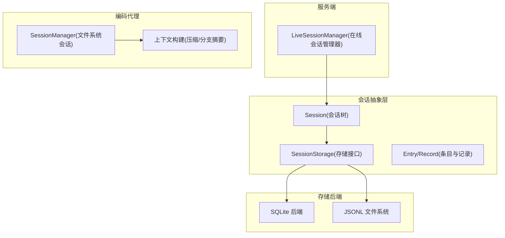
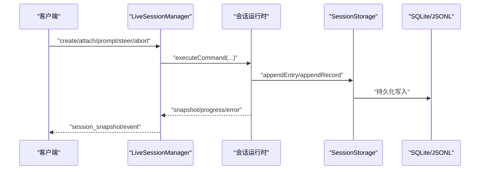
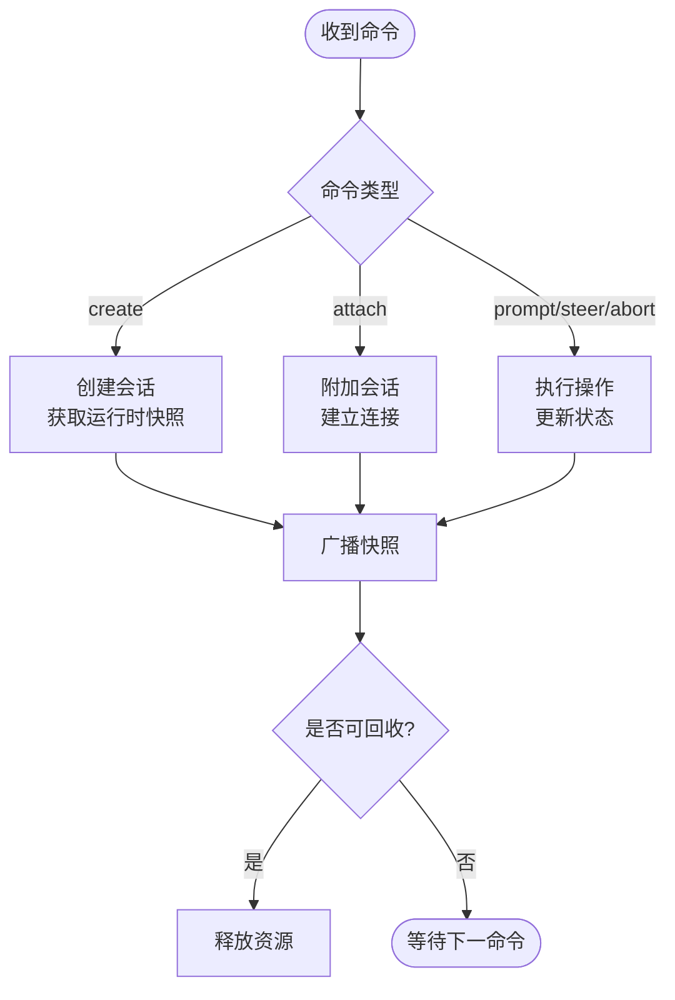
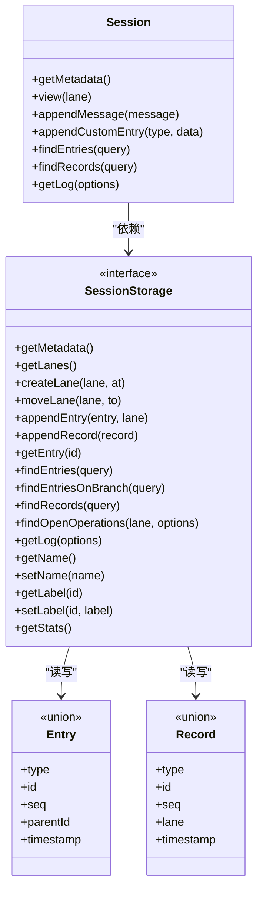
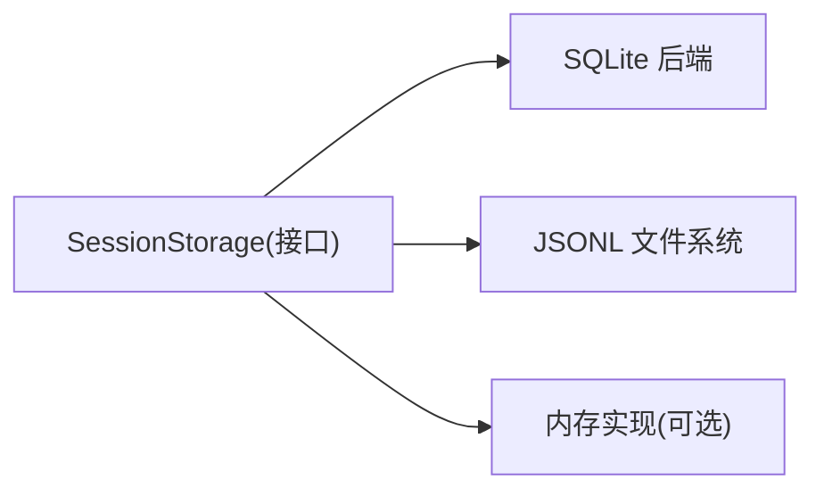
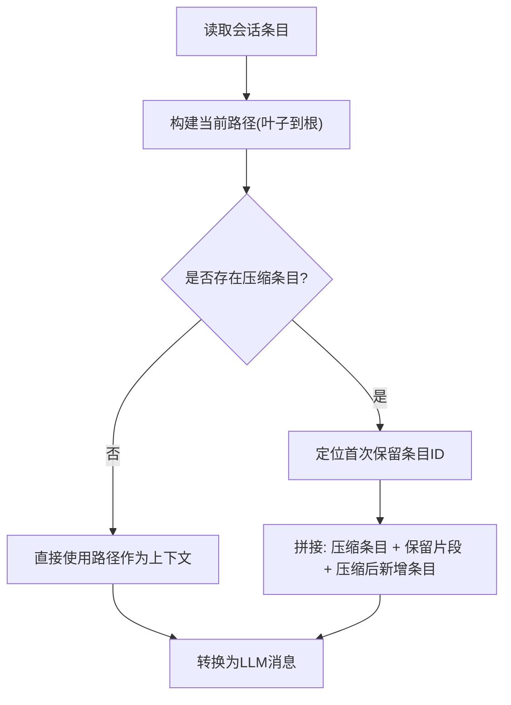
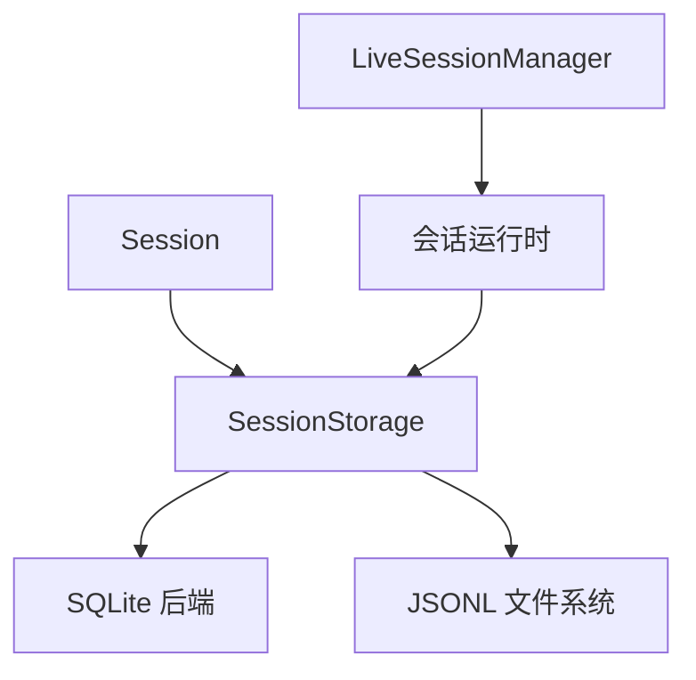

# 会话管理

<cite>
**本文引用的文件**
- [packages/agent/src/harness/session/types.ts](file://packages/agent/src/harness/session/types.ts)
- [packages/agent/src/harness/session/session.ts](file://packages/agent/src/harness/session/session.ts)
- [packages/server/src/sessions.ts](file://packages/server/src/sessions.ts)
- [packages/coding-agent/src/core/session-manager.ts](file://packages/coding-agent/src/core/session-manager.ts)
- [packages/session-backends/sqlite-node/src/index.ts](file://packages/session-backends/sqlite-node/src/index.ts)
- [packages/agent/src/harness/session/jsonl/types.ts](file://packages/agent/src/harness/session/jsonl/types.ts)
</cite>

## 目录
1. [简介](#简介)
2. [项目结构](#项目结构)
3. [核心组件](#核心组件)
4. [架构总览](#架构总览)
5. [详细组件分析](#详细组件分析)
6. [依赖关系分析](#依赖关系分析)
7. [性能考量](#性能考量)
8. [故障排查指南](#故障排查指南)
9. [结论](#结论)
10. [附录](#附录)

## 简介
本技术文档围绕“会话管理系统”展开，重点解释会话生命周期（创建、持久化、压缩）、多存储后端（SQLite、内存、文件系统）的实现差异与适用场景，并深入说明对话历史管理、分支摘要生成、上下文窗口优化。同时提供如何配置不同会话后端的指引，以及如何自定义会话压缩策略的说明。最后讨论会话数据的安全性与隐私保护措施。

## 项目结构
仓库采用多包组织，与会话管理直接相关的核心位置如下：
- 会话抽象与树操作：packages/agent/src/harness/session
- 服务端会话生命周期管理：packages/server/src/sessions.ts
- 编码代理侧的文件系统会话实现与上下文构建：packages/coding-agent/src/core/session-manager.ts
- SQLite 后端封装：packages/session-backends/sqlite-node/src/index.ts
- JSONL 会话元数据定义：packages/agent/src/harness/session/jsonl/types.ts

图表来源
- [packages/agent/src/harness/session/session.ts:102-299](file://packages/agent/src/harness/session/session.ts#L102-L299)
- [packages/agent/src/harness/session/types.ts:290-326](file://packages/agent/src/harness/session/types.ts#L290-L326)
- [packages/server/src/sessions.ts:38-120](file://packages/server/src/sessions.ts#L38-L120)
- [packages/coding-agent/src/core/session-manager.ts:418-470](file://packages/coding-agent/src/core/session-manager.ts#L418-L470)
- [packages/session-backends/sqlite-node/src/index.ts:53-102](file://packages/session-backends/sqlite-node/src/index.ts#L53-L102)
- [packages/agent/src/harness/session/jsonl/types.ts:20-57](file://packages/agent/src/harness/session/jsonl/types.ts#L20-L57)

章节来源
- [packages/agent/src/harness/session/session.ts:102-299](file://packages/agent/src/harness/session/session.ts#L102-L299)
- [packages/server/src/sessions.ts:38-120](file://packages/server/src/sessions.ts#L38-L120)
- [packages/coding-agent/src/core/session-manager.ts:418-470](file://packages/coding-agent/src/core/session-manager.ts#L418-L470)
- [packages/session-backends/sqlite-node/src/index.ts:53-102](file://packages/session-backends/sqlite-node/src/index.ts#L53-L102)
- [packages/agent/src/harness/session/jsonl/types.ts:20-57](file://packages/agent/src/harness/session/jsonl/types.ts#L20-L57)

## 核心组件
- 会话树 Session：提供消息追加、标签、分支视图、查询、日志等能力，所有写操作均通过 SessionStorage 持久化。
- 存储接口 SessionStorage：定义会话元数据、车道（lane）管理、条目与记录读写、统计与日志等统一接口。
- 服务端 LiveSessionManager：负责命令路由、会话创建/附加/分离、运行时事件广播、自动回收。
- 编码代理 SessionManager：基于 JSONL 文件系统的会话实现，支持迁移、上下文构建、压缩与分支摘要。
- SQLite 后端：封装 Node sqlite 数据库，提供事务、语句执行与关闭能力。

章节来源
- [packages/agent/src/harness/session/session.ts:102-299](file://packages/agent/src/harness/session/session.ts#L102-L299)
- [packages/agent/src/harness/session/types.ts:290-326](file://packages/agent/src/harness/session/types.ts#L290-L326)
- [packages/server/src/sessions.ts:38-120](file://packages/server/src/sessions.ts#L38-L120)
- [packages/coding-agent/src/core/session-manager.ts:418-470](file://packages/coding-agent/src/core/session-manager.ts#L418-L470)
- [packages/session-backends/sqlite-node/src/index.ts:53-102](file://packages/session-backends/sqlite-node/src/index.ts#L53-L102)

## 架构总览
下图展示从客户端到服务端的会话控制流，以及会话数据在存储后端的持久化路径。

图表来源
- [packages/server/src/sessions.ts:47-120](file://packages/server/src/sessions.ts#L47-L120)
- [packages/agent/src/harness/session/session.ts:178-299](file://packages/agent/src/harness/session/session.ts#L178-L299)
- [packages/session-backends/sqlite-node/src/index.ts:53-102](file://packages/session-backends/sqlite-node/src/index.ts#L53-L102)

## 详细组件分析

### 会话生命周期管理
- 创建与附加
  - 服务端接收 create/attach 命令，分配或复用会话 ID，获取运行时快照，建立连接并广播初始快照。
- 运行期操作
  - prompt/steer/abort/set_model/set_thinking 等操作通过 runOperation 包装，完成后广播最新快照，并在空闲时尝试回收。
- 资源回收
  - 当无连接且处于空闲态，或显式终止时，取消订阅并释放运行时资源。

图表来源
- [packages/server/src/sessions.ts:47-120](file://packages/server/src/sessions.ts#L47-L120)
- [packages/server/src/sessions.ts:171-184](file://packages/server/src/sessions.ts#L171-L184)
- [packages/server/src/sessions.ts:320-345](file://packages/server/src/sessions.ts#L320-L345)

章节来源
- [packages/server/src/sessions.ts:47-120](file://packages/server/src/sessions.ts#L47-L120)
- [packages/server/src/sessions.ts:171-184](file://packages/server/src/sessions.ts#L171-L184)
- [packages/server/src/sessions.ts:320-345](file://packages/server/src/sessions.ts#L320-L345)

### 会话持久化与数据结构
- 会话树与条目
  - Session 类对上层暴露统一的树操作；所有写前进行 JSON 可序列化校验，确保可持久化。
  - Entry/Record 类型定义了消息、模型变更、思考级别变更、工具使用、操作记录、用量统计等。
- 存储接口
  - SessionStorage 抽象了车道（lane）管理、条目与记录读写、查询、统计与日志，屏蔽底层实现差异。

图表来源
- [packages/agent/src/harness/session/session.ts:102-299](file://packages/agent/src/harness/session/session.ts#L102-L299)
- [packages/agent/src/harness/session/types.ts:290-326](file://packages/agent/src/harness/session/types.ts#L290-L326)
- [packages/agent/src/harness/session/types.ts:14-74](file://packages/agent/src/harness/session/types.ts#L14-L74)
- [packages/agent/src/harness/session/types.ts:80-215](file://packages/agent/src/harness/session/types.ts#L80-L215)

章节来源
- [packages/agent/src/harness/session/session.ts:102-299](file://packages/agent/src/harness/session/session.ts#L102-L299)
- [packages/agent/src/harness/session/types.ts:14-74](file://packages/agent/src/harness/session/types.ts#L14-L74)
- [packages/agent/src/harness/session/types.ts:80-215](file://packages/agent/src/harness/session/types.ts#L80-L215)
- [packages/agent/src/harness/session/types.ts:290-326](file://packages/agent/src/harness/session/types.ts#L290-L326)

### 多种存储后端实现差异与适用场景
- SQLite 后端
  - 提供同步事务、预编译语句、关闭能力；适合需要强一致、复杂查询与高并发读写的场景。
  - 通过工厂方法创建数据库实例，封装语句执行结果。
- JSONL 文件系统后端
  - 以行式 JSON 文件存储会话条目，便于人类可读与版本迁移；适合本地开发、调试与跨进程共享。
  - 元数据包含 cwd、修改时间、源格式版本等，支持按工作目录编码会话目录。
- 内存后端（概念性）
  - 若需极致性能与临时会话，可在内存中实现 SessionStorage（例如 Map/数组），但需自行处理持久化与恢复。

图表来源
- [packages/session-backends/sqlite-node/src/index.ts:53-102](file://packages/session-backends/sqlite-node/src/index.ts#L53-L102)
- [packages/agent/src/harness/session/jsonl/types.ts:20-57](file://packages/agent/src/harness/session/jsonl/types.ts#L20-L57)

章节来源
- [packages/session-backends/sqlite-node/src/index.ts:53-102](file://packages/session-backends/sqlite-node/src/index.ts#L53-L102)
- [packages/agent/src/harness/session/jsonl/types.ts:20-57](file://packages/agent/src/harness/session/jsonl/types.ts#L20-L57)

### 对话历史管理与上下文窗口优化
- 会话路径与上下文构建
  - 根据叶子节点回溯父链得到当前会话路径；结合压缩与分支摘要，过滤掉已总结的历史，仅保留必要上下文。
- 压缩与分支摘要
  - 压缩条目记录被摘要的起始点与令牌数变化；分支摘要用于分叉后的独立上下文。
- 上下文消息投影
  - 将会话条目映射为 LLM 可用的消息集合，忽略纯状态型条目，注入必要的摘要信息。

图表来源
- [packages/coding-agent/src/core/session-manager.ts:334-360](file://packages/coding-agent/src/core/session-manager.ts#L334-L360)
- [packages/coding-agent/src/core/session-manager.ts:418-470](file://packages/coding-agent/src/core/session-manager.ts#L418-L470)
- [packages/coding-agent/src/core/session-manager.ts:383-408](file://packages/coding-agent/src/core/session-manager.ts#L383-L408)

章节来源
- [packages/coding-agent/src/core/session-manager.ts:334-360](file://packages/coding-agent/src/core/session-manager.ts#L334-L360)
- [packages/coding-agent/src/core/session-manager.ts:418-470](file://packages/coding-agent/src/core/session-manager.ts#L418-L470)
- [packages/coding-agent/src/core/session-manager.ts:383-408](file://packages/coding-agent/src/core/session-manager.ts#L383-L408)

### 分支摘要生成
- 分支摘要条目用于记录某一分支的摘要起点与内容，参与上下文构建时会被转换为特定消息类型。
- 摘要可由扩展或系统生成，支持携带额外细节与用量信息。

章节来源
- [packages/coding-agent/src/core/session-manager.ts:82-92](file://packages/coding-agent/src/core/session-manager.ts#L82-L92)
- [packages/coding-agent/src/core/session-manager.ts:401-403](file://packages/coding-agent/src/core/session-manager.ts#L401-L403)

### 自定义会话压缩策略
- 触发条件
  - 可通过阈值、溢出或手动触发压缩；压缩记录包含原因、摘要、保留尾部消息与令牌统计。
- 策略要点
  - 选择保留的尾部消息以保证近期上下文；记录压缩前的令牌数以追踪成本。
  - 可扩展压缩逻辑，将摘要与细节持久化为专用条目。

章节来源
- [packages/agent/src/harness/session/types.ts:44-51](file://packages/agent/src/harness/session/types.ts#L44-L51)
- [packages/agent/src/harness/session/types.ts:127-148](file://packages/agent/src/harness/session/types.ts#L127-L148)

### 配置不同的会话后端
- SQLite 后端
  - 使用工厂方法创建数据库实例，并通过封装的语句接口执行 SQL；事务保证一致性。
- JSONL 文件系统
  - 指定文件系统抽象与会话根目录；元数据包含 cwd、版本、修改时间等。
- 内存后端（概念性）
  - 在内存中维护会话树与记录，适用于测试或短期会话；需自行实现持久化钩子。

章节来源
- [packages/session-backends/sqlite-node/src/index.ts:53-102](file://packages/session-backends/sqlite-node/src/index.ts#L53-L102)
- [packages/agent/src/harness/session/jsonl/types.ts:20-57](file://packages/agent/src/harness/session/jsonl/types.ts#L20-L57)

## 依赖关系分析
- 耦合与内聚
  - Session 与 SessionStorage 解耦良好，便于替换存储后端。
  - 服务端 LiveSessionManager 与运行时交互清晰，事件驱动广播快照。
- 外部依赖
  - SQLite 后端依赖 node:sqlite；JSONL 后端依赖文件系统 API。
- 循环依赖
  - 未见明显循环依赖；类型定义集中在 types.ts，降低耦合。

图表来源
- [packages/agent/src/harness/session/session.ts:102-299](file://packages/agent/src/harness/session/session.ts#L102-L299)
- [packages/server/src/sessions.ts:38-120](file://packages/server/src/sessions.ts#L38-L120)
- [packages/session-backends/sqlite-node/src/index.ts:53-102](file://packages/session-backends/sqlite-node/src/index.ts#L53-L102)
- [packages/agent/src/harness/session/jsonl/types.ts:20-57](file://packages/agent/src/harness/session/jsonl/types.ts#L20-L57)

章节来源
- [packages/agent/src/harness/session/session.ts:102-299](file://packages/agent/src/harness/session/session.ts#L102-L299)
- [packages/server/src/sessions.ts:38-120](file://packages/server/src/sessions.ts#L38-L120)
- [packages/session-backends/sqlite-node/src/index.ts:53-102](file://packages/session-backends/sqlite-node/src/index.ts#L53-L102)
- [packages/agent/src/harness/session/jsonl/types.ts:20-57](file://packages/agent/src/harness/session/jsonl/types.ts#L20-L57)

## 性能考量
- 写入路径
  - 会话条目追加前进行 JSON 可序列化校验，避免无效写入；批量写入建议使用事务（SQLite）。
- 读取路径
  - 上下文构建遵循路径回溯与压缩过滤，减少不必要的数据加载；JSONL 读取采用缓冲与流式解析，避免大文件阻塞。
- 并发与锁
  - SQLite 使用 IMMEDIATE 事务提升并发安全性；文件系统需注意竞态条件（如最近会话发现）。
- 资源回收
  - 服务端在无连接且空闲时自动回收会话，防止内存泄漏。

[本节为通用指导，不直接分析具体文件]

## 故障排查指南
- 常见错误
  - 无效载荷：非标准对象、循环引用、不可序列化数字等会导致写入失败。
  - 无效查询：limit 必须为正整数；cursor.afterSeq 必须为非负整数。
  - 会话锁定：运行时终止或正在回收时，无法新建或附加会话。
- 诊断步骤
  - 检查日志项（entry/record/lane/fact）定位问题阶段。
  - 查看未完成任务（operation_started）与中止请求（abort_requested）判断卡住原因。
  - 对于 JSONL 文件，确认头信息有效且未超过扫描限制。

章节来源
- [packages/agent/src/harness/session/session.ts:26-39](file://packages/agent/src/harness/session/session.ts#L26-L39)
- [packages/agent/src/harness/session/types.ts:375-393](file://packages/agent/src/harness/session/types.ts#L375-L393)
- [packages/server/src/sessions.ts:186-207](file://packages/server/src/sessions.ts#L186-L207)
- [packages/coding-agent/src/core/session-manager.ts:496-513](file://packages/coding-agent/src/core/session-manager.ts#L496-L513)

## 结论
本会话管理系统通过清晰的抽象层（Session/SessionStorage）与多后端支持，实现了灵活的会话生命周期管理、高效的上下文构建与压缩、以及稳定的服务端会话协调。SQLite 与 JSONL 两种后端分别满足高性能与可移植需求。建议在生产环境中结合压缩策略与监控指标，持续优化上下文窗口与成本。

[本节为总结性内容，不直接分析具体文件]

## 附录
- 安全与隐私
  - 输入校验：写入前进行严格的 JSON 可序列化校验，防止恶意或异常数据进入持久化层。
  - 最小化敏感信息：尽量不在会话条目中存储敏感数据；如需存储，应加密或脱敏。
  - 访问控制：文件系统权限与数据库访问权限需严格限制；服务端连接需鉴权。
  - 审计与日志：利用记录与日志功能追踪关键操作，便于审计与回溯。
  - 传输安全：与服务端通信建议使用加密通道（如 TLS），避免明文传输会话数据。

[本节为通用指导，不直接分析具体文件]