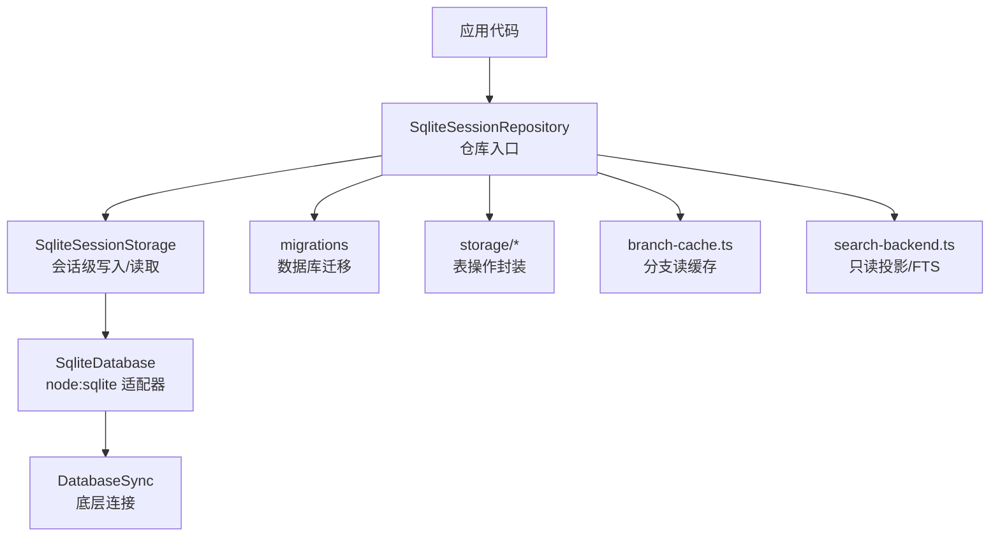
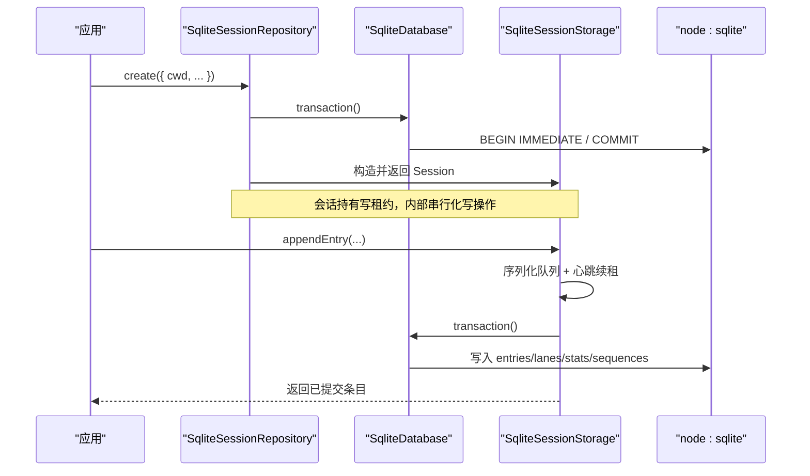
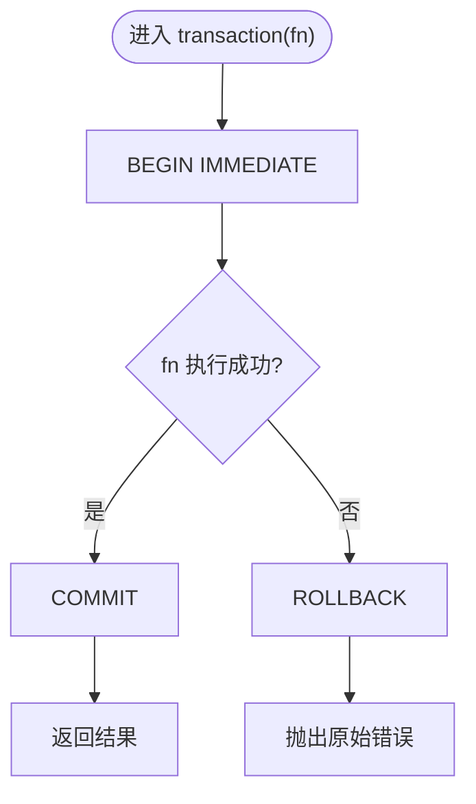
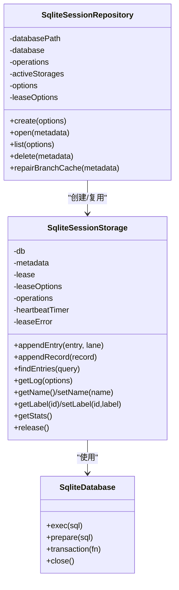
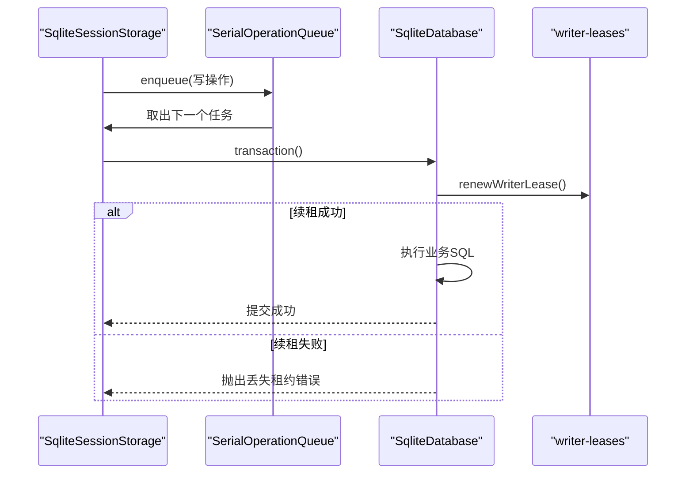
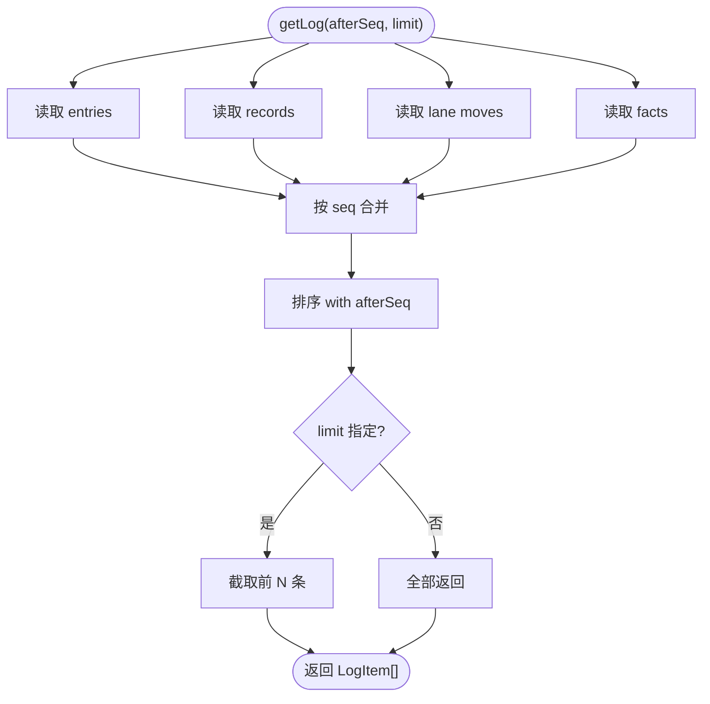
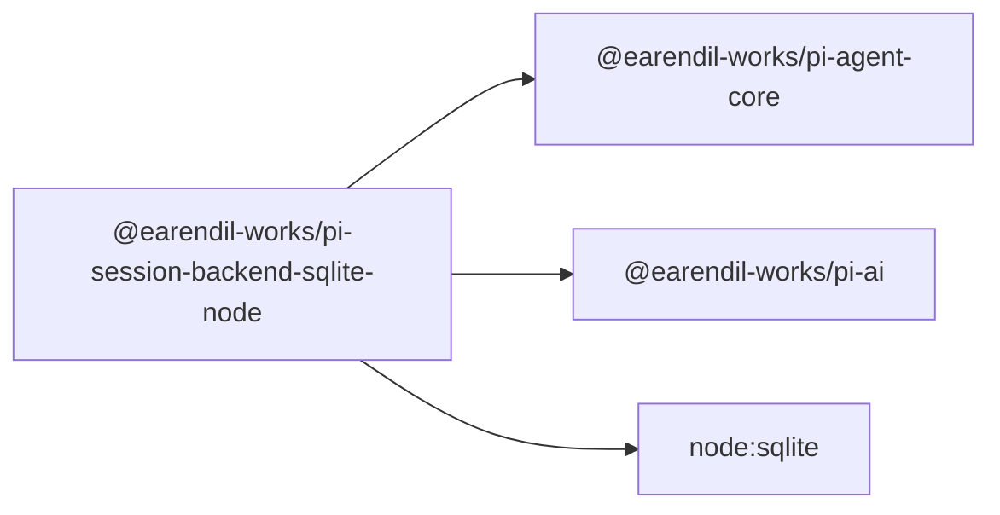

# SQLite 存储后端

<cite>
**本文引用的文件**
- [packages/session-backends/sqlite-node/README.md](file://packages/session-backends/sqlite-node/README.md)
- [packages/session-backends/sqlite-node/package.json](file://packages/session-backends/sqlite-node/package.json)
- [packages/session-backends/sqlite-node/src/index.ts](file://packages/session-backends/sqlite-node/src/index.ts)
- [packages/session-backends/sqlite-node/src/sqlite/index.ts](file://packages/session-backends/sqlite-node/src/sqlite/index.ts)
- [packages/session-backends/sqlite-node/src/sqlite/types.ts](file://packages/session-backends/sqlite-node/src/sqlite/types.ts)
- [packages/session-backends/sqlite-node/src/sqlite/repo.ts](file://packages/session-backends/sqlite-node/src/sqlite/repo.ts)
</cite>

## 目录
1. [简介](#简介)
2. [项目结构](#项目结构)
3. [核心组件](#核心组件)
4. [架构总览](#架构总览)
5. [详细组件分析](#详细组件分析)
6. [依赖关系分析](#依赖关系分析)
7. [性能与优化](#性能与优化)
8. [故障排查指南](#故障排查指南)
9. [结论](#结论)
10. [附录：配置与使用示例](#附录：配置与使用示例)

## 简介
本技术文档聚焦于 Node.js 环境下的 SQLite 会话存储后端，覆盖实现原理、数据库表结构与索引、并发访问控制、事务策略、错误处理、查询性能调优以及配置选项。该后端提供统一的 SqliteDatabase 抽象与工厂，封装 node:sqlite 的 DatabaseSync 能力，并通过仓库模式暴露会话创建、打开、列表、删除及增删改查等接口。

## 项目结构
SQLite 存储后端位于 packages/session-backends/sqlite-node，采用“适配器 + 仓库”的分层组织：
- 顶层 index.ts：适配 node:sqlite，提供 SqliteDatabase 包装、事务封装、工厂方法，并重新导出 sqlite 子模块。
- sqlite/index.ts：统一导出仓库、迁移、搜索后端与类型定义。
- sqlite/types.ts：定义 SqliteDatabase、SqliteStatement、会话元数据与仓库选项等核心类型。
- sqlite/repo.ts：实现 SqliteSessionRepository（仓库）与 SqliteSessionStorage（会话存储），包含并发控制、事务、序列号、统计、分支缓存、事实与标签等逻辑。
- 其他子模块（storage/*、migrations/*、search-backend.ts、branch-cache.ts、sql.ts）：负责持久化细节、迁移脚本、全文检索与 SQL 构建。

图表来源
- [packages/session-backends/sqlite-node/src/index.ts:1-106](file://packages/session-backends/sqlite-node/src/index.ts#L1-L106)
- [packages/session-backends/sqlite-node/src/sqlite/index.ts:1-19](file://packages/session-backends/sqlite-node/src/sqlite/index.ts#L1-L19)
- [packages/session-backends/sqlite-node/src/sqlite/repo.ts:681-784](file://packages/session-backends/sqlite-node/src/sqlite/repo.ts#L681-L784)

章节来源
- [packages/session-backends/sqlite-node/README.md:1-16](file://packages/session-backends/sqlite-node/README.md#L1-L16)
- [packages/session-backends/sqlite-node/package.json:1-45](file://packages/session-backends/sqlite-node/package.json#L1-L45)
- [packages/session-backends/sqlite-node/src/index.ts:1-106](file://packages/session-backends/sqlite-node/src/index.ts#L1-L106)
- [packages/session-backends/sqlite-node/src/sqlite/index.ts:1-19](file://packages/session-backends/sqlite-node/src/sqlite/index.ts#L1-L19)

## 核心组件
- SqliteDatabase / SqliteStatement：对 node:sqlite 的薄封装，提供 exec、prepare、transaction、close 能力；事务强制同步回调，确保一致性。
- SqliteSessionRepository：仓库层，管理数据库生命周期、会话创建/打开/列表/删除、分支缓存修复、并发写锁与会话存储实例复用。
- SqliteSessionStorage：会话级存储，负责条目追加、记录追加、日志聚合、名称/标签事实、统计更新、队列串行化与心跳续租。
- 迁移与存储模块：migrations 负责建表/升级；storage/* 按实体拆分（sessions、entries、records、lanes、facts、stats、sequences、writer-leases、branch-*）。

章节来源
- [packages/session-backends/sqlite-node/src/index.ts:16-102](file://packages/session-backends/sqlite-node/src/index.ts#L16-L102)
- [packages/session-backends/sqlite-node/src/sqlite/types.ts:1-52](file://packages/session-backends/sqlite-node/src/sqlite/types.ts#L1-L52)
- [packages/session-backends/sqlite-node/src/sqlite/repo.ts:345-679](file://packages/session-backends/sqlite-node/src/sqlite/repo.ts#L345-L679)
- [packages/session-backends/sqlite-node/src/sqlite/repo.ts:681-800](file://packages/session-backends/sqlite-node/src/sqlite/repo.ts#L681-L800)

## 架构总览
仓库通过工厂获取共享数据库连接，按需为每个会话申请写租约（Writer Lease），并在会话存储内串行化写操作，周期性心跳续租，释放时归还租约。读路径可走分支缓存或只读投影（搜索后端）。

图表来源
- [packages/session-backends/sqlite-node/src/index.ts:68-85](file://packages/session-backends/sqlite-node/src/index.ts#L68-L85)
- [packages/session-backends/sqlite-node/src/sqlite/repo.ts:468-496](file://packages/session-backends/sqlite-node/src/sqlite/repo.ts#L468-L496)
- [packages/session-backends/sqlite-node/src/sqlite/repo.ts:732-754](file://packages/session-backends/sqlite-node/src/sqlite/repo.ts#L732-L754)

## 详细组件分析

### 数据库适配器与事务
- 适配器将 node:sqlite 的 DatabaseSync 包装为 SqliteDatabase，支持命名参数与位置参数混用。
- 事务以 BEGIN IMMEDIATE 开始，COMMIT 成功返回，异常时 ROLLBACK 并抛出原始错误；禁止异步回调，避免不一致。
- 连接初始化设置 WAL 模式、FULL 同步、busy_timeout 提升并发写入稳定性。

图表来源
- [packages/session-backends/sqlite-node/src/index.ts:68-85](file://packages/session-backends/sqlite-node/src/index.ts#L68-L85)
- [packages/session-backends/sqlite-node/src/sqlite/repo.ts:172-176](file://packages/session-backends/sqlite-node/src/sqlite/repo.ts#L172-L176)

章节来源
- [packages/session-backends/sqlite-node/src/index.ts:16-102](file://packages/session-backends/sqlite-node/src/index.ts#L16-L102)
- [packages/session-backends/sqlite-node/src/sqlite/repo.ts:172-176](file://packages/session-backends/sqlite-node/src/sqlite/repo.ts#L172-L176)

### 仓库与会话存储
- 仓库维护单例数据库连接与活跃会话集合，提供 create/open/list/delete/repairBranchCache。
- 会话存储内部使用串行队列保证同一会话写操作的顺序性；每次写前尝试续租，失败则标记丢失并抛出错误。
- 日志聚合从 entries、records、lane moves、facts 中按 seq 合并输出。

图表来源
- [packages/session-backends/sqlite-node/src/sqlite/repo.ts:345-679](file://packages/session-backends/sqlite-node/src/sqlite/repo.ts#L345-L679)
- [packages/session-backends/sqlite-node/src/sqlite/repo.ts:681-800](file://packages/session-backends/sqlite-node/src/sqlite/repo.ts#L681-L800)
- [packages/session-backends/sqlite-node/src/index.ts:53-90](file://packages/session-backends/sqlite-node/src/index.ts#L53-L90)

章节来源
- [packages/session-backends/sqlite-node/src/sqlite/repo.ts:345-679](file://packages/session-backends/sqlite-node/src/sqlite/repo.ts#L345-L679)
- [packages/session-backends/sqlite-node/src/sqlite/repo.ts:681-800](file://packages/session-backends/sqlite-node/src/sqlite/repo.ts#L681-L800)

### 并发访问控制与一致性
- 写租约（Writer Lease）：每个会话仅一个写者，基于数据库表维护租约与 TTL；心跳定时续租，超时自动让出。
- 串行队列：同一会话内的写操作排队执行，避免竞态。
- 事务边界：所有写操作在事务中完成，失败回滚；读操作可跨事务。
- 序列号：全局递增 seq 用于排序与增量拉取日志。

图表来源
- [packages/session-backends/sqlite-node/src/sqlite/repo.ts:139-154](file://packages/session-backends/sqlite-node/src/sqlite/repo.ts#L139-L154)
- [packages/session-backends/sqlite-node/src/sqlite/repo.ts:389-427](file://packages/session-backends/sqlite-node/src/sqlite/repo.ts#L389-L427)
- [packages/session-backends/sqlite-node/src/sqlite/repo.ts:132-137](file://packages/session-backends/sqlite-node/src/sqlite/repo.ts#L132-L137)

章节来源
- [packages/session-backends/sqlite-node/src/sqlite/repo.ts:132-154](file://packages/session-backends/sqlite-node/src/sqlite/repo.ts#L132-L154)
- [packages/session-backends/sqlite-node/src/sqlite/repo.ts:389-427](file://packages/session-backends/sqlite-node/src/sqlite/repo.ts#L389-L427)

### 数据模型与索引优化（概念说明）
- 会话与元数据：sessions 表存储会话基本信息与路径；通过唯一键约束 id。
- 条目与记录：entries/records 表以 seq 作为主序，配合 type/customType 过滤；建议为 (session_id, type)、(session_id, custom_type) 建立索引以加速筛选。
- 分支与车道：lanes 表维护 lane 与 leaf_id 映射；branch tips 与 branch entries 缓存用于快速定位分支路径。
- 事实与标签：facts 表以 session_id、kind、key 维度存储 name/label 等事实，便于最新值读取。
- 统计与序列：stats 表累计消息数与用量；sequences 表维护自增序列。
- 索引建议：针对高频查询字段建立复合索引，如 (session_id, type)、(session_id, seq)、(session_id, lane)，以提升 findEntries/findRecords/getLog 的性能。

[本节为概念性说明，不直接引用具体源码]

### 查询与日志聚合
- getLog 合并 entries、records、lane moves、facts 并按 seq 排序，支持 afterSeq 与 limit 分页。
- findEntries 支持类型与自定义类型过滤、游标分页与顺序控制。
- 分支读取优先命中缓存，未命中则校验父链完整性。

图表来源
- [packages/session-backends/sqlite-node/src/sqlite/repo.ts:580-623](file://packages/session-backends/sqlite-node/src/sqlite/repo.ts#L580-L623)

章节来源
- [packages/session-backends/sqlite-node/src/sqlite/repo.ts:534-623](file://packages/session-backends/sqlite-node/src/sqlite/repo.ts#L534-L623)

## 依赖关系分析
- 运行时依赖：@earendil-works/pi-agent-core（会话抽象）、@earendil-works/pi-ai（UUID 生成）。
- 包导出：index.ts 重新导出 sqlite 子模块，使本包成为完整的 node-sqlite 后端。
- 引擎要求：Node >= 22.19.0。

图表来源
- [packages/session-backends/sqlite-node/package.json:1-45](file://packages/session-backends/sqlite-node/package.json#L1-L45)
- [packages/session-backends/sqlite-node/src/index.ts:1-5](file://packages/session-backends/sqlite-node/src/index.ts#L1-L5)

章节来源
- [packages/session-backends/sqlite-node/package.json:1-45](file://packages/session-backends/sqlite-node/package.json#L1-L45)
- [packages/session-backends/sqlite-node/src/index.ts:1-5](file://packages/session-backends/sqlite-node/src/index.ts#L1-L5)

## 性能与优化
- 事务与并发
  - 使用 WAL 模式与 FULL 同步，兼顾安全与吞吐。
  - busy_timeout 降低忙等待冲突导致的失败率。
  - 写租约+心跳机制避免多写者竞争，提高并发安全性。
- 读写分离
  - 搜索后端为独立只读投影，不影响写入链路。
  - 分支缓存减少长链遍历成本。
- 查询优化
  - 利用 seq 进行有序分页，避免全表扫描。
  - 按 type/customType 过滤时结合索引，减少中间结果集。
- 资源管理
  - 仓库懒加载数据库连接，减少冷启动开销。
  - 会话释放时归还租约并清理定时器，防止内存泄漏。

[本节为通用性能建议，不直接引用具体源码]

## 故障排查指南
- 已有活动写者
  - 现象：创建会话或打开会话时报错提示已有活动写者。
  - 原因：同一会话存在未释放的写租约。
  - 处理：确保调用 release() 或在异常路径正确释放；检查心跳是否持续。
- 租约丢失
  - 现象：写入过程中抛出“租约丢失”错误。
  - 原因：心跳间隔过长或进程卡顿导致 TTL 过期。
  - 处理：调整 writerLease.ttlMs 与 heartbeatIntervalMs；确保进程存活。
- 无效条目/记录
  - 现象：解码 entry/record 失败抛出 invalid_entry/storage 错误。
  - 原因：payload 结构不符合预期或时间戳非法。
  - 处理：检查上游写入逻辑与迁移兼容性。
- 会话不存在
  - 现象：打开/操作会话时报 not_found。
  - 原因：会话已被删除或未创建。
  - 处理：先 list 确认存在，再 open。

章节来源
- [packages/session-backends/sqlite-node/src/sqlite/repo.ts:124-137](file://packages/session-backends/sqlite-node/src/sqlite/repo.ts#L124-L137)
- [packages/session-backends/sqlite-node/src/sqlite/repo.ts:389-427](file://packages/session-backends/sqlite-node/src/sqlite/repo.ts#L389-L427)
- [packages/session-backends/sqlite-node/src/sqlite/repo.ts:269-301](file://packages/session-backends/sqlite-node/src/sqlite/repo.ts#L269-L301)
- [packages/session-backends/sqlite-node/src/sqlite/repo.ts:339-343](file://packages/session-backends/sqlite-node/src/sqlite/repo.ts#L339-L343)

## 结论
该 SQLite 存储后端通过清晰的仓库/存储分层、严格的写租约与事务控制、串行队列与心跳续租，提供了高可靠、可扩展的会话持久化能力。配合分支缓存与只读搜索投影，在保证一致性的同时提升了读取性能。合理配置数据库路径、租约参数与索引策略，可在生产环境中获得稳定且高效的存储表现。

## 附录：配置与使用示例
- 初始化仓库
  - 使用 createNodeSqliteFactory 创建数据库工厂，传入 databasePath 与 env，构造 SqliteSessionRepository。
  - 参考路径：[packages/session-backends/sqlite-node/src/index.ts:96-102](file://packages/session-backends/sqlite-node/src/index.ts#L96-L102)
- 创建会话
  - 调用 repository.create({ cwd, parentSessionId?, metadata? })，返回 Session。
  - 参考路径：[packages/session-backends/sqlite-node/src/sqlite/repo.ts:732-754](file://packages/session-backends/sqlite-node/src/sqlite/repo.ts#L732-L754)
- 打开会话
  - 调用 repository.open({ id, path, cwd, ... })，复用活跃存储或新建。
  - 参考路径：[packages/session-backends/sqlite-node/src/sqlite/repo.ts:757-759](file://packages/session-backends/sqlite-node/src/sqlite/repo.ts#L757-L759)
- 列出会话
  - 调用 repository.list({ cwd? })，返回会话元数据数组。
  - 参考路径：[packages/session-backends/sqlite-node/src/sqlite/repo.ts:775-784](file://packages/session-backends/sqlite-node/src/sqlite/repo.ts#L775-L784)
- 删除会话
  - 调用 repository.delete({ id, path, cwd, ... })，清理分支缓存、事实、车道、记录、条目与租约。
  - 参考路径：[packages/session-backends/sqlite-node/src/sqlite/repo.ts:786-800](file://packages/session-backends/sqlite-node/src/sqlite/repo.ts#L786-L800)
- 写入条目与记录
  - appendEntry：追加消息/变更/压缩等条目，更新车道叶节点与统计。
  - appendRecord：追加操作记录，开启/结束操作，累计用量。
  - 参考路径：[packages/session-backends/sqlite-node/src/sqlite/repo.ts:468-527](file://packages/session-backends/sqlite-node/src/sqlite/repo.ts#L468-L527)
- 查询与日志
  - findEntries：按类型/自定义类型/游标分页查询。
  - getLog：合并 entries/records/lane moves/facts 并排序。
  - 参考路径：[packages/session-backends/sqlite-node/src/sqlite/repo.ts:534-623](file://packages/session-backends/sqlite-node/src/sqlite/repo.ts#L534-L623)
- 名称与标签
  - setName/getName、setLabel/getLabel 通过 facts 表维护。
  - 参考路径：[packages/session-backends/sqlite-node/src/sqlite/repo.ts:625-652](file://packages/session-backends/sqlite-node/src/sqlite/repo.ts#L625-L652)
- 统计
  - getStats 返回消息计数与用量信息。
  - 参考路径：[packages/session-backends/sqlite-node/src/sqlite/repo.ts:654-656](file://packages/session-backends/sqlite-node/src/sqlite/repo.ts#L654-L656)
- 配置项
  - SqliteSessionRepositoryOptions：env、sqlite、databasePath、writerLease。
  - SqliteWriterLeaseOptions：ttlMs、heartbeatIntervalMs。
  - 参考路径：[packages/session-backends/sqlite-node/src/sqlite/repo.ts:95-122](file://packages/session-backends/sqlite-node/src/sqlite/repo.ts#L95-L122)

章节来源
- [packages/session-backends/sqlite-node/src/index.ts:96-102](file://packages/session-backends/sqlite-node/src/index.ts#L96-L102)
- [packages/session-backends/sqlite-node/src/sqlite/repo.ts:95-122](file://packages/session-backends/sqlite-node/src/sqlite/repo.ts#L95-L122)
- [packages/session-backends/sqlite-node/src/sqlite/repo.ts:468-656](file://packages/session-backends/sqlite-node/src/sqlite/repo.ts#L468-L656)
- [packages/session-backends/sqlite-node/src/sqlite/repo.ts:732-800](file://packages/session-backends/sqlite-node/src/sqlite/repo.ts#L732-L800)