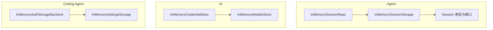
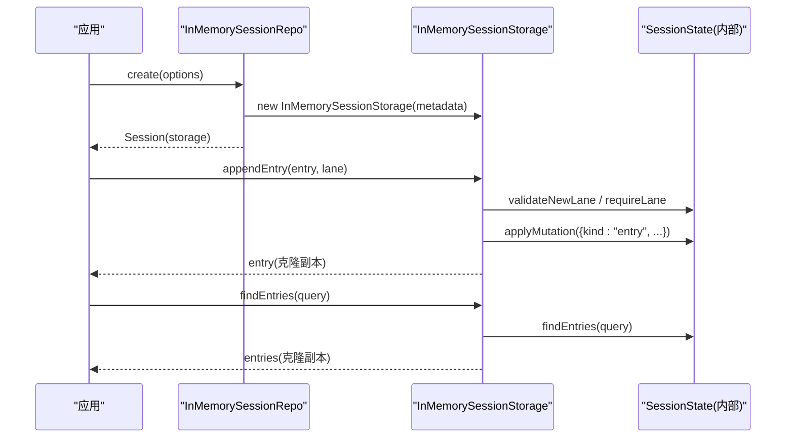
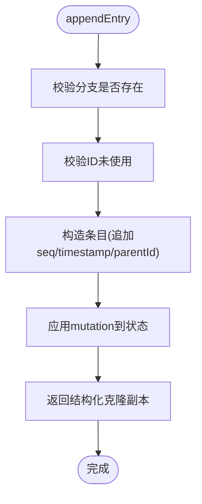
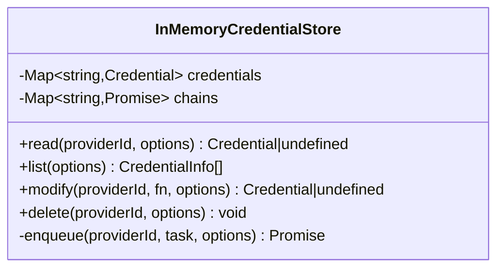
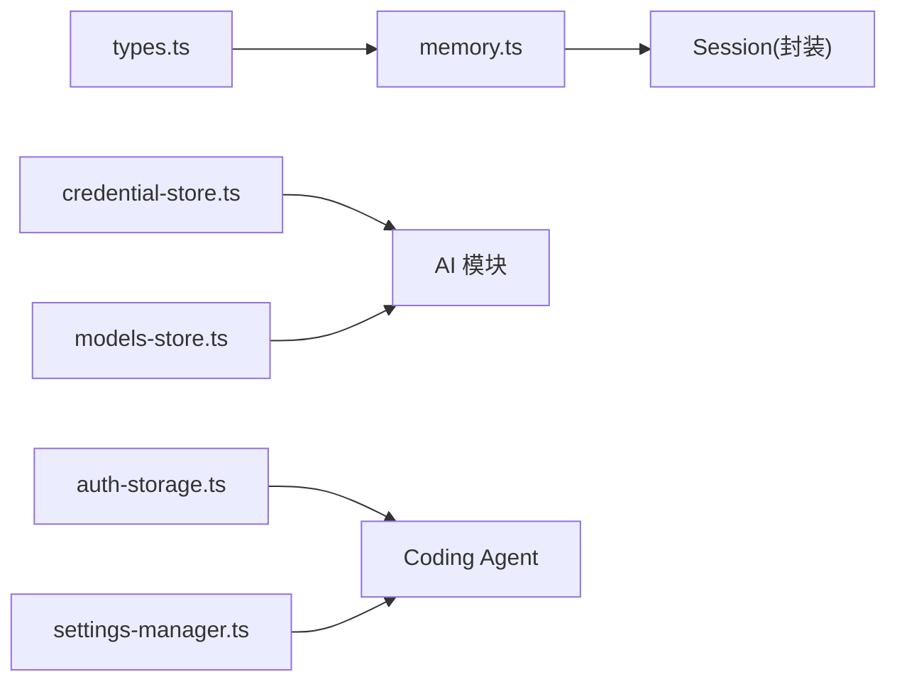

# 内存存储后端

<cite>
**本文引用的文件**
- [packages/agent/src/harness/session/memory.ts](file://packages/agent/src/harness/session/memory.ts)
- [packages/agent/src/harness/session/types.ts](file://packages/agent/src/harness/session/types.ts)
- [packages/ai/src/auth/credential-store.ts](file://packages/ai/src/auth/credential-store.ts)
- [packages/ai/src/models-store.ts](file://packages/ai/src/models-store.ts)
- [packages/coding-agent/src/core/auth-storage.ts](file://packages/coding-agent/src/core/auth-storage.ts)
- [packages/coding-agent/src/core/settings-manager.ts](file://packages/coding-agent/src/core/settings-manager.ts)
- [packages/agent/test/harness/session/memory.test.ts](file://packages/agent/test/harness/session/memory.test.ts)
</cite>

## 目录
1. [简介](#简介)
2. [项目结构](#项目结构)
3. [核心组件](#核心组件)
4. [架构总览](#架构总览)
5. [详细组件分析](#详细组件分析)
6. [依赖关系分析](#依赖关系分析)
7. [性能与内存管理](#性能与内存管理)
8. [故障排查指南](#故障排查指南)
9. [结论](#结论)
10. [附录：配置与使用示例](#附录：配置与使用示例)

## 简介
本技术文档聚焦于仓库中的“内存存储后端”实现，覆盖会话、凭据、模型目录、认证与设置等场景的内存型存储。内容涵盖设计原理、数据结构选择、线程安全机制、内存泄漏防护、数据清理策略、监控与优化建议，以及开发与测试环境中的最佳实践。

## 项目结构
内存存储后端分布在多个包中，围绕统一的接口契约提供不同的后端实现（内存 vs 持久化）。关键位置如下：
- 会话内存存储：packages/agent/src/harness/session/memory.ts
- 会话类型与接口：packages/agent/src/harness/session/types.ts
- 凭据内存存储：packages/ai/src/auth/credential-store.ts
- 模型目录内存存储：packages/ai/src/models-store.ts
- 认证存储（含内存后端）：packages/coding-agent/src/core/auth-storage.ts
- 设置存储（含内存后端）：packages/coding-agent/src/core/settings-manager.ts
- 会话内存存储测试：packages/agent/test/harness/session/memory.test.ts

图表来源
- [packages/agent/src/harness/session/memory.ts:25-193](file://packages/agent/src/harness/session/memory.ts#L25-L193)
- [packages/agent/src/harness/session/types.ts:1-200](file://packages/agent/src/harness/session/types.ts#L1-L200)
- [packages/ai/src/auth/credential-store.ts:9-68](file://packages/ai/src/auth/credential-store.ts#L9-L68)
- [packages/ai/src/models-store.ts:27-46](file://packages/ai/src/models-store.ts#L27-L46)
- [packages/coding-agent/src/core/auth-storage.ts:293-323](file://packages/coding-agent/src/core/auth-storage.ts#L293-L323)
- [packages/coding-agent/src/core/settings-manager.ts:264-279](file://packages/coding-agent/src/core/settings-manager.ts#L264-L279)

章节来源
- [packages/agent/src/harness/session/memory.ts:25-193](file://packages/agent/src/harness/session/memory.ts#L25-L193)
- [packages/agent/src/harness/session/types.ts:1-200](file://packages/agent/src/harness/session/types.ts#L1-L200)
- [packages/ai/src/auth/credential-store.ts:9-68](file://packages/ai/src/auth/credential-store.ts#L9-L68)
- [packages/ai/src/models-store.ts:27-46](file://packages/ai/src/models-store.ts#L27-L46)
- [packages/coding-agent/src/core/auth-storage.ts:293-323](file://packages/coding-agent/src/core/auth-storage.ts#L293-L323)
- [packages/coding-agent/src/core/settings-manager.ts:264-279](file://packages/coding-agent/src/core/settings-manager.ts#L264-L279)

## 核心组件
- InMemorySessionStorage / InMemorySessionRepo：基于 Map 的会话级内存存储，支持分支、条目追加、记录查询、操作状态跟踪等。
- InMemoryCredentialStore：按 Provider 维度串行化的凭据内存存储，读写隔离且可取消。
- InMemoryModelsStore：模型目录的内存缓存，支持读/写/删并返回结构化副本。
- InMemoryAuthStorageBackend：认证数据的内存后端，提供同步/异步锁式访问。
- InMemorySettingsStorage：设置的内存后端，以字符串形式维护全局与项目两套配置。

章节来源
- [packages/agent/src/harness/session/memory.ts:25-193](file://packages/agent/src/harness/session/memory.ts#L25-L193)
- [packages/ai/src/auth/credential-store.ts:9-68](file://packages/ai/src/auth/credential-store.ts#L9-L68)
- [packages/ai/src/models-store.ts:27-46](file://packages/ai/src/models-store.ts#L27-L46)
- [packages/coding-agent/src/core/auth-storage.ts:293-323](file://packages/coding-agent/src/core/auth-storage.ts#L293-L323)
- [packages/coding-agent/src/core/settings-manager.ts:264-279](file://packages/coding-agent/src/core/settings-manager.ts#L264-L279)

## 架构总览
内存存储后端通过统一接口暴露能力，上层业务无需关心底层是内存还是持久化。典型交互如下：

图表来源
- [packages/agent/src/harness/session/memory.ts:151-193](file://packages/agent/src/harness/session/memory.ts#L151-L193)
- [packages/agent/src/harness/session/memory.ts:59-118](file://packages/agent/src/harness/session/memory.ts#L59-L118)

## 详细组件分析

### 会话内存存储（InMemorySessionStorage / InMemorySessionRepo）
- 设计要点
  - 使用 Map 保存会话集合；每个会话内部维护一个不可变风格的状态机（通过 mutation 序列），保证一致性。
  - 所有对外返回的数据均通过结构化深拷贝，避免外部修改影响内部状态。
  - 支持分支（lane）、条目追加、记录写入、开放操作检测、日志查询、统计信息获取等。
- 数据结构
  - 会话元数据：包含 id、创建时间、父会话 id 等。
  - 条目/记录：带 seq、parentId、timestamp 等字段，用于排序与溯源。
  - 分支指针：维护各分支的叶子节点，便于快速定位追加位置。
- 并发与一致性
  - 单进程内由 JS 事件循环保证顺序执行；对同一会话的写操作在单个方法调用内原子完成。
  - 分支创建/移动前进行目标校验，防止非法引用。
- 错误处理
  - 重复创建会话、未找到会话、已存在开放操作等情况抛出明确错误。

图表来源
- [packages/agent/src/harness/session/memory.ts:59-89](file://packages/agent/src/harness/session/memory.ts#L59-L89)

章节来源
- [packages/agent/src/harness/session/memory.ts:25-193](file://packages/agent/src/harness/session/memory.ts#L25-L193)
- [packages/agent/src/harness/session/types.ts:1-200](file://packages/agent/src/harness/session/types.ts#L1-L200)

### 凭据内存存储（InMemoryCredentialStore）
- 设计要点
  - 以 Map 存储凭据，键为 Provider.id；每个 Provider 的操作通过 Promise 链串行化，避免竞态。
  - 支持读取、列出、修改、删除；所有操作接受可选的 AbortSignal 以支持取消。
- 线程安全
  - 单线程下通过队列串行化；跨任务时仍保持每 Provider 的顺序性。
- 内存管理
  - 无自动过期；需由调用方负责清理或替换实例。

图表来源
- [packages/ai/src/auth/credential-store.ts:9-68](file://packages/ai/src/auth/credential-store.ts#L9-L68)

章节来源
- [packages/ai/src/auth/credential-store.ts:9-68](file://packages/ai/src/auth/credential-store.ts#L9-L68)

### 模型目录内存存储（InMemoryModelsStore）
- 设计要点
  - 以 Map 存储模型目录条目，支持 read/write/delete；读/写返回结构化克隆副本，避免共享可变状态。
  - 支持 AbortSignal 取消。
- 适用场景
  - 开发/测试中缓存远程目录，减少网络开销。

章节来源
- [packages/ai/src/models-store.ts:27-46](file://packages/ai/src/models-store.ts#L27-L46)

### 认证内存后端（InMemoryAuthStorageBackend）
- 设计要点
  - 提供 withLock(withLockAsync) 两种访问模式，内部以变量和 Promise 链保证串行更新。
  - 适合替代文件后端进行单元测试或临时运行。
- 与 AuthStorage 的关系
  - AuthStorage 可通过 fromStorage/inMemory 注入该后端，从而获得一致的凭据访问语义。

章节来源
- [packages/coding-agent/src/core/auth-storage.ts:293-323](file://packages/coding-agent/src/core/auth-storage.ts#L293-L323)

### 设置内存后端（InMemorySettingsStorage）
- 设计要点
  - 维护 global 与 project 两个字符串值，withLock 提供原子读写。
  - SettingsManager.inMemory 可直接构建无 I/O 的设置管理器，便于测试。

章节来源
- [packages/coding-agent/src/core/settings-manager.ts:264-279](file://packages/coding-agent/src/core/settings-manager.ts#L264-L279)
- [packages/coding-agent/src/core/settings-manager.ts:349-355](file://packages/coding-agent/src/core/settings-manager.ts#L349-L355)

## 依赖关系分析
- 会话内存存储依赖 SessionState（内部状态机）与 Session 类型定义。
- 凭据与模型存储依赖统一的 AbortSignal 取消机制。
- 认证与设置存储通过抽象后端接口解耦具体实现，便于在内存与文件之间切换。

图表来源
- [packages/agent/src/harness/session/types.ts:1-200](file://packages/agent/src/harness/session/types.ts#L1-L200)
- [packages/agent/src/harness/session/memory.ts:25-193](file://packages/agent/src/harness/session/memory.ts#L25-L193)
- [packages/ai/src/auth/credential-store.ts:9-68](file://packages/ai/src/auth/credential-store.ts#L9-L68)
- [packages/ai/src/models-store.ts:27-46](file://packages/ai/src/models-store.ts#L27-L46)
- [packages/coding-agent/src/core/auth-storage.ts:293-323](file://packages/coding-agent/src/core/auth-storage.ts#L293-L323)
- [packages/coding-agent/src/core/settings-manager.ts:264-279](file://packages/coding-agent/src/core/settings-manager.ts#L264-L279)

章节来源
- [packages/agent/src/harness/session/memory.ts:25-193](file://packages/agent/src/harness/session/memory.ts#L25-L193)
- [packages/ai/src/auth/credential-store.ts:9-68](file://packages/ai/src/auth/credential-store.ts#L9-L68)
- [packages/ai/src/models-store.ts:27-46](file://packages/ai/src/models-store.ts#L27-L46)
- [packages/coding-agent/src/core/auth-storage.ts:293-323](file://packages/coding-agent/src/core/auth-storage.ts#L293-L323)
- [packages/coding-agent/src/core/settings-manager.ts:264-279](file://packages/coding-agent/src/core/settings-manager.ts#L264-L279)

## 性能与内存管理
- 高性能读写
  - 全部基于 Map/对象操作，时间复杂度接近 O(1)；批量查询通过内部索引与过滤实现。
  - 返回数据采用结构化克隆，避免外部污染，但会带来额外拷贝成本；在高吞吐场景下应评估是否必须深拷贝。
- 无持久化与进程重启丢失
  - 内存存储不落地磁盘，进程退出后数据即消失；适用于测试、演示与短期会话。
- 线程安全
  - 单线程事件循环天然顺序执行；凭据存储通过 Promise 链串行化同 Provider 操作，避免并发写冲突。
- 内存泄漏防护
  - 会话存储：通过 Repo.delete 移除会话引用，释放 Map 项；确保不再使用的会话及时删除。
  - 凭据存储：无自动过期；应在应用生命周期结束时清空或替换实例。
  - 模型目录：按需 write/delete；长时间运行的服务应定期清理陈旧条目。
  - 认证/设置：内存后端仅持有字符串或对象引用；随宿主对象销毁而回收。
- 数据清理策略
  - 显式 delete 或重新初始化存储实例。
  - 结合应用钩子（如进程退出、测试 teardown）触发清理。
- 监控与度量
  - 会话：可使用 getStats 获取统计信息（条目数、记录数等）。
  - 凭据/模型：可统计 Map.size 估算内存占用。
  - 建议在测试中收集指标，观察增长趋势与峰值。

章节来源
- [packages/agent/src/harness/session/memory.ts:143-145](file://packages/agent/src/harness/session/memory.ts#L143-L145)
- [packages/agent/src/harness/session/memory.ts:171-173](file://packages/agent/src/harness/session/memory.ts#L171-L173)
- [packages/ai/src/auth/credential-store.ts:10-11](file://packages/ai/src/auth/credential-store.ts#L10-L11)
- [packages/ai/src/models-store.ts:28-28](file://packages/ai/src/models-store.ts#L28-L28)

## 故障排查指南
- 常见问题
  - 重复创建会话：检查 Repo.create 时的 id 唯一性。
  - 未找到会话：open/fork 时确认 id 有效。
  - 开放操作冲突：在同一分支上同时开始多个 operation_started 会报错，需确保互斥。
- 调试建议
  - 使用 getLog 获取会话日志，定位异常写入点。
  - 在测试中使用 in-memory 后端隔离 I/O，聚焦逻辑正确性。
- 恢复策略
  - 会话：通过 fork 从已知快照派生新会话继续工作。
  - 凭据/设置：在内存模式下重启进程即可重置。

章节来源
- [packages/agent/src/harness/session/memory.ts:151-193](file://packages/agent/src/harness/session/memory.ts#L151-L193)
- [packages/agent/src/harness/session/memory.ts:72-89](file://packages/agent/src/harness/session/memory.ts#L72-L89)

## 结论
内存存储后端以简单高效的方式满足开发、测试与短期运行场景的需求。其特点包括：
- 高性能读写与低延迟
- 无持久化、进程重启数据丢失
- 通过结构化克隆保障数据隔离
- 通过 Promise 链与 Map 实现轻量并发控制
- 易于监控与调优，适合在 CI/CD 与本地开发中广泛使用

## 附录：配置与使用示例
以下示例展示如何在不同场景中启用内存存储后端（路径指向对应实现与用法）：
- 会话
  - 创建与管理会话：[packages/agent/src/harness/session/memory.ts:151-193](file://packages/agent/src/harness/session/memory.ts#L151-L193)
  - 追加条目与查询：[packages/agent/src/harness/session/memory.ts:59-118](file://packages/agent/src/harness/session/memory.ts#L59-L118)
  - 测试用例参考：[packages/agent/test/harness/session/memory.test.ts:8-23](file://packages/agent/test/harness/session/memory.test.ts#L8-L23)
- 凭据
  - 使用内存凭据存储：[packages/ai/src/auth/credential-store.ts:9-68](file://packages/ai/src/auth/credential-store.ts#L9-L68)
- 模型目录
  - 使用内存模型目录存储：[packages/ai/src/models-store.ts:27-46](file://packages/ai/src/models-store.ts#L27-L46)
- 认证
  - 注入内存认证后端：[packages/coding-agent/src/core/auth-storage.ts:293-323](file://packages/coding-agent/src/core/auth-storage.ts#L293-L323)
- 设置
  - 使用内存设置存储：[packages/coding-agent/src/core/settings-manager.ts:264-279](file://packages/coding-agent/src/core/settings-manager.ts#L264-L279)
  - 创建内存设置管理器：[packages/coding-agent/src/core/settings-manager.ts:349-355](file://packages/coding-agent/src/core/settings-manager.ts#L349-L355)