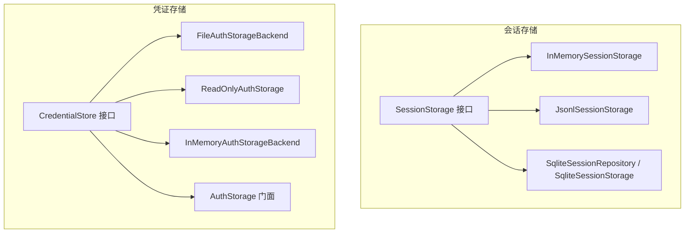
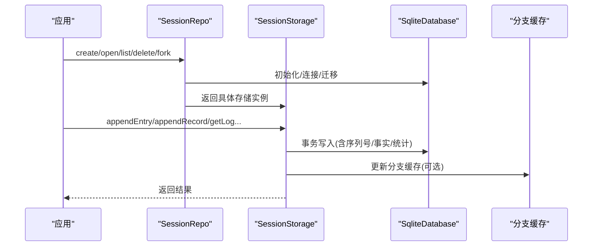
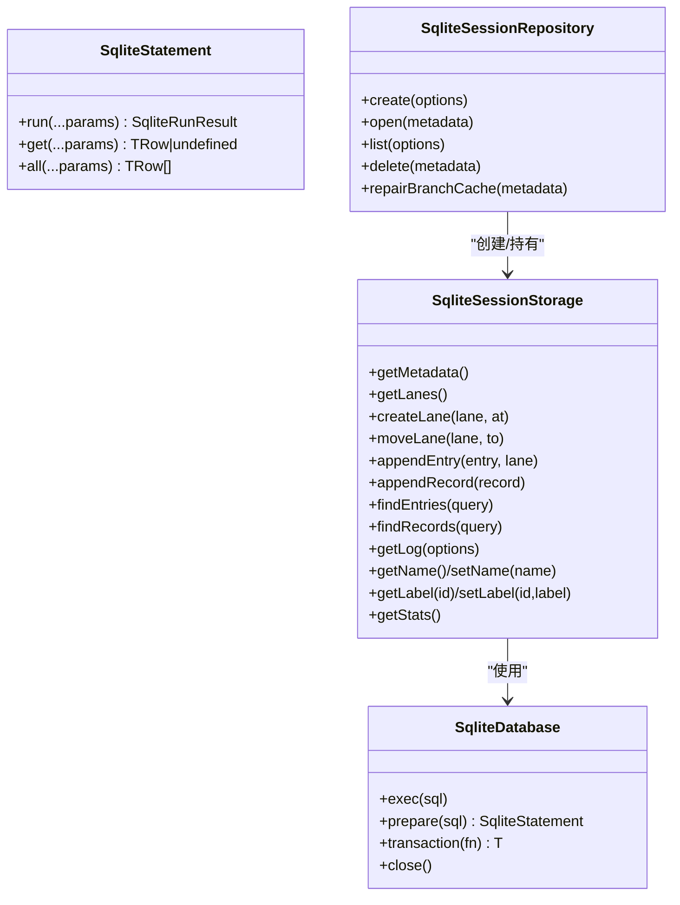
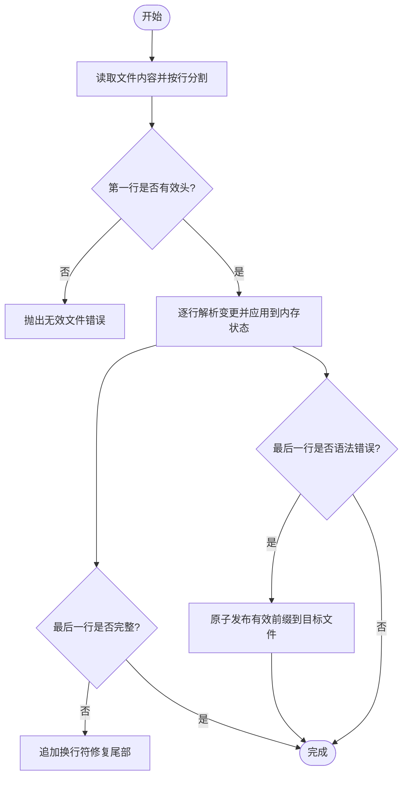
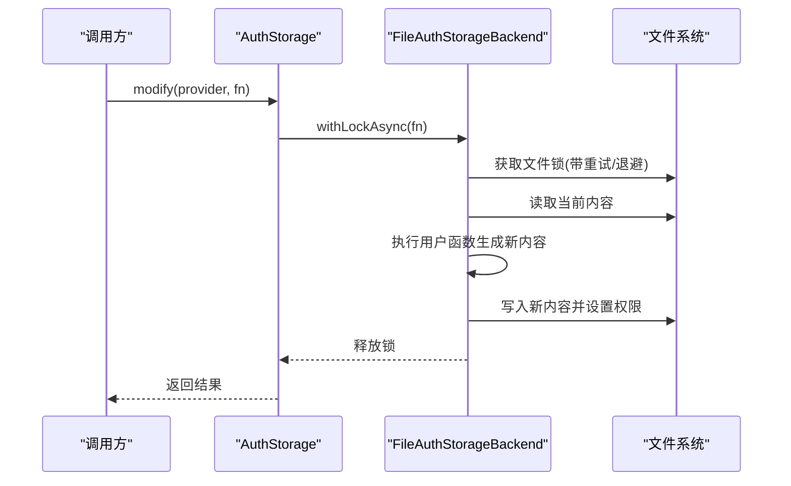
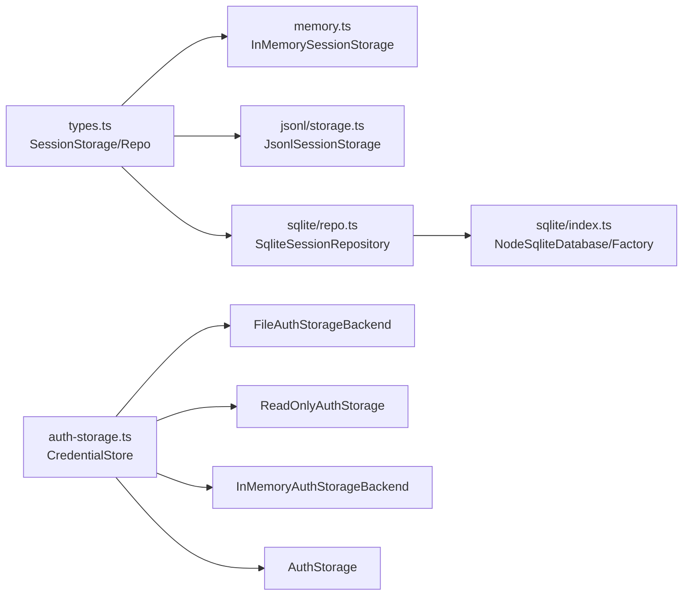

# 存储后端实现

<cite>
**本文引用的文件**
- [packages/session-backends/sqlite-node/src/index.ts](file://packages/session-backends/sqlite-node/src/index.ts)
- [packages/session-backends/sqlite-node/src/sqlite/types.ts](file://packages/session-backends/sqlite-node/src/sqlite/types.ts)
- [packages/session-backends/sqlite-node/src/sqlite/repo.ts](file://packages/session-backends/sqlite-node/src/sqlite/repo.ts)
- [packages/agent/src/harness/session/memory.ts](file://packages/agent/src/harness/session/memory.ts)
- [packages/agent/src/harness/session/jsonl/storage.ts](file://packages/agent/src/harness/session/jsonl/storage.ts)
- [packages/agent/src/harness/session/types.ts](file://packages/agent/src/harness/session/types.ts)
- [packages/coding-agent/src/core/auth-storage.ts](file://packages/coding-agent/src/core/auth-storage.ts)
</cite>

## 目录
1. [简介](#简介)
2. [项目结构](#项目结构)
3. [核心组件](#核心组件)
4. [架构总览](#架构总览)
5. [详细组件分析](#详细组件分析)
6. [依赖关系分析](#依赖关系分析)
7. [性能考量](#性能考量)
8. [故障排查指南](#故障排查指南)
9. [结论](#结论)
10. [附录](#附录)

## 简介
本技术文档聚焦于会话与凭证的存储后端实现，覆盖以下主题：
- 抽象接口设计：统一的 SessionStorage、SessionRepo、CredentialStore 等接口，屏蔽底层差异。
- 多种存储后端：SQLite 持久化、内存存储、JSONL 日志文件、文件系统（auth.json）凭证存储。
- 适用场景与性能特征：不同后端的读写模式、并发控制、一致性与恢复能力。
- 配置选项与使用方式：如何创建、打开、列出、删除会话；如何配置 SQLite 写租约、WAL 模式等。
- 迁移与备份：SQLite 迁移机制、JSONL 断尾修复、文件原子发布策略。
- 数据一致性与并发访问控制：事务、序列号、分支缓存、写租约心跳、文件锁。

## 项目结构
仓库中与存储相关的代码主要分布在以下模块：
- session-backends/sqlite-node：基于 Node.js sqlite 的 SQLite 会话仓库实现，包含数据库工厂、类型定义、仓库、迁移、搜索后端等。
- agent/harness/session：会话抽象与两种存储实现——内存存储 InMemorySessionStorage 与 JSONL 日志文件存储 JsonlSessionStorage。
- coding-agent/core：凭证存储实现，包括基于文件的 FileAuthStorageBackend、只读读取器 ReadOnlyAuthStorage、内存实现 InMemoryAuthStorageBackend，以及统一门面 AuthStorage。

**图表来源**
- [packages/agent/src/harness/session/types.ts:290-326](file://packages/agent/src/harness/session/types.ts#L290-L326)
- [packages/agent/src/harness/session/memory.ts:25-146](file://packages/agent/src/harness/session/memory.ts#L25-L146)
- [packages/agent/src/harness/session/jsonl/storage.ts:48-277](file://packages/agent/src/harness/session/jsonl/storage.ts#L48-L277)
- [packages/session-backends/sqlite-node/src/sqlite/repo.ts:345-657](file://packages/session-backends/sqlite-node/src/sqlite/repo.ts#L345-L657)
- [packages/coding-agent/src/core/auth-storage.ts:39-45](file://packages/coding-agent/src/core/auth-storage.ts#L39-L45)

**章节来源**
- [packages/agent/src/harness/session/types.ts:290-326](file://packages/agent/src/harness/session/types.ts#L290-L326)
- [packages/session-backends/sqlite-node/src/sqlite/types.ts:1-52](file://packages/session-backends/sqlite-node/src/sqlite/types.ts#L1-L52)

## 核心组件
- 会话存储接口 SessionStorage：定义 lanes、entries、records、facts、stats 的统一读写 API。
- 会话仓库接口 SessionRepo：管理会话生命周期（create/open/list/delete/fork）。
- SQLite 适配器：提供 SqliteDatabase、SqliteStatement、SqliteDatabaseFactory 抽象，封装 node:sqlite 的 DatabaseSync 与语句执行。
- 凭证存储接口 CredentialStore：以 providerId 为键存取凭据，支持 read/list/modify/delete。
- 具体实现：
  - 内存存储：无持久化，适合测试与临时运行。
  - JSONL 存储：追加式日志文件，具备断尾修复与原子发布。
  - SQLite 存储：强一致、可查询、支持分支缓存与写租约心跳。
  - 文件凭证存储：基于 auth.json，带进程内共享读状态与文件级锁。

**章节来源**
- [packages/agent/src/harness/session/types.ts:290-326](file://packages/agent/src/harness/session/types.ts#L290-L326)
- [packages/session-backends/sqlite-node/src/sqlite/types.ts:1-52](file://packages/session-backends/sqlite-node/src/sqlite/types.ts#L1-L52)
- [packages/coding-agent/src/core/auth-storage.ts:39-45](file://packages/coding-agent/src/core/auth-storage.ts#L39-L45)

## 架构总览
下图展示了上层应用通过统一接口调用不同存储后端的整体架构，以及 SQLite 仓库内部的写租约与分支缓存机制。

**图表来源**
- [packages/session-backends/sqlite-node/src/sqlite/repo.ts:681-784](file://packages/session-backends/sqlite-node/src/sqlite/repo.ts#L681-L784)
- [packages/session-backends/sqlite-node/src/sqlite/repo.ts:345-657](file://packages/session-backends/sqlite-node/src/sqlite/repo.ts#L345-L657)
- [packages/session-backends/sqlite-node/src/index.ts:53-102](file://packages/session-backends/sqlite-node/src/index.ts#L53-L102)

## 详细组件分析

### SQLite 持久化存储
- 抽象层
  - SqliteDatabase/SqliteStatement：封装 exec/prepare/transaction/close，要求 transaction 回调同步执行。
  - SqliteDatabaseFactory：open(path) 打开数据库并返回适配后的 SqliteDatabase。
- 仓库层
  - SqliteSessionRepository：管理数据库连接、会话创建/打开/列表/删除、分支缓存修复。
  - SqliteSessionStorage：实现 SessionStorage，维护写租约、心跳、序列号、条目/记录/事实/统计。
- 关键特性
  - WAL 模式、FULL 同步、busy_timeout 提升并发与稳定性。
  - 写租约 TTL 与心跳：避免多写者冲突，丢失租约时抛出错误。
  - 分支缓存：加速按分支路径扫描，异常时可通过 repairBranchCache 重建。
  - 迁移：启动时应用 schema 迁移。
- 适用场景
  - 需要强一致性、复杂查询、跨进程并发访问、长期持久化的生产环境。
- 配置选项
  - writerLease.ttlMs、heartbeatIntervalMs 控制租约过期与心跳频率。
  - databasePath 指定数据库文件位置。
  - env 提供绝对路径、创建目录、存在性检查等文件系统能力。

**图表来源**
- [packages/session-backends/sqlite-node/src/sqlite/types.ts:1-52](file://packages/session-backends/sqlite-node/src/sqlite/types.ts#L1-L52)
- [packages/session-backends/sqlite-node/src/sqlite/repo.ts:345-657](file://packages/session-backends/sqlite-node/src/sqlite/repo.ts#L345-L657)
- [packages/session-backends/sqlite-node/src/sqlite/repo.ts:681-784](file://packages/session-backends/sqlite-node/src/sqlite/repo.ts#L681-L784)

**章节来源**
- [packages/session-backends/sqlite-node/src/index.ts:16-102](file://packages/session-backends/sqlite-node/src/index.ts#L16-L102)
- [packages/session-backends/sqlite-node/src/sqlite/repo.ts:172-176](file://packages/session-backends/sqlite-node/src/sqlite/repo.ts#L172-L176)
- [packages/session-backends/sqlite-node/src/sqlite/repo.ts:95-122](file://packages/session-backends/sqlite-node/src/sqlite/repo.ts#L95-L122)
- [packages/session-backends/sqlite-node/src/sqlite/repo.ts:345-657](file://packages/session-backends/sqlite-node/src/sqlite/repo.ts#L345-L657)
- [packages/session-backends/sqlite-node/src/sqlite/repo.ts:681-784](file://packages/session-backends/sqlite-node/src/sqlite/repo.ts#L681-L784)

### 内存存储
- 特点
  - 完全在进程内存中维护会话状态，无持久化。
  - 支持 fork、lanes、entries、records、facts、stats 等全部操作。
  - 适合单元测试、快速原型验证与无需落盘的临时会话。
- 并发与一致性
  - 单进程内顺序访问；不提供跨进程一致性保障。
- 适用场景
  - 测试、开发调试、一次性任务。

**章节来源**
- [packages/agent/src/harness/session/memory.ts:25-146](file://packages/agent/src/harness/session/memory.ts#L25-L146)
- [packages/agent/src/harness/session/memory.ts:148-193](file://packages/agent/src/harness/session/memory.ts#L148-L193)

### JSONL 日志文件存储
- 特点
  - 以 JSON Lines 格式追加写入会话变更，首行为头信息，后续每行一条变更。
  - 加载时解析头与变更，遇到“断尾”（最后一行不完整）会尝试修复。
  - 使用原子发布策略（先写 .tmp 再 rename）保证文件完整性。
- 并发与一致性
  - 通过 Promise 队列串行化写入，避免并发竞争。
  - 不保证跨进程一致性，适合单进程或外部协调写入的场景。
- 适用场景
  - 轻量持久化、可审计的变更日志、便于人类阅读与工具处理。

**图表来源**
- [packages/agent/src/harness/session/jsonl/storage.ts:69-108](file://packages/agent/src/harness/session/jsonl/storage.ts#L69-L108)
- [packages/agent/src/harness/session/jsonl/storage.ts:33-46](file://packages/agent/src/harness/session/jsonl/storage.ts#L33-L46)

**章节来源**
- [packages/agent/src/harness/session/jsonl/storage.ts:48-277](file://packages/agent/src/harness/session/jsonl/storage.ts#L48-L277)

### 文件系统凭证存储（auth.json）
- 特点
  - 基于 auth.json 文件存储凭据，支持进程内共享读状态以减少重复 IO。
  - 写操作通过文件锁保证并发安全，支持同步与异步两种锁获取方式。
  - 提供只读读取器用于仅读取而不修改。
- 并发与一致性
  - 使用 proper-lockfile 进行文件级互斥，避免竞态条件。
  - 异步锁支持超时与退避重试，支持中断信号。
- 适用场景
  - 本地开发或单机部署下的凭据管理，需简单可靠的文件存储。

**图表来源**
- [packages/coding-agent/src/core/auth-storage.ts:116-201](file://packages/coding-agent/src/core/auth-storage.ts#L116-L201)
- [packages/coding-agent/src/core/auth-storage.ts:328-491](file://packages/coding-agent/src/core/auth-storage.ts#L328-L491)

**章节来源**
- [packages/coding-agent/src/core/auth-storage.ts:47-201](file://packages/coding-agent/src/core/auth-storage.ts#L47-L201)
- [packages/coding-agent/src/core/auth-storage.ts:204-291](file://packages/coding-agent/src/core/auth-storage.ts#L204-L291)
- [packages/coding-agent/src/core/auth-storage.ts:293-323](file://packages/coding-agent/src/core/auth-storage.ts#L293-L323)
- [packages/coding-agent/src/core/auth-storage.ts:328-491](file://packages/coding-agent/src/core/auth-storage.ts#L328-L491)

## 依赖关系分析
- 会话存储接口位于 agent/harness/session/types.ts，被内存、JSONL、SQLite 三种实现共同遵循。
- SQLite 实现依赖 node:sqlite 的 DatabaseSync，并通过 index.ts 暴露工厂方法。
- 仓库层 repo.ts 组合了迁移、分支缓存、各表存储模块（entries/records/lanes/facts/stats/sessions/writer-leases）。
- 凭证存储将 FileAuthStorageBackend、ReadOnlyAuthStorage、InMemoryAuthStorageBackend 统一为 AuthStorage 门面。

**图表来源**
- [packages/agent/src/harness/session/types.ts:290-326](file://packages/agent/src/harness/session/types.ts#L290-L326)
- [packages/session-backends/sqlite-node/src/sqlite/repo.ts:1-93](file://packages/session-backends/sqlite-node/src/sqlite/repo.ts#L1-L93)
- [packages/session-backends/sqlite-node/src/index.ts:1-106](file://packages/session-backends/sqlite-node/src/index.ts#L1-L106)
- [packages/coding-agent/src/core/auth-storage.ts:39-45](file://packages/coding-agent/src/core/auth-storage.ts#L39-L45)

**章节来源**
- [packages/agent/src/harness/session/types.ts:290-326](file://packages/agent/src/harness/session/types.ts#L290-L326)
- [packages/session-backends/sqlite-node/src/sqlite/repo.ts:1-93](file://packages/session-backends/sqlite-node/src/sqlite/repo.ts#L1-L93)
- [packages/session-backends/sqlite-node/src/index.ts:1-106](file://packages/session-backends/sqlite-node/src/index.ts#L1-L106)
- [packages/coding-agent/src/core/auth-storage.ts:39-45](file://packages/coding-agent/src/core/auth-storage.ts#L39-L45)

## 性能考量
- SQLite
  - 启用 WAL 与 FULL 同步，提高并发读与崩溃恢复能力。
  - busy_timeout 降低忙等待失败概率。
  - 分支缓存减少分支路径扫描开销。
  - 写租约心跳避免长时间占用导致死锁。
- JSONL
  - 追加写入成本低，适合高吞吐日志场景。
  - 断尾修复与原子发布确保文件一致性。
  - 单进程串行写入，避免并发竞争。
- 内存
  - 零 IO 延迟，适合测试与短时任务。
- 凭证文件
  - 文件锁保证并发安全，但频繁写可能成为瓶颈。
  - 共享读状态减少重复读取成本。

[本节为通用指导，不直接分析具体文件]

## 故障排查指南
- SQLite
  - 写租约丢失：当心跳失败或 TTL 过期，后续写入将抛出“writer lease was lost”。检查心跳间隔与 TTL 配置。
  - 分支缓存不一致：调用 repairBranchCache 重建缓存。
  - 事务失败：确保 transaction 回调同步执行，避免返回 Promise。
- JSONL
  - 文件损坏：加载时若发现非末尾行的语法错误，直接报错；若为末尾行不完整，自动修复。
  - 并发写入冲突：确保同一目标文件由单一写入者串行化写入。
- 凭证文件
  - 锁竞争：异步锁支持退避重试与中断；如频繁 ELOCKED，检查写频率与锁粒度。
  - 权限问题：确保进程对 auth.json 所在目录有写权限，且文件权限设置为 0o600。

**章节来源**
- [packages/session-backends/sqlite-node/src/sqlite/repo.ts:114-137](file://packages/session-backends/sqlite-node/src/sqlite/repo.ts#L114-L137)
- [packages/session-backends/sqlite-node/src/sqlite/repo.ts:389-427](file://packages/session-backends/sqlite-node/src/sqlite/repo.ts#L389-L427)
- [packages/session-backends/sqlite-node/src/index.ts:68-85](file://packages/session-backends/sqlite-node/src/index.ts#L68-L85)
- [packages/agent/src/harness/session/jsonl/storage.ts:69-108](file://packages/agent/src/harness/session/jsonl/storage.ts#L69-L108)
- [packages/coding-agent/src/core/auth-storage.ts:68-114](file://packages/coding-agent/src/core/auth-storage.ts#L68-L114)
- [packages/coding-agent/src/core/auth-storage.ts:116-201](file://packages/coding-agent/src/core/auth-storage.ts#L116-L201)

## 结论
- 通过统一的 SessionStorage/CredentialStore 接口，系统能够灵活切换不同存储后端。
- SQLite 适合生产环境的强一致与并发访问；JSONL 适合轻量持久化与审计；内存适合测试；文件凭证存储适合本地凭据管理。
- 一致性保障手段包括事务、序列号、分支缓存、写租约心跳与文件锁。
- 迁移与备份方面，SQLite 提供迁移机制与 WAL 恢复；JSONL 提供断尾修复与原子发布；凭证文件提供进程内共享读状态与锁保护。

[本节为总结性内容，不直接分析具体文件]

## 附录

### 配置与使用示例（路径指引）
- 创建 SQLite 仓库与工厂
  - 参考：[packages/session-backends/sqlite-node/src/index.ts:96-102](file://packages/session-backends/sqlite-node/src/index.ts#L96-L102)
- 配置 SQLite 仓库选项（env、databasePath、writerLease）
  - 参考：[packages/session-backends/sqlite-node/src/sqlite/repo.ts:102-122](file://packages/session-backends/sqlite-node/src/sqlite/repo.ts#L102-L122)
- 打开/创建/列出/删除会话
  - 参考：[packages/session-backends/sqlite-node/src/sqlite/repo.ts:732-784](file://packages/session-backends/sqlite-node/src/sqlite/repo.ts#L732-L784)
- 内存存储使用
  - 参考：[packages/agent/src/harness/session/memory.ts:148-193](file://packages/agent/src/harness/session/memory.ts#L148-L193)
- JSONL 存储创建与加载
  - 参考：[packages/agent/src/harness/session/jsonl/storage.ts:59-108](file://packages/agent/src/harness/session/jsonl/storage.ts#L59-L108)
- 凭证存储创建与读写
  - 参考：[packages/coding-agent/src/core/auth-storage.ts:328-491](file://packages/coding-agent/src/core/auth-storage.ts#L328-L491)

**章节来源**
- [packages/session-backends/sqlite-node/src/index.ts:96-102](file://packages/session-backends/sqlite-node/src/index.ts#L96-L102)
- [packages/session-backends/sqlite-node/src/sqlite/repo.ts:102-122](file://packages/session-backends/sqlite-node/src/sqlite/repo.ts#L102-L122)
- [packages/session-backends/sqlite-node/src/sqlite/repo.ts:732-784](file://packages/session-backends/sqlite-node/src/sqlite/repo.ts#L732-L784)
- [packages/agent/src/harness/session/memory.ts:148-193](file://packages/agent/src/harness/session/memory.ts#L148-L193)
- [packages/agent/src/harness/session/jsonl/storage.ts:59-108](file://packages/agent/src/harness/session/jsonl/storage.ts#L59-L108)
- [packages/coding-agent/src/core/auth-storage.ts:328-491](file://packages/coding-agent/src/core/auth-storage.ts#L328-L491)

### 自定义存储后端实现要点
- 实现 SessionStorage 接口：
  - 必须实现 lanes、entries、records、facts、stats 的读写方法，保持 seq 单调递增与一致性约束。
  - 参考：[packages/agent/src/harness/session/types.ts:290-326](file://packages/agent/src/harness/session/types.ts#L290-L326)
- 实现 SqliteDatabase/SqliteStatement（如需 SQLite 后端）：
  - 提供 exec/prepare/transaction/close，并确保 transaction 回调同步。
  - 参考：[packages/session-backends/sqlite-node/src/sqlite/types.ts:1-52](file://packages/session-backends/sqlite-node/src/sqlite/types.ts#L1-L52)
- 实现 CredentialStore（如需凭证存储）：
  - 提供 read/list/modify/delete，注意并发与持久化一致性。
  - 参考：[packages/coding-agent/src/core/auth-storage.ts:39-45](file://packages/coding-agent/src/core/auth-storage.ts#L39-L45)

**章节来源**
- [packages/agent/src/harness/session/types.ts:290-326](file://packages/agent/src/harness/session/types.ts#L290-L326)
- [packages/session-backends/sqlite-node/src/sqlite/types.ts:1-52](file://packages/session-backends/sqlite-node/src/sqlite/types.ts#L1-L52)
- [packages/coding-agent/src/core/auth-storage.ts:39-45](file://packages/coding-agent/src/core/auth-storage.ts#L39-L45)