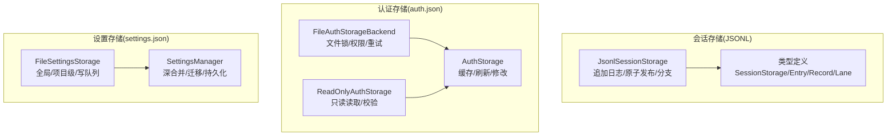
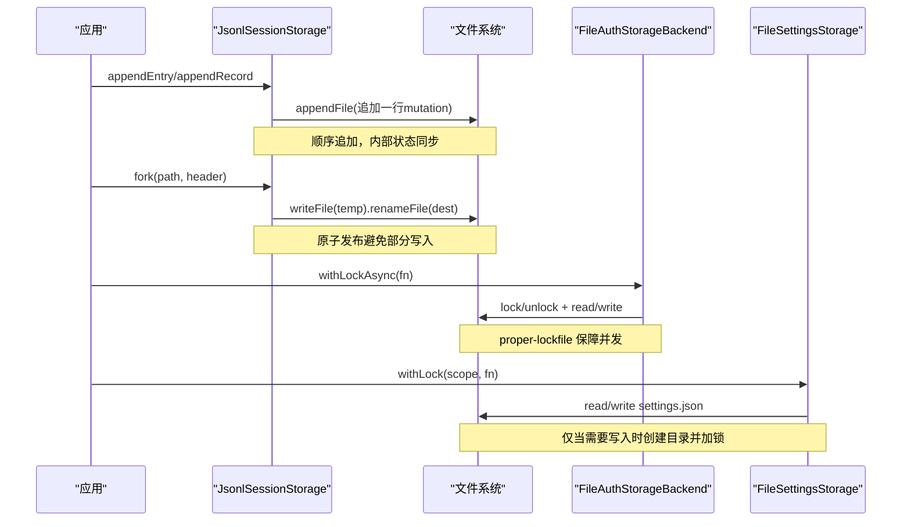
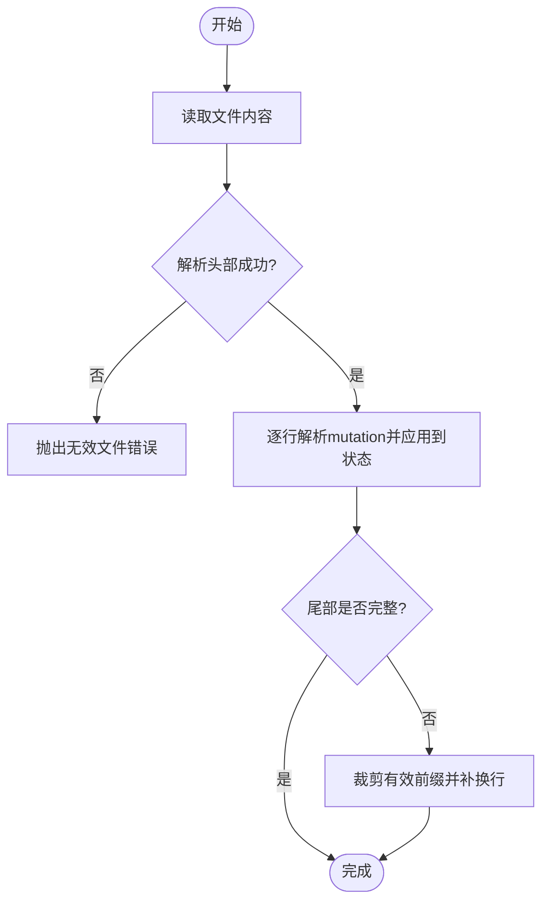
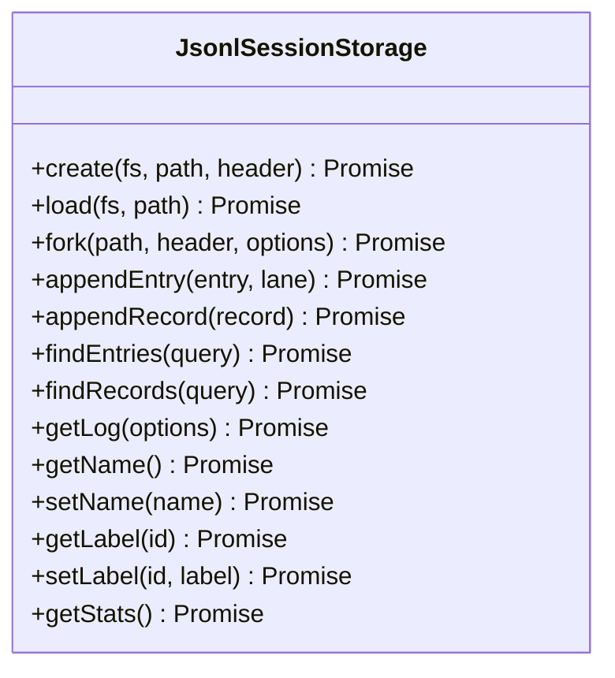
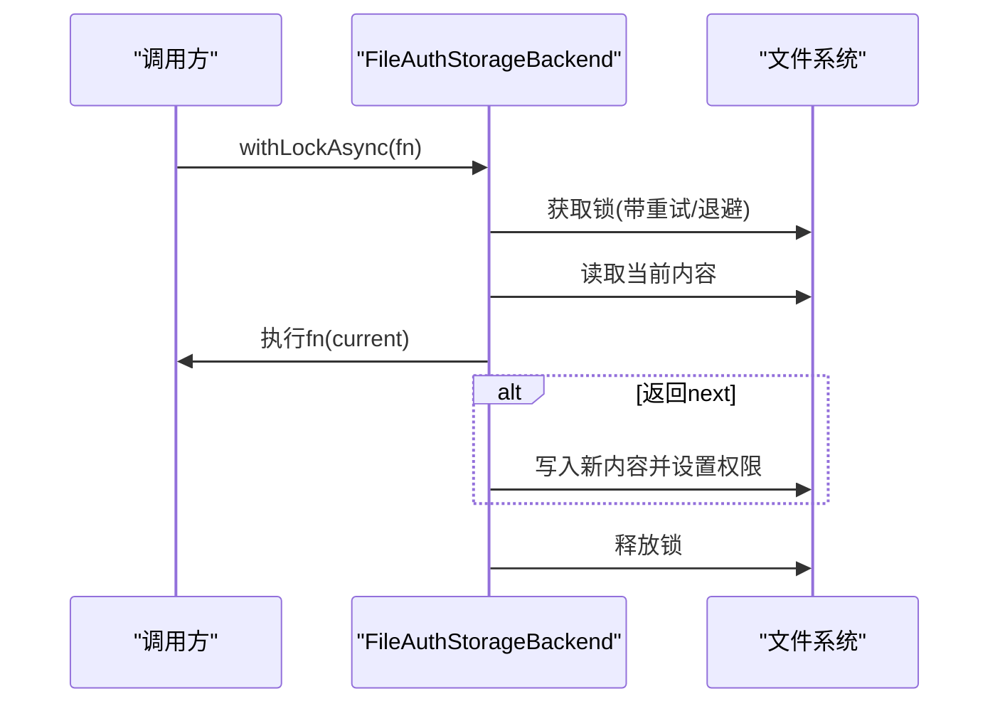
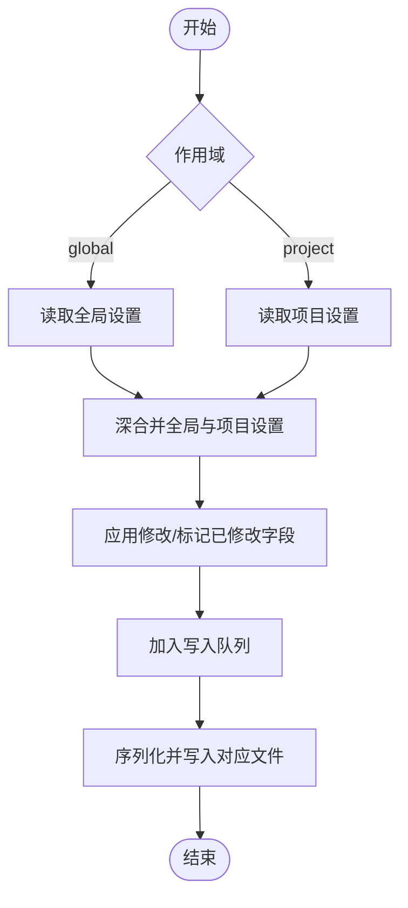
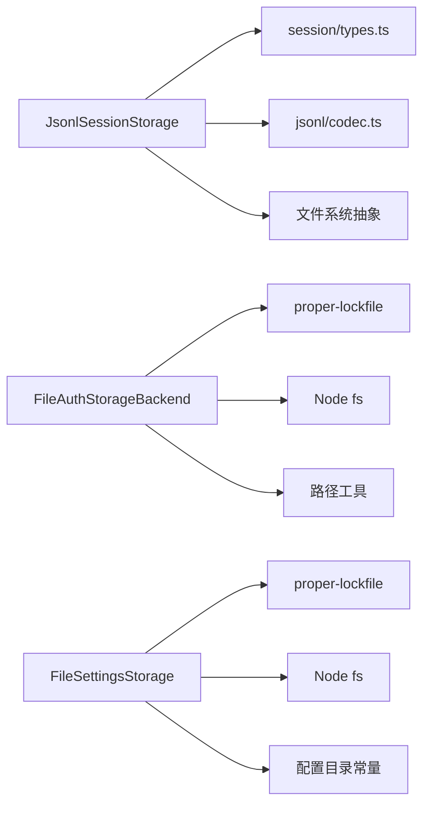

# 文件系统存储后端

<cite>
**本文引用的文件**
- [packages/agent/src/harness/session/jsonl/storage.ts](file://packages/agent/src/harness/session/jsonl/storage.ts)
- [packages/agent/src/harness/session/types.ts](file://packages/agent/src/harness/session/types.ts)
- [packages/coding-agent/src/core/auth-storage.ts](file://packages/coding-agent/src/core/auth-storage.ts)
- [packages/coding-agent/src/core/settings-manager.ts](file://packages/coding-agent/src/core/settings-manager.ts)
</cite>

## 目录
1. [简介](#简介)
2. [项目结构](#项目结构)
3. [核心组件](#核心组件)
4. [架构总览](#架构总览)
5. [详细组件分析](#详细组件分析)
6. [依赖关系分析](#依赖关系分析)
7. [性能考虑](#性能考虑)
8. [故障排查指南](#故障排查指南)
9. [结论](#结论)
10. [附录](#附录)

## 简介
本技术文档聚焦于仓库中的“文件系统存储后端”，涵盖会话日志（JSONL）持久化、认证凭据与设置项的 JSON 文件存储，以及基于文件锁的并发安全机制。文档从系统架构、数据格式、目录组织、配置选项、读写流程、错误恢复、备份与迁移、性能优化等维度进行系统化说明，并提供可操作的实践建议。

## 项目结构
围绕文件系统存储的关键代码分布在以下模块：
- 会话存储（JSONL）：以追加式日志文件记录会话变更，支持原子发布、尾部修复与分支操作。
- 认证存储（auth.json）：以 JSON 文件持久化凭据，提供读写锁、权限控制与只读模式。
- 设置存储（settings.json）：全局与项目级设置文件，支持深合并、迁移与写入队列。

图表来源
- [packages/agent/src/harness/session/jsonl/storage.ts:48-278](file://packages/agent/src/harness/session/jsonl/storage.ts#L48-L278)
- [packages/agent/src/harness/session/types.ts:290-326](file://packages/agent/src/harness/session/types.ts#L290-L326)
- [packages/coding-agent/src/core/auth-storage.ts:47-202](file://packages/coding-agent/src/core/auth-storage.ts#L47-L202)
- [packages/coding-agent/src/core/settings-manager.ts:195-262](file://packages/coding-agent/src/core/settings-manager.ts#L195-L262)

章节来源
- [packages/agent/src/harness/session/jsonl/storage.ts:48-278](file://packages/agent/src/harness/session/jsonl/storage.ts#L48-L278)
- [packages/agent/src/harness/session/types.ts:290-326](file://packages/agent/src/harness/session/types.ts#L290-L326)
- [packages/coding-agent/src/core/auth-storage.ts:47-202](file://packages/coding-agent/src/core/auth-storage.ts#L47-L202)
- [packages/coding-agent/src/core/settings-manager.ts:195-262](file://packages/coding-agent/src/core/settings-manager.ts#L195-L262)

## 核心组件
- JsonlSessionStorage：实现会话的追加式日志存储，提供创建、加载、分叉、追加条目/记录、查询与统计能力；通过原子发布与尾部修复保证一致性。
- FileAuthStorageBackend / ReadOnlyAuthStorage / AuthStorage：实现 auth.json 的带锁读写、只读访问与内存缓存刷新，确保并发安全与最小化 I/O。
- FileSettingsStorage / SettingsManager：实现 settings.json 的全局与项目级存储，支持深合并、字段级增量持久化与写入队列。

章节来源
- [packages/agent/src/harness/session/jsonl/storage.ts:48-278](file://packages/agent/src/harness/session/jsonl/storage.ts#L48-L278)
- [packages/coding-agent/src/core/auth-storage.ts:47-202](file://packages/coding-agent/src/core/auth-storage.ts#L47-L202)
- [packages/coding-agent/src/core/settings-manager.ts:195-262](file://packages/coding-agent/src/core/settings-manager.ts#L195-L262)

## 架构总览
下图展示了三类文件系统存储后端的交互关系与关键路径：会话日志的追加与原子发布、认证文件的加锁读写、设置文件的深合并与持久化。

图表来源
- [packages/agent/src/harness/session/jsonl/storage.ts:33-120](file://packages/agent/src/harness/session/jsonl/storage.ts#L33-L120)
- [packages/agent/src/harness/session/jsonl/storage.ts:154-192](file://packages/agent/src/harness/session/jsonl/storage.ts#L154-L192)
- [packages/coding-agent/src/core/auth-storage.ts:116-202](file://packages/coding-agent/src/core/auth-storage.ts#L116-L202)
- [packages/coding-agent/src/core/settings-manager.ts:233-262](file://packages/coding-agent/src/core/settings-manager.ts#L233-L262)

## 详细组件分析

### 会话存储（JSONL）
- 文件格式与结构
  - 首行为头部（header），后续每行一条 mutation（追加式日志）。
  - 支持 lane（分支）、entry（条目）、record（记录）、fact（事实）等变更类型。
- 目录与路径
  - 由外部传入的 fs 抽象管理具体路径；存储实例持有 metadata.path 指向目标文件。
- 原子发布与尾部修复
  - 使用临时文件 + rename 的方式原子替换目标文件，崩溃时不会破坏原文件。
  - 加载时检测尾部损坏（未完成的追加），自动裁剪为有效前缀并补全换行。
- 并发与一致性
  - 内部维护 SessionState，所有写入先序列化再追加到文件，保证顺序一致。
  - 分叉（fork）在临时文件中构建新会话，成功后原子替换。

图表来源
- [packages/agent/src/harness/session/jsonl/storage.ts:69-108](file://packages/agent/src/harness/session/jsonl/storage.ts#L69-L108)

图表来源
- [packages/agent/src/harness/session/jsonl/storage.ts:48-278](file://packages/agent/src/harness/session/jsonl/storage.ts#L48-L278)

章节来源
- [packages/agent/src/harness/session/jsonl/storage.ts:33-120](file://packages/agent/src/harness/session/jsonl/storage.ts#L33-L120)
- [packages/agent/src/harness/session/jsonl/storage.ts:154-192](file://packages/agent/src/harness/session/jsonl/storage.ts#L154-L192)
- [packages/agent/src/harness/session/types.ts:290-326](file://packages/agent/src/harness/session/types.ts#L290-L326)

### 认证存储（auth.json）
- 文件格式
  - JSON 对象，键为 providerId，值为凭据对象（如 api_key、oauth）。
- 目录与权限
  - 父目录不存在时递归创建，目录权限设置为严格访问（仅所有者）。
  - 文件初始化为空对象，权限设置为仅所有者读写。
- 并发与锁
  - 同步与异步两种加锁方式，均基于 proper-lockfile。
  - 异步锁支持超时、退避重试与“锁被抢占”回调，提升健壮性。
- 只读模式
  - 提供只读实现，用于无需修改的场景，减少锁竞争。
- 缓存与刷新
  - 对外暴露的 AuthStorage 维护内存快照与共享读取状态，按文件修订号增量刷新，降低重复 I/O。

图表来源
- [packages/coding-agent/src/core/auth-storage.ts:116-202](file://packages/coding-agent/src/core/auth-storage.ts#L116-L202)

章节来源
- [packages/coding-agent/src/core/auth-storage.ts:47-202](file://packages/coding-agent/src/core/auth-storage.ts#L47-L202)
- [packages/coding-agent/src/core/auth-storage.ts:204-291](file://packages/coding-agent/src/core/auth-storage.ts#L204-L291)
- [packages/coding-agent/src/core/auth-storage.ts:328-491](file://packages/coding-agent/src/core/auth-storage.ts#L328-L491)

### 设置存储（settings.json）
- 文件格式
  - JSON 对象，包含全局与项目级两套配置，支持深合并与字段级更新。
- 目录与路径
  - 全局设置位于代理目录下的 settings.json；项目设置位于项目根的配置目录下的 settings.json。
- 并发与锁
  - 通过 withLock 对指定作用域（global/project）串行化读写，仅在需要写入时创建目录并加锁。
- 迁移与兼容性
  - 内置迁移逻辑处理历史字段名变化与结构演进，保证向后兼容。
- 写入队列
  - 将多次修改合并为一次持久化，减少磁盘写入次数。

图表来源
- [packages/coding-agent/src/core/settings-manager.ts:195-262](file://packages/coding-agent/src/core/settings-manager.ts#L195-L262)
- [packages/coding-agent/src/core/settings-manager.ts:585-614](file://packages/coding-agent/src/core/settings-manager.ts#L585-L614)

章节来源
- [packages/coding-agent/src/core/settings-manager.ts:195-262](file://packages/coding-agent/src/core/settings-manager.ts#L195-L262)
- [packages/coding-agent/src/core/settings-manager.ts:281-355](file://packages/coding-agent/src/core/settings-manager.ts#L281-L355)
- [packages/coding-agent/src/core/settings-manager.ts:387-447](file://packages/coding-agent/src/core/settings-manager.ts#L387-L447)
- [packages/coding-agent/src/core/settings-manager.ts:585-614](file://packages/coding-agent/src/core/settings-manager.ts#L585-L614)

## 依赖关系分析
- JsonlSessionStorage 依赖：
  - 类型定义（SessionStorage、Entry、Record、Lane 等）
  - 编解码器（header/mutation 的编码与解析）
  - 文件系统抽象（读写、重命名、删除）
- FileAuthStorageBackend 依赖：
  - proper-lockfile 文件锁
  - Node.js fs API（readFileSync/writeFileSync/chmodSync/mkdirSync）
  - 路径工具与配置工具
- FileSettingsStorage 依赖：
  - proper-lockfile 文件锁
  - Node.js fs API
  - 路径解析与配置目录常量

图表来源
- [packages/agent/src/harness/session/jsonl/storage.ts:48-278](file://packages/agent/src/harness/session/jsonl/storage.ts#L48-L278)
- [packages/agent/src/harness/session/types.ts:290-326](file://packages/agent/src/harness/session/types.ts#L290-L326)
- [packages/coding-agent/src/core/auth-storage.ts:47-202](file://packages/coding-agent/src/core/auth-storage.ts#L47-L202)
- [packages/coding-agent/src/core/settings-manager.ts:195-262](file://packages/coding-agent/src/core/settings-manager.ts#L195-L262)

章节来源
- [packages/agent/src/harness/session/jsonl/storage.ts:48-278](file://packages/agent/src/harness/session/jsonl/storage.ts#L48-L278)
- [packages/coding-agent/src/core/auth-storage.ts:47-202](file://packages/coding-agent/src/core/auth-storage.ts#L47-L202)
- [packages/coding-agent/src/core/settings-manager.ts:195-262](file://packages/coding-agent/src/core/settings-manager.ts#L195-L262)

## 性能考虑
- 会话日志（JSONL）
  - 追加写入：单行追加，顺序 I/O，适合高吞吐场景。
  - 原子发布：临时文件 + rename 避免长事务与锁竞争。
  - 尾部修复：启动时快速自检并修复，减少人工干预。
- 认证存储（auth.json）
  - 锁粒度小且短生命周期，异步锁具备退避重试，降低争用。
  - 内存缓存与共享读取状态，按文件修订号增量刷新，减少重复读取。
- 设置存储（settings.json）
  - 写入队列合并多次修改，降低磁盘写入频率。
  - 字段级增量持久化，避免整文件重写带来的开销。
- 大文件处理
  - JSONL 天然支持流式追加与按需回放；对于超大日志，建议配合分段或归档策略。
  - 认证与设置文件通常较小，但可通过只读模式与缓存进一步优化。

[本节为通用性能指导，不直接分析具体文件]

## 故障排查指南
- 会话日志损坏
  - 现象：加载时报错或尾部不完整。
  - 处理：系统会自动裁剪有效前缀并补全换行；若仍失败，检查最近一次写入是否被中断。
  - 参考路径：[packages/agent/src/harness/session/jsonl/storage.ts:69-108](file://packages/agent/src/harness/session/jsonl/storage.ts#L69-L108)
- 认证文件权限问题
  - 现象：无法写入或读取失败。
  - 处理：确认目录与文件权限为仅所有者；首次写入会创建空对象并设置权限。
  - 参考路径：[packages/coding-agent/src/core/auth-storage.ts:54-66](file://packages/coding-agent/src/core/auth-storage.ts#L54-L66)
- 锁冲突与抢占
  - 现象：ELOCKED 错误或锁被抢占异常。
  - 处理：异步锁支持退避重试与抢占回调；检查是否存在长时间持锁的操作。
  - 参考路径：[packages/coding-agent/src/core/auth-storage.ts:116-155](file://packages/coding-agent/src/core/auth-storage.ts#L116-L155)
- 设置文件迁移失败
  - 现象：旧格式导致解析或合并异常。
  - 处理：使用内置迁移逻辑；必要时清理或修正旧字段。
  - 参考路径：[packages/coding-agent/src/core/settings-manager.ts:387-447](file://packages/coding-agent/src/core/settings-manager.ts#L387-L447)

章节来源
- [packages/agent/src/harness/session/jsonl/storage.ts:69-108](file://packages/agent/src/harness/session/jsonl/storage.ts#L69-L108)
- [packages/coding-agent/src/core/auth-storage.ts:54-66](file://packages/coding-agent/src/core/auth-storage.ts#L54-L66)
- [packages/coding-agent/src/core/auth-storage.ts:116-155](file://packages/coding-agent/src/core/auth-storage.ts#L116-L155)
- [packages/coding-agent/src/core/settings-manager.ts:387-447](file://packages/coding-agent/src/core/settings-manager.ts#L387-L447)

## 结论
该仓库提供了稳健的文件系统存储后端：
- 会话层采用 JSONL 追加日志，结合原子发布与尾部修复，兼顾性能与可靠性。
- 认证与设置层采用 JSON 文件与文件锁，提供细粒度的并发控制与权限管理。
- 通过缓存、写入队列与迁移机制，平衡了 I/O 成本与数据一致性。
在实际使用中，建议遵循原子写入、合理锁粒度与增量持久化的原则，并结合业务规模制定归档与备份策略。

[本节为总结性内容，不直接分析具体文件]

## 附录

### 配置选项速览
- 会话存储（JSONL）
  - 存储路径：由外部传入的 fs 抽象决定，实例内通过 metadata.path 定位。
  - 文件格式：首行 header，后续每行一条 mutation。
  - 文件权限：由底层 fs 抽象负责；原子发布使用临时文件 + rename。
  - 参考路径：[packages/agent/src/harness/session/jsonl/storage.ts:33-120](file://packages/agent/src/harness/session/jsonl/storage.ts#L33-L120)
- 认证存储（auth.json）
  - 存储路径：默认位于代理目录下的 auth.json，可自定义。
  - 文件格式：JSON 对象，键为 providerId，值为凭据对象。
  - 文件权限：目录 0o700，文件 0o600。
  - 参考路径：[packages/coding-agent/src/core/auth-storage.ts:54-66](file://packages/coding-agent/src/core/auth-storage.ts#L54-L66)
- 设置存储（settings.json）
  - 存储路径：全局 settings.json 位于代理目录；项目 settings.json 位于项目配置目录。
  - 文件格式：JSON 对象，支持深合并与字段级更新。
  - 文件权限：由 Node fs 默认权限；写入前按需创建目录。
  - 参考路径：[packages/coding-agent/src/core/settings-manager.ts:195-262](file://packages/coding-agent/src/core/settings-manager.ts#L195-L262)

章节来源
- [packages/agent/src/harness/session/jsonl/storage.ts:33-120](file://packages/agent/src/harness/session/jsonl/storage.ts#L33-L120)
- [packages/coding-agent/src/core/auth-storage.ts:54-66](file://packages/coding-agent/src/core/auth-storage.ts#L54-L66)
- [packages/coding-agent/src/core/settings-manager.ts:195-262](file://packages/coding-agent/src/core/settings-manager.ts#L195-L262)