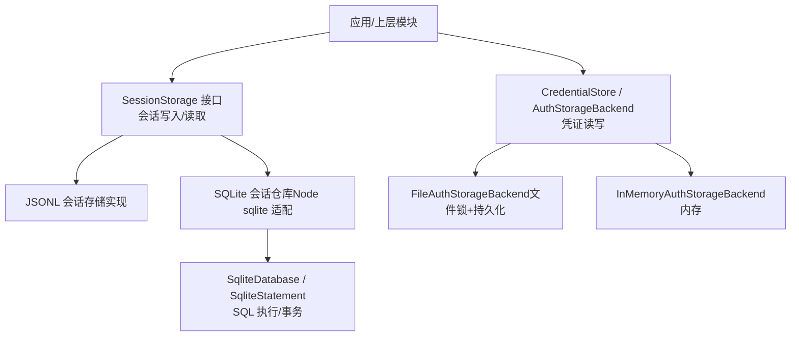
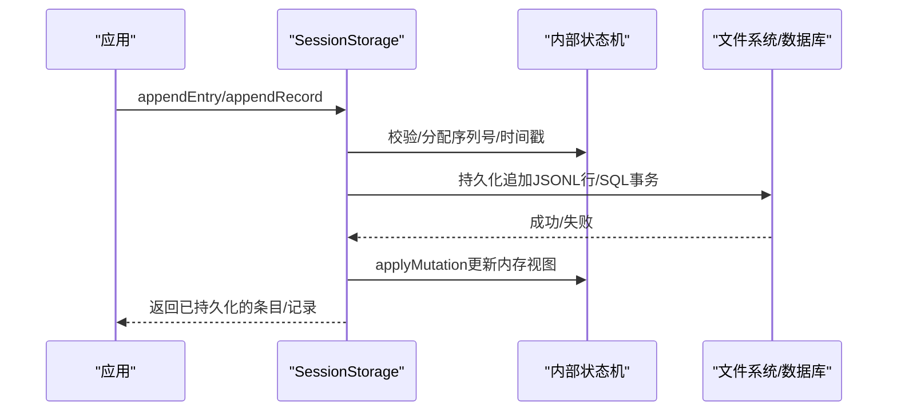
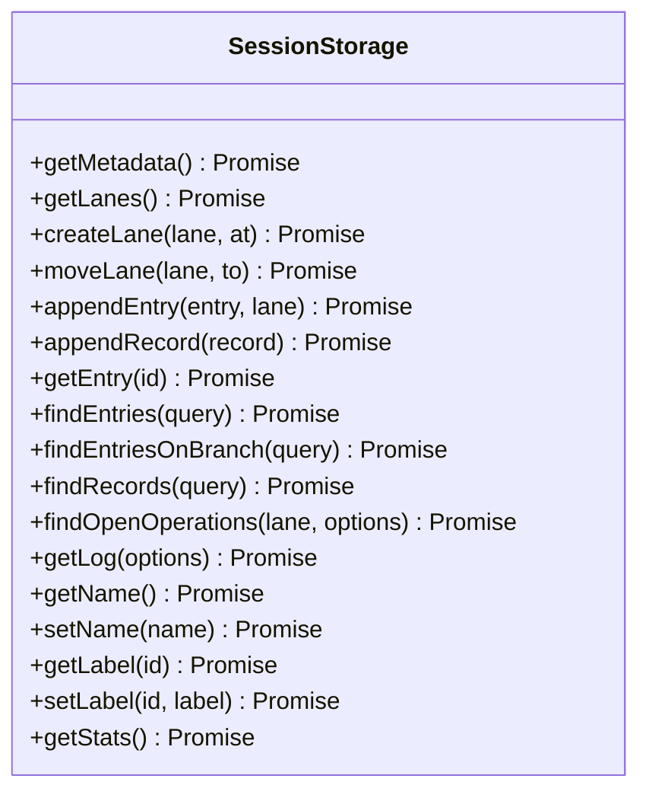
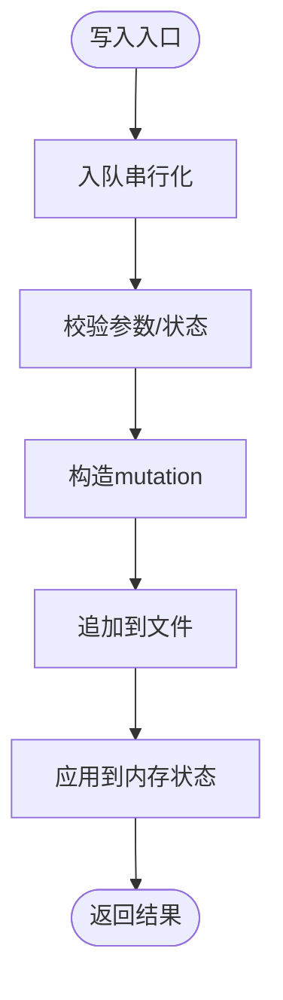
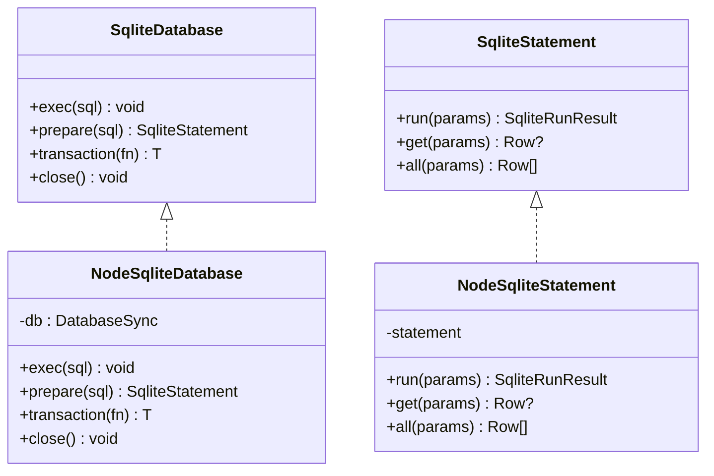
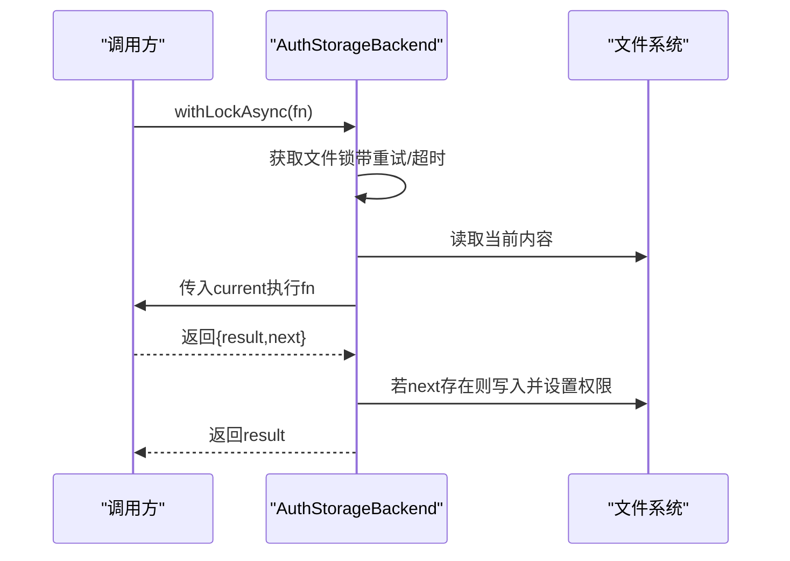
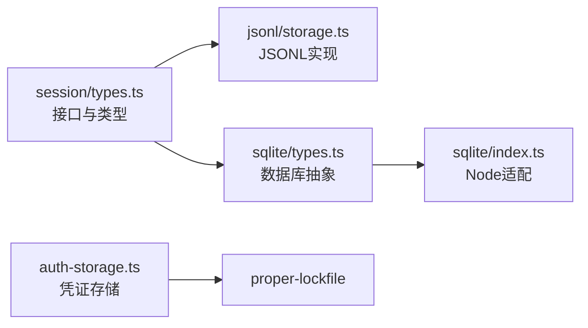

# 自定义存储后端开发

<cite>
**本文引用的文件**
- [packages/agent/src/harness/session/types.ts](file://packages/agent/src/harness/session/types.ts)
- [packages/agent/src/harness/session/jsonl/storage.ts](file://packages/agent/src/harness/session/jsonl/storage.ts)
- [packages/session-backends/sqlite-node/src/index.ts](file://packages/session-backends/sqlite-node/src/index.ts)
- [packages/session-backends/sqlite-node/src/sqlite/types.ts](file://packages/session-backends/sqlite-node/src/sqlite/types.ts)
- [packages/coding-agent/src/core/auth-storage.ts](file://packages/coding-agent/src/core/auth-storage.ts)
</cite>

## 目录
1. [简介](#简介)
2. [项目结构](#项目结构)
3. [核心组件](#核心组件)
4. [架构总览](#架构总览)
5. [详细组件分析](#详细组件分析)
6. [依赖关系分析](#依赖关系分析)
7. [性能考量](#性能考量)
8. [故障排查指南](#故障排查指南)
9. [结论](#结论)
10. [附录](#附录)

## 简介
本指南面向需要实现“自定义存储后端”的开发者，围绕会话与凭证两类存储抽象展开：
- 会话存储：定义统一的 SessionStorage 接口，提供分支、条目、记录、日志与全局事实等能力；并给出 JSONL 与 SQLite 两种参考实现。
- 凭证存储：定义 CredentialStore 与 AuthStorageBackend 抽象，提供基于文件的读写与内存测试实现。

通过阅读本指南，你将掌握：
- 存储接口的抽象设计与扩展点
- 如何继承基类或实现接口以创建自定义后端
- 必需方法、数据类型与一致性约束
- 测试策略、性能基准与兼容性验证
- 常见陷阱、最佳实践与企业级集成建议

## 项目结构
仓库中与存储相关的关键位置：
- 会话存储抽象与类型定义位于 agent 包中，JSONL 实现也在同一包内。
- SQLite 后端位于 session-backends/sqlite-node 包，封装了数据库适配层与仓库。
- 凭证存储位于 coding-agent 包，提供文件与内存两种后端。

图表来源
- [packages/agent/src/harness/session/types.ts:290-326](file://packages/agent/src/harness/session/types.ts#L290-L326)
- [packages/agent/src/harness/session/jsonl/storage.ts:48-276](file://packages/agent/src/harness/session/jsonl/storage.ts#L48-L276)
- [packages/session-backends/sqlite-node/src/index.ts:16-102](file://packages/session-backends/sqlite-node/src/index.ts#L16-L102)
- [packages/session-backends/sqlite-node/src/sqlite/types.ts:1-52](file://packages/session-backends/sqlite-node/src/sqlite/types.ts#L1-L52)
- [packages/coding-agent/src/core/auth-storage.ts:39-202](file://packages/coding-agent/src/core/auth-storage.ts#L39-L202)

章节来源
- [packages/agent/src/harness/session/types.ts:290-326](file://packages/agent/src/harness/session/types.ts#L290-L326)
- [packages/session-backends/sqlite-node/src/index.ts:16-102](file://packages/session-backends/sqlite-node/src/index.ts#L16-L102)
- [packages/coding-agent/src/core/auth-storage.ts:39-202](file://packages/coding-agent/src/core/auth-storage.ts#L39-L202)

## 核心组件
- 会话存储接口 SessionStorage：统一描述会话的元数据、分支管理、条目追加、记录追加、查询、日志与全局事实操作。
- JSONL 会话存储 JsonlSessionStorage：基于顺序追加的 JSONL 文件，维护内部状态机，保证原子发布与尾部修复。
- SQLite 会话仓库：通过 SqliteDatabase/SqliteStatement 抽象，封装迁移、仓库与搜索后端。
- 凭证存储：
  - AuthStorageBackend：提供 withLock/withLockAsync 的并发安全访问。
  - FileAuthStorageBackend：基于文件与锁的持久化实现。
  - InMemoryAuthStorageBackend：用于测试的内存实现。
  - ReadOnlyAuthStorage：只读凭证视图。

章节来源
- [packages/agent/src/harness/session/types.ts:290-326](file://packages/agent/src/harness/session/types.ts#L290-L326)
- [packages/agent/src/harness/session/jsonl/storage.ts:48-276](file://packages/agent/src/harness/session/jsonl/storage.ts#L48-L276)
- [packages/session-backends/sqlite-node/src/sqlite/types.ts:1-52](file://packages/session-backends/sqlite-node/src/sqlite/types.ts#L1-L52)
- [packages/coding-agent/src/core/auth-storage.ts:39-202](file://packages/coding-agent/src/core/auth-storage.ts#L39-L202)

## 架构总览
下图展示了上层调用如何通过统一接口选择不同存储后端，以及关键的数据流与一致性保障。

图表来源
- [packages/agent/src/harness/session/jsonl/storage.ts:154-191](file://packages/agent/src/harness/session/jsonl/storage.ts#L154-L191)
- [packages/session-backends/sqlite-node/src/index.ts:68-85](file://packages/session-backends/sqlite-node/src/index.ts#L68-L85)

## 详细组件分析

### 会话存储接口与数据模型
- 核心接口 SessionStorage 定义了会话的完整生命周期操作：
  - 元数据：getMetadata
  - 分支：getLanes/createLane/moveLane
  - 写入：appendEntry/appendRecord
  - 查询：getEntry/findEntries/findEntriesOnBranch/findRecords/findOpenOperations/getLog
  - 全局事实：getName/setName/getLabel/setLabel/getStats
- 数据类型：
  - Entry：消息、模型变更、工具使用、压缩、摘要、自定义等条目。
  - LaneRecord：操作开始/结束、步骤尝试、工具调用、队列、用量等记录。
  - Query/Cursor/LanePointer/LogItem 等查询与日志结构。

图表来源
- [packages/agent/src/harness/session/types.ts:290-326](file://packages/agent/src/harness/session/types.ts#L290-L326)

章节来源
- [packages/agent/src/harness/session/types.ts:6-215](file://packages/agent/src/harness/session/types.ts#L6-L215)
- [packages/agent/src/harness/session/types.ts:217-326](file://packages/agent/src/harness/session/types.ts#L217-L326)

### JSONL 会话存储实现
- 设计要点：
  - 顺序追加：所有变更以 mutation 形式追加到文件，避免随机写。
  - 原子发布：临时文件构建后原子重命名，防止崩溃导致损坏。
  - 尾部修复：加载时检测不完整行并回滚到有效前缀。
  - 串行化：通过 tail 队列串行执行写入，保证顺序一致。
- 关键流程：
  - fork：生成分支所需的初始 mutations，原子写入新文件并加载。
  - appendEntry/appendRecord：校验、分配 seq/timestamp、追加并应用至内存状态。
  - getLog/find*：从内存状态高效查询。

图表来源
- [packages/agent/src/harness/session/jsonl/storage.ts:154-191](file://packages/agent/src/harness/session/jsonl/storage.ts#L154-L191)
- [packages/agent/src/harness/session/jsonl/storage.ts:258-276](file://packages/agent/src/harness/session/jsonl/storage.ts#L258-L276)

章节来源
- [packages/agent/src/harness/session/jsonl/storage.ts:23-120](file://packages/agent/src/harness/session/jsonl/storage.ts#L23-L120)
- [packages/agent/src/harness/session/jsonl/storage.ts:154-276](file://packages/agent/src/harness/session/jsonl/storage.ts#L154-L276)

### SQLite 会话仓库与数据库适配
- 数据库抽象：
  - SqliteDatabase：exec/prepare/transaction/close
  - SqliteStatement：run/get/all
  - 工厂：SqliteDatabaseFactory.open(path)
- Node sqlite 适配：
  - 支持命名参数与位置参数
  - 同步事务包装，异常时自动回滚
  - 暴露 createNodeSqliteFactory 与 wrapNodeSqliteDatabase

图表来源
- [packages/session-backends/sqlite-node/src/sqlite/types.ts:1-52](file://packages/session-backends/sqlite-node/src/sqlite/types.ts#L1-L52)
- [packages/session-backends/sqlite-node/src/index.ts:16-102](file://packages/session-backends/sqlite-node/src/index.ts#L16-L102)

章节来源
- [packages/session-backends/sqlite-node/src/index.ts:16-102](file://packages/session-backends/sqlite-node/src/index.ts#L16-L102)
- [packages/session-backends/sqlite-node/src/sqlite/types.ts:1-52](file://packages/session-backends/sqlite-node/src/sqlite/types.ts#L1-L52)

### 凭证存储后端
- 接口与实现：
  - AuthStorageBackend：withLock/withLockAsync 提供并发安全的读写边界。
  - FileAuthStorageBackend：确保目录/文件存在，使用文件锁保护并发写，权限控制。
  - InMemoryAuthStorageBackend：内存链式串行，适合单元测试。
  - ReadOnlyAuthStorage：只读视图，解析并校验凭证结构。
- 典型流程：修改凭证时先加锁，读取当前值，计算新值，落盘释放锁。

图表来源
- [packages/coding-agent/src/core/auth-storage.ts:116-202](file://packages/coding-agent/src/core/auth-storage.ts#L116-L202)

章节来源
- [packages/coding-agent/src/core/auth-storage.ts:39-202](file://packages/coding-agent/src/core/auth-storage.ts#L39-L202)
- [packages/coding-agent/src/core/auth-storage.ts:204-291](file://packages/coding-agent/src/core/auth-storage.ts#L204-L291)
- [packages/coding-agent/src/core/auth-storage.ts:293-323](file://packages/coding-agent/src/core/auth-storage.ts#L293-L323)

## 依赖关系分析
- 会话存储：
  - JSONL 实现依赖内部状态机与文件系统，序列化/反序列化 codec。
  - SQLite 实现依赖 SqliteDatabase/SqliteStatement 抽象，屏蔽底层差异。
- 凭证存储：
  - 文件后端依赖 proper-lockfile 进行跨进程锁。
  - 内存后端无外部依赖，便于测试。

图表来源
- [packages/agent/src/harness/session/types.ts:290-326](file://packages/agent/src/harness/session/types.ts#L290-L326)
- [packages/agent/src/harness/session/jsonl/storage.ts:48-276](file://packages/agent/src/harness/session/jsonl/storage.ts#L48-L276)
- [packages/session-backends/sqlite-node/src/sqlite/types.ts:1-52](file://packages/session-backends/sqlite-node/src/sqlite/types.ts#L1-L52)
- [packages/session-backends/sqlite-node/src/index.ts:16-102](file://packages/session-backends/sqlite-node/src/index.ts#L16-L102)
- [packages/coding-agent/src/core/auth-storage.ts:39-202](file://packages/coding-agent/src/core/auth-storage.ts#L39-L202)

章节来源
- [packages/agent/src/harness/session/types.ts:290-326](file://packages/agent/src/harness/session/types.ts#L290-L326)
- [packages/session-backends/sqlite-node/src/index.ts:16-102](file://packages/session-backends/sqlite-node/src/index.ts#L16-L102)
- [packages/coding-agent/src/core/auth-storage.ts:39-202](file://packages/coding-agent/src/core/auth-storage.ts#L39-L202)

## 性能考量
- JSONL 后端
  - 顺序追加与原子发布减少碎片与损坏风险，适合高吞吐写入。
  - 内存状态承载查询，避免重复 IO；但需关注大会话的内存占用。
  - 建议：合理批处理、定期归档/压缩长会话。
- SQLite 后端
  - 使用事务批量写入，降低锁竞争与磁盘抖动。
  - 预编译语句复用，提升查询性能。
  - 建议：为常用查询字段建立索引，监控慢查询。
- 凭证存储
  - 文件锁重试与指数退避避免争用风暴。
  - 内存后端在测试中可显著降低 I/O 开销。

[本节为通用指导，不直接分析具体文件]

## 故障排查指南
- JSONL 加载失败
  - 现象：首行缺失头或某行解码失败。
  - 处理：检测尾部撕裂行，回滚到有效前缀并补全换行。
  - 参考路径：[packages/agent/src/harness/session/jsonl/storage.ts:69-108](file://packages/agent/src/harness/session/jsonl/storage.ts#L69-L108)
- 并发写入冲突
  - 凭证文件：捕获 ELOCKED 错误并重试，超过阈值抛出异常。
  - 参考路径：[packages/coding-agent/src/core/auth-storage.ts:68-93](file://packages/coding-agent/src/core/auth-storage.ts#L68-L93)
- SQLite 事务异常
  - 现象：回调抛出异常导致未提交。
  - 处理：catch 中执行 ROLLBACK，再抛出原始错误。
  - 参考路径：[packages/session-backends/sqlite-node/src/index.ts:68-85](file://packages/session-backends/sqlite-node/src/index.ts#L68-L85)

章节来源
- [packages/agent/src/harness/session/jsonl/storage.ts:69-108](file://packages/agent/src/harness/session/jsonl/storage.ts#L69-L108)
- [packages/coding-agent/src/core/auth-storage.ts:68-93](file://packages/coding-agent/src/core/auth-storage.ts#L68-L93)
- [packages/session-backends/sqlite-node/src/index.ts:68-85](file://packages/session-backends/sqlite-node/src/index.ts#L68-L85)

## 结论
- 通过 SessionStorage 与 AuthStorageBackend 两个抽象，系统实现了存储后端的解耦与可替换性。
- JSONL 与 SQLite 分别适用于不同场景：前者简单可靠、后者功能强大且可扩展。
- 凭证存储提供了文件与内存两种实现，满足生产与测试需求。
- 遵循一致的接口契约、严格的并发与一致性策略，是构建企业级存储后端的关键。

[本节为总结性内容，不直接分析具体文件]

## 附录

### 如何实现自定义存储后端（步骤清单）
- 明确目标：决定实现会话存储还是凭证存储，或两者兼有。
- 选择抽象：
  - 会话：实现 SessionStorage 接口（或在其之上封装）。
  - 凭证：实现 AuthStorageBackend 或 CredentialStore。
- 必备能力：
  - 会话：分支管理、条目/记录追加、查询、日志、全局事实。
  - 凭证：并发安全读写、持久化、权限控制。
- 一致性：
  - 使用事务或原子发布保证 ACID 或等效语义。
  - 对幂等性与恢复路径进行测试。
- 注册与装配：
  - 将自定义后端注入到上层仓库/管理器中（例如 SQLite 仓库通过工厂创建数据库实例）。
- 测试与基准：
  - 编写单元测试覆盖正常/异常路径。
  - 进行性能基准对比（QPS、延迟、资源占用）。
  - 进行兼容性验证（多平台、多运行时）。

章节来源
- [packages/agent/src/harness/session/types.ts:290-326](file://packages/agent/src/harness/session/types.ts#L290-L326)
- [packages/session-backends/sqlite-node/src/index.ts:96-102](file://packages/session-backends/sqlite-node/src/index.ts#L96-L102)
- [packages/coding-agent/src/core/auth-storage.ts:39-202](file://packages/coding-agent/src/core/auth-storage.ts#L39-L202)

### 常见陷阱与最佳实践
- 陷阱
  - 忽略并发：未加锁或未串行化导致数据竞争。
  - 不一致恢复：崩溃后无法恢复到一致状态。
  - 过度设计：过早引入复杂特性而忽视稳定性。
- 最佳实践
  - 优先顺序追加与原子发布。
  - 使用事务包裹批量写入。
  - 提供只读视图与缓存层以提升查询性能。
  - 完善的错误分类与可观测性（日志、指标）。

[本节为通用指导，不直接分析具体文件]

### 与企业级存储集成的高级用法
- 连接池与连接复用：为 SQLite 或其他数据库实现连接池，减少建连开销。
- 分片与分区：按会话 ID 或时间范围分库/分表，提升扩展性。
- 备份与快照：定期导出 JSONL 或数据库快照，支持快速恢复。
- 审计与合规：记录所有变更日志，支持不可变审计轨迹。
- 多租户隔离：通过命名空间或独立实例实现租户隔离。

[本节为通用指导，不直接分析具体文件]