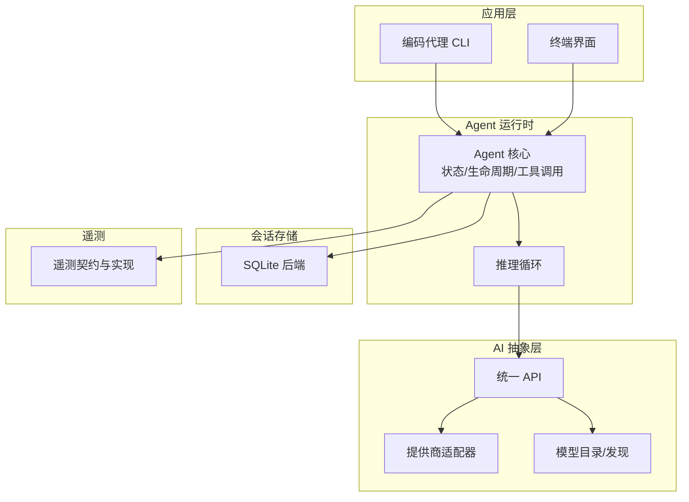
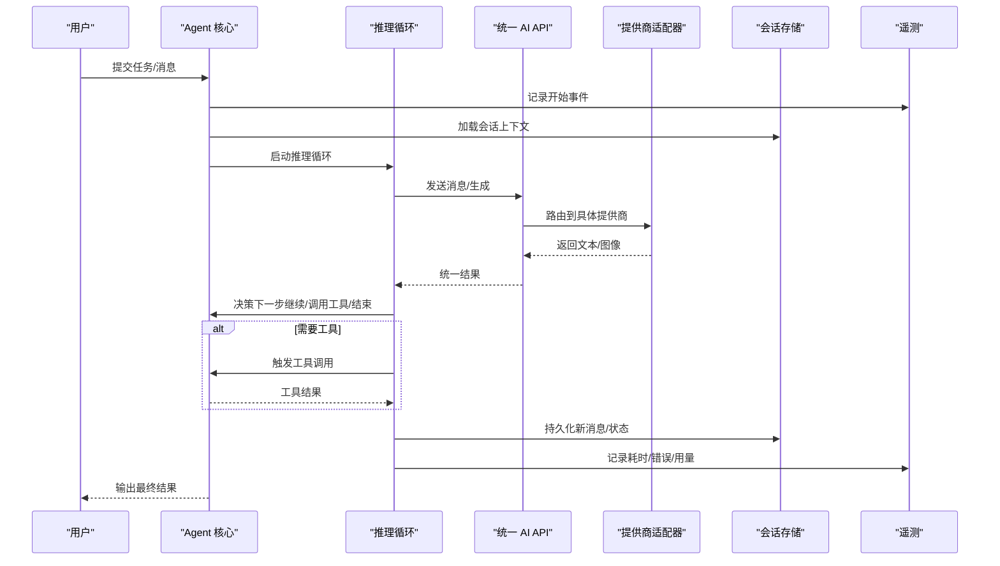
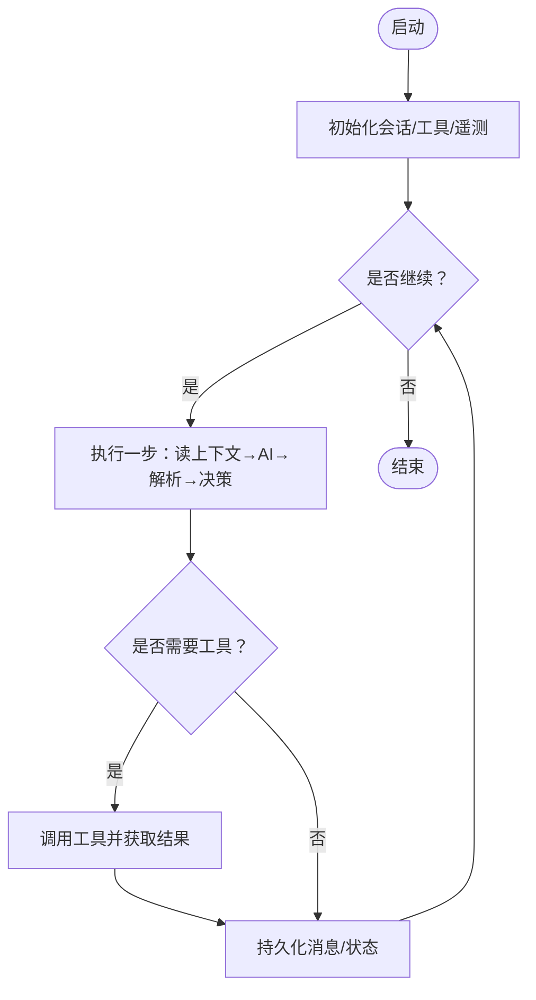
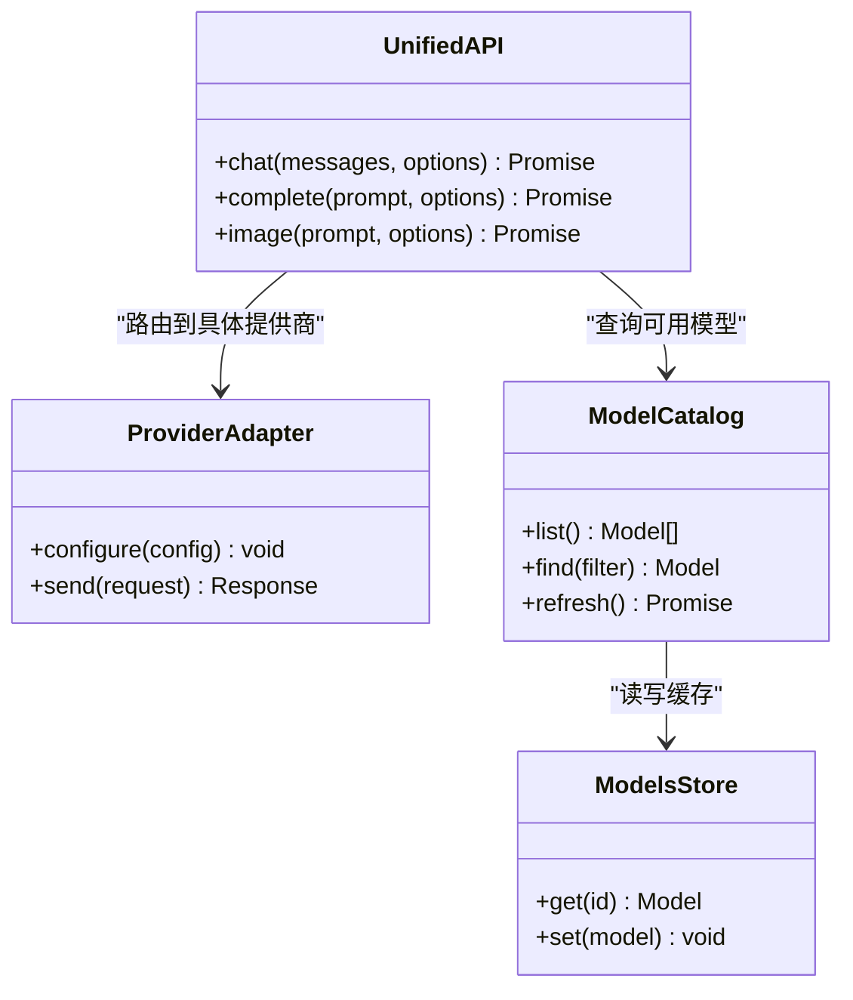
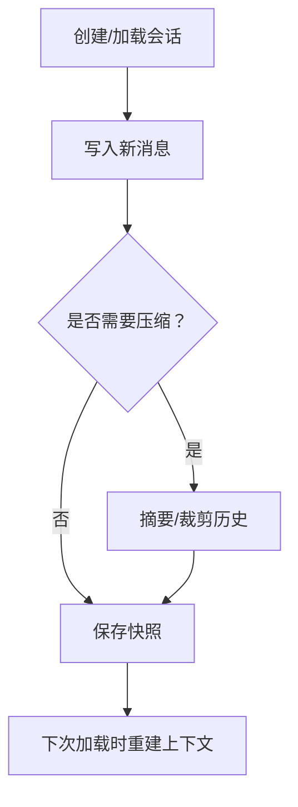
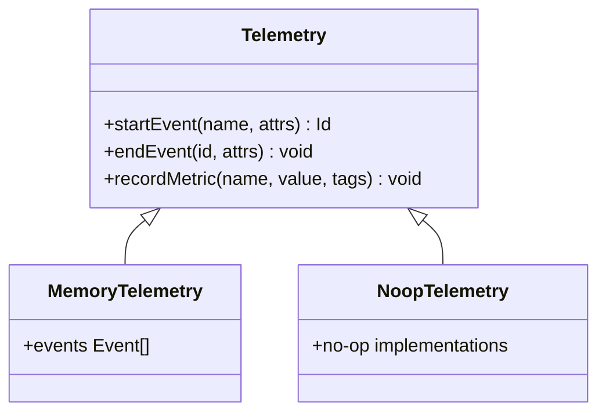
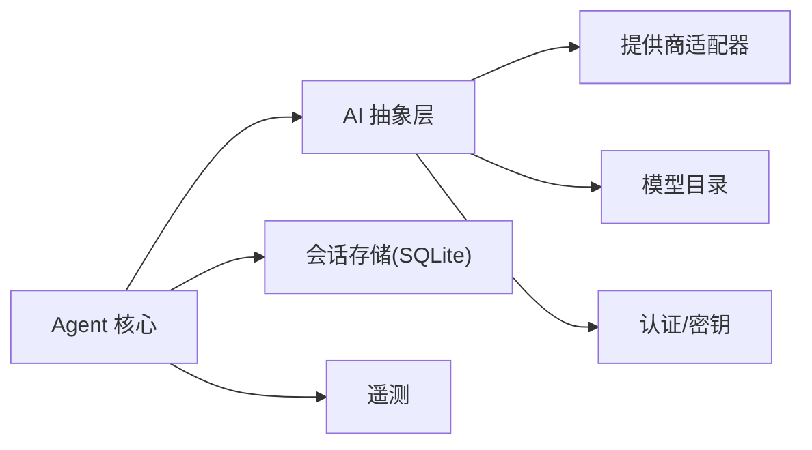

# 核心组件详解

<cite>
**本文引用的文件**
- [README.md](file://README.md)
- [agent.ts](file://packages/agent/src/agent.ts)
- [agent-loop.ts](file://packages/agent/src/agent-loop.ts)
- [types.ts](file://packages/agent/src/types.ts)
- [index.ts](file://packages/agent/src/index.ts)
- [models.ts](file://packages/ai/src/models.ts)
- [models-store.ts](file://packages/ai/src/models-store.ts)
- [model-catalog.ts](file://packages/ai/src/model-catalog.ts)
- [images-models.ts](file://packages/ai/src/images-models.ts)
- [session-resources.ts](file://packages/ai/src/session-resources.ts)
- [oauth.ts](file://packages/ai/src/oauth.ts)
- [env-api-keys.ts](file://packages/ai/src/env-api-keys.ts)
- [index.ts](file://packages/telemetry/src/index.ts)
- [memory.ts](file://packages/telemetry/src/memory.ts)
- [noop.ts](file://packages/telemetry/src/noop.ts)
- [sqlite-node README.md](file://packages/session-backends/sqlite-node/README.md)
</cite>

## 目录
1. [简介](#简介)
2. [项目结构](#项目结构)
3. [核心组件](#核心组件)
4. [架构总览](#架构总览)
5. [详细组件分析](#详细组件分析)
6. [依赖关系分析](#依赖关系分析)
7. [性能考量](#性能考量)
8. [故障排查指南](#故障排查指南)
9. [结论](#结论)
10. [附录](#附录)

## 简介
本文件面向希望深入理解 Pi Agent Harness 核心运行时与相关子系统的工程师，聚焦以下目标：
- Agent Core（代理运行时）：状态管理、生命周期控制、工具调用框架
- AI Abstraction（AI 抽象层）：提供商适配器模式、统一 API 设计、模型发现机制
- Session Management（会话管理）：会话状态持久化、上下文压缩、历史管理
- Telemetry（遥测系统）：事件追踪、性能监控、数据收集
- 组件间通信协议、数据流转与错误处理机制
- 提供接口定义与代码片段路径指引（不直接粘贴源码）

## 项目结构
仓库采用多包 monorepo 组织，关键包职责如下：
- packages/agent：Agent 运行时，负责编排推理循环、工具调用、状态与生命周期
- packages/ai：统一 LLM 抽象层，封装多家提供商的适配与模型目录
- packages/session-backends/sqlite-node：SQLite 后端实现（用于会话持久化的参考实现）
- packages/telemetry：厂商无关的遥测契约与参考实现（内存/空实现）
- packages/coding-agent、packages/tui、packages/server 等：上层应用与 UI/服务端集成

图表来源
- [README.md:17-34](file://README.md#L17-L34)

章节来源
- [README.md:17-34](file://README.md#L17-L34)

## 核心组件
本节概述四大核心组件的职责边界与交互要点。

- Agent Core（代理运行时）
  - 职责：维护会话状态机、驱动推理循环、调度工具执行、协调 AI 调用与会话持久化
  - 关键点：幂等的步骤推进、可恢复的状态快照、工具调用的安全沙箱（由上层保障）
- AI Abstraction（AI 抽象层）
  - 职责：对外暴露统一的对话/补全/图像等接口；内部按提供商适配；维护模型目录与发现
  - 关键点：配置集中化（密钥/端点）、错误归一化、流式响应支持
- Session Management（会话管理）
  - 职责：会话创建/加载、消息历史、上下文裁剪/压缩、持久化到后端
  - 关键点：增量写入、回滚能力、跨进程/跨实例一致性
- Telemetry（遥测系统）
  - 职责：采集事件（请求/响应/耗时/错误）、上报至不同后端（内存/文件/远端）
  - 关键点：低开销、可插拔、可观测性指标标准化

章节来源
- [README.md:17-34](file://README.md#L17-L34)

## 架构总览
下图展示从用户输入到 AI 返回、再到工具执行与状态更新的端到端流程。

图表来源
- [agent.ts:1-200](file://packages/agent/src/agent.ts#L1-L200)
- [agent-loop.ts:1-200](file://packages/agent/src/agent-loop.ts#L1-L200)
- [models.ts:1-200](file://packages/ai/src/models.ts#L1-L200)
- [session-resources.ts:1-200](file://packages/ai/src/session-resources.ts#L1-L200)
- [index.ts](file://packages/telemetry/src/index.ts)

## 详细组件分析

### Agent Core（代理运行时）
- 状态管理
  - 以“步骤”为单位推进，每步包含：读取上下文、调用 AI、解析意图、选择动作（继续/工具/结束）
  - 状态快照在关键节点落盘，支持崩溃恢复
- 生命周期控制
  - 初始化：加载会话、校验配置、注册工具集
  - 运行：进入推理循环，处理中断/超时/重试
  - 收尾：持久化、资源释放、上报遥测
- 工具调用框架
  - 工具注册表：声明式描述参数/返回值/权限
  - 执行器：隔离执行、超时保护、结果序列化
  - 错误处理：捕获异常并转换为统一错误类型，附带诊断信息

图表来源
- [agent.ts:1-200](file://packages/agent/src/agent.ts#L1-L200)
- [agent-loop.ts:1-200](file://packages/agent/src/agent-loop.ts#L1-L200)
- [types.ts:1-200](file://packages/agent/src/types.ts#L1-L200)

章节来源
- [agent.ts:1-200](file://packages/agent/src/agent.ts#L1-L200)
- [agent-loop.ts:1-200](file://packages/agent/src/agent-loop.ts#L1-L200)
- [types.ts:1-200](file://packages/agent/src/types.ts#L1-L200)
- [index.ts](file://packages/agent/src/index.ts)

### AI Abstraction（AI 抽象层）
- 提供商适配器模式
  - 统一接口：对话/补全/图像生成等
  - 适配器：针对 OpenAI/Anthropic/Google/Bedrock 等实现差异
  - 配置：密钥、端点、重试策略、速率限制
- 统一 API 设计
  - 请求/响应对象标准化，屏蔽提供商差异
  - 流式传输：逐 token 推送，便于前端实时渲染
  - 错误归一化：网络/鉴权/限流/配额等错误分类
- 模型发现机制
  - 模型目录：集中维护可用模型清单与能力标签
  - 动态发现：可选地刷新目录，缓存本地以提升冷启动速度
  - 图像模型：独立目录与注册表，便于扩展

图表来源
- [models.ts:1-200](file://packages/ai/src/models.ts#L1-L200)
- [models-store.ts:1-200](file://packages/ai/src/models-store.ts#L1-L200)
- [model-catalog.ts:1-200](file://packages/ai/src/model-catalog.ts#L1-L200)
- [images-models.ts:1-200](file://packages/ai/src/images-models.ts#L1-L200)
- [session-resources.ts:1-200](file://packages/ai/src/session-resources.ts#L1-L200)
- [oauth.ts:1-200](file://packages/ai/src/oauth.ts#L1-L200)
- [env-api-keys.ts:1-200](file://packages/ai/src/env-api-keys.ts#L1-L200)

章节来源
- [models.ts:1-200](file://packages/ai/src/models.ts#L1-L200)
- [models-store.ts:1-200](file://packages/ai/src/models-store.ts#L1-L200)
- [model-catalog.ts:1-200](file://packages/ai/src/model-catalog.ts#L1-L200)
- [images-models.ts:1-200](file://packages/ai/src/images-models.ts#L1-L200)
- [session-resources.ts:1-200](file://packages/ai/src/session-resources.ts#L1-L200)
- [oauth.ts:1-200](file://packages/ai/src/oauth.ts#L1-L200)
- [env-api-keys.ts:1-200](file://packages/ai/src/env-api-keys.ts#L1-L200)

### Session Management（会话管理）
- 会话状态持久化
  - 通过 session-backends 抽象，当前提供 SQLite 实现
  - 支持增量写入、事务保证、并发访问控制
- 上下文压缩与历史管理
  - 基于窗口或摘要策略裁剪历史，保留关键信息
  - 支持按角色/时间/重要性筛选消息
- 会话生命周期
  - 创建/加载/更新/归档/清理
  - 与 Agent 核心紧密协作，确保状态一致

图表来源
- [sqlite-node README.md](file://packages/session-backends/sqlite-node/README.md)

章节来源
- [sqlite-node README.md](file://packages/session-backends/sqlite-node/README.md)

### Telemetry（遥测系统）
- 事件追踪
  - 标准化事件：请求开始/结束、工具调用、错误、用量
  - 可扩展事件类型，便于业务定制
- 性能监控
  - 计时：端到端、单步、AI 调用、工具执行
  - 采样：在高吞吐场景下降低开销
- 数据收集
  - 内存缓冲：开发/测试环境快速验证
  - 空实现：生产按需接入外部系统
  - 可插拔：通过契约替换实现

图表来源
- [index.ts](file://packages/telemetry/src/index.ts)
- [memory.ts](file://packages/telemetry/src/memory.ts)
- [noop.ts](file://packages/telemetry/src/noop.ts)

章节来源
- [index.ts](file://packages/telemetry/src/index.ts)
- [memory.ts](file://packages/telemetry/src/memory.ts)
- [noop.ts](file://packages/telemetry/src/noop.ts)

## 依赖关系分析
- Agent 核心依赖
  - AI 抽象层：统一调用 LLM
  - 会话存储：持久化状态与历史
  - 遥测：埋点与指标上报
- AI 抽象层依赖
  - 提供商适配器：OpenAI/Anthropic/Google/Bedrock 等
  - 模型目录/存储：模型清单与缓存
  - 认证与密钥：OAuth、环境变量
- 会话后端
  - SQLite：轻量级、嵌入式、适合单机/容器部署
- 遥测
  - 内存/空实现：便于开发与无侵入集成

图表来源
- [agent.ts:1-200](file://packages/agent/src/agent.ts#L1-L200)
- [models.ts:1-200](file://packages/ai/src/models.ts#L1-L200)
- [model-catalog.ts:1-200](file://packages/ai/src/model-catalog.ts#L1-L200)
- [oauth.ts:1-200](file://packages/ai/src/oauth.ts#L1-L200)
- [env-api-keys.ts:1-200](file://packages/ai/src/env-api-keys.ts#L1-L200)
- [sqlite-node README.md](file://packages/session-backends/sqlite-node/README.md)
- [index.ts](file://packages/telemetry/src/index.ts)

章节来源
- [agent.ts:1-200](file://packages/agent/src/agent.ts#L1-L200)
- [models.ts:1-200](file://packages/ai/src/models.ts#L1-L200)
- [model-catalog.ts:1-200](file://packages/ai/src/model-catalog.ts#L1-L200)
- [oauth.ts:1-200](file://packages/ai/src/oauth.ts#L1-L200)
- [env-api-keys.ts:1-200](file://packages/ai/src/env-api-keys.ts#L1-L200)
- [sqlite-node README.md](file://packages/session-backends/sqlite-node/README.md)
- [index.ts](file://packages/telemetry/src/index.ts)

## 性能考量
- 推理循环
  - 批量化与流式处理：减少往返次数，提升首字延迟
  - 重试与退避：对瞬态错误进行指数退避，避免雪崩
- 会话存储
  - 增量写入与合并：降低 I/O 压力
  - 压缩策略：按时间/重要性裁剪，控制上下文大小
- AI 调用
  - 连接池与并发限制：防止过载
  - 模型选择：根据任务复杂度选择合适模型
- 遥测
  - 采样与异步上报：降低主路径开销
  - 指标聚合：减少高频打点

[本节为通用指导，不直接分析具体文件]

## 故障排查指南
- 常见问题定位
  - 认证失败：检查 OAuth/环境变量配置与令牌有效期
  - 模型不可用：核对模型目录与实际可用列表
  - 工具执行失败：查看工具日志与错误码，确认权限与沙箱
  - 会话损坏：尝试从最近快照恢复
- 调试建议
  - 启用详细日志与遥测，关注耗时与错误堆栈
  - 使用最小复现用例，逐步缩小范围
  - 在本地使用内存遥测快速验证

章节来源
- [oauth.ts:1-200](file://packages/ai/src/oauth.ts#L1-L200)
- [env-api-keys.ts:1-200](file://packages/ai/src/env-api-keys.ts#L1-L200)
- [model-catalog.ts:1-200](file://packages/ai/src/model-catalog.ts#L1-L200)
- [index.ts](file://packages/telemetry/src/index.ts)

## 结论
本架构通过清晰的职责划分与松耦合设计，实现了：
- Agent 核心的稳定编排与可恢复性
- AI 抽象层的统一接口与灵活扩展
- 会话管理的可靠持久化与高效上下文管理
- 遥测系统的低侵入可观测性
建议在集成时优先关注配置治理、错误归一化与性能监控，以获得更稳定的生产体验。

[本节为总结，不直接分析具体文件]

## 附录
- 接口与代码片段路径（示例）
  - Agent 核心入口与类型定义
    - [packages/agent/src/index.ts](file://packages/agent/src/index.ts)
    - [packages/agent/src/types.ts](file://packages/agent/src/types.ts)
  - 推理循环与主逻辑
    - [packages/agent/src/agent-loop.ts](file://packages/agent/src/agent-loop.ts)
    - [packages/agent/src/agent.ts](file://packages/agent/src/agent.ts)
  - AI 抽象层
    - [packages/ai/src/models.ts](file://packages/ai/src/models.ts)
    - [packages/ai/src/models-store.ts](file://packages/ai/src/models-store.ts)
    - [packages/ai/src/model-catalog.ts](file://packages/ai/src/model-catalog.ts)
    - [packages/ai/src/images-models.ts](file://packages/ai/src/images-models.ts)
    - [packages/ai/src/session-resources.ts](file://packages/ai/src/session-resources.ts)
    - [packages/ai/src/oauth.ts](file://packages/ai/src/oauth.ts)
    - [packages/ai/src/env-api-keys.ts](file://packages/ai/src/env-api-keys.ts)
  - 会话后端
    - [packages/session-backends/sqlite-node/README.md](file://packages/session-backends/sqlite-node/README.md)
  - 遥测
    - [packages/telemetry/src/index.ts](file://packages/telemetry/src/index.ts)
    - [packages/telemetry/src/memory.ts](file://packages/telemetry/src/memory.ts)
    - [packages/telemetry/src/noop.ts](file://packages/telemetry/src/noop.ts)

[本节为索引，不直接分析具体文件]