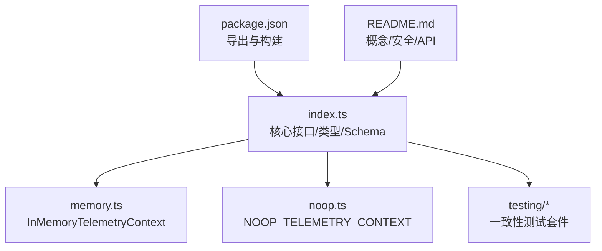
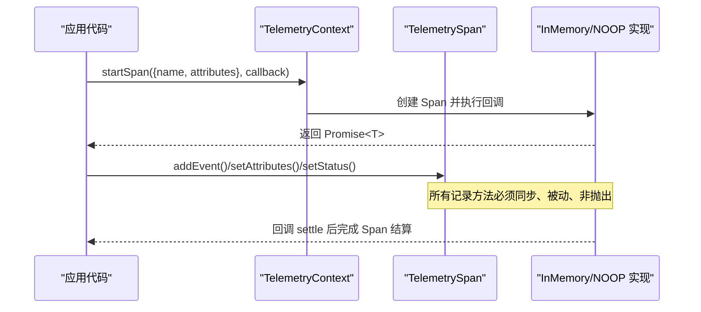
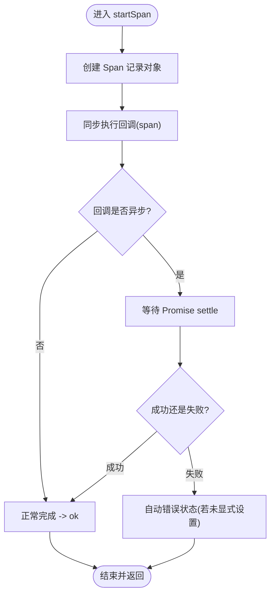
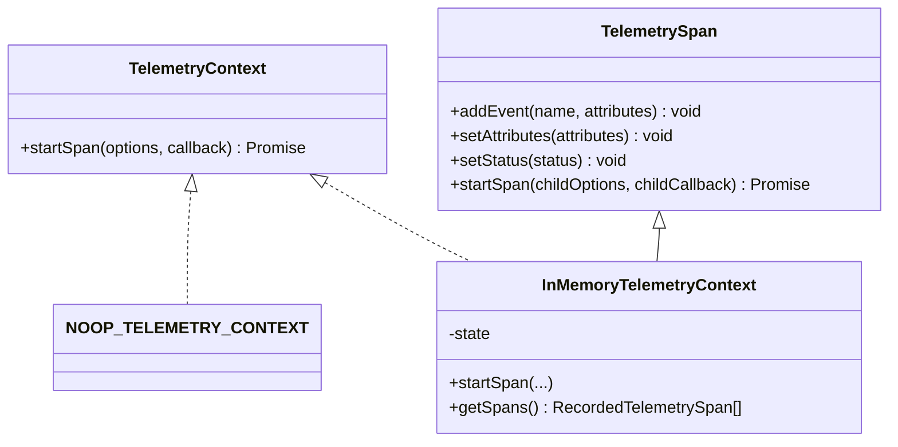
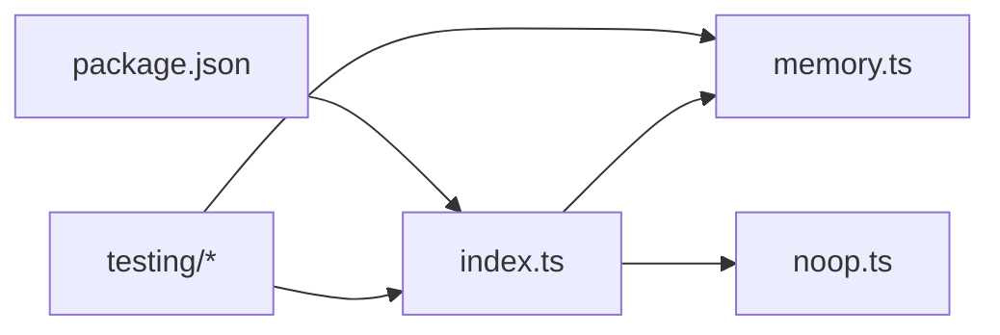
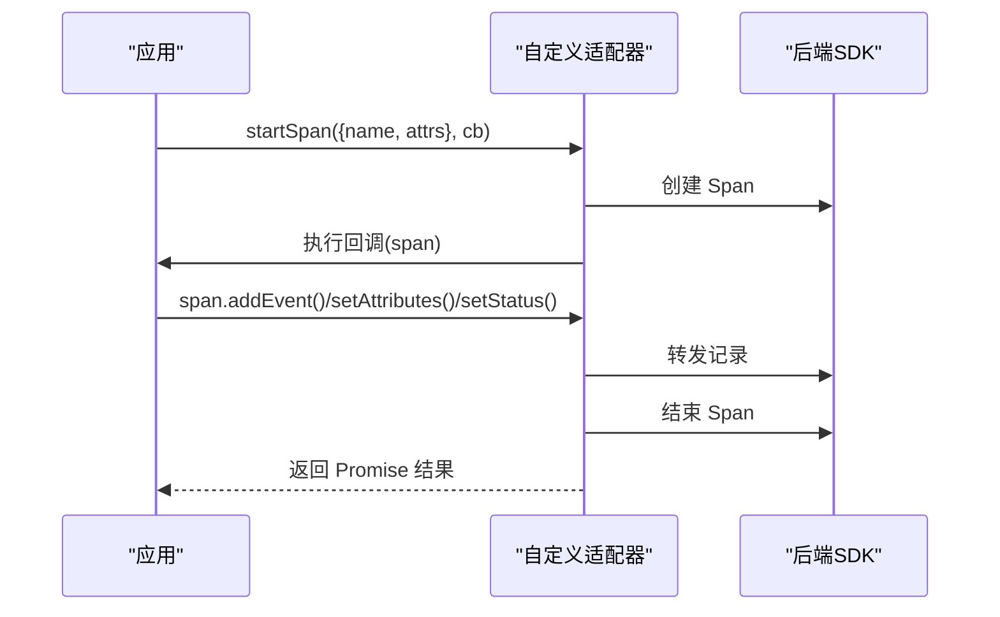
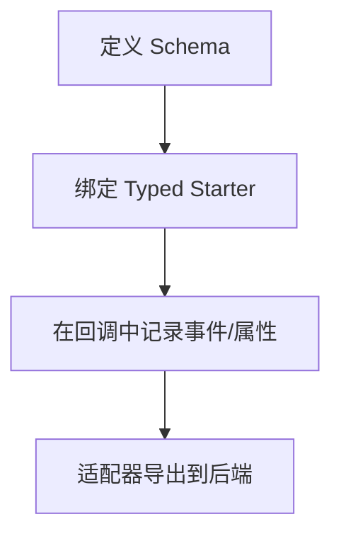

# 遥测系统

<cite>
**本文引用的文件**
- [packages/telemetry/src/index.ts](file://packages/telemetry/src/index.ts)
- [packages/telemetry/src/memory.ts](file://packages/telemetry/src/memory.ts)
- [packages/telemetry/src/noop.ts](file://packages/telemetry/src/noop.ts)
- [packages/telemetry/src/testing/index.ts](file://packages/telemetry/src/testing/index.ts)
- [packages/telemetry/src/testing/conformance.ts](file://packages/telemetry/src/testing/conformance.ts)
- [packages/telemetry/src/testing/types.ts](file://packages/telemetry/src/testing/types.ts)
- [packages/telemetry/README.md](file://packages/telemetry/README.md)
- [packages/telemetry/package.json](file://packages/telemetry/package.json)
</cite>

## 目录
1. [简介](#简介)
2. [项目结构](#项目结构)
3. [核心组件](#核心组件)
4. [架构总览](#架构总览)
5. [详细组件分析](#详细组件分析)
6. [依赖关系分析](#依赖关系分析)
7. [性能考量](#性能考量)
8. [故障排查指南](#故障排查指南)
9. [结论](#结论)
10. [附录](#附录)

## 简介
本文件为 Pi 项目的“遥测系统”架构文档，聚焦于事件追踪机制（Span 管理、属性定义、上下文传播）、性能监控实现（指标收集、数据采集、数据导出）、内置提供者（InMemory、NOOP）与自定义扩展点。同时提供集成第三方遥测服务与自定义遥测事件的实践指引，并给出隐私保护与性能优化策略。

该遥测包是供应商中立的契约层：不绑定任何后端，不持有全局当前 Span，通过显式 TelemetryContext 传递上下文；并提供类型安全的 Schema 工具，帮助在编译期约束 Span 名称与属性。

**章节来源**
- [packages/telemetry/README.md:1-31](file://packages/telemetry/README.md#L1-L31)
- [packages/telemetry/README.md:385-391](file://packages/telemetry/README.md#L385-L391)

## 项目结构
遥测子系统位于 packages/telemetry，采用“契约 + 参考实现 + 测试套件”的清晰分层：
- index.ts：核心接口与类型、Schema 定义与类型推导、Typed Span Starter。
- memory.ts：进程内 InMemory 参考实现，用于测试与本地诊断。
- noop.ts：NOOP 空实现，用于禁用遥测时的零开销路径。
- testing/*：适配器一致性测试套件与类型，确保自定义实现符合契约语义。
- package.json：导出入口与构建脚本。
- README.md：概念说明、API 参考与安全注意事项。



**图表来源**
- [packages/telemetry/src/index.ts:14-22](file://packages/telemetry/src/index.ts#L14-L22)
- [packages/telemetry/src/memory.ts:192-219](file://packages/telemetry/src/memory.ts#L192-L219)
- [packages/telemetry/src/noop.ts:1-21](file://packages/telemetry/src/noop.ts#L1-L21)
- [packages/telemetry/package.json:8-16](file://packages/telemetry/package.json#L8-L16)

**章节来源**
- [packages/telemetry/package.json:1-27](file://packages/telemetry/package.json#L1-L27)
- [packages/telemetry/README.md:15-31](file://packages/telemetry/README.md#L15-L31)

## 核心组件
- TelemetryContext：启动一个带回调的 Span，回调接收 TelemetrySpan，作为子 Span 的父上下文。
- TelemetrySpan：记录事件、合并属性、设置状态；自身也具备 startSpan 能力以创建子 Span。
- NOOP_TELEMETRY_CONTEXT：共享的空实现，保证无遥测时零开销。
- InMemoryTelemetryContext：进程内记录器，返回确定性快照，适合测试与本地诊断。
- Schema 工具：defineTelemetrySchema 与 createTypedSpanStarter，提供编译期类型约束与更严格的 API。

关键职责边界：
- 契约层只关注“开始/结束生命周期、属性合并、事件顺序、状态最终值”，不关心后端细节。
- 适配器负责将通用概念映射到具体后端（如 OpenTelemetry、Sentry、日志等）。

**章节来源**
- [packages/telemetry/src/index.ts:14-22](file://packages/telemetry/src/index.ts#L14-L22)
- [packages/telemetry/src/index.ts:71-74](file://packages/telemetry/src/index.ts#L71-L74)
- [packages/telemetry/src/index.ts:349-354](file://packages/telemetry/src/index.ts#L349-L354)
- [packages/telemetry/src/noop.ts:1-21](file://packages/telemetry/src/noop.ts#L1-L21)
- [packages/telemetry/src/memory.ts:192-219](file://packages/telemetry/src/memory.ts#L192-L219)

## 架构总览
下图展示了调用方如何通过 TelemetryContext 启动 Span，并在回调中创建子 Span、记录事件与属性、设置状态；InMemory 与 NOOP 两种实现遵循相同语义，可被替换。



**图表来源**
- [packages/telemetry/src/index.ts:14-22](file://packages/telemetry/src/index.ts#L14-L22)
- [packages/telemetry/src/memory.ts:120-186](file://packages/telemetry/src/memory.ts#L120-L186)
- [packages/telemetry/src/noop.ts:3-16](file://packages/telemetry/src/noop.ts#L3-L16)

## 详细组件分析

### Span 管理与上下文传播
- 显式上下文：TelemetryContext 作为参数显式传入，避免全局状态；每个 Span 既是记录者也是子 Span 的父上下文。
- 生命周期：startSpan 拥有结算权，回调返回值或 Promise settle 时自动结束；未显式设置状态时，抛错/拒绝视为 error。
- 嵌套与并发：支持任意深度嵌套与并发；InMemory 使用父子 id 与 endSequence 保持顺序。
- 幂等与惰性：已结算后的记录调用将被忽略；失败记录会被静默抑制，不影响业务回调执行。



**图表来源**
- [packages/telemetry/src/memory.ts:120-186](file://packages/telemetry/src/memory.ts#L120-L186)
- [packages/telemetry/src/memory.ts:89-99](file://packages/telemetry/src/memory.ts#L89-L99)

**章节来源**
- [packages/telemetry/src/index.ts:14-22](file://packages/telemetry/src/index.ts#L14-L22)
- [packages/telemetry/src/memory.ts:120-186](file://packages/telemetry/src/memory.ts#L120-L186)
- [packages/telemetry/src/noop.ts:3-16](file://packages/telemetry/src/noop.ts#L3-L16)

### 属性定义与 Schema 类型推断
- 开放属性袋：底层接受 name 与 attributes 键值对，适配器保持通用性。
- 领域 Schema：通过 defineTelemetrySchema 声明 span 名称、parents、start/end 属性、events、status 规则。
- 类型推导：createTypedSpanStarter 将 Schema 转换为强类型 starter，限制 span 名、属性键与值域，减少运行时错误。
- 开始与结束属性：startAttributes 在创建时提供；endAttributes 在回调期间通过 setAttributes 补充；两者最终合并为同一属性集合。

```mermaid
classDiagram
class TelemetrySchemaDefinition {
+number version
+Record~string, TelemetrySpanDefinition~ spans
}
class TelemetrySpanDefinition {
+string description
+TelemetryParentDefinition parents
+Record~string, TelemetryStartAttributeDefinition~ startAttributes
+Record~string, TelemetryAttributeDefinition~ endAttributes
+Record~string, TelemetryEventDefinition~ events?
+{ default : "ok"; errorWhen : string } status
}
class TelemetryAttributeDefinition {
+string type
+boolean required?
+values? | elementValues?
+examples?
+sensitive?
+cardinality?
}
TelemetrySchemaDefinition --> TelemetrySpanDefinition : "包含"
TelemetrySpanDefinition --> TelemetryAttributeDefinition : "引用"
```

**图表来源**
- [packages/telemetry/src/index.ts:26-69](file://packages/telemetry/src/index.ts#L26-L69)
- [packages/telemetry/src/index.ts:122-144](file://packages/telemetry/src/index.ts#L122-L144)
- [packages/telemetry/src/index.ts:153-171](file://packages/telemetry/src/index.ts#L153-L171)
- [packages/telemetry/src/index.ts:222-238](file://packages/telemetry/src/index.ts#L222-L238)
- [packages/telemetry/src/index.ts:349-354](file://packages/telemetry/src/index.ts#L349-L354)

**章节来源**
- [packages/telemetry/src/index.ts:26-69](file://packages/telemetry/src/index.ts#L26-L69)
- [packages/telemetry/src/index.ts:349-354](file://packages/telemetry/src/index.ts#L349-L354)
- [packages/telemetry/README.md:211-339](file://packages/telemetry/README.md#L211-L339)

### 事件与状态
- 事件：addEvent(name, attributes?) 记录命名事件及可选属性；事件有序且不可变快照。
- 状态：setStatus({status, error?}) 显式设置；未设置时由异常/拒绝自动推断；多次设置最后写入生效。
- 记录方法：必须同步、被动、非抛出；失败记录应被抑制且不中断业务。

**章节来源**
- [packages/telemetry/src/index.ts:14-22](file://packages/telemetry/src/index.ts#L14-L22)
- [packages/telemetry/src/memory.ts:141-165](file://packages/telemetry/src/memory.ts#L141-L165)
- [packages/telemetry/src/memory.ts:78-99](file://packages/telemetry/src/memory.ts#L78-L99)

### 内置提供者：NOOP 与 InMemory
- NOOP：共享冻结 Span，所有记录为空操作；适用于禁用遥测场景。
- InMemory：进程内记录，提供 getSpans() 获取按开始顺序的快照；ID、parentId、事件顺序、endSequence 确定；无时间戳；存储无界，仅进程内有效。



**图表来源**
- [packages/telemetry/src/index.ts:14-22](file://packages/telemetry/src/index.ts#L14-L22)
- [packages/telemetry/src/noop.ts:1-21](file://packages/telemetry/src/noop.ts#L1-L21)
- [packages/telemetry/src/memory.ts:192-219](file://packages/telemetry/src/memory.ts#L192-L219)

**章节来源**
- [packages/telemetry/src/noop.ts:1-21](file://packages/telemetry/src/noop.ts#L1-L21)
- [packages/telemetry/src/memory.ts:192-219](file://packages/telemetry/src/memory.ts#L192-L219)
- [packages/telemetry/README.md:134-177](file://packages/telemetry/README.md#L134-L177)

### 适配器一致性测试
- 提供 runner 无关的一致性用例集，验证：单次执行、结果/拒绝身份、自动与显式状态、属性合并、事件顺序、已结算后调用惰性、嵌套与并发父级、不可读负载失败抑制等。
- 通过 createTelemetryAdapterConformance 生成用例，适配者需暴露 context 与 normalizedSpans 读取器。

**章节来源**
- [packages/telemetry/src/testing/index.ts:1-7](file://packages/telemetry/src/testing/index.ts#L1-L7)
- [packages/telemetry/src/testing/conformance.ts](file://packages/telemetry/src/testing/conformance.ts)
- [packages/telemetry/src/testing/types.ts](file://packages/telemetry/src/testing/types.ts)
- [packages/telemetry/README.md:178-209](file://packages/telemetry/README.md#L178-L209)

## 依赖关系分析
- 模块耦合：
  - index.ts 定义契约与 Schema 工具，不依赖 memory/noop。
  - memory.ts 依赖 index.ts 的类型与 noop.ts 的降级路径。
  - noop.ts 仅依赖 index.ts 的类型。
  - testing/* 依赖 index.ts 与 memory.ts 的快照类型，用于断言。
- 外部依赖：包本身无运行时后端依赖；导出入口由 package.json 配置。



**图表来源**
- [packages/telemetry/src/index.ts:24-25](file://packages/telemetry/src/index.ts#L24-L25)
- [packages/telemetry/src/memory.ts:1-9](file://packages/telemetry/src/memory.ts#L1-L9)
- [packages/telemetry/src/noop.ts:1-2](file://packages/telemetry/src/noop.ts#L1-L2)
- [packages/telemetry/package.json:8-16](file://packages/telemetry/package.json#L8-L16)

**章节来源**
- [packages/telemetry/package.json:8-16](file://packages/telemetry/package.json#L8-L16)

## 性能考量
- 零开销路径：NOOP 实现直接同步执行回调，无额外分配。
- 记录方法被动化：InMemory 捕获异常并忽略，避免影响业务；属性与事件复制仅在必要时进行。
- 无全局状态：避免 AsyncLocalStorage 等运行时特定 API，降低环境差异带来的开销。
- 内存占用：InMemory 存储无界，仅适合测试与短期诊断；生产环境应使用适配器并实现采样/限流/缓冲策略。
- 属性大小与基数：Schema 中标记 sensitive/cardinality 有助于下游采集侧做策略控制。

[本节为通用指导，不直接分析具体文件]

## 故障排查指南
- 现象：Span 已结束仍调用记录方法
  - 行为：调用被忽略，不会抛出异常。
  - 定位：检查是否在回调 settle 之后继续记录。
- 现象：属性未合并或丢失
  - 行为：重复 setAttributes 会合并，undefined 被忽略。
  - 定位：确认传入的属性键与值是否正确。
- 现象：状态未按预期为 error
  - 行为：未显式 setStatus 时，抛错/拒绝会自动设为 error；若已显式设置为 ok，则以最后一次为准。
  - 定位：检查 setStatus 调用时机与顺序。
- 现象：事件顺序不确定
  - 行为：InMemory 中事件按添加顺序保存；跨并发任务请结合 endSequence 与 parentId 重建时序。
- 现象：适配器不符合契约
  - 行为：可能违反“单次执行、结果身份、惰性记录”等要求。
  - 定位：运行一致性测试套件，逐项比对。

**章节来源**
- [packages/telemetry/src/memory.ts:141-165](file://packages/telemetry/src/memory.ts#L141-L165)
- [packages/telemetry/src/memory.ts:89-99](file://packages/telemetry/src/memory.ts#L89-L99)
- [packages/telemetry/README.md:178-209](file://packages/telemetry/README.md#L178-L209)

## 结论
Pi 遥测系统以“契约 + 类型 + 参考实现”为核心，提供稳定、可移植、可扩展的事件追踪能力。通过显式上下文传播与强类型 Schema，既保证了跨后端的一致语义，又降低了集成成本。生产环境建议基于此契约实现适配器，并结合采样、敏感字段过滤与资源限制策略，平衡可观测性与性能。

[本节为总结性内容，不直接分析具体文件]

## 附录

### 如何集成第三方遥测服务（示例流程）
- 步骤概览：
  1) 实现 TelemetryContext 接口，封装后端 SDK（如 OpenTelemetry/Sentry）。
  2) 在 startSpan 中创建后端 Span，同步执行回调，并在回调 settle 时结束后端 Span。
  3) 将 addEvent/setAttributes/setStatus 映射到后端对应 API。
  4) 使用 createTypedSpanStarter 绑定 Schema，获得类型安全的调用入口。
  5) 运行一致性测试套件，确保行为符合契约。



[本图为概念流程图，不直接映射具体源码文件]

### 如何定义自定义遥测事件（示例流程）
- 步骤概览：
  1) 使用 defineTelemetrySchema 定义 span、事件与属性元数据（含 required、values、sensitive、cardinality）。
  2) 使用 createTypedSpanStarter 绑定 Schema，获得类型安全的 starter。
  3) 在回调中使用 span.addEvent('event.name', attrs) 与 span.setAttributes(endAttrs)。
  4) 通过适配器导出到后端；在采集侧根据敏感性与基数策略处理。



[本图为概念流程图，不直接映射具体源码文件]

### 隐私保护与性能优化策略
- 隐私保护：
  - 避免在属性中记录提示词、工具输入/输出、文件内容、凭据、自由格式错误详情。
  - 使用 Schema 的 sensitive 标记，配合采集端策略进行脱敏或丢弃。
  - 不在持久化记录中保留 TelemetryContext/Span/后端原生对象。
- 性能优化：
  - 生产环境使用适配器实现采样与批量导出。
  - 限制属性数量与长度，避免高基数维度。
  - 谨慎使用 InMemory 作为长期记录手段；测试结束后及时释放实例。

**章节来源**
- [packages/telemetry/README.md:385-391](file://packages/telemetry/README.md#L385-L391)
- [packages/telemetry/README.md:154-177](file://packages/telemetry/README.md#L154-L177)