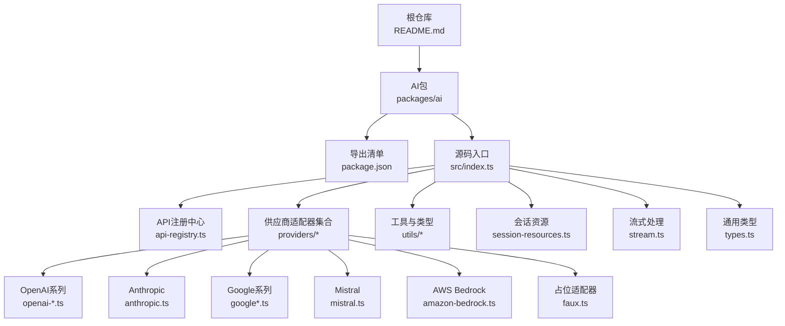
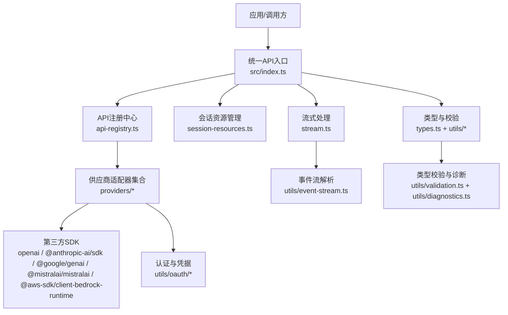
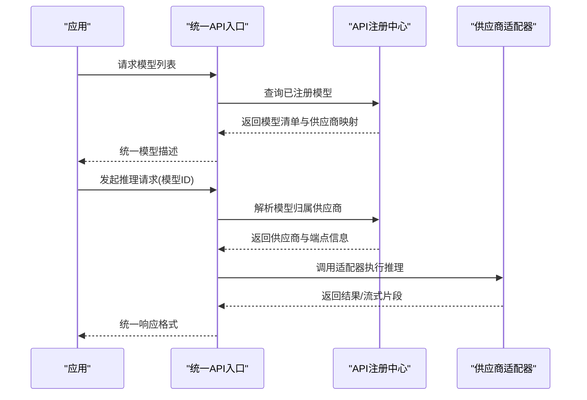
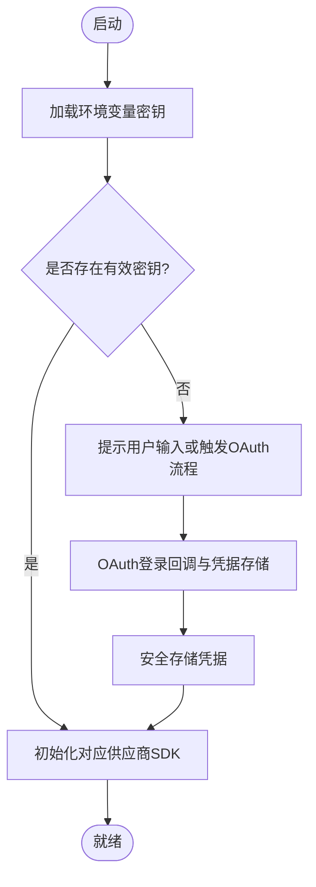
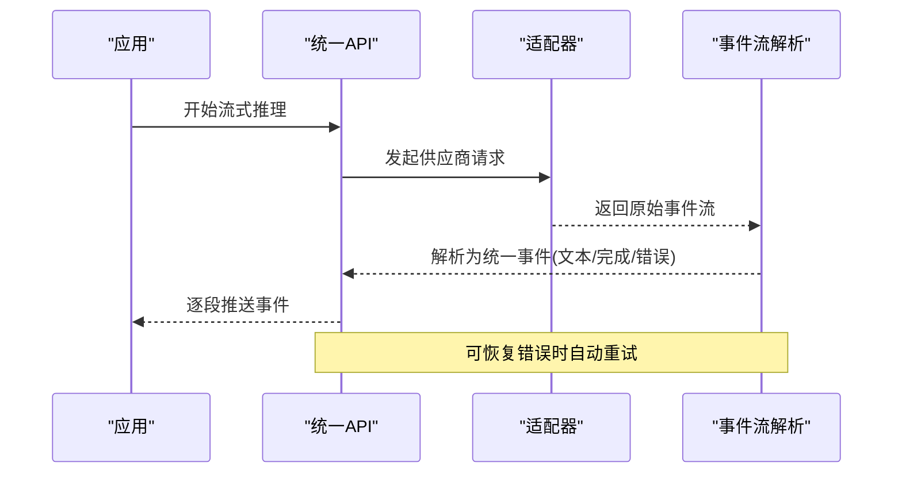
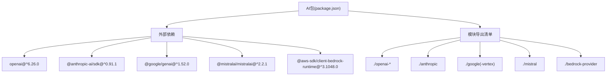

# AI提供者层架构

<cite>
**本文引用的文件**
- [README.md](file://README.md)
- [packages/ai/package.json](file://packages/ai/package.json)
- [packages/ai/src/index.ts](file://packages/ai/src/index.ts)
- [packages/ai/src/api-registry.ts](file://packages/ai/src/api-registry.ts)
- [packages/ai/src/env-api-keys.ts](file://packages/ai/src/env-api-keys.ts)
- [packages/ai/src/models.ts](file://packages/ai/src/models.ts)
- [packages/ai/src/session-resources.ts](file://packages/ai/src/session-resources.ts)
- [packages/ai/src/stream.ts](file://packages/ai/src/stream.ts)
- [packages/ai/src/types.ts](file://packages/ai/src/types.ts)
- [packages/ai/src/utils/diagnostics.ts](file://packages/ai/src/utils/diagnostics.ts)
- [packages/ai/src/utils/event-stream.ts](file://packages/ai/src/utils/event-stream.ts)
- [packages/ai/src/utils/json-parse.ts](file://packages/ai/src/utils/json-parse.ts)
- [packages/ai/src/utils/oauth/types.ts](file://packages/ai/src/utils/oauth/types.ts)
- [packages/ai/src/providers/register-builtins.ts](file://packages/ai/src/providers/register-builtins.ts)
- [packages/ai/src/providers/faux.ts](file://packages/ai/src/providers/faux.ts)
- [packages/ai/src/providers/amazon-bedrock.ts](file://packages/ai/src/providers/amazon-bedrock.ts)
- [packages/ai/src/providers/anthropic.ts](file://packages/ai/src/providers/anthropic.ts)
- [packages/ai/src/providers/google.ts](file://packages/ai/src/providers/google.ts)
- [packages/ai/src/providers/google-vertex.ts](file://packages/ai/src/providers/google-vertex.ts)
- [packages/ai/src/providers/mistral.ts](file://packages/ai/src/providers/mistral.ts)
- [packages/ai/src/providers/openai-codex-responses.ts](file://packages/ai/src/providers/openai-codex-responses.ts)
- [packages/ai/src/providers/openai-completions.ts](file://packages/ai/src/providers/openai-completions.ts)
- [packages/ai/src/providers/openai-responses.ts](file://packages/ai/src/providers/openai-responses.ts)
- [packages/ai/src/providers/images/register-builtins.ts](file://packages/ai/src/providers/images/register-builtins.ts)
- [packages/ai/src/images.ts](file://packages/ai/src/images.ts)
- [packages/ai/src/images-api-registry.ts](file://packages/ai/src/images-api-registry.ts)
- [packages/ai/src/image-models.ts](file://packages/ai/src/image-models.ts)
- [packages/ai/src/utils/oauth/index.ts](file://packages/ai/src/utils/oauth/index.ts)
</cite>

## 目录
1. [简介](#简介)
2. [项目结构](#项目结构)
3. [核心组件](#核心组件)
4. [架构总览](#架构总览)
5. [详细组件分析](#详细组件分析)
6. [依赖关系分析](#依赖关系分析)
7. [性能考虑](#性能考虑)
8. [故障排查指南](#故障排查指南)
9. [结论](#结论)
10. [附录](#附录)

## 简介
本文件面向“AI提供者层”（统一多供应商LLM API）的架构与实现，目标是帮助开发者快速理解并扩展对OpenAI、Anthropic、Google、AWS Bedrock、Mistral等多家供应商的统一抽象与集成方式。文档覆盖以下主题：
- 统一接口层设计理念与API注册机制
- 模型适配器模式与认证管理系统
- 流式响应处理、错误重试与性能优化策略
- 多供应商适配器实现细节与安全认证存储
- 统一API接口规范与新增供应商接入流程
- 配置管理与版本兼容性处理

## 项目结构
该仓库采用Monorepo组织，AI提供者层位于packages/ai，通过package.json导出多个子模块（如openai、anthropic、google、mistral、bedrock-provider等），便于按需引入与最小化打包。

图表来源
- [packages/ai/package.json:8-52](file://packages/ai/package.json#L8-L52)
- [packages/ai/src/index.ts:1-48](file://packages/ai/src/index.ts#L1-L48)

章节来源
- [README.md:19-26](file://README.md#L19-L26)
- [packages/ai/package.json:1-107](file://packages/ai/package.json#L1-L107)
- [packages/ai/src/index.ts:1-48](file://packages/ai/src/index.ts#L1-L48)

## 核心组件
- API注册中心：负责统一注册与发现各供应商的API端点、模型映射与能力声明。
- 供应商适配器：针对不同供应商实现一致的调用接口，屏蔽差异化的SDK与协议。
- 认证与密钥管理：集中管理环境变量中的API密钥与OAuth凭据，提供安全存储与轮换机制。
- 流式处理：统一处理文本/图像生成的增量输出，支持事件流解析与错误恢复。
- 类型系统与校验：基于TypeBox定义严格的输入/输出Schema，确保跨供应商一致性。
- 会话资源：封装一次对话或任务所需的上下文、资源与生命周期管理。

章节来源
- [packages/ai/src/api-registry.ts](file://packages/ai/src/api-registry.ts)
- [packages/ai/src/env-api-keys.ts](file://packages/ai/src/env-api-keys.ts)
- [packages/ai/src/stream.ts](file://packages/ai/src/stream.ts)
- [packages/ai/src/types.ts](file://packages/ai/src/types.ts)
- [packages/ai/src/session-resources.ts](file://packages/ai/src/session-resources.ts)

## 架构总览
统一AI接口层通过“注册中心 + 适配器 + 工具集”的分层设计，实现对多家供应商的统一抽象。下图展示了从应用到供应商SDK的关键交互路径与职责边界。

图表来源
- [packages/ai/src/index.ts:1-48](file://packages/ai/src/index.ts#L1-L48)
- [packages/ai/src/api-registry.ts](file://packages/ai/src/api-registry.ts)
- [packages/ai/src/providers/register-builtins.ts](file://packages/ai/src/providers/register-builtins.ts)
- [packages/ai/src/utils/oauth/index.ts](file://packages/ai/src/utils/oauth/index.ts)
- [packages/ai/src/utils/event-stream.ts](file://packages/ai/src/utils/event-stream.ts)
- [packages/ai/src/utils/validation.ts](file://packages/ai/src/utils/validation.ts)
- [packages/ai/src/utils/diagnostics.ts](file://packages/ai/src/utils/diagnostics.ts)

## 详细组件分析

### 组件A：API注册中心与模型发现
- 职责：集中注册供应商API端点、模型映射、能力开关与默认参数；提供统一查询接口。
- 关键点：
  - 通过register-builtins.ts预置常用模型与端点映射。
  - 支持动态注册新模型与供应商端点。
  - 与会话资源结合，按会话维度选择合适的供应商与模型。
- 典型流程：应用请求模型列表 → 注册中心返回可用模型与供应商 → 适配器根据模型元数据选择具体实现。

图表来源
- [packages/ai/src/api-registry.ts](file://packages/ai/src/api-registry.ts)
- [packages/ai/src/providers/register-builtins.ts](file://packages/ai/src/providers/register-builtins.ts)
- [packages/ai/src/session-resources.ts](file://packages/ai/src/session-resources.ts)

章节来源
- [packages/ai/src/api-registry.ts](file://packages/ai/src/api-registry.ts)
- [packages/ai/src/providers/register-builtins.ts](file://packages/ai/src/providers/register-builtins.ts)

### 组件B：模型适配器模式（以OpenAI、Anthropic、Google、Bedrock、Mistral为例）
- 设计要点：
  - 每个供应商一个适配器文件，暴露统一的推理接口与可选配置类型。
  - 通过TypeBox Schema约束请求/响应字段，保证跨供应商一致性。
  - 对流式输出进行统一封装，屏蔽底层SDK差异。
- 适配器族谱：

```mermaid
classDiagram
class OpenAIResponsesAdapter {
+推理(参数) : 结果
+流式推理(参数) : 流
+配置 : OpenAIResponsesOptions
}
class OpenAICompletionsAdapter {
+推理(参数) : 结果
+流式推理(参数) : 流
+配置 : OpenAICompletionsOptions
}
class OpenAICodexResponsesAdapter {
+推理(参数) : 结果
+流式推理(参数) : 流
+配置 : OpenAICodexResponsesOptions
}
class AnthropicAdapter {
+推理(参数) : 结果
+流式推理(参数) : 流
+配置 : AnthropicOptions
}
class GoogleAdapter {
+推理(参数) : 结果
+流式推理(参数) : 流
+配置 : GoogleOptions
}
class GoogleVertexAdapter {
+推理(参数) : 结果
+流式推理(参数) : 流
+配置 : GoogleVertexOptions
}
class MistralAdapter {
+推理(参数) : 结果
+流式推理(参数) : 流
+配置 : MistralOptions
}
class BedrockAdapter {
+推理(参数) : 结果
+流式推理(参数) : 流
+配置 : BedrockOptions
}
class FauxAdapter {
+推理(参数) : 结果
+流式推理(参数) : 流
}
```

图表来源
- [packages/ai/src/providers/openai-responses.ts](file://packages/ai/src/providers/openai-responses.ts)
- [packages/ai/src/providers/openai-completions.ts](file://packages/ai/src/providers/openai-completions.ts)
- [packages/ai/src/providers/openai-codex-responses.ts](file://packages/ai/src/providers/openai-codex-responses.ts)
- [packages/ai/src/providers/anthropic.ts](file://packages/ai/src/providers/anthropic.ts)
- [packages/ai/src/providers/google.ts](file://packages/ai/src/providers/google.ts)
- [packages/ai/src/providers/google-vertex.ts](file://packages/ai/src/providers/google-vertex.ts)
- [packages/ai/src/providers/mistral.ts](file://packages/ai/src/providers/mistral.ts)
- [packages/ai/src/providers/amazon-bedrock.ts](file://packages/ai/src/providers/amazon-bedrock.ts)
- [packages/ai/src/providers/faux.ts](file://packages/ai/src/providers/faux.ts)

章节来源
- [packages/ai/src/providers/openai-responses.ts](file://packages/ai/src/providers/openai-responses.ts)
- [packages/ai/src/providers/openai-completions.ts](file://packages/ai/src/providers/openai-completions.ts)
- [packages/ai/src/providers/openai-codex-responses.ts](file://packages/ai/src/providers/openai-codex-responses.ts)
- [packages/ai/src/providers/anthropic.ts](file://packages/ai/src/providers/anthropic.ts)
- [packages/ai/src/providers/google.ts](file://packages/ai/src/providers/google.ts)
- [packages/ai/src/providers/google-vertex.ts](file://packages/ai/src/providers/google-vertex.ts)
- [packages/ai/src/providers/mistral.ts](file://packages/ai/src/providers/mistral.ts)
- [packages/ai/src/providers/amazon-bedrock.ts](file://packages/ai/src/providers/amazon-bedrock.ts)
- [packages/ai/src/providers/faux.ts](file://packages/ai/src/providers/faux.ts)

### 组件C：认证与凭据管理
- 环境密钥管理：从环境变量读取供应商密钥，支持多供应商并存与切换。
- OAuth支持：提供OAuth凭据类型与登录回调接口，便于Web/设备授权流程。
- 安全建议：
  - 密钥不写入代码库；使用环境变量或安全密钥管理服务。
  - 对敏感日志进行脱敏处理。
  - 使用最小权限原则配置凭据。

图表来源
- [packages/ai/src/env-api-keys.ts](file://packages/ai/src/env-api-keys.ts)
- [packages/ai/src/utils/oauth/types.ts](file://packages/ai/src/utils/oauth/types.ts)
- [packages/ai/src/utils/oauth/index.ts](file://packages/ai/src/utils/oauth/index.ts)

章节来源
- [packages/ai/src/env-api-keys.ts](file://packages/ai/src/env-api-keys.ts)
- [packages/ai/src/utils/oauth/types.ts](file://packages/ai/src/utils/oauth/types.ts)
- [packages/ai/src/utils/oauth/index.ts](file://packages/ai/src/utils/oauth/index.ts)

### 组件D：流式响应处理与事件流解析
- 统一流式接口：无论供应商SDK是否原生支持流式，统一转换为事件流。
- 事件流解析：解析增量片段、错误事件与完成事件，支持断线重连与恢复。
- 错误重试：对网络异常、速率限制等可恢复错误进行指数退避重试。

图表来源
- [packages/ai/src/stream.ts](file://packages/ai/src/stream.ts)
- [packages/ai/src/utils/event-stream.ts](file://packages/ai/src/utils/event-stream.ts)

章节来源
- [packages/ai/src/stream.ts](file://packages/ai/src/stream.ts)
- [packages/ai/src/utils/event-stream.ts](file://packages/ai/src/utils/event-stream.ts)

### 组件E：类型系统与Schema校验
- 基于TypeBox的Schema定义：确保请求/响应字段的严格校验与文档化。
- 诊断与验证：提供类型诊断工具与运行时校验，降低跨供应商集成风险。

章节来源
- [packages/ai/src/types.ts](file://packages/ai/src/types.ts)
- [packages/ai/src/utils/validation.ts](file://packages/ai/src/utils/validation.ts)
- [packages/ai/src/utils/diagnostics.ts](file://packages/ai/src/utils/diagnostics.ts)

### 组件F：图像生成与图像模型注册
- 图像模型注册：内置图像模型与供应商映射，支持统一调用。
- 图像API注册：与文本API注册中心类似，提供图像生成的统一入口。

章节来源
- [packages/ai/src/images.ts](file://packages/ai/src/images.ts)
- [packages/ai/src/images-api-registry.ts](file://packages/ai/src/images-api-registry.ts)
- [packages/ai/src/image-models.ts](file://packages/ai/src/image-models.ts)
- [packages/ai/src/providers/images/register-builtins.ts](file://packages/ai/src/providers/images/register-builtins.ts)

## 依赖关系分析
- 外部SDK依赖：OpenAI、Anthropic、Google GenAI、Mistral、AWS Bedrock Runtime等。
- 内部模块依赖：统一从src/index.ts导出，按需引入供应商模块，避免不必要的打包体积。
- 版本管理：package.json固定外部依赖版本，确保发布一致性与可复现性。

图表来源
- [packages/ai/package.json:69-80](file://packages/ai/package.json#L69-L80)
- [packages/ai/package.json:8-52](file://packages/ai/package.json#L8-L52)

章节来源
- [packages/ai/package.json:1-107](file://packages/ai/package.json#L1-L107)

## 性能考虑
- 连接池与代理：通过HTTP/HTTPS代理Agent减少连接开销，提升并发稳定性。
- 流式传输：优先使用流式接口，降低首字节延迟与内存占用峰值。
- 缓存与回退：对频繁访问的模型与端点进行缓存；在主供应商不可用时自动回退至备用供应商。
- 超时与重试：为每个供应商设置合理的超时阈值与指数退避重试策略，避免雪崩效应。
- 日志与诊断：启用轻量级诊断日志，定位性能瓶颈与错误根因。

## 故障排查指南
- 环境密钥缺失：确认环境变量中存在对应供应商的API密钥；若使用OAuth，检查登录回调与凭据存储流程。
- 流式解析失败：检查事件流解析逻辑与供应商SDK版本兼容性；关注网络中断与速率限制。
- 类型校验错误：核对请求Schema与供应商期望字段；使用诊断工具定位具体字段问题。
- 供应商不可用：切换备用供应商或调整超时/重试策略；必要时降级为非流式模式。

章节来源
- [packages/ai/src/env-api-keys.ts](file://packages/ai/src/env-api-keys.ts)
- [packages/ai/src/utils/event-stream.ts](file://packages/ai/src/utils/event-stream.ts)
- [packages/ai/src/utils/validation.ts](file://packages/ai/src/utils/validation.ts)
- [packages/ai/src/utils/diagnostics.ts](file://packages/ai/src/utils/diagnostics.ts)

## 结论
统一AI接口层通过“注册中心 + 适配器 + 工具集”的架构，实现了对多家供应商的统一抽象与灵活扩展。借助严格的类型系统、流式处理与认证管理，既保证了易用性，也兼顾了安全性与性能。新增供应商接入流程清晰，版本与配置管理稳健，适合在复杂业务场景中长期演进。

## 附录

### 新增供应商接入步骤（实践指南）
- 步骤1：创建适配器文件
  - 在providers目录下新增供应商适配器文件，导出推理与流式推理方法及配置类型。
  - 参考现有适配器文件的结构与命名约定。
- 步骤2：完善类型与Schema
  - 使用TypeBox定义请求/响应Schema，确保字段完整且与供应商API一致。
  - 通过校验与诊断工具进行测试。
- 步骤3：注册模型与端点
  - 在register-builtins.ts中注册默认模型与端点映射。
  - 若有图像模型，同步更新图像注册中心。
- 步骤4：认证与凭据
  - 在env-api-keys.ts中增加密钥读取逻辑；如需OAuth，完善OAuth类型与回调。
- 步骤5：导出与打包
  - 在package.json的exports中新增子模块导出，确保按需引入。
- 步骤6：测试与回归
  - 编写单元测试与集成测试，覆盖正常路径、错误路径与流式场景。
  - 使用脚本进行本地构建与发布前检查。

章节来源
- [packages/ai/src/providers/register-builtins.ts](file://packages/ai/src/providers/register-builtins.ts)
- [packages/ai/src/images-api-registry.ts](file://packages/ai/src/images-api-registry.ts)
- [packages/ai/src/env-api-keys.ts](file://packages/ai/src/env-api-keys.ts)
- [packages/ai/src/utils/validation.ts](file://packages/ai/src/utils/validation.ts)
- [packages/ai/package.json:8-52](file://packages/ai/package.json#L8-L52)