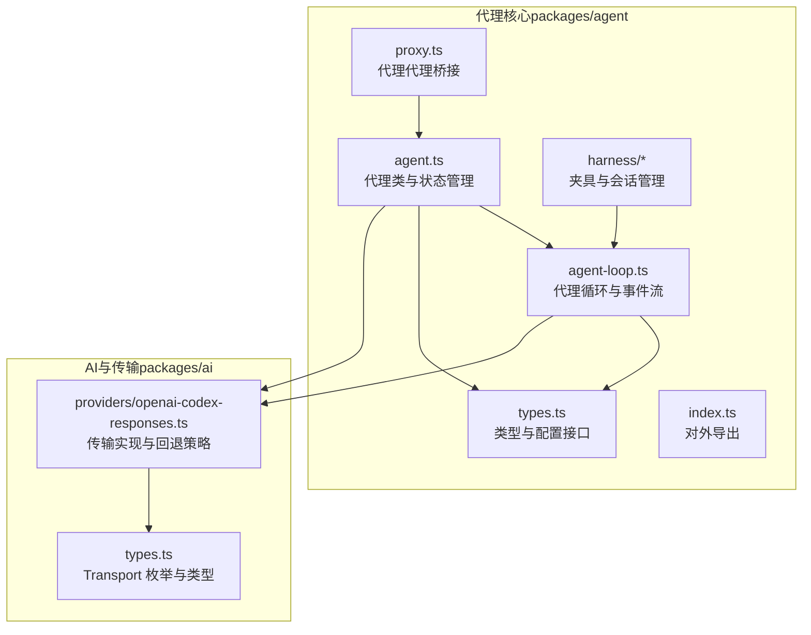
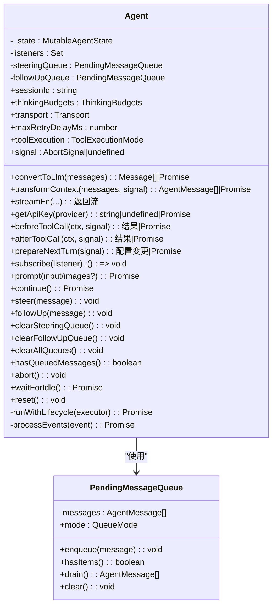
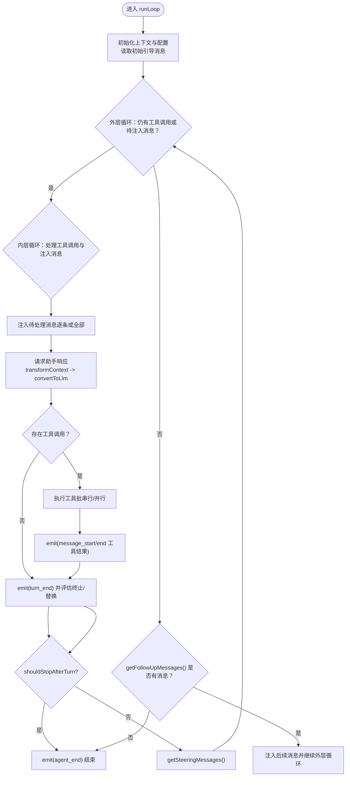
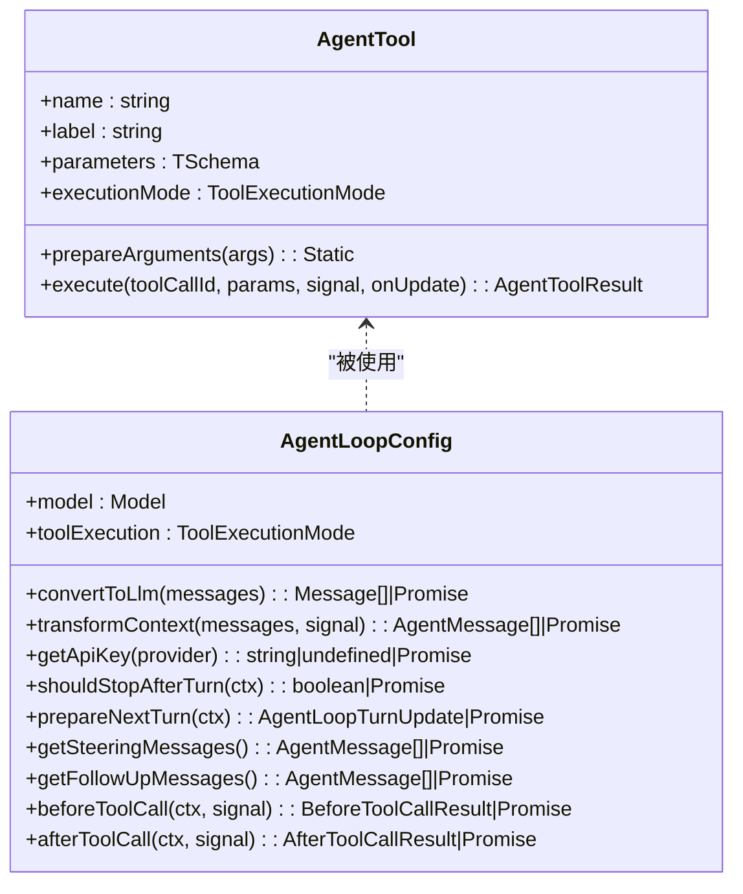
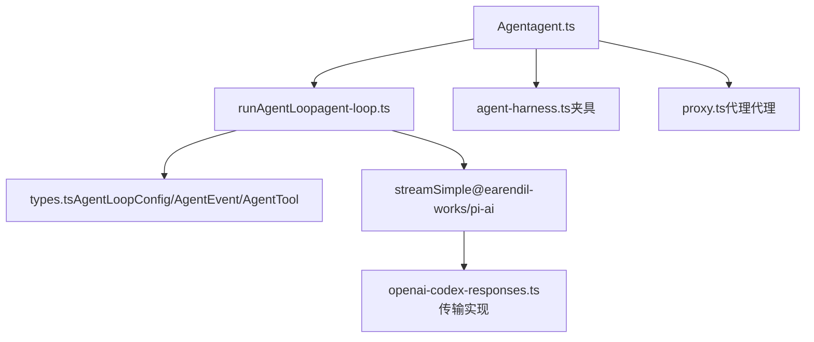

# 代理核心架构

<cite>
**本文引用的文件**   
- [packages/agent/src/agent.ts](file://packages/agent/src/agent.ts)
- [packages/agent/src/agent-loop.ts](file://packages/agent/src/agent-loop.ts)
- [packages/agent/src/types.ts](file://packages/agent/src/types.ts)
- [packages/agent/src/index.ts](file://packages/agent/src/index.ts)
- [packages/agent/test/agent-loop.test.ts](file://packages/agent/test/agent-loop.test.ts)
- [packages/agent/src/proxy.ts](file://packages/agent/src/proxy.ts)
- [packages/agent/src/harness/agent-harness.ts](file://packages/agent/src/harness/agent-harness.ts)
- [packages/agent/src/harness/types.ts](file://packages/agent/src/harness/types.ts)
- [packages/ai/src/providers/openai-codex-responses.ts](file://packages/ai/src/providers/openai-codex-responses.ts)
- [packages/ai/src/types.ts](file://packages/ai/src/types.ts)
</cite>

## 目录
1. [引言](#引言)
2. [项目结构](#项目结构)
3. [核心组件](#核心组件)
4. [架构总览](#架构总览)
5. [详细组件分析](#详细组件分析)
6. [依赖关系分析](#依赖关系分析)
7. [性能考量](#性能考量)
8. [故障排查指南](#故障排查指南)
9. [结论](#结论)
10. [附录](#附录)

## 引言
本技术文档围绕代理核心架构展开，系统性阐述代理循环机制的设计原理与实现细节，包括状态管理、消息处理、工具调用与事件驱动机制；同时解释扩展系统（工具注册、生命周期管理、依赖注入）与传输抽象（统一消息格式与协议）的设计思想，并提供代理状态机图、数据流图与组件交互示例，帮助读者从初始化到执行的完整过程。

## 项目结构
本仓库采用多包组织方式，代理核心位于 packages/agent，AI能力与传输抽象位于 packages/ai，扩展与夹具（Harness）位于 agent 包内部。核心入口导出代理类、循环函数、类型定义与夹具工具。



**图表来源**
- [packages/agent/src/agent.ts:1-558](file://packages/agent/src/agent.ts#L1-L558)
- [packages/agent/src/agent-loop.ts:1-743](file://packages/agent/src/agent-loop.ts#L1-L743)
- [packages/agent/src/types.ts:1-419](file://packages/agent/src/types.ts#L1-L419)
- [packages/agent/src/index.ts:1-45](file://packages/agent/src/index.ts#L1-L45)
- [packages/agent/src/harness/agent-harness.ts](file://packages/agent/src/harness/agent-harness.ts)
- [packages/agent/src/proxy.ts](file://packages/agent/src/proxy.ts)
- [packages/ai/src/providers/openai-codex-responses.ts](file://packages/ai/src/providers/openai-codex-responses.ts)
- [packages/ai/src/types.ts](file://packages/ai/src/types.ts)

**章节来源**
- [packages/agent/src/index.ts:1-45](file://packages/agent/src/index.ts#L1-L45)

## 核心组件
- 代理类（Agent）
  - 负责状态持有、生命周期事件订阅、消息队列（引导与后续）、运行控制（启动、继续、中止、等待空闲）、上下文快照与循环配置构建。
  - 关键职责：事件处理与状态更新、队列注入、运行生命周期封装。
- 代理循环（runAgentLoop/runAgentLoopContinue）
  - 驱动“提示-助手响应-工具调用-工具结果-回合结束-下一轮”的主循环，支持引导消息注入、后续消息延迟执行、终止条件与上下文切换。
  - 关键职责：事件发射、工具批处理（串行/并行）、上下文变换与转换。
- 类型与配置（types.ts）
  - 定义 AgentMessage、AgentTool、AgentEvent、AgentLoopConfig、ThinkingLevel、QueueMode、ToolExecutionMode 等核心类型与契约。
- 传输抽象（@earendil-works/pi-ai）
  - 提供统一的模型、消息、流式事件与传输（Transport）类型，支持 SSE/WebSocket/WebSocket-Cached/Auto 等传输选择与回退策略。

**章节来源**
- [packages/agent/src/agent.ts:166-558](file://packages/agent/src/agent.ts#L166-L558)
- [packages/agent/src/agent-loop.ts:95-269](file://packages/agent/src/agent-loop.ts#L95-L269)
- [packages/agent/src/types.ts:135-419](file://packages/agent/src/types.ts#L135-L419)
- [packages/ai/src/types.ts:76](file://packages/ai/src/types.ts#L76)

## 架构总览
代理核心以“事件驱动 + 状态机”为核心，Agent 作为高层封装器，委托底层循环函数完成一次完整的推理-工具执行周期。循环函数在每轮中负责：
- 应用上下文变换（transformContext）
- 将 AgentMessage 转换为 LLM 可理解的 Message[]
- 调用流式函数（streamFn/streamSimple）获取助手消息流
- 解析工具调用，按配置串行或并行执行
- 发射工具执行事件与工具结果消息
- 在回合结束时评估是否继续、注入引导消息或延迟后续消息

```mermaid
sequenceDiagram
participant App as "应用"
participant Agent as "Agent代理类"
participant Loop as "runAgentLoop"
participant Stream as "streamFn/streamSimple"
participant Tools as "工具集合"
App->>Agent : "prompt()/continue()"
Agent->>Agent : "runWithLifecycle() 启动运行"
Agent->>Loop : "runAgentLoop(context, config, emit)"
Loop->>Loop : "emit(agent_start)"
Loop->>Loop : "注入提示消息message_start/message_end"
Loop->>Stream : "请求助手响应transformContext -> convertToLlm"
Stream-->>Loop : "事件流start/text/toolcall/done/error"
Loop->>Agent : "emit(message_start/message_update/message_end)"
alt 存在工具调用
Loop->>Tools : "准备/执行/收尾工具调用串行/并行"
Tools-->>Loop : "工具结果"
Loop->>Agent : "emit(tool_execution_start/update/end)"
Loop->>Agent : "emit(message_start/end 工具结果)"
end
Loop->>Loop : "emit(turn_end/agent_end)"
Agent->>Agent : "processEvents() 更新状态"
Agent-->>App : "事件监听器回调完成，Agent 空闲"
```

**图表来源**
- [packages/agent/src/agent.ts:386-412](file://packages/agent/src/agent.ts#L386-L412)
- [packages/agent/src/agent-loop.ts:95-269](file://packages/agent/src/agent-loop.ts#L95-L269)
- [packages/agent/src/agent-loop.ts:275-368](file://packages/agent/src/agent-loop.ts#L275-L368)
- [packages/agent/src/agent-loop.ts:373-516](file://packages/agent/src/agent-loop.ts#L373-L516)

## 详细组件分析

### 代理类（Agent）设计与状态机
- 状态管理
  - 内部可变状态包含系统提示、模型、思考级别、工具数组、消息数组、流式状态、待执行工具集与错误信息。
  - 对外暴露只读 AgentState，确保赋值时进行浅拷贝，避免外部直接修改。
- 生命周期与事件
  - 运行开始/结束、回合开始/结束、消息开始/更新/结束、工具执行开始/更新/结束等事件通过 processEvents() 统一处理并同步更新内部状态。
  - 订阅者在 agent_end 之后仍参与结算，Agent 在所有订阅者完成后才标记为空闲。
- 消息队列与注入
  - 支持“引导队列”（steering）与“后续队列”（followUp），两种队列模式（全部注入/逐条注入）由 QueueMode 控制。
  - 在合适的轮次节点（工具执行完毕后、回合结束时）注入队列消息，保证对话连贯性。
- 运行控制
  - prompt()/continue() 分别用于新提示与续写；abort() 支持中止当前运行；waitForIdle() 等待运行与事件监听器完成。
- 循环配置构建
  - createLoopConfig() 将 Agent 的选项（如思考级别、传输、工具执行模式、API Key 获取、上下文变换、消息获取钩子等）打包为 AgentLoopConfig，传递给底层循环。



**图表来源**
- [packages/agent/src/agent.ts:166-558](file://packages/agent/src/agent.ts#L166-L558)
- [packages/agent/src/agent.ts:118-152](file://packages/agent/src/agent.ts#L118-L152)

**章节来源**
- [packages/agent/src/agent.ts:166-558](file://packages/agent/src/agent.ts#L166-L558)

### 代理循环（runAgentLoop/runAgentLoopContinue）与状态机
- 主循环逻辑
  - 外层循环：当无更多工具调用且无引导消息时，检查后续消息；若有则注入并继续。
  - 内层循环：先注入待处理消息，再请求助手响应，解析工具调用，执行工具批处理，最后发射回合结束事件。
  - 回合结束后可调用 prepareNextTurn() 进行上下文/模型/思考级别的替换。
- 事件序列
  - agent_start → turn_start → 注入消息（message_start/message_end）→ 助手消息流（message_start/message_update/message_end）→ 工具执行（tool_execution_*）→ 工具结果（message_start/message_end）→ turn_end → agent_end。
- 终止与异常
  - 当 stopReason 为 error 或 aborted 时，循环提前结束并发出 agent_end。
  - 运行失败时，Agent 会生成一条包含错误信息的助手消息并结束。



**图表来源**
- [packages/agent/src/agent-loop.ts:155-269](file://packages/agent/src/agent-loop.ts#L155-L269)

**章节来源**
- [packages/agent/src/agent-loop.ts:95-269](file://packages/agent/src/agent-loop.ts#L95-L269)

### 工具调用与批处理（串行/并行）
- 执行模式
  - 默认并行：先预检所有工具调用，然后并发执行允许的工具，按完成顺序发射 tool_execution_end，但工具结果消息按源顺序插入。
  - 串行：逐个预检、执行、收尾，严格顺序。
  - 单个工具 executionMode="sequential" 也会强制整批串行。
- 钩子与覆盖
  - beforeToolCall：可在参数验证后阻止执行或修改参数。
  - afterToolCall：可部分覆盖工具结果内容、细节、错误标志与终止提示。
- 参数准备
  - 支持 prepareArguments 对原始参数做兼容性转换，再进行 Schema 校验。

```mermaid
sequenceDiagram
participant Loop as "runAgentLoop"
participant Tool as "工具"
Loop->>Loop : "遍历工具调用"
Loop->>Loop : "prepareToolCall() 预检/参数准备/校验"
alt 允许执行
Loop->>Tool : "execute() 并支持 onUpdate 回调"
Tool-->>Loop : "部分结果onUpdate"
Loop->>Loop : "finalizeExecutedToolCall() afterToolCall 覆盖"
Loop->>Loop : "emit(tool_execution_end)"
Loop->>Loop : "emit(message_start/end 工具结果)"
else 立即失败
Loop->>Loop : "创建错误工具结果"
Loop->>Loop : "emit(tool_execution_end isError=true)"
Loop->>Loop : "emit(message_start/end 错误结果)"
end
```

**图表来源**
- [packages/agent/src/agent-loop.ts:373-516](file://packages/agent/src/agent-loop.ts#L373-L516)
- [packages/agent/src/agent-loop.ts:562-708](file://packages/agent/src/agent-loop.ts#L562-L708)

**章节来源**
- [packages/agent/src/agent-loop.ts:373-516](file://packages/agent/src/agent-loop.ts#L373-L516)
- [packages/agent/src/types.ts:28-277](file://packages/agent/src/types.ts#L28-L277)

### 传输抽象与统一消息格式
- 统一消息格式
  - AgentMessage 抽象了 LLM 原生消息与自定义消息，通过 convertToLlm 将 AgentMessage[] 转换为 LLM 可理解的 Message[]。
- 传输类型
  - Transport 支持 "sse" | "websocket" | "websocket-cached" | "auto"，底层提供自动回退策略与诊断。
- 流式协议
  - streamSimple 返回的事件流包含 start/text/toolcall/done/error 等事件，代理在循环中逐事件处理，最终聚合为完整的助手消息。


**图表来源**
- [packages/agent/src/agent-loop.ts:275-368](file://packages/agent/src/agent-loop.ts#L275-L368)
- [packages/ai/src/types.ts:76](file://packages/ai/src/types.ts#L76)
- [packages/ai/src/providers/openai-codex-responses.ts](file://packages/ai/src/providers/openai-codex-responses.ts)

**章节来源**
- [packages/agent/src/agent-loop.ts:275-368](file://packages/agent/src/agent-loop.ts#L275-L368)
- [packages/ai/src/types.ts:76](file://packages/ai/src/types.ts#L76)
- [packages/ai/src/providers/openai-codex-responses.ts](file://packages/ai/src/providers/openai-codex-responses.ts)

### 扩展系统与生命周期管理
- 工具注册
  - AgentTool 接口继承自 Tool，新增 label、prepareArguments、executionMode 等字段，支持参数准备与执行模式覆盖。
- 生命周期钩子
  - beforeToolCall/afterToolCall：在工具执行前后进行拦截与结果覆盖。
  - transformContext/convertToLlm：在进入 LLM 请求前对上下文与消息进行变换与过滤。
- 依赖注入
  - AgentOptions 中注入 streamFn、getApiKey、prepareNextTurn 等，形成可插拔的运行时配置。
- 夹具与代理代理
  - harness/agent-harness.ts 提供夹具体验与配置合并；proxy.ts 提供代理代理能力，便于桥接与扩展。



**图表来源**
- [packages/agent/src/types.ts:360-384](file://packages/agent/src/types.ts#L360-L384)
- [packages/agent/src/types.ts:135-277](file://packages/agent/src/types.ts#L135-L277)
- [packages/agent/src/harness/agent-harness.ts](file://packages/agent/src/harness/agent-harness.ts)
- [packages/agent/src/proxy.ts](file://packages/agent/src/proxy.ts)

**章节来源**
- [packages/agent/src/types.ts:360-384](file://packages/agent/src/types.ts#L360-L384)
- [packages/agent/src/types.ts:135-277](file://packages/agent/src/types.ts#L135-L277)
- [packages/agent/src/harness/agent-harness.ts](file://packages/agent/src/harness/agent-harness.ts)
- [packages/agent/src/proxy.ts](file://packages/agent/src/proxy.ts)

## 依赖关系分析
- Agent 依赖 AgentLoopConfig 与 AgentContext，通过 createLoopConfig() 构建配置并传入 runAgentLoop。
- AgentLoop 使用 streamFn（默认 streamSimple）与 @earendil-works/pi-ai 的消息/模型/事件类型。
- 传输层在 @earendil-works/pi-ai 中定义，具体实现位于 openai-codex-responses.ts，支持多种传输与回退策略。
- 测试用例验证事件序列、工具批处理顺序、上下文变换与消息注入行为。



**图表来源**
- [packages/agent/src/agent.ts:422-449](file://packages/agent/src/agent.ts#L422-L449)
- [packages/agent/src/agent-loop.ts:275-368](file://packages/agent/src/agent-loop.ts#L275-L368)
- [packages/ai/src/providers/openai-codex-responses.ts](file://packages/ai/src/providers/openai-codex-responses.ts)
- [packages/agent/src/harness/agent-harness.ts](file://packages/agent/src/harness/agent-harness.ts)
- [packages/agent/src/proxy.ts](file://packages/agent/src/proxy.ts)

**章节来源**
- [packages/agent/test/agent-loop.test.ts:1-800](file://packages/agent/test/agent-loop.test.ts#L1-L800)

## 性能考量
- 工具批处理策略
  - 并行模式可显著提升吞吐，但需注意资源竞争与顺序一致性；串行模式更安全但吞吐较低。
  - 单个工具设置为串行可避免全局阻塞，同时保持其他工具并行。
- 上下文变换与消息过滤
  - transformContext 适合做上下文裁剪与注入，减少 LLM 输入规模，提高响应速度与成本控制。
- 传输选择
  - SSE 适配广泛，WebSocket 提升实时性，WebSocket-Cached 适合长会话缓存；Auto 会在不满足条件时自动回退。
- 中止与重试
  - 使用 AbortSignal 实现快速中止；maxRetryDelayMs 限制重试等待时间，避免长时间阻塞。

[本节为通用指导，无需特定文件来源]

## 故障排查指南
- 常见问题
  - 运行中再次 prompt：Agent 会抛错提示正在处理中，请使用 steer()/followUp() 或等待完成。
  - 继续失败：若最后一条消息为 assistant，则无法继续；请注入用户或工具结果消息后再继续。
  - 继续从空上下文：会抛错提示无消息可继续。
  - 工具未找到：将产生错误工具结果并标记为错误。
  - beforeToolCall 阻止执行：返回 block=true 时将生成错误工具结果。
- 事件定位
  - 通过订阅 Agent 事件，结合 AbortSignal 判断运行状态；在 agent_end 之后确认运行完全结束。
- 传输回退
  - 若 WebSocket 不可用，底层会记录诊断并尝试 SSE 回退；可通过 transport 显式指定或 Auto 自动选择。

**章节来源**
- [packages/agent/src/agent.ts:324-365](file://packages/agent/src/agent.ts#L324-L365)
- [packages/agent/src/agent-loop.ts:64-93](file://packages/agent/src/agent-loop.ts#L64-L93)
- [packages/agent/src/agent-loop.ts:562-626](file://packages/agent/src/agent-loop.ts#L562-L626)
- [packages/ai/src/providers/openai-codex-responses.ts](file://packages/ai/src/providers/openai-codex-responses.ts)

## 结论
本架构以事件驱动与状态机为核心，通过 Agent 与 AgentLoop 的分层设计，实现了从消息注入、助手响应、工具调用到回合结束的完整闭环。统一的传输抽象与灵活的工具执行策略，使得代理既具备良好的扩展性，又能在复杂场景中保持可控的性能与稳定性。配合夹具与代理代理，进一步增强了开发体验与集成灵活性。

[本节为总结，无需特定文件来源]

## 附录
- 关键流程路径参考
  - 初始化与运行：[packages/agent/src/agent.ts:201-312](file://packages/agent/src/agent.ts#L201-L312)
  - 提示与续写：[packages/agent/src/agent.ts:324-365](file://packages/agent/src/agent.ts#L324-L365)
  - 主循环与事件发射：[packages/agent/src/agent-loop.ts:155-269](file://packages/agent/src/agent-loop.ts#L155-L269)
  - 助手响应流式处理：[packages/agent/src/agent-loop.ts:275-368](file://packages/agent/src/agent-loop.ts#L275-L368)
  - 工具批处理（串行/并行）：[packages/agent/src/agent-loop.ts:373-516](file://packages/agent/src/agent-loop.ts#L373-L516)
  - 传输与回退策略：[packages/ai/src/providers/openai-codex-responses.ts](file://packages/ai/src/providers/openai-codex-responses.ts)
  - 类型与配置契约：[packages/agent/src/types.ts:135-419](file://packages/agent/src/types.ts#L135-L419)

[本节为补充索引，无需特定文件来源]