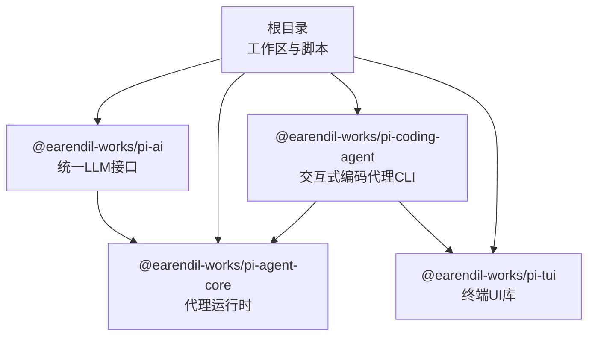
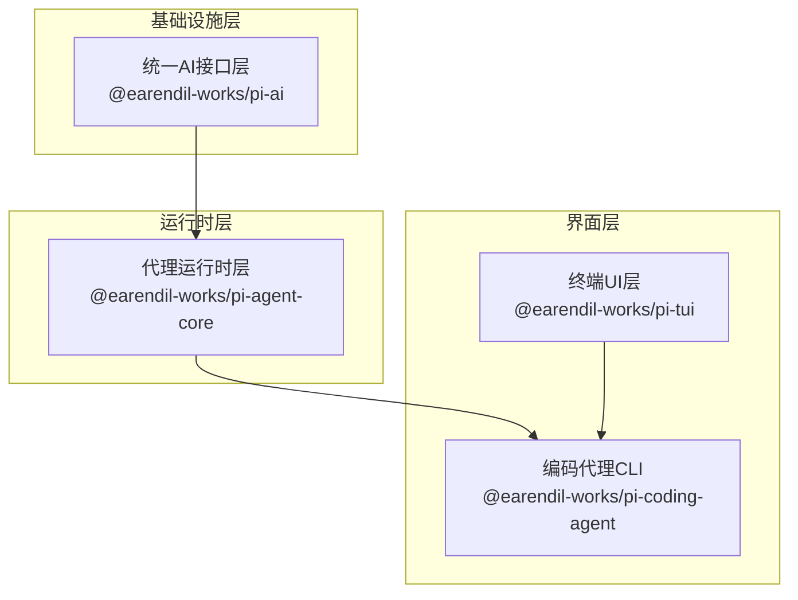
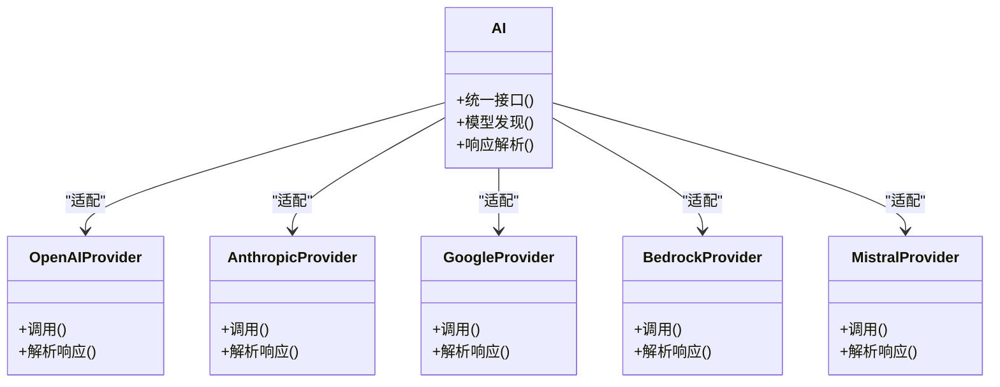
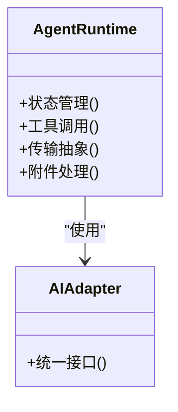
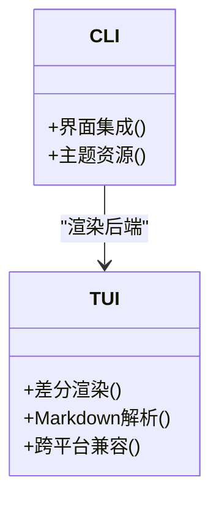
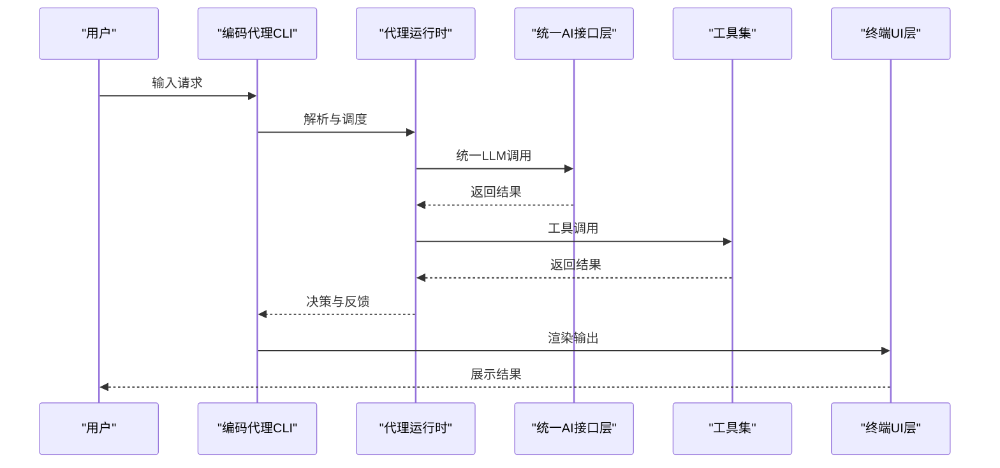
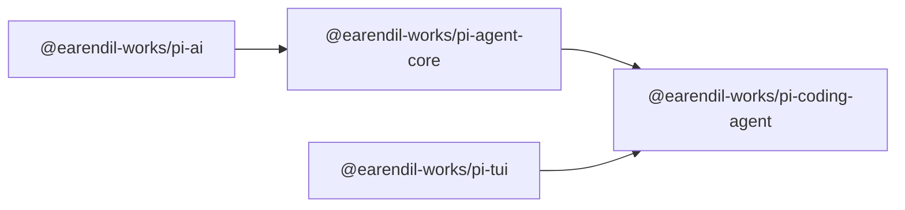

# 核心架构

<cite>
**本文引用的文件**
- [README.md](file://README.md)
- [package.json](file://package.json)
- [packages/agent/package.json](file://packages/agent/package.json)
- [packages/ai/package.json](file://packages/ai/package.json)
- [packages/coding-agent/package.json](file://packages/coding-agent/package.json)
- [packages/tui/package.json](file://packages/tui/package.json)
</cite>

## 目录
1. [引言](#引言)
2. [项目结构](#项目结构)
3. [核心组件](#核心组件)
4. [架构总览](#架构总览)
5. [详细组件分析](#详细组件分析)
6. [依赖分析](#依赖分析)
7. [性能考虑](#性能考虑)
8. [故障排除指南](#故障排除指南)
9. [结论](#结论)
10. [附录](#附录)

## 引言
本文件面向Pi项目的核心架构文档，聚焦于分层架构设计与模块化组织，明确API层、代理运行时层、终端界面层的职责与交互关系；阐述四个核心包（agent、ai、coding-agent、tui）的职责边界与依赖关系；解释统一AI接口层的设计思想与多供应商抽象策略；介绍代理循环机制、状态管理与扩展系统的架构模式，并通过系统上下文图与组件分解图展示跨组件的数据流与控制流。

## 项目结构
Pi项目采用Monorepo组织方式，根目录提供统一的脚本与配置，核心能力由四个包构成：ai（统一LLM接口）、agent（通用代理运行时）、coding-agent（交互式编码代理CLI）、tui（终端UI库）。各包通过工作区与构建脚本进行统一管理，支持独立开发、测试与发布。

图表来源
- [package.json:1-60](file://package.json#L1-L60)
- [packages/agent/package.json:1-61](file://packages/agent/package.json#L1-L61)
- [packages/ai/package.json:1-107](file://packages/ai/package.json#L1-L107)
- [packages/coding-agent/package.json:1-99](file://packages/coding-agent/package.json#L1-L99)
- [packages/tui/package.json:1-48](file://packages/tui/package.json#L1-L48)

章节来源
- [README.md:19-58](file://README.md#L19-L58)
- [package.json:1-60](file://package.json#L1-L60)

## 核心组件
- 统一AI接口层（packages/ai）
  - 职责：提供多供应商（OpenAI、Anthropic、Google、Bedrock等）统一抽象，屏蔽差异，暴露一致的调用接口与模型发现机制。
  - 关键特性：自动模型发现、供应商适配器、响应解析与错误处理。
- 代理运行时层（packages/agent）
  - 职责：提供通用代理内核，包含工具调用、状态管理、附件支持与传输抽象，作为上层应用（如编码代理）的基础运行时。
  - 关键特性：状态机驱动、工具编排、会话上下文。
- 终端界面层（packages/tui）
  - 职责：提供高效文本渲染与差分渲染能力，支撑命令行与终端交互体验。
  - 关键特性：轻量渲染、Markdown解析、跨平台终端兼容。
- 编码代理CLI（packages/coding-agent）
  - 职责：面向“读-思考-行动”的交互式编码代理，集成工具集（读取、编辑、写入、执行等），并提供会话管理与主题资源。
  - 关键特性：工具链集成、会话持久化、主题与资产打包。

章节来源
- [README.md:23-25](file://README.md#L23-L25)
- [packages/agent/package.json:1-61](file://packages/agent/package.json#L1-L61)
- [packages/ai/package.json:1-107](file://packages/ai/package.json#L1-L107)
- [packages/coding-agent/package.json:1-99](file://packages/coding-agent/package.json#L1-L99)
- [packages/tui/package.json:1-48](file://packages/tui/package.json#L1-L48)

## 架构总览
Pi的分层架构自下而上分为三层：
- 基础设施层：统一AI接口层（ai）负责多供应商抽象与模型发现。
- 运行时层：代理运行时层（agent）负责状态管理、工具调用与会话上下文。
- 界面层：终端UI层（tui）负责高效渲染；编码代理CLI（coding-agent）作为用户入口，整合工具与界面。

图表来源
- [packages/agent/package.json:31-36](file://packages/agent/package.json#L31-L36)
- [packages/coding-agent/package.json:41-59](file://packages/coding-agent/package.json#L41-L59)
- [packages/tui/package.json:1-48](file://packages/tui/package.json#L1-L48)

## 详细组件分析

### 统一AI接口层（packages/ai）
- 设计思想
  - 多供应商统一抽象：通过适配器模式封装不同供应商的SDK与响应格式，向上暴露一致的调用接口。
  - 自动模型发现：根据供应商能力与配置动态发现可用模型，减少上层耦合。
  - 响应解析与容错：对非标准或部分JSON响应进行解析与回退，提升鲁棒性。
- 供应商适配
  - OpenAI系列（completions、responses、codex-responses）
  - Anthropic（Claude）
  - Google系列（Gemini、Vertex）
  - Bedrock（AWS）
  - Mistral
- 关键依赖
  - 各供应商SDK与HTTP代理库，确保网络与认证一致性。

图表来源
- [packages/ai/package.json:13-52](file://packages/ai/package.json#L13-L52)
- [packages/ai/package.json:70-79](file://packages/ai/package.json#L70-L79)

章节来源
- [packages/ai/package.json:1-107](file://packages/ai/package.json#L1-L107)

### 代理运行时层（packages/agent）
- 设计思想
  - 传输抽象：屏蔽底层通信细节，专注于代理逻辑。
  - 工具调用：以声明式方式编排工具，支持输入输出校验与错误传播。
  - 状态管理：维护会话状态与上下文，支持增量更新与持久化。
  - 附件支持：对文件、图片等附件进行统一处理与传递。
- 与AI层的关系
  - 依赖统一AI接口层提供的统一调用能力，不直接绑定具体供应商。

图表来源
- [packages/agent/package.json:31-36](file://packages/agent/package.json#L31-L36)

章节来源
- [packages/agent/package.json:1-61](file://packages/agent/package.json#L1-L61)

### 终端UI层（packages/tui）
- 设计思想
  - 差分渲染：仅重绘变化区域，降低终端刷新开销。
  - Markdown解析：提供结构化渲染与样式支持。
  - 跨平台兼容：在不同终端环境下保持一致的显示效果。
- 与编码代理CLI的关系
  - 作为CLI的渲染后端，提供高效的文本与富文本展示。

图表来源
- [packages/tui/package.json:1-48](file://packages/tui/package.json#L1-L48)
- [packages/coding-agent/package.json:14-22](file://packages/coding-agent/package.json#L14-L22)

章节来源
- [packages/tui/package.json:1-48](file://packages/tui/package.json#L1-L48)
- [packages/coding-agent/package.json:1-99](file://packages/coding-agent/package.json#L1-L99)

### 编码代理CLI（packages/coding-agent）
- 设计思想
  - 工具链集成：内置读取、思考、行动工具（如编辑、写入、执行），形成“读-思考-行动”闭环。
  - 会话管理：记录与回放会话，支持主题与资源打包。
  - 扩展系统：通过钩子与工作区扩展，支持自定义工具与供应商。
- 控制流
  - 用户输入 → CLI解析 → 代理运行时决策 → 工具调用 → 结果回传 → UI渲染。

图表来源
- [packages/coding-agent/package.json:41-59](file://packages/coding-agent/package.json#L41-L59)
- [packages/agent/package.json:31-36](file://packages/agent/package.json#L31-L36)
- [packages/tui/package.json:1-48](file://packages/tui/package.json#L1-L48)

章节来源
- [packages/coding-agent/package.json:1-99](file://packages/coding-agent/package.json#L1-L99)

## 依赖分析
- 包间依赖关系
  - @earendil-works/pi-ai：被多个包依赖，是统一AI接口层。
  - @earendil-works/pi-agent-core：依赖@earendil-works/pi-ai，提供代理运行时能力。
  - @earendil-works/pi-coding-agent：依赖@earendil-works/pi-agent-core、@earendil-works/pi-ai、@earendil-works/pi-tui，作为CLI入口与工具集成载体。
  - @earendil-works/pi-tui：被@earendil-works/pi-coding-agent依赖，提供终端渲染。
- 构建与发布
  - 根脚本统一构建顺序：tui → ai → agent → coding-agent，确保依赖先行构建。
  - 发布前检查：类型检查、导入一致性、锁定文件与压缩包生成。

图表来源
- [package.json:12-14](file://package.json#L12-L14)
- [packages/agent/package.json:31-36](file://packages/agent/package.json#L31-L36)
- [packages/coding-agent/package.json:41-59](file://packages/coding-agent/package.json#L41-L59)
- [packages/tui/package.json:1-48](file://packages/tui/package.json#L1-L48)

章节来源
- [package.json:1-60](file://package.json#L1-L60)
- [packages/agent/package.json:1-61](file://packages/agent/package.json#L1-L61)
- [packages/ai/package.json:1-107](file://packages/ai/package.json#L1-L107)
- [packages/coding-agent/package.json:1-99](file://packages/coding-agent/package.json#L1-L99)
- [packages/tui/package.json:1-48](file://packages/tui/package.json#L1-L48)

## 性能考虑
- 统一AI接口层
  - 通过适配器与响应解析减少重复实现，提升可维护性；对非标准响应进行容错处理，避免单点失败。
- 代理运行时层
  - 使用状态管理与工具编排，减少无效调用；通过传输抽象隔离网络开销。
- 终端UI层
  - 差分渲染显著降低终端刷新成本，适合高频交互场景。
- 编码代理CLI
  - 将构建与资源打包流程前置，减少运行时IO；工具链复用与缓存可进一步优化。

## 故障排除指南
- 构建失败
  - 检查根脚本中的构建顺序是否正确，确保依赖包先于上层包构建完成。
- 类型与导入问题
  - 使用根脚本中的类型检查与相对导入检查，定位并修复不合规导入。
- 锁定文件与依赖版本
  - 严格遵循根目录的依赖固定策略，避免意外升级导致的不兼容。
- 发布与压缩包
  - 在发布前执行压缩包生成与校验，确保产物完整性与可复现性。

章节来源
- [package.json:12-14](file://package.json#L12-L14)
- [package.json:15-19](file://package.json#L15-L19)
- [package.json:18-18](file://package.json#L18-L18)
- [package.json:31-31](file://package.json#L31-L31)

## 结论
Pi项目通过清晰的分层架构与模块化设计，实现了从统一AI接口到代理运行时再到终端界面的完整链路。四个核心包职责边界明确、依赖关系简洁，既保证了扩展性，也确保了可维护性。统一AI接口层提供了多供应商抽象与模型发现能力，代理运行时层承载了状态管理与工具编排，终端UI层提供高效渲染，编码代理CLI则将上述能力整合为可用的交互式工具。该架构为后续扩展（如新供应商、新工具、新界面模式）奠定了坚实基础。

## 附录
- 开发与测试
  - 根脚本提供统一的安装、构建、检查与测试命令，建议在本地与CI中一致执行。
- 版本与发布
  - 通过版本同步脚本与发布脚本，确保多包版本一致性与发布质量。

章节来源
- [README.md:63-71](file://README.md#L63-L71)
- [package.json:12-35](file://package.json#L12-L35)