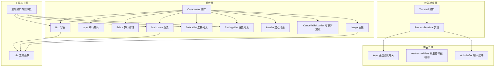
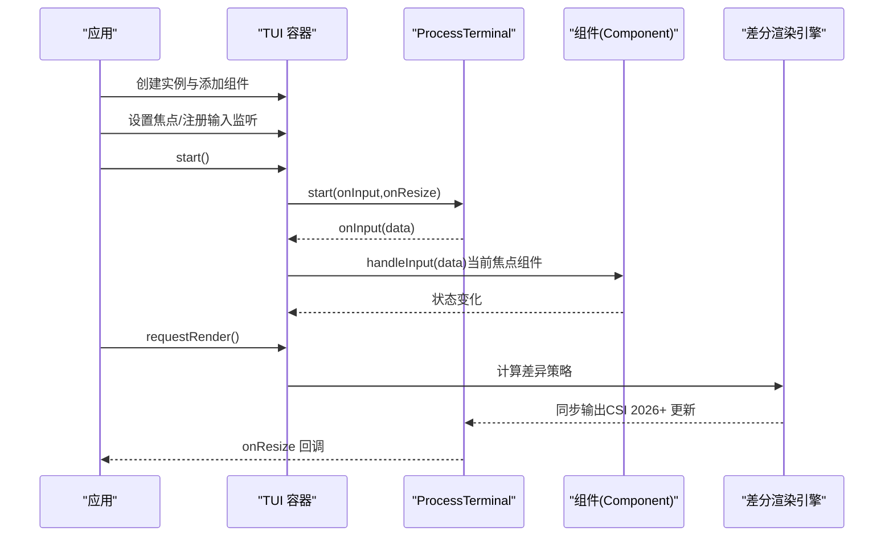
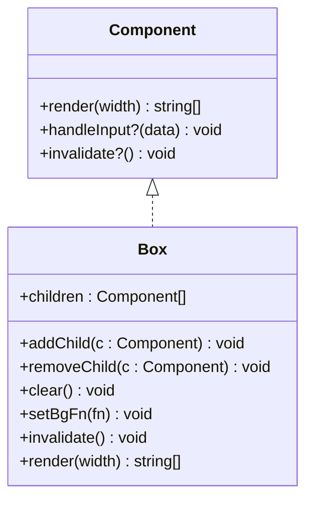
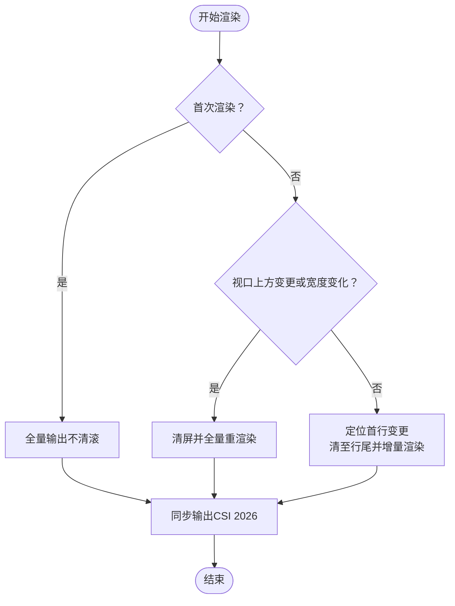
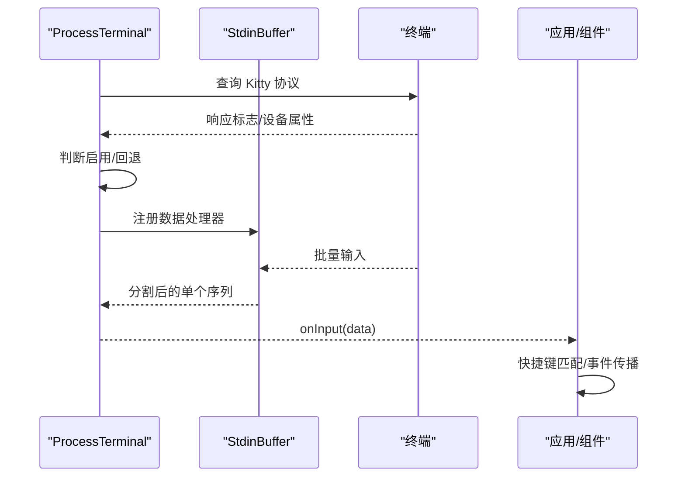
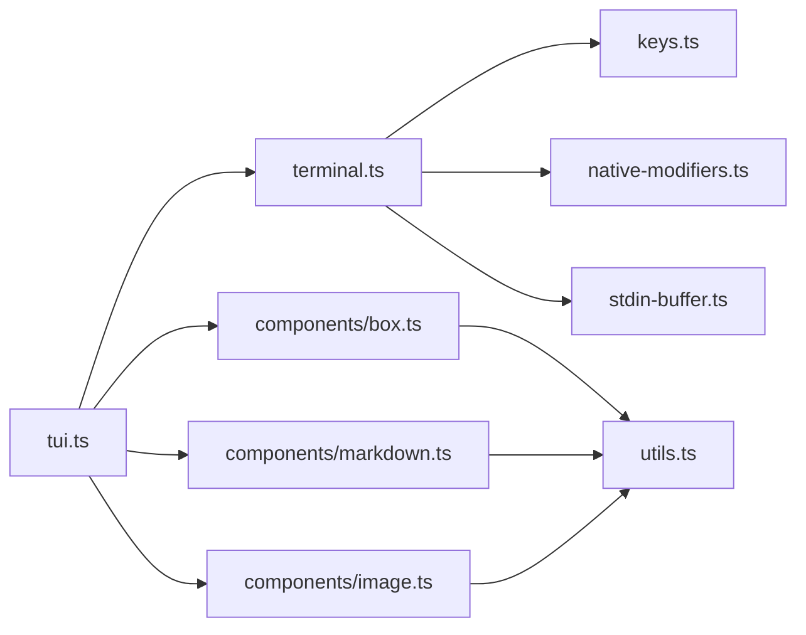

# 终端UI库架构

<cite>
**本文引用的文件**
- [README.md](file://README.md)
- [package.json](file://package.json)
- [packages/tui/README.md](file://packages/tui/README.md)
- [packages/tui/package.json](file://packages/tui/package.json)
- [packages/tui/src/terminal.ts](file://packages/tui/src/terminal.ts)
- [packages/tui/src/components/box.ts](file://packages/tui/src/components/box.ts)
- [packages/tui/src/components/input.ts](file://packages/tui/src/components/input.ts)
- [packages/tui/src/components/editor.ts](file://packages/tui/src/components/editor.ts)
- [packages/tui/src/components/markdown.ts](file://packages/tui/src/components/markdown.ts)
- [packages/tui/src/components/select-list.ts](file://packages/tui/src/components/select-list.ts)
- [packages/tui/src/components/settings-list.ts](file://packages/tui/src/components/settings-list.ts)
- [packages/tui/src/components/loader.ts](file://packages/tui/src/components/loader.ts)
- [packages/tui/src/components/cancellable-loader.ts](file://packages/tui/src/components/cancellable-loader.ts)
- [packages/tui/src/components/image.ts](file://packages/tui/src/components/image.ts)
- [packages/tui/src/autocomplete.ts](file://packages/tui/src/autocomplete.ts)
- [packages/tui/src/terminal-image.ts](file://packages/tui/src/terminal-image.ts)
- [packages/tui/src/utils.ts](file://packages/tui/src/utils.ts)
- [packages/tui/src/tui.ts](file://packages/tui/src/tui.ts)
- [packages/tui/src/keys.ts](file://packages/tui/src/keys.ts)
- [packages/tui/src/native-modifiers.ts](file://packages/tui/src/native-modifiers.ts)
- [packages/tui/src/stdin-buffer.ts](file://packages/tui/src/stdin-buffer.ts)
- [packages/tui/test/terminal.test.ts](file://packages/tui/test/terminal.test.ts)
- [packages/tui/test/virtual-terminal.ts](file://packages/tui/test/virtual-terminal.ts)
</cite>

## 目录
1. [简介](#简介)
2. [项目结构](#项目结构)
3. [核心组件](#核心组件)
4. [架构总览](#架构总览)
5. [详细组件分析](#详细组件分析)
6. [依赖关系分析](#依赖关系分析)
7. [性能考量](#性能考量)
8. [故障排查指南](#故障排查指南)
9. [结论](#结论)
10. [附录：组件开发指南与最佳实践](#附录组件开发指南与最佳实践)

## 简介
本文件面向“终端UI库（TUI）”的架构文档，聚焦于组件系统设计、属性与事件模型、差分渲染引擎、键盘输入处理、主题系统、生命周期与状态同步、性能监控以及组件开发指南。该库以“最小化、高效、可扩展”为目标，提供容器化组件、内置主题接口、差分渲染与同步输出能力，并对终端键盘协议进行协商与兼容。

## 项目结构
仓库采用多包（monorepo）组织方式，TUI库位于 packages/tui。其核心由以下层次构成：
- 终端抽象层：Terminal 接口与 ProcessTerminal 实现，负责输入/输出、尺寸、光标、标题、进度等操作，并集成 Kitty 键盘协议协商与 Windows 虚拟终端输入增强。
- 组件层：通用 Component 接口与多种内置组件（Box、Text、Input、Editor、Markdown、SelectList、SettingsList、Loader、CancellableLoader、Image 等），支持渲染缓存与失效。
- 工具与主题：ANSI 宽度计算、文本截断与换行、背景应用工具；组件主题接口与默认主题。
- 输入处理：键盘协议协商、输入缓冲拆分、粘贴模式、快捷键匹配工具。
- 测试与示例：单元测试、虚拟终端测试、示例程序。

图表来源
- [packages/tui/src/terminal.ts:53-95](file://packages/tui/src/terminal.ts#L53-L95)
- [packages/tui/src/components/box.ts:14-138](file://packages/tui/src/components/box.ts#L14-L138)
- [packages/tui/src/utils.ts](file://packages/tui/src/utils.ts)

章节来源
- [README.md:48-58](file://README.md#L48-L58)
- [packages/tui/README.md:1-15](file://packages/tui/README.md#L1-L15)

## 核心组件
- 组件接口与生命周期
  - Component 接口要求 render(width) 返回按行数组；可选 handleInput(data) 处理输入；可选 invalidate() 清除缓存。
  - 容器组件（如 Box）维护子组件列表，支持 addChild/removeChild/clear 并在变更时失效缓存。
- 内置组件
  - Box：带内边距与背景色的容器，内部子组件逐行拼接后统一应用背景。
  - Input/Editor：单行/多行输入，支持提交回调、值获取/设置、自动完成提供者、粘贴处理、水平滚动与垂直滚动。
  - Markdown：支持主题化渲染、语法高亮钩子、默认样式、渲染缓存。
  - SelectList/SettingsList：交互式选择与设置面板，支持过滤、子菜单、值循环切换。
  - Loader/CancellableLoader：带动画的加载提示，支持中止信号与回调。
  - Image：基于终端图形协议（Kitty/iTerm2）的内联图像渲染，不支持时回退文本占位。
- 主题系统
  - 各组件通过主题接口注入颜色、背景、样式函数，例如 EditorTheme、MarkdownTheme、SelectListTheme、SettingsListTheme、ImageTheme。
  - 默认主题导出供快速使用，支持动态修改背景函数或边框样式。

章节来源
- [packages/tui/README.md:137-156](file://packages/tui/README.md#L137-L156)
- [packages/tui/README.md:209-234](file://packages/tui/README.md#L209-L234)
- [packages/tui/README.md:262-327](file://packages/tui/README.md#L262-L327)
- [packages/tui/README.md:328-376](file://packages/tui/README.md#L328-L376)
- [packages/tui/README.md:413-451](file://packages/tui/README.md#L413-L451)
- [packages/tui/README.md:452-491](file://packages/tui/README.md#L452-L491)
- [packages/tui/README.md:377-412](file://packages/tui/README.md#L377-L412)
- [packages/tui/README.md:500-525](file://packages/tui/README.md#L500-L525)

## 架构总览
TUI 的运行时由 TUI 容器协调，负责：
- 组件树管理与焦点传递
- 请求渲染与差分渲染策略
- 同步输出（CSI 2026）保证原子刷新
- 全局输入监听与快捷键匹配
- 覆盖层（Overlay）系统用于对话框/菜单等非替换式渲染

图表来源
- [packages/tui/src/terminal.ts:134-168](file://packages/tui/src/terminal.ts#L134-L168)
- [packages/tui/README.md:57-69](file://packages/tui/README.md#L57-L69)
- [packages/tui/README.md:579-588](file://packages/tui/README.md#L579-L588)

## 详细组件分析

### 组件基类与属性系统
- Component 接口
  - render(width): 返回每行字符串数组，严格限制每行宽度不超过 width。
  - handleInput?(data): 当组件获得焦点时接收原始输入（含 ANSI 序列）。
  - invalidate?(): 清理缓存，强制下次渲染从头开始。
- 属性与缓存
  - 容器组件（如 Box）维护子组件列表与渲染缓存，当宽度、子行内容或背景函数采样发生变化时才重新渲染。
  - 缓存命中则直接返回缓存结果，显著降低重复渲染成本。

图表来源
- [packages/tui/README.md:137-156](file://packages/tui/README.md#L137-L156)
- [packages/tui/src/components/box.ts:14-138](file://packages/tui/src/components/box.ts#L14-L138)

章节来源
- [packages/tui/README.md:137-156](file://packages/tui/README.md#L137-L156)
- [packages/tui/src/components/box.ts:74-125](file://packages/tui/src/components/box.ts#L74-L125)

### 差分渲染引擎
- 三策略渲染
  - 首次渲染：输出全部行，不清理滚动区。
  - 视口上方变更或宽度变化：清屏并全量重渲染。
  - 正常更新：移动到首行变更处，清至行尾并渲染变更行。
- 同步输出
  - 使用 CSI 2026（Bracketed Paste 模式）包裹更新，确保原子性，避免闪烁。
- 性能要点
  - 通过缓存与差异定位减少写入量；容器组件对子行进行采样比较，命中缓存直接复用。

图表来源
- [packages/tui/README.md:579-588](file://packages/tui/README.md#L579-L588)

章节来源
- [packages/tui/README.md:579-588](file://packages/tui/README.md#L579-L588)

### 键盘输入处理系统
- 协商与启用 Kitty 键盘协议
  - 发送查询序列，等待响应；若超时则回退到 modifyOtherKeys 模式。
  - 支持标志：区分转义码、事件类型（按下/重复/释放）、替代键（Shift 等）。
- 输入缓冲与粘贴处理
  - 使用 StdinBuffer 将批量输入拆分为独立序列，确保组件收到单个事件，使快捷键匹配与按键释放检测准确。
  - 对粘贴内容包裹 bracketed paste 标记，便于编辑器处理长文本。
- Apple 终端特殊处理
  - 对 Shift+Enter 进行序列归一化，保证跨平台一致性。
- Windows 虚拟终端输入增强
  - 在 x64/arm64 上尝试启用 ENABLE_VIRTUAL_TERMINAL_INPUT，使 Modified Keys（如 Shift+Tab）正确发送 VT 序列。

图表来源
- [packages/tui/src/terminal.ts:234-253](file://packages/tui/src/terminal.ts#L234-L253)
- [packages/tui/src/terminal.ts:178-218](file://packages/tui/src/terminal.ts#L178-L218)
- [packages/tui/src/terminal.ts:337-346](file://packages/tui/src/terminal.ts#L337-L346)

章节来源
- [packages/tui/src/terminal.ts:100-168](file://packages/tui/src/terminal.ts#L100-L168)
- [packages/tui/src/terminal.ts:178-218](file://packages/tui/src/terminal.ts#L178-L218)
- [packages/tui/src/terminal.ts:234-253](file://packages/tui/src/terminal.ts#L234-L253)
- [packages/tui/src/terminal.ts:337-346](file://packages/tui/src/terminal.ts#L337-L346)
- [packages/tui/src/terminal.ts:366-394](file://packages/tui/src/terminal.ts#L366-L394)

### 主题系统与样式定制
- 主题接口
  - EditorTheme：边框颜色、下拉列表主题。
  - MarkdownTheme：标题、链接、代码块、引用、分割线、列表、强调等样式函数。
  - SelectListTheme/SettingsListTheme/ImageTheme：分别对应列表与设置面板、图像的主题函数。
- 默认主题与动态修改
  - 提供默认主题导出，组件可在运行时修改背景函数或边框样式，以适配不同场景。
- 样式工具
  - utils 中提供可见宽度计算、文本截断与换行、背景应用等工具，保障样式在换行与宽度截断时的一致性。

章节来源
- [packages/tui/README.md:288-359](file://packages/tui/README.md#L288-L359)
- [packages/tui/src/utils.ts](file://packages/tui/src/utils.ts)

### 组件生命周期管理与状态同步
- 生命周期
  - 组件通过 invalidate() 清理缓存，触发下一次 render 从头生成。
  - 容器组件在增删子组件时主动失效缓存，确保子树一致性。
- 状态同步
  - 输入焦点在组件树中传播；容器包含输入组件时需实现 Focusable 接口并同步 focused 状态，以保证 IME 候选窗位置正确。
  - TUI 在渲染输出中插入光标标记（CURSOR_MARKER），扫描并定位硬件光标位置，配合 Focusable 实现 IME 支持。

章节来源
- [packages/tui/README.md:157-182](file://packages/tui/README.md#L157-L182)
- [packages/tui/README.md:183-208](file://packages/tui/README.md#L183-L208)
- [packages/tui/src/components/box.ts:67-72](file://packages/tui/src/components/box.ts#L67-L72)

### 性能监控与调试
- 性能监控
  - 差分渲染与缓存命中率是关键指标；容器组件对子行与背景采样进行缓存校验，避免重复计算。
- 调试日志
  - 通过环境变量捕获写入 stdout 的原始 ANSI 流，便于诊断渲染与输入问题。

章节来源
- [packages/tui/README.md:773-780](file://packages/tui/README.md#L773-L780)

## 依赖关系分析
- 外部依赖
  - get-east-asian-width：用于正确计算东亚字符宽度。
  - marked：Markdown 解析。
  - @xterm/headless：测试用虚拟终端。
  - chalk：示例与测试中的颜色输出。
- 内部模块
  - terminal.ts：终端抽象与键盘协议处理。
  - components/*：组件实现与主题接口。
  - utils.ts：ANSI 宽度、截断、换行与背景应用工具。
  - keys.ts/native-modifiers.ts/stdin-buffer.ts：键盘协议、原生修饰键与输入缓冲。
  - tui.ts：TUI 容器协调组件与渲染。

图表来源
- [packages/tui/src/terminal.ts:1-10](file://packages/tui/src/terminal.ts#L1-L10)
- [packages/tui/src/components/box.ts:1-3](file://packages/tui/src/components/box.ts#L1-L3)
- [packages/tui/package.json:39-46](file://packages/tui/package.json#L39-L46)

章节来源
- [packages/tui/package.json:39-46](file://packages/tui/package.json#L39-L46)
- [packages/tui/src/terminal.ts:1-10](file://packages/tui/src/terminal.ts#L1-L10)

## 性能考量
- 渲染路径
  - 优先使用缓存；容器组件对子行与背景采样进行浅比较，命中则直接返回缓存。
  - 差分渲染仅在必要时进行全屏清空与重渲染，其余时间定位首行变更并增量输出。
- 输入路径
  - StdinBuffer 将批量输入拆分为单个序列，提升事件粒度与匹配精度，同时避免粘贴碎片化带来的解析负担。
- 文本处理
  - 可见宽度计算与截断/换行工具确保样式在换行时不丢失，避免额外的 ANSI 重开销。
- 资源释放
  - 终止时禁用 Kitty 协议、关闭 modifyOtherKeys、暂停 stdin、恢复原始 raw 模式，防止资源泄漏与父进程干扰。

## 故障排查指南
- 输入异常
  - 症状：Shift+Tab 或 Ctrl+C 不生效。
  - 排查：确认终端是否启用虚拟终端输入（Windows）、Kitty 协议是否成功协商、输入缓冲是否正确拆分。
- 光标/IME 问题
  - 症状：IME 候选窗位置错误。
  - 排查：容器内包含输入组件时需实现 Focusable 并同步 focused 状态。
- 渲染闪烁或错位
  - 症状：屏幕闪烁或更新不完整。
  - 排查：确认同步输出（CSI 2026）是否包裹更新；检查 render 输出每行宽度是否超过 width。
- 日志定位
  - 设置环境变量捕获 ANSI 流，结合输入/渲染日志定位问题。

章节来源
- [packages/tui/src/terminal.ts:396-439](file://packages/tui/src/terminal.ts#L396-L439)
- [packages/tui/src/terminal.ts:441-494](file://packages/tui/src/terminal.ts#L441-L494)
- [packages/tui/README.md:157-182](file://packages/tui/README.md#L157-L182)
- [packages/tui/README.md:613-631](file://packages/tui/README.md#L613-L631)
- [packages/tui/README.md:773-780](file://packages/tui/README.md#L773-L780)

## 结论
该终端UI库通过清晰的组件接口、完善的主题系统、高效的差分渲染与同步输出、健壮的键盘协议协商与输入缓冲机制，构建了高性能、可扩展且易用的终端界面框架。容器组件与缓存策略有效降低了渲染成本；Focusable 与 CURSOR_MARKER 保障了 IME 体验；覆盖层系统满足复杂交互需求。建议在自定义组件开发中遵循宽度约束、缓存与失效策略、主题接口约定与输入处理规范，以获得一致的性能与用户体验。

## 附录：组件开发指南与最佳实践
- 设计原则
  - 每行宽度约束：render(width) 返回的每行不得超出 width，必要时使用工具函数进行截断或换行。
  - 缓存与失效：在状态变化时调用 invalidate()，并在 render 中进行缓存校验，避免重复计算。
  - 输入处理：使用快捷键匹配工具与键盘协议协商结果，确保跨平台一致性。
- 开发步骤
  - 实现 Component 接口，提供 render 与 handleInput（如需要）。
  - 如需背景或主题化样式，参考内置主题接口，提供样式函数并在运行时可动态修改。
  - 若包含子组件，优先使用容器组件（如 Box），并正确管理子树的缓存失效。
  - 对于需要 IME 支持的输入组件，实现 Focusable 接口并同步 focused 状态。
- 最佳实践
  - 使用 utils 中的可见宽度、截断与换行工具，确保样式在换行时保持一致。
  - 在高频更新场景中，尽量减少不必要的全量重渲染，利用缓存与差分策略。
  - 对粘贴与大段输入做好处理，确保与编辑器行为一致。
  - 通过环境变量开启调试日志，辅助定位渲染与输入问题。

章节来源
- [packages/tui/README.md:632-746](file://packages/tui/README.md#L632-L746)
- [packages/tui/README.md:613-631](file://packages/tui/README.md#L613-L631)
- [packages/tui/README.md:157-182](file://packages/tui/README.md#L157-L182)
- [packages/tui/README.md:579-588](file://packages/tui/README.md#L579-L588)