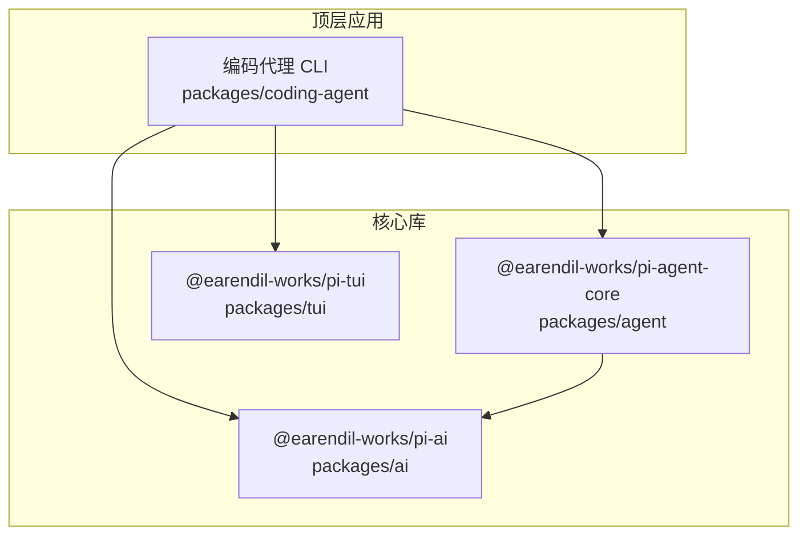
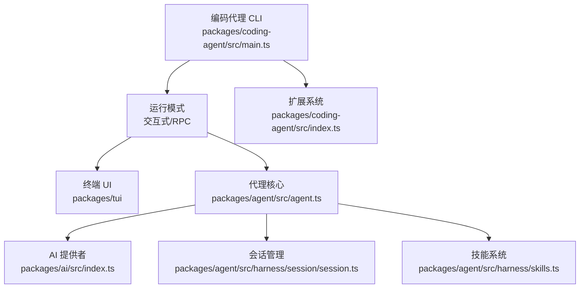
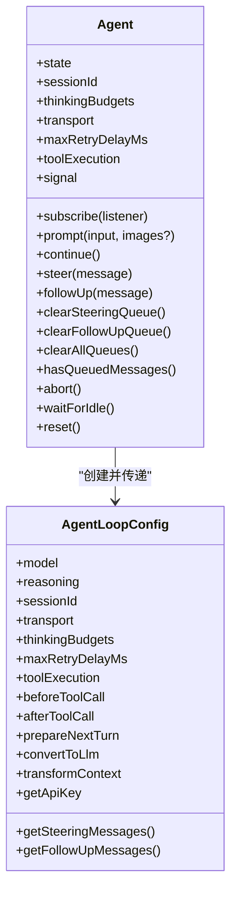
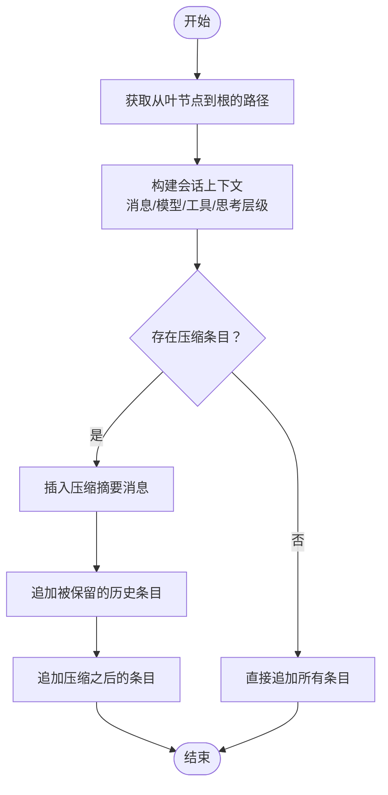
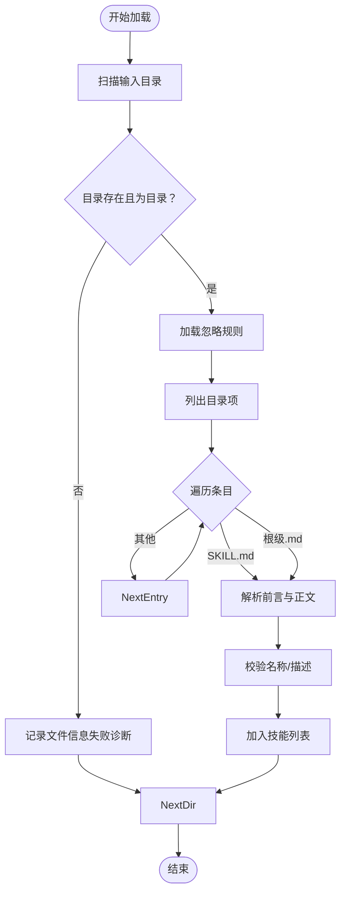
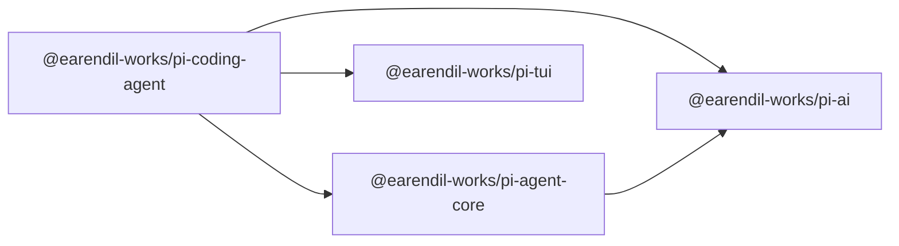

# 编码代理架构

<cite>
**本文引用的文件**
- [README.md](file://README.md)
- [package.json](file://package.json)
- [AGENTS.md](file://AGENTS.md)
- [packages/agent/src/agent.ts](file://packages/agent/src/agent.ts)
- [packages/agent/src/harness/session/session.ts](file://packages/agent/src/harness/session/session.ts)
- [packages/agent/src/harness/skills.ts](file://packages/agent/src/harness/skills.ts)
- [packages/ai/src/index.ts](file://packages/ai/src/index.ts)
- [packages/coding-agent/src/index.ts](file://packages/coding-agent/src/index.ts)
</cite>

## 目录
1. [引言](#引言)
2. [项目结构](#项目结构)
3. [核心组件](#核心组件)
4. [架构总览](#架构总览)
5. [详细组件分析](#详细组件分析)
6. [依赖关系分析](#依赖关系分析)
7. [性能考量](#性能考量)
8. [故障排查指南](#故障排查指南)
9. [结论](#结论)
10. [附录](#附录)

## 引言
本文件面向“编码代理”（Coding Agent）顶层应用，系统性梳理其架构设计与实现要点，重点覆盖以下方面：
- 顶层应用如何整合“代理核心”“AI 提供者”“终端 UI”三大组件
- CLI 接口设计、交互式模式与 RPC 模式的实现差异
- 会话管理系统：会话持久化、状态恢复、多会话并发处理
- 工具系统：内置工具、外部工具集成与工具链管理
- 设置管理、技能系统与扩展机制
- 启动流程、配置加载与运行时管理的完整架构图

## 项目结构
仓库采用 monorepo 结构，顶层通过工作区脚本统一构建与校验；四个核心包分别承担不同职责：
- @earendil-works/pi-ai：统一多提供商 LLM API（OpenAI、Anthropic、Google 等）
- @earendil-works/pi-agent-core：带工具调用与状态管理的通用代理运行时
- @earendil-works/pi-tui：终端 UI 库，支持高效文本渲染
- @earendil-works/pi-coding-agent：交互式编码代理 CLI，整合上述能力

图表来源
- [README.md:48-58](file://README.md#L48-L58)
- [package.json:5-11](file://package.json#L5-L11)

章节来源
- [README.md:19-58](file://README.md#L19-L58)
- [package.json:1-60](file://package.json#L1-L60)

## 核心组件
本节聚焦顶层应用如何组织三大核心模块，并给出它们之间的协作关系。

- 代理核心（Agent Core）
  - 职责：封装状态机、事件流、工具调用执行、消息队列与生命周期管理
  - 关键点：对外暴露 Agent 类，提供 prompt/continue/steer/followUp 等 API；内部通过低层循环驱动模型推理与工具执行
- AI 提供者（AI Provider）
  - 职责：统一多提供商 LLM API，抽象流式输出、模型注册、认证与会话资源
  - 关键点：导出模型注册、流式接口、OAuth、图片模型等能力
- 终端 UI（TUI）
  - 职责：提供高效文本渲染、主题与组件体系，支撑交互式界面
  - 关键点：与编码代理 CLI 的交互模式紧密耦合

章节来源
- [packages/agent/src/agent.ts:166-558](file://packages/agent/src/agent.ts#L166-L558)
- [packages/ai/src/index.ts:1-48](file://packages/ai/src/index.ts#L1-48)
- [packages/coding-agent/src/index.ts:282-298](file://packages/coding-agent/src/index.ts#L282-L298)

## 架构总览
顶层应用“编码代理 CLI”以“代理核心 + AI 提供者 + 终端 UI”的组合形态运行。其典型交互路径如下：
- CLI 解析命令行参数与配置
- 初始化 Agent 实例，注入工具集、模型与回调钩子
- 在交互模式下，通过 TUI 渲染界面，接收用户输入并驱动 Agent 执行
- 在 RPC 模式下，监听外部请求，按协议返回结果
- 通过会话存储与压缩机制，实现上下文管理与状态持久化

图表来源
- [packages/coding-agent/src/index.ts:282-298](file://packages/coding-agent/src/index.ts#L282-L298)
- [packages/agent/src/agent.ts:166-558](file://packages/agent/src/agent.ts#L166-L558)
- [packages/agent/src/harness/session/session.ts:82-267](file://packages/agent/src/harness/session/session.ts#L82-L267)
- [packages/agent/src/harness/skills.ts:49-75](file://packages/agent/src/harness/skills.ts#L49-L75)
- [packages/ai/src/index.ts:1-48](file://packages/ai/src/index.ts#L1-L48)

## 详细组件分析

### 代理核心（Agent）类
- 设计要点
  - 状态封装：维护系统提示、模型、消息列表、工具集、流式状态与待执行工具集合
  - 生命周期：runWithLifecycle 包裹一次完整的推理回合，处理事件分发与收尾
  - 队列控制：支持“引导消息”与“后续消息”的排队策略，便于动态干预
  - 错误处理：在失败时构造错误消息并触发事件，保证 UI 可见性
- 关键方法与事件
  - prompt/continue：发起或继续一次对话回合
  - steer/followUp：向队列中注入消息，影响后续回合
  - subscribe：订阅生命周期事件，如 message_start/message_end/tool_execution_* 等
- 并发与中断
  - 使用 AbortController 控制当前回合，支持 abort/waitForIdle
  - 队列模式（QueueMode）支持“单条/全部”两种出队策略

图表来源
- [packages/agent/src/agent.ts:166-558](file://packages/agent/src/agent.ts#L166-L558)

章节来源
- [packages/agent/src/agent.ts:166-558](file://packages/agent/src/agent.ts#L166-L558)

### 会话管理系统
- 会话树与上下文构建
  - 通过 Session 存储分支节点、消息、模型变更、思考层级变更、压缩摘要等
  - buildSessionContext 将路径上的条目还原为可被代理使用的上下文（含消息、模型、工具集、思考层级）
- 会话操作
  - 追加消息、模型切换、工具集变更、压缩摘要、标签、分支摘要等
  - 支持移动到指定节点并自动生成分支摘要
- 多会话并发
  - 通过独立的 SessionStorage 实例隔离不同会话
  - 会话树结构允许并行分支与合并，结合压缩机制控制上下文长度

图表来源
- [packages/agent/src/harness/session/session.ts:22-80](file://packages/agent/src/harness/session/session.ts#L22-L80)

章节来源
- [packages/agent/src/harness/session/session.ts:82-267](file://packages/agent/src/harness/session/session.ts#L82-L267)

### 技能系统
- 加载策略
  - 支持从一个或多个目录递归加载技能，识别 SKILL.md 与根级 .md 文件
  - 忽略规则：尊重 .gitignore/.ignore/.fdignore，支持通配与取反
  - 前言元数据：使用 YAML frontmatter，限制名称与描述长度与格式
- 输出
  - 返回技能数组与诊断信息（仅警告），便于上层展示与审计
- 用途
  - 将技能内容注入系统提示，指导模型行为；也可用于扩展工具链的上下文

图表来源
- [packages/agent/src/harness/skills.ts:49-75](file://packages/agent/src/harness/skills.ts#L49-L75)
- [packages/agent/src/harness/skills.ts:233-279](file://packages/agent/src/harness/skills.ts#L233-L279)

章节来源
- [packages/agent/src/harness/skills.ts:49-376](file://packages/agent/src/harness/skills.ts#L49-L376)

### 工具系统与扩展机制
- 工具定义与工厂
  - 提供多种工具工厂函数（读取、编辑、查找、Grep、Ls、Bash 等），支持默认最大字节数与行数限制
  - 工具输入/输出类型明确，便于统一处理与 UI 展示
- 扩展系统
  - 定义 Extension、ExtensionRuntime、ExtensionAPI 等类型，支持命令、工具、UI 组件与快捷键注册
  - 提供 discoverAndLoadExtensions、createExtensionRuntime 等运行时入口
- 事件总线与会话事件
  - EventBus 支持扩展间通信
  - 会话事件（如 before-fork/switch/tree/compact 等）贯穿生命周期

章节来源
- [packages/coding-agent/src/index.ts:232-281](file://packages/coding-agent/src/index.ts#L232-L281)
- [packages/coding-agent/src/index.ts:51-147](file://packages/coding-agent/src/index.ts#L51-L147)
- [packages/coding-agent/src/index.ts:49-49](file://packages/coding-agent/src/index.ts#L49-L49)

### 设置管理
- 设置项
  - 包括上下文压缩设置、图像处理设置、重试策略等
- 作用
  - 影响上下文长度、图像尺寸与网络重试行为，从而平衡性能与质量

章节来源
- [packages/coding-agent/src/index.ts:219-220](file://packages/coding-agent/src/index.ts#L219-L220)

### CLI 接口设计、交互式模式与 RPC 模式
- CLI 入口
  - 导出 main 函数与运行模式枚举（交互式/RPC/打印模式）
- 交互式模式
  - 通过 TUI 渲染界面，支持键盘绑定、消息渲染、工具执行反馈
- RPC 模式
  - 通过 RpcClient 与服务端通信，支持命令订阅与会话状态查询
- 差异对比
  - 交互式模式强调实时渲染与用户反馈；RPC 模式强调协议一致性与远端控制

章节来源
- [packages/coding-agent/src/index.ts:282-298](file://packages/coding-agent/src/index.ts#L282-L298)

## 依赖关系分析
- 包导出与版本
  - 编码代理 CLI 依赖代理核心、AI 提供者与 TUI
  - 代理核心进一步依赖 AI 提供者
- 导出清单
  - 编码代理导出：会话、设置、工具、扩展、运行模式、SDK 等
  - AI 提供者导出：模型注册、流式接口、OAuth、图片模型等

图表来源
- [packages/coding-agent/src/index.ts:1-200](file://packages/coding-agent/src/index.ts#L1-L200)
- [packages/agent/src/agent.ts:1-120](file://packages/agent/src/agent.ts#L1-L120)
- [packages/ai/src/index.ts:1-48](file://packages/ai/src/index.ts#L1-L48)

章节来源
- [packages/coding-agent/src/index.ts:1-200](file://packages/coding-agent/src/index.ts#L1-L200)
- [packages/agent/src/agent.ts:1-120](file://packages/agent/src/agent.ts#L1-L120)
- [packages/ai/src/index.ts:1-48](file://packages/ai/src/index.ts#L1-L48)

## 性能考量
- 上下文压缩
  - 通过压缩摘要与截断策略控制上下文长度，降低 token 消耗与延迟
- 流式输出
  - 代理核心与 AI 提供者均支持流式回调，提升交互响应速度
- 工具执行
  - 工具执行模式可选并行，提高吞吐；同时注意并发写入的锁与冲突
- 图像处理
  - 图像缩放与渲染在二进制资产中提供，避免重复计算

## 故障排查指南
- 常见问题定位
  - 代理正在运行中仍尝试 prompt：检查 activeRun 状态与 waitForIdle
  - 继续对话时报错“不能从 assistant 继续”：确认最后一条消息角色是否为 user 或 tool_result
  - 会话移动失败：检查目标条目是否存在，抛出 not_found 错误
  - 技能加载失败：查看诊断信息（文件信息失败/读取失败/解析失败/无效元数据）
- 建议步骤
  - 使用 abort 中断当前回合，reset 清空状态后重试
  - 检查 sessionId 与传输层配置，确保缓存与会话一致性
  - 对于工具执行异常，查看 beforeToolCall/afterToolCall 回调日志

章节来源
- [packages/agent/src/agent.ts:324-365](file://packages/agent/src/agent.ts#L324-L365)
- [packages/agent/src/harness/session/session.ts:246-265](file://packages/agent/src/harness/session/session.ts#L246-L265)
- [packages/agent/src/harness/skills.ts:11-28](file://packages/agent/src/harness/skills.ts#L11-L28)

## 结论
编码代理通过“代理核心 + AI 提供者 + 终端 UI”的分层架构，实现了可扩展、可观测、可压缩的智能体运行时。其会话管理与技能系统为复杂任务提供了稳定的上下文与知识注入通道；工具与扩展机制则保证了在真实工程场景中的可用性与可演进性。CLI 的交互式与 RPC 模式满足从本地开发到远程集成的不同需求。

## 附录
- 开发与发布规范
  - 锁定依赖版本、生成 shrinkwrap、本地 smoke 测试与 CI 审核
- 用户 override 规则
  - 当用户指令与规则冲突时，需显式确认后方可覆盖

章节来源
- [AGENTS.md:103-160](file://AGENTS.md#L103-L160)