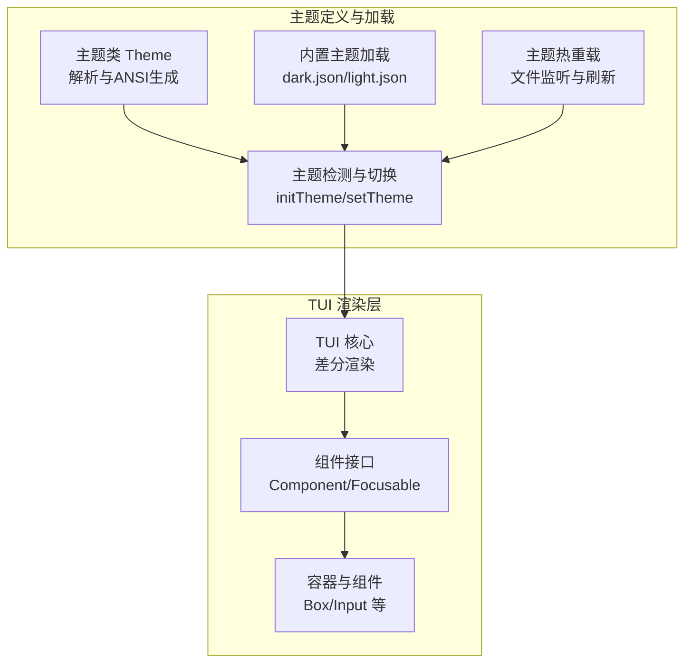
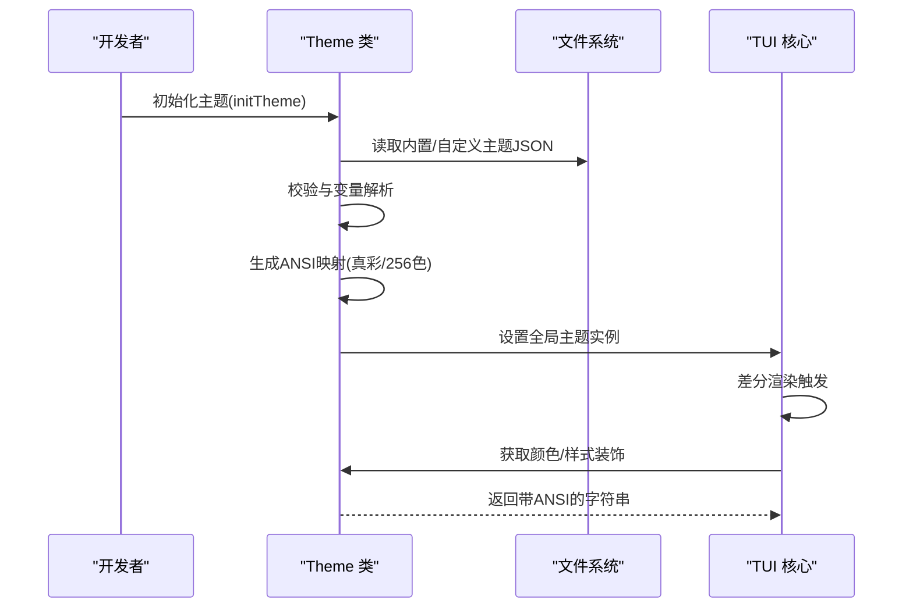
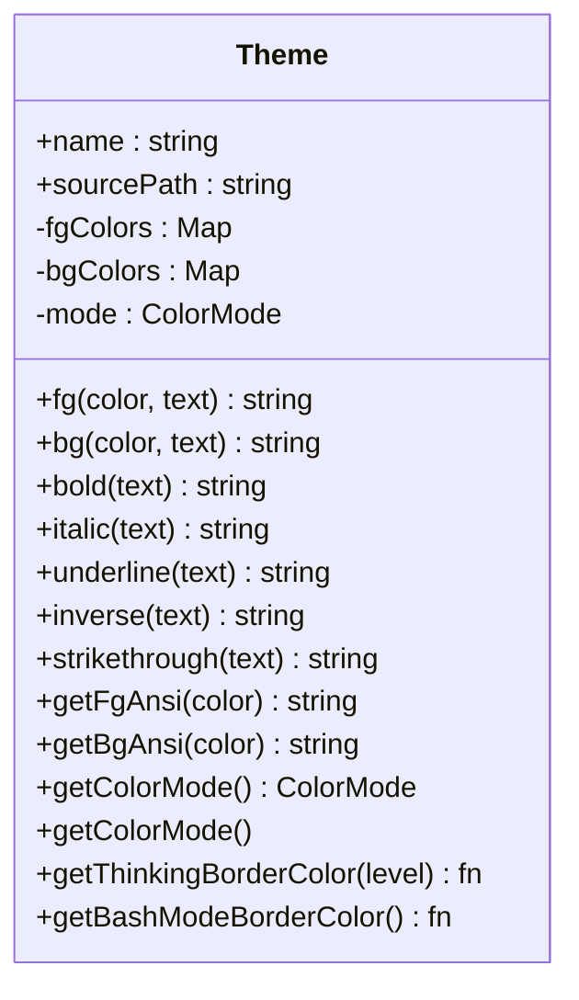
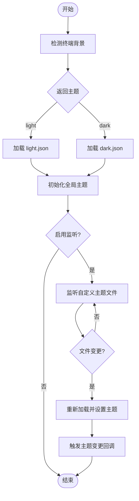
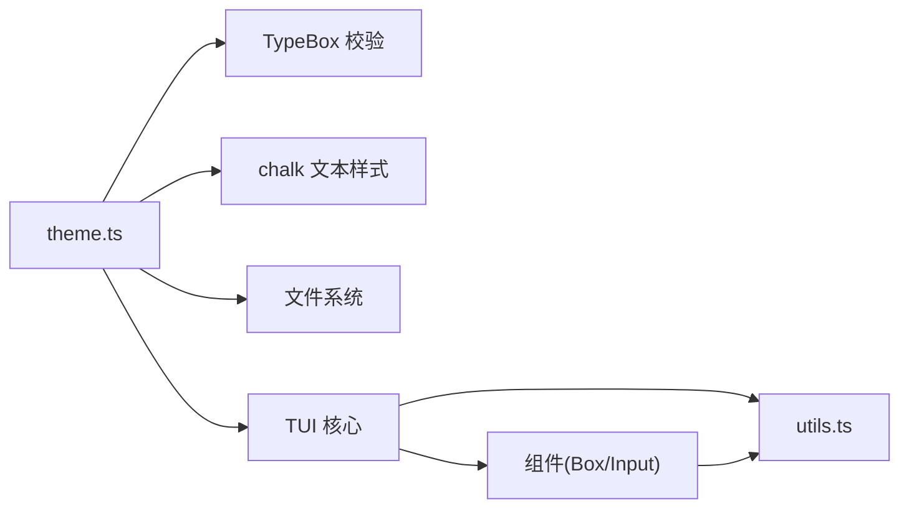

# 主题系统

<cite>
**本文引用的文件**
- [主题定义与加载（theme.ts）](file://packages/coding-agent/src/modes/interactive/theme/theme.ts)
- [内置主题（dark.json）](file://packages/coding-agent/src/modes/interactive/theme/dark.json)
- [内置主题（light.json）](file://packages/coding-agent/src/modes/interactive/theme/light.json)
- [主题格式规范（themes.md）](file://packages/coding-agent/docs/themes.md)
- [TUI 核心接口（tui.ts）](file://packages/tui/src/tui.ts)
- [Box 容器组件（box.ts）](file://packages/tui/src/components/box.ts)
- [输入框组件（input.ts）](file://packages/tui/src/components/input.ts)
- [测试主题（test-themes.ts）](file://packages/tui/test/test-themes.ts)
- [工具函数（utils.ts）](file://packages/tui/src/utils.ts)
</cite>

## 目录
1. [简介](#简介)
2. [项目结构](#项目结构)
3. [核心组件](#核心组件)
4. [架构总览](#架构总览)
5. [详细组件分析](#详细组件分析)
6. [依赖关系分析](#依赖关系分析)
7. [性能考量](#性能考量)
8. [故障排查指南](#故障排查指南)
9. [结论](#结论)
10. [附录](#附录)

## 简介
本文件系统化阐述 Pi 终端 UI 库的主题系统，涵盖设计理念、样式继承与变量系统、动态切换机制、默认主题结构、自定义主题创建方法、颜色方案与字体样式配置、组件样式覆盖规则、跨终端兼容性与降级策略，以及主题开发最佳实践（可访问性、性能优化与维护指南）。目标是帮助开发者快速理解并高效构建高质量的终端主题。

## 项目结构
主题系统由“主题定义与加载”“内置主题”“TUI 渲染层”三部分组成：
- 主题定义与加载：负责解析主题 JSON、变量解析与解析、ANSI 颜色生成、主题检测与切换、热重载与导出。
- 内置主题：提供深色与浅色两套默认主题，作为所有自定义主题的基础参考。
- TUI 渲染层：通过全局主题实例为组件提供颜色与样式能力，支持差分渲染与覆盖叠加。

图表来源
- [主题定义与加载（theme.ts）:322-421](file://packages/coding-agent/src/modes/interactive/theme/theme.ts#L322-L421)
- [TUI 核心接口（tui.ts）:39-63](file://packages/tui/src/tui.ts#L39-L63)
- [Box 容器组件（box.ts）:14-138](file://packages/tui/src/components/box.ts#L14-L138)
- [内置主题（dark.json）:1-87](file://packages/coding-agent/src/modes/interactive/theme/dark.json#L1-L87)
- [内置主题（light.json）:1-86](file://packages/coding-agent/src/modes/interactive/theme/light.json#L1-L86)

章节来源
- [主题定义与加载（theme.ts）:427-478](file://packages/coding-agent/src/modes/interactive/theme/theme.ts#L427-L478)
- [主题格式规范（themes.md）:17-296](file://packages/coding-agent/docs/themes.md#L17-L296)

## 核心组件
- 主题类 Theme：封装前景/背景色映射、ANSI 生成、文本样式修饰（加粗、斜体等）、思考级别边框与 Bash 模式边框获取。
- 主题检测与切换：自动检测终端背景、默认主题选择、初始化与动态切换、回调通知、热重载。
- 内置主题：dark.json 与 light.json 提供完整颜色令牌集合，作为自定义主题的参考模板。
- TUI 全局主题代理：通过全局符号共享主题实例，确保多模块加载场景下一致性。
- 组件样式接入：TUI 组件通过 Theme 实例应用颜色与样式，实现统一风格。

章节来源
- [主题定义与加载（theme.ts）:322-421](file://packages/coding-agent/src/modes/interactive/theme/theme.ts#L322-L421)
- [主题定义与加载（theme.ts）:744-760](file://packages/coding-agent/src/modes/interactive/theme/theme.ts#L744-L760)
- [内置主题（dark.json）:1-87](file://packages/coding-agent/src/modes/interactive/theme/dark.json#L1-L87)
- [内置主题（light.json）:1-86](file://packages/coding-agent/src/modes/interactive/theme/light.json#L1-L86)
- [TUI 核心接口（tui.ts）:39-63](file://packages/tui/src/tui.ts#L39-L63)

## 架构总览
主题系统采用“声明式 JSON + 运行时解析 + ANSI 生成”的三层架构：
- 声明层：主题 JSON 定义颜色令牌与变量，遵循严格模式校验。
- 解析层：TypeBox 校验 + 变量解析（支持循环引用检测）+ 颜色值归一化（十六进制/256 调色板/变量/默认）。
- 执行层：根据终端能力（真彩/256 色）生成对应 ANSI 序列，提供给 TUI 组件使用。

图表来源
- [主题定义与加载（theme.ts）:777-791](file://packages/coding-agent/src/modes/interactive/theme/theme.ts#L777-L791)
- [主题定义与加载（theme.ts）:576-600](file://packages/coding-agent/src/modes/interactive/theme/theme.ts#L576-L600)
- [TUI 核心接口（tui.ts）:495-542](file://packages/tui/src/tui.ts#L495-L542)

## 详细组件分析

### 主题类与变量系统
- 颜色值类型：支持十六进制、256 调色板索引、变量引用、默认终端色。
- 变量解析：递归解析变量引用，检测循环引用并报错；支持嵌套变量。
- ANSI 生成：根据终端能力选择真彩或 256 色路径；提供前景/背景 ANSI 生成器。
- 文本样式：提供加粗、斜体、下划线、反显、删除线等修饰方法。
- 思考级别与 Bash 模式：按等级映射到专用颜色，便于可视化区分思维深度与模式状态。

图表来源
- [主题定义与加载（theme.ts）:322-421](file://packages/coding-agent/src/modes/interactive/theme/theme.ts#L322-L421)

章节来源
- [主题定义与加载（theme.ts）:22-104](file://packages/coding-agent/src/modes/interactive/theme/theme.ts#L22-L104)
- [主题定义与加载（theme.ts）:289-316](file://packages/coding-agent/src/modes/interactive/theme/theme.ts#L289-L316)
- [主题定义与加载（theme.ts）:259-287](file://packages/coding-agent/src/modes/interactive/theme/theme.ts#L259-L287)

### 主题检测与动态切换
- 终端背景检测：优先解析 COLORFGBG 环境变量，其次回退到深/浅主题；支持 OSC 11 背景色解析。
- 默认主题：基于检测结果返回 dark 或 light。
- 动态切换：setTheme 支持错误回退至深色主题；onThemeChange 回调用于 UI 无效化与重新渲染。
- 热重载：仅对自定义主题文件进行监听，变更后重新加载并更新全局主题实例。

图表来源
- [主题定义与加载（theme.ts）:714-737](file://packages/coding-agent/src/modes/interactive/theme/theme.ts#L714-L737)
- [主题定义与加载（theme.ts）:777-827](file://packages/coding-agent/src/modes/interactive/theme/theme.ts#L777-L827)
- [主题定义与加载（theme.ts）:829-909](file://packages/coding-agent/src/modes/interactive/theme/theme.ts#L829-L909)

章节来源
- [主题定义与加载（theme.ts）:625-737](file://packages/coding-agent/src/modes/interactive/theme/theme.ts#L625-L737)
- [主题定义与加载（theme.ts）:777-827](file://packages/coding-agent/src/modes/interactive/theme/theme.ts#L777-L827)
- [主题定义与加载（theme.ts）:829-909](file://packages/coding-agent/src/modes/interactive/theme/theme.ts#L829-L909)

### 默认主题结构与自定义主题创建
- 默认主题：dark.json 与 light.json 提供完整的 51 个颜色令牌，覆盖核心 UI、背景内容、Markdown、工具差异、语法高亮、思考级别与 Bash 模式。
- 自定义主题：建议先在 vars 中定义基础调色板，再通过变量引用统一风格；使用 $schema 字段获得编辑器校验与补全。
- 位置与发现：内置主题、全局目录、项目目录、包内 themes 目录、设置项与 CLI 参数均可指定主题来源。
- 热重载：编辑当前激活的自定义主题文件即可即时生效。

章节来源
- [内置主题（dark.json）:1-87](file://packages/coding-agent/src/modes/interactive/theme/dark.json#L1-L87)
- [内置主题（light.json）:1-86](file://packages/coding-agent/src/modes/interactive/theme/light.json#L1-L86)
- [主题格式规范（themes.md）:17-120](file://packages/coding-agent/docs/themes.md#L17-L120)

### 颜色方案与字体样式配置
- 颜色令牌：核心 UI（accent/border/muted/text 等）、背景内容（selectedBg/userMessageBg/tool*Bg 等）、Markdown（mdHeading/mdLink/mdCodeBlock 等）、工具差异（toolDiffAdded/Removed/Context）、语法高亮（syntax*）、思考级别（thinkingOff/.../Xhigh）、Bash 模式（bashMode）。
- 字体样式：通过 Theme.bold/italic/underline/inverse/strikethrough 提供文本修饰；Markdown 主题亦暴露相应方法。
- 导出颜色：支持从主题 JSON 的 export 段提取页面/卡片/信息背景色，用于 HTML 导出。

章节来源
- [主题定义与加载（theme.ts）:106-151](file://packages/coding-agent/src/modes/interactive/theme/theme.ts#L106-L151)
- [主题定义与加载（theme.ts）:1173-1210](file://packages/coding-agent/src/modes/interactive/theme/theme.ts#L1173-L1210)
- [主题格式规范（themes.md）:146-251](file://packages/coding-agent/docs/themes.md#L146-L251)

### 组件样式覆盖规则
- 统一入口：TUI 组件通过全局主题实例获取颜色与样式，避免在组件内部硬编码颜色。
- 容器与布局：Box 组件支持背景函数与内边距，背景函数可结合主题色生成一致的视觉效果。
- 输入组件：Input 组件通过光标标记与反转显示光标，配合主题色实现一致的焦点与输入体验。
- 差分渲染：TUI 核心在渲染时对比上一次输出，仅重绘变化区域，减少重绘成本。

章节来源
- [Box 容器组件（box.ts）:14-138](file://packages/tui/src/components/box.ts#L14-L138)
- [输入框组件（input.ts）:19-448](file://packages/tui/src/components/input.ts#L19-L448)
- [TUI 核心接口（tui.ts）:39-63](file://packages/tui/src/tui.ts#L39-L63)
- [TUI 核心接口（tui.ts）:495-542](file://packages/tui/src/tui.ts#L495-L542)

### 跨终端兼容性与降级策略
- 真彩与 256 色：优先使用真彩（RGB），在不支持的终端自动降级到最接近的 256 调色板索引；灰度通道与彩色通道分别计算距离，避免饱和度过低时误用灰阶。
- 终端背景检测：通过 COLORFGBG 或 OSC 11 背景解析判断深/浅主题，若不可用则回退到深色主题。
- 组件适配：TUI 差分渲染与 ANSI 状态跟踪保证在不同终端上的稳定表现。

章节来源
- [主题定义与加载（theme.ts）:221-257](file://packages/coding-agent/src/modes/interactive/theme/theme.ts#L221-L257)
- [主题定义与加载（theme.ts）:714-737](file://packages/coding-agent/src/modes/interactive/theme/theme.ts#L714-L737)

## 依赖关系分析
- 主题类依赖：TypeBox（模式校验）、chalk（文本样式）、文件系统（读取主题 JSON）、终端能力探测（真彩/256 色）。
- TUI 依赖：组件接口（Component/Focusable）、工具函数（可见宽度、ANSI 处理、换行包装）、终端能力（图像、单元尺寸查询）。
- 组件依赖：Box 依赖背景应用工具；Input 依赖键盘绑定、撤销栈、剪贴板环等。

图表来源
- [主题定义与加载（theme.ts）:1-17](file://packages/coding-agent/src/modes/interactive/theme/theme.ts#L1-L17)
- [TUI 核心接口（tui.ts）:1-13](file://packages/tui/src/tui.ts#L1-L13)
- [Box 容器组件（box.ts）:1-9](file://packages/tui/src/components/box.ts#L1-L9)
- [工具函数（utils.ts）:1-13](file://packages/tui/src/utils.ts#L1-L13)

章节来源
- [主题定义与加载（theme.ts）:1-17](file://packages/coding-agent/src/modes/interactive/theme/theme.ts#L1-L17)
- [TUI 核心接口（tui.ts）:1-13](file://packages/tui/src/tui.ts#L1-L13)

## 性能考量
- 渲染节流：TUI 使用最小渲染间隔与请求合并，避免频繁重绘。
- 差分渲染：仅输出变化行，显著降低大屏输出压力。
- ANSI 状态管理：跟踪活动样式与超链接，避免重复重置与溢出。
- 缓存与复用：主题高亮映射缓存、可见宽度缓存、组件渲染缓存（如 Box）。
- 颜色降级：256 色近似算法在保证观感的同时减少计算开销。

章节来源
- [TUI 核心接口（tui.ts）:253-542](file://packages/tui/src/tui.ts#L253-L542)
- [工具函数（utils.ts）:209-264](file://packages/tui/src/utils.ts#L209-L264)
- [主题定义与加载（theme.ts）:1039-1075](file://packages/coding-agent/src/modes/interactive/theme/theme.ts#L1039-L1075)
- [Box 容器组件（box.ts）:52-65](file://packages/tui/src/components/box.ts#L52-L65)

## 故障排查指南
- 主题加载失败：检查主题 JSON 是否符合模式；确认所有必需颜色令牌均已定义；查看变量引用是否存在循环或未定义。
- 颜色异常：确认终端是否支持真彩；若不支持，检查 256 调色板映射是否合理；尝试使用默认色或十六进制值。
- 主题切换无效：确认已调用 setTheme 并启用监听；检查 onThemeChange 回调是否正确触发 UI 无效化。
- 热重载不生效：确保当前主题为自定义文件且存在；检查文件权限与写入完整性；留意临时文件导致的解析错误。
- 组件颜色不一致：确认组件是否通过全局主题实例获取颜色；避免在组件内直接拼接 ANSI。

章节来源
- [主题定义与加载（theme.ts）:505-542](file://packages/coding-agent/src/modes/interactive/theme/theme.ts#L505-L542)
- [主题定义与加载（theme.ts）:829-909](file://packages/coding-agent/src/modes/interactive/theme/theme.ts#L829-L909)
- [主题格式规范（themes.md）:121-145](file://packages/coding-agent/docs/themes.md#L121-L145)

## 结论
Pi 终端 UI 库的主题系统以“声明式 JSON + 运行时解析 + ANSI 生成”为核心，结合真彩/256 色降级与终端背景检测，实现了跨平台、可扩展、可维护的主题体系。通过变量系统与严格的模式校验，开发者可以快速构建风格一致、易于维护的主题，并借助热重载与差分渲染获得流畅的开发体验。

## 附录

### 最佳实践
- 可访问性：深色主题使用高对比度色彩，浅色主题使用低饱和度；确保关键状态（成功/警告/错误）具备足够对比度。
- 性能优化：避免在组件内重复构造 ANSI；利用主题高亮映射缓存；控制主题文件大小与复杂度。
- 维护指南：将基础调色板集中于 vars，统一引用；定期校验主题 JSON 模式；为 HTML 导出提供明确的 export 颜色。

章节来源
- [主题格式规范（themes.md）:269-290](file://packages/coding-agent/docs/themes.md#L269-L290)
- [主题定义与加载（theme.ts）:1039-1075](file://packages/coding-agent/src/modes/interactive/theme/theme.ts#L1039-L1075)