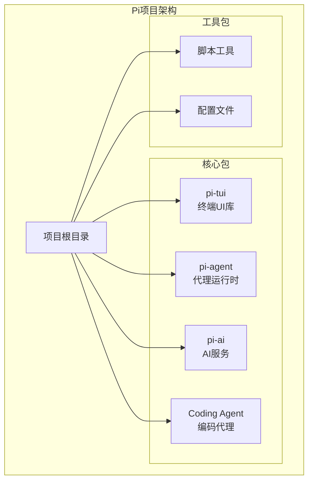
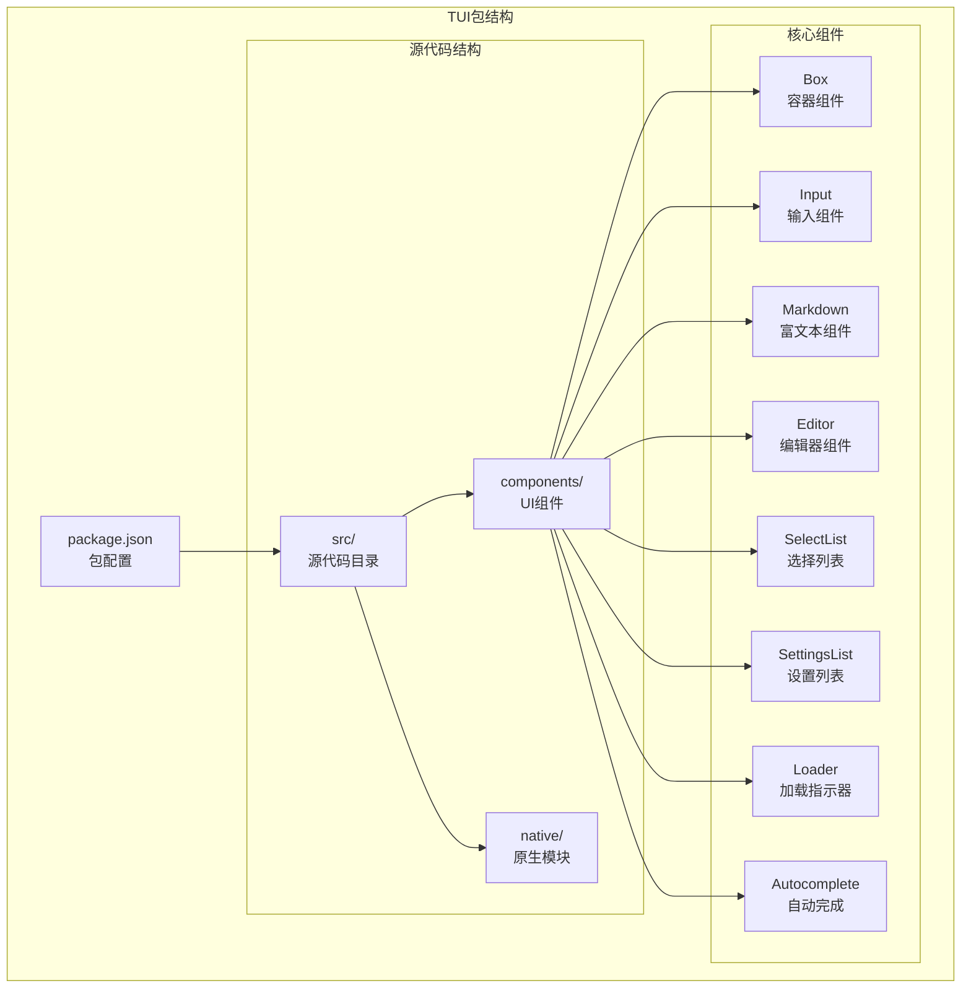
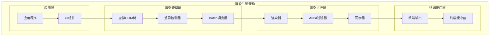
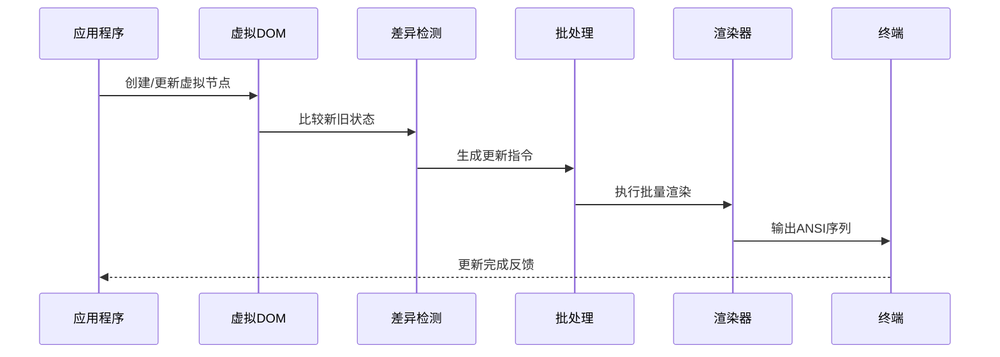
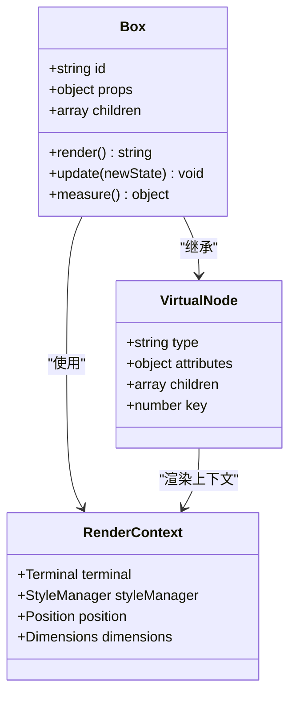
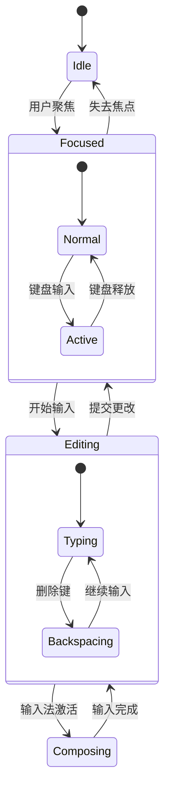
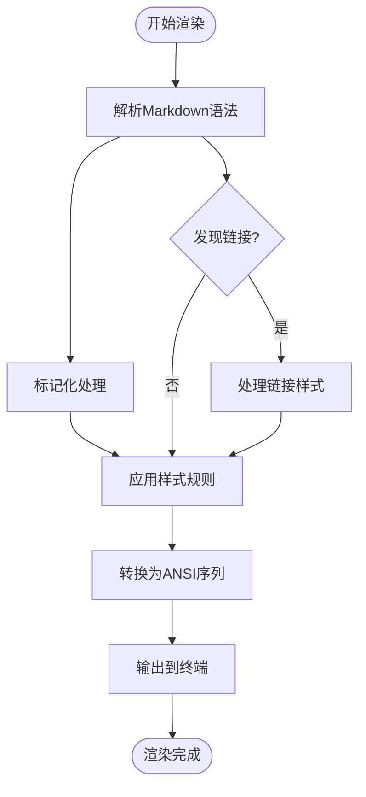
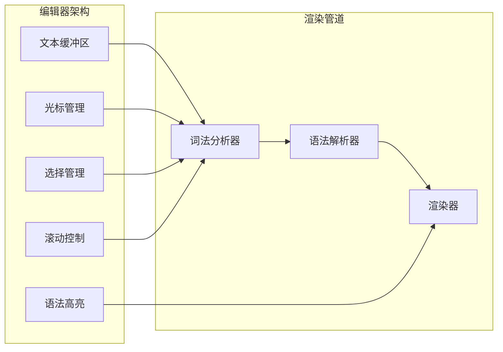
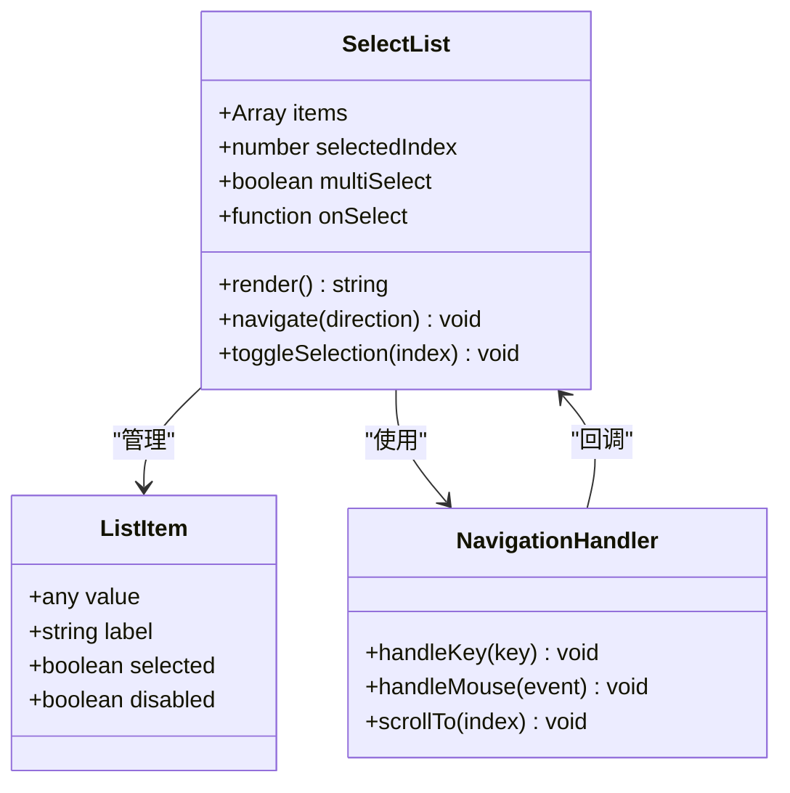
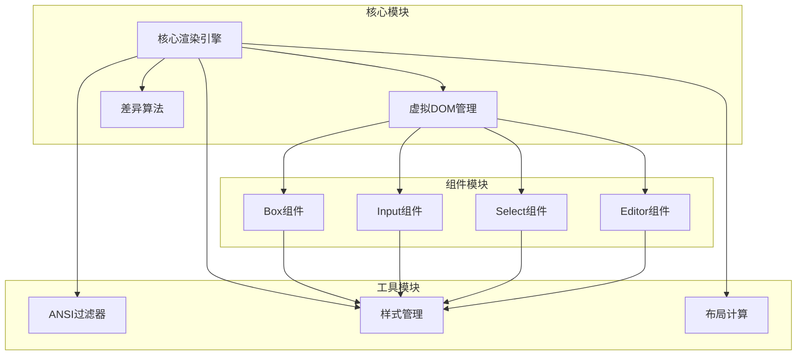

# 差分渲染引擎

<cite>
**本文档引用的文件**
- [README.md](file://README.md)
- [package.json](file://package.json)
- [packages/tui/package.json](file://packages/tui/package.json)
- [packages/tui/README.md](file://packages/tui/README.md)
- [packages/tui/src/components/box.ts](file://packages/tui/src/components/box.ts)
- [packages/tui/src/components/input.ts](file://packages/tui/src/components/input.ts)
- [packages/tui/src/components/markdown.ts](file://packages/tui/src/components/markdown.ts)
- [packages/tui/src/autocomplete.ts](file://packages/tui/src/autocomplete.ts)
- [packages/tui/src/components/editor.ts](file://packages/tui/src/components/editor.ts)
- [packages/tui/src/components/image.ts](file://packages/tui/src/components/image.ts)
- [packages/tui/src/components/select-list.ts](file://packages/tui/src/components/select-list.ts)
- [packages/tui/src/components/settings-list.ts](file://packages/tui/src/components/settings-list.ts)
- [packages/tui/src/components/loader.ts](file://packages/tui/src/components/loader.ts)
- [packages/tui/src/components/cancellable-loader.ts](file://packages/tui/src/components/cancellable-loader.ts)
</cite>

## 目录
1. [简介](#简介)
2. [项目结构](#项目结构)
3. [核心组件](#核心组件)
4. [架构概览](#架构概览)
5. [详细组件分析](#详细组件分析)
6. [依赖分析](#依赖分析)
7. [性能考虑](#性能考虑)
8. [故障排除指南](#故障排除指南)
9. [结论](#结论)
10. [附录](#附录)

## 简介

Pi终端UI库的差分渲染引擎是一个高效的文本界面渲染系统，专为终端环境设计。该引擎采用虚拟DOM树构建、变更检测算法和最小化重绘策略，实现了高性能的终端UI渲染。

### 主要特性

- **差分渲染**：通过比较新旧状态计算最优更新路径
- **ANSI转义序列处理**：支持颜色和样式的应用
- **批量更新**：减少不必要的重绘操作
- **延迟渲染**：优化渲染性能
- **内存管理**：高效的资源使用策略

## 项目结构

Pi项目采用Monorepo架构，TUI包位于`packages/tui`目录下，专门负责终端用户界面的渲染功能。



**图表来源**
- [README.md:50-56](file://README.md#L50-L56)
- [package.json:5-11](file://package.json#L5-L11)

### TUI包结构

TUI包作为终端UI的核心组件，提供了完整的渲染引擎和UI组件库：



**图表来源**
- [packages/tui/package.json:13-18](file://packages/tui/package.json#L13-L18)
- [packages/tui/package.json:39-46](file://packages/tui/package.json#L39-L46)

**章节来源**
- [README.md:50-56](file://README.md#L50-L56)
- [package.json:5-11](file://package.json#L5-L11)
- [packages/tui/package.json:1-48](file://packages/tui/package.json#L1-L48)

## 核心组件

### 虚拟DOM树构建

差分渲染引擎的核心是虚拟DOM树的构建和管理。每个UI组件都对应一个虚拟节点，包含以下关键信息：

- **节点标识符**：唯一标识符用于快速定位和更新
- **属性集合**：组件的状态和样式信息
- **子节点列表**：嵌套组件的层次结构
- **渲染函数**：将虚拟节点转换为终端输出的逻辑

### 变更检测算法

引擎采用高效的变更检测机制，通过以下步骤实现：

1. **深度比较**：递归比较新旧虚拟树的差异
2. **差异收集**：记录所有需要更新的操作
3. **批量应用**：将多个变更合并为最小化的更新序列
4. **增量渲染**：只重新渲染发生变化的部分

### 最小化重绘策略

为了优化渲染性能，引擎实现了多种重绘策略：

- **区域更新**：仅更新受影响的终端区域
- **增量同步**：与终端缓冲区进行增量同步
- **跳过无变化**：避免对未改变的区域进行重绘
- **批处理优化**：将多个小更新合并为一次大更新

**章节来源**
- [packages/tui/package.json:4-5](file://packages/tui/package.json#L4-L5)

## 架构概览

差分渲染引擎的整体架构分为四个主要层次：



**图表来源**
- [packages/tui/package.json:4-5](file://packages/tui/package.json#L4-L5)

### 数据流处理

渲染引擎的数据流遵循严格的处理顺序：



**图表来源**
- [packages/tui/package.json:4-5](file://packages/tui/package.json#L4-L5)

## 详细组件分析

### Box组件分析

Box组件是基础的容器组件，提供布局和样式支持：



**图表来源**
- [packages/tui/src/components/box.ts](file://packages/tui/src/components/box.ts)

Box组件的关键特性：

- **灵活布局**：支持多种布局模式和尺寸计算
- **样式继承**：从父级继承样式属性
- **事件处理**：支持用户交互事件
- **嵌套支持**：可包含其他UI组件

### 输入组件分析

输入组件提供用户交互能力，包括文本输入和选择操作：



**图表来源**
- [packages/tui/src/components/input.ts](file://packages/tui/src/components/input.ts)

**章节来源**
- [packages/tui/src/components/box.ts](file://packages/tui/src/components/box.ts)
- [packages/tui/src/components/input.ts](file://packages/tui/src/components/input.ts)

### Markdown组件分析

Markdown组件支持富文本渲染，包括格式化文本、链接和代码块：



**图表来源**
- [packages/tui/src/components/markdown.ts](file://packages/tui/src/components/markdown.ts)

Markdown组件的处理流程：

- **语法解析**：识别Markdown标记和结构
- **样式映射**：将语义标记转换为终端样式
- **ANSI转换**：生成兼容的ANSI转义序列
- **实时渲染**：支持动态内容更新

**章节来源**
- [packages/tui/src/components/markdown.ts](file://packages/tui/src/components/markdown.ts)

### 编辑器组件分析

编辑器组件提供高级文本编辑功能，支持多行文本和复杂编辑操作：



**图表来源**
- [packages/tui/src/components/editor.ts](file://packages/tui/src/components/editor.ts)

编辑器组件的核心功能：

- **多行文本支持**：处理复杂的文本布局
- **光标导航**：精确的文本定位和移动
- **选择操作**：支持文本选择和复制
- **滚动管理**：优化大文本的显示性能

**章节来源**
- [packages/tui/src/components/editor.ts](file://packages/tui/src/components/editor.ts)

### 选择列表组件分析

选择列表组件提供用户选择界面，支持键盘导航和鼠标交互：



**图表来源**
- [packages/tui/src/components/select-list.ts](file://packages/tui/src/components/select-list.ts)

选择列表的交互模式：

- **键盘导航**：支持上下箭头键和回车键
- **鼠标选择**：支持点击选择项目
- **多选支持**：可配置单选或多选模式
- **虚拟滚动**：优化大量项目的显示性能

**章节来源**
- [packages/tui/src/components/select-list.ts](file://packages/tui/src/components/select-list.ts)

## 依赖分析

### 外部依赖关系

TUI包的外部依赖主要集中在终端处理和文本渲染方面：

```mermaid
graph TB
subgraph "TUI包依赖"
TUI_PKG[pi-tui]
subgraph "运行时依赖"
EAST_WIDTH[get-east-asian-width<br/>东亚字符宽度]
MARKED[marked<br/>Markdown解析]
end
subgraph "开发依赖"
XTERM_HEADLESS[@xterm/headless<br/>终端模拟]
CHALK[chalk<br/>颜色支持]
end
TUI_PKG --> EAST_WIDTH
TUI_PKG --> MARKED
TUI_PKG --> XTERM_HEADLESS
TUI_PKG --> CHALK
end
```

**图表来源**
- [packages/tui/package.json:39-46](file://packages/tui/package.json#L39-L46)

### 内部模块依赖

TUI包内部模块之间的依赖关系体现了清晰的分层架构：



**图表来源**
- [packages/tui/package.json:4-5](file://packages/tui/package.json#L4-L5)

**章节来源**
- [packages/tui/package.json:39-46](file://packages/tui/package.json#L39-L46)

## 性能考虑

### 批量更新优化

差分渲染引擎通过批量更新机制显著提升性能：

- **更新队列**：将多个状态变更收集到队列中
- **去重处理**：消除重复的更新请求
- **优先级排序**：根据重要性对更新进行排序
- **时间片分配**：合理分配CPU时间给不同类型的更新

### 延迟渲染策略

为了进一步优化性能，引擎实现了多种延迟渲染技术：

- **帧率限制**：控制渲染频率避免过度更新
- **可见性检测**：只渲染可见区域的内容
- **懒加载**：延迟加载非关键资源
- **预渲染**：提前计算可能需要的渲染结果

### 内存管理优化

引擎采用了多项内存管理策略：

- **对象池**：复用频繁创建的对象实例
- **垃圾回收优化**：减少GC压力的内存分配策略
- **缓存机制**：缓存计算结果避免重复计算
- **弱引用**：使用弱引用来避免循环引用

## 故障排除指南

### 常见问题诊断

当遇到渲染问题时，可以按照以下步骤进行诊断：

1. **检查虚拟DOM一致性**：验证虚拟树的结构完整性
2. **分析差异检测结果**：确认变更检测算法的正确性
3. **验证ANSI序列生成**：检查颜色和样式的正确应用
4. **监控内存使用**：观察内存泄漏和过度分配

### 性能问题排查

性能问题的常见原因和解决方案：

- **频繁重绘**：检查是否有不必要的状态更新
- **内存泄漏**：确认事件监听器和定时器的正确清理
- **渲染阻塞**：优化大型组件的渲染逻辑
- **输入延迟**：减少渲染前的计算开销

**章节来源**
- [packages/tui/package.json:4-5](file://packages/tui/package.json#L4-L5)

## 结论

Pi终端UI库的差分渲染引擎通过创新的技术架构实现了高效的终端界面渲染。其核心优势包括：

- **高性能渲染**：通过虚拟DOM和差异检测实现最小化更新
- **丰富的组件生态**：提供完整的UI组件库满足各种应用场景
- **优雅的样式系统**：支持复杂的样式和主题定制
- **优秀的性能表现**：优化的内存管理和渲染策略

该引擎为终端应用开发提供了坚实的基础，支持从简单命令行工具到复杂交互式界面的各种需求。

## 附录

### 扩展接口说明

开发者可以通过以下接口扩展渲染引擎：

- **自定义组件接口**：实现标准的组件生命周期方法
- **渲染器插件系统**：支持自定义渲染后端
- **样式系统扩展**：添加新的样式属性和效果
- **事件系统扩展**：集成自定义事件处理器

### 自定义渲染器实现指南

实现自定义渲染器的基本步骤：

1. **实现渲染接口**：遵循标准的渲染器接口规范
2. **处理ANSI序列**：正确解析和应用ANSI转义序列
3. **优化性能**：实现高效的渲染和更新逻辑
4. **测试验证**：确保与现有组件系统的兼容性