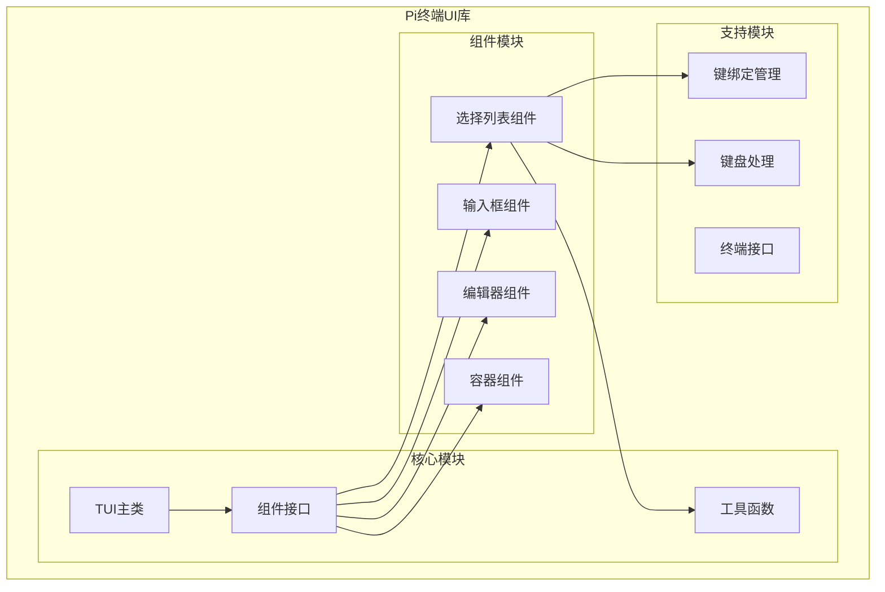
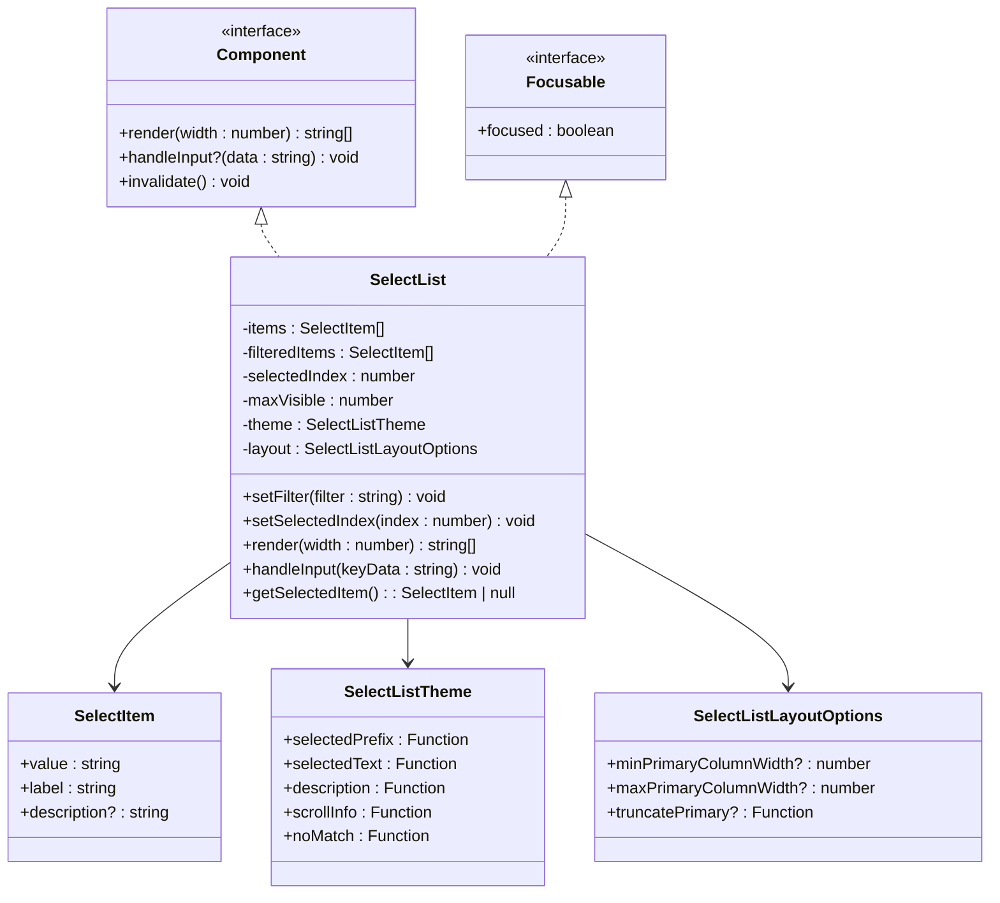
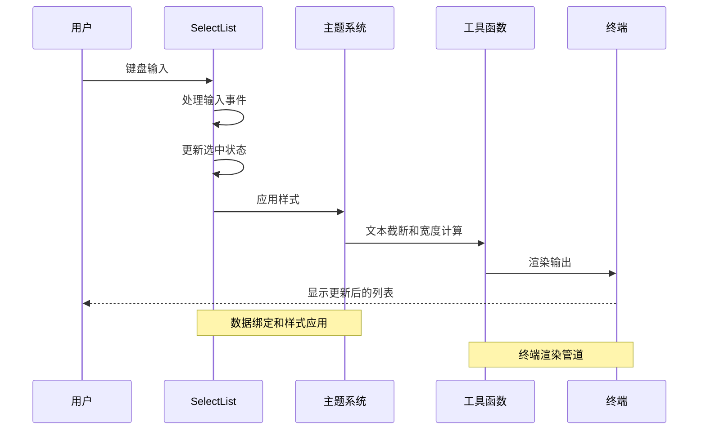
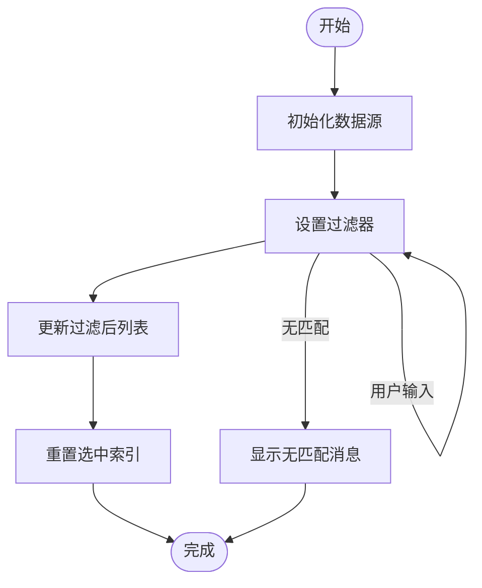
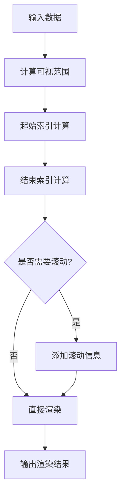
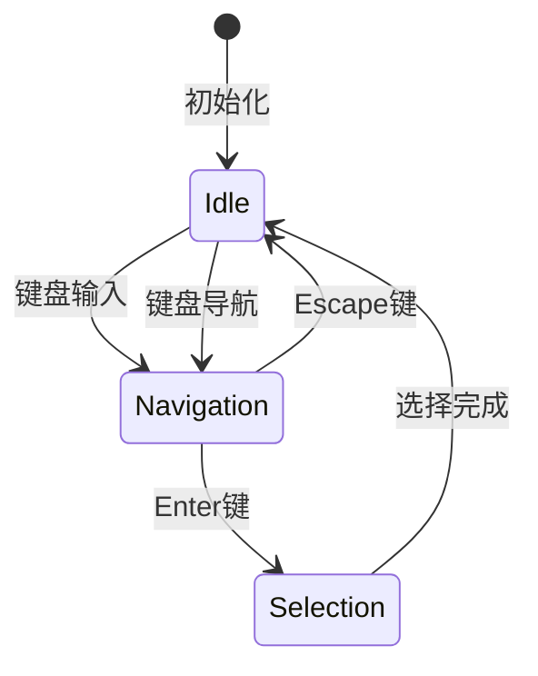
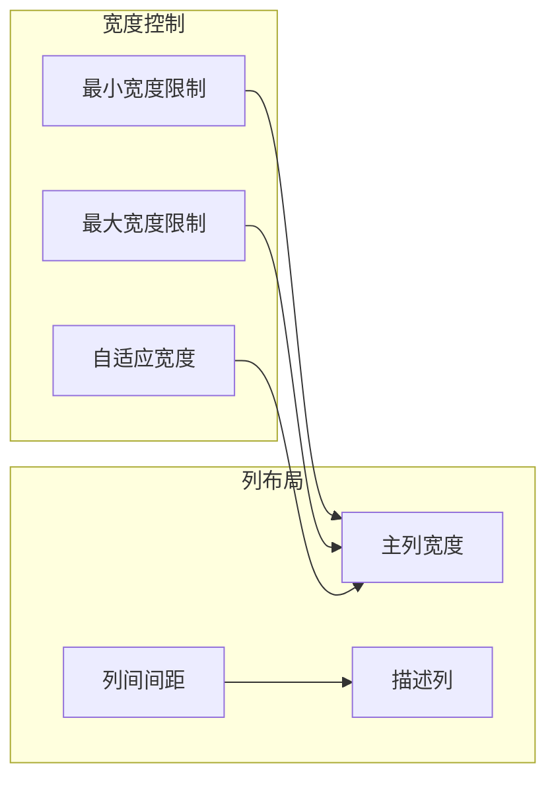
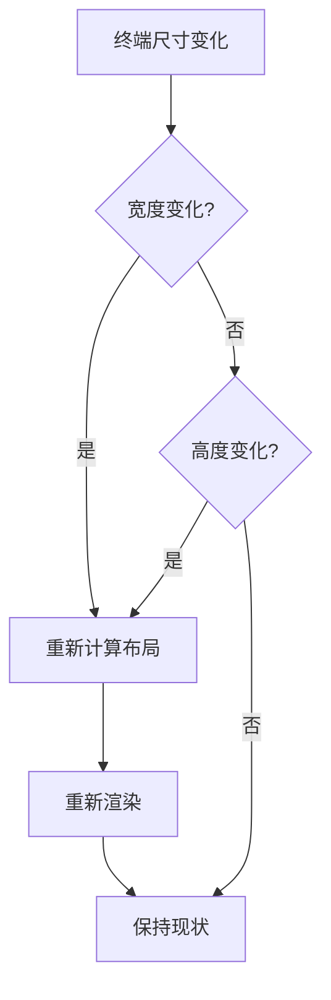
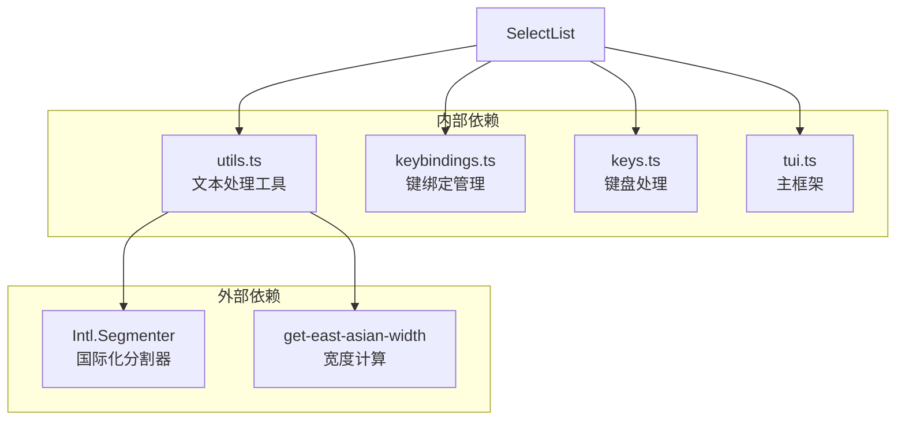

# 列表组件

<cite>
**本文档引用的文件**
- [select-list.ts](file://packages/tui/src/components/select-list.ts)
- [utils.ts](file://packages/tui/src/utils.ts)
- [keybindings.ts](file://packages/tui/src/keybindings.ts)
- [keys.ts](file://packages/tui/src/keys.ts)
- [tui.ts](file://packages/tui/src/tui.ts)
- [README.md](file://packages/tui/README.md)
</cite>

## 目录
1. [简介](#简介)
2. [项目结构](#项目结构)
3. [核心组件](#核心组件)
4. [架构概览](#架构概览)
5. [详细组件分析](#详细组件分析)
6. [依赖关系分析](#依赖关系分析)
7. [性能考虑](#性能考虑)
8. [故障排除指南](#故障排除指南)
9. [结论](#结论)
10. [附录](#附录)

## 简介

Pi终端UI库的列表组件是一个高度优化的交互式选择列表实现，专为终端环境设计。该组件提供了丰富的功能集，包括数据绑定、滚动控制、键盘导航、主题定制等特性。

本组件基于Pi终端UI框架构建，采用差分渲染技术，确保在终端中的流畅体验。它支持多种布局选项、响应式设计和完整的键盘交互功能。

## 项目结构

Pi终端UI库采用模块化架构，列表组件位于专门的组件目录中：



**图表来源**
- [select-list.ts:1-230](file://packages/tui/src/components/select-list.ts#L1-L230)
- [tui.ts:39-63](file://packages/tui/src/tui.ts#L39-L63)

**章节来源**
- [README.md:1-780](file://packages/tui/README.md#L1-L780)

## 核心组件

### SelectList类概述

SelectList是终端UI库中最复杂的组件之一，实现了完整的交互式列表功能。该类继承自Component接口，提供了以下核心功能：

#### 主要特性
- **数据绑定机制**：支持动态数据源更新和过滤
- **滚动控制**：智能滚动算法，支持可视区域计算
- **键盘导航**：完整的键盘交互支持
- **主题系统**：可定制的颜色方案和样式
- **布局选项**：灵活的布局配置能力

#### 关键属性
- `items`: 原始数据项数组
- `filteredItems`: 过滤后的数据项
- `selectedIndex`: 当前选中项索引
- `maxVisible`: 最大可见行数
- `theme`: 主题配置对象
- `layout`: 布局选项配置

**章节来源**
- [select-list.ts:40-58](file://packages/tui/src/components/select-list.ts#L40-L58)

## 架构概览

### 组件层次结构



**图表来源**
- [select-list.ts:12-38](file://packages/tui/src/components/select-list.ts#L12-L38)
- [tui.ts:39-82](file://packages/tui/src/tui.ts#L39-L82)

### 数据流架构



**图表来源**
- [select-list.ts:112-137](file://packages/tui/src/components/select-list.ts#L112-L137)
- [utils.ts:875-1011](file://packages/tui/src/utils.ts#L875-L1011)

## 详细组件分析

### 数据绑定机制

#### 数据源设置

SelectList支持动态数据源管理，通过构造函数接收初始数据：



**图表来源**
- [select-list.ts:60-68](file://packages/tui/src/components/select-list.ts#L60-L68)

#### 项渲染逻辑

列表项的渲染采用两阶段处理：

1. **数据预处理**：标准化描述文本，计算可见宽度
2. **样式应用**：根据选中状态应用不同样式

**章节来源**
- [select-list.ts:139-176](file://packages/tui/src/components/select-list.ts#L139-L176)

### 滚动控制功能

#### 可视区域计算

滚动控制是SelectList的核心功能之一，采用智能算法确保最佳用户体验：



**图表来源**
- [select-list.ts:85-110](file://packages/tui/src/components/select-list.ts#L85-L110)

#### 滚动条显示

当列表内容超出可视区域时，自动显示滚动指示器：

- **位置信息**：显示当前项在总列表中的位置
- **宽度适配**：根据终端宽度动态调整显示内容
- **样式定制**：支持主题系统的滚动信息样式

**章节来源**
- [select-list.ts:102-107](file://packages/tui/src/components/select-list.ts#L102-L107)

### 列表项选择机制

#### 单选模式

SelectList默认支持单选操作，通过键盘导航选择项目：



**图表来源**
- [select-list.ts:112-137](file://packages/tui/src/components/select-list.ts#L112-L137)

#### 键盘导航支持

组件支持完整的键盘导航操作：

- **上下移动**：循环导航，支持首尾连接
- **确认选择**：Enter键触发选择事件
- **取消操作**：Escape键触发取消事件

**章节来源**
- [keybindings.ts:36-41](file://packages/tui/src/keybindings.ts#L36-L41)
- [keys.ts:1044-1126](file://packages/tui/src/keys.ts#L1044-L1126)

### 布局选项

#### 固定宽度与自适应宽度

SelectList支持灵活的宽度控制机制：



**图表来源**
- [select-list.ts:178-197](file://packages/tui/src/components/select-list.ts#L178-L197)

#### 间距控制

组件提供精确的间距控制：

- **主列间距**：固定2个字符间距
- **最小描述宽度**：确保描述信息的可读性
- **动态宽度调整**：根据内容和终端宽度自动调整

**章节来源**
- [select-list.ts:5-7](file://packages/tui/src/components/select-list.ts#L5-L7)

### 主题系统

#### 颜色方案定制

SelectList采用模块化的主题系统，支持细粒度的样式控制：

| 主题函数 | 用途 | 参数类型 |
|---------|------|----------|
| `selectedPrefix` | 选中项前缀样式 | `(text: string) => string` |
| `selectedText` | 选中文本样式 | `(text: string) => string` |
| `description` | 描述文本样式 | `(text: string) => string` |
| `scrollInfo` | 滚动信息样式 | `(text: string) => string` |
| `noMatch` | 无匹配提示样式 | `(text: string) => string` |

#### 样式定制示例

主题系统允许开发者完全控制列表的外观：

```typescript
const customTheme = {
  selectedPrefix: (text) => `\x1b[1;32m${text}\x1b[0m`, // 绿色勾号
  selectedText: (text) => `\x1b[1;37;44m${text}\x1b[0m`, // 白字蓝底
  description: (text) => `\x1b[2;36m${text}\x1b[0m`, // 青色描述
  scrollInfo: (text) => `\x1b[33m${text}\x1b[0m`, // 黄色滚动信息
  noMatch: (text) => `\x1b[1;31m${text}\x1b[0m` // 红色无匹配
};
```

**章节来源**
- [select-list.ts:18-24](file://packages/tui/src/components/select-list.ts#L18-L24)

### 响应式设计

#### 终端适配

SelectList能够智能适应不同的终端环境：

- **宽度检测**：实时检测终端宽度变化
- **内容适配**：根据可用空间调整布局
- **滚动优化**：在小终端上提供更好的滚动体验

#### 动态布局调整

组件支持运行时布局调整：



**图表来源**
- [tui.ts:953-1320](file://packages/tui/src/tui.ts#L953-L1320)

## 依赖关系分析

### 外部依赖

SelectList组件依赖于Pi终端UI库的核心功能：



**图表来源**
- [select-list.ts:1-4](file://packages/tui/src/components/select-list.ts#L1-L4)
- [utils.ts:1-6](file://packages/tui/src/utils.ts#L1-L6)

### 内部耦合

组件间的耦合关系相对松散，主要通过接口和事件机制通信：

- **组件接口**：所有组件必须实现统一的Component接口
- **事件系统**：通过回调函数实现组件间通信
- **主题接口**：通过函数式接口实现样式定制

**章节来源**
- [tui.ts:39-63](file://packages/tui/src/tui.ts#L39-L63)

## 性能考虑

### 渲染优化

SelectList采用了多项性能优化策略：

#### 差分渲染集成

作为TUI框架的一部分，SelectList受益于差分渲染技术：

- **增量更新**：只更新发生变化的部分
- **同步输出**：使用CSI 2026实现原子更新
- **缓存机制**：避免重复计算和渲染

#### 计算复杂度

- **渲染时间复杂度**：O(n)，其中n为可见项数量
- **内存使用**：O(n)用于存储可见项
- **滚动计算**：O(1)的索引计算

### 文本处理优化

#### 宽度计算缓存

utils.ts模块实现了高效的宽度计算缓存机制：

- **缓存大小**：512个条目的LRU缓存
- **宽度预计算**：避免重复的宽度计算
- **ANSI码处理**：正确处理ANSI转义序列

**章节来源**
- [utils.ts:44-47](file://packages/tui/src/utils.ts#L44-L47)
- [utils.ts:219-264](file://packages/tui/src/utils.ts#L219-L264)

## 故障排除指南

### 常见问题

#### 列表溢出错误

**问题描述**：渲染的行超出终端宽度导致错误

**解决方案**：
1. 确保所有组件都正确实现宽度检查
2. 使用`truncateToWidth()`函数进行文本截断
3. 检查主题函数是否正确处理ANSI代码

#### 键盘事件不响应

**问题描述**：键盘输入无法正确识别

**解决方案**：
1. 验证键绑定配置是否正确
2. 检查`getKeybindings()`返回的实例
3. 确认键盘协议支持（Kitty协议）

#### 滚动异常

**问题描述**：滚动行为不符合预期

**解决方案**：
1. 检查`maxVisible`参数设置
2. 验证`selectedIndex`边界条件
3. 确认过滤器逻辑正确性

**章节来源**
- [tui.ts:1180-1207](file://packages/tui/src/tui.ts#L1180-L1207)

### 调试技巧

#### 启用调试日志

设置环境变量启用详细的调试信息：

```bash
# 启用渲染调试
export PI_TUI_DEBUG=1

# 启用崩溃日志
export PI_DEBUG_REDRAW=1

# 记录ANSI流
export PI_TUI_WRITE_LOG=/tmp/tui-ansi.log
```

#### 性能监控

使用内置的渲染计数器监控性能：

```typescript
// 获取全量渲染次数
const fullRedraws = tui.fullRedraws;

// 监控渲染频率
console.log(`全量渲染: ${fullRedraws}次`);
```

## 结论

Pi终端UI库的列表组件是一个功能完整、性能优化的交互式组件。它成功地解决了终端环境中列表显示的各种挑战，提供了：

### 核心优势

1. **完整的键盘交互**：支持标准的键盘导航和快捷键
2. **灵活的主题系统**：完全可定制的外观和样式
3. **智能滚动控制**：高效的滚动算法和可视区域管理
4. **响应式设计**：适应不同终端环境和尺寸
5. **性能优化**：差分渲染和缓存机制确保流畅体验

### 技术特色

- 基于模块化架构，易于扩展和维护
- 完善的类型定义和文档支持
- 兼容多种终端和键盘协议
- 支持复杂的ANSI样式处理

该组件为Pi终端UI库提供了强大的基础，适用于各种命令行应用程序的列表需求。

## 附录

### API参考

#### 构造函数

```typescript
constructor(
  items: SelectItem[],           // 数据项数组
  maxVisible: number,           // 最大可见行数
  theme: SelectListTheme,       // 主题配置
  layout?: SelectListLayoutOptions  // 布局选项
)
```

#### 方法

| 方法名 | 参数 | 返回值 | 描述 |
|-------|------|--------|------|
| `setFilter` | `filter: string` | `void` | 设置过滤器 |
| `setSelectedIndex` | `index: number` | `void` | 设置选中索引 |
| `getSelectedItem` | `()` | `SelectItem | null` | 获取当前选中项 |
| `invalidate` | `()` | `void` | 使缓存失效 |

#### 事件处理器

| 属性名 | 类型 | 描述 |
|-------|------|------|
| `onSelect` | `(item: SelectItem) => void` | 选择事件回调 |
| `onCancel` | `() => void` | 取消事件回调 |
| `onSelectionChange` | `(item: SelectItem) => void` | 选中项变更回调 |

#### 数据格式

```typescript
interface SelectItem {
  value: string;           // 值
  label: string;           // 显示标签
  description?: string;    // 描述信息
}

interface SelectListTheme {
  selectedPrefix: (text: string) => string;
  selectedText: (text: string) => string;
  description: (text: string) => string;
  scrollInfo: (text: string) => string;
  noMatch: (text: string) => string;
}

interface SelectListLayoutOptions {
  minPrimaryColumnWidth?: number;
  maxPrimaryColumnWidth?: number;
  truncatePrimary?: (context: {
    text: string;
    maxWidth: number;
    columnWidth: number;
    item: SelectItem;
    isSelected: boolean;
  }) => string;
}
```

**章节来源**
- [select-list.ts:12-38](file://packages/tui/src/components/select-list.ts#L12-L38)
- [README.md:413-445](file://packages/tui/README.md#L413-L445)