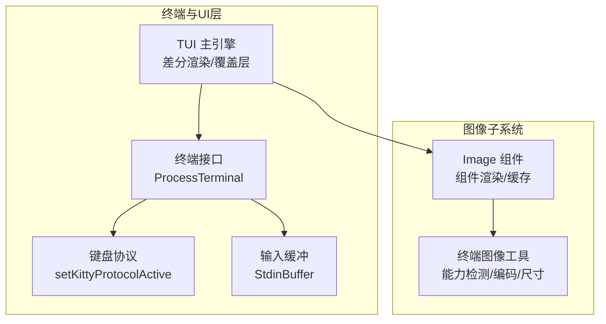
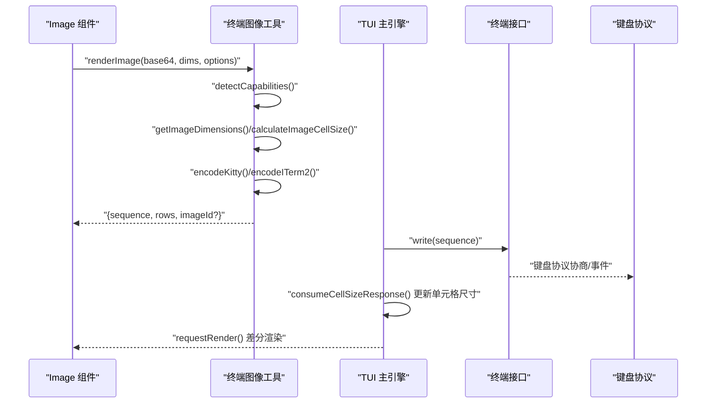
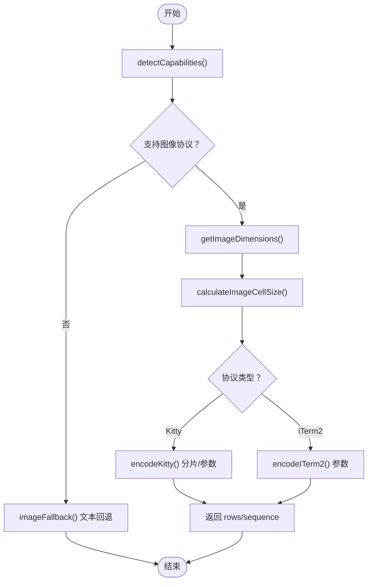
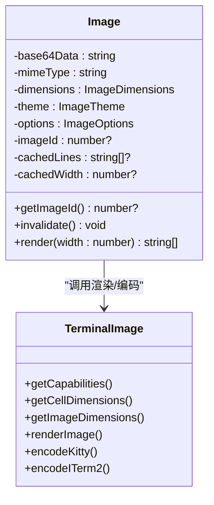
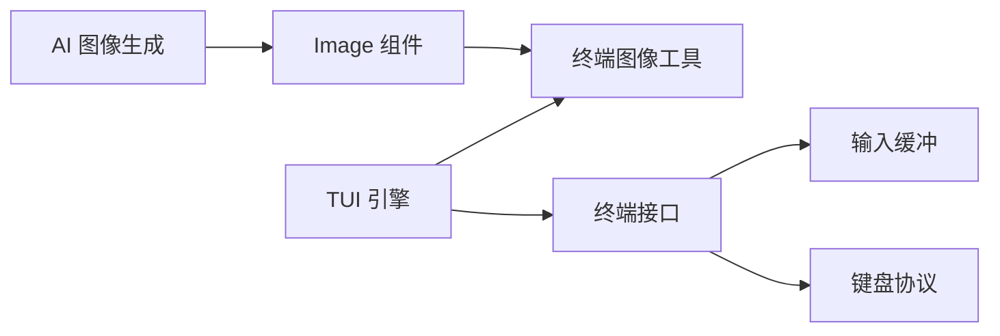

# 图像组件

<cite>
**本文引用的文件**
- [terminal-image.ts](file://packages/tui/src/terminal-image.ts)
- [image.ts](file://packages/tui/src/components/image.ts)
- [terminal.ts](file://packages/tui/src/terminal.ts)
- [tui.ts](file://packages/tui/src/tui.ts)
- [stdin-buffer.ts](file://packages/tui/src/stdin-buffer.ts)
- [keys.ts](file://packages/tui/src/keys.ts)
- [terminal-image.test.ts](file://packages/tui/test/terminal-image.test.ts)
- [images.ts](file://packages/ai/src/images.ts)
</cite>

## 目录
1. [简介](#简介)
2. [项目结构](#项目结构)
3. [核心组件](#核心组件)
4. [架构总览](#架构总览)
5. [详细组件分析](#详细组件分析)
6. [依赖关系分析](#依赖关系分析)
7. [性能考量](#性能考量)
8. [故障排查指南](#故障排查指南)
9. [结论](#结论)
10. [附录：API 参考](#附录api-参考)

## 简介
本文件面向 Pi 终端 UI 库中的图像组件，系统化阐述其图像渲染机制、尺寸计算策略、协议支持（Kitty、iTerm2）、终端兼容性、性能优化与 API 使用方法。文档同时提供可视化流程图与类图，帮助读者从高层到代码级全面理解图像组件的设计与实现。

## 项目结构
本节聚焦与图像组件直接相关的核心模块及其职责：
- terminal-image.ts：图像协议检测、尺寸解析、编码与渲染入口
- image.ts：TUI 组件层的 Image 类，负责缓存、布局与渲染输出
- terminal.ts：底层终端接口与键盘协议协商
- tui.ts：主 UI 引擎，负责差分渲染、覆盖层合成、单元格尺寸查询与响应处理
- stdin-buffer.ts：输入缓冲与转义序列完整性解析
- keys.ts：键盘协议状态与按键匹配工具
- terminal-image.test.ts：图像协议检测、渲染行为与边界用例测试
- images.ts：AI 图像生成入口（与图像组件协同使用）



图表来源
- [tui.ts:239-493](file://packages/tui/src/tui.ts#L239-L493)
- [terminal.ts:100-574](file://packages/tui/src/terminal.ts#L100-L574)
- [image.ts:24-126](file://packages/tui/src/components/image.ts#L24-L126)
- [terminal-image.ts:42-111](file://packages/tui/src/terminal-image.ts#L42-L111)
- [stdin-buffer.ts:274-434](file://packages/tui/src/stdin-buffer.ts#L274-L434)
- [keys.ts:31-40](file://packages/tui/src/keys.ts#L31-L40)

章节来源
- [terminal-image.ts:1-459](file://packages/tui/src/terminal-image.ts#L1-L459)
- [image.ts:1-127](file://packages/tui/src/components/image.ts#L1-L127)
- [terminal.ts:1-574](file://packages/tui/src/terminal.ts#L1-L574)
- [tui.ts:1-800](file://packages/tui/src/tui.ts#L1-L800)
- [stdin-buffer.ts:1-435](file://packages/tui/src/stdin-buffer.ts#L1-L435)
- [keys.ts:1-800](file://packages/tui/src/keys.ts#L1-L800)
- [terminal-image.test.ts:1-438](file://packages/tui/test/terminal-image.test.ts#L1-L438)
- [images.ts:1-22](file://packages/ai/src/images.ts#L1-L22)

## 核心组件
- 终端图像工具（terminal-image.ts）
  - 能力检测：根据环境变量识别 Kitty、iTerm2、WezTerm、Ghostty 等终端，并决定是否启用图像协议与超链接支持
  - 编码器：Kitty 图形协议与 iTerm2 文件内联协议的编码实现，含分片传输、参数拼装与删除指令
  - 尺寸解析：对 PNG/JPEG/GIF/WebP 的 Base64 数据进行快速尺寸探测
  - 渲染入口：根据图像尺寸与终端单元格像素尺寸计算行列数，生成最终序列
  - 其他：超链接封装、图像回退文本提示
- 图像组件（image.ts）
  - 组件化封装：基于 Base64 图像数据、MIME 类型、主题与可选维度，渲染为多行输出
  - 缓存策略：按宽度缓存渲染结果，避免重复计算
  - 行高控制：在 Kitty 下通过空行占位，在 iTerm2 下通过移动光标实现高度占位
  - ID 分配：为 Kitty 图像分配随机 ID，便于后续更新或清理
- 终端接口（terminal.ts）与 UI 引擎（tui.ts）
  - 终端接口：原始进程 stdin/stdout 包装，键盘协议协商、输入缓冲、进度指示等
  - UI 引擎：差分渲染、覆盖层合成、单元格尺寸查询与响应处理、输入路由与焦点管理
- 输入缓冲（stdin-buffer.ts）
  - 解析不完整转义序列，确保键盘与图像协议响应被正确拆分为完整序列
- 键盘协议（keys.ts）
  - 全局状态维护与按键匹配，支持 Kitty 协议事件类型判断与修饰键组合解析

章节来源
- [terminal-image.ts:42-436](file://packages/tui/src/terminal-image.ts#L42-L436)
- [image.ts:24-126](file://packages/tui/src/components/image.ts#L24-L126)
- [terminal.ts:100-574](file://packages/tui/src/terminal.ts#L100-L574)
- [tui.ts:239-617](file://packages/tui/src/tui.ts#L239-L617)
- [stdin-buffer.ts:274-434](file://packages/tui/src/stdin-buffer.ts#L274-L434)
- [keys.ts:31-40](file://packages/tui/src/keys.ts#L31-L40)

## 架构总览
下图展示从组件渲染到终端输出的完整链路，以及与键盘协议、输入缓冲的关系。



图表来源
- [image.ts:60-125](file://packages/tui/src/components/image.ts#L60-L125)
- [terminal-image.ts:402-436](file://packages/tui/src/terminal-image.ts#L402-L436)
- [tui.ts:441-597](file://packages/tui/src/tui.ts#L441-L597)
- [terminal.ts:134-168](file://packages/tui/src/terminal.ts#L134-L168)
- [keys.ts:31-40](file://packages/tui/src/keys.ts#L31-L40)

## 详细组件分析

### 终端图像工具（terminal-image.ts）
- 能力检测与缓存
  - 基于 TERM_PROGRAM、TERMINAL_EMULATOR、COLORTERM、KITTY_WINDOW_ID、WEZTERM_PANE、ITERM_SESSION_ID 等环境变量判定图像协议支持
  - tmux/screen 环境强制禁用图像与超链接，避免序列被吞或不可见
  - 支持缓存检测结果，避免重复探测
- Kitty 图像协议
  - 参数组装：包含 f=100（格式）、q=2（静默回复）、可选 c/r/i/C 等
  - 分片传输：超过阈值时以 m=1/m=0 拆分发送
  - 删除指令：支持按 ID 删除单个或全部图像
  - 光标移动控制：moveCursor=false 时通过 C=1 抑制终端侧默认移动
- iTerm2 图像协议
  - inline=1、width/height/preserveAspectRatio 等参数
  - 通过移动光标与空行占位实现高度控制
- 尺寸解析与计算
  - 对 PNG/JPEG/GIF/WebP 的 Base64 进行快速头校验与尺寸提取
  - 计算单元格尺寸：根据目标像素宽高、最大列/行约束与单元格像素尺寸推导行列数
- 渲染入口
  - 统一调用 detectCapabilities/getCellDimensions，按协议生成序列与行数
- 超链接与回退
  - 超链接封装 OSC 8；无图像能力时输出回退文本



图表来源
- [terminal-image.ts:42-436](file://packages/tui/src/terminal-image.ts#L42-L436)
- [terminal-image.ts:227-251](file://packages/tui/src/terminal-image.ts#L227-L251)
- [terminal-image.ts:261-400](file://packages/tui/src/terminal-image.ts#L261-L400)

章节来源
- [terminal-image.ts:42-111](file://packages/tui/src/terminal-image.ts#L42-L111)
- [terminal-image.ts:135-195](file://packages/tui/src/terminal-image.ts#L135-L195)
- [terminal-image.ts:197-220](file://packages/tui/src/terminal-image.ts#L197-L220)
- [terminal-image.ts:227-280](file://packages/tui/src/terminal-image.ts#L227-L280)
- [terminal-image.ts:282-384](file://packages/tui/src/terminal-image.ts#L282-L384)
- [terminal-image.ts:402-436](file://packages/tui/src/terminal-image.ts#L402-L436)

### 图像组件（image.ts）
- 组件职责
  - 接收 Base64、MIME、主题与可选维度，构造组件实例
  - 渲染时根据当前视口宽度与默认最大高度计算最大列数，再调用渲染入口
  - 在 Kitty 下通过空行占位；在 iTerm2 下通过移动光标占位
  - 首次渲染为 Kitty 分配随机图像 ID，便于后续更新/清理
  - 缓存渲染结果，按宽度失效
- 关键点
  - 默认最大高度：按“目标宽度像素 / 单元格高度像素”估算
  - moveCursor=false：避免 Kitty 默认光标移动，由上层统一管理
  - 回退：当无图像能力或编码失败时，输出主题化回退文本



图表来源
- [image.ts:24-126](file://packages/tui/src/components/image.ts#L24-L126)
- [terminal-image.ts:402-436](file://packages/tui/src/terminal-image.ts#L402-L436)

章节来源
- [image.ts:24-126](file://packages/tui/src/components/image.ts#L24-L126)

### 终端与 UI 引擎（terminal.ts、tui.ts）
- 终端接口
  - 原始 stdin/stdout 包装，设置 raw 模式、括号粘贴模式、窗口大小监听
  - 键盘协议协商：请求标志、设备属性查询、回退定时器、modifyOtherKeys 启用
  - 输入缓冲：StdinBuffer 将不完整转义序列拆分为完整序列，处理粘贴事件
- UI 引擎
  - 差分渲染：记录上次输出，仅重绘变化区域
  - 覆盖层：按锚点与偏移定位，支持百分比与绝对尺寸
  - 单元格尺寸查询：CSI 16 t 查询，响应后更新 cellDimensions 并触发全量失效
  - 输入路由：全局监听、焦点组件处理、释放事件过滤

```mermaid
sequenceDiagram
participant TUI as "TUI"
participant Term as "ProcessTerminal"
participant SB as "StdinBuffer"
participant KB as "键盘协议"
TUI->>Term : "start()"
Term->>Term : "setRawMode/bracketed paste"
Term->>Term : "queryAndEnableKittyProtocol()"
Term->>SB : "setupStdinBuffer()"
SB-->>Term : "data/paste 事件"
Term-->>TUI : "handleInput()"
TUI->>Term : "write('\\x1b[16t')"
Term-->>TUI : "响应 '\\x1b[6;h;w t'"
TUI->>TUI : "consumeCellSizeResponse() 更新 cellDimensions"
TUI->>TUI : "invalidate() 触发重新渲染"
```

图表来源
- [terminal.ts:134-253](file://packages/tui/src/terminal.ts#L134-L253)
- [terminal.ts:279-352](file://packages/tui/src/terminal.ts#L279-L352)
- [stdin-buffer.ts:274-434](file://packages/tui/src/stdin-buffer.ts#L274-L434)
- [tui.ts:463-617](file://packages/tui/src/tui.ts#L463-L617)

章节来源
- [terminal.ts:100-574](file://packages/tui/src/terminal.ts#L100-L574)
- [stdin-buffer.ts:274-434](file://packages/tui/src/stdin-buffer.ts#L274-L434)
- [tui.ts:239-617](file://packages/tui/src/tui.ts#L239-L617)

### 测试要点（terminal-image.test.ts）
- 图像序列检测：Kitty/iTerm2 起始/中间/结尾/混合场景均能正确识别
- 能力检测：tmux/screen 强制禁用超链接；Ghostty/WezTerm/iTerm2 启用超链接；Windows Terminal 外部环境启用真彩但禁用图像
- Kitty 光标移动：默认保留终端侧移动，可通过 moveCursor=false 抑制
- 最大高度限制：maxHeightCells 有效时按行约束渲染
- 正方形像素盒：默认按单元格高宽比限制高度
- 空行占位：Kitty 通过空行占位，iTerm2 通过移动光标占位

章节来源
- [terminal-image.test.ts:55-198](file://packages/tui/test/terminal-image.test.ts#L55-L198)
- [terminal-image.test.ts:201-311](file://packages/tui/test/terminal-image.test.ts#L201-L311)
- [terminal-image.test.ts:314-411](file://packages/tui/test/terminal-image.test.ts#L314-L411)
- [terminal-image.test.ts:413-437](file://packages/tui/test/terminal-image.test.ts#L413-L437)

## 依赖关系分析
- 组件耦合
  - Image 依赖 TerminalImage 的渲染与编码能力
  - TUI 依赖 TerminalImage 的能力检测与单元格尺寸查询
  - Terminal 依赖 StdinBuffer 保证输入序列完整性
  - 键盘协议状态影响输入处理与调试快捷键
- 外部依赖
  - 环境变量驱动能力检测（TERM_PROGRAM、TERMINAL_EMULATOR、COLORTERM 等）
  - 终端协议（Kitty、iTerm2）与转义序列标准



图表来源
- [image.ts:1-11](file://packages/tui/src/components/image.ts#L1-L11)
- [terminal-image.ts:1-29](file://packages/tui/src/terminal-image.ts#L1-L29)
- [tui.ts:1-13](file://packages/tui/src/tui.ts#L1-L13)
- [terminal.ts:1-9](file://packages/tui/src/terminal.ts#L1-L9)
- [stdin-buffer.ts:1-25](file://packages/tui/src/stdin-buffer.ts#L1-L25)
- [keys.ts:25-40](file://packages/tui/src/keys.ts#L25-L40)
- [images.ts:1-22](file://packages/ai/src/images.ts#L1-L22)

章节来源
- [image.ts:1-11](file://packages/tui/src/components/image.ts#L1-L11)
- [terminal-image.ts:1-29](file://packages/tui/src/terminal-image.ts#L1-L29)
- [tui.ts:1-13](file://packages/tui/src/tui.ts#L1-L13)
- [terminal.ts:1-9](file://packages/tui/src/terminal.ts#L1-L9)
- [stdin-buffer.ts:1-25](file://packages/tui/src/stdin-buffer.ts#L1-L25)
- [keys.ts:25-40](file://packages/tui/src/keys.ts#L25-L40)
- [images.ts:1-22](file://packages/ai/src/images.ts#L1-L22)

## 性能考量
- 渲染缓存
  - Image 组件按宽度缓存渲染结果，减少重复计算
  - TUI 差分渲染仅重绘变化区域，降低写屏开销
- 单元格尺寸查询
  - 通过 CSI 16 t 查询像素尺寸，响应后统一更新并触发失效，避免反复探测
- 分片传输
  - Kitty 图像采用分片传输，避免超长序列导致的阻塞与丢包
- 输入缓冲
  - StdinBuffer 将不完整序列合并为完整事件，减少误判与重复处理
- 事件过滤
  - 非捕获释放事件在默认情况下被过滤，减少无效渲染

章节来源
- [image.ts:55-63](file://packages/tui/src/components/image.ts#L55-L63)
- [tui.ts:495-542](file://packages/tui/src/tui.ts#L495-L542)
- [tui.ts:598-617](file://packages/tui/src/tui.ts#L598-L617)
- [terminal-image.ts:145-179](file://packages/tui/src/terminal-image.ts#L145-L179)
- [stdin-buffer.ts:274-434](file://packages/tui/src/stdin-buffer.ts#L274-L434)

## 故障排查指南
- 图像未显示
  - 检查终端能力：确认 TERM_PROGRAM/TERMINAL_EMULATOR 等环境变量是否被代理或容器覆盖
  - tmux/screen 环境：图像与超链接会被强制禁用，需在外部终端运行
  - Kitty/iTerm2 不支持：检查协议版本与终端配置
- 尺寸异常
  - 单元格尺寸未就绪：等待 CSI 16 t 响应或手动设置 cellDimensions
  - 比例失真：检查 preserveAspectRatio 与 maxHeightCells 的组合
- 光标位置错乱
  - Kitty 默认光标移动：若需要精确控制，设置 moveCursor=false 并由上层管理
- 输入卡顿
  - 检查粘贴模式与输入缓冲：确认粘贴内容被正确包裹为 bracketed paste
  - 过滤释放事件：非焦点组件默认忽略释放事件，避免误触发

章节来源
- [terminal-image.ts:42-95](file://packages/tui/src/terminal-image.ts#L42-L95)
- [tui.ts:463-617](file://packages/tui/src/tui.ts#L463-L617)
- [terminal-image.test.ts:314-351](file://packages/tui/test/terminal-image.test.ts#L314-L351)
- [stdin-buffer.ts:337-369](file://packages/tui/src/stdin-buffer.ts#L337-L369)

## 结论
Pi 终端 UI 的图像组件通过清晰的分层设计实现了跨终端的图像渲染：底层以环境变量与协议标准为依据进行能力检测，中层提供尺寸解析与编码工具，上层组件以缓存与差分渲染提升性能。配合输入缓冲与键盘协议，整体在可用性与性能之间取得平衡。建议在生产环境中：
- 明确终端能力与协议选择
- 合理设置最大尺寸与比例策略
- 利用缓存与分片传输优化渲染路径
- 在 tmux/screen 等受限环境中降级为文本回退

## 附录：API 参考

- 终端能力与尺寸
  - getCapabilities()：获取当前终端图像/超链接支持能力
  - setCellDimensions(dims)：设置单元格像素尺寸
  - getCellDimensions()：获取当前单元格像素尺寸
  - resetCapabilitiesCache()：重置能力缓存（测试用途）
  - setCapabilities(caps)：覆盖能力缓存（测试用途）

- 图像尺寸与编码
  - getImageDimensions(base64Data, mimeType)：解析 PNG/JPEG/GIF/WebP 尺寸
  - calculateImageCellSize(imageDimensions, maxWidthCells, maxHeightCells?, cellDimensions?)：计算行列数
  - calculateImageRows(imageDimensions, targetWidthCells, cellDimensions?)：按目标宽度计算行数
  - encodeKitty(base64Data, options)：Kitty 图形协议编码（含分片与参数）
  - encodeITerm2(base64Data, options)：iTerm2 文件内联编码
  - deleteKittyImage(imageId) / deleteAllKittyImages()：删除 Kitty 图像
  - hyperlink(text, url)：超链接封装
  - imageFallback(mimeType, dimensions?, filename?)：回退文本

- 渲染入口
  - renderImage(base64Data, imageDimensions, options)：统一渲染入口，返回序列与行数

- 组件 API（Image）
  - 构造函数：接收 base64、mimeType、主题、选项与可选尺寸
  - render(width)：按视口宽度渲染为多行字符串数组
  - getImageId()：获取 Kitty 图像 ID（如已分配）
  - invalidate()：使缓存失效

- 终端与 UI
  - Terminal 接口：start/onResize/write/clear/resize 等
  - TUI：差分渲染、覆盖层、单元格尺寸查询、输入路由
  - StdinBuffer：输入缓冲与粘贴事件
  - 键盘协议：setKittyProtocolActive/isKittyProtocolActive、按键匹配与事件类型判断

章节来源
- [terminal-image.ts:34-111](file://packages/tui/src/terminal-image.ts#L34-L111)
- [terminal-image.ts:135-220](file://packages/tui/src/terminal-image.ts#L135-L220)
- [terminal-image.ts:227-400](file://packages/tui/src/terminal-image.ts#L227-L400)
- [terminal-image.ts:402-436](file://packages/tui/src/terminal-image.ts#L402-L436)
- [image.ts:16-58](file://packages/tui/src/components/image.ts#L16-L58)
- [image.ts:60-126](file://packages/tui/src/components/image.ts#L60-L126)
- [terminal.ts:53-95](file://packages/tui/src/terminal.ts#L53-L95)
- [tui.ts:239-493](file://packages/tui/src/tui.ts#L239-L493)
- [stdin-buffer.ts:274-434](file://packages/tui/src/stdin-buffer.ts#L274-L434)
- [keys.ts:31-40](file://packages/tui/src/keys.ts#L31-L40)