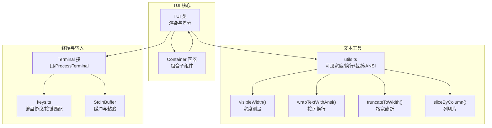
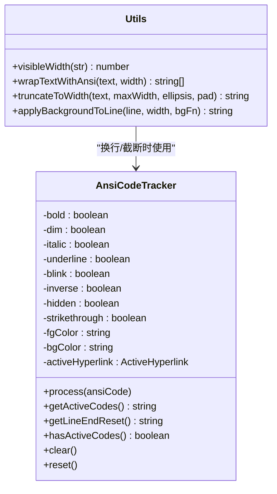
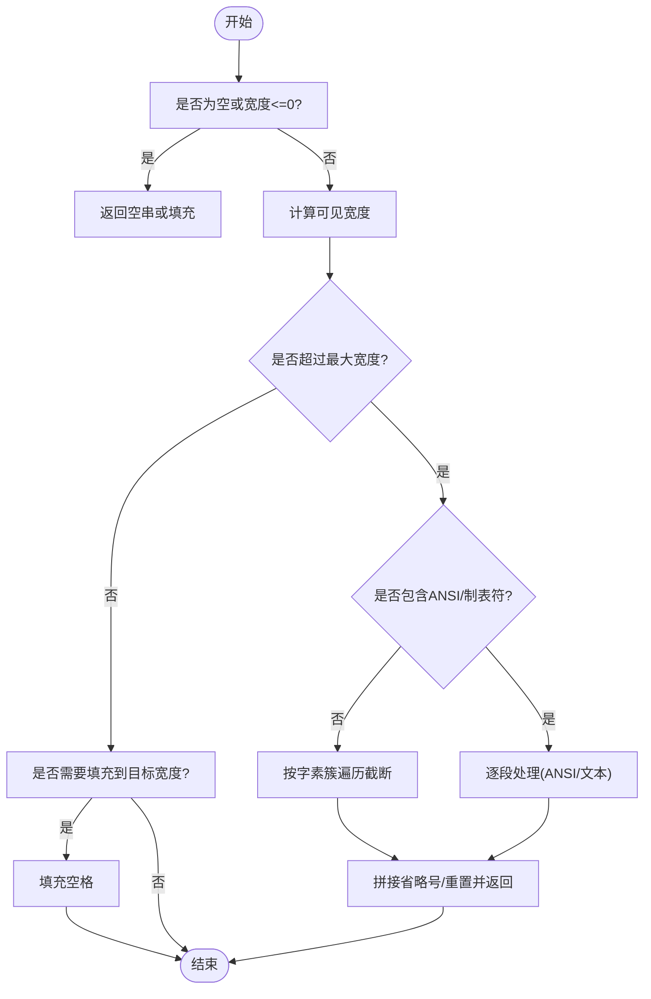
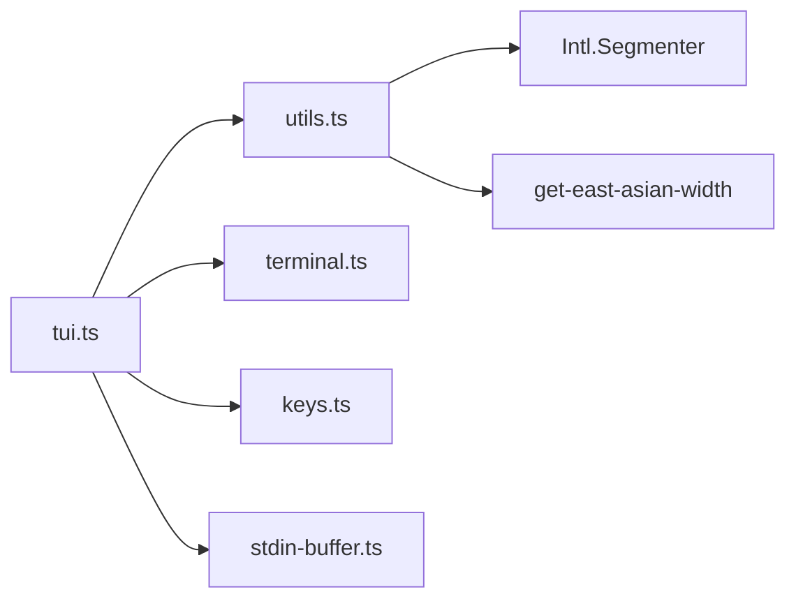

# 文本组件

<cite>
**本文引用的文件**
- [tui.ts](file://packages/tui/src/tui.ts)
- [utils.ts](file://packages/tui/src/utils.ts)
- [terminal.ts](file://packages/tui/src/terminal.ts)
- [keys.ts](file://packages/tui/src/keys.ts)
- [stdin-buffer.ts](file://packages/tui/src/stdin-buffer.ts)
- [tui-render.test.ts](file://packages/tui/test/tui-render.test.ts)
- [virtual-terminal.ts](file://packages/tui/test/virtual-terminal.ts)
</cite>

## 目录
1. [简介](#简介)
2. [项目结构](#项目结构)
3. [核心组件](#核心组件)
4. [架构总览](#架构总览)
5. [详细组件分析](#详细组件分析)
6. [依赖关系分析](#依赖关系分析)
7. [性能考量](#性能考量)
8. [故障排查指南](#故障排查指南)
9. [结论](#结论)
10. [附录：API 参考](#附录api-参考)

## 简介
本文件面向 Pi 终端 UI 库中的“文本组件”能力，系统化阐述其样式系统（颜色、字体样式、背景）、换行与宽度控制（自动换行、手动换行、字符截断）、对齐策略（左/中/右/两端对齐）、渲染优化（差分渲染、缓存、增量更新）以及特殊文本处理（ANSI 转义、Unicode 支持）。同时提供完整 API 参考，帮助开发者在 TUI 中正确使用文本组件并获得最佳性能与体验。

## 项目结构
Pi 的 TUI 包含终端抽象、键盘处理、输入缓冲、工具函数与渲染管线等模块。文本组件的能力由以下文件共同支撑：
- 核心渲染与容器：tui.ts
- 文本宽度测量、ANSI 处理、换行与截断：utils.ts
- 终端接口与实现：terminal.ts
- 键盘协议与按键匹配：keys.ts
- 输入缓冲与粘贴模式：stdin-buffer.ts
- 行为与回归测试：tui-render.test.ts、virtual-terminal.ts



图表来源
- [tui.ts:239-1320](file://packages/tui/src/tui.ts#L239-L1320)
- [utils.ts:209-1149](file://packages/tui/src/utils.ts#L209-L1149)
- [terminal.ts:53-95](file://packages/tui/src/terminal.ts#L53-L95)
- [keys.ts:21-800](file://packages/tui/src/keys.ts#L21-L800)
- [stdin-buffer.ts:274-435](file://packages/tui/src/stdin-buffer.ts#L274-L435)

章节来源
- [tui.ts:1-1320](file://packages/tui/src/tui.ts#L1-L1320)
- [utils.ts:1-1149](file://packages/tui/src/utils.ts#L1-L1149)
- [terminal.ts:1-574](file://packages/tui/src/terminal.ts#L1-L574)
- [keys.ts:1-800](file://packages/tui/src/keys.ts#L1-L800)
- [stdin-buffer.ts:1-435](file://packages/tui/src/stdin-buffer.ts#L1-L435)

## 核心组件
- 文本样式系统
  - 颜色：支持前景/背景色（含 256 色与 RGB），通过 ANSI SGR 控制码实现；文本工具维护状态追踪，确保跨行继承与正确重置。
  - 字体样式：粗体、斜体、下划线、闪烁、反显、隐藏、删除线等，均以 ANSI SGR 实现。
  - 背景色：提供按行应用背景色的工具函数，配合宽度填充实现整行背景覆盖。
- 换行与宽度控制
  - 自动换行：基于词边界进行换行，保留 ANSI 样式，避免将样式切分到行尾。
  - 手动换行：按列切片与可见宽度截断，支持严格模式排除边界宽字符导致的越界。
  - 宽度计算：使用 Unicode 分段与东亚宽度库，结合零宽字符与表情符号启发式判断，保证列宽准确。
- 对齐策略
  - 左对齐：默认行为，文本靠左，右侧用空格填充至目标宽度。
  - 居中对齐：计算左右填充空格数量，使文本在行内居中。
  - 右对齐：文本靠右，左侧填充空格。
  - 两端对齐：通过在单词间插入额外空格实现，提升视觉均匀性（需自定义实现，文本工具提供基础宽度与切片能力）。
- 渲染优化
  - 差分渲染：仅比较首尾变化行，输出最小化增量，显著降低重绘开销。
  - 缓存机制：可见宽度结果缓存，减少重复计算。
  - 增量更新：Overlay 叠加合成时，按列提取前/后段并拼接，避免全行重排。
- 特殊文本处理
  - ANSI 转义：解析/提取/剥离 ANSI 序列，支持链接、光标标记等特殊 APC 序列。
  - Unicode 支持：使用 Intl.Segmenter 进行字素簇分割，正确处理组合字符、表情符号与变体选择器。

章节来源
- [utils.ts:362-582](file://packages/tui/src/utils.ts#L362-L582)
- [utils.ts:659-758](file://packages/tui/src/utils.ts#L659-L758)
- [utils.ts:875-1011](file://packages/tui/src/utils.ts#L875-L1011)
- [utils.ts:1017-1067](file://packages/tui/src/utils.ts#L1017-L1067)
- [tui.ts:953-1280](file://packages/tui/src/tui.ts#L953-L1280)

## 架构总览
TUI 的渲染流程如下：组件生成行文本 → 合成 Overlay → 应用行尾重置 → 差分比较 → 输出最小化增量。文本工具贯穿其中，负责宽度测量、换行与截断、ANSI 解析与样式继承。

```mermaid
sequenceDiagram
participant Comp as "组件(render)"
participant TUI as "TUI.doRender"
participant Over as "compositeOverlays"
participant Utils as "utils.ts"
participant Term as "Terminal"
Comp->>TUI : 返回行数组
TUI->>Over : 叠加所有可见 Overlay
Over->>Utils : 可见宽度/列切片/段提取
Over-->>TUI : 合成后的行数组
TUI->>Utils : 行尾重置(去除样式污染)
TUI->>TUI : 差分比较(首尾变化行)
TUI->>Term : 写入最小化增量
```

图表来源
- [tui.ts:953-1280](file://packages/tui/src/tui.ts#L953-L1280)
- [utils.ts:209-278](file://packages/tui/src/utils.ts#L209-L278)
- [utils.ts:1077-1148](file://packages/tui/src/utils.ts#L1077-L1148)

## 详细组件分析

### 文本样式系统（颜色/字体/背景）
- ANSI 状态追踪
  - 使用状态机跟踪当前激活的 SGR 属性（粗体、斜体、下划线、闪烁、反显、隐藏、删除线、前景/背景色）与活动超链接，确保跨行样式延续与正确关闭。
  - 在行结束处仅关闭必要属性（如仅关闭下划线），避免影响背景色。
- 颜色与样式应用
  - 前景色/背景色支持标准值、256 色与 RGB；通过累积 SGR 参数生成最终样式代码。
  - 提供按行应用背景色的工具函数，先计算需要的填充空格数，再对整行应用背景。
- 样式继承与重置
  - 换行时将当前状态写入新行开头，保证样式连续性；行尾仅做必要重置，避免过度重置造成闪烁或样式污染。



图表来源
- [utils.ts:362-582](file://packages/tui/src/utils.ts#L362-L582)
- [utils.ts:659-758](file://packages/tui/src/utils.ts#L659-L758)
- [utils.ts:853-862](file://packages/tui/src/utils.ts#L853-L862)

章节来源
- [utils.ts:362-582](file://packages/tui/src/utils.ts#L362-L582)
- [utils.ts:853-862](file://packages/tui/src/utils.ts#L853-L862)

### 换行处理机制（自动/手动/宽度计算/截断）
- 自动换行（按词）
  - 将文本拆分为带 ANSI 附着的 token，逐个尝试加入当前行；若超过宽度则换行，并在行尾仅关闭必要属性。
  - 对过长 token（如 URL）采用字符级拆分，保持样式连续。
- 手动换行（列切片）
  - 基于可见宽度进行列切片，支持严格模式排除边界宽字符导致的越界。
- 宽度计算
  - 使用 Intl.Segmenter 对字素簇分割，结合东亚宽度与表情符号启发式，剔除零宽字符与非打印字符，得到准确的列宽。
- 截断
  - 支持添加省略号与可选的右侧填充至目标宽度；对 ANSI 与制表符进行特殊处理，避免破坏样式与对齐。



图表来源
- [utils.ts:875-1011](file://packages/tui/src/utils.ts#L875-L1011)
- [utils.ts:1017-1067](file://packages/tui/src/utils.ts#L1017-L1067)

章节来源
- [utils.ts:659-758](file://packages/tui/src/utils.ts#L659-L758)
- [utils.ts:875-1011](file://packages/tui/src/utils.ts#L875-L1011)
- [utils.ts:1017-1067](file://packages/tui/src/utils.ts#L1017-L1067)

### 对齐选项（左/中/右/两端）
- 左对齐：默认，无需额外处理。
- 居中对齐：计算左右填充空格数量，使文本在行内居中。
- 右对齐：计算左侧填充空格数量，使文本靠右。
- 两端对齐：在单词之间插入额外空格，使每行宽度达到目标宽度。该逻辑需自定义实现，文本工具提供宽度与切片的基础能力。

章节来源
- [utils.ts:853-862](file://packages/tui/src/utils.ts#L853-L862)
- [utils.ts:1017-1067](file://packages/tui/src/utils.ts#L1017-L1067)

### 文本渲染优化（差分渲染/缓存/增量更新）
- 差分渲染
  - 计算首尾变化行范围，仅输出变更区域，避免全屏重绘。
  - 对 Overlay 叠加采用单次扫描提取前/后段并拼接，避免多次重排。
- 缓存机制
  - 可见宽度结果缓存，命中后直接返回，降低重复计算。
- 增量更新
  - Overlay 布局解析与合成时，严格限制宽度与高度，确保叠加层不越界。
  - 行尾重置与样式继承在差分路径中保持一致，避免样式污染。

```mermaid
sequenceDiagram
participant TUI as "TUI.doRender"
participant Diff as "差分比较"
participant Over as "Overlay合成"
participant Term as "Terminal"
TUI->>Diff : 比较前后行差异
Diff-->>TUI : 首/末变化行索引
TUI->>Over : 合成可见 Overlay
Over-->>TUI : 合成后的行数组
TUI->>Term : 写入增量输出
```

图表来源
- [tui.ts:1053-1148](file://packages/tui/src/tui.ts#L1053-L1148)
- [tui.ts:757-817](file://packages/tui/src/tui.ts#L757-L817)

章节来源
- [tui.ts:953-1280](file://packages/tui/src/tui.ts#L953-L1280)
- [utils.ts:44-47](file://packages/tui/src/utils.ts#L44-L47)

### 特殊文本处理（ANSI/Unicode/Mardown）
- ANSI 转义
  - 解析/剥离/重建 ANSI 序列，支持 SGR、超链接、光标标记等；在行尾仅关闭必要属性，避免样式泄漏。
- Unicode 支持
  - 使用 Intl.Segmenter 对字素簇进行分割，正确处理组合字符、表情符号与变体选择器；对零宽字符与非打印字符进行剔除。
- Markdown 渲染
  - 当前仓库未提供 Markdown 到 ANSI 的转换器；可在上层组件中自行实现 Markdown 解析并在文本工具中应用样式与换行。

章节来源
- [utils.ts:283-321](file://packages/tui/src/utils.ts#L283-L321)
- [utils.ts:209-278](file://packages/tui/src/utils.ts#L209-L278)

## 依赖关系分析
- TUI 依赖 utils 提供的宽度测量、换行与截断能力；依赖 terminal 提供的终端接口与实现；依赖 keys 与 stdin-buffer 处理键盘与输入缓冲。
- utils 内部依赖 Intl.Segmenter 与外部东亚宽度库，确保 Unicode 与多语言场景下的宽度计算准确。



图表来源
- [tui.ts:1-1320](file://packages/tui/src/tui.ts#L1-L1320)
- [utils.ts:1-47](file://packages/tui/src/utils.ts#L1-L47)
- [terminal.ts:1-95](file://packages/tui/src/terminal.ts#L1-L95)
- [keys.ts:1-40](file://packages/tui/src/keys.ts#L1-L40)
- [stdin-buffer.ts:1-25](file://packages/tui/src/stdin-buffer.ts#L1-L25)

章节来源
- [tui.ts:1-1320](file://packages/tui/src/tui.ts#L1-L1320)
- [utils.ts:1-47](file://packages/tui/src/utils.ts#L1-L47)

## 性能考量
- 可见宽度缓存：容量固定，淘汰最旧条目，避免内存膨胀。
- 差分渲染：仅输出变化区域，显著降低 CPU 与 I/O 开销。
- Overlay 合成：单次扫描提取前/后段并拼接，避免多次字符串拼接。
- 行尾重置：仅关闭必要属性，减少不必要的 ANSI 序列输出。
- 终端尺寸变化：宽度变化强制全量重绘，高度变化在特定环境下避免全量重绘，减少历史回滚。

章节来源
- [utils.ts:44-47](file://packages/tui/src/utils.ts#L44-L47)
- [tui.ts:1029-1042](file://packages/tui/src/tui.ts#L1029-L1042)
- [tui.ts:1075-1077](file://packages/tui/src/tui.ts#L1075-L1077)

## 故障排查指南
- 渲染溢出错误
  - 现象：某行可见宽度超过终端宽度，抛出异常并记录调试日志。
  - 排查：确认组件输出已使用可见宽度测量与列切片；检查是否存在未截断的长行。
- 样式泄漏
  - 现象：行尾样式影响后续行或背景色异常。
  - 排查：确保使用行尾重置；检查是否在换行时正确继承与关闭样式。
- Overlay 越界
  - 现象：叠加层超出终端边界。
  - 排查：确认 Overlay 布局解析与裁剪逻辑；检查宽度与高度上限设置。
- 高度变化抖动
  - 现象：Termux 下高度变化频繁导致界面抖动。
  - 排查：利用环境变量或 API 控制全量重绘策略。

章节来源
- [tui.ts:1174-1210](file://packages/tui/src/tui.ts#L1174-L1210)
- [tui.ts:1035-1042](file://packages/tui/src/tui.ts#L1035-L1042)
- [tui.ts:623-721](file://packages/tui/src/tui.ts#L623-L721)

## 结论
Pi 的 TUI 文本组件以 utils 为核心，提供精确的 Unicode 宽度测量、稳健的 ANSI 样式处理与高效的换行/截断算法；结合 TUI 的差分渲染与 Overlay 合成，实现了高性能、可扩展的终端文本显示。开发者可在此基础上构建富文本 UI，同时遵循样式继承与行尾重置的最佳实践，确保跨平台与多语言场景下的稳定表现。

## 附录：API 参考

- 可见宽度测量
  - 函数：visibleWidth(str)
  - 功能：计算字符串在终端中的可见列宽，内部处理 ANSI、制表符与零宽字符。
  - 复杂度：近似 O(n)，n 为字符串长度。
  - 适用场景：宽度计算、截断、对齐填充。
  - 参考路径：[utils.ts:209-264](file://packages/tui/src/utils.ts#L209-L264)

- 按词自动换行
  - 函数：wrapTextWithAnsi(text, width)
  - 功能：按词边界换行，保留 ANSI 样式，避免将样式切分到行尾。
  - 注意：不进行背景色填充，仅返回行数组。
  - 参考路径：[utils.ts:659-679](file://packages/tui/src/utils.ts#L659-L679)

- 按宽截断
  - 函数：truncateToWidth(text, maxWidth, ellipsis, pad)
  - 功能：将文本截断到指定宽度，可选添加省略号与右侧填充。
  - 参考路径：[utils.ts:875-1011](file://packages/tui/src/utils.ts#L875-L1011)

- 列切片与宽度
  - 函数：sliceByColumn(line, startCol, length, strict)
  - 函数：sliceWithWidth(line, startCol, length, strict)
  - 功能：从指定列位置切片，支持严格模式排除边界宽字符。
  - 参考路径：[utils.ts:1017-1067](file://packages/tui/src/utils.ts#L1017-L1067)

- 按行应用背景色
  - 函数：applyBackgroundToLine(line, width, bgFn)
  - 功能：对整行（含填充空格）应用背景色函数。
  - 参考路径：[utils.ts:853-862](file://packages/tui/src/utils.ts#L853-L862)

- ANSI 状态追踪
  - 类：AnsiCodeTracker
  - 功能：跟踪并生成当前激活的 SGR 属性与超链接，支持行尾重置。
  - 参考路径：[utils.ts:362-582](file://packages/tui/src/utils.ts#L362-L582)

- 终端接口
  - 接口：Terminal
  - 实现：ProcessTerminal
  - 功能：提供写入、尺寸查询、标题设置、进度指示等能力。
  - 参考路径：[terminal.ts:53-95](file://packages/tui/src/terminal.ts#L53-L95), [terminal.ts:100-574](file://packages/tui/src/terminal.ts#L100-L574)

- 键盘协议与按键匹配
  - 功能：支持 Kitty 协议与传统序列，提供按键匹配与事件类型识别。
  - 参考路径：[keys.ts:21-800](file://packages/tui/src/keys.ts#L21-L800)

- 输入缓冲
  - 类：StdinBuffer
  - 功能：缓冲 stdin 数据，按完整序列发出 data/paste 事件，处理粘贴模式。
  - 参考路径：[stdin-buffer.ts:274-435](file://packages/tui/src/stdin-buffer.ts#L274-L435)

- TUI 渲染与 Overlay
  - 类：TUI
  - 功能：差分渲染、Overlay 叠加合成、硬件光标定位、全量/增量重绘控制。
  - 参考路径：[tui.ts:239-1320](file://packages/tui/src/tui.ts#L239-L1320)

- 测试与验证
  - 文件：tui-render.test.ts、virtual-terminal.ts
  - 功能：覆盖差分渲染、Overlay 合成、样式重置、尺寸变化等场景。
  - 参考路径：[tui-render.test.ts:1-592](file://packages/tui/test/tui-render.test.ts#L1-L592), [virtual-terminal.ts:1-219](file://packages/tui/test/virtual-terminal.ts#L1-L219)