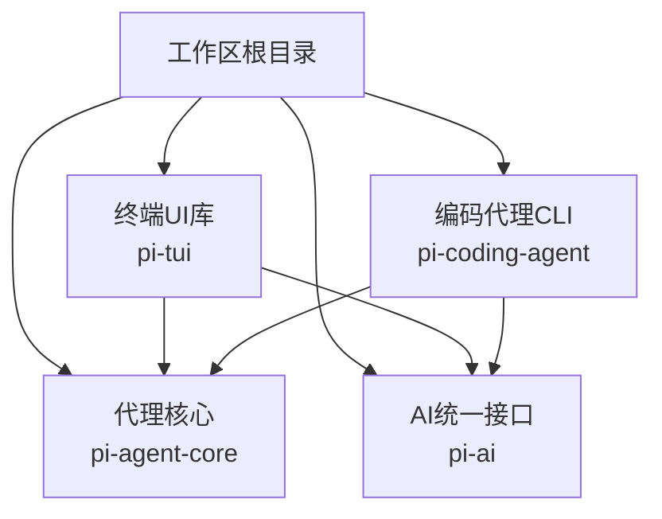
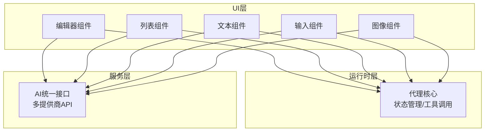
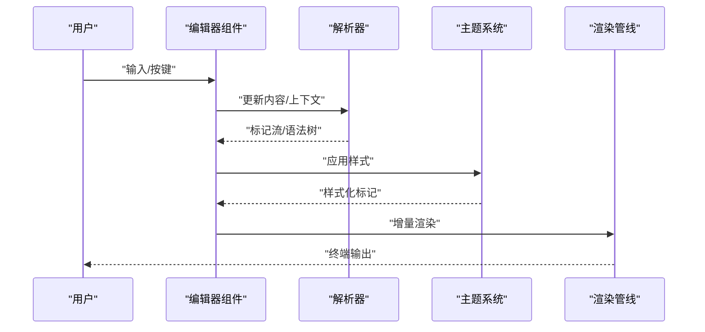
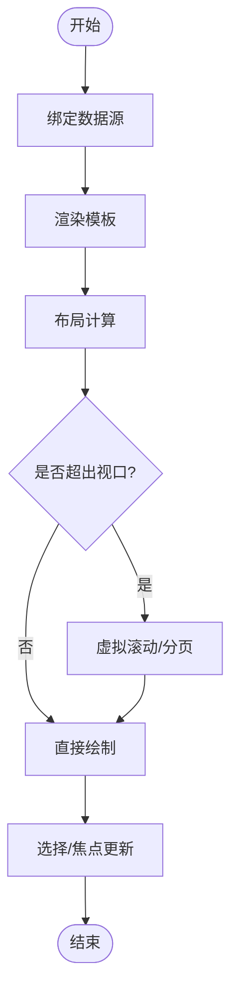
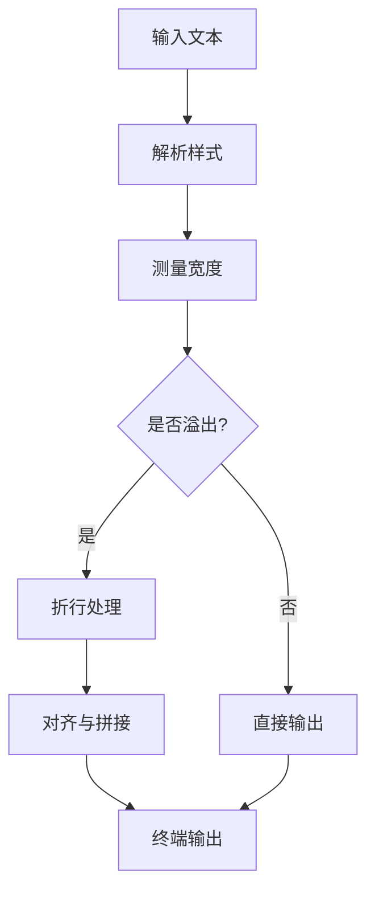
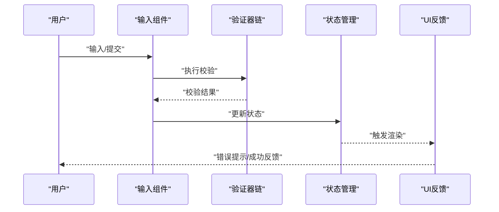
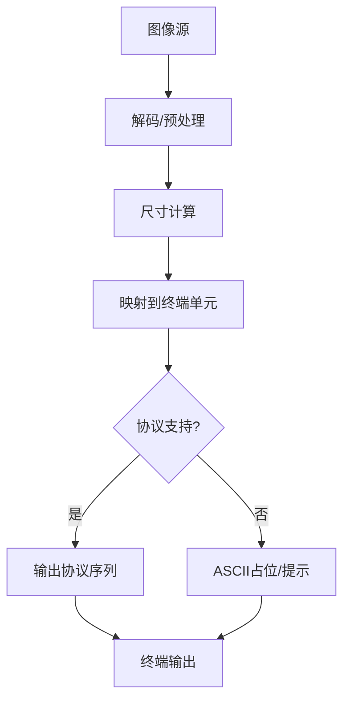
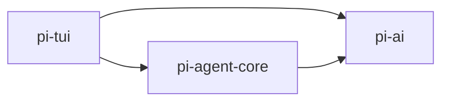

# 核心组件系统

<cite>
**本文档引用的文件**
- [README.md](file://README.md)
- [package.json](file://package.json)
- [AGENTS.md](file://AGENTS.md)
</cite>

## 目录
1. [简介](#简介)
2. [项目结构](#项目结构)
3. [核心组件](#核心组件)
4. [架构总览](#架构总览)
5. [详细组件分析](#详细组件分析)
6. [依赖分析](#依赖分析)
7. [性能考虑](#性能考虑)
8. [故障排除指南](#故障排除指南)
9. [结论](#结论)
10. [附录](#附录)

## 简介
本文件面向Pi终端UI库（Terminal UI Library）的核心组件系统，围绕编辑器、列表、文本、输入与图像五大类组件，系统性梳理其功能特性、交互流程与可扩展点。根据仓库信息，Pi是一个多包工作区（monorepo），其中包含终端UI库（pi-tui）。尽管当前仓库未直接提供组件源码，但通过构建脚本、README与开发规范等元数据，可以明确组件体系的定位与发展方向：终端UI库具备“差异化渲染”能力，强调在终端环境中高效、稳定地呈现与交互。

本指南旨在帮助开发者快速理解组件边界、配置项与最佳实践，同时为后续源码补充提供一致的参考框架。

## 项目结构
从工作区配置可见，项目采用多包组织方式，核心包包括：
- pi-tui：终端UI库（含差异化渲染）
- pi-agent-core：代理运行时与工具调用
- pi-ai：统一多提供商LLM API
- pi-coding-agent：交互式编码代理CLI

构建脚本中明确调用各包的构建流程，表明组件系统与运行时、AI服务存在分层协作关系。

**图表来源**
- [package.json:12-14](file://package.json#L12-L14)
- [README.md:55](file://README.md#L55)

**章节来源**
- [package.json:1-60](file://package.json#L1-L60)
- [README.md:48-57](file://README.md#L48-L57)

## 核心组件
本节概述五类核心组件的功能定位与通用职责，便于在后续章节中展开具体实现细节。

- 编辑器组件
  - 职责：在终端内提供语法高亮、自动补全与多行编辑能力，适配不同语言与主题。
  - 关键能力：内容解析、光标与选区管理、增量渲染、键盘与快捷键处理。
  - 扩展点：语言方言、主题、补全策略、快捷键映射。

- 列表组件
  - 职责：展示与导航大量条目，支持数据绑定、滚动控制与选择机制。
  - 关键能力：虚拟化/分页、焦点移动、键盘导航、选择态同步。
  - 扩展点：渲染模板、排序/过滤、分组与层级。

- 文本组件
  - 职责：在终端中渲染富文本，支持样式、换行与对齐。
  - 关键能力：样式叠加、宽度测量、折行策略、对齐布局。
  - 扩展点：字体样式、颜色方案、段落格式。

- 输入组件
  - 职责：收集用户输入并进行校验，触发事件与状态更新。
  - 关键能力：输入监听、验证规则、错误提示、状态持久化。
  - 扩展点：校验器链、事件钩子、状态存储。

- 图像组件
  - 职责：在终端中渲染图像，支持尺寸计算与协议适配。
  - 关键能力：像素到终端单元映射、缩放与裁剪、协议桥接。
  - 扩展点：渲染后端、缓存策略、异步加载。

**章节来源**
- [README.md:55](file://README.md#L55)

## 架构总览
下图展示了终端UI库与代理核心、AI服务之间的协作关系。编辑器、列表、文本、输入与图像组件作为UI层，依赖代理核心的状态管理与工具调用能力；同时通过AI服务获取模型能力（如代码补全、生成建议等）。

**图表来源**
- [README.md:55](file://README.md#L55)
- [package.json:12-14](file://package.json#L12-L14)

## 详细组件分析

### 编辑器组件
- 功能要点
  - 语法高亮：基于语言方言与主题，对文本进行词法/语法着色，提升可读性。
  - 自动补全：结合上下文与历史，提供候选列表与插入逻辑。
  - 多行编辑：支持跨行操作、块选择、撤销重做与增量渲染。
- 数据流
  - 输入事件 → 解析器 → 语法树/标记流 → 渲染管线 → 主题应用 → 终端输出。
- 配置选项（示意）
  - 语言模式、主题、自动补全开关、Tab宽度、行号显示、只读模式。
- 使用示例（路径指引）
  - 参考构建脚本中的调用位置，确认编辑器在工作流中的集成点：[package.json:12-14](file://package.json#L12-L14)
- 错误处理
  - 语法解析失败回退至纯文本；补全请求超时降级为静态提示；渲染异常时保护性清屏。

**图表来源**
- [README.md:55](file://README.md#L55)

**章节来源**
- [README.md:55](file://README.md#L55)
- [package.json:12-14](file://package.json#L12-L14)

### 列表组件
- 功能要点
  - 数据绑定：支持数组/对象集合，动态增删改。
  - 滚动控制：虚拟滚动或分页，保证大列表性能。
  - 选择机制：单选/多选、焦点态、键盘导航与快捷键。
- 数据流
  - 数据源 → 渲染模板 → 布局计算 → 视口裁剪 → 终端绘制。
- 配置选项（示意）
  - 数据字段映射、模板函数、排序/过滤器、分页大小、占位符。
- 使用示例（路径指引）
  - 在代理交互中作为命令/文件/会话列表展示：[AGENTS.md:92-101](file://AGENTS.md#L92-L101)

**图表来源**
- [AGENTS.md:92-101](file://AGENTS.md#L92-L101)

**章节来源**
- [AGENTS.md:92-101](file://AGENTS.md#L92-L101)

### 文本组件
- 功能要点
  - 样式系统：支持颜色、粗体、斜体、下划线等终端可用样式叠加。
  - 换行处理：按终端宽度自动折行，避免断字破坏语义。
  - 对齐选项：左对齐、居中、右对齐与两端对齐。
- 数据流
  - 文本内容 → 样式解析 → 宽度测量 → 折行算法 → 终端输出。
- 配置选项（示意）
  - 字体样式、颜色方案、最大宽度、换行策略、对齐方式。
- 使用示例（路径指引）
  - 在终端中展示说明、提示与状态信息：[AGENTS.md:92-101](file://AGENTS.md#L92-L101)

**图表来源**
- [AGENTS.md:92-101](file://AGENTS.md#L92-L101)

**章节来源**
- [AGENTS.md:92-101](file://AGENTS.md#L92-L101)

### 输入组件
- 功能要点
  - 验证规则：内置正则/回调校验，支持异步校验。
  - 事件处理：输入变更、失焦、提交、清空等事件钩子。
  - 状态管理：内部状态与外部状态双向绑定，支持默认值与受控模式。
- 数据流
  - 用户输入 → 验证器链 → 状态更新 → 回调触发 → UI反馈。
- 配置选项（示意）
  - 占位符、类型（文本/数字/密码）、必填、最小/最大长度、自定义校验器。
- 使用示例（路径指引）
  - 在交互式会话中收集用户指令与参数：[AGENTS.md:92-101](file://AGENTS.md#L92-L101)

**图表来源**
- [AGENTS.md:92-101](file://AGENTS.md#L92-L101)

**章节来源**
- [AGENTS.md:92-101](file://AGENTS.md#L92-L101)

### 图像组件
- 功能要点
  - 渲染机制：将像素数据映射为终端单元（如ANSI块/半块），实现灰阶与色彩近似。
  - 尺寸计算：根据终端字符宽高比与目标宽度/高度，计算缩放与裁剪策略。
  - 协议支持：兼容常见终端图像协议（如iTerm2、Kitty等），或回退至ASCII占位。
- 数据流
  - 图像源 → 编解码/预处理 → 尺寸计算 → 映射到终端单元 → 输出协议/ANSI序列。
- 配置选项（示意）
  - 图像源（URL/本地/内存）、宽高、对齐、透明度处理、协议选择。
- 使用示例（路径指引）
  - 在终端中展示图表、图标与预览：[AGENTS.md:92-101](file://AGENTS.md#L92-L101)

**图表来源**
- [AGENTS.md:92-101](file://AGENTS.md#L92-L101)

**章节来源**
- [AGENTS.md:92-101](file://AGENTS.md#L92-L101)

## 依赖分析
- 包间耦合
  - 终端UI库与代理核心：UI层依赖运行时的状态与工具调用能力。
  - 终端UI库与AI服务：编辑器与列表等组件可调用AI能力（如补全、生成）。
- 外部依赖
  - 构建与质量保障：Biome、TypeScript、esbuild等工具贯穿各包。
- 版本与发布
  - 工作区采用锁步版本策略，确保包间一致性与可追踪性。

**图表来源**
- [README.md:55](file://README.md#L55)
- [package.json:12-14](file://package.json#L12-L14)

**章节来源**
- [README.md:55](file://README.md#L55)
- [package.json:12-14](file://package.json#L12-L14)

## 性能考虑
- 渲染优化
  - 差异化渲染：仅重绘变化区域，降低终端刷新开销。
  - 虚拟化：长列表采用虚拟滚动，限制DOM/绘制节点数量。
- 计算优化
  - 文本换行与宽度测量：缓存测量结果，避免重复计算。
  - 图像映射：批量像素处理与向量化操作，减少循环次数。
- I/O优化
  - 输入组件：防抖与节流，合并高频事件。
  - 图像组件：懒加载与渐进式渲染，避免阻塞主线程。

## 故障排除指南
- 编辑器
  - 症状：语法高亮异常或补全无响应
  - 排查：检查语言方言与主题配置；确认AI服务可用性；查看解析器日志。
- 列表
  - 症状：滚动卡顿或选择错乱
  - 排查：检查数据源稳定性；确认虚拟化参数；验证模板函数。
- 文本
  - 症状：换行错位或对齐异常
  - 排查：检查终端宽度与字体设置；核对样式叠加顺序。
- 输入
  - 症状：校验不生效或状态不更新
  - 排查：检查验证器链顺序与返回值；确认受控/非受控模式。
- 图像
  - 症状：渲染模糊或终端不支持
  - 排查：调整缩放与裁剪策略；切换协议或回退至ASCII提示。

## 结论
Pi终端UI库以“差异化渲染”为核心，围绕编辑器、列表、文本、输入与图像五大组件构建了完整的终端交互体系。通过与代理核心和AI服务的分层协作，组件既满足基础展示需求，又具备扩展与集成能力。建议在后续开发中优先完善组件API文档与测试覆盖，确保在多终端环境下的稳定性与一致性。

## 附录
- 快速启动
  - 在受控终端中运行TUI交互模式：[AGENTS.md:92-101](file://AGENTS.md#L92-L101)
- 构建与测试
  - 全量构建与检查：[package.json:12-14](file://package.json#L12-L14)，[package.json:15](file://package.json#L15)
- 包说明
  - 终端UI库：Terminal UI library with differential rendering：[README.md:55](file://README.md#L55)