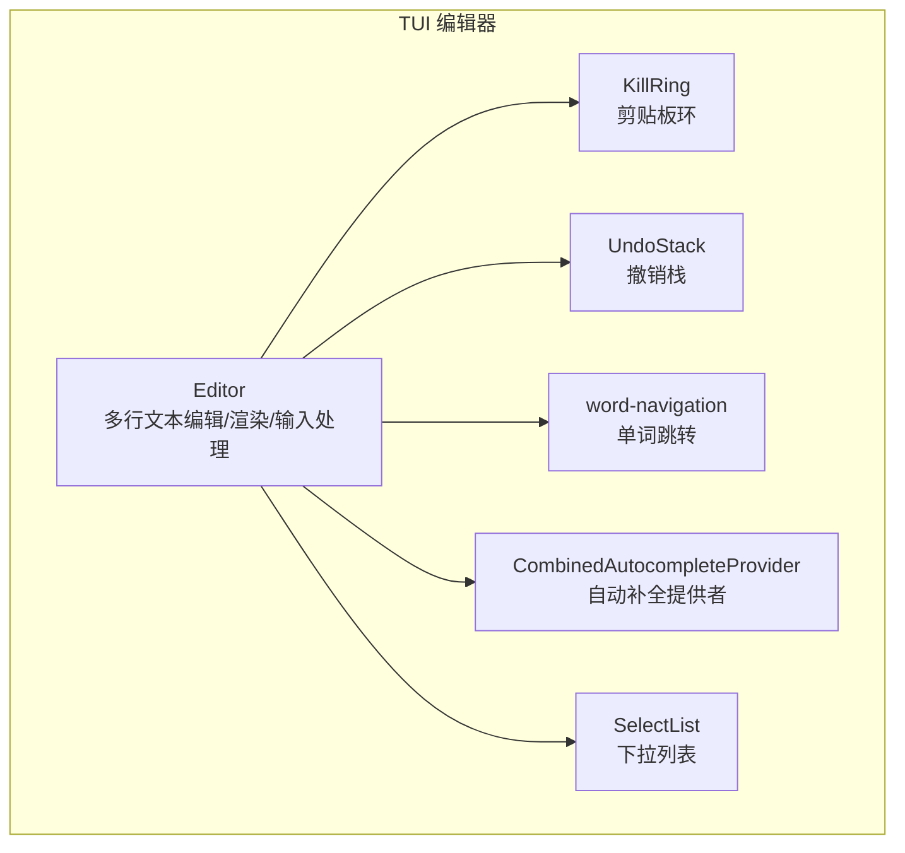
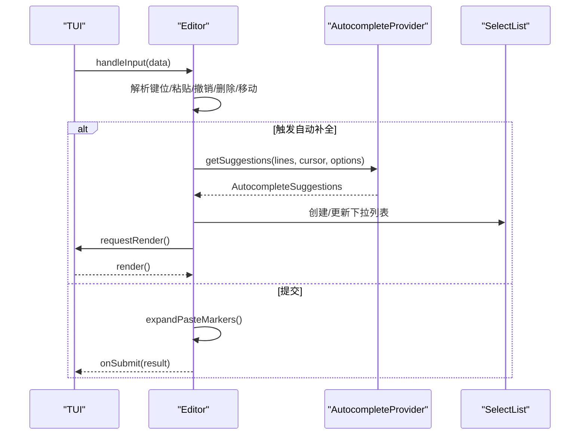
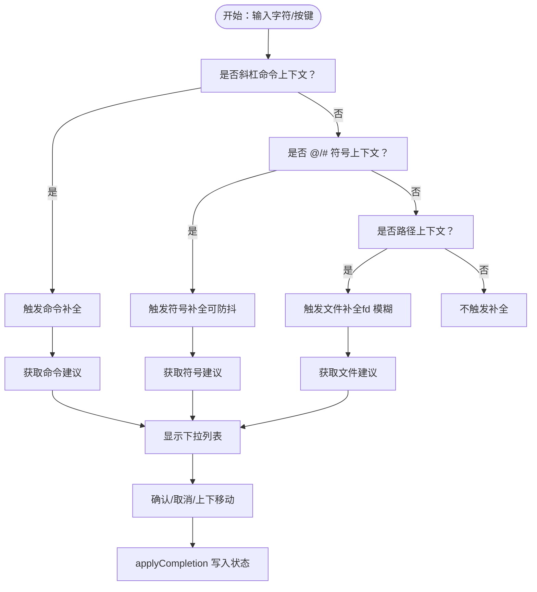
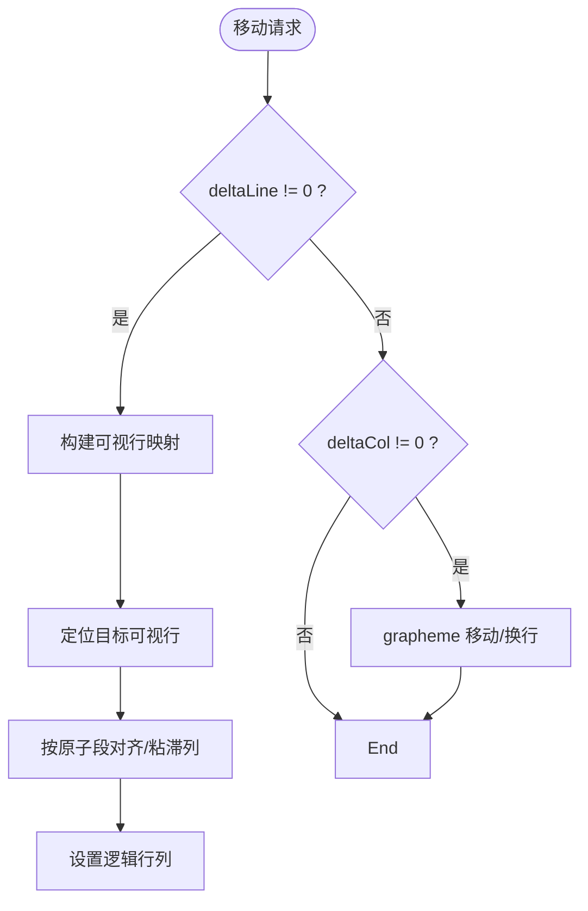
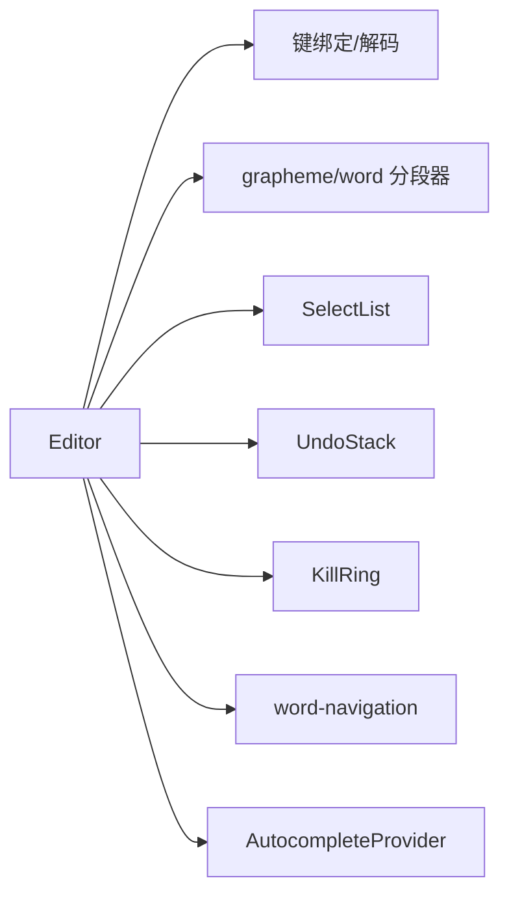

# 编辑器组件

<cite>
**本文引用的文件**
- [packages/tui/src/components/editor.ts](file://packages/tui/src/components/editor.ts)
- [packages/tui/src/editor-component.ts](file://packages/tui/src/editor-component.ts)
- [packages/tui/src/kill-ring.ts](file://packages/tui/src/kill-ring.ts)
- [packages/tui/src/undo-stack.ts](file://packages/tui/src/undo-stack.ts)
- [packages/tui/src/word-navigation.ts](file://packages/tui/src/word-navigation.ts)
- [packages/tui/src/autocomplete.ts](file://packages/tui/src/autocomplete.ts)
- [packages/tui/src/components/select-list.ts](file://packages/tui/src/components/select-list.ts)
- [packages/tui/test/editor.test.ts](file://packages/tui/test/editor.test.ts)
</cite>

## 目录
1. [简介](#简介)
2. [项目结构](#项目结构)
3. [核心组件](#核心组件)
4. [架构总览](#架构总览)
5. [详细组件分析](#详细组件分析)
6. [依赖关系分析](#依赖关系分析)
7. [性能考量](#性能考量)
8. [故障排查指南](#故障排查指南)
9. [结论](#结论)
10. [附录：API 参考](#附录api-参考)

## 简介
本文件面向 Pi 终端 UI 库中的“编辑器组件”，系统性梳理其多行文本编辑、语法高亮（通过主题与渲染实现）、自动补全、撤销/重做、光标导航、粘贴处理（含括号粘贴模式与大文本占位标记）、历史记录、Emacs 风格 kill/yank 操作与剪贴板环、字符跳跃模式等能力。文档同时提供可视化流程图与时序图，帮助开发者快速理解实现原理与使用方式。

## 项目结构
编辑器组件位于 TUI 包中，围绕“编辑器”“自动补全”“选择列表”“撤销栈”“kill 环”“单词导航”等模块协同工作，测试用例覆盖历史浏览、Unicode 文本、回车换行兼容、自动补全触发与应用等关键行为。

图表来源
- [packages/tui/src/components/editor.ts](file://packages/tui/src/components/editor.ts)
- [packages/tui/src/kill-ring.ts](file://packages/tui/src/kill-ring.ts)
- [packages/tui/src/undo-stack.ts](file://packages/tui/src/undo-stack.ts)
- [packages/tui/src/word-navigation.ts](file://packages/tui/src/word-navigation.ts)
- [packages/tui/src/autocomplete.ts](file://packages/tui/src/autocomplete.ts)
- [packages/tui/src/components/select-list.ts](file://packages/tui/src/components/select-list.ts)

章节来源
- [packages/tui/src/components/editor.ts](file://packages/tui/src/components/editor.ts)
- [packages/tui/src/editor-component.ts](file://packages/tui/src/editor-component.ts)

## 核心组件
- Editor：多行文本编辑器主体，负责输入处理、布局与渲染、撤销/重做、历史记录、自动补全、粘贴处理、kill/yank、字符跳跃、垂直滚动等。
- KillRing：剪贴板环，支持连续 kill 合并、yank/yank-pop 循环。
- UndoStack：通用撤销栈，深拷贝快照，支持撤销与清空。
- word-navigation：单词级跳转工具，结合粘贴标记原子化处理。
- CombinedAutocompleteProvider：自动补全提供者，支持斜杠命令、文件路径与附件（@）补全，带防抖与请求去重。
- SelectList：自动补全下拉列表，支持筛选、选中项变更、滚动提示。

章节来源
- [packages/tui/src/components/editor.ts](file://packages/tui/src/components/editor.ts)
- [packages/tui/src/kill-ring.ts](file://packages/tui/src/kill-ring.ts)
- [packages/tui/src/undo-stack.ts](file://packages/tui/src/undo-stack.ts)
- [packages/tui/src/word-navigation.ts](file://packages/tui/src/word-navigation.ts)
- [packages/tui/src/autocomplete.ts](file://packages/tui/src/autocomplete.ts)
- [packages/tui/src/components/select-list.ts](file://packages/tui/src/components/select-list.ts)

## 架构总览
编辑器采用“输入解析 → 动作分发 → 状态更新 → 渲染输出”的循环。输入层统一由 handleInput 接收，再根据键位匹配调用相应处理函数；状态变更通过 pushUndoSnapshot 记录快照；渲染时按可视宽度进行词法感知的折行布局；自动补全通过 Provider 异步获取建议并以 SelectList 呈现。

图表来源
- [packages/tui/src/components/editor.ts](file://packages/tui/src/components/editor.ts)
- [packages/tui/src/autocomplete.ts](file://packages/tui/src/autocomplete.ts)
- [packages/tui/src/components/select-list.ts](file://packages/tui/src/components/select-list.ts)

## 详细组件分析

### 多行文本编辑与渲染
- 文本存储：以字符串数组表示逻辑行，游标位置包含行号与列号。
- 折行布局：基于 grapheme 分段器与可视宽度计算，支持单词边界优先折行与宽字符安全。
- 光标渲染：在当前可视行插入反色高亮占位，支持 padding 与滚动指示。
- 边框与主题：通过主题函数控制边框颜色，支持自定义选择列表主题。

章节来源
- [packages/tui/src/components/editor.ts](file://packages/tui/src/components/editor.ts)

### 自动补全机制
- 触发策略：
  - 斜杠命令：在首行且前缀为“/”时触发，支持命令名与参数两阶段补全。
  - 文件路径：在“@”或路径上下文触发，支持模糊搜索 fd（尊重 .gitignore）。
  - 符号补全：在“@”“#”后触发，带空格/制表符边界判断。
- 防抖与并发：对符号类补全启用短延迟，避免频繁请求；请求携带令牌与快照，确保响应与输入一致。
- UI 展示：SelectList 支持主列宽度自适应、描述列截断、滚动提示与选中项变更通知。
- 应用补全：调用 Provider.applyCompletion 计算新文本与游标位置，原子写入状态。

图表来源
- [packages/tui/src/components/editor.ts](file://packages/tui/src/components/editor.ts)
- [packages/tui/src/autocomplete.ts](file://packages/tui/src/autocomplete.ts)
- [packages/tui/src/components/select-list.ts](file://packages/tui/src/components/select-list.ts)

章节来源
- [packages/tui/src/components/editor.ts](file://packages/tui/src/components/editor.ts)
- [packages/tui/src/autocomplete.ts](file://packages/tui/src/autocomplete.ts)
- [packages/tui/src/components/select-list.ts](file://packages/tui/src/components/select-list.ts)

### 撤销/重做系统
- 快照策略：每次可合并的文本输入（如连续字母）仅记录一次快照，空格会分割单元，保证粒度合理。
- 撤销栈：使用 structuredClone 深拷贝状态，弹出即恢复到上一状态；支持 clear。
- 与历史浏览协作：进入历史浏览时会推入快照，返回空态时清空编辑区。

章节来源
- [packages/tui/src/components/editor.ts](file://packages/tui/src/components/editor.ts)
- [packages/tui/src/undo-stack.ts](file://packages/tui/src/undo-stack.ts)

### 光标导航与移动
- 字符级移动：按 grapheme 单元移动，正确处理 emoji、组合字符与粘贴标记原子段。
- 行首/行尾：直接设置列位置。
- 单词跳转：findWordBackward/findWordForward 结合 wordSegmenter，跳过空白与标点，支持粘贴标记作为原子单位。
- 上下移动：构建可视行映射，按可视列“粘滞”移动，避免落在宽字符中间；支持 PageUp/PageDown 页滚动。
- 跳跃模式：支持字符前向/后向跳转，多行搜索，大小写敏感。

图表来源
- [packages/tui/src/components/editor.ts](file://packages/tui/src/components/editor.ts)
- [packages/tui/src/word-navigation.ts](file://packages/tui/src/word-navigation.ts)

章节来源
- [packages/tui/src/components/editor.ts](file://packages/tui/src/components/editor.ts)
- [packages/tui/src/word-navigation.ts](file://packages/tui/src/word-navigation.ts)

### 粘贴处理机制
- 括号粘贴模式：识别 bracketed paste 开始/结束序列，缓冲内容后再处理。
- 大文本优化：超过阈值（行数/字符数）时，将实际内容存入 paste 环并插入占位标记，渲染时按需展开。
- 控制字节解码：对某些终端将控制字节编码为 CSI-u 的情况做还原，避免误删或泄漏。
- 过滤与规范化：剔除不可打印字符（保留换行），路径粘贴前后置空格处理，Tab 展开为空格。

章节来源
- [packages/tui/src/components/editor.ts](file://packages/tui/src/components/editor.ts)

### 历史记录与上下箭头导航
- 历史存储：addToHistory 过滤空串与连续重复，限制最大长度。
- 浏览模式：首次进入历史时推入快照；Up/Down 在历史条目间切换；到达顶部/底部时允许在条目内上下移动；退出历史时清空编辑区。
- 与多行历史条目协作：在多行条目内部可上下移动，离开条目范围后回到空态或更旧条目。

章节来源
- [packages/tui/src/components/editor.ts](file://packages/tui/src/components/editor.ts)
- [packages/tui/test/editor.test.ts](file://packages/tui/test/editor.test.ts)

### Emacs 风格 kill/yank 与剪贴板环
- killRing：支持 prepend/append 合并与 rotate，yank/yank-pop 原子替换最近/轮换项。
- 删除动作：toStart/end/word/backward/forward 均写入 killRing，方向决定合并顺序。
- yank：单行或多行插入，游标位置随之调整；yankPop 仅在刚 yank 后可用。

章节来源
- [packages/tui/src/kill-ring.ts](file://packages/tui/src/kill-ring.ts)
- [packages/tui/src/components/editor.ts](file://packages/tui/src/components/editor.ts)

### 语法高亮
- 实现方式：通过主题函数对边框与内容进行着色；渲染时对光标字符应用反色高亮。
- 注意：编辑器本身不内置语言解析器，高亮由外部主题与渲染管线完成。

章节来源
- [packages/tui/src/components/editor.ts](file://packages/tui/src/components/editor.ts)

## 依赖关系分析
- Editor 依赖：键盘绑定、键值解码、grapheme/word 分段器、选择列表、撤销栈、kill 环、单词导航、自动补全提供者。
- 自动补全：CombinedAutocompleteProvider 依赖文件系统与 fd 工具，支持模糊匹配与目录优先排序。
- 下拉列表：SelectList 依赖键绑定与可见宽度计算，提供滚动与选中项通知。

图表来源
- [packages/tui/src/components/editor.ts](file://packages/tui/src/components/editor.ts)
- [packages/tui/src/components/select-list.ts](file://packages/tui/src/components/select-list.ts)
- [packages/tui/src/undo-stack.ts](file://packages/tui/src/undo-stack.ts)
- [packages/tui/src/kill-ring.ts](file://packages/tui/src/kill-ring.ts)
- [packages/tui/src/word-navigation.ts](file://packages/tui/src/word-navigation.ts)
- [packages/tui/src/autocomplete.ts](file://packages/tui/src/autocomplete.ts)

章节来源
- [packages/tui/src/components/editor.ts](file://packages/tui/src/components/editor.ts)
- [packages/tui/src/autocomplete.ts](file://packages/tui/src/autocomplete.ts)
- [packages/tui/src/components/select-list.ts](file://packages/tui/src/components/select-list.ts)

## 性能考量
- 折行与可视列：wordWrapLine 与可视宽度计算在渲染时执行，建议保持终端尺寸稳定以减少重算。
- 自动补全：对符号类补全启用短延迟，避免高频请求；请求去重与快照一致性保障 UI 一致性。
- 大文本粘贴：使用占位标记避免一次性渲染超大文本，按需展开。
- 撤销栈：structuredClone 深拷贝带来内存与时间成本，建议控制撤销层级与文本规模。

## 故障排查指南
- 回车换行兼容：在不支持 Shift+Enter 的终端，编辑器检测“反斜杠+Enter”组合转换为换行，避免误提交。
- Unicode 输入：支持 emoji、组合字符与多语言文本，删除与移动按 grapheme 安全处理。
- 自动补全无响应：检查 Provider 是否存在、请求是否被 abort、是否处于正确的触发上下文。
- 历史浏览异常：确认历史条目非空、未出现连续重复、未超出上限；多行条目内移动时注意可视行边界。

章节来源
- [packages/tui/test/editor.test.ts](file://packages/tui/test/editor.test.ts)
- [packages/tui/src/components/editor.ts](file://packages/tui/src/components/editor.ts)

## 结论
该编辑器组件以“输入即状态”的设计为核心，结合词法感知的折行、原子化的 grapheme 移动、可合并的撤销单元、粘贴标记的大文本优化、以及完备的自动补全与历史浏览机制，形成一套在终端环境下高效、直观且可扩展的多行编辑体验。通过主题与渲染管线实现语法高亮，配合 kill/yank 与字符跳跃模式，满足从日常输入到复杂编辑场景的需求。

## 附录：API 参考

### Editor 构造函数
- 参数
  - tui: TUI 实例
  - theme: EditorTheme
    - borderColor(str): string
    - selectList: SelectListTheme
  - options: EditorOptions
    - paddingX?: number
    - autocompleteMaxVisible?: number

章节来源
- [packages/tui/src/components/editor.ts](file://packages/tui/src/components/editor.ts)

### Editor 公共方法
- getText(): string
- getLines(): string[]
- getCursor(): { line: number; col: number }
- setText(text: string): void
- insertTextAtCursor(text: string): void
- getExpandedText(): string
- addToHistory(text: string): void
- setAutocompleteProvider(provider: AutocompleteProvider): void
- setPaddingX(padding: number): void
- setAutocompleteMaxVisible(maxVisible: number): void
- isShowingAutocomplete(): boolean

章节来源
- [packages/tui/src/components/editor.ts](file://packages/tui/src/components/editor.ts)

### Editor 事件回调
- onSubmit?: (text: string) => void
- onChange?: (text: string) => void

章节来源
- [packages/tui/src/components/editor.ts](file://packages/tui/src/components/editor.ts)

### Editor 主题接口
- EditorTheme
  - borderColor: (str: string) => string
  - selectList: SelectListTheme

章节来源
- [packages/tui/src/components/editor.ts](file://packages/tui/src/components/editor.ts)

### Editor 选项接口
- EditorOptions
  - paddingX?: number
  - autocompleteMaxVisible?: number

章节来源
- [packages/tui/src/components/editor.ts](file://packages/tui/src/components/editor.ts)

### EditorComponent 接口（扩展）
- getText(): string
- setText(text: string): void
- handleInput(data: string): void
- onSubmit?: (text: string) => void
- onChange?: (text: string) => void
- addToHistory?(text: string): void
- insertTextAtCursor?(text: string): void
- getExpandedText?(): string
- setAutocompleteProvider?(provider: AutocompleteProvider): void
- borderColor?: (str: string) => string
- setPaddingX?(padding: number): void
- setAutocompleteMaxVisible?(maxVisible: number): void

章节来源
- [packages/tui/src/editor-component.ts](file://packages/tui/src/editor-component.ts)

### KillRing API
- push(text: string, opts: { prepend: boolean; accumulate?: boolean }): void
- peek(): string | undefined
- rotate(): void
- length: number

章节来源
- [packages/tui/src/kill-ring.ts](file://packages/tui/src/kill-ring.ts)

### UndoStack API
- push(state: S): void
- pop(): S | undefined
- clear(): void
- length: number

章节来源
- [packages/tui/src/undo-stack.ts](file://packages/tui/src/undo-stack.ts)

### 自动补全 Provider 接口
- getSuggestions(lines, cursorLine, cursorCol, options): Promise<AutocompleteSuggestions | null>
- applyCompletion(lines, cursorLine, cursorCol, item, prefix): { lines; cursorLine; cursorCol }
- shouldTriggerFileCompletion?(lines, cursorLine, cursorCol): boolean

章节来源
- [packages/tui/src/autocomplete.ts](file://packages/tui/src/autocomplete.ts)

### 自动补全建议结构
- AutocompleteSuggestions
  - items: Array<{ value: string; label: string; description?: string }>
  - prefix: string

章节来源
- [packages/tui/src/autocomplete.ts](file://packages/tui/src/autocomplete.ts)

### 选择列表 API
- constructor(items, maxVisible, theme, layout?)
- setFilter(filter: string): void
- setSelectedIndex(index: number): void
- render(width: number): string[]
- handleInput(keyData: string): void
- getSelectedItem(): SelectItem | null

章节来源
- [packages/tui/src/components/select-list.ts](file://packages/tui/src/components/select-list.ts)