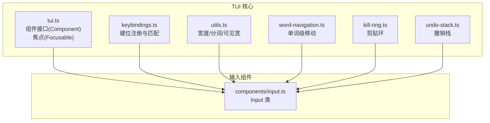
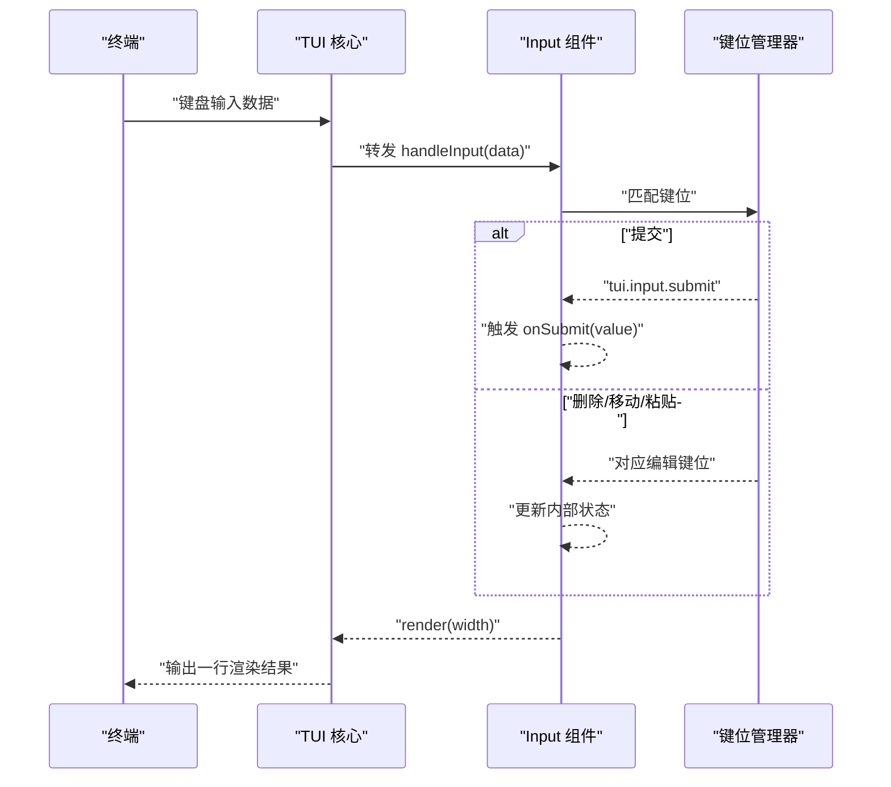
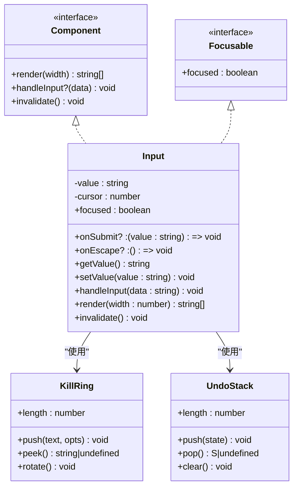
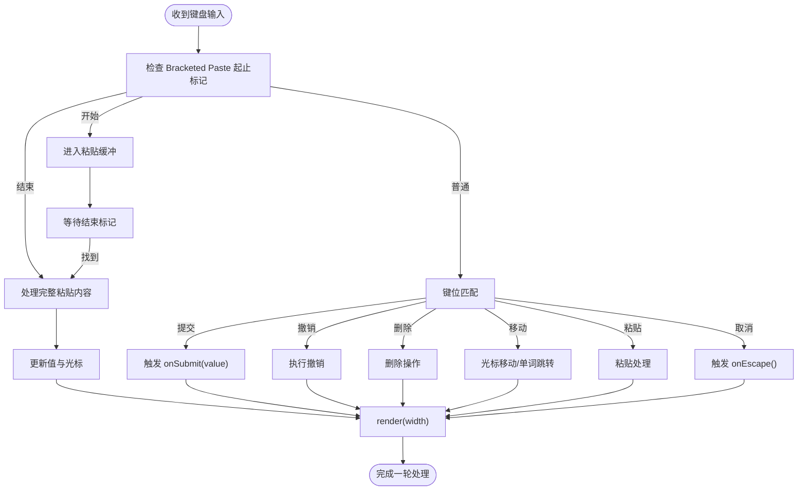
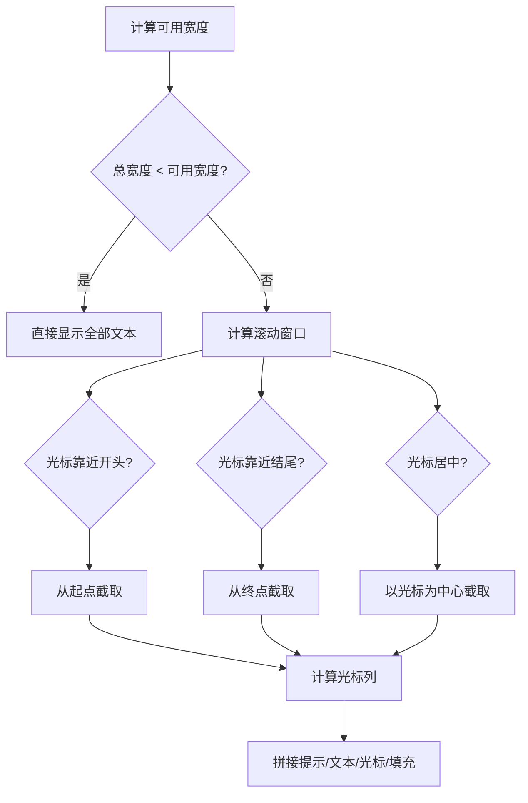
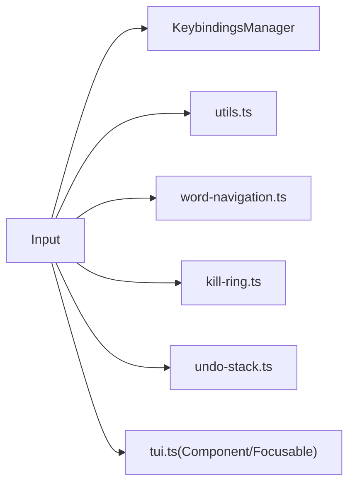

# 输入组件

<cite>
**本文引用的文件**
- [packages/tui/src/components/input.ts](file://packages/tui/src/components/input.ts)
- [packages/tui/test/input.test.ts](file://packages/tui/test/input.test.ts)
- [packages/tui/src/tui.ts](file://packages/tui/src/tui.ts)
- [packages/tui/src/keybindings.ts](file://packages/tui/src/keybindings.ts)
- [packages/tui/src/kill-ring.ts](file://packages/tui/src/kill-ring.ts)
- [packages/tui/src/undo-stack.ts](file://packages/tui/src/undo-stack.ts)
- [packages/tui/src/utils.ts](file://packages/tui/src/utils.ts)
- [packages/tui/src/word-navigation.ts](file://packages/tui/src/word-navigation.ts)
</cite>

## 目录
1. [简介](#简介)
2. [项目结构](#项目结构)
3. [核心组件](#核心组件)
4. [架构总览](#架构总览)
5. [详细组件分析](#详细组件分析)
6. [依赖关系分析](#依赖关系分析)
7. [性能考量](#性能考量)
8. [故障排查指南](#故障排查指南)
9. [结论](#结论)
10. [附录：API 参考](#附录api-参考)

## 简介
本文件面向 Pi 终端 UI 库（TUI）的输入组件，系统性地梳理其功能与实现，覆盖以下主题：
- 验证规则：必填、格式、自定义校验、实时反馈
- 事件处理：输入、变更、焦点、键盘
- 状态管理：输入值、错误、禁用、只读等
- 输入类型支持：文本、密码、数字、日期时间
- 无障碍访问：屏幕阅读器、键盘导航、焦点管理
- 完整 API 参考：验证配置、事件回调、方法调用、样式定制

注意：当前仓库中输入组件为“单行文本输入”，不包含内置的表单验证与错误状态管理逻辑；验证与错误状态属于上层业务或容器组件职责。本文将明确区分“组件能力边界”与“可扩展点”。

## 项目结构
输入组件位于 TUI 包内，围绕“组件接口 + 键盘绑定 + 编辑能力 + 渲染输出”的分层设计组织。

图表来源
- [packages/tui/src/tui.ts:39-82](file://packages/tui/src/tui.ts#L39-L82)
- [packages/tui/src/keybindings.ts:54-134](file://packages/tui/src/keybindings.ts#L54-L134)
- [packages/tui/src/utils.ts:10-19](file://packages/tui/src/utils.ts#L10-L19)
- [packages/tui/src/word-navigation.ts:1-15](file://packages/tui/src/word-navigation.ts#L1-L15)
- [packages/tui/src/kill-ring.ts:8-46](file://packages/tui/src/kill-ring.ts#L8-L46)
- [packages/tui/src/undo-stack.ts:7-28](file://packages/tui/src/undo-stack.ts#L7-L28)
- [packages/tui/src/components/input.ts:19-448](file://packages/tui/src/components/input.ts#L19-L448)

章节来源
- [packages/tui/src/components/input.ts:1-448](file://packages/tui/src/components/input.ts#L1-L448)
- [packages/tui/src/tui.ts:39-82](file://packages/tui/src/tui.ts#L39-L82)

## 核心组件
- 组件接口与焦点
  - 组件需实现渲染、可选输入处理、失效刷新等接口；可实现焦点接口以接收硬件光标标记。
- 输入组件 Input
  - 单行文本输入，支持水平滚动、Unicode 图形簇、Bracketed Paste、Emacs 风格编辑操作、撤销/重做、剪贴环等。
- 键位系统
  - 全局键位注册与匹配，支持用户自定义键位映射，避免冲突检测。
- 工具与算法
  - 图形簇/单词分段、可见宽度计算、单词跳转、剪贴环、撤销栈。

章节来源
- [packages/tui/src/components/input.ts:19-448](file://packages/tui/src/components/input.ts#L19-L448)
- [packages/tui/src/tui.ts:39-82](file://packages/tui/src/tui.ts#L39-L82)
- [packages/tui/src/keybindings.ts:155-244](file://packages/tui/src/keybindings.ts#L155-L244)
- [packages/tui/src/kill-ring.ts:8-46](file://packages/tui/src/kill-ring.ts#L8-L46)
- [packages/tui/src/undo-stack.ts:7-28](file://packages/tui/src/undo-stack.ts#L7-L28)
- [packages/tui/src/utils.ts:10-19](file://packages/tui/src/utils.ts#L10-L19)
- [packages/tui/src/word-navigation.ts:22-117](file://packages/tui/src/word-navigation.ts#L22-L117)

## 架构总览
输入组件通过 TUI 的组件模型接入渲染管线，键盘输入经由键位管理器匹配后委派到具体编辑动作。渲染阶段负责可视窗口裁剪、光标绘制与占位符提示。

图表来源
- [packages/tui/src/components/input.ts:48-211](file://packages/tui/src/components/input.ts#L48-L211)
- [packages/tui/src/keybindings.ts:194-200](file://packages/tui/src/keybindings.ts#L194-L200)
- [packages/tui/src/tui.ts:39-63](file://packages/tui/src/tui.ts#L39-L63)

## 详细组件分析

### 输入组件类图

图表来源
- [packages/tui/src/components/input.ts:19-448](file://packages/tui/src/components/input.ts#L19-L448)
- [packages/tui/src/kill-ring.ts:8-46](file://packages/tui/src/kill-ring.ts#L8-L46)
- [packages/tui/src/undo-stack.ts:7-28](file://packages/tui/src/undo-stack.ts#L7-L28)
- [packages/tui/src/tui.ts:39-82](file://packages/tui/src/tui.ts#L39-L82)

章节来源
- [packages/tui/src/components/input.ts:19-448](file://packages/tui/src/components/input.ts#L19-L448)

### 键盘事件与编辑流程
- 键位匹配
  - 使用全局键位管理器进行匹配，支持多键位别名与用户自定义映射。
- 编辑动作
  - 支持提交、撤销、删除、单词级移动、行首/行尾、Bracketed Paste、剪贴环等。
- 提交与取消
  - 提交触发回调；取消键触发回调，便于上层关闭或清空输入。

图表来源
- [packages/tui/src/components/input.ts:48-211](file://packages/tui/src/components/input.ts#L48-L211)
- [packages/tui/src/keybindings.ts:194-200](file://packages/tui/src/keybindings.ts#L194-L200)

章节来源
- [packages/tui/src/components/input.ts:48-211](file://packages/tui/src/components/input.ts#L48-L211)
- [packages/tui/src/keybindings.ts:155-244](file://packages/tui/src/keybindings.ts#L155-L244)

### 渲染与可见区域控制
- 可见窗口
  - 根据可用宽度与提示前缀计算可见文本与光标位置。
- 水平滚动
  - 当文本超出宽度时，按光标位置进行半窗滚动，保证光标始终可见。
- 光标绘制
  - 使用反显字符绘制光标，配合零宽光标标记用于 IME 候选项定位。

图表来源
- [packages/tui/src/components/input.ts:378-446](file://packages/tui/src/components/input.ts#L378-L446)

章节来源
- [packages/tui/src/components/input.ts:378-446](file://packages/tui/src/components/input.ts#L378-L446)

### 状态管理与生命周期
- 内部状态
  - 值与光标位置；焦点状态由 TUI 设置并影响光标标记。
- 缓存与失效
  - 渲染阶段无外部缓存；可通过失效接口通知重新渲染。
- 撤销/重做
  - 基于快照栈的增量式撤销，支持连续输入合并为一个单元。
- 剪贴环
  - 连续删除累积为单条目，支持 yank 与 yank-pop 循环。

章节来源
- [packages/tui/src/components/input.ts:11-448](file://packages/tui/src/components/input.ts#L11-L448)
- [packages/tui/src/undo-stack.ts:7-28](file://packages/tui/src/undo-stack.ts#L7-L28)
- [packages/tui/src/kill-ring.ts:8-46](file://packages/tui/src/kill-ring.ts#L8-L46)

### 输入类型支持
- 文本输入
  - 单行文本，支持 Unicode、全角、Emoji 等宽度计算。
- 密码输入
  - 组件本身不提供掩码显示；可在上层容器中对渲染输出进行掩码处理。
- 数字输入
  - 组件不内置数值解析；可在提交回调中进行数值转换与校验。
- 日期时间输入
  - 组件不内置日期解析；可在提交回调中进行格式化与校验。

章节来源
- [packages/tui/src/components/input.ts:378-446](file://packages/tui/src/components/input.ts#L378-L446)
- [packages/tui/src/utils.ts:164-200](file://packages/tui/src/utils.ts#L164-L200)

### 无障碍访问
- 屏幕阅读器
  - 通过焦点接口与光标标记，确保 TUI 能在渲染输出中标记光标位置，辅助 IME 候选窗口定位。
- 键盘导航
  - 支持标准编辑键位（左右、单词跳转、行首/行尾、删除、撤销等），满足键盘无障碍需求。
- 焦点管理
  - 由 TUI 负责焦点切换与光标标记注入，组件仅在聚焦时输出标记序列。

章节来源
- [packages/tui/src/tui.ts:74-90](file://packages/tui/src/tui.ts#L74-L90)
- [packages/tui/src/components/input.ts:26-26](file://packages/tui/src/components/input.ts#L26-L26)

### 验证与错误状态
- 验证规则
  - 组件不包含内置验证逻辑；建议在提交回调中进行必填、格式、自定义校验。
- 实时反馈
  - 可在每次输入后于上层容器中进行轻量校验并更新 UI 状态（如颜色/提示）。
- 错误状态
  - 组件不维护错误状态；建议在容器中保存并展示错误信息。
- 禁用/只读
  - 组件未暴露禁用/只读属性；可通过容器控制是否接收输入事件与渲染样式。

章节来源
- [packages/tui/src/components/input.ts:22-24](file://packages/tui/src/components/input.ts#L22-L24)
- [packages/tui/test/input.test.ts:1-648](file://packages/tui/test/input.test.ts#L1-L648)

## 依赖关系分析
- 组件耦合
  - Input 依赖键位管理器、工具函数、单词导航、剪贴环与撤销栈。
- 外部接口
  - 通过 TUI 组件接口与焦点接口与核心系统交互。
- 潜在循环
  - 无循环依赖；各模块职责清晰。

图表来源
- [packages/tui/src/components/input.ts:1-8](file://packages/tui/src/components/input.ts#L1-L8)
- [packages/tui/src/tui.ts:39-82](file://packages/tui/src/tui.ts#L39-L82)
- [packages/tui/src/keybindings.ts:155-244](file://packages/tui/src/keybindings.ts#L155-L244)
- [packages/tui/src/utils.ts:10-19](file://packages/tui/src/utils.ts#L10-L19)
- [packages/tui/src/word-navigation.ts:1-15](file://packages/tui/src/word-navigation.ts#L1-L15)
- [packages/tui/src/kill-ring.ts:8-46](file://packages/tui/src/kill-ring.ts#L8-L46)
- [packages/tui/src/undo-stack.ts:7-28](file://packages/tui/src/undo-stack.ts#L7-L28)

章节来源
- [packages/tui/src/components/input.ts:1-8](file://packages/tui/src/components/input.ts#L1-L8)
- [packages/tui/src/tui.ts:39-82](file://packages/tui/src/tui.ts#L39-L82)

## 性能考量
- 渲染复杂度
  - 渲染涉及可见宽度计算与字符串切片，整体为线性复杂度 O(n)，其中 n 为可见文本长度。
- 字符宽度计算
  - 使用图形簇分段与缓存策略，减少重复计算开销。
- 撤销与剪贴环
  - 快照与环形存储均为常数级操作，适合频繁编辑场景。

章节来源
- [packages/tui/src/components/input.ts:378-446](file://packages/tui/src/components/input.ts#L378-L446)
- [packages/tui/src/utils.ts:46-47](file://packages/tui/src/utils.ts#L46-L47)
- [packages/tui/src/undo-stack.ts:11-13](file://packages/tui/src/undo-stack.ts#L11-L13)
- [packages/tui/src/kill-ring.ts:19-28](file://packages/tui/src/kill-ring.ts#L19-L28)

## 故障排查指南
- 提交无效
  - 检查键位是否匹配提交键位；确认回调是否设置。
- 删除/移动异常
  - 确认键位映射是否被覆盖；检查是否处于粘贴缓冲状态。
- 光标不可见
  - 确保组件处于聚焦状态且 TUI 正确注入光标标记。
- 渲染溢出
  - 检查终端宽度与提示长度；确认可见宽度计算逻辑。
- 撤销/重做无效
  - 确认撤销栈非空；检查是否在移动后继续输入导致拆分为新单元。

章节来源
- [packages/tui/test/input.test.ts:1-648](file://packages/tui/test/input.test.ts#L1-L648)
- [packages/tui/src/components/input.ts:48-211](file://packages/tui/src/components/input.ts#L48-L211)

## 结论
输入组件提供了终端友好的单行文本输入体验，具备完善的编辑能力与渲染优化。由于验证与状态管理不在组件内部实现，建议在上层容器中组合使用，以满足不同业务场景的输入需求。

## 附录：API 参考

- 组件接口
  - render(width): string[] —— 渲染为一行字符串数组
  - handleInput?(data: string): void —— 接收键盘输入（可选）
  - invalidate(): void —— 使缓存失效
  - focused: boolean —— 是否聚焦（由 TUI 设置）

- Input 类
  - getValue(): string —— 获取当前值
  - setValue(value: string): void —— 设置当前值并调整光标
  - onSubmit?: (value: string) => void —— 提交回调
  - onEscape?: () => void —— 取消回调
  - handleInput(data: string): void —— 处理输入事件
  - render(width: number): string[] —— 渲染一行输出
  - invalidate(): void —— 使缓存失效

- 键位系统
  - KeybindingsManager.matches(data, keybinding): boolean —— 键位匹配
  - KeybindingsManager.setUserBindings(config): void —— 设置用户键位
  - KeybindingsManager.getConflicts(): KeybindingConflict[] —— 冲突检测

- 工具与算法
  - 可见宽度计算、图形簇/单词分段、单词跳转、Bracketed Paste 解析

- 剪贴环与撤销
  - KillRing.push(text, { prepend, accumulate? })
  - KillRing.peek()/rotate()
  - UndoStack.push(state)/pop()

章节来源
- [packages/tui/src/tui.ts:39-82](file://packages/tui/src/tui.ts#L39-L82)
- [packages/tui/src/components/input.ts:39-448](file://packages/tui/src/components/input.ts#L39-L448)
- [packages/tui/src/keybindings.ts:155-244](file://packages/tui/src/keybindings.ts#L155-L244)
- [packages/tui/src/kill-ring.ts:8-46](file://packages/tui/src/kill-ring.ts#L8-L46)
- [packages/tui/src/undo-stack.ts:7-28](file://packages/tui/src/undo-stack.ts#L7-L28)
- [packages/tui/src/utils.ts:10-19](file://packages/tui/src/utils.ts#L10-L19)
- [packages/tui/src/word-navigation.ts:22-117](file://packages/tui/src/word-navigation.ts#L22-L117)