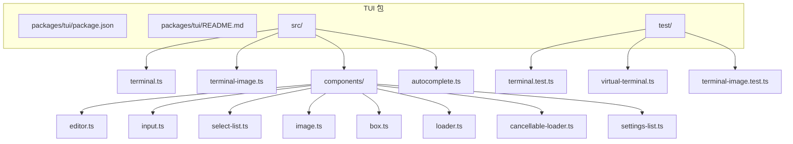
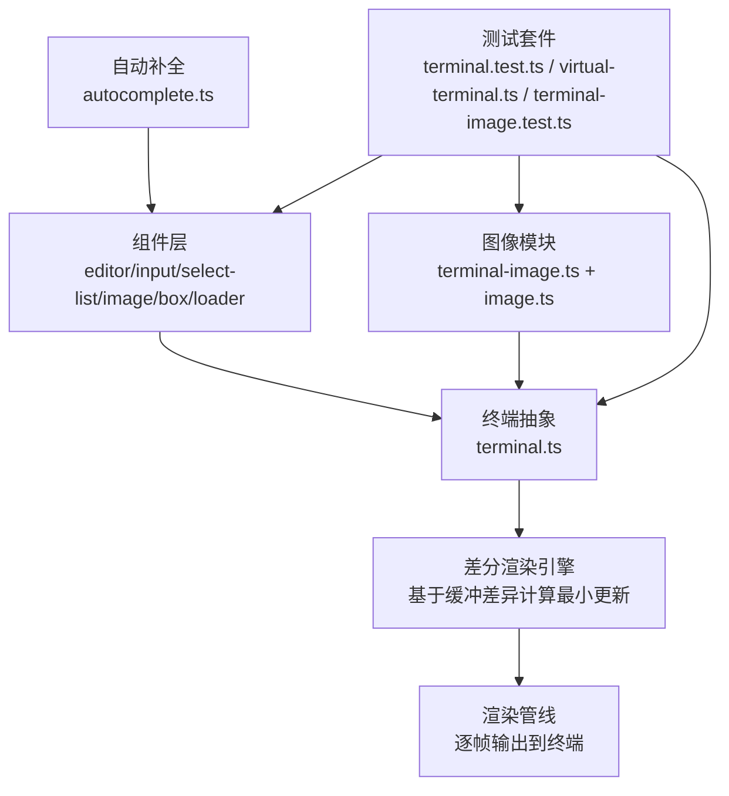
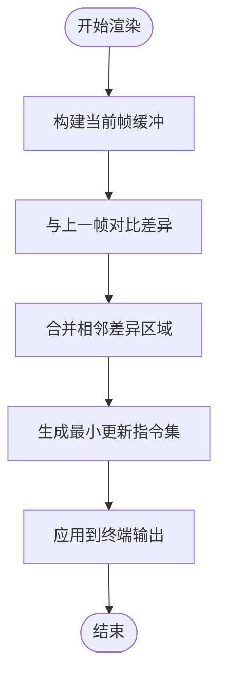
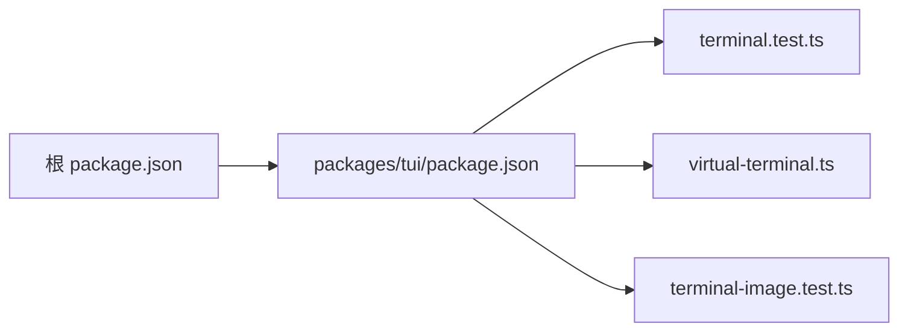

# 终端UI库

<cite>
**本文引用的文件**
- [README.md](file://README.md)
- [package.json](file://package.json)
- [packages/tui/README.md](file://packages/tui/README.md)
- [packages/tui/package.json](file://packages/tui/package.json)
- [packages/tui/src/terminal.ts](file://packages/tui/src/terminal.ts)
- [packages/tui/src/terminal-image.ts](file://packages/tui/src/terminal-image.ts)
- [packages/tui/src/components/editor.ts](file://packages/tui/src/components/editor.ts)
- [packages/tui/src/components/input.ts](file://packages/tui/src/components/input.ts)
- [packages/tui/src/components/select-list.ts](file://packages/tui/src/components/select-list.ts)
- [packages/tui/src/components/image.ts](file://packages/tui/src/components/image.ts)
- [packages/tui/src/components/box.ts](file://packages/tui/src/components/box.ts)
- [packages/tui/src/components/loader.ts](file://packages/tui/src/components/loader.ts)
- [packages/tui/src/components/cancellable-loader.ts](file://packages/tui/src/components/cancellable-loader.ts)
- [packages/tui/src/components/settings-list.ts](file://packages/tui/src/components/settings-list.ts)
- [packages/tui/src/autocomplete.ts](file://packages/tui/src/autocomplete.ts)
- [packages/tui/test/terminal.test.ts](file://packages/tui/test/terminal.test.ts)
- [packages/tui/test/virtual-terminal.ts](file://packages/tui/test/virtual-terminal.ts)
- [packages/tui/test/terminal-image.test.ts](file://packages/tui/test/terminal-image.test.ts)
</cite>

## 目录
1. [简介](#简介)
2. [项目结构](#项目结构)
3. [核心组件](#核心组件)
4. [架构总览](#架构总览)
5. [详细组件分析](#详细组件分析)
6. [依赖分析](#依赖分析)
7. [性能考虑](#性能考虑)
8. [故障排查指南](#故障排查指南)
9. [结论](#结论)
10. [附录](#附录)

## 简介
本文件面向Pi终端UI库（TUI）的使用者与贡献者，系统化梳理其组件体系、差分渲染引擎设计、键盘输入与事件处理、主题系统、以及可定制与扩展实践。文档以“可读性优先”的原则，结合Mermaid图示帮助读者快速理解从终端抽象到具体组件的实现脉络。

Pi终端UI库定位为具备差分渲染能力的终端UI框架，强调高效更新与一致的终端体验；同时提供编辑器、输入框、列表、图像等常用组件，支持主题与无障碍基础实践。

## 项目结构
仓库采用monorepo组织，TUI位于packages/tui，核心职责包括：
- 终端抽象与差分渲染：terminal.ts
- 图像渲染：terminal-image.ts、components/image.ts
- 基础组件：editor.ts、input.ts、select-list.ts、box.ts、loader.ts、cancellable-loader.ts、settings-list.ts
- 自动补全：autocomplete.ts
- 测试：terminal.test.ts、virtual-terminal.ts、terminal-image.test.ts

图表来源
- [packages/tui/package.json](file://packages/tui/package.json)
- [packages/tui/src/terminal.ts](file://packages/tui/src/terminal.ts)
- [packages/tui/src/terminal-image.ts](file://packages/tui/src/terminal-image.ts)
- [packages/tui/src/components/editor.ts](file://packages/tui/src/components/editor.ts)
- [packages/tui/src/components/input.ts](file://packages/tui/src/components/input.ts)
- [packages/tui/src/components/select-list.ts](file://packages/tui/src/components/select-list.ts)
- [packages/tui/src/components/image.ts](file://packages/tui/src/components/image.ts)
- [packages/tui/src/components/box.ts](file://packages/tui/src/components/box.ts)
- [packages/tui/src/components/loader.ts](file://packages/tui/src/components/loader.ts)
- [packages/tui/src/components/cancellable-loader.ts](file://packages/tui/src/components/cancellable-loader.ts)
- [packages/tui/src/components/settings-list.ts](file://packages/tui/src/components/settings-list.ts)
- [packages/tui/src/autocomplete.ts](file://packages/tui/src/autocomplete.ts)
- [packages/tui/test/terminal.test.ts](file://packages/tui/test/terminal.test.ts)
- [packages/tui/test/virtual-terminal.ts](file://packages/tui/test/virtual-terminal.ts)
- [packages/tui/test/terminal-image.test.ts](file://packages/tui/test/terminal-image.test.ts)

章节来源
- [README.md:55-55](file://README.md#L55-L55)
- [package.json:1-60](file://package.json#L1-L60)
- [packages/tui/README.md](file://packages/tui/README.md)
- [packages/tui/package.json](file://packages/tui/package.json)

## 核心组件
本节概览TUI提供的关键组件及其职责：
- 编辑器组件：提供多行文本编辑能力，支持光标、选择、撤销/重做等基础交互。
- 输入组件：单行输入，支持占位符、回车确认、取消回调等。
- 列表组件：滚动列表，支持高亮项、上下键导航、回车选择。
- 图像组件：在终端中渲染图像，结合terminal-image模块进行像素级映射。
- 基础容器与加载：Box用于布局与边框，Loader与CancellableLoader用于状态反馈。
- 设置列表：面向配置场景的列表组件变体。
- 自动补全：提供输入时的候选建议与选择逻辑。

章节来源
- [packages/tui/src/components/editor.ts](file://packages/tui/src/components/editor.ts)
- [packages/tui/src/components/input.ts](file://packages/tui/src/components/input.ts)
- [packages/tui/src/components/select-list.ts](file://packages/tui/src/components/select-list.ts)
- [packages/tui/src/components/image.ts](file://packages/tui/src/components/image.ts)
- [packages/tui/src/components/box.ts](file://packages/tui/src/components/box.ts)
- [packages/tui/src/components/loader.ts](file://packages/tui/src/components/loader.ts)
- [packages/tui/src/components/cancellable-loader.ts](file://packages/tui/src/components/cancellable-loader.ts)
- [packages/tui/src/components/settings-list.ts](file://packages/tui/src/components/settings-list.ts)
- [packages/tui/src/autocomplete.ts](file://packages/tui/src/autocomplete.ts)

## 架构总览
下图展示了TUI的高层架构：终端抽象负责屏幕缓冲与差分渲染；组件通过统一的绘制接口参与渲染；图像模块负责终端内图像显示；自动补全模块提供输入增强；测试用例覆盖终端行为与图像渲染。

图表来源
- [packages/tui/src/terminal.ts](file://packages/tui/src/terminal.ts)
- [packages/tui/src/terminal-image.ts](file://packages/tui/src/terminal-image.ts)
- [packages/tui/src/components/editor.ts](file://packages/tui/src/components/editor.ts)
- [packages/tui/src/components/input.ts](file://packages/tui/src/components/input.ts)
- [packages/tui/src/components/select-list.ts](file://packages/tui/src/components/select-list.ts)
- [packages/tui/src/components/image.ts](file://packages/tui/src/components/image.ts)
- [packages/tui/src/autocomplete.ts](file://packages/tui/src/autocomplete.ts)
- [packages/tui/test/terminal.test.ts](file://packages/tui/test/terminal.test.ts)
- [packages/tui/test/virtual-terminal.ts](file://packages/tui/test/virtual-terminal.ts)
- [packages/tui/test/terminal-image.test.ts](file://packages/tui/test/terminal-image.test.ts)

## 详细组件分析

### 差分渲染引擎
- 设计目标：最小化终端输出开销，仅对发生变化的区域进行重绘，提升大屏面刷新效率。
- 关键思路：
  - 双缓冲策略：维护当前帧与上一帧的字符矩阵，逐行逐列比对差异。
  - 区域合并：将相邻相同差异区域合并为更大的更新块，减少光标移动与写入次数。
  - 指令优化：在连续更新时复用光标定位指令，避免重复设置。
- 实现要点（基于源码职责划分）：
  - 终端抽象负责帧缓冲与输出接口。
  - 组件通过统一绘制协议提交可见元素，由渲染引擎汇总差异。
  - 高频刷新场景下，建议将组件更新批量化，降低渲染抖动。

图表来源
- [packages/tui/src/terminal.ts](file://packages/tui/src/terminal.ts)

章节来源
- [packages/tui/src/terminal.ts](file://packages/tui/src/terminal.ts)

### 编辑器组件（editor）
- 职责：提供多行文本编辑、光标移动、选择、删除、粘贴、撤销/重做的基础能力。
- 交互模式：支持方向键、Home/End、退格、删除、Ctrl+X/C/V等快捷键。
- 渲染策略：按需局部重绘，配合差分引擎减少闪烁。
- 使用建议：长文本编辑时开启虚拟滚动或分页策略，避免一次性渲染过多行。

章节来源
- [packages/tui/src/components/editor.ts](file://packages/tui/src/components/editor.ts)

### 输入组件（input）
- 职责：单行输入，支持占位符、回车确认、取消回调。
- 键盘处理：监听Enter触发确认，Esc触发取消；支持前后移动与删除。
- 主题适配：通过主题变量控制前景/背景色与边框样式。
- 扩展点：可注入自动补全、校验回调、前缀图标等。

章节来源
- [packages/tui/src/components/input.ts](file://packages/tui/src/components/input.ts)

### 列表组件（select-list）
- 职责：滚动列表，支持高亮项、上下键导航、回车选择。
- 渲染策略：可视窗口内渲染有限数量项，动态计算偏移量。
- 事件处理：方向键、PageUp/PageDown、Home/End、回车确认。
- 可访问性：提供焦点态指示与可读性提示，便于键盘操作。

章节来源
- [packages/tui/src/components/select-list.ts](file://packages/tui/src/components/select-list.ts)

### 图像组件（image）
- 职责：在终端中渲染图像，支持缩放、裁剪与占位符。
- 技术路径：利用terminal-image模块将像素映射为终端单元（如全角字符或ANSI块），按分辨率降采样以适配终端网格。
- 性能考量：大图渲染成本高，建议预处理尺寸或延迟加载。

章节来源
- [packages/tui/src/components/image.ts](file://packages/tui/src/components/image.ts)
- [packages/tui/src/terminal-image.ts](file://packages/tui/src/terminal-image.ts)

### 基础容器与加载（box、loader、cancellable-loader）
- Box：提供边框与内边距，作为布局容器承载子组件。
- Loader：静态加载指示器，适合轻量异步任务。
- CancellableLoader：支持取消的加载指示器，适合用户可中断的任务流。

章节来源
- [packages/tui/src/components/box.ts](file://packages/tui/src/components/box.ts)
- [packages/tui/src/components/loader.ts](file://packages/tui/src/components/loader.ts)
- [packages/tui/src/components/cancellable-loader.ts](file://packages/tui/src/components/cancellable-loader.ts)

### 设置列表（settings-list）
- 场景：配置面板中的键值对列表，支持切换、输入、选择等子控件。
- 行为：左侧标题、右侧可编辑区，支持键盘导航与回车进入编辑。

章节来源
- [packages/tui/src/components/settings-list.ts](file://packages/tui/src/components/settings-list.ts)

### 自动补全（autocomplete）
- 职责：根据当前输入生成候选集合，支持键盘选择与回车确认。
- 交互：上下键切换候选，Tab或Enter插入选中项，Esc关闭。
- 性能：建议对候选集进行分页与缓存，避免频繁全量匹配。

章节来源
- [packages/tui/src/autocomplete.ts](file://packages/tui/src/autocomplete.ts)

### 键盘输入处理与事件系统
- 输入捕获：终端抽象统一接收键盘事件，解析组合键与功能键。
- 事件路由：事件分发至当前焦点组件，组件内部再细分到具体处理器（如编辑器的光标移动、列表的滚动）。
- 事件生命周期：按下、重复、释放（若需要）；组合键与修饰键（Shift/Ctrl/Alt）的语义转换。
- 可扩展性：允许组件注册自定义事件处理器，或在更高层拦截与改写事件。

章节来源
- [packages/tui/src/terminal.ts](file://packages/tui/src/terminal.ts)

### 主题系统
- 设计原则：以变量驱动颜色与样式，确保组件在不同终端环境下具有一致外观。
- 典型变量：前景色、背景色、高亮色、边框色、错误色、成功色等。
- 应用方式：组件在绘制时读取主题变量，避免硬编码颜色。
- 扩展建议：新增组件时统一通过主题变量渲染，保持风格一致性。

章节来源
- [packages/tui/src/components/box.ts](file://packages/tui/src/components/box.ts)
- [packages/tui/src/components/editor.ts](file://packages/tui/src/components/editor.ts)
- [packages/tui/src/components/input.ts](file://packages/tui/src/components/input.ts)
- [packages/tui/src/components/select-list.ts](file://packages/tui/src/components/select-list.ts)

### 组件定制与扩展指南
- 新增组件步骤：
  1) 在components目录下创建组件文件，定义props与状态。
  2) 实现绘制函数，返回字符串数组（每行对应终端一行）。
  3) 注册键盘事件处理器（如有）。
  4) 通过主题变量控制外观。
  5) 在测试中验证渲染与交互。
- 扩展现有组件：
  - 通过组合现有组件（如Box包裹Editor）实现复合UI。
  - 为组件添加可选装饰（如图标、徽标）而不改变核心逻辑。
- 最佳实践：
  - 将复杂逻辑拆分为纯函数（如格式化、校验），便于测试与复用。
  - 对高频更新的组件启用批处理与节流。

章节来源
- [packages/tui/src/components/editor.ts](file://packages/tui/src/components/editor.ts)
- [packages/tui/src/components/input.ts](file://packages/tui/src/components/input.ts)
- [packages/tui/src/components/select-list.ts](file://packages/tui/src/components/select-list.ts)
- [packages/tui/src/components/box.ts](file://packages/tui/src/components/box.ts)

### 响应式设计与无障碍最佳实践
- 响应式：
  - 动态适配终端宽度，列表与编辑器在窄屏下自动换行或折叠。
  - 图像组件按终端单元大小缩放，避免溢出。
- 无障碍：
  - 提供键盘可达性：Tab顺序合理、焦点可见、快捷键提示。
  - 文本对比度：确保前景/背景满足可读性要求。
  - 屏幕阅读器友好：为关键状态与错误信息提供可读描述。

章节来源
- [packages/tui/src/terminal.ts](file://packages/tui/src/terminal.ts)
- [packages/tui/src/components/box.ts](file://packages/tui/src/components/box.ts)
- [packages/tui/src/components/select-list.ts](file://packages/tui/src/components/select-list.ts)

## 依赖分析
- 包管理：根目录package.json声明工作区，TUI包独立构建与测试。
- 运行时依赖：TUI包自身聚焦终端渲染与组件，不引入外部UI框架。
- 测试依赖：通过虚拟终端与图像测试验证渲染正确性与边界行为。

图表来源
- [package.json:1-60](file://package.json#L1-L60)
- [packages/tui/package.json](file://packages/tui/package.json)
- [packages/tui/test/terminal.test.ts](file://packages/tui/test/terminal.test.ts)
- [packages/tui/test/virtual-terminal.ts](file://packages/tui/test/virtual-terminal.ts)
- [packages/tui/test/terminal-image.test.ts](file://packages/tui/test/terminal-image.test.ts)

章节来源
- [package.json:1-60](file://package.json#L1-L60)
- [packages/tui/package.json](file://packages/tui/package.json)

## 性能考虑
- 差分渲染：优先使用差分引擎，避免整屏重绘。
- 组件更新：批量提交更新，减少帧间抖动；对高频事件（如滚动）启用节流。
- 图像渲染：降低分辨率或延迟加载，避免阻塞主线程。
- 字符绘制：尽量使用宽字符与块字符组合，减少ANSI转义序列数量。
- 内存占用：及时释放不再使用的缓冲与候选数据。

## 故障排查指南
- 终端渲染异常：
  - 检查终端宽度变化是否触发重排。
  - 排查组件是否越界或覆盖。
- 图像显示问题：
  - 确认终端支持全角字符与块字符映射。
  - 检查图像尺寸与分辨率是否超出终端网格。
- 键盘无响应：
  - 确认焦点组件正确接收事件。
  - 检查组合键是否被系统或终端拦截。
- 加载卡顿：
  - 分析渲染队列长度与更新频率。
  - 评估图像与列表的渲染成本。

章节来源
- [packages/tui/test/terminal.test.ts](file://packages/tui/test/terminal.test.ts)
- [packages/tui/test/virtual-terminal.ts](file://packages/tui/test/virtual-terminal.ts)
- [packages/tui/test/terminal-image.test.ts](file://packages/tui/test/terminal-image.test.ts)

## 结论
Pi终端UI库通过清晰的组件分层与高效的差分渲染，提供了在终端环境中构建复杂交互界面的能力。围绕键盘输入、事件系统与主题系统的完善设计，使得组件既易用又可扩展。建议在实际项目中遵循响应式与无障碍最佳实践，持续优化渲染性能与用户体验。

## 附录
- 快速开始：参考TUI包README与根README中的包列表，定位TUI包入口与使用说明。
- 开发流程：使用根脚本构建与测试，确保跨平台兼容性（Darwin/Win32原生模块）。

章节来源
- [README.md:55-55](file://README.md#L55-L55)
- [packages/tui/README.md](file://packages/tui/README.md)