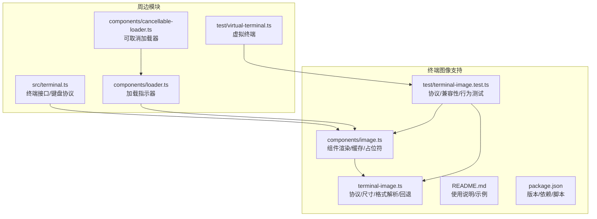
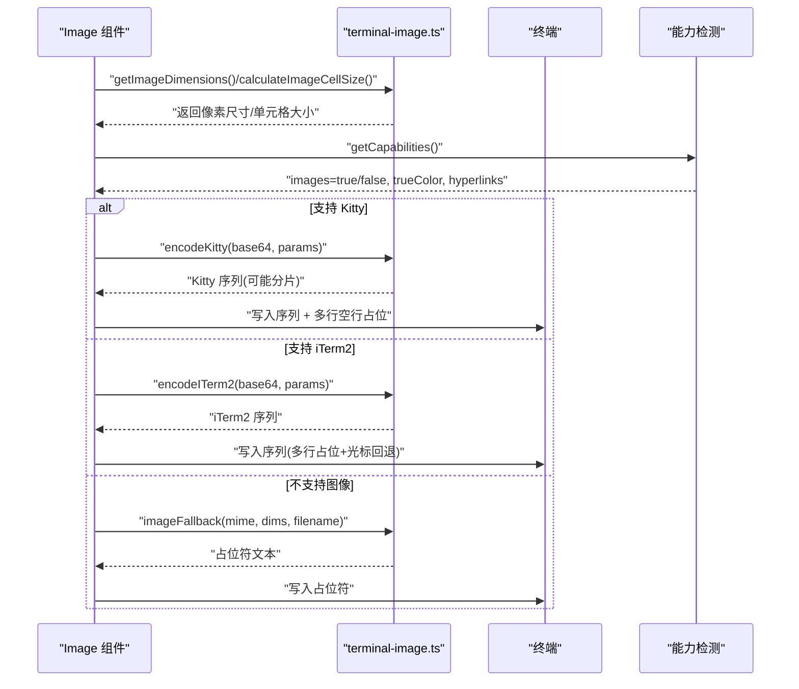
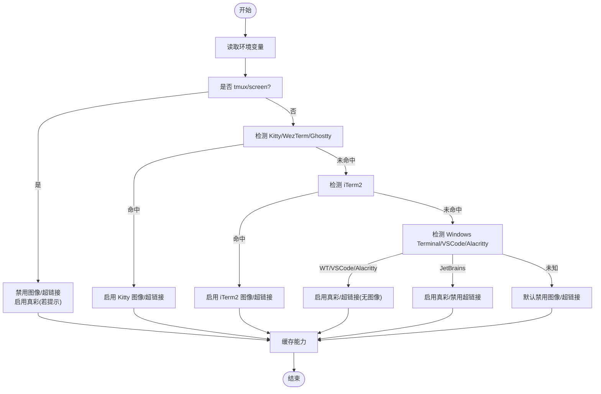
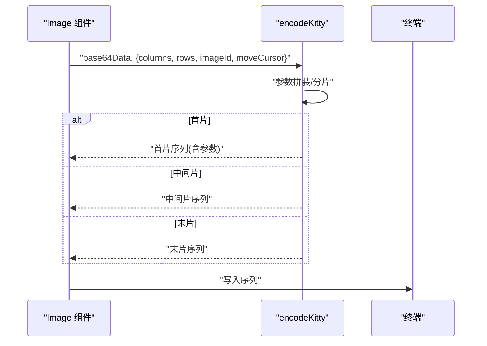
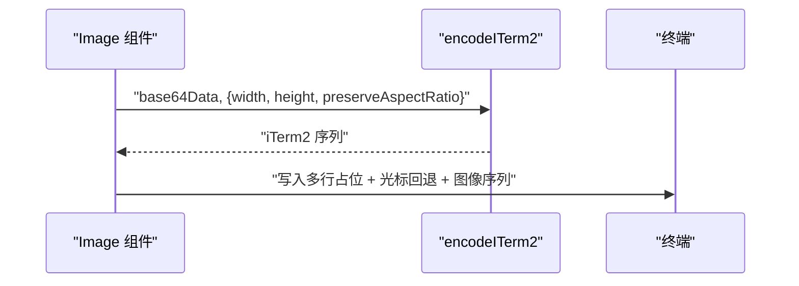
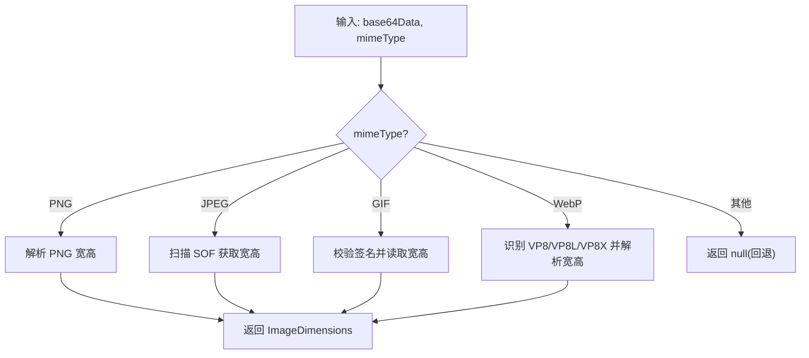
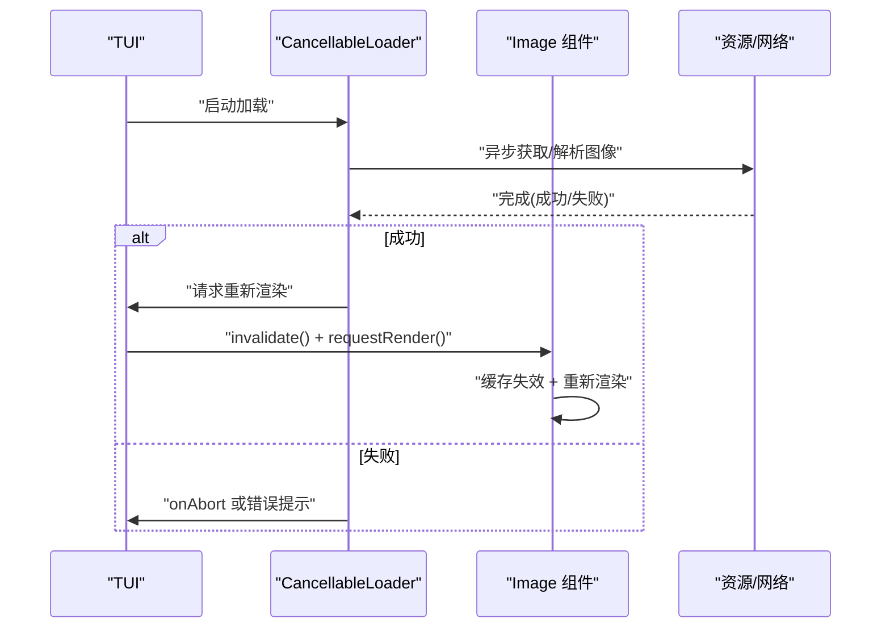
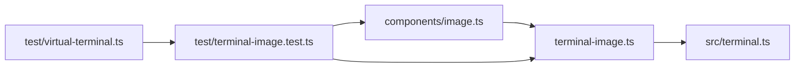

# 终端图像支持

<cite>
**本文引用的文件**
- [packages/tui/src/terminal-image.ts](file://packages/tui/src/terminal-image.ts)
- [packages/tui/src/components/image.ts](file://packages/tui/src/components/image.ts)
- [packages/tui/test/terminal-image.test.ts](file://packages/tui/test/terminal-image.test.ts)
- [packages/tui/README.md](file://packages/tui/README.md)
- [packages/tui/package.json](file://packages/tui/package.json)
- [packages/tui/src/terminal.ts](file://packages/tui/src/terminal.ts)
- [packages/tui/src/components/loader.ts](file://packages/tui/src/components/loader.ts)
- [packages/tui/src/components/cancellable-loader.ts](file://packages/tui/src/components/cancellable-loader.ts)
- [packages/tui/test/virtual-terminal.ts](file://packages/tui/test/virtual-terminal.ts)
</cite>

## 目录
1. [简介](#简介)
2. [项目结构](#项目结构)
3. [核心组件](#核心组件)
4. [架构总览](#架构总览)
5. [详细组件分析](#详细组件分析)
6. [依赖关系分析](#依赖关系分析)
7. [性能考量](#性能考量)
8. [故障排查指南](#故障排查指南)
9. [结论](#结论)
10. [附录](#附录)

## 简介
本文件面向 Pi 终端 UI 库中的“终端图像支持”子系统，系统性阐述图像渲染协议实现（Kitty 图像协议、iTerm2 协议）、图像尺寸计算与像素格式解析、内存与渲染缓存策略、异步加载与错误回退、终端兼容性检测与能力协商、以及图像组件的使用方式与性能优化建议。文档同时覆盖常见图像格式支持与限制，并通过图示帮助读者理解数据流与控制流。

## 项目结构
本子系统主要由以下模块组成：
- 终端图像协议与尺寸计算：terminal-image.ts
- 图像组件：components/image.ts
- 测试用例：test/terminal-image.test.ts
- 文档与示例：README.md
- 包元信息：package.json
- 终端接口与键盘协议：src/terminal.ts
- 加载组件（辅助异步场景）：src/components/loader.ts、src/components/cancellable-loader.ts
- 虚拟终端（测试支撑）：test/virtual-terminal.ts



**图表来源**
- [packages/tui/src/terminal-image.ts](file://packages/tui/src/terminal-image.ts)
- [packages/tui/src/components/image.ts](file://packages/tui/src/components/image.ts)
- [packages/tui/test/terminal-image.test.ts](file://packages/tui/test/terminal-image.test.ts)
- [packages/tui/README.md](file://packages/tui/README.md)
- [packages/tui/package.json](file://packages/tui/package.json)
- [packages/tui/src/terminal.ts](file://packages/tui/src/terminal.ts)
- [packages/tui/src/components/loader.ts](file://packages/tui/src/components/loader.ts)
- [packages/tui/src/components/cancellable-loader.ts](file://packages/tui/src/components/cancellable-loader.ts)
- [packages/tui/test/virtual-terminal.ts](file://packages/tui/test/virtual-terminal.ts)

**章节来源**
- [packages/tui/README.md](file://packages/tui/README.md)
- [packages/tui/package.json](file://packages/tui/package.json)

## 核心组件
- 终端能力检测与缓存：根据环境变量与运行时条件判断是否支持 Kitty/iTerm2 图像协议、真彩与超链接能力，并缓存结果以避免重复检测。
- 图像协议编码器：分别实现 Kitty 与 iTerm2 的图像传输序列生成，含分片传输、参数拼装与删除指令。
- 尺寸计算与单元格映射：将像素尺寸映射到终端单元格行列数，支持最大宽度/高度约束与纵横比保持。
- 像素格式解析：从 Base64 数据中解析 PNG/JPEG/GIF/WebP 的宽高，用于尺寸计算与回退提示。
- 图像组件：负责渲染单个图像，支持缓存、占位符回退、Kitty 图像 ID 分配与复用、以及 iTerm2 的多行占位与光标回退。
- 回退机制：当不支持图像协议时，输出人类可读的占位符文本，包含 MIME 类型与尺寸信息。

**章节来源**
- [packages/tui/src/terminal-image.ts](file://packages/tui/src/terminal-image.ts)
- [packages/tui/src/components/image.ts](file://packages/tui/src/components/image.ts)

## 架构总览
下图展示了从组件渲染到协议输出的整体流程，以及在不同终端能力下的分支路径。



**图表来源**
- [packages/tui/src/components/image.ts](file://packages/tui/src/components/image.ts)
- [packages/tui/src/terminal-image.ts](file://packages/tui/src/terminal-image.ts)

## 详细组件分析

### 终端能力检测与协商
- 检测依据：TERM_PROGRAM、TERMINAL_EMULATOR、TERM、COLORTERM、以及 tmux/screen 等环境变量组合，保守地对未知终端禁用图像与超链接。
- 关键点：
  - tmux/screen 下强制禁用图像与超链接，避免转义序列被吞或行为异常。
  - 已知支持 Kitty 协议的终端（如 Kitty、Ghostty、WezTerm）启用图像与超链接。
  - Windows Terminal 在非多路复用器环境下启用真彩与超链接，但不启用 Kitty 图像协议。
  - JetBrains JediTerm 启用真彩但禁用超链接。
- 缓存策略：首次检测后缓存结果，可通过重置函数刷新。



**图表来源**
- [packages/tui/src/terminal-image.ts](file://packages/tui/src/terminal-image.ts)

**章节来源**
- [packages/tui/src/terminal-image.ts](file://packages/tui/src/terminal-image.ts)
- [packages/tui/test/terminal-image.test.ts](file://packages/tui/test/terminal-image.test.ts)

### Kitty 图像协议实现
- 序列前缀与分片：Kitty 使用特定前缀标识，超过阈值的数据按固定块大小分片发送；首片与末片使用不同标志位。
- 参数组装：支持列数、行数、图像 ID、是否移动光标等参数；默认保留终端侧光标移动行为，组件层可显式关闭。
- 删除指令：提供按 ID 或全部删除图像的序列，用于清理与动画更新。
- 图像 ID：组件首次渲染时分配随机 ID，后续可复用以实现动画/更新。



**图表来源**
- [packages/tui/src/terminal-image.ts](file://packages/tui/src/terminal-image.ts)

**章节来源**
- [packages/tui/src/terminal-image.ts](file://packages/tui/src/terminal-image.ts)
- [packages/tui/test/terminal-image.test.ts](file://packages/tui/test/terminal-image.test.ts)

### iTerm2 图像协议实现
- 序列前缀与终止符：使用特定前缀与终止符包裹 Base64 数据。
- 参数控制：支持内联显示、宽高、名称（Base64 编码）、纵横比保持等。
- 渲染占位：由于 iTerm2 的图像渲染特性，组件通过多行空行与光标回退序列，确保 TUI 光标位置与滚动区域正确。



**图表来源**
- [packages/tui/src/terminal-image.ts](file://packages/tui/src/terminal-image.ts)

**章节来源**
- [packages/tui/src/terminal-image.ts](file://packages/tui/src/terminal-image.ts)
- [packages/tui/test/terminal-image.test.ts](file://packages/tui/test/terminal-image.test.ts)

### 图像尺寸计算与像素格式解析
- 尺寸计算：
  - 输入图像像素尺寸与最大单元格宽高，结合当前单元格像素尺寸（可由 TUI 查询并设置），计算目标单元格行列数。
  - 可选保持纵横比，自动推导最大高度或按比例缩放。
- 像素格式解析：
  - PNG：从头部读取宽高。
  - JPEG：扫描 SOF 标记获取宽高。
  - GIF：检查签名并读取宽高。
  - WebP：区分 VP8/VP8L/VP8X 并解析宽高。
- 回退提示：当无法解析尺寸时，仍可基于占位符输出，包含 MIME 与尺寸信息。



**图表来源**
- [packages/tui/src/terminal-image.ts](file://packages/tui/src/terminal-image.ts)

**章节来源**
- [packages/tui/src/terminal-image.ts](file://packages/tui/src/terminal-image.ts)

### 图像组件渲染与缓存
- 渲染流程：
  - 计算最大单元格宽高与默认最大高度（按单元格宽高比）。
  - 若支持图像协议：调用渲染函数生成序列；Kitty 使用组件分配的图像 ID；iTerm2 通过多行占位与光标回退保证布局正确。
  - 若不支持图像协议：输出占位符文本。
- 缓存策略：对同一宽度的渲染结果进行缓存，避免重复计算；当外部宽度变化或组件失效时清空缓存。
- 动画/更新：Kitty 图像 ID 可复用，便于后续更新或动画帧切换。

```mermaid
classDiagram
class Image {
-base64Data : string
-mimeType : string
-dimensions : ImageDimensions
-theme : ImageTheme
-options : ImageOptions
-imageId : number?
-cachedLines : string[]?
-cachedWidth : number?
+render(width) : string[]
+invalidate() : void
+getImageId() : number?
}
class TerminalImage {
+getCellDimensions() : CellDimensions
+setCellDimensions(dims) : void
+getCapabilities() : TerminalCapabilities
+resetCapabilitiesCache() : void
+setCapabilities(caps) : void
+allocateImageId() : number
+renderImage(base64, dims, options) : {sequence, rows, imageId?}
+imageFallback(mime, dims?, filename?) : string
}
Image --> TerminalImage : "使用"
```

**图表来源**
- [packages/tui/src/components/image.ts](file://packages/tui/src/components/image.ts)
- [packages/tui/src/terminal-image.ts](file://packages/tui/src/terminal-image.ts)

**章节来源**
- [packages/tui/src/components/image.ts](file://packages/tui/src/components/image.ts)
- [packages/tui/src/terminal-image.ts](file://packages/tui/src/terminal-image.ts)

### 异步加载与错误处理
- 异步加载：可配合加载组件与可取消加载器在后台解析/下载图像数据，完成后触发重新渲染。
- 错误处理：
  - 解析失败：尺寸解析失败时仍可输出占位符。
  - 协议失败：不支持图像协议时直接回退至占位符。
  - 终端兼容：在 tmux/screen 等环境中强制禁用图像与超链接，避免不可预期行为。



**图表来源**
- [packages/tui/src/components/cancellable-loader.ts](file://packages/tui/src/components/cancellable-loader.ts)
- [packages/tui/src/components/loader.ts](file://packages/tui/src/components/loader.ts)
- [packages/tui/src/components/image.ts](file://packages/tui/src/components/image.ts)

**章节来源**
- [packages/tui/src/components/cancellable-loader.ts](file://packages/tui/src/components/cancellable-loader.ts)
- [packages/tui/src/components/loader.ts](file://packages/tui/src/components/loader.ts)
- [packages/tui/src/components/image.ts](file://packages/tui/src/components/image.ts)

## 依赖关系分析
- 组件耦合：
  - Image 组件依赖 terminal-image.ts 提供的能力检测、尺寸计算、协议编码与回退提示。
  - 终端接口（ProcessTerminal/VirtualTerminal）为渲染提供写入通道与尺寸查询。
- 外部依赖：
  - Node.js 运行时环境变量与进程标准流。
  - 可选日志记录（通过环境变量开启）。
- 循环依赖：未发现循环依赖，模块职责清晰。



**图表来源**
- [packages/tui/src/components/image.ts](file://packages/tui/src/components/image.ts)
- [packages/tui/src/terminal-image.ts](file://packages/tui/src/terminal-image.ts)
- [packages/tui/src/terminal.ts](file://packages/tui/src/terminal.ts)
- [packages/tui/test/terminal-image.test.ts](file://packages/tui/test/terminal-image.test.ts)
- [packages/tui/test/virtual-terminal.ts](file://packages/tui/test/virtual-terminal.ts)

**章节来源**
- [packages/tui/src/components/image.ts](file://packages/tui/src/components/image.ts)
- [packages/tui/src/terminal-image.ts](file://packages/tui/src/terminal-image.ts)
- [packages/tui/src/terminal.ts](file://packages/tui/src/terminal.ts)
- [packages/tui/test/terminal-image.test.ts](file://packages/tui/test/terminal-image.test.ts)
- [packages/tui/test/virtual-terminal.ts](file://packages/tui/test/virtual-terminal.ts)

## 性能考量
- 渲染缓存：Image 组件对同一宽度的渲染结果进行缓存，减少重复计算与序列生成开销。
- 尺寸计算：仅在必要时进行，且与单元格尺寸查询解耦，避免频繁 I/O。
- 协议分片：Kitty 协议采用固定块大小分片，平衡内存占用与传输效率。
- 终端写入：通过统一的终端接口写入，避免直接操作标准流带来的额外开销。
- 异步加载：配合加载组件与可取消加载器，避免阻塞渲染线程。

[本节为通用性能指导，无需具体文件分析]

## 故障排查指南
- 图像不显示：
  - 检查终端能力检测结果，确认是否处于 tmux/screen 环境。
  - 确认终端程序名与环境变量是否被正确识别。
- 占位符文本出现：
  - 确认 Base64 数据有效且 MIME 类型匹配。
  - 检查尺寸解析逻辑是否返回 null，必要时手动传入尺寸。
- Kitty 图像不更新：
  - 确认是否复用相同的图像 ID；必要时允许组件重新分配。
  - 检查是否启用了终端侧光标移动，必要时关闭。
- iTerm2 图像错位：
  - 确认多行占位与光标回退序列是否正确写入。
- 日志定位：
  - 设置写入日志环境变量，捕获 ANSI 输出流以便分析。

**章节来源**
- [packages/tui/test/terminal-image.test.ts](file://packages/tui/test/terminal-image.test.ts)
- [packages/tui/src/terminal-image.ts](file://packages/tui/src/terminal-image.ts)
- [packages/tui/src/components/image.ts](file://packages/tui/src/components/image.ts)

## 结论
Pi 终端 UI 库的图像支持系统通过明确的能力检测、严谨的协议实现与合理的回退策略，在多种终端环境中实现了稳定、可维护的图像渲染。组件化设计使得图像渲染与 TUI 的布局、光标与滚动区域协调一致；测试覆盖了关键协议与边界场景，保障了跨平台一致性。对于性能与异步场景，系统提供了缓存、分片与加载器等机制，满足实际应用需求。

[本节为总结性内容，无需具体文件分析]

## 附录

### 使用方法与配置选项
- 组件使用：
  - 创建 Image 实例，传入 Base64 数据、MIME 类型、主题与可选配置（最大单元格宽高、文件名、图像 ID）。
  - 将组件加入 TUI，TUI 会按需渲染并写入终端。
- 配置项：
  - maxWidthCells/maxHeightCells：限制图像最大单元格尺寸。
  - preserveAspectRatio：是否保持纵横比（iTerm2 默认启用）。
  - imageId：Kitty 图像 ID，用于复用与更新。
  - filename：占位符文本中的文件名提示。
- 主题接口：
  - fallbackColor：对占位符文本进行颜色化。

**章节来源**
- [packages/tui/README.md](file://packages/tui/README.md)
- [packages/tui/src/components/image.ts](file://packages/tui/src/components/image.ts)

### 常见图像格式支持与限制
- 支持格式：PNG、JPEG、GIF、WebP。
- 限制：
  - 需要 Base64 数据完整且 MIME 类型正确。
  - tmux/screen 环境下强制禁用图像协议。
  - Windows Terminal 外围环境启用真彩与超链接，但不启用 Kitty 图像协议。
  - JetBrains 终端启用真彩但禁用超链接。

**章节来源**
- [packages/tui/src/terminal-image.ts](file://packages/tui/src/terminal-image.ts)
- [packages/tui/test/terminal-image.test.ts](file://packages/tui/test/terminal-image.test.ts)