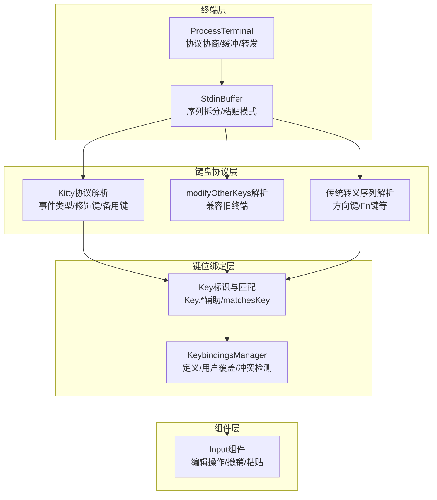
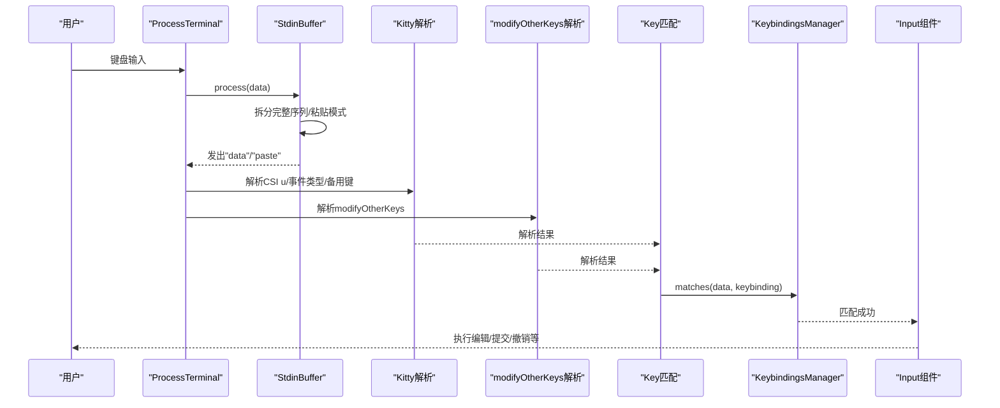
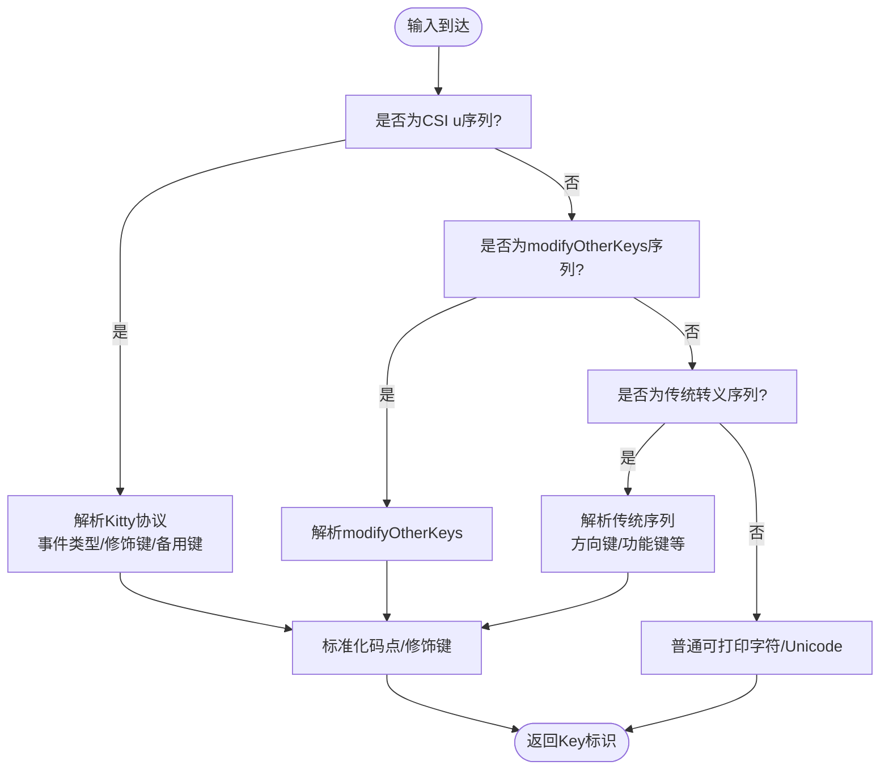
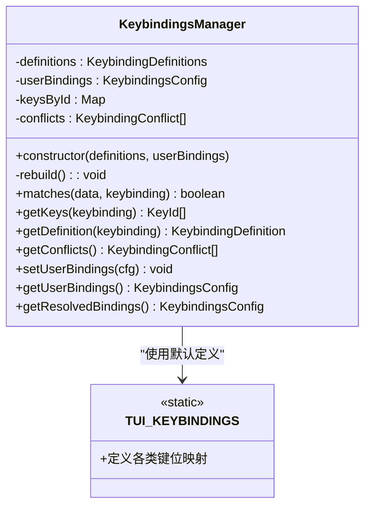
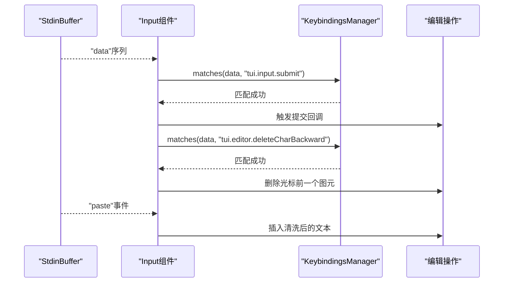
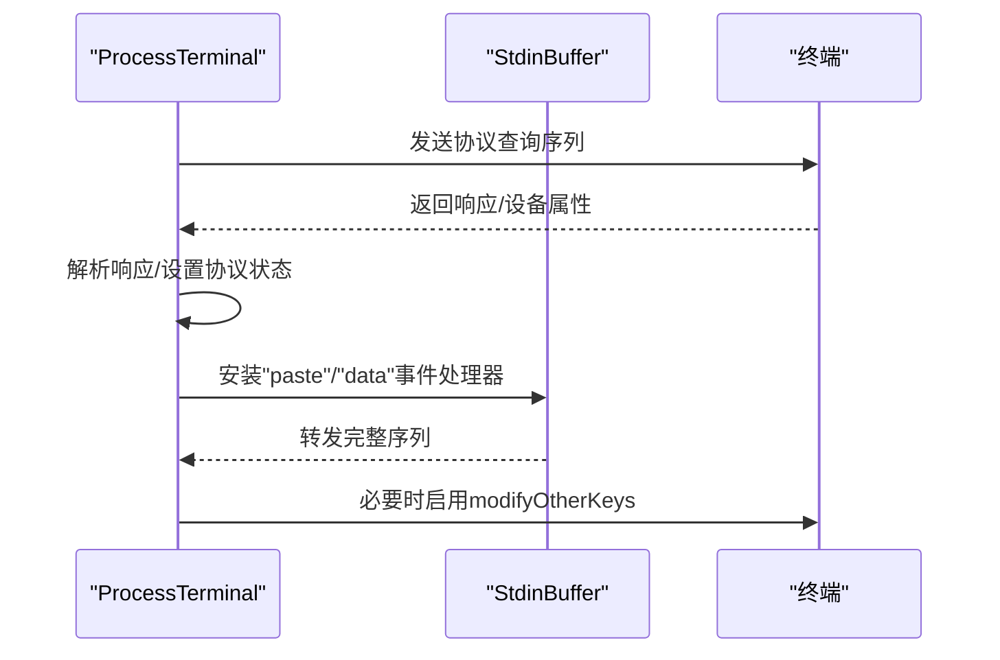
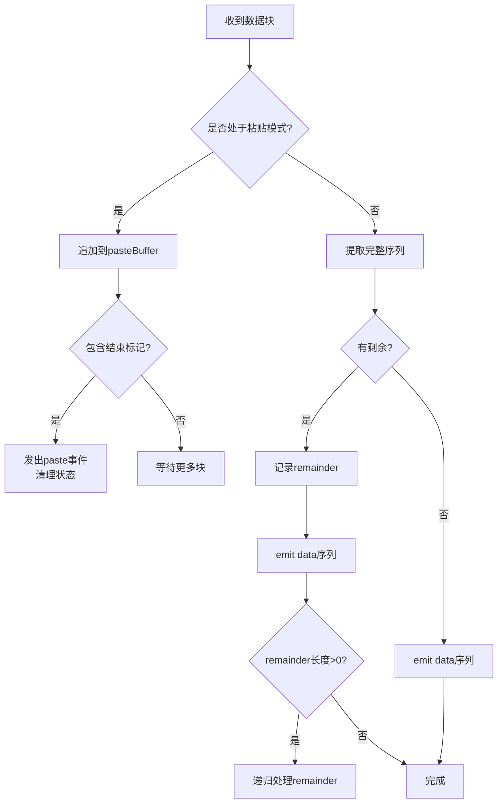
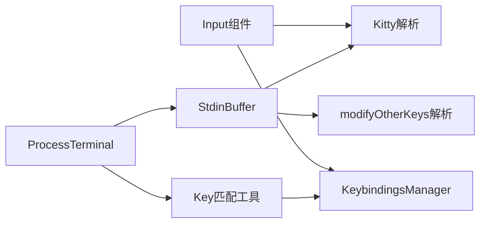

# 键盘输入处理系统

<cite>
**本文档引用的文件**
- [packages/tui/src/keybindings.ts](file://packages/tui/src/keybindings.ts)
- [packages/tui/src/keys.ts](file://packages/tui/src/keys.ts)
- [packages/tui/src/components/input.ts](file://packages/tui/src/components/input.ts)
- [packages/tui/src/terminal.ts](file://packages/tui/src/terminal.ts)
- [packages/tui/src/stdin-buffer.ts](file://packages/tui/src/stdin-buffer.ts)
- [packages/tui/src/native-modifiers.ts](file://packages/tui/src/native-modifiers.ts)
- [packages/tui/src/index.ts](file://packages/tui/src/index.ts)
</cite>

## 目录
1. [简介](#简介)
2. [项目结构](#项目结构)
3. [核心组件](#核心组件)
4. [架构总览](#架构总览)
5. [详细组件分析](#详细组件分析)
6. [依赖关系分析](#依赖关系分析)
7. [性能考虑](#性能考虑)
8. [故障排除指南](#故障排除指南)
9. [结论](#结论)

## 简介
本文件面向Pi终端UI库的键盘输入处理系统，系统性地阐述键盘事件解析机制（特殊键识别、组合键与修饰键检测）、键位绑定配置（全局快捷键、组件特定绑定、冲突解决）、终端协议支持（Kitty、modifyOtherKeys等）以及输入缓冲与批量处理的性能优化策略。同时提供键盘事件监听器注册方法与自定义键盘行为的实现指南，帮助开发者在不同终端环境下稳定可靠地处理键盘输入。

## 项目结构
键盘输入处理系统主要由以下模块组成：
- 键盘协议解析：负责识别并解析Kitty键盘协议、modifyOtherKeys序列及传统转义序列
- 键位绑定管理：提供键位定义、用户覆盖、冲突检测与匹配
- 输入组件：接收解析后的输入，执行编辑操作（光标移动、删除、粘贴、撤销等）
- 终端适配层：负责协议协商、缓冲拆分、事件转发
- 输入缓冲：将分片的stdin数据重组为完整序列，避免误判

**图表来源**
- [packages/tui/src/terminal.ts:100-394](file://packages/tui/src/terminal.ts#L100-L394)
- [packages/tui/src/stdin-buffer.ts:274-398](file://packages/tui/src/stdin-buffer.ts#L274-L398)
- [packages/tui/src/keys.ts:507-713](file://packages/tui/src/keys.ts#L507-L713)
- [packages/tui/src/keybindings.ts:155-231](file://packages/tui/src/keybindings.ts#L155-L231)
- [packages/tui/src/components/input.ts:48-211](file://packages/tui/src/components/input.ts#L48-L211)

**章节来源**
- [packages/tui/src/index.ts:34-61](file://packages/tui/src/index.ts#L34-L61)

## 核心组件
- 键盘协议解析器（keys.ts）
  - 支持Kitty键盘协议（CSI u格式、事件类型、备用键报告）
  - 兼容modifyOtherKeys（xterm兼容模式）
  - 解析传统转义序列（方向键、功能键、Home/End等）
  - 提供Key标识构造器与matchesKey匹配函数
- 键位绑定管理器（keybindings.ts）
  - 定义默认键位映射（编辑、输入、选择）
  - 用户可覆盖键位，自动去重与冲突检测
  - 暴露匹配接口与冲突查询
- 输入组件（components/input.ts）
  - 处理粘贴模式（Bracketed Paste）
  - 基于键位绑定执行编辑动作
  - 集成撤销栈、Kill Ring、单词导航
- 终端适配层（terminal.ts）
  - 协商Kitty键盘协议（flags 1/2/4），回退到modifyOtherKeys
  - 设置Bracketed Paste，启用Windows虚拟终端输入
  - 将完整序列转发给上层处理
- 输入缓冲（stdin-buffer.ts）
  - 将分片的stdin数据重组为完整序列
  - 处理粘贴模式起止标记
  - 超时刷新，保证低延迟

**章节来源**
- [packages/tui/src/keys.ts:1-1401](file://packages/tui/src/keys.ts#L1-L1401)
- [packages/tui/src/keybindings.ts:1-245](file://packages/tui/src/keybindings.ts#L1-L245)
- [packages/tui/src/components/input.ts:1-448](file://packages/tui/src/components/input.ts#L1-L448)
- [packages/tui/src/terminal.ts:100-574](file://packages/tui/src/terminal.ts#L100-L574)
- [packages/tui/src/stdin-buffer.ts:1-435](file://packages/tui/src/stdin-buffer.ts#L1-L435)

## 架构总览
键盘输入从终端进入，经过协议协商与缓冲拆分后，进入键盘协议解析层；解析结果交由键位绑定层匹配；最终驱动组件执行具体操作。

**图表来源**
- [packages/tui/src/terminal.ts:178-218](file://packages/tui/src/terminal.ts#L178-L218)
- [packages/tui/src/stdin-buffer.ts:287-398](file://packages/tui/src/stdin-buffer.ts#L287-L398)
- [packages/tui/src/keys.ts:587-713](file://packages/tui/src/keys.ts#L587-L713)
- [packages/tui/src/keybindings.ts:194-200](file://packages/tui/src/keybindings.ts#L194-L200)
- [packages/tui/src/components/input.ts:48-211](file://packages/tui/src/components/input.ts#L48-L211)

## 详细组件分析

### 键盘协议解析（Kitty/modifyOtherKeys/传统序列）
- Kitty协议解析
  - 支持CSI u格式（含事件类型flag 2、备用键flag 4）
  - 识别箭头键与功能键的带修饰符变体
  - 正则匹配事件类型（press/repeat/release），并提供isKeyRelease/isKeyRepeat判断
  - 对非拉丁布局使用“基础布局键”进行匹配，避免布局重映射导致的误判
- modifyOtherKeys解析
  - 兼容xterm modifyOtherKeys序列，用于无Kitty协议的终端
  - 与Kitty协议互补，确保修饰键信息可用
- 传统转义序列解析
  - 方向键、Home/End、PageUp/PageDown、功能键等
  - 支持Shift/Control变体序列
- 修饰键与字符控制
  - 提供rawCtrlChar计算通用控制字符
  - 识别Windows Terminal下Backspace的特殊语义（Ctrl+Backspace vs普通Backspace）

**图表来源**
- [packages/tui/src/keys.ts:587-713](file://packages/tui/src/keys.ts#L587-L713)
- [packages/tui/src/keys.ts:368-481](file://packages/tui/src/keys.ts#L368-L481)
- [packages/tui/src/keys.ts:749-774](file://packages/tui/src/keys.ts#L749-L774)

**章节来源**
- [packages/tui/src/keys.ts:25-40](file://packages/tui/src/keys.ts#L25-L40)
- [packages/tui/src/keys.ts:507-713](file://packages/tui/src/keys.ts#L507-L713)
- [packages/tui/src/keys.ts:788-800](file://packages/tui/src/keys.ts#L788-L800)

### 键位绑定系统（全局快捷键与冲突解决）
- 默认键位定义
  - 编辑类：光标移动、单词跳转、删除、撤销、剪贴板操作
  - 输入类：换行、提交、Tab/自动补全、复制
  - 选择类：上下翻页、确认、取消
- 用户覆盖与去重
  - 用户可通过KeybindingsConfig覆盖默认键位
  - 内部对重复键位进行去重与冲突收集
- 匹配与查询
  - matches(data, keybinding)用于单次匹配
  - getKeys/getDefinition获取键位详情
  - getConflicts导出冲突列表
- 全局实例
  - setKeybindings/getKeybindings提供全局共享的键位管理器

**图表来源**
- [packages/tui/src/keybindings.ts:155-231](file://packages/tui/src/keybindings.ts#L155-L231)
- [packages/tui/src/keybindings.ts:54-134](file://packages/tui/src/keybindings.ts#L54-L134)

**章节来源**
- [packages/tui/src/keybindings.ts:1-245](file://packages/tui/src/keybindings.ts#L1-L245)

### 输入组件（Input）与键盘行为
- 粘贴模式处理
  - 跟踪Bracketed Paste起止标记，缓冲完整片段
  - 清洗粘贴内容（换行/制表符规范化）
- 键位驱动的编辑操作
  - 提交、撤销、删除、剪切/粘贴、光标移动、单词级操作
  - 使用UndoStack与KillRing实现撤销与Yank轮换
- 字符插入与控制字符过滤
  - Kitty CSI-u可打印字符解码优先
  - 过滤C0/C1控制字符，保留可打印Unicode

**图表来源**
- [packages/tui/src/stdin-buffer.ts:208-212](file://packages/tui/src/stdin-buffer.ts#L208-L212)
- [packages/tui/src/components/input.ts:48-211](file://packages/tui/src/components/input.ts#L48-L211)
- [packages/tui/src/keybindings.ts:194-200](file://packages/tui/src/keybindings.ts#L194-L200)

**章节来源**
- [packages/tui/src/components/input.ts:1-448](file://packages/tui/src/components/input.ts#L1-L448)

### 终端协议支持与协商
- Kitty键盘协议
  - 请求flags 1/2/4，检测响应并启用
  - 回退路径：超时后启用modifyOtherKeys
- modifyOtherKeys
  - 在Kitty不可用时启用，兼容旧终端
- Windows虚拟终端输入
  - 启用ENABLE_VIRTUAL_TERMINAL_INPUT以区分Shift+Tab等修饰键
- Apple终端特殊处理
  - Shift+Enter在Apple Terminal中转换为特定序列

**图表来源**
- [packages/tui/src/terminal.ts:234-277](file://packages/tui/src/terminal.ts#L234-L277)
- [packages/tui/src/terminal.ts:348-352](file://packages/tui/src/terminal.ts#L348-L352)
- [packages/tui/src/terminal.ts:366-394](file://packages/tui/src/terminal.ts#L366-L394)

**章节来源**
- [packages/tui/src/terminal.ts:100-574](file://packages/tui/src/terminal.ts#L100-L574)

### 输入缓冲与批量处理
- 分片序列重组
  - 识别ESC开头的CSI/OSC/DCS/APC/SS3等序列
  - 特殊处理WezTerm Escape键与CSI-u拼接场景
- 粘贴模式
  - 自动捕获Bracketed Paste起止标记
  - 将粘贴内容作为独立"paste"事件发出
- 超时刷新
  - 10ms默认超时，避免阻塞
  - flush强制输出剩余缓冲

**图表来源**
- [packages/tui/src/stdin-buffer.ts:192-255](file://packages/tui/src/stdin-buffer.ts#L192-L255)
- [packages/tui/src/stdin-buffer.ts:315-377](file://packages/tui/src/stdin-buffer.ts#L315-L377)

**章节来源**
- [packages/tui/src/stdin-buffer.ts:1-435](file://packages/tui/src/stdin-buffer.ts#L1-L435)

### 键盘事件监听器注册与自定义行为
- 注册监听器
  - 通过ProcessTerminal.start传入onInput回调，接收已拆分的完整序列
  - 组件内部通过getKeybindings()获取全局键位管理器
- 自定义键位
  - 使用setKeybindings替换全局管理器或调用KeybindingsManager.setUserBindings更新用户配置
  - 通过getConflicts()检查冲突，合理分配键位
- 自定义行为
  - 在组件handleInput中添加新的键位分支，调用对应编辑/业务逻辑
  - 结合UndoStack/KillRing实现一致的撤销/恢复体验

**章节来源**
- [packages/tui/src/terminal.ts:134-168](file://packages/tui/src/terminal.ts#L134-L168)
- [packages/tui/src/keybindings.ts:235-244](file://packages/tui/src/keybindings.ts#L235-L244)
- [packages/tui/src/components/input.ts:48-211](file://packages/tui/src/components/input.ts#L48-L211)

## 依赖关系分析
- 组件耦合
  - Input依赖KeybindingsManager与Kitty可打印字符解码
  - ProcessTerminal依赖StdinBuffer与协议状态
  - StdinBuffer与keys.ts的Kitty/modifyOtherKeys解析相互独立但共同服务上层
- 外部依赖
  - Node.js标准库（fs、events、path、buffer）
  - 平台原生模块（Darwin/Windows修饰键检测、Windows控制台模式）
- 可能的循环依赖
  - 当前模块间为单向依赖（Terminal->StdinBuffer->解析器），无循环

**图表来源**
- [packages/tui/src/components/input.ts:1-8](file://packages/tui/src/components/input.ts#L1-L8)
- [packages/tui/src/terminal.ts:1-8](file://packages/tui/src/terminal.ts#L1-L8)
- [packages/tui/src/stdin-buffer.ts:1-20](file://packages/tui/src/stdin-buffer.ts#L1-L20)
- [packages/tui/src/keys.ts:1-20](file://packages/tui/src/keys.ts#L1-L20)

**章节来源**
- [packages/tui/src/index.ts:34-61](file://packages/tui/src/index.ts#L34-L61)

## 性能考虑
- 输入缓冲
  - 10ms超时阈值平衡延迟与完整性；可根据终端响应能力调整
  - flush机制避免长时间阻塞，确保交互流畅
- 协议协商
  - Kitty协议协商超时150ms，失败后快速启用modifyOtherKeys，降低首帧延迟
- 图形与宽度计算
  - Input渲染使用图元分割与宽度缓存，避免重复计算
- 控制字符过滤
  - 在输入阶段过滤C0/C1控制字符，减少后续处理开销

[本节为通用性能讨论，无需列出具体文件来源]

## 故障排除指南
- Kitty协议未生效
  - 检查协议协商响应与超时设置；确认终端支持Kitty flags
  - 若无响应，系统会自动启用modifyOtherKeys，确保基本修饰键可用
- 修饰键丢失（如Shift+Tab）
  - Windows平台需启用虚拟终端输入；若失败，Shift+Tab可能被识别为普通Tab
- Backspace语义异常
  - 在Windows Terminal中，原始BS字节可能表示Ctrl+Backspace；系统采用启发式区分
- 粘贴内容错乱
  - 确认Bracketed Paste已启用；检查paste事件是否正确触发
- 键位冲突
  - 使用getConflicts()查看冲突列表，重新分配键位避免重复

**章节来源**
- [packages/tui/src/terminal.ts:234-277](file://packages/tui/src/terminal.ts#L234-L277)
- [packages/tui/src/terminal.ts:366-394](file://packages/tui/src/terminal.ts#L366-L394)
- [packages/tui/src/keys.ts:715-734](file://packages/tui/src/keys.ts#L715-L734)
- [packages/tui/src/stdin-buffer.ts:315-377](file://packages/tui/src/stdin-buffer.ts#L315-L377)
- [packages/tui/src/keybindings.ts:136-212](file://packages/tui/src/keybindings.ts#L136-L212)

## 结论
Pi终端UI库的键盘输入处理系统通过“协议解析—键位绑定—组件执行”的清晰分层，实现了对现代终端协议（Kitty、modifyOtherKeys）与传统序列的全面兼容。结合输入缓冲与超时策略，系统在复杂环境与高并发输入下仍保持稳定与低延迟。开发者可通过键位绑定管理器灵活定制快捷键，配合Input组件实现丰富的编辑行为，并在必要时扩展协议解析与缓冲策略以满足特定需求。