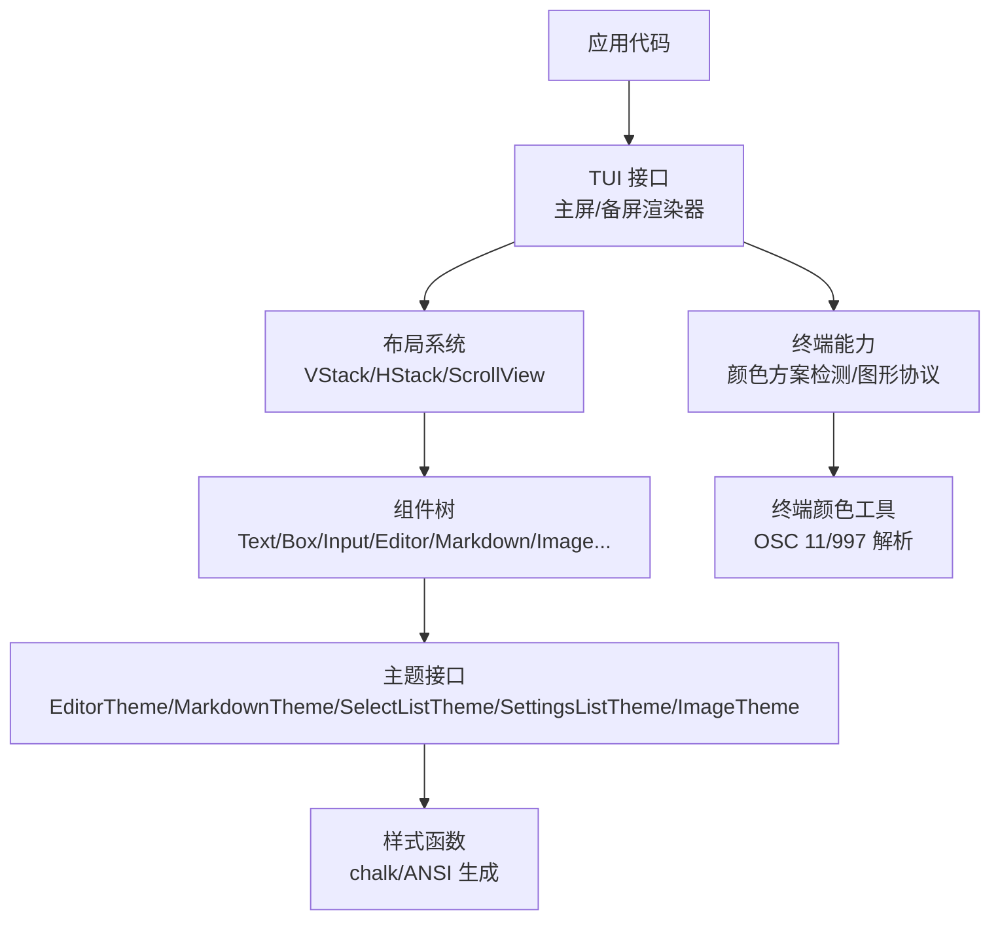
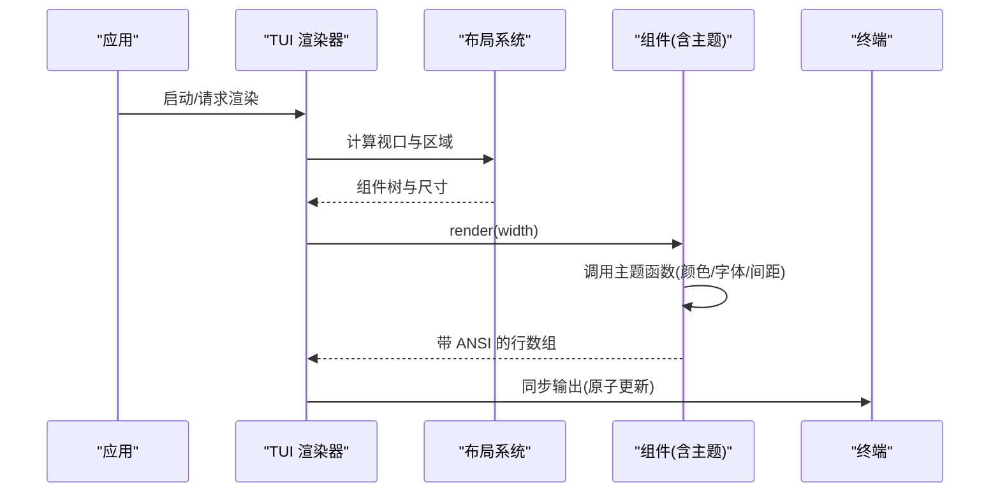
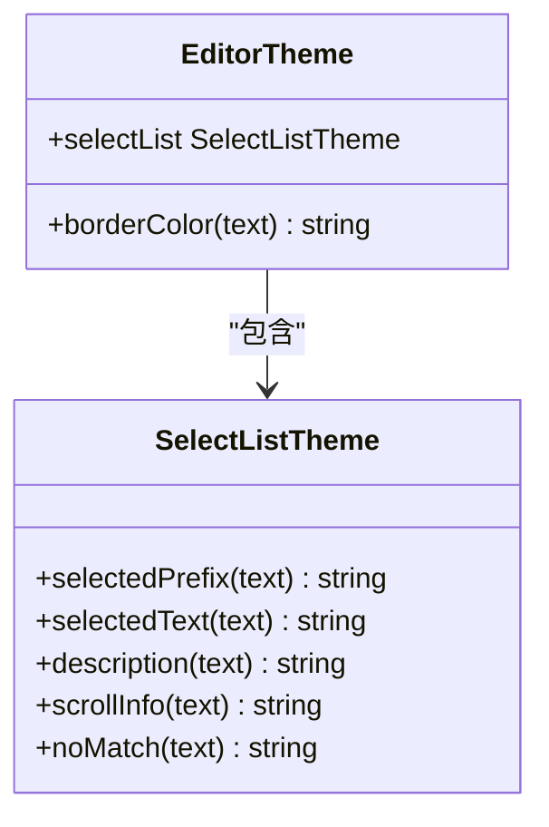
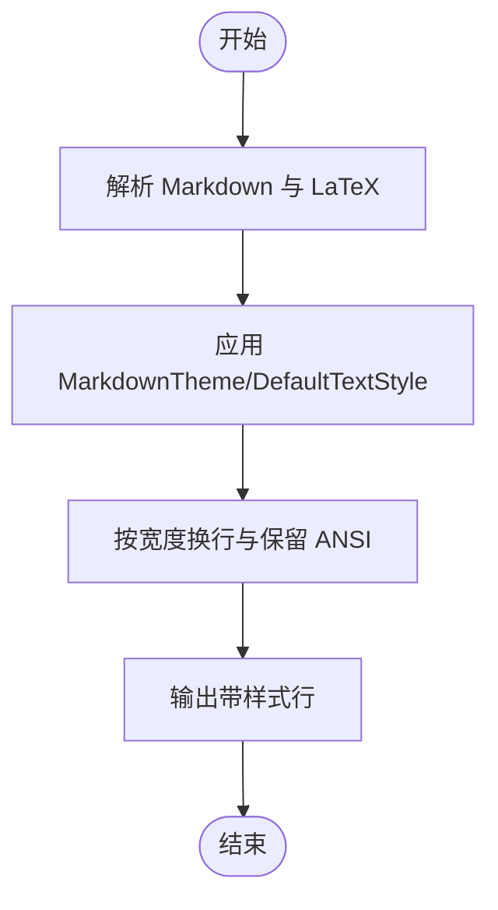
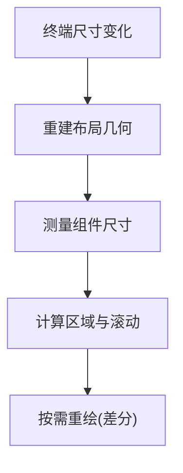
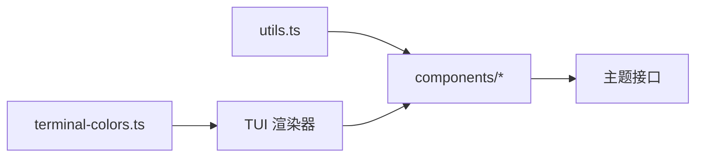

# 主题定制

<cite>
**本文引用的文件**
- [packages/tui/README.md](file://packages/tui/README.md)
- [packages/tui/src/index.ts](file://packages/tui/src/index.ts)
- [packages/tui/src/components/editor.ts](file://packages/tui/src/components/editor.ts)
- [packages/tui/src/components/markdown.ts](file://packages/tui/src/components/markdown.ts)
- [packages/tui/src/components/select-list.ts](file://packages/tui/src/components/select-list.ts)
- [packages/tui/src/components/settings-list.ts](file://packages/tui/src/components/settings-list.ts)
- [packages/tui/src/components/image.ts](file://packages/tui/src/components/image.ts)
- [packages/tui/src/components/text.ts](file://packages/tui/src/components/text.ts)
- [packages/tui/src/components/box.ts](file://packages/tui/src/components/box.ts)
- [packages/tui/src/components/truncated-text.ts](file://packages/tui/src/components/truncated-text.ts)
- [packages/tui/src/components/input.ts](file://packages/tui/src/components/input.ts)
- [packages/tui/src/components/loader.ts](file://packages/tui/src/components/loader.ts)
- [packages/tui/src/components/cancellable-loader.ts](file://packages/tui/src/components/cancellable-loader.ts)
- [packages/tui/src/components/v-stack.ts](file://packages/tui/src/components/v-stack.ts)
- [packages/tui/src/components/h-stack.ts](file://packages/tui/src/components/h-stack.ts)
- [packages/tui/src/components/scroll-view.ts](file://packages/tui/src/components/scroll-view.ts)
- [packages/tui/src/layout.ts](file://packages/tui/src/layout.ts)
- [packages/tui/src/layout-node.ts](file://packages/tui/src/layout-node.ts)
- [packages/tui/src/terminal-colors.ts](file://packages/tui/src/terminal-colors.ts)
- [packages/tui/src/utils.ts](file://packages/tui/src/utils.ts)
- [packages/tui/test/test-themes.ts](file://packages/tui/test/test-themes.ts)
</cite>

## 目录
1. [简介](#简介)
2. [项目结构](#项目结构)
3. [核心组件](#核心组件)
4. [架构总览](#架构总览)
5. [详细组件分析](#详细组件分析)
6. [依赖关系分析](#依赖关系分析)
7. [性能考虑](#性能考虑)
8. [故障排查指南](#故障排查指南)
9. [结论](#结论)
10. [附录](#附录)

## 简介
本文件面向 TUI 主题定制系统，系统性说明主题架构、样式系统与视觉属性（颜色方案、字体与字形、间距）的定制方法；阐述如何创建自定义主题与实现主题切换；介绍响应式主题与根据终端大小自动调整布局的策略；提供主题开发与预览的实践建议；并涵盖无障碍访问支持（高对比度模式、屏幕阅读器兼容性）以及主题最佳实践与设计规范。

## 项目结构
TUI 的主题能力以“组件 + 主题接口”的方式组织：每个可样式化的组件通过主题函数注入 ANSI 样式，渲染时输出带样式的行。核心入口导出类型与默认主题，具体组件在 components 目录下按功能划分，工具与终端能力在 src 根目录中提供。

图表来源
- [packages/tui/README.md:55-127](file://packages/tui/README.md#L55-L127)
- [packages/tui/src/components/editor.ts:1-20](file://packages/tui/src/components/editor.ts#L1-L20)
- [packages/tui/src/components/markdown.ts:1-10](file://packages/tui/src/components/markdown.ts#L1-L10)
- [packages/tui/src/terminal-colors.ts:1-74](file://packages/tui/src/terminal-colors.ts#L1-L74)

章节来源
- [packages/tui/README.md:55-127](file://packages/tui/README.md#L55-L127)
- [packages/tui/src/components/editor.ts:1-20](file://packages/tui/src/components/editor.ts#L1-L20)
- [packages/tui/src/components/markdown.ts:1-10](file://packages/tui/src/components/markdown.ts#L1-L10)
- [packages/tui/src/terminal-colors.ts:1-74](file://packages/tui/src/terminal-colors.ts#L1-L74)

## 核心组件
- 编辑器与输入
  - Editor：多行编辑、自动补全、粘贴处理、滚动与边框样式，通过 EditorTheme 定制边框与内嵌选择列表样式。
  - Input：单行输入，具备水平滚动与常用快捷键。
- 文本与容器
  - Text/TruncatedText：文本显示与截断，支持背景函数与内边距。
  - Box：为子组件统一添加背景色与内边距。
- 列表与设置
  - SelectList：交互式选择列表，使用 SelectListTheme 定制选中项、描述、滚动信息、无匹配提示等。
  - SettingsList：设置面板，支持值循环与子菜单，使用 SettingsListTheme 定制标签、值、描述、光标与提示。
- 富文本与媒体
  - Markdown：标题、链接、代码块、引用、加粗/斜体/删除线/下划线等，使用 MarkdownTheme 定制各元素样式，并可接入语法高亮。
  - Image：内联图片渲染，支持 Kitty/iTerm2 协议，ImageTheme 控制回退颜色。
- 加载指示
  - Loader/CancellableLoader：动画加载与可取消异步任务，支持消息与旋转器颜色函数。
- 布局
  - VStack/HStack/ScrollView：在备用缓冲区中构建固定高度视口与独立滚动区域，支持 basis/grow/shrink/minSize/maxSize 与响应式 visible 回调。

章节来源
- [packages/tui/README.md:278-598](file://packages/tui/README.md#L278-L598)
- [packages/tui/src/components/editor.ts:1-200](file://packages/tui/src/components/editor.ts#L1-L200)
- [packages/tui/src/components/markdown.ts:177-200](file://packages/tui/src/components/markdown.ts#L177-L200)
- [packages/tui/src/components/select-list.ts:1-200](file://packages/tui/src/components/select-list.ts#L1-L200)
- [packages/tui/src/components/settings-list.ts:1-200](file://packages/tui/src/components/settings-list.ts#L1-L200)
- [packages/tui/src/components/image.ts:1-200](file://packages/tui/src/components/image.ts#L1-L200)
- [packages/tui/src/components/loader.ts:1-200](file://packages/tui/src/components/loader.ts#L1-L200)
- [packages/tui/src/components/cancellable-loader.ts:1-200](file://packages/tui/src/components/cancellable-loader.ts#L1-L200)
- [packages/tui/src/components/v-stack.ts:1-200](file://packages/tui/src/components/v-stack.ts#L1-L200)
- [packages/tui/src/components/h-stack.ts:1-200](file://packages/tui/src/components/h-stack.ts#L1-L200)
- [packages/tui/src/components/scroll-view.ts:1-200](file://packages/tui/src/components/scroll-view.ts#L1-L200)

## 架构总览
主题系统围绕“组件渲染 → 主题函数 → ANSI 输出”的链路工作。组件在 render(width) 中调用主题函数对文本进行着色，最终由渲染器以同步输出方式写入终端，避免闪烁。布局系统在备用缓冲区中计算视口与滚动区域，支持响应式可见性。

图表来源
- [packages/tui/README.md:55-127](file://packages/tui/README.md#L55-L127)
- [packages/tui/src/components/editor.ts:1-200](file://packages/tui/src/components/editor.ts#L1-L200)
- [packages/tui/src/components/markdown.ts:177-200](file://packages/tui/src/components/markdown.ts#L177-L200)

## 详细组件分析

### 编辑器主题（EditorTheme）
- 作用：定义编辑器边框颜色与内嵌选择列表样式。
- 关键要点：
  - borderColor：用于绘制编辑器上下边框。
  - selectList：复用 SelectListTheme，保证选择列表风格一致。
  - 动态更新：可通过实例属性或方法动态修改边框与内边距。
- 复杂度：主题函数 O(1)，渲染受内容长度影响。

图表来源
- [packages/tui/src/components/editor.ts:1-200](file://packages/tui/src/components/editor.ts#L1-L200)
- [packages/tui/src/components/select-list.ts:1-200](file://packages/tui/src/components/select-list.ts#L1-L200)

章节来源
- [packages/tui/src/components/editor.ts:1-200](file://packages/tui/src/components/editor.ts#L1-L200)
- [packages/tui/src/components/select-list.ts:1-200](file://packages/tui/src/components/select-list.ts#L1-L200)

### Markdown 主题（MarkdownTheme 与 DefaultTextStyle）
- 作用：为标题、链接、代码块、引用、分隔线、列表、加粗/斜体/删除线/下划线等元素提供样式函数。
- 关键点：
  - 各元素对应一个样式函数，返回带 ANSI 的字符串。
  - DefaultTextStyle 提供全局默认样式（前景/背景、粗体/斜体/删除线/下划线）。
  - 可选 highlightCode 接入语法高亮。
- 复杂度：解析与渲染与文档规模线性相关；缓存可提升重复渲染性能。

图表来源
- [packages/tui/src/components/markdown.ts:177-200](file://packages/tui/src/components/markdown.ts#L177-L200)

章节来源
- [packages/tui/src/components/markdown.ts:177-200](file://packages/tui/src/components/markdown.ts#L177-L200)

### 选择列表与设置列表主题
- SelectListTheme：选中前缀、选中文本、描述、滚动信息、无匹配提示。
- SettingsListTheme：标签、值、描述、光标字符、提示文案。
- 交互：键盘导航、Enter/Space 激活、Escape 取消。
- 适用场景：配置面板、选项选择、快速筛选。

章节来源
- [packages/tui/src/components/select-list.ts:1-200](file://packages/tui/src/components/select-list.ts#L1-L200)
- [packages/tui/src/components/settings-list.ts:1-200](file://packages/tui/src/components/settings-list.ts#L1-L200)

### 图片主题（ImageTheme）
- 作用：在无图形协议支持时提供回退颜色。
- 兼容：Kitty/iTerm2 内联图像协议；在备用缓冲区中对 iTerm2 回退为文本占位以避免残留。
- 性能：尺寸从图像头自动解析，按需缩放。

章节来源
- [packages/tui/src/components/image.ts:1-200](file://packages/tui/src/components/image.ts#L1-L200)
- [packages/tui/README.md:569-598](file://packages/tui/README.md#L569-L598)

### 文本与容器主题
- Text/TruncatedText：支持背景函数与内边距，适合状态栏与标题。
- Box：统一为子组件添加背景与内边距，便于构建卡片式 UI。

章节来源
- [packages/tui/src/components/text.ts:1-200](file://packages/tui/src/components/text.ts#L1-L200)
- [packages/tui/src/components/box.ts:1-200](file://packages/tui/src/components/box.ts#L1-L200)
- [packages/tui/src/components/truncated-text.ts:1-200](file://packages/tui/src/components/truncated-text.ts#L1-L200)

### 加载指示器主题
- Loader/CancellableLoader：旋转器与消息颜色函数；CancellableLoader 支持 Escape 取消与 AbortSignal。
- 用途：异步任务反馈与用户中断。

章节来源
- [packages/tui/src/components/loader.ts:1-200](file://packages/tui/src/components/loader.ts#L1-L200)
- [packages/tui/src/components/cancellable-loader.ts:1-200](file://packages/tui/src/components/cancellable-loader.ts#L1-L200)

### 布局与响应式主题
- 布局：VStack/HStack/ScrollView 在备用缓冲区中分配受限区域，支持 basis/grow/shrink/minSize/maxSize。
- 响应式：visible 回调可根据终端宽高决定组件是否渲染；overlay 也支持百分比定位与 margin 约束。
- 滚动：鼠标滚轮与键盘导航作用于当前视图，支持链式滚动与语义标记跳转。

图表来源
- [packages/tui/README.md:81-127](file://packages/tui/README.md#L81-L127)
- [packages/tui/src/layout.ts:1-200](file://packages/tui/src/layout.ts#L1-L200)
- [packages/tui/src/layout-node.ts:1-200](file://packages/tui/src/layout-node.ts#L1-L200)

章节来源
- [packages/tui/README.md:81-127](file://packages/tui/README.md#L81-L127)
- [packages/tui/src/layout.ts:1-200](file://packages/tui/src/layout.ts#L1-L200)
- [packages/tui/src/layout-node.ts:1-200](file://packages/tui/src/layout-node.ts#L1-L200)

## 依赖关系分析
- 组件依赖主题接口：Editor 依赖 EditorTheme/SelectListTheme；Markdown 依赖 MarkdownTheme；Image 依赖 ImageTheme；Loader 依赖颜色函数。
- 工具依赖：utils 提供可见宽度、换行、背景应用等；terminal-colors 提供终端颜色方案检测与 OSC 解析。
- 渲染器依赖：TUI 主屏/备屏渲染器负责同步输出与差分更新。

图表来源
- [packages/tui/src/utils.ts:1-200](file://packages/tui/src/utils.ts#L1-L200)
- [packages/tui/src/terminal-colors.ts:1-74](file://packages/tui/src/terminal-colors.ts#L1-L74)
- [packages/tui/src/components/editor.ts:1-200](file://packages/tui/src/components/editor.ts#L1-L200)
- [packages/tui/src/components/markdown.ts:1-10](file://packages/tui/src/components/markdown.ts#L1-L10)

章节来源
- [packages/tui/src/utils.ts:1-200](file://packages/tui/src/utils.ts#L1-L200)
- [packages/tui/src/terminal-colors.ts:1-74](file://packages/tui/src/terminal-colors.ts#L1-L74)
- [packages/tui/src/components/editor.ts:1-200](file://packages/tui/src/components/editor.ts#L1-L200)
- [packages/tui/src/components/markdown.ts:1-10](file://packages/tui/src/components/markdown.ts#L1-L10)

## 性能考虑
- 差分渲染：仅更新变更行或视口行，减少 I/O。
- 同步输出：使用 CSI 2026 原子更新，避免闪烁。
- 缓存：组件应缓存渲染结果并在必要时失效（invalidate），Markdown 支持渲染缓存。
- 宽度计算：使用 visibleWidth/truncateToWidth/wrapTextWithAnsi 正确处理 ANSI 与宽字符。
- 图片协议：在支持的终端启用内联图，否则回退文本占位以减少开销。

章节来源
- [packages/tui/README.md:652-663](file://packages/tui/README.md#L652-L663)
- [packages/tui/README.md:793-800](file://packages/tui/README.md#L793-L800)

## 故障排查指南
- 行宽越界：确保 render() 每行不超过 width，使用 truncateToWidth 或 wrapTextWithAnsi。
- IME 光标错位：实现 Focusable 并传播 focused 状态，确保候选窗口位置正确。
- 图片残留：在 iTerm2 备用缓冲区中会回退为文本占位，避免滚动时残留。
- 主题不生效：确认组件已传入正确的主题对象，且样式函数返回带 ANSI 的字符串。
- 颜色方案误判：检查终端报告数据是否符合 OSC 11/997 格式，必要时降级到默认主题。

章节来源
- [packages/tui/README.md:226-251](file://packages/tui/README.md#L226-L251)
- [packages/tui/README.md:595-598](file://packages/tui/README.md#L595-L598)
- [packages/tui/src/terminal-colors.ts:1-74](file://packages/tui/src/terminal-colors.ts#L1-L74)

## 结论
TUI 主题系统通过“组件 + 主题函数”的解耦设计，实现了灵活、可扩展的视觉定制能力。借助布局系统的响应式特性与终端能力检测，可在不同终端环境下保持一致的用户体验。遵循最佳实践（缓存、差分渲染、宽度安全、无障碍支持）可获得稳定高效的界面表现。

## 附录

### 颜色方案与终端检测
- 终端颜色方案：dark/light 通过终端报告解析（OSC 11/997），可用于自动切换主题。
- RGB 解析：支持十六进制与 RGBA 通道解析，适配高精度终端。

章节来源
- [packages/tui/src/terminal-colors.ts:1-74](file://packages/tui/src/terminal-colors.ts#L1-L74)

### 主题开发工具与预览
- 测试主题：test-themes.ts 提供基于 chalk 的默认主题示例，便于快速验证样式效果。
- 预览建议：在主屏模式下先验证静态外观，再切换到备用缓冲区验证滚动与响应式行为。

章节来源
- [packages/tui/test/test-themes.ts:1-39](file://packages/tui/test/test-themes.ts#L1-L39)

### 无障碍访问支持
- 高对比度模式：通过主题函数提高前景/背景对比度，确保可读性。
- 屏幕阅读器：保持语义清晰（如标题层级、链接文本），避免过度装饰导致噪音；在 Markdown 中使用合适的结构与链接。
- IME 支持：实现 Focusable 并正确放置光标标记，确保输入法候选窗口定位准确。

章节来源
- [packages/tui/README.md:226-251](file://packages/tui/README.md#L226-L251)
- [packages/tui/src/components/markdown.ts:177-200](file://packages/tui/src/components/markdown.ts#L177-L200)

### 主题最佳实践与设计规范
- 一致性：为同类组件使用统一的色调与字号策略，避免视觉混乱。
- 可维护性：将主题函数集中管理，按模块拆分（编辑器、Markdown、列表等）。
- 可测试性：使用测试主题覆盖常见终端能力，确保在不同环境下的表现。
- 性能优先：避免在主题函数中进行昂贵计算，尽量缓存中间结果。
- 响应式：利用 visible 回调与布局参数，在小终端上隐藏次要信息，聚焦核心内容。

章节来源
- [packages/tui/README.md:81-127](file://packages/tui/README.md#L81-L127)
- [packages/tui/src/components/v-stack.ts:1-200](file://packages/tui/src/components/v-stack.ts#L1-L200)
- [packages/tui/src/components/h-stack.ts:1-200](file://packages/tui/src/components/h-stack.ts#L1-L200)
- [packages/tui/src/components/scroll-view.ts:1-200](file://packages/tui/src/components/scroll-view.ts#L1-L200)