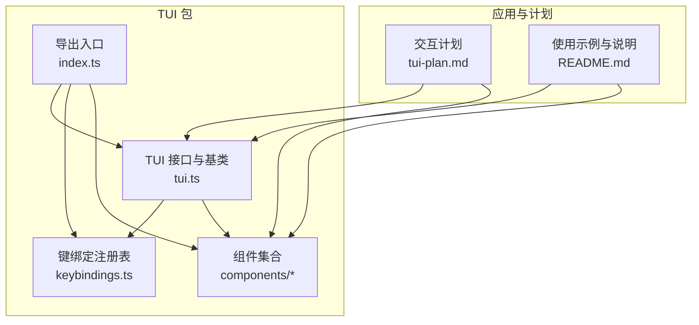
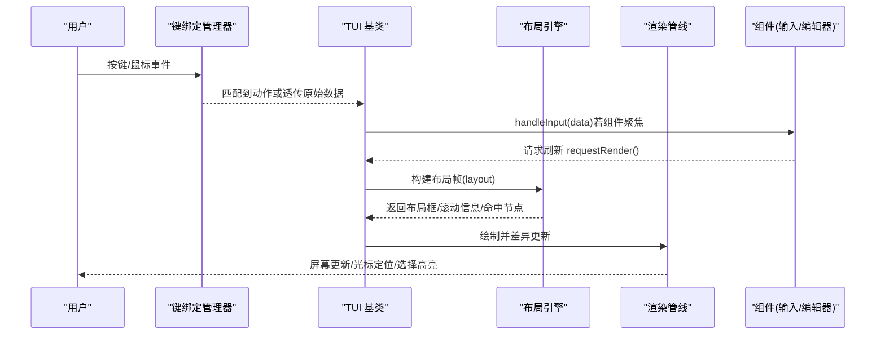
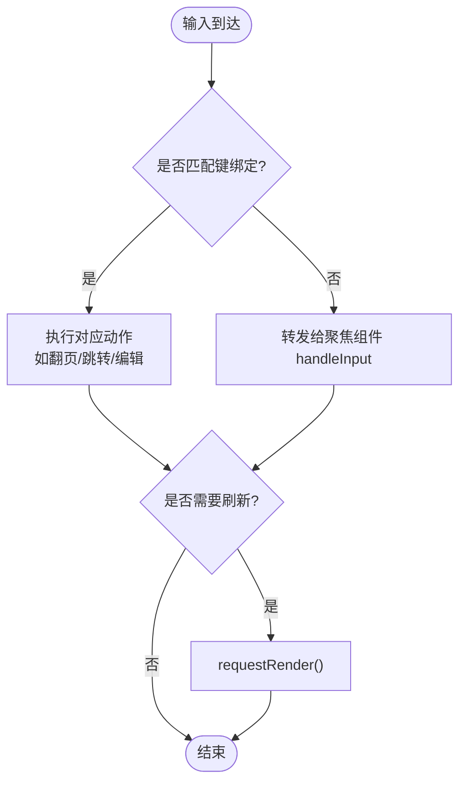
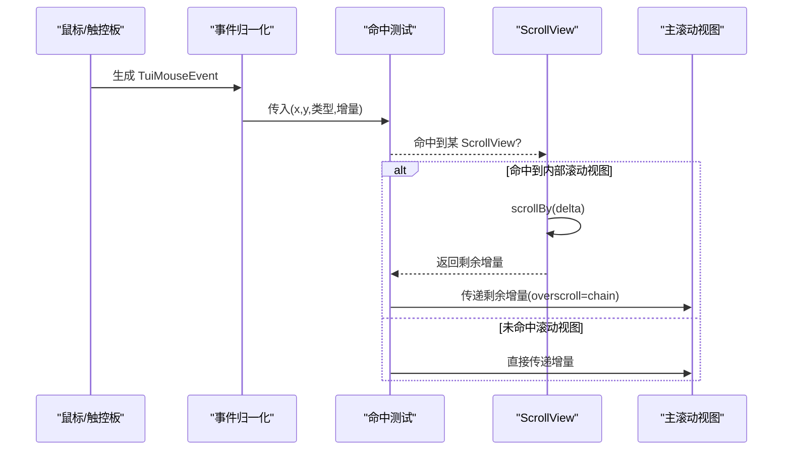
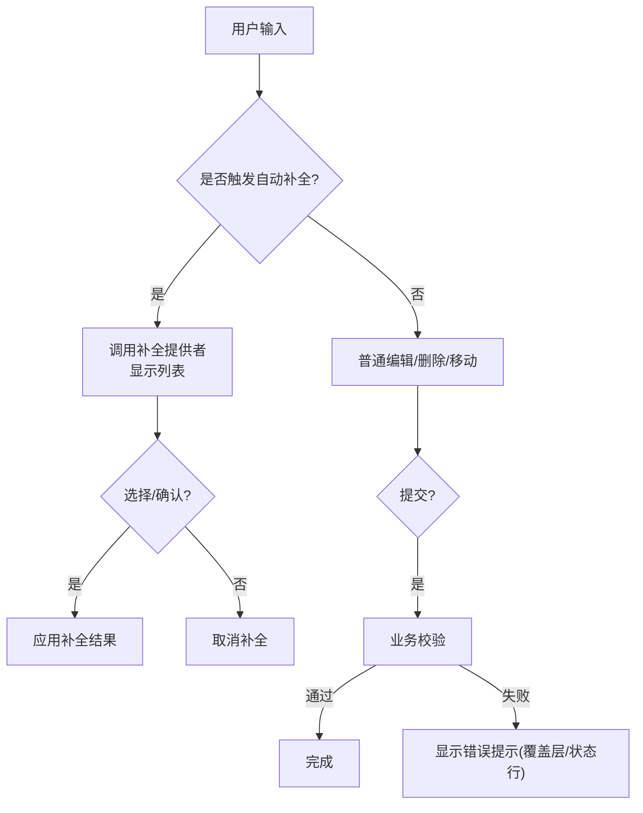
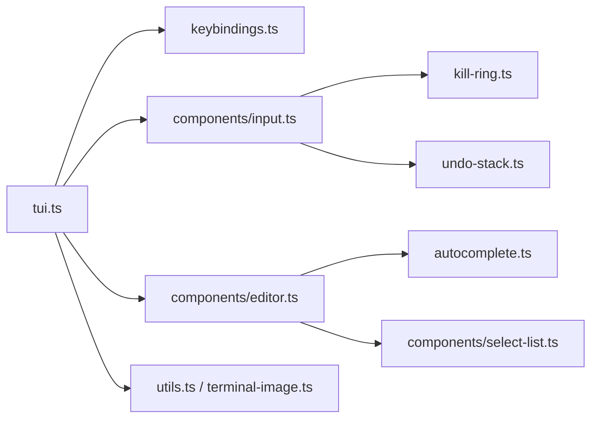

# 交互设计

<cite>
**本文引用的文件**
- [tui-plan.md](file://tui-plan.md)
- [README.md](file://packages/tui/README.md)
- [index.ts](file://packages/tui/src/index.ts)
- [keybindings.ts](file://packages/tui/src/keybindings.ts)
- [tui.ts](file://packages/tui/src/tui.ts)
- [input.ts](file://packages/tui/src/components/input.ts)
- [editor.ts](file://packages/tui/src/components/editor.ts)
</cite>

## 目录
1. [简介](#简介)
2. [项目结构](#项目结构)
3. [核心组件](#核心组件)
4. [架构总览](#架构总览)
5. [详细组件分析](#详细组件分析)
6. [依赖关系分析](#依赖关系分析)
7. [性能考量](#性能考量)
8. [故障排查指南](#故障排查指南)
9. [结论](#结论)
10. [附录](#附录)

## 简介
本文件面向 TUI 交互设计，聚焦键盘导航、焦点管理、快捷键绑定与命令模式；鼠标支持（点击、拖拽、滚轮）；手势识别与移动端适配策略；表单交互（输入验证、自动完成、错误提示）；用户反馈机制（加载状态、进度指示、通知系统）；无障碍访问（键盘操作、屏幕阅读器兼容）；国际化与本地化；以及交互设计模式与最佳实践。内容基于仓库中 TUI 包与交互计划文档进行系统化梳理。

## 项目结构
TUI 包提供可插拔渲染器（主屏/备用屏）、组件树、布局与滚动、输入与事件路由、覆盖层、主题与工具函数等。交互计划明确了备用屏下的约束布局（VStack/HStack/ScrollView）、命中测试、滚轮路由、选择与超链接、图像兼容、叠加层集成与退出最终文档输出等关键行为。

图表来源
- [tui.ts:291-329](file://packages/tui/src/tui.ts#L291-L329)
- [keybindings.ts:65-180](file://packages/tui/src/keybindings.ts#L65-L180)
- [index.ts:1-143](file://packages/tui/src/index.ts#L1-L143)
- [tui-plan.md:114-320](file://tui-plan.md#L114-L320)
- [README.md:55-127](file://packages/tui/README.md#L55-L127)

章节来源
- [tui-plan.md:1-120](file://tui-plan.md#L1-L120)
- [README.md:1-127](file://packages/tui/README.md#L1-L127)
- [index.ts:1-143](file://packages/tui/src/index.ts#L1-L143)

## 核心组件
- 渲染器与框架
  - TUI 接口与基类：统一组件管理、焦点、覆盖层、输入监听、生命周期、终端查询与渲染调度。
  - 主屏/备用屏渲染器：主屏保留终端历史滚动；备用屏提供固定视口与应用内滚动。
- 布局与滚动
  - VStack/HStack：轴对齐、尺寸分配（basis/grow/shrink/minSize/maxSize）、可见性条件。
  - ScrollView：垂直滚动、跟随底部、主视图标记、溢出回链（chain/contain）。
- 输入与编辑
  - Input：单行输入、水平滚动、粘贴缓冲、撤销/重做、剪贴板环。
  - Editor：多行编辑器、自动补全（斜杠命令/路径）、大段粘贴处理、历史浏览、字符跳转、滚动边框。
- 覆盖层与焦点
  - Overlay：定位、尺寸、可见性回调、捕获/非捕获焦点、焦点恢复策略。
- 键绑定与命令
  - KeybindingsManager：全局键绑定注册、冲突检测、默认键映射、用户配置覆盖。

章节来源
- [tui.ts:21-81](file://packages/tui/src/tui.ts#L21-L81)
- [tui.ts:291-329](file://packages/tui/src/tui.ts#L291-L329)
- [tui.ts:549-689](file://packages/tui/src/tui.ts#L549-L689)
- [keybindings.ts:1-180](file://packages/tui/src/keybindings.ts#L1-L180)
- [input.ts:1-448](file://packages/tui/src/components/input.ts#L1-L448)
- [editor.ts:270-800](file://packages/tui/src/components/editor.ts#L270-L800)
- [tui-plan.md:114-320](file://tui-plan.md#L114-L320)

## 架构总览
TUI 以“组件树 + 布局帧 + 渲染帧”的三段式流程组织交互：
- 组件树：长期存在、有状态（如 Editor/Input）。
- 布局帧：每帧重建，计算矩形、裁剪、命中区域、滚动祖先、光标位置。
- 渲染帧：绘制可见行、差异写入、提取光标、应用选择与覆盖层。

图表来源
- [tui.ts:757-800](file://packages/tui/src/tui.ts#L757-L800)
- [tui-plan.md:347-389](file://tui-plan.md#L347-L389)
- [tui-plan.md:496-567](file://tui-plan.md#L496-L567)

## 详细组件分析

### 键盘导航与焦点管理
- 焦点模型
  - 通过 setFocus(component) 设置当前焦点组件；Focusable 组件在聚焦时输出光标标记，TUI 据此放置硬件光标以支持 IME。
  - 覆盖层栈维护焦点恢复策略：当覆盖层隐藏/显示或移除时，焦点可恢复到上一个目标或指定目标。
- 命令模式与键绑定
  - 所有动作通过 KeybindingsManager 统一注册与匹配，支持默认键与用户自定义映射，并提供冲突检测。
  - 备用屏导航动作（翻页、半页、首尾、语义提示跳转）由键绑定驱动，优先作用于主滚动视图。

图表来源
- [keybindings.ts:201-277](file://packages/tui/src/keybindings.ts#L201-L277)
- [tui.ts:418-485](file://packages/tui/src/tui.ts#L418-L485)
- [tui.ts:757-800](file://packages/tui/src/tui.ts#L757-L800)

章节来源
- [tui.ts:58-81](file://packages/tui/src/tui.ts#L58-L81)
- [tui.ts:418-485](file://packages/tui/src/tui.ts#L418-L485)
- [tui.ts:549-689](file://packages/tui/src/tui.ts#L549-L689)
- [keybindings.ts:65-180](file://packages/tui/src/keybindings.ts#L65-L180)

### 鼠标支持与滚轮路由
- 归一化事件
  - 将底层鼠标序列转换为统一事件类型（按下/释放/移动/滚轮），包含坐标、按钮与增量。
- 命中测试与滚轮传播
  - 命中测试基于已提交布局帧，自最深可见框向根遍历，遇到 ScrollView 则尝试消费增量；支持 chain/contain 策略；未消费时交由主滚动视图。
- 触控板与禁用回退
  - 纵向滚动视图忽略横向滚轮；不依赖能力探测，始终保证键盘导航可用。

图表来源
- [tui-plan.md:496-567](file://tui-plan.md#L496-L567)

章节来源
- [tui-plan.md:496-567](file://tui-plan.md#L496-L567)

### 手势识别与移动端适配
- 当前实现以桌面终端为主，未内置移动端手势抽象。
- 建议策略
  - 将滚轮视为“滑动”的等价输入，通过命中测试与滚动视图组合实现“滑到哪里滚哪里”。
  - 对不支持鼠标的终端，保持键盘导航与可配置的翻页/跳转动作作为唯一交互通道。
  - 如需手势，可在上层封装为“手势 -> 标准化事件 -> 命中测试 -> 滚动/选择”的统一管线。

[本节为概念性说明，不直接分析具体文件]

### 表单交互：输入验证、自动完成、错误提示
- 输入组件
  - Input：单行输入、水平滚动、粘贴缓冲、撤销/重做、剪贴板环、回车提交、Esc 取消。
- 编辑器组件
  - Editor：多行编辑、自动补全（斜杠命令/路径）、大段粘贴合并为原子片段、历史浏览、字符跳转、滚动边框指示。
- 验证与错误提示
  - 建议在业务层对提交值进行校验，并通过覆盖层或状态行展示错误提示；编辑器/输入组件本身不强制内置复杂校验逻辑，以保持通用性。

图表来源
- [editor.ts:270-800](file://packages/tui/src/components/editor.ts#L270-L800)
- [input.ts:1-448](file://packages/tui/src/components/input.ts#L1-L448)
- [tui.ts:549-689](file://packages/tui/src/tui.ts#L549-L689)

章节来源
- [input.ts:1-448](file://packages/tui/src/components/input.ts#L1-L448)
- [editor.ts:270-800](file://packages/tui/src/components/editor.ts#L270-L800)
- [tui.ts:549-689](file://packages/tui/src/tui.ts#L549-L689)

### 用户反馈机制：加载、进度、通知
- 加载与可取消任务
  - Loader/CancellableLoader：动画指示、消息更新、Escape 取消、AbortSignal 联动。
- 进度与状态
  - 通过状态容器与覆盖层组合呈现进度条、步骤提示、重试/工作态。
- 通知系统
  - 可使用轻量覆盖层或顶部状态栏展示短暂通知；注意避免抢占编辑器焦点。

章节来源
- [README.md:446-481](file://packages/tui/README.md#L446-L481)
- [tui.ts:549-689](file://packages/tui/src/tui.ts#L549-L689)

### 无障碍访问：键盘操作与屏幕阅读器兼容
- 键盘优先
  - 所有交互均可通过键绑定完成；备用屏导航动作明确且可配置。
- IME 与光标
  - Focusable 组件输出光标标记，TUI 定位硬件光标以正确显示输入法候选窗口。
- 屏幕阅读器
  - 终端环境通常不具备完整屏幕阅读器能力；可通过结构化文本输出、清晰的标题与状态行提升可访问性；必要时结合外部辅助技术。

章节来源
- [tui.ts:58-81](file://packages/tui/src/tui.ts#L58-L81)
- [tui-plan.md:568-591](file://tui-plan.md#L568-L591)

### 国际化与本地化
- 文本与宽度
  - 使用可视宽度与按列切片工具正确处理 ANSI 与宽字符；换行与截断考虑图素边界。
- 语言切换
  - 建议在应用层维护文案资源，通过组件属性注入；编辑器/输入组件不硬编码提示文案。
- 数字/日期/单位
  - 由上层格式化后渲染，确保与终端宽度与主题一致。

章节来源
- [README.md:688-705](file://packages/tui/README.md#L688-L705)
- [tui.ts:252-282](file://packages/tui/src/tui.ts#L252-L282)

### 交互设计模式与最佳实践
- 布局与滚动
  - 使用 VStack/HStack 描述界面骨架；用 ScrollView 包裹长内容并设置 follow="end" 与 primary=true；合理配置 grow/shrink/minSize 保证小终端可用性。
- 命中与事件
  - 命中测试基于已提交帧；滚轮优先命中子视图，再链式传播；避免滚轮劫持编辑器焦点。
- 焦点与覆盖层
  - 覆盖层捕获焦点时需记录 preFocus；隐藏/移除时恢复焦点；非捕获覆盖层用于只读提示。
- 输入与编辑
  - 编辑器/输入组件遵循键绑定约定；自动补全与粘贴处理需考虑大内容与原子片段；提交前进行业务校验。
- 性能
  - 复用现有叶子组件缓存；仅在 requestRender 时重建布局；避免不必要的扁平化与重复测量。

章节来源
- [tui-plan.md:114-320](file://tui-plan.md#L114-L320)
- [tui-plan.md:390-456](file://tui-plan.md#L390-L456)
- [tui-plan.md:457-567](file://tui-plan.md#L457-L567)
- [tui-plan.md:618-687](file://tui-plan.md#L618-L687)

## 依赖关系分析
- 模块耦合
  - tui.ts 依赖 keybindings.ts 进行动作匹配；依赖 components/* 提供 UI；依赖 utils/terminal-image 处理颜色与图像。
  - editor.ts 依赖 autocomplete、select-list、utils、word-navigation 等；input.ts 依赖 kill-ring、undo-stack、utils。
- 外部能力
  - 终端能力（图像协议、单元格尺寸、颜色方案）通过 terminal-image 与 terminal-colors 探测与上报。
- 潜在循环
  - 组件与 TUI 基类之间通过接口解耦；布局与渲染分离，降低循环依赖风险。

图表来源
- [index.ts:1-143](file://packages/tui/src/index.ts#L1-L143)
- [tui.ts:1-18](file://packages/tui/src/tui.ts#L1-L18)
- [editor.ts:1-16](file://packages/tui/src/components/editor.ts#L1-L16)
- [input.ts:1-7](file://packages/tui/src/components/input.ts#L1-L7)

章节来源
- [index.ts:1-143](file://packages/tui/src/index.ts#L1-L143)
- [tui.ts:1-18](file://packages/tui/src/tui.ts#L1-L18)

## 性能考量
- 渲染节流与批量
  - requestRender 聚合多次刷新；立即渲染可打断节流以保证响应性。
- 布局与绘制
  - 每帧重建布局但复用叶子组件渲染缓存；避免二次缓存导致失效问题。
- 滚动与命中
  - 仅绘制可见区域；命中测试基于已提交帧，减少抖动。
- 图像与颜色
  - 按需查询单元格尺寸与颜色方案；避免频繁能力探测。

章节来源
- [tui.ts:757-800](file://packages/tui/src/tui.ts#L757-L800)
- [tui-plan.md:347-389](file://tui-plan.md#L347-L389)
- [tui-plan.md:457-495](file://tui-plan.md#L457-L495)

## 故障排查指南
- 无法滚动或滚轮无效
  - 检查是否设置了 primary ScrollView；确认命中测试区域未被覆盖层遮挡；核对 overscroll 策略。
- 焦点丢失或覆盖层焦点异常
  - 检查 showOverlay 的 nonCapturing 设置；确认 hide/unfocus 时焦点恢复目标是否正确。
- 编辑器输入异常
  - 确认 Kitty 协议与可打印字符解码；检查粘贴缓冲与合并逻辑；验证自动补全触发字符与防抖。
- 中文/IME 候选窗口错位
  - 确保 Focusable 组件输出光标标记；启用硬件光标（环境变量或 API）。
- 键绑定冲突
  - 使用 getKeybindings().getConflicts() 查看冲突；调整用户配置避免同一键绑定多个动作。

章节来源
- [tui-plan.md:496-567](file://tui-plan.md#L496-L567)
- [tui.ts:549-689](file://packages/tui/src/tui.ts#L549-L689)
- [editor.ts:603-800](file://packages/tui/src/components/editor.ts#L603-L800)
- [input.ts:48-211](file://packages/tui/src/components/input.ts#L48-L211)
- [keybindings.ts:201-277](file://packages/tui/src/keybindings.ts#L201-L277)

## 结论
该 TUI 体系以“组件 + 布局 + 渲染”的清晰分层为基础，配合统一的键绑定与命令模式、完善的焦点与覆盖层管理、以及稳健的鼠标/滚轮路由，提供了强大的终端交互能力。通过 ScrollView 的受控布局与滚动、Editor/Input 的丰富编辑能力、以及 Loader/覆盖层的反馈机制，可满足复杂 CLI 应用的交互需求。未来可扩展侧边栏、虚拟滚动、滚动条与更丰富的布局能力，同时保持键盘优先与无闪烁渲染的核心优势。

## 附录
- 快速开始与常用 API
  - 参考 README 中的快速开始、组件用法、键检测、渲染模式与终端接口说明。
- 备用屏布局与交互计划
  - 参考 tui-plan 中对布局、滚动、命中、选择、图像、覆盖层与退出文档输出的详细规范。

章节来源
- [README.md:18-127](file://packages/tui/README.md#L18-L127)
- [tui-plan.md:1-120](file://tui-plan.md#L1-L120)
- [tui-plan.md:689-799](file://tui-plan.md#L689-L799)