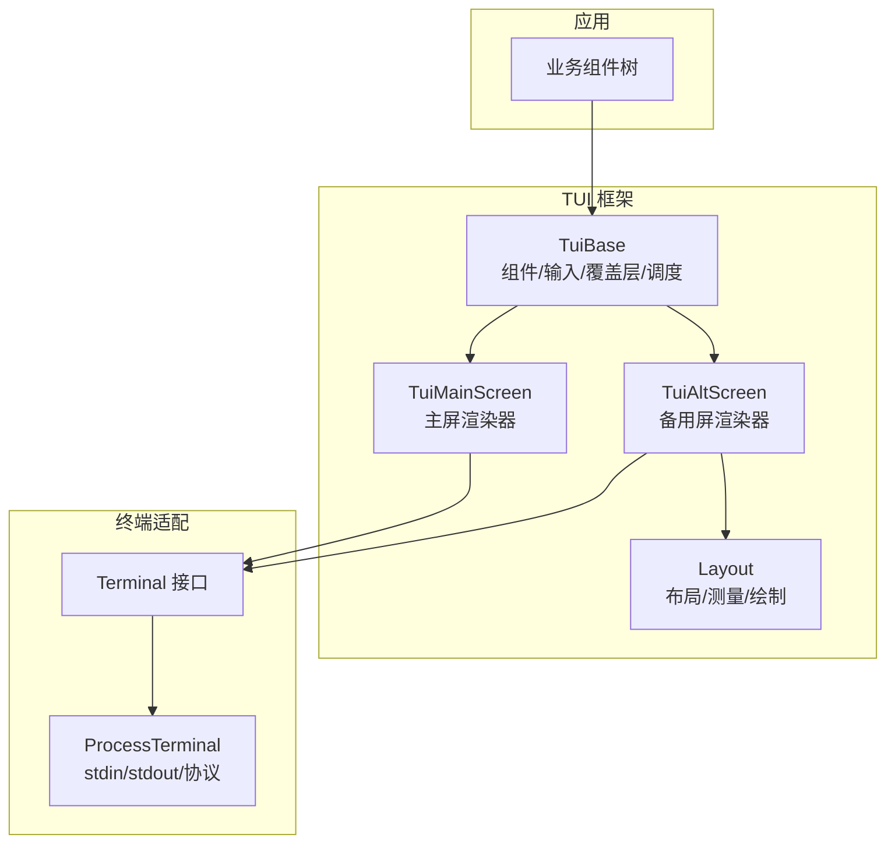
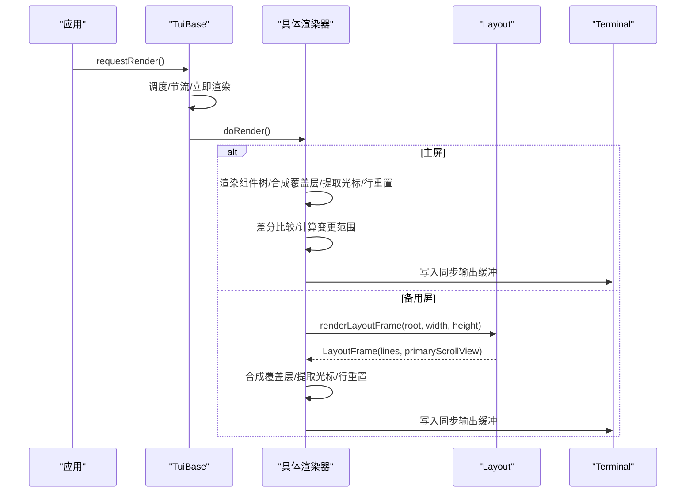
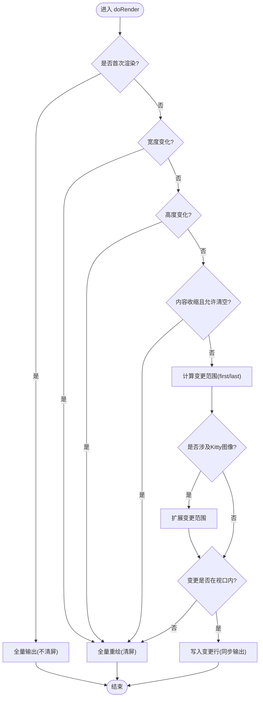
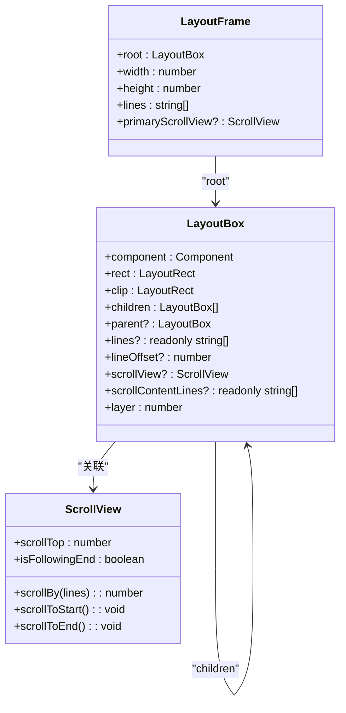
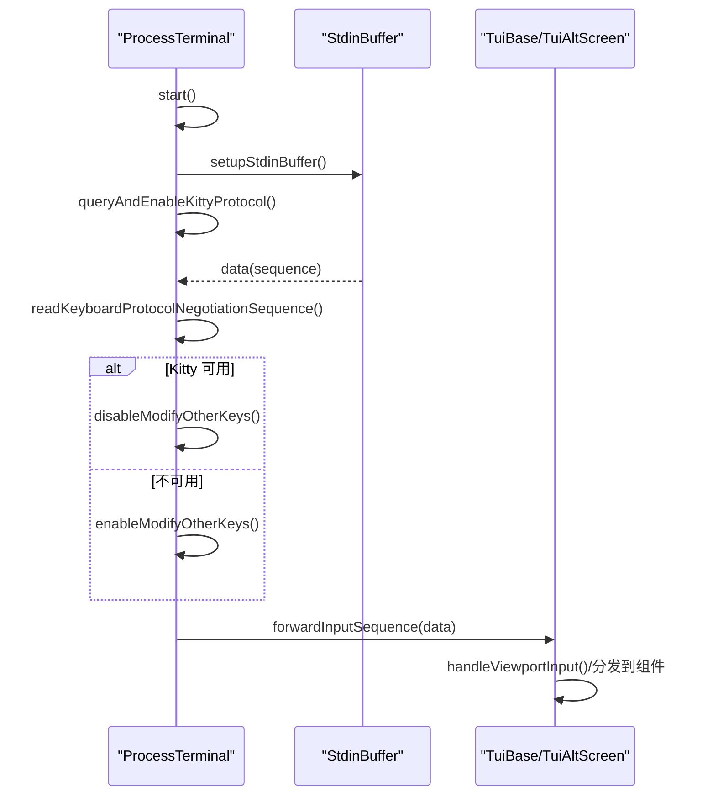
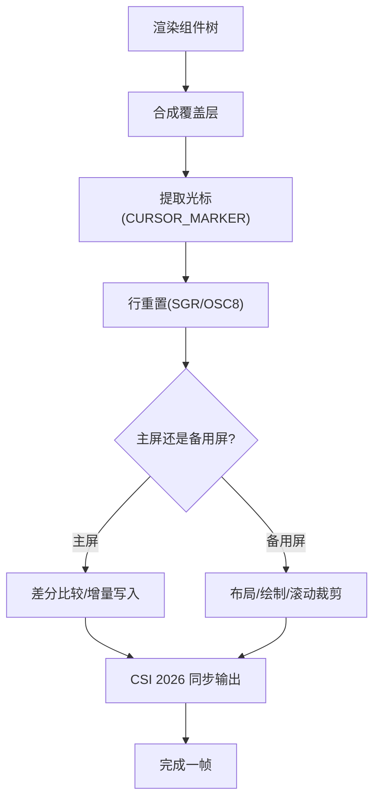
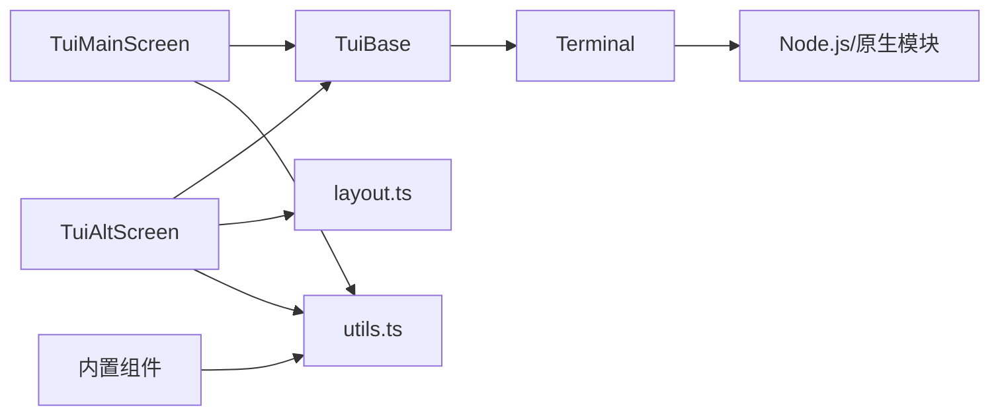

# 渲染引擎

<cite>
**本文引用的文件**
- [tui.ts](file://packages/tui/src/tui.ts)
- [tui-alt-screen.ts](file://packages/tui/src/tui-alt-screen.ts)
- [tui-main-screen.ts](file://packages/tui/src/tui-main-screen.ts)
- [terminal.ts](file://packages/tui/src/terminal.ts)
- [layout.ts](file://packages/tui/src/layout.ts)
- [README.md](file://packages/tui/README.md)
- [tui-plan.md](file://tui-plan.md)
</cite>

## 目录
1. [简介](#简介)
2. [项目结构](#项目结构)
3. [核心组件](#核心组件)
4. [架构总览](#架构总览)
5. [详细组件分析](#详细组件分析)
6. [依赖关系分析](#依赖关系分析)
7. [性能考量](#性能考量)
8. [故障排查指南](#故障排查指南)
9. [结论](#结论)
10. [附录](#附录)

## 简介
本文件面向 TUI 渲染引擎，系统性说明差分渲染算法、终端适配层、渲染管道（从组件树到终端输出）、缓冲区与内存优化、异步渲染与批处理机制、性能监控与调试工具，以及常见渲染问题的定位与修复策略。内容基于仓库中 @earendil-works/pi-tui 的实现与计划文档进行提炼与组织，确保读者既能理解整体架构，也能深入关键实现细节。

## 项目结构
TUI 包采用“抽象基类 + 多渲染器”的分层设计：
- 抽象基类 TuiBase 提供组件管理、输入事件、覆盖层、渲染调度等通用能力
- 两种具体渲染器：
  - TuiMainScreen：主屏模式，保留终端滚动历史，适合日志/文档流式输出
  - TuiAltScreen：备用屏模式，固定视口与应用内滚动，适合交互式界面
- 布局系统 layout.ts 负责在备用屏模式下构建布局树、计算可见区域、绘制屏幕行
- 终端适配层 terminal.ts 封装进程 stdin/stdout、键盘协议协商、鼠标/滚轮事件、光标控制等

图表来源
- [tui.ts:291-329](file://packages/tui/src/tui.ts#L291-L329)
- [tui-alt-screen.ts:128-183](file://packages/tui/src/tui-alt-screen.ts#L128-L183)
- [tui-main-screen.ts:56-99](file://packages/tui/src/tui-main-screen.ts#L56-L99)
- [layout.ts:353-382](file://packages/tui/src/layout.ts#L353-L382)
- [terminal.ts:57-102](file://packages/tui/src/terminal.ts#L57-L102)

章节来源
- [tui.ts:291-329](file://packages/tui/src/tui.ts#L291-L329)
- [tui-alt-screen.ts:128-183](file://packages/tui/src/tui-alt-screen.ts#L128-L183)
- [tui-main-screen.ts:56-99](file://packages/tui/src/tui-main-screen.ts#L56-L99)
- [layout.ts:353-382](file://packages/tui/src/layout.ts#L353-L382)
- [terminal.ts:57-102](file://packages/tui/src/terminal.ts#L57-L102)

## 核心组件
- 组件与容器
  - Component 接口定义 render(width)、handleInput、invalidate
  - Container 聚合子组件并级联 invalidate/render
- 渲染器
  - TuiBase：统一生命周期、输入监听、覆盖层、渲染调度（节流/立即渲染）
  - TuiMainScreen：主屏差分渲染，支持首屏全量、宽度变化全量、高度变化全量、增量更新
  - TuiAltScreen：备用屏视口渲染，支持布局根、滚动视图、鼠标/滚轮/选择/链接点击
- 布局系统
  - LayoutFrame/LayoutBox：每帧的布局快照，包含矩形、裁剪、子节点、滚动信息
  - renderLayoutFrame：构建布局树、缓存组件渲染结果、绘制到屏幕行数组
- 终端适配
  - Terminal 接口抽象终端操作
  - ProcessTerminal：raw 模式、Kitty 键盘协议协商、粘贴括号、窗口大小变更、光标/清屏/标题/进度条

章节来源
- [tui.ts:23-47](file://packages/tui/src/tui.ts#L23-L47)
- [tui.ts:211-245](file://packages/tui/src/tui.ts#L211-L245)
- [tui.ts:331-370](file://packages/tui/src/tui.ts#L331-L370)
- [tui-main-screen.ts:56-99](file://packages/tui/src/tui-main-screen.ts#L56-L99)
- [tui-alt-screen.ts:128-183](file://packages/tui/src/tui-alt-screen.ts#L128-L183)
- [layout.ts:10-36](file://packages/tui/src/layout.ts#L10-L36)
- [layout.ts:353-382](file://packages/tui/src/layout.ts#L353-L382)
- [terminal.ts:57-102](file://packages/tui/src/terminal.ts#L57-L102)

## 架构总览
渲染管线从组件树到终端输出的关键步骤：
- 组件树渲染：每个组件按当前宽度返回若干行字符串（可能含 ANSI、OSC 8 超链接、Kitty 图像元数据）
- 覆盖层合成：将弹窗/菜单等覆盖层合成到对应列区间，避免样式泄漏
- 光标提取：扫描 CURSOR_MARKER 以定位硬件光标位置（IME 候选窗定位）
- 行重置：为每行追加 SGR/OSC 8 重置，防止跨行样式污染
- 差分比较：对比上一帧，确定变更范围；必要时触发全量重绘
- 同步输出：使用 CSI 2026 包裹批量写入，避免闪烁
- 终端写入：通过 Terminal.write 一次性输出缓冲

图表来源
- [tui.ts:757-800](file://packages/tui/src/tui.ts#L757-L800)
- [tui-main-screen.ts:180-251](file://packages/tui/src/tui-main-screen.ts#L180-L251)
- [tui-alt-screen.ts:212-263](file://packages/tui/src/tui-alt-screen.ts#L212-L263)
- [layout.ts:353-382](file://packages/tui/src/layout.ts#L353-L382)
- [terminal.ts:463-472](file://packages/tui/src/terminal.ts#L463-L472)

章节来源
- [tui.ts:757-800](file://packages/tui/src/tui.ts#L757-L800)
- [tui-main-screen.ts:180-251](file://packages/tui/src/tui-main-screen.ts#L180-L251)
- [tui-alt-screen.ts:212-263](file://packages/tui/src/tui-alt-screen.ts#L212-L263)
- [layout.ts:353-382](file://packages/tui/src/layout.ts#L353-L382)
- [terminal.ts:463-472](file://packages/tui/src/terminal.ts#L463-L472)

## 详细组件分析

### 差分渲染算法（主屏）
- 首次渲染：直接输出所有行，不清屏
- 宽度变化：必须全量重绘（换行规则改变）
- 高度变化：在非 Termux 环境下全量重绘以保持可视区对齐
- 内容收缩：可选清空多余行（setClearOnShrink），避免残留空白
- 增量更新：
  - 计算 firstChanged/lastChanged，扩展 Kitty 图像占用的行范围
  - 若变更发生在视口上方则回退到全量重绘
  - 移动光标至首变更行，逐行写入变更内容，减少闪烁
  - 处理图片预留行、删除旧图 ID、清理多余行
- 同步输出：用 CSI 2026 包裹整段缓冲，原子更新

图表来源
- [tui-main-screen.ts:180-251](file://packages/tui/src/tui-main-screen.ts#L180-L251)
- [tui-main-screen.ts:253-292](file://packages/tui/src/tui-main-screen.ts#L253-L292)
- [tui-main-screen.ts:294-378](file://packages/tui/src/tui-main-screen.ts#L294-L378)
- [tui-main-screen.ts:380-447](file://packages/tui/src/tui-main-screen.ts#L380-L447)
- [tui-main-screen.ts:478-547](file://packages/tui/src/tui-main-screen.ts#L478-L547)

章节来源
- [tui-main-screen.ts:180-251](file://packages/tui/src/tui-main-screen.ts#L180-L251)
- [tui-main-screen.ts:253-292](file://packages/tui/src/tui-main-screen.ts#L253-L292)
- [tui-main-screen.ts:294-378](file://packages/tui/src/tui-main-screen.ts#L294-L378)
- [tui-main-screen.ts:380-447](file://packages/tui/src/tui-main-screen.ts#L380-L447)
- [tui-main-screen.ts:478-547](file://packages/tui/src/tui-main-screen.ts#L478-L547)

### 差分渲染算法（备用屏）
- 每帧重建布局树：layoutComponent 遍历组件，分配尺寸、计算 clip、记录 ScrollView
- 渲染缓存：renderCached 对每个组件按宽度缓存行数组，避免重复解析/高亮
- 绘制：paintBox 仅绘制与 clip 相交的行，支持横向拼接、纵向堆叠、滚动偏移、Kitty 图像裁剪
- 差异写入：previousScreen 保存上一帧屏幕行，writeScreenDiff 只写变更行（由 TuiAltScreen 内部逻辑驱动）
- 覆盖层：在基础布局之上叠加覆盖层，再提取光标并应用选择高亮

图表来源
- [layout.ts:10-36](file://packages/tui/src/layout.ts#L10-L36)
- [layout.ts:100-241](file://packages/tui/src/layout.ts#L100-L241)
- [layout.ts:304-351](file://packages/tui/src/layout.ts#L304-L351)
- [layout.ts:353-382](file://packages/tui/src/layout.ts#L353-L382)

章节来源
- [layout.ts:100-241](file://packages/tui/src/layout.ts#L100-L241)
- [layout.ts:304-351](file://packages/tui/src/layout.ts#L304-L351)
- [layout.ts:353-382](file://packages/tui/src/layout.ts#L353-L382)

### 终端适配层
- 键盘协议协商：启动时探测 Kitty 键盘协议，失败回退到 modifyOtherKeys；正确处理拆分响应与超时
- 输入分片：StdinBuffer 将粘包/粘贴内容拆分为独立序列，保证 matchesKey/isKeyRelease 正确工作
- 平台兼容：Windows 启用虚拟终端输入以保留修饰键；Apple 终端特殊处理 Shift+Enter
- 鼠标/滚轮：备用屏下解析 SGR 鼠标事件与滚轮事件，路由到命中测试的 ScrollView
- 光标/清屏/标题/进度：统一通过 Terminal 接口写入，避免直接操作 stdout

图表来源
- [terminal.ts:142-175](file://packages/tui/src/terminal.ts#L142-L175)
- [terminal.ts:185-213](file://packages/tui/src/terminal.ts#L185-L213)
- [terminal.ts:228-258](file://packages/tui/src/terminal.ts#L228-L258)
- [terminal.ts:317-327](file://packages/tui/src/terminal.ts#L317-L327)
- [tui-alt-screen.ts:385-460](file://packages/tui/src/tui-alt-screen.ts#L385-L460)

章节来源
- [terminal.ts:142-175](file://packages/tui/src/terminal.ts#L142-L175)
- [terminal.ts:185-213](file://packages/tui/src/terminal.ts#L185-L213)
- [terminal.ts:228-258](file://packages/tui/src/terminal.ts#L228-L258)
- [terminal.ts:317-327](file://packages/tui/src/terminal.ts#L317-L327)
- [tui-alt-screen.ts:385-460](file://packages/tui/src/tui-alt-screen.ts#L385-L460)

### 渲染管道（组件树到终端输出）
- 组件树渲染：Container 递归调用子组件 render(width)，得到行数组
- 覆盖层合成：compositeTuiLine 将覆盖层文本插入到底层行的指定列区间，保持 ANSI 安全
- 光标提取：扫描 CURSOR_MARKER，定位硬件光标用于 IME
- 行重置：每行末尾追加 SGR/OSC 8 重置，避免样式泄漏
- 主屏差分：比较 previousLines/newLines，计算变更范围，写入最小必要缓冲
- 备用屏布局：renderLayoutFrame 构建 LayoutFrame，paintBox 绘制可见区域，支持滚动与裁剪
- 同步输出：CSI 2026 包裹写入，避免闪烁

图表来源
- [tui.ts:252-282](file://packages/tui/src/tui.ts#L252-L282)
- [tui-main-screen.ts:196-251](file://packages/tui/src/tui-main-screen.ts#L196-L251)
- [tui-main-screen.ts:294-447](file://packages/tui/src/tui-main-screen.ts#L294-L447)
- [layout.ts:304-351](file://packages/tui/src/layout.ts#L304-L351)
- [layout.ts:353-382](file://packages/tui/src/layout.ts#L353-L382)

章节来源
- [tui.ts:252-282](file://packages/tui/src/tui.ts#L252-L282)
- [tui-main-screen.ts:196-251](file://packages/tui/src/tui-main-screen.ts#L196-L251)
- [tui-main-screen.ts:294-447](file://packages/tui/src/tui-main-screen.ts#L294-L447)
- [layout.ts:304-351](file://packages/tui/src/layout.ts#L304-L351)
- [layout.ts:353-382](file://packages/tui/src/layout.ts#L353-L382)

### 缓冲区管理与内存优化
- 组件级缓存：Markdown/Text/Image/Box 等已按内容与宽度缓存渲染结果；布局层 renderCached 进一步按组件实例+宽度缓存
- 备用屏离屏图像缓存：uploadedKittyImages 缓存离屏 Kitty 图像传输字节与解码估计大小，超过阈值时驱逐
- 行重置与样式隔离：每行末尾重置样式，避免跨行污染；横向拼接时使用 compositeTuiLine 重置边界
- 增量写入：主屏/备用屏均尽量只写变更行，减少 I/O 与转义序列数量
- 视口裁剪：备用屏 paintBox 仅绘制与 clip 相交的行，避免无用计算

章节来源
- [tui-plan.md:347-388](file://tui-plan.md#L347-L388)
- [tui-alt-screen.ts:294-342](file://packages/tui/src/tui-alt-screen.ts#L294-L342)
- [layout.ts:62-83](file://packages/tui/src/layout.ts#L62-L83)
- [layout.ts:304-351](file://packages/tui/src/layout.ts#L304-L351)

### 异步渲染与批处理机制
- 渲染调度：requestRender 使用 process.nextTick 合并多次请求；renderNow 可强制立即渲染
- 节流：MIN_RENDER_INTERVAL_MS 限制最小渲染间隔，避免高频刷新
- 同步输出：CSI 2026 将多行写入打包为一次原子更新，避免闪烁
- 输入批处理：StdinBuffer 将粘包/粘贴内容拆分为独立序列，保证按键识别准确

章节来源
- [tui.ts:331-370](file://packages/tui/src/tui.ts#L331-L370)
- [tui.ts:757-800](file://packages/tui/src/tui.ts#L757-L800)
- [tui-alt-screen.ts:44-55](file://packages/tui/src/tui-alt-screen.ts#L44-L55)
- [terminal.ts:185-213](file://packages/tui/src/terminal.ts#L185-L213)

### 性能监控与调试工具
- 全量重绘计数：fullRedraws 暴露完整重绘次数，便于评估差分效果
- 调试开关：
  - PI_DEBUG_REDRAW=1：记录全量重绘原因与上下文
  - PI_TUI_DEBUG=1：输出每帧渲染详情（变更范围、视口、光标、缓冲等）
  - PI_TUI_WRITE_LOG：将终端输出写入文件，便于离线分析
- 崩溃日志：当组件输出行宽超过终端宽度时，生成 pi-crash.log 并抛出错误，附带所有行与宽度信息

章节来源
- [tui.ts:291-318](file://packages/tui/src/tui.ts#L291-L318)
- [tui-main-screen.ts:253-260](file://packages/tui/src/tui-main-screen.ts#L253-L260)
- [tui-main-screen.ts:499-526](file://packages/tui/src/tui-main-screen.ts#L499-L526)
- [tui-main-screen.ts:447-474](file://packages/tui/src/tui-main-screen.ts#L447-L474)
- [terminal.ts:119-132](file://packages/tui/src/terminal.ts#L119-L132)

### 常见问题与解决方案
- 行宽超限导致崩溃
  - 现象：某行 visibleWidth 超过终端宽度，抛出错误并生成崩溃日志
  - 解决：使用 visibleWidth/truncateToWidth 截断或换行；检查自定义组件输出
- 备用屏图像残留
  - 现象：iTerm2 不支持删除/裁剪放置，滚动后出现旧图
  - 解决：备用屏 iTerm2 下回退为文本占位；Kitty 协议下缓存并裁剪
- 滚动与选择异常
  - 现象：滚轮未命中预期 ScrollView；选择复制文本不正确
  - 解决：确认命中测试路径 getScrollViewsAt；使用 stripTerminalSequences 获取纯文本
- 键盘协议不稳定
  - 现象：Shift+Tab 无法区分；Kitty 响应拆分导致误判
  - 解决：依赖 StdinBuffer 与协议协商缓冲；必要时回退到 modifyOtherKeys

章节来源
- [tui-main-screen.ts:447-474](file://packages/tui/src/tui-main-screen.ts#L447-L474)
- [tui-alt-screen.ts:212-263](file://packages/tui/src/tui-alt-screen.ts#L212-L263)
- [tui-alt-screen.ts:462-501](file://packages/tui/src/tui-alt-screen.ts#L462-L501)
- [terminal.ts:228-258](file://packages/tui/src/terminal.ts#L228-L258)

## 依赖关系分析
- TuiBase 依赖 Terminal 接口，屏蔽底层差异
- TuiMainScreen/TuiAltScreen 继承 TuiBase，分别实现 doRender
- TuiAltScreen 依赖 layout.ts 的布局与绘制能力
- 组件（如 Markdown/Text/Image/Editor）依赖 utils 进行 ANSI/图形单元处理
- 终端适配层依赖操作系统 API（Node.js）与原生模块（Windows VT 输入）

图表来源
- [tui.ts:331-370](file://packages/tui/src/tui.ts#L331-L370)
- [tui-main-screen.ts:1-5](file://packages/tui/src/tui-main-screen.ts#L1-L5)
- [tui-alt-screen.ts:1-43](file://packages/tui/src/tui-alt-screen.ts#L1-L43)
- [layout.ts:1-6](file://packages/tui/src/layout.ts#L1-L6)
- [terminal.ts:1-8](file://packages/tui/src/terminal.ts#L1-L8)

章节来源
- [tui.ts:331-370](file://packages/tui/src/tui.ts#L331-L370)
- [tui-main-screen.ts:1-5](file://packages/tui/src/tui-main-screen.ts#L1-L5)
- [tui-alt-screen.ts:1-43](file://packages/tui/src/tui-alt-screen.ts#L1-L43)
- [layout.ts:1-6](file://packages/tui/src/layout.ts#L1-L6)
- [terminal.ts:1-8](file://packages/tui/src/terminal.ts#L1-L8)

## 性能考量
- 优先复用组件级缓存：避免重复解析 Markdown/高亮/图片
- 仅在必要时重建布局：无 requestRender 不触发布局
- 最小化写入：差分比较精确到变更行；Kitty 图像块整体处理
- 视口裁剪：备用屏仅绘制可见区域，减少字符串拼接与 ANSI 处理
- 同步输出：CSI 2026 降低闪烁与中间态显示
- 离屏图像缓存与驱逐：控制内存与传输字节上限，避免 OOM

[本节为通用性能建议，无需特定文件引用]

## 故障排查指南
- 启用调试日志
  - 设置 PI_DEBUG_REDRAW=1 查看全量重绘原因
  - 设置 PI_TUI_DEBUG=1 查看每帧渲染详情
  - 设置 PI_TUI_WRITE_LOG 导出终端输出
- 检查组件输出宽度
  - 若发生行宽超限错误，查看 pi-crash.log 中的行与宽度信息
- 验证滚动与选择
  - 确认 ScrollView 的 primary/follow/overscroll 配置
  - 使用 stripTerminalSequences 获取纯文本进行比对
- 键盘协议问题
  - 观察 Kitty 协议协商过程；必要时禁用协议回退
  - 检查 Windows 虚拟终端输入是否成功加载

章节来源
- [tui-main-screen.ts:253-260](file://packages/tui/src/tui-main-screen.ts#L253-L260)
- [tui-main-screen.ts:499-526](file://packages/tui/src/tui-main-screen.ts#L499-L526)
- [tui-main-screen.ts:447-474](file://packages/tui/src/tui-main-screen.ts#L447-L474)
- [tui-alt-screen.ts:462-501](file://packages/tui/src/tui-alt-screen.ts#L462-L501)
- [terminal.ts:228-258](file://packages/tui/src/terminal.ts#L228-L258)

## 结论
该 TUI 渲染引擎通过清晰的层次划分（TuiBase/渲染器/布局/终端适配）实现了高效、稳定的终端 UI 渲染。主屏模式侧重长文档流式输出与最小化增量更新；备用屏模式提供应用内视口、滚动与交互能力。差分渲染、组件级缓存、视口裁剪与同步输出共同保障了低延迟与低闪烁体验。配合完善的调试工具与环境变量，开发者可以快速定位与优化渲染瓶颈。

[本节为总结性内容，无需特定文件引用]

## 附录
- 快速开始与 API 参考见 README
- 备用屏布局系统设计详见 tui-plan

章节来源
- [README.md:1-17](file://packages/tui/README.md#L1-L17)
- [tui-plan.md:1-25](file://tui-plan.md#L1-L25)