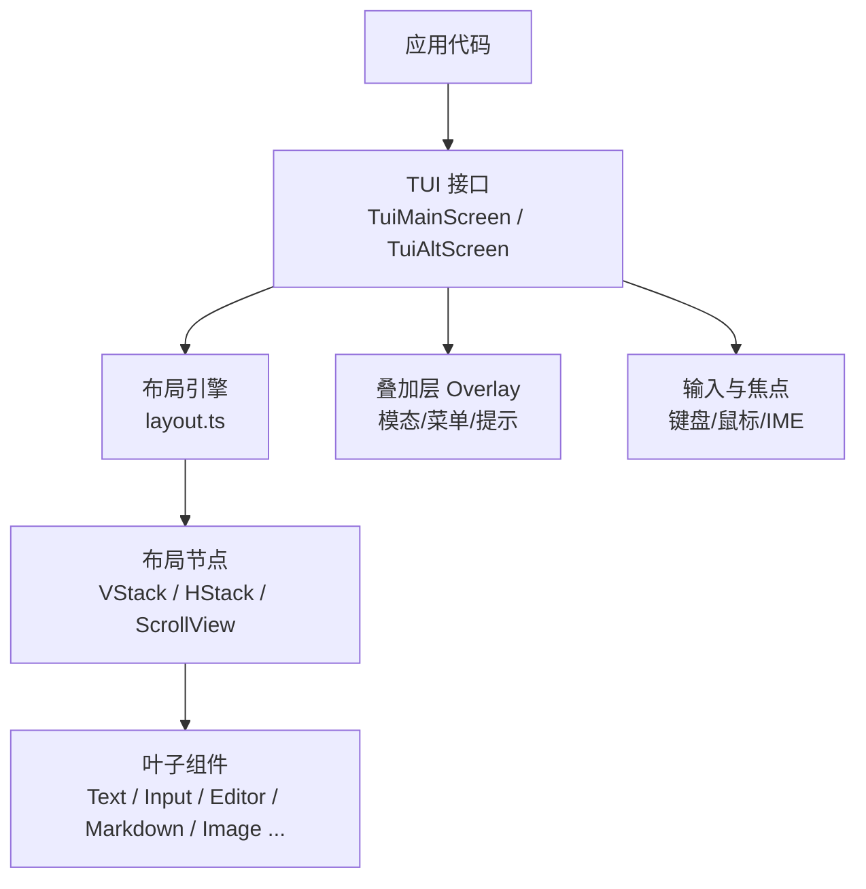
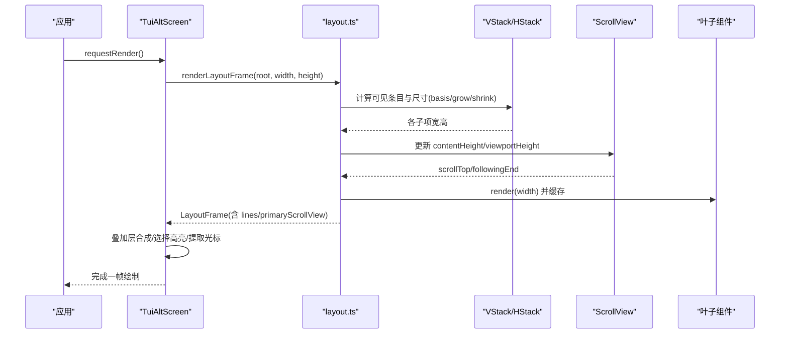
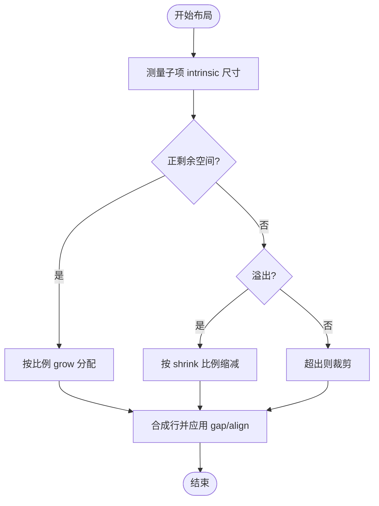
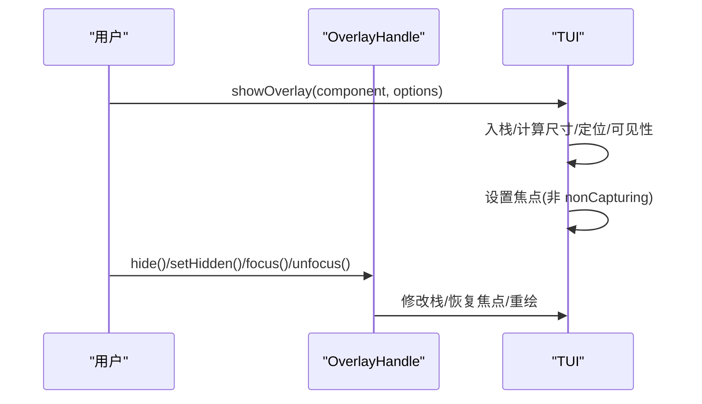
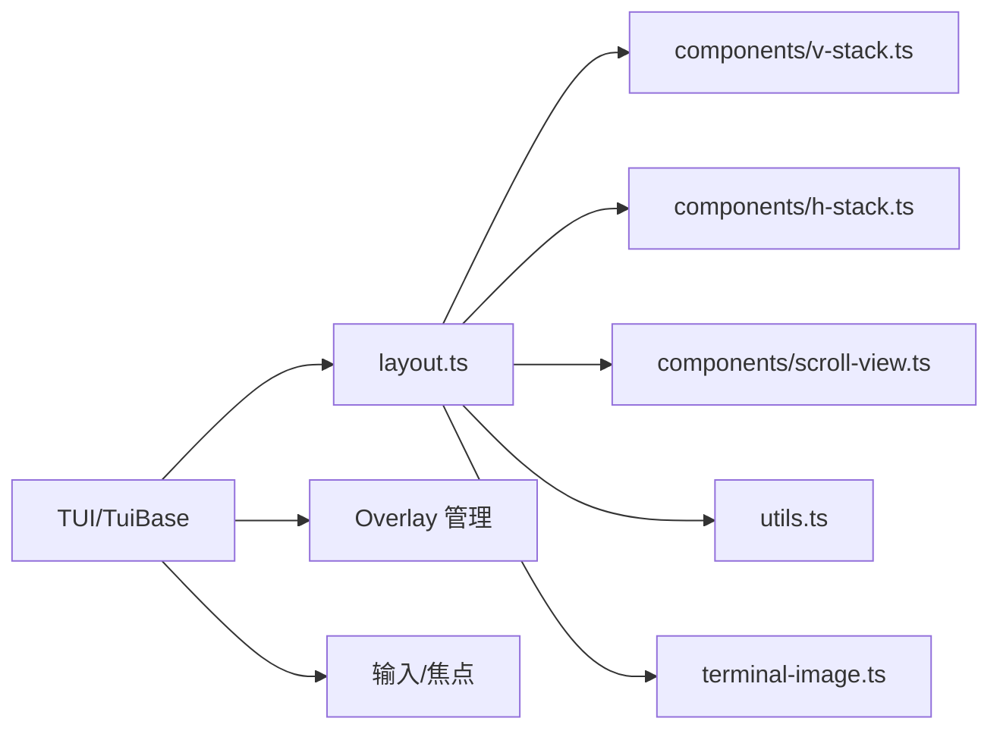

# 组件系统

<cite>
**本文引用的文件**
- [README.md](file://packages/tui/README.md)
- [index.ts](file://packages/tui/src/index.ts)
- [tui.ts](file://packages/tui/src/tui.ts)
- [layout.ts](file://packages/tui/src/layout.ts)
- [v-stack.ts](file://packages/tui/src/components/v-stack.ts)
- [h-stack.ts](file://packages/tui/src/components/h-stack.ts)
- [scroll-view.ts](file://packages/tui/src/components/scroll-view.ts)
- [tui-plan.md](file://tui-plan.md)
</cite>

## 目录
1. [简介](#简介)
2. [项目结构](#项目结构)
3. [核心组件](#核心组件)
4. [架构总览](#架构总览)
5. [详细组件分析](#详细组件分析)
6. [依赖关系分析](#依赖关系分析)
7. [性能考量](#性能考量)
8. [故障排查指南](#故障排查指南)
9. [结论](#结论)
10. [附录](#附录)

## 简介
本文件系统化梳理 TUI 组件系统的架构与实现，覆盖组件生命周期、状态管理、事件处理机制，以及基础组件、布局组件、交互组件的使用方法与最佳实践。同时提供可复用自定义组件的开发指南、测试策略与调试技巧，帮助读者在终端环境中构建高性能、可维护的交互式界面。

## 项目结构
TUI 包采用“接口抽象 + 具体实现”的分层组织：
- 顶层导出统一入口 index.ts，集中暴露组件、工具、渲染器与类型。
- 核心运行时 tui.ts 定义 Component、Container、Overlay、TUI 等基础能力。
- 布局引擎 layout.ts 负责受限视口下的测量、布局、裁剪与绘制。
- 组件目录 components/ 包含基础与布局组件（文本、输入、编辑器、滚动视图、堆栈容器等）。
- README.md 提供快速上手、内置组件 API 与使用示例。
- tui-plan.md 记录受限布局系统的规划与设计决策。

图表来源
- [index.ts:1-143](file://packages/tui/src/index.ts#L1-L143)
- [tui.ts:291-329](file://packages/tui/src/tui.ts#L291-L329)
- [layout.ts:353-382](file://packages/tui/src/layout.ts#L353-L382)

章节来源
- [index.ts:1-143](file://packages/tui/src/index.ts#L1-L143)
- [README.md:1-127](file://packages/tui/README.md#L1-L127)

## 核心组件
- 组件契约
  - Component：render(width) 返回行数组；可选 handleInput(data)、invalidate()。
  - Focusable：支持 IME 光标定位，通过 CURSOR_MARKER 标记光标位置。
  - Container：聚合子组件，转发 invalidate，顺序拼接输出。
- 渲染器
  - TuiMainScreen：主缓冲区渲染，保留终端历史滚动。
  - TuiAltScreen：交替缓冲区固定高度视口，应用自管滚动；退出时打印完整最终文档。
- 叠加层 Overlay
  - 支持多种尺寸与定位策略（锚点、百分比、绝对坐标、边距），可见性回调 per-frame。
  - 聚焦恢复策略：隐藏/显示时自动恢复或转移焦点。
- 视口能力
  - ViewportTUI：isViewportTUI(tui) 判断是否支持 setLayoutRoot 受限布局。

章节来源
- [tui.ts:23-47](file://packages/tui/src/tui.ts#L23-L47)
- [tui.ts:63-79](file://packages/tui/src/tui.ts#L63-L79)
- [tui.ts:211-245](file://packages/tui/src/tui.ts#L211-L245)
- [tui.ts:291-329](file://packages/tui/src/tui.ts#L291-L329)
- [tui.ts:549-642](file://packages/tui/src/tui.ts#L549-L642)
- [tui.ts:644-689](file://packages/tui/src/tui.ts#L644-L689)
- [README.md:128-196](file://packages/tui/README.md#L128-L196)

## 架构总览
受限布局系统为 TuiAltScreen 的核心增强：每帧重建布局树，复用叶子组件渲染缓存，按约束分配空间，裁剪不可见区域，最后合成屏幕并差分写入。

图表来源
- [layout.ts:353-382](file://packages/tui/src/layout.ts#L353-L382)
- [scroll-view.ts:163-172](file://packages/tui/src/components/scroll-view.ts#L163-L172)
- [v-stack.ts:10-30](file://packages/tui/src/components/v-stack.ts#L10-L30)
- [h-stack.ts:12-43](file://packages/tui/src/components/h-stack.ts#L12-L43)

章节来源
- [tui-plan.md:347-389](file://tui-plan.md#L347-L389)
- [layout.ts:100-241](file://packages/tui/src/layout.ts#L100-L241)

## 详细组件分析

### 基础组件（文本、按钮、输入框等）
- Text / TruncatedText：多行/单行文本，支持 ANSI 安全截断与宽度检测。
- Input：单行输入，水平滚动，常用快捷键（行首/行尾、删除词、整行删除等）。
- Editor：多行编辑器，支持自动补全、粘贴分块、垂直滚动、提交/变更回调。
- Markdown：语法高亮与主题化，支持代码块、列表、链接等。
- Loader / CancellableLoader：加载指示器，支持取消信号。
- Image：Kitty/iTerm2 内联图像，不支持时回退文本占位。

使用要点
- 所有组件必须保证每行不超过传入 width。
- 需要 IME 的组件实现 Focusable 并在光标处输出 CURSOR_MARKER。
- 通过 Container 组合多个基础组件形成复杂 UI。

章节来源
- [README.md:278-598](file://packages/tui/README.md#L278-L598)
- [tui.ts:23-47](file://packages/tui/src/tui.ts#L23-L47)
- [tui.ts:63-79](file://packages/tui/src/tui.ts#L63-L79)

### 布局组件（容器、网格、弹性布局等）
- VStack：纵向堆叠，支持 gap、align、basis/grow/shrink/minSize/maxSize、visible 响应式。
- HStack：横向堆叠，先测 intrinsic 宽度再分配，支持 align 居中/末端对齐。
- ScrollView：垂直滚动，follow/end 跟随模式，overscroll 链式传递，可选滚动条样式与延迟隐藏。
- 布局引擎：每帧根据约束重新计算布局，保留叶子渲染缓存，裁剪不可见区域，处理图片行裁剪与光标标记。

图表来源
- [v-stack.ts:10-30](file://packages/tui/src/components/v-stack.ts#L10-L30)
- [h-stack.ts:12-43](file://packages/tui/src/components/h-stack.ts#L12-L43)
- [layout.ts:164-241](file://packages/tui/src/layout.ts#L164-L241)

章节来源
- [tui-plan.md:114-221](file://tui-plan.md#L114-L221)
- [layout.ts:164-241](file://packages/tui/src/layout.ts#L164-L241)

### 交互组件（模态框、下拉菜单、标签页等）
- 模态框/对话框：通过 showOverlay 展示，支持尺寸、定位、边距、可见性回调与焦点恢复。
- 下拉菜单/选择器：SelectList/SettingsList 提供键盘导航、过滤、值切换与子菜单。
- 标签页：可通过 VStack/HStack + ScrollView 组合实现，结合 overlay 切换内容区。

图表来源
- [tui.ts:549-642](file://packages/tui/src/tui.ts#L549-L642)
- [tui.ts:644-689](file://packages/tui/src/tui.ts#L644-L689)
- [README.md:128-196](file://packages/tui/README.md#L128-L196)

章节来源
- [tui.ts:549-642](file://packages/tui/src/tui.ts#L549-L642)
- [README.md:128-196](file://packages/tui/README.md#L128-L196)

### 组件组合模式与最佳实践
- 将稳定分组容器（如文档区、页脚区）一次性构建，避免频繁增删根节点。
- 在受限视口中，优先使用 VStack/HStack/ScrollView 表达布局意图，而非手动计算行列。
- 对长列表/大文档使用 ScrollView 包裹，必要时启用 follow:"end" 保持底部跟随。
- 使用 visible 回调实现响应式显示，避免在小终端上渲染多余内容。
- 通过 Container 组合基础组件，保持单一职责与可测试性。

章节来源
- [tui-plan.md:689-798](file://tui-plan.md#L689-L798)
- [README.md:81-127](file://packages/tui/README.md#L81-L127)

### 组件开发指南（创建可复用自定义组件）
- 实现 Component.render(width)，确保每行不超宽；必要时使用 truncateToWidth/visibleWidth。
- 如需接收键盘输入，实现 handleInput(data)，并使用 matchesKey/Key 进行键匹配。
- 若需 IME 光标定位，实现 Focusable 并在光标前输出 CURSOR_MARKER。
- 对昂贵渲染结果做缓存，仅在数据变化或主题变化时调用 invalidate。
- 通过 Container 组合子组件，必要时转发 focused 以支持嵌套输入。

章节来源
- [README.md:707-800](file://packages/tui/README.md#L707-L800)
- [tui.ts:23-47](file://packages/tui/src/tui.ts#L23-L47)
- [tui.ts:63-79](file://packages/tui/src/tui.ts#L63-L79)

### 组件测试策略与调试技巧
- 使用 VirtualTerminal 在无头环境下运行 TUI，验证渲染输出与交互行为。
- 针对布局组件编写边界用例：极小终端、超大内容、负向滚动、跟随模式切换。
- 利用 fullRedraws 统计与 requestRender/renderNow 控制重绘频率，定位性能瓶颈。
- 通过 onDebug 钩子与日志目录辅助问题定位。
- 对叠加层测试焦点恢复、临时隐藏/显示、可见性回调在不同终端尺寸下的表现。

章节来源
- [tui.ts:331-370](file://packages/tui/src/tui.ts#L331-L370)
- [tui.ts:757-800](file://packages/tui/src/tui.ts#L757-L800)
- [README.md:664-687](file://packages/tui/README.md#L664-L687)

## 依赖关系分析
- 组件与布局
  - VStack/HStack 依赖 stack 分配算法与可见性过滤。
  - ScrollView 依赖布局引擎提供的 contentHeight/viewportHeight 更新与滚动条几何计算。
- 渲染管线
  - layout.ts 统一调度测量、布局、绘制与滚动条绘制，依赖 utils 的 ANSI/列切片工具与 terminal-image 的图片元数据处理。
- 运行时
  - TuiBase 管理焦点、叠加层、输入监听、颜色方案通知与渲染节流。

图表来源
- [layout.ts:353-382](file://packages/tui/src/layout.ts#L353-L382)
- [v-stack.ts:1-34](file://packages/tui/src/components/v-stack.ts#L1-L34)
- [h-stack.ts:1-45](file://packages/tui/src/components/h-stack.ts#L1-L45)
- [scroll-view.ts:1-196](file://packages/tui/src/components/scroll-view.ts#L1-L196)
- [tui.ts:331-370](file://packages/tui/src/tui.ts#L331-L370)

章节来源
- [index.ts:1-143](file://packages/tui/src/index.ts#L1-L143)
- [tui.ts:331-370](file://packages/tui/src/tui.ts#L331-L370)

## 性能考量
- 每帧重建布局树，但复用叶子组件渲染缓存，避免重复解析/高亮。
- 仅绘制可视区域，结合 clip 与行范围裁剪减少 ANSI 合成开销。
- ScrollView 在 follow:"end" 下智能维持底部跟随，减少不必要滚动。
- 使用 visible 回调按需隐藏子项，降低测量与绘制成本。
- 合理设置 basis/grow/shrink/minSize/maxSize，避免过度重排。
- 对大图/大量文本使用合适的组件与缓存策略，必要时拆分容器粒度。

章节来源
- [tui-plan.md:347-389](file://tui-plan.md#L347-L389)
- [layout.ts:62-83](file://packages/tui/src/layout.ts#L62-L83)
- [layout.ts:304-351](file://packages/tui/src/layout.ts#L304-L351)

## 故障排查指南
- 行宽越界：确保 render(width) 每行不超过 width，使用 truncateToWidth/visibleWidth。
- 光标错位：实现 Focusable 并正确放置 CURSOR_MARKER；检查叠加层与布局偏移。
- 滚动异常：确认 ScrollView 的 contentHeight/viewportHeight 已更新；检查 follow 与 overscroll 配置。
- 叠加层焦点丢失：关注 nonCapturing 与 unfocus(target) 的行为；验证可见性回调。
- 性能抖动：观察 fullRedraws；减少不必要的 requestRender；合并多次状态变更。

章节来源
- [tui.ts:23-47](file://packages/tui/src/tui.ts#L23-L47)
- [tui.ts:63-79](file://packages/tui/src/tui.ts#L63-L79)
- [scroll-view.ts:163-172](file://packages/tui/src/components/scroll-view.ts#L163-L172)
- [tui.ts:549-642](file://packages/tui/src/tui.ts#L549-L642)

## 结论
该 TUI 组件系统以清晰的组件契约、强大的受限布局引擎与完善的叠加层/输入体系，提供了在终端中构建高性能交互界面的完整能力。通过合理的布局组合、谨慎的状态管理与有效的测试策略，开发者可以高效地构建可维护、可扩展的终端应用。

## 附录
- 快速上手与内置组件参考：参见 README 中的 Quick Start 与 Built-in Components 章节。
- 受限布局系统设计决策与公共 API 约定：参见 tui-plan.md。