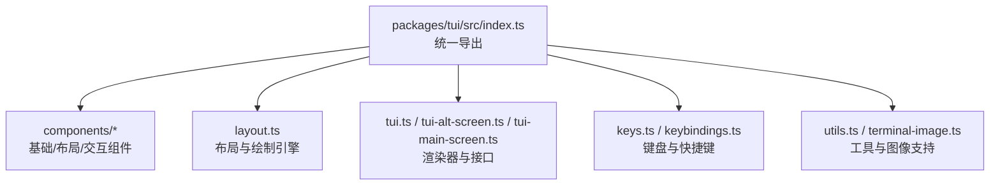
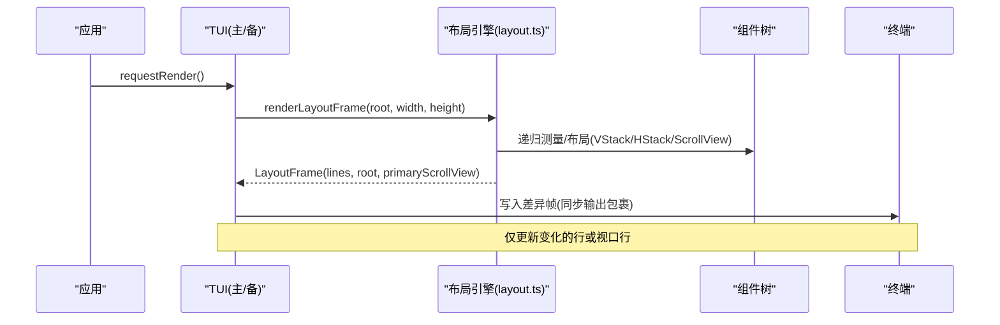
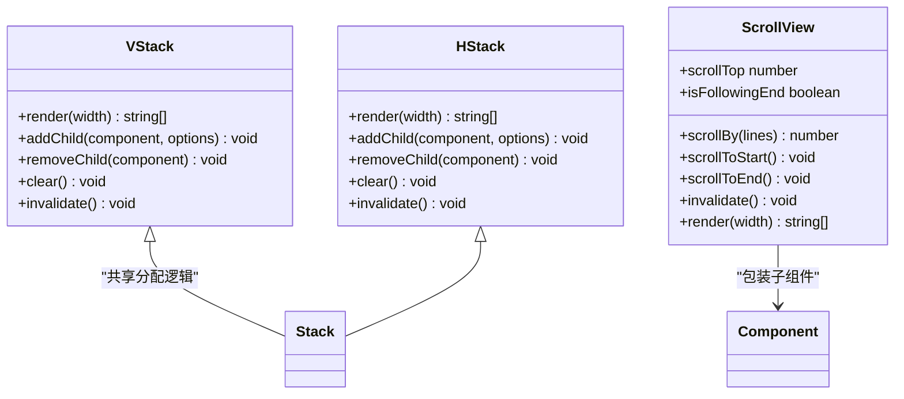
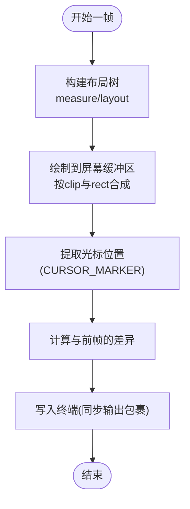
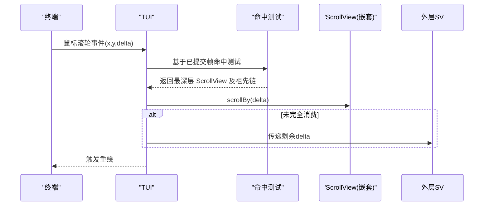
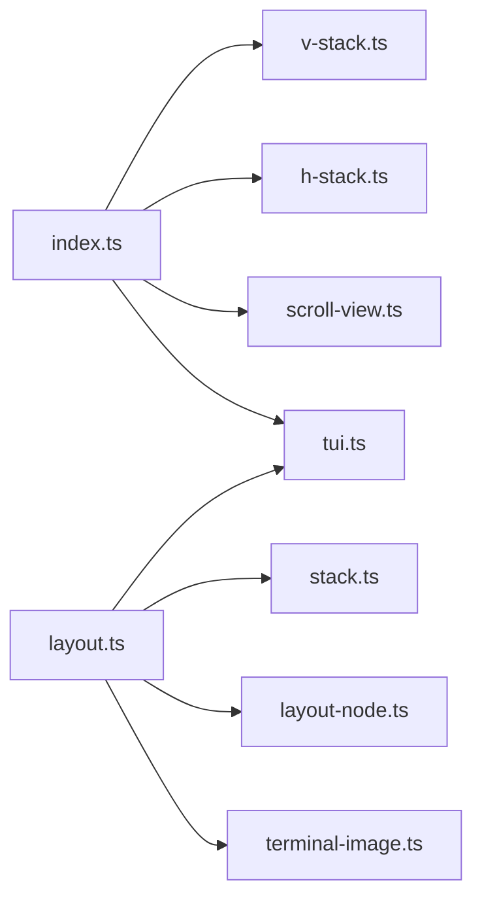

# 终端用户界面

<cite>
**本文引用的文件**
- [packages/tui/README.md](file://packages/tui/README.md)
- [packages/tui/src/index.ts](file://packages/tui/src/index.ts)
- [packages/tui/src/layout.ts](file://packages/tui/src/layout.ts)
- [packages/tui/src/components/v-stack.ts](file://packages/tui/src/components/v-stack.ts)
- [packages/tui/src/components/h-stack.ts](file://packages/tui/src/components/h-stack.ts)
- [packages/tui/src/components/scroll-view.ts](file://packages/tui/src/components/scroll-view.ts)
- [tui-plan.md](file://tui-plan.md)
</cite>

## 目录
1. [简介](#简介)
2. [项目结构](#项目结构)
3. [核心组件](#核心组件)
4. [架构总览](#架构总览)
5. [详细组件分析](#详细组件分析)
6. [依赖关系分析](#依赖关系分析)
7. [性能考虑](#性能考虑)
8. [故障排查指南](#故障排查指南)
9. [结论](#结论)
10. [附录：API 参考与示例](#附录api-参考与示例)

## 简介
本仓库包含一个用于构建终端用户界面的 TUI 库，提供可互换的渲染器（主屏幕与备用屏幕）、差分渲染、应用级滚动、同步输出、主题定制、内置组件、内联图像、自动补全等能力。该库通过统一的 TUI 接口管理组件树、焦点、覆盖层、输入与生命周期，并在不同渲染后端之间保持一致的行为。

## 项目结构
TUI 库位于 packages/tui，采用“按功能模块组织”的结构：
- 公共入口导出所有对外 API（组件、布局、键盘、工具函数、渲染器等）
- 组件目录包含基础组件、布局容器、交互控件
- 布局引擎负责在备用屏幕模式下进行受限布局、裁剪、绘制与滚动
- README 提供快速上手、核心 API、组件用法、主题与工具函数说明

**图表来源**
- [packages/tui/src/index.ts:1-143](file://packages/tui/src/index.ts#L1-L143)

**章节来源**
- [packages/tui/README.md:1-127](file://packages/tui/README.md#L1-L127)
- [packages/tui/src/index.ts:1-143](file://packages/tui/src/index.ts#L1-L143)

## 核心组件
- 基础组件：Text、TruncatedText、Box、Spacer、Image、Markdown、Loader、CancellableLoader
- 布局组件：Container、VStack、HStack、ScrollView
- 交互组件：Input、Editor、SelectList、SettingsList
- 视图能力：isViewportTUI 类型守卫，仅在备用屏幕模式启用受限布局与滚动

这些组件均实现 Component 接口，支持 render(width)、可选 handleInput(data)、invalidate()。Focusable 接口用于 IME 光标定位与硬件光标行为。

**章节来源**
- [packages/tui/README.md:206-277](file://packages/tui/README.md#L206-L277)
- [packages/tui/README.md:278-599](file://packages/tui/README.md#L278-L599)
- [packages/tui/src/index.ts:12-41](file://packages/tui/src/index.ts#L12-L41)

## 架构总览
TUI 的核心由“组件树 + 布局引擎 + 渲染器”构成：
- 组件树：应用构建的持久化状态树（如 VStack/HStack/ScrollView/业务组件）
- 布局引擎：每帧重建临时布局树（LayoutFrame），计算矩形、裁剪、滚动偏移，并缓存叶子渲染结果
- 渲染器：TuiMainScreen（主屏幕，保留终端回滚）与 TuiAltScreen（备用屏幕，应用级滚动与固定区域）

**图表来源**
- [packages/tui/src/layout.ts:353-382](file://packages/tui/src/layout.ts#L353-L382)
- [packages/tui/README.md:652-663](file://packages/tui/README.md#L652-L663)

**章节来源**
- [tui-plan.md:321-389](file://tui-plan.md#L321-L389)
- [packages/tui/src/layout.ts:353-382](file://packages/tui/src/layout.ts#L353-L382)
- [packages/tui/README.md:652-663](file://packages/tui/README.md#L652-L663)

## 详细组件分析

### 布局系统：VStack / HStack / ScrollView
- VStack：垂直堆叠，支持 gap、对齐、grow/shrink/basis/minSize/maxSize、visible 响应式显示
- HStack：水平堆叠，先分配宽度再测量高度，使用 ANSI 感知合成避免样式泄漏
- ScrollView：单轴（当前为 vertical）滚动，支持 follow-end、primary、overscroll(chain/contain)、滚动条可见性控制；维护 scrollTop、contentHeight、viewportHeight 与跟随状态

**图表来源**
- [packages/tui/src/components/v-stack.ts:1-34](file://packages/tui/src/components/v-stack.ts#L1-L34)
- [packages/tui/src/components/h-stack.ts:1-45](file://packages/tui/src/components/h-stack.ts#L1-L45)
- [packages/tui/src/components/scroll-view.ts:1-196](file://packages/tui/src/components/scroll-view.ts#L1-L196)

**章节来源**
- [tui-plan.md:114-246](file://tui-plan.md#L114-L246)
- [packages/tui/src/components/v-stack.ts:1-34](file://packages/tui/src/components/v-stack.ts#L1-L34)
- [packages/tui/src/components/h-stack.ts:1-45](file://packages/tui/src/components/h-stack.ts#L1-L45)
- [packages/tui/src/components/scroll-view.ts:1-196](file://packages/tui/src/components/scroll-view.ts#L1-L196)

### 渲染与差分更新
- 每帧重建布局树，复用叶子组件的渲染缓存（Markdown、Text、Image、Box 等）
- 绘制时按 box.rect 与累积 clip 裁剪，ANSI 感知列切片与合成，保持 CURSOR_MARKER 直到提取光标
- 备用屏幕下创建恰好 terminal.rows 行，主屏幕保持原有文档流输出
- 最终通过同步输出包裹实现原子更新，避免闪烁

**图表来源**
- [packages/tui/src/layout.ts:304-351](file://packages/tui/src/layout.ts#L304-L351)
- [packages/tui/README.md:652-663](file://packages/tui/README.md#L652-L663)

**章节来源**
- [tui-plan.md:347-389](file://tui-plan.md#L347-L389)
- [packages/tui/src/layout.ts:304-351](file://packages/tui/src/layout.ts#L304-L351)
- [packages/tui/README.md:652-663](file://packages/tui/README.md#L652-L663)

### 输入与事件路由（鼠标滚轮、键盘导航）
- 归一化鼠标事件，命中测试基于已提交的布局帧，从最深可见框向上冒泡
- 滚轮路由：优先命中目标 ScrollView，未消费则链式传递给外层 ScrollView，最后回退到 primary 视图
- 键盘导航：通过可配置的 TUI_KEYBINDINGS 动作路由到活动滚动区域或 primary 视图
- 不依赖鼠标能力检测，始终提供键盘导航

**图表来源**
- [tui-plan.md:496-567](file://tui-plan.md#L496-L567)

**章节来源**
- [tui-plan.md:496-567](file://tui-plan.md#L496-L567)

### 主题与样式系统
- 各组件接受主题对象以自定义颜色、边框、列表项样式等（如 MarkdownTheme、EditorTheme、SelectListTheme、ImageTheme）
- Box 与 Text 支持背景函数动态设置
- 滚动条样式可通过回调自定义
- 主题变更会触发失效并重绘

**章节来源**
- [packages/tui/README.md:397-445](file://packages/tui/README.md#L397-L445)
- [packages/tui/README.md:446-599](file://packages/tui/README.md#L446-L599)
- [packages/tui/src/components/scroll-view.ts:6-14](file://packages/tui/src/components/scroll-view.ts#L6-L14)

### 无障碍访问与国际化
- Focusable 接口配合 CURSOR_MARKER 将硬件光标定位到虚拟光标处，便于 IME 候选窗口正确显示
- 支持多语言文本宽度计算与截断（ANSI 感知），确保换行与截断正确
- 选择与复制遵循 ANSI 感知切片与图形边界对齐

**章节来源**
- [packages/tui/README.md:226-277](file://packages/tui/README.md#L226-L277)
- [packages/tui/README.md:688-705](file://packages/tui/README.md#L688-L705)

### 响应式设计与多终端兼容
- 布局条目支持 visible(viewport) 回调，根据终端尺寸决定是否渲染
- 备用屏幕模式下的滚动与固定区域语义不适用于主屏幕模式；isViewportTUI 用于能力探测
- 图像支持 Kitty/iTerm2 协议，备用屏幕下 iTerm2 回退为文本占位以避免残留

**章节来源**
- [tui-plan.md:114-146](file://tui-plan.md#L114-L146)
- [tui-plan.md:247-266](file://tui-plan.md#L247-L266)
- [packages/tui/README.md:569-599](file://packages/tui/README.md#L569-L599)

## 依赖关系分析
- index.ts 集中导出所有公共类型与类，解耦内部模块
- layout.ts 依赖 components/stack.ts、layout-node.ts、terminal-image.ts 与 tui.ts 的基础能力
- 组件通过 LAYOUT_NODE 标记暴露给布局引擎（如 ScrollView）
- 渲染器（TuiMainScreen/TuiAltScreen）与布局引擎协作完成帧绘制与差异写入

**图表来源**
- [packages/tui/src/index.ts:1-143](file://packages/tui/src/index.ts#L1-L143)
- [packages/tui/src/layout.ts:1-6](file://packages/tui/src/layout.ts#L1-L6)

**章节来源**
- [packages/tui/src/index.ts:1-143](file://packages/tui/src/index.ts#L1-L143)
- [packages/tui/src/layout.ts:1-6](file://packages/tui/src/layout.ts#L1-L6)

## 性能考虑
- 每帧重建布局但复用叶子渲染缓存，避免重复解析/高亮
- 精确裁剪与只绘制可见区域，减少 ANSI 合成开销
- 对宽行与图像行做快速路径优化，必要时直接引用源行
- 滚动条按需显示与延迟隐藏，降低频繁重绘
- 主屏幕与备用屏幕差异化策略，避免在主屏幕模拟不可靠的粘性/嵌套滚动

**章节来源**
- [tui-plan.md:347-389](file://tui-plan.md#L347-L389)
- [packages/tui/src/layout.ts:304-351](file://packages/tui/src/layout.ts#L304-L351)

## 故障排查指南
- 行宽越界：确保 render(width) 返回的每一行不超过 width，使用 truncateToWidth/wrapTextWithAnsi
- 样式泄漏：横向组合时使用 compositeTuiLine，避免跨子组件样式污染
- 图像异常：备用屏幕下 iTerm2 回退为文本；Kitty 图像需处理裁剪与删除
- 滚动卡顿：检查 ScrollView.follow/primary/overscroll 配置与 requestRender 调用时机
- 光标错位：确认 Focusable 组件正确放置 CURSOR_MARKER，并确保硬件光标开关符合预期

**章节来源**
- [packages/tui/README.md:707-792](file://packages/tui/README.md#L707-L792)
- [packages/tui/src/layout.ts:304-351](file://packages/tui/src/layout.ts#L304-L351)
- [packages/tui/README.md:569-599](file://packages/tui/README.md#L569-L599)

## 结论
该 TUI 库通过清晰的组件模型、强大的布局系统与高效的差分渲染，提供了在终端中构建复杂交互式界面的完整能力。其设计兼顾了主屏幕与备用屏幕的不同约束，提供了丰富的内置组件、主题与输入处理能力，适合构建高性能、可定制的终端应用。

## 附录：API 参考与示例
- 快速开始与核心 API：创建 TUI、添加组件、启动/停止、请求渲染、调试钩子
- 备用屏幕布局：使用 isViewportTUI 判断能力，设置 setLayoutRoot，组合 VStack/HStack/ScrollView
- 覆盖层：showOverlay/hideOverlay、定位与聚焦控制
- 组件接口：Component/Focusable、常用内置组件用法与主题
- 自动补全：CombinedAutocompleteProvider、斜杠命令与文件路径补全
- 键盘检测：matchesKey/Key 辅助识别按键
- 工具函数：visibleWidth/truncateToWidth/wrapTextWithAnsi

**章节来源**
- [packages/tui/README.md:18-127](file://packages/tui/README.md#L18-L127)
- [packages/tui/README.md:128-205](file://packages/tui/README.md#L128-L205)
- [packages/tui/README.md:206-599](file://packages/tui/README.md#L206-L599)
- [packages/tui/README.md:599-705](file://packages/tui/README.md#L599-L705)
- [packages/tui/README.md:707-792](file://packages/tui/README.md#L707-L792)