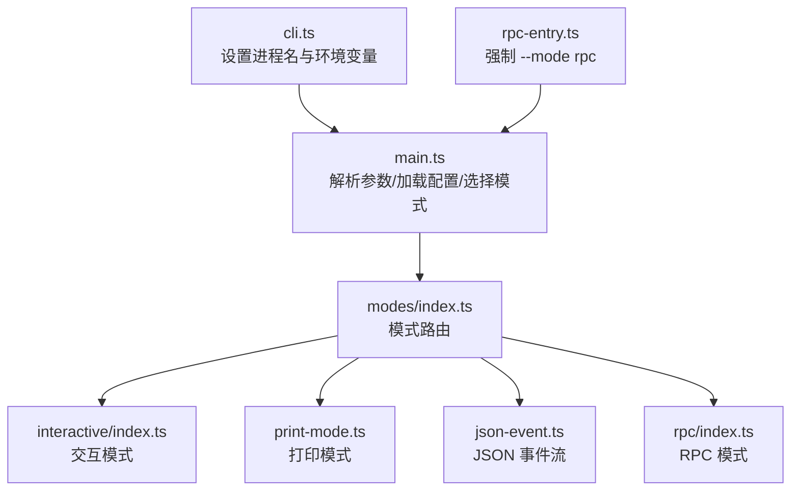
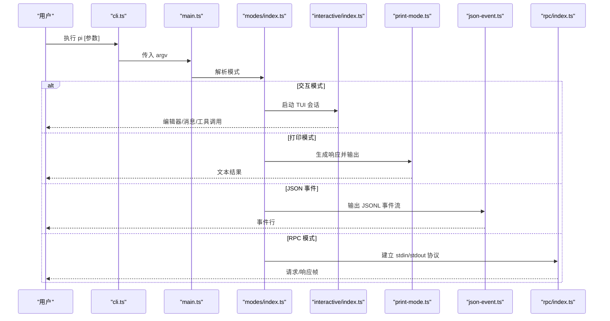
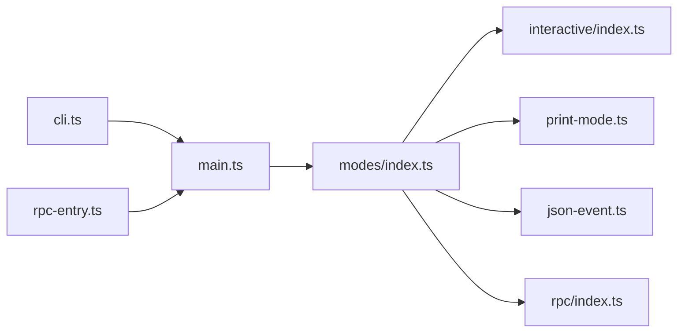

# CLI 使用指南

<cite>
**本文引用的文件**
- [packages/coding-agent/README.md](file://packages/coding-agent/README.md)
- [packages/coding-agent/package.json](file://packages/coding-agent/package.json)
- [packages/coding-agent/src/cli.ts](file://packages/coding-agent/src/cli.ts)
- [packages/coding-agent/src/rpc-entry.ts](file://packages/coding-agent/src/rpc-entry.ts)
- [packages/coding-agent/src/modes/index.ts](file://packages/coding-agent/src/modes/index.ts)
- [packages/coding-agent/src/modes/print-mode.ts](file://packages/coding-agent/src/modes/print-mode.ts)
- [packages/coding-agent/src/modes/json-event.ts](file://packages/coding-agent/src/modes/json-event.ts)
- [packages/coding-agent/src/modes/interactive/index.ts](file://packages/coding-agent/src/modes/interactive/index.ts)
- [packages/coding-agent/src/modes/rpc/index.ts](file://packages/coding-agent/src/modes/rpc/index.ts)
- [packages/coding-agent/src/main.ts](file://packages/coding-agent/src/main.ts)
- [packages/coding-agent/src/config.ts](file://packages/coding-agent/src/config.ts)
</cite>

## 目录
1. [简介](#简介)
2. [项目结构](#项目结构)
3. [核心组件](#核心组件)
4. [架构总览](#架构总览)
5. [详细组件分析](#详细组件分析)
6. [依赖关系分析](#依赖关系分析)
7. [性能与可用性考虑](#性能与可用性考虑)
8. [故障排除指南](#故障排除指南)
9. [结论](#结论)
10. [附录：常用命令速查](#附录：常用命令速查)

## 简介
本指南面向使用 pi 编码代理 CLI 的用户，覆盖以下主题：
- pi 命令的参数与配置方式
- 交互式会话的启动、基本对话、文件操作与代码执行
- 三种工作模式：交互模式、批处理（打印）模式、RPC 模式
- AI 提供商、API Key 与模型选择
- 会话管理：历史查看、上下文清理、会话导出
- 常见使用场景的命令示例
- 错误处理与故障排除

## 项目结构
pi 的 CLI 入口位于 packages/coding-agent，提供多模式运行能力（交互、打印、JSON 事件、RPC），并通过统一的主流程 main 分发到对应模式。

图表来源
- [packages/coding-agent/src/cli.ts:1-22](file://packages/coding-agent/src/cli.ts#L1-L22)
- [packages/coding-agent/src/rpc-entry.ts:1-14](file://packages/coding-agent/src/rpc-entry.ts#L1-L14)
- [packages/coding-agent/src/modes/index.ts](file://packages/coding-agent/src/modes/index.ts)
- [packages/coding-agent/src/modes/interactive/index.ts](file://packages/coding-agent/src/modes/interactive/index.ts)
- [packages/coding-agent/src/modes/print-mode.ts](file://packages/coding-agent/src/modes/print-mode.ts)
- [packages/coding-agent/src/modes/json-event.ts](file://packages/coding-agent/src/modes/json-event.ts)
- [packages/coding-agent/src/modes/rpc/index.ts](file://packages/coding-agent/src/modes/rpc/index.ts)

章节来源
- [packages/coding-agent/src/cli.ts:1-22](file://packages/coding-agent/src/cli.ts#L1-L22)
- [packages/coding-agent/src/rpc-entry.ts:1-14](file://packages/coding-agent/src/rpc-entry.ts#L1-L14)
- [packages/coding-agent/package.json:9-11](file://packages/coding-agent/package.json#L9-L11)

## 核心组件
- 命令行入口
  - cli.ts：设置进程名、环境变量、HTTP 调度器，并调用 main。
  - rpc-entry.ts：以 RPC 模式启动主流程。
- 模式路由
  - modes/index.ts：根据参数选择交互/打印/JSON/RPC 模式。
  - interactive/index.ts：交互式 TUI 会话。
  - print-mode.ts：一次性输出结果后退出。
  - json-event.ts：以 JSON Lines 输出所有事件。
  - rpc/index.ts：基于 stdin/stdout 的 RPC 协议。
- 配置与常量
  - config.ts：应用名称等常量。
  - package.json：声明 bin 指向 dist/cli.js，暴露 rpc-entry 等导出。

章节来源
- [packages/coding-agent/src/cli.ts:1-22](file://packages/coding-agent/src/cli.ts#L1-L22)
- [packages/coding-agent/src/rpc-entry.ts:1-14](file://packages/coding-agent/src/rpc-entry.ts#L1-L14)
- [packages/coding-agent/src/modes/index.ts](file://packages/coding-agent/src/modes/index.ts)
- [packages/coding-agent/src/modes/interactive/index.ts](file://packages/coding-agent/src/modes/interactive/index.ts)
- [packages/coding-agent/src/modes/print-mode.ts](file://packages/coding-agent/src/modes/print-mode.ts)
- [packages/coding-agent/src/modes/json-event.ts](file://packages/coding-agent/src/modes/json-event.ts)
- [packages/coding-agent/src/modes/rpc/index.ts](file://packages/coding-agent/src/modes/rpc/index.ts)
- [packages/coding-agent/src/config.ts](file://packages/coding-agent/src/config.ts)
- [packages/coding-agent/package.json:9-26](file://packages/coding-agent/package.json#L9-L26)

## 架构总览
下图展示了从 CLI 到模式的调用链，以及不同模式的数据流向。

图表来源
- [packages/coding-agent/src/cli.ts:1-22](file://packages/coding-agent/src/cli.ts#L1-L22)
- [packages/coding-agent/src/modes/index.ts](file://packages/coding-agent/src/modes/index.ts)
- [packages/coding-agent/src/modes/interactive/index.ts](file://packages/coding-agent/src/modes/interactive/index.ts)
- [packages/coding-agent/src/modes/print-mode.ts](file://packages/coding-agent/src/modes/print-mode.ts)
- [packages/coding-agent/src/modes/json-event.ts](file://packages/coding-agent/src/modes/json-event.ts)
- [packages/coding-agent/src/modes/rpc/index.ts](file://packages/coding-agent/src/modes/rpc/index.ts)

## 详细组件分析

### 命令与参数总览（基于官方文档）
- 包管理命令：install/remove/update/list/config
- 模式：默认交互；-p/--print 打印模式；--mode json 输出 JSON 事件；--mode rpc 进程集成
- 模型选项：--provider、--model、--api-key、--thinking、--models、--list-models
- 会话选项：-c/--continue、-r/--resume、--session、--fork、--session-dir、--no-session、--name/-n
- 工具选项：--tools/-t、--exclude-tools/-xt、--no-builtin-tools/-nbt、--no-tools/-nt
- 资源选项：-e/--extension、--no-extensions、--skill、--no-skills、--prompt-template、--no-prompt-templates、--theme、--no-themes、--no-context-files/-nc
- 其他：--system-prompt、--append-system-prompt、--tui-mode、--verbose、-a/--approve、-na/--no-approve、-h/--help、-v/--version
- 文件参数：@files 将文件内容附加到消息中
- 环境变量：PI_CODING_AGENT_DIR、PI_OFFLINE、PI_SKIP_VERSION_CHECK、PI_TELEMETRY、VISUAL/EDITOR 等

章节来源
- [packages/coding-agent/README.md:514-690](file://packages/coding-agent/README.md#L514-L690)

### 交互式会话
- 启动：直接运行 pi，或在参数中加入初始提示词
- 编辑器与快捷键：支持 @ 文件引用、Tab 路径补全、多行输入、外部编辑器、粘贴图片、Bash 命令前缀 ! 或 !!
- 命令：/login、/logout、/llama、/model、/scoped-models、/settings、/resume、/new、/name、/session、/tree、/trust、/fork、/clone、/compact、/copy、/export、/import、/share、/reload、/hotkeys、/changelog、/quit
- 消息队列：Enter 提交“转向”消息，Alt+Enter 提交“跟进”消息，Escape 中止并恢复队列，Alt+Up 取回队列
- 传输偏好：steeringMode/followUpMode/transport 可在设置中配置

章节来源
- [packages/coding-agent/README.md:147-233](file://packages/coding-agent/README.md#L147-L233)

### 批处理（打印）模式
- 用途：一次性输出结果并退出，适合脚本化任务
- 行为：读取管道标准输入并与初始提示合并
- 示例：cat README.md | pi -p "Summarize this text"

章节来源
- [packages/coding-agent/README.md:549-553](file://packages/coding-agent/README.md#L549-L553)

### RPC 模式
- 用途：通过 stdin/stdout 进行进程间通信，供非 Node 环境集成
- 协议：严格 LF 分隔的 JSONL 帧，客户端需按 \n 拆分记录
- 启动：pi --mode rpc 或通过 rpc-entry 自动注入 --mode rpc

章节来源
- [packages/coding-agent/README.md:480-490](file://packages/coding-agent/README.md#L480-L490)
- [packages/coding-agent/src/rpc-entry.ts:1-14](file://packages/coding-agent/src/rpc-entry.ts#L1-L14)

### 会话管理
- 存储位置：~/.pi/agent/sessions/，按工作目录组织
- 常用选项：-c 继续最近会话、-r 浏览历史、--no-session 临时会话、--name 设置显示名、--session/--fork 指定会话文件或 ID
- 分支与回溯：/tree 在树形视图中跳转到任意历史点继续；/fork 从某条用户消息分叉出新会话；/clone 复制当前活跃分支到新会话
- 上下文压缩：/compact 手动触发；默认自动触发（接近限制时主动压缩，溢出时恢复并重试）；完整历史仍保存在 JSONL 中
- 导出/导入：/export 导出 HTML 或 JSONL；/import 从 JSONL 恢复会话

章节来源
- [packages/coding-agent/README.md:236-280](file://packages/coding-agent/README.md#L236-L280)

### 提供商、API Key 与模型选择
- 认证：可通过订阅（/login）或环境变量设置 API Key
- 支持的提供商与模型：内置提供商列表丰富，可通过 /model 切换；也可通过 provider/id 形式指定
- 本地推理：支持 llama.cpp router，/llama 管理下载与加载模型
- 自定义提供商/模型：通过 models.json 或扩展实现

章节来源
- [packages/coding-agent/README.md:97-143](file://packages/coding-agent/README.md#L97-L143)

### 工具与权限控制
- 内置工具：read、bash、edit、write、grep、find、ls
- 白名单/黑名单：--tools/-t、--exclude-tools/-xt
- 禁用策略：--no-builtin-tools/-nbt、--no-tools/-nt
- 安全建议：只启用必要工具，结合项目信任与沙箱策略

章节来源
- [packages/coding-agent/README.md:578-587](file://packages/coding-agent/README.md#L578-L587)

### 资源与上下文
- 上下文文件：AGENTS.md/CLAUDE.md 自动加载；可用 .pi/SYSTEM.md 替换系统提示；--no-context-files 关闭上下文文件
- 扩展/技能/模板/主题：通过 -e/--extension、--skill、--prompt-template、--theme 显式加载，或用 --no-* 关闭自动发现

章节来源
- [packages/coding-agent/README.md:320-336](file://packages/coding-agent/README.md#L320-L336)
- [packages/coding-agent/README.md:589-603](file://packages/coding-agent/README.md#L589-L603)

### 项目信任与安全
- 交互式启动会询问是否信任包含本地配置/资源的目录；非交互模式遵循 defaultProjectTrust
- 可保存信任决策（/trust），影响后续会话加载范围

章节来源
- [packages/coding-agent/README.md:295-308](file://packages/coding-agent/README.md#L295-L308)

## 依赖关系分析
- 入口与模式
  - cli.ts 设置环境与 HTTP 调度器后调用 main
  - rpc-entry.ts 强制 --mode rpc 后调用 main
  - main 解析参数并路由到 modes/index.ts
  - modes/index.ts 分发至具体模式模块
- 运行时配置
  - config.ts 提供应用标识等常量
  - package.json 定义 bin 与导出，便于全局安装与程序化使用

图表来源
- [packages/coding-agent/src/cli.ts:1-22](file://packages/coding-agent/src/cli.ts#L1-L22)
- [packages/coding-agent/src/rpc-entry.ts:1-14](file://packages/coding-agent/src/rpc-entry.ts#L1-L14)
- [packages/coding-agent/src/modes/index.ts](file://packages/coding-agent/src/modes/index.ts)
- [packages/coding-agent/src/modes/interactive/index.ts](file://packages/coding-agent/src/modes/interactive/index.ts)
- [packages/coding-agent/src/modes/print-mode.ts](file://packages/coding-agent/src/modes/print-mode.ts)
- [packages/coding-agent/src/modes/json-event.ts](file://packages/coding-agent/src/modes/json-event.ts)
- [packages/coding-agent/src/modes/rpc/index.ts](file://packages/coding-agent/src/modes/rpc/index.ts)

章节来源
- [packages/coding-agent/src/cli.ts:1-22](file://packages/coding-agent/src/cli.ts#L1-L22)
- [packages/coding-agent/src/rpc-entry.ts:1-14](file://packages/coding-agent/src/rpc-entry.ts#L1-L14)
- [packages/coding-agent/package.json:9-26](file://packages/coding-agent/package.json#L9-L26)

## 性能与可用性考虑
- 上下文压缩：长会话建议开启自动压缩，必要时手动 /compact 以减少上下文占用
- 工具最小化：仅启用必要工具，减少 LLM 决策开销与潜在副作用
- 传输与缓存：合理配置 transport 与 PI_CACHE_RETENTION，提升响应速度与成本效率
- 离线模式：PI_OFFLINE=1 可禁用启动网络操作，适用于受限环境

[本节为通用指导，不直接分析具体文件]

## 故障排除指南
- 无法连接提供商
  - 检查环境变量中的 API Key 是否正确
  - 确认网络可达性与代理设置
  - 使用 --list-models 验证模型列表是否刷新
- 会话异常
  - 使用 /session 查看当前会话信息
  - 使用 /tree 回溯到稳定节点继续
  - 使用 /compact 压缩上下文后重试
- 工具执行失败
  - 使用 --tools/-t 限制工具范围
  - 使用 --exclude-tools/-xt 排除问题工具
  - 在非交互模式下用 -p 快速定位问题
- 项目信任问题
  - 非交互模式通过 --approve/--no-approve 控制一次运行的信任行为
  - 交互式使用 /trust 保存信任决策

章节来源
- [packages/coding-agent/README.md:295-308](file://packages/coding-agent/README.md#L295-L308)
- [packages/coding-agent/README.md:578-603](file://packages/coding-agent/README.md#L578-L603)

## 结论
pi 提供了统一的 CLI 入口与多模式运行能力，既能满足日常交互式编程辅助，也能无缝接入自动化流程。通过合理的参数组合、会话管理与工具控制，可以在保证安全的前提下高效完成代码生成、调试、搜索与版本管理等任务。

[本节为总结性内容，不直接分析具体文件]

## 附录：常用命令速查
- 交互模式
  - pi "列出 src 下所有 .ts 文件"
  - pi --provider openai --model gpt-4o "帮助重构"
  - pi --model sonnet:high "解决复杂问题"
  - pi --tools read,grep,find,ls -p "审查代码"
- 批处理模式
  - cat README.md | pi -p "总结此文本"
  - pi -p "总结此代码库"
- RPC 模式
  - pi --mode rpc
- 会话管理
  - pi -c 继续最近会话
  - pi -r 浏览历史会话
  - pi --no-session 临时会话
  - pi --name "发布审计" -p "审计此仓库"
  - /export 导出会话；/import 导入会话；/compact 压缩上下文；/tree 回溯分支

章节来源
- [packages/coding-agent/README.md:628-663](file://packages/coding-agent/README.md#L628-L663)
- [packages/coding-agent/README.md:236-280](file://packages/coding-agent/README.md#L236-L280)