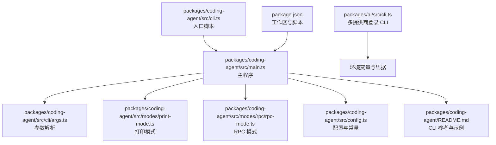
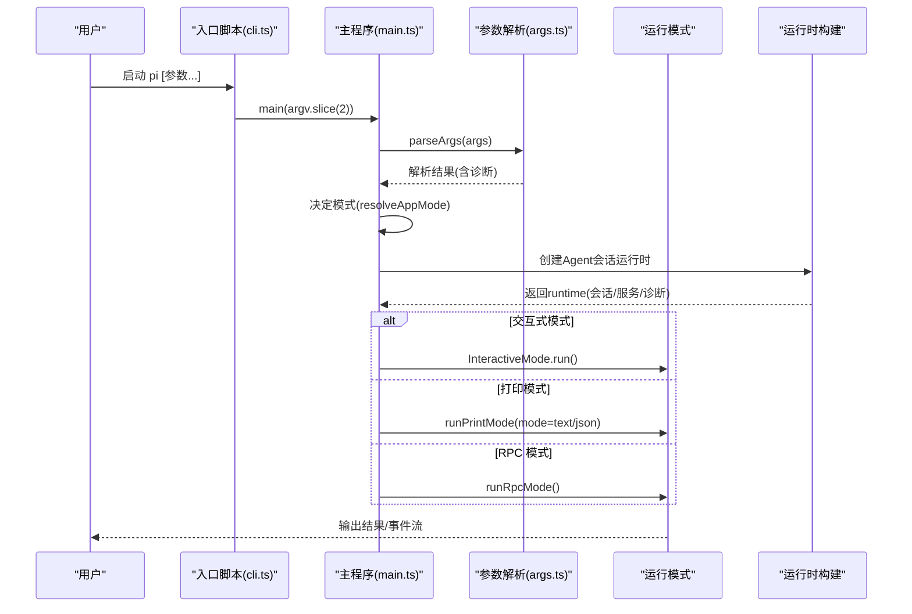
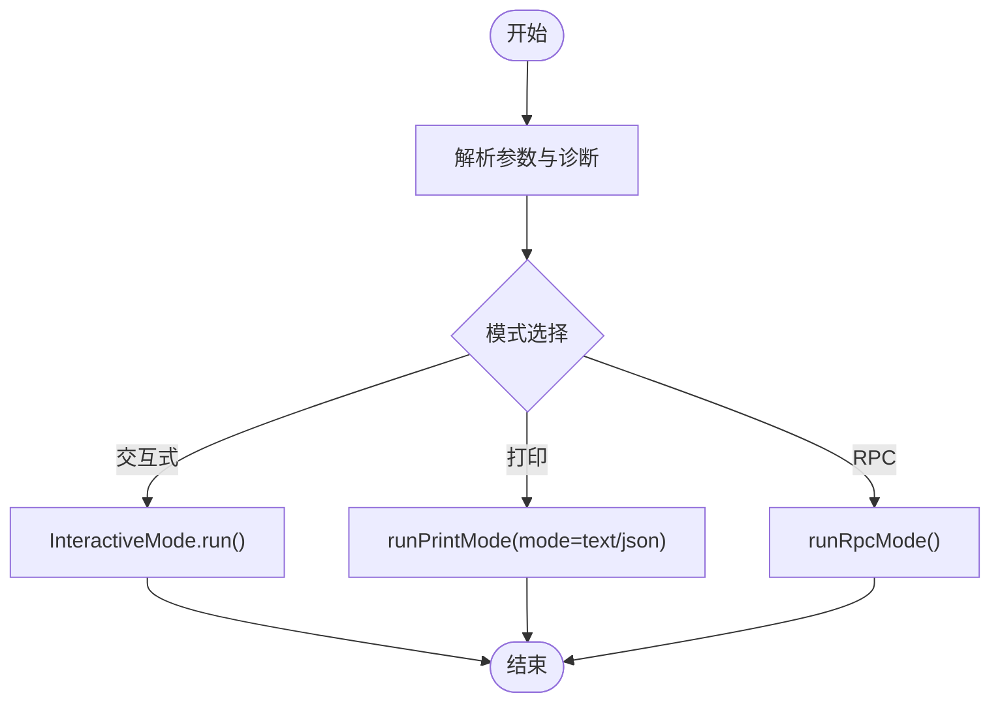
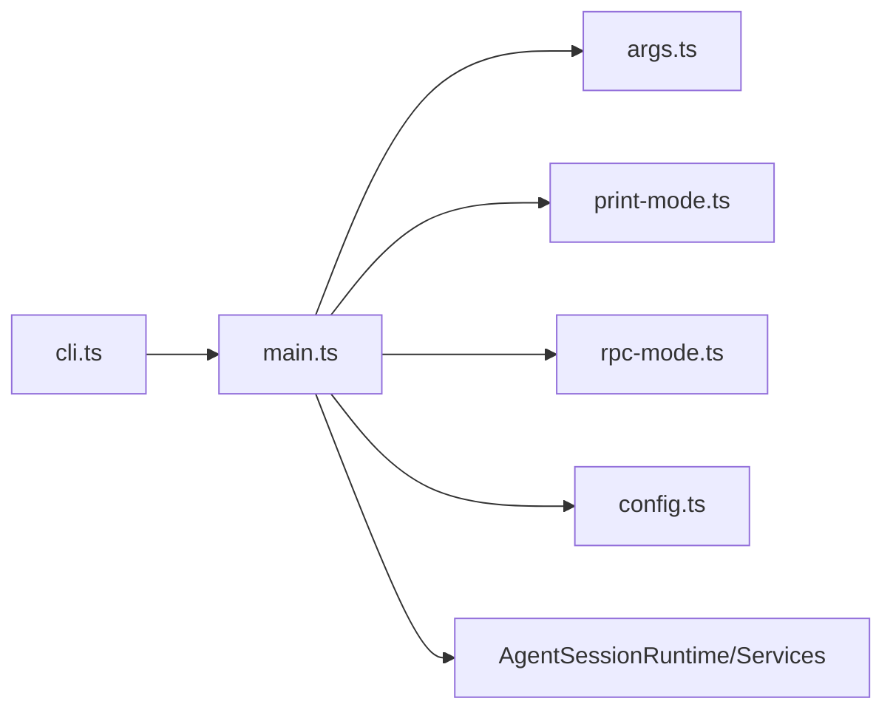

# CLI接口

<cite>
**本文引用的文件**
- [cli.ts](file://packages/coding-agent/src/cli.ts)
- [main.ts](file://packages/coding-agent/src/main.ts)
- [args.ts](file://packages/coding-agent/src/cli/args.ts)
- [print-mode.ts](file://packages/coding-agent/src/modes/print-mode.ts)
- [rpc-mode.ts](file://packages/coding-agent/src/modes/rpc/rpc-mode.ts)
- [config.ts](file://packages/coding-agent/src/config.ts)
- [README.md](file://packages/coding-agent/README.md)
- [cli.ts](file://packages/ai/src/cli.ts)
- [package.json](file://package.json)
</cite>

## 目录
1. [简介](#简介)
2. [项目结构](#项目结构)
3. [核心组件](#核心组件)
4. [架构总览](#架构总览)
5. [详细组件分析](#详细组件分析)
6. [依赖关系分析](#依赖关系分析)
7. [性能考量](#性能考量)
8. [故障排除指南](#故障排除指南)
9. [结论](#结论)
10. [附录](#附录)

## 简介
本文件为 Pi 编码代理的 CLI 接口使用文档，面向使用者与集成开发者，系统性说明命令行参数、运行模式（交互式、打印模式、RPC 模式）以及常见使用场景与故障排除方法。CLI 提供多种模式以适配从终端交互到进程内嵌入的不同需求，并通过统一的参数体系支持模型选择、工具控制、资源加载与会话管理。

## 项目结构
- 入口脚本负责初始化运行环境并调用主程序。
- 主程序负责参数解析、模式判定、会话管理、运行时构建与模式执行。
- 参数解析模块定义所有可用选项与帮助信息。
- 运行模式模块分别实现交互式、打印模式与 RPC 模式。
- 配置模块提供应用名称、版本号、路径与环境变量约定。
- README 提供完整 CLI 参考与示例。

图表来源
- [cli.ts:1-21](file://packages/coding-agent/src/cli.ts#L1-L21)
- [main.ts:1-779](file://packages/coding-agent/src/main.ts#L1-L779)
- [args.ts:1-370](file://packages/coding-agent/src/cli/args.ts#L1-L370)
- [print-mode.ts:1-159](file://packages/coding-agent/src/modes/print-mode.ts#L1-L159)
- [rpc-mode.ts:1-774](file://packages/coding-agent/src/modes/rpc/rpc-mode.ts#L1-L774)
- [config.ts:456-467](file://packages/coding-agent/src/config.ts#L456-L467)
- [README.md:490-643](file://packages/coding-agent/README.md#L490-L643)
- [cli.ts:1-148](file://packages/ai/src/cli.ts#L1-L148)
- [package.json:1-60](file://package.json#L1-L60)

章节来源
- [cli.ts:1-21](file://packages/coding-agent/src/cli.ts#L1-L21)
- [main.ts:1-779](file://packages/coding-agent/src/main.ts#L1-L779)
- [args.ts:1-370](file://packages/coding-agent/src/cli/args.ts#L1-L370)
- [print-mode.ts:1-159](file://packages/coding-agent/src/modes/print-mode.ts#L1-L159)
- [rpc-mode.ts:1-774](file://packages/coding-agent/src/modes/rpc/rpc-mode.ts#L1-L774)
- [config.ts:456-467](file://packages/coding-agent/src/config.ts#L456-L467)
- [README.md:490-643](file://packages/coding-agent/README.md#L490-L643)
- [cli.ts:1-148](file://packages/ai/src/cli.ts#L1-L148)
- [package.json:1-60](file://package.json#L1-L60)

## 核心组件
- 命令行入口：设置应用标题、标记运行环境、配置全局 HTTP 分发器后调用主程序。
- 主程序：解析参数、决定运行模式、读取管道输入、准备初始消息、构建运行时并执行对应模式。
- 参数解析：支持帮助、版本、模式、会话、模型、工具、资源、导出、离线等选项。
- 运行模式：
  - 打印模式：非交互输出最终响应或事件流，适合脚本与自动化。
  - RPC 模式：基于 JSONL 的进程间协议，适合嵌入到其他应用。
  - 交互式模式：默认模式，提供 TUI 与扩展 UI。
- 配置：提供应用名、版本、配置目录、会话目录等常量与环境变量约定。

章节来源
- [cli.ts:1-21](file://packages/coding-agent/src/cli.ts#L1-L21)
- [main.ts:477-779](file://packages/coding-agent/src/main.ts#L477-L779)
- [args.ts:61-198](file://packages/coding-agent/src/cli/args.ts#L61-L198)
- [print-mode.ts:32-159](file://packages/coding-agent/src/modes/print-mode.ts#L32-L159)
- [rpc-mode.ts:53-774](file://packages/coding-agent/src/modes/rpc/rpc-mode.ts#L53-L774)
- [config.ts:456-467](file://packages/coding-agent/src/config.ts#L456-L467)

## 架构总览
下图展示了 CLI 启动到模式执行的关键流程与组件交互。

图表来源
- [cli.ts:1-21](file://packages/coding-agent/src/cli.ts#L1-L21)
- [main.ts:497-779](file://packages/coding-agent/src/main.ts#L497-L779)
- [args.ts:61-198](file://packages/coding-agent/src/cli/args.ts#L61-L198)
- [print-mode.ts:32-159](file://packages/coding-agent/src/modes/print-mode.ts#L32-L159)
- [rpc-mode.ts:53-774](file://packages/coding-agent/src/modes/rpc/rpc-mode.ts#L53-L774)

## 详细组件分析

### 命令行参数与选项
- 基本选项
  - --help, -h：显示帮助。
  - --version, -v：显示版本。
  - --mode <text|json|rpc>：设置输出模式。
  - --print, -p：非交互模式（打印响应并退出），可选追加消息。
  - --export <in> [out]：将会话导出为 HTML 并退出。
  - --offline：禁用启动网络操作（同 PI_OFFLINE=1）。
  - --verbose：强制详细启动。
- 会话相关
  - --continue, -c：继续最近会话。
  - --resume, -r：浏览并选择会话。
  - --session <path|id>：使用指定会话文件或部分 UUID。
  - --session-id <id>：使用精确项目会话 ID（不存在则创建）。
  - --fork <path|id>：从指定会话派生新会话。
  - --session-dir <dir>：自定义会话存储目录。
  - --no-session：临时会话（不保存）。
- 模型与思考层级
  - --provider <name>：提供商名称。
  - --model <pattern>：模型模式或 ID；支持“提供商/ID”与“:<thinking>”简写。
  - --api-key <key>：API 密钥（覆盖环境变量）。
  - --thinking <off|minimal|low|medium|high|xhigh>：设置思考层级。
  - --models <patterns,...>：逗号分隔的模型模式，用于 Ctrl+P 切换。
  - --list-models [search]：列出可用模型（可带模糊搜索）。
- 工具控制
  - --tools <list>, -t <list>：允许列表（内置、扩展、自定义工具）。
  - --exclude-tools <list>, -xt <list>：拒绝列表。
  - --no-tools, -nt：默认禁用所有工具。
  - --no-builtin-tools, -nbt：默认禁用内置工具，保留扩展/自定义。
- 资源加载
  - --extension <path>, -e <path>：加载扩展文件（可多次）。
  - --no-extensions, -ne：禁用扩展发现。
  - --skill <path>：加载技能（可多次）。
  - --no-skills, -ns：禁用技能发现。
  - --prompt-template <path>：加载提示模板（可多次）。
  - --no-prompt-templates, -np：禁用提示模板发现。
  - --theme <path>：加载主题（可多次）。
  - --no-themes：禁用主题发现。
  - --no-context-files, -nc：禁用上下文文件（AGENTS.md/CLAUDE.md）发现。
- 系统提示
  - --system-prompt <text>：替换默认系统提示。
  - --append-system-prompt <text>：向系统提示追加文本或文件内容（可多次）。
- 文件参数
  - @file：将文件内容注入初始消息；在 RPC 模式中不支持 @file 参数。
- 未知标志
  - 以 -- 开头的未知标志会被收集到扩展标志映射中，交由扩展处理。

章节来源
- [args.ts:61-198](file://packages/coding-agent/src/cli/args.ts#L61-L198)
- [args.ts:200-370](file://packages/coding-agent/src/cli/args.ts#L200-L370)
- [main.ts:533-536](file://packages/coding-agent/src/main.ts#L533-L536)

### 运行模式详解
- 交互式模式（默认）
  - 特点：提供 TUI、编辑器、扩展 UI、键盘绑定与主题。
  - 适用：日常开发、调试、探索性任务。
- 打印模式（-p/--print）
  - 特点：发送提示、输出最终响应或事件流（--mode json），然后退出。
  - 适用：脚本化、CI/CD、批处理任务。
- RPC 模式（--mode rpc）
  - 特点：严格 LF 分隔的 JSONL 协议，stdin 接收命令，stdout 流式输出事件与响应。
  - 适用：嵌入到其他应用、语言无关集成。

图表来源
- [main.ts:508-779](file://packages/coding-agent/src/main.ts#L508-L779)
- [print-mode.ts:32-159](file://packages/coding-agent/src/modes/print-mode.ts#L32-L159)
- [rpc-mode.ts:53-774](file://packages/coding-agent/src/modes/rpc/rpc-mode.ts#L53-L774)

章节来源
- [main.ts:508-779](file://packages/coding-agent/src/main.ts#L508-L779)
- [print-mode.ts:1-159](file://packages/coding-agent/src/modes/print-mode.ts#L1-L159)
- [rpc-mode.ts:1-774](file://packages/coding-agent/src/modes/rpc/rpc-mode.ts#L1-L774)

### 模型与思考层级
- 模型解析
  - 支持 --provider 与 --model 组合，或直接使用“提供商/ID”形式。
  - 支持“模型:思考级别”简写，若未显式设置 --thinking，则继承模型配置的思考级别。
- 思考层级
  - 可通过 --thinking 显式设置；否则按模型配置或范围内的默认值继承。
- 模型范围
  - --models 支持通配符与模糊匹配，用于 Ctrl+P 切换。

章节来源
- [main.ts:356-432](file://packages/coding-agent/src/main.ts#L356-L432)
- [args.ts:55-59](file://packages/coding-agent/src/cli/args.ts#L55-L59)

### 会话管理
- 会话选择逻辑
  - --continue：继续最近会话。
  - --resume：交互式选择历史会话。
  - --session：使用指定会话文件或部分 UUID。
  - --fork：从现有会话派生新会话。
  - --session-id：使用精确项目会话 ID（不存在则创建）。
- 会话目录
  - --session-dir 或环境变量 PI_CODING_AGENT_SESSION_DIR 覆盖默认会话目录。
- 会话目录优先级
  - 启动阶段仅用于定位会话目录；实际运行时以目标会话的工作目录为准。

章节来源
- [main.ts:250-336](file://packages/coding-agent/src/main.ts#L250-L336)
- [config.ts:466-467](file://packages/coding-agent/src/config.ts#L466-L467)

### 环境变量与凭据
- 环境变量
  - PI_OFFLINE：禁用启动网络操作。
  - PI_SKIP_VERSION_CHECK：跳过版本检查。
  - PI_TELEMETRY：覆盖安装/更新遥测。
  - PI_CODING_AGENT_DIR：覆盖配置目录。
  - PI_CODING_AGENT_SESSION_DIR：覆盖会话目录。
  - PI_PACKAGE_DIR：覆盖包目录。
- 多提供商登录 CLI
  - 使用 packages/ai/src/cli.ts 管理 OAuth 凭据，保存于 auth.json。

章节来源
- [args.ts:317-359](file://packages/coding-agent/src/cli/args.ts#L317-L359)
- [cli.ts:1-148](file://packages/ai/src/cli.ts#L1-L148)

### 完整命令行使用示例
- 启动交互式模式
  - pi
  - pi "列出 src 中的 .ts 文件"
- 包含文件内容的初始消息
  - pi @prompt.md @image.png "天空是什么颜色？"
- 非交互模式（打印响应并退出）
  - pi -p "列出 src 中的 .ts 文件"
- 多条消息（交互式）
  - pi "读取 package.json" "我们有哪些依赖？"
- 继续上一次会话
  - pi --continue "我们之前讨论了什么？"
- 指定模型
  - pi --provider openai --model gpt-4o-mini "帮我重构这段代码"
  - pi --model openai/gpt-4o "帮我重构这段代码"
  - pi --model sonnet:high "解决这个复杂问题"
- 限制模型切换范围
  - pi --models claude-sonnet,claude-haiku,gpt-4o
  - pi --models "github-copilot/*"
  - pi --models sonnet:high,haiku:low
- 设置思考层级
  - pi --thinking high "解决这个复杂问题"
- 只读模式（不修改文件）
  - pi --tools read,grep,find,ls -p "审查代码"
- 禁用特定工具
  - pi --exclude-tools ask_question
- 导出会话为 HTML
  - pi --export ~/.pi/agent/sessions/--path--/session.jsonl
  - pi --export session.jsonl output.html
- RPC 模式
  - pi --mode rpc

章节来源
- [README.md:596-628](file://packages/coding-agent/README.md#L596-L628)
- [args.ts:267-316](file://packages/coding-agent/src/cli/args.ts#L267-L316)

## 依赖关系分析
- 入口脚本依赖主程序与 HTTP 分发器配置。
- 主程序依赖参数解析、模式模块、运行时构建、会话管理、设置与模型注册表。
- 模式模块依赖运行时会话与输出保护机制。
- 配置模块提供应用名、版本、路径与环境变量常量。

图表来源
- [cli.ts:1-21](file://packages/coding-agent/src/cli.ts#L1-L21)
- [main.ts:1-779](file://packages/coding-agent/src/main.ts#L1-L779)
- [args.ts:1-370](file://packages/coding-agent/src/cli/args.ts#L1-L370)
- [print-mode.ts:1-159](file://packages/coding-agent/src/modes/print-mode.ts#L1-L159)
- [rpc-mode.ts:1-774](file://packages/coding-agent/src/modes/rpc/rpc-mode.ts#L1-L774)
- [config.ts:456-467](file://packages/coding-agent/src/config.ts#L456-L467)

章节来源
- [cli.ts:1-21](file://packages/coding-agent/src/cli.ts#L1-L21)
- [main.ts:1-779](file://packages/coding-agent/src/main.ts#L1-L779)
- [args.ts:1-370](file://packages/coding-agent/src/cli/args.ts#L1-L370)
- [print-mode.ts:1-159](file://packages/coding-agent/src/modes/print-mode.ts#L1-L159)
- [rpc-mode.ts:1-774](file://packages/coding-agent/src/modes/rpc/rpc-mode.ts#L1-L774)
- [config.ts:456-467](file://packages/coding-agent/src/config.ts#L456-L467)

## 性能考量
- 启动基准
  - 在非交互模式下设置 PI_STARTUP_BENCHMARK 将导致错误（仅交互模式支持）。
- 网络与缓存
  - --offline 或 PI_OFFLINE=1 可禁用启动网络操作，减少冷启动时间。
  - 可通过环境变量 PI_SKIP_VERSION_CHECK 控制版本检查。
- 输出背压
  - RPC 模式在事件输出时考虑 stdout 背压，避免阻塞与内存累积。

章节来源
- [main.ts:728-732](file://packages/coding-agent/src/main.ts#L728-L732)
- [rpc-mode.ts:356-358](file://packages/coding-agent/src/modes/rpc/rpc-mode.ts#L356-L358)

## 故障排除指南
- 常见错误与处理
  - 无效选项：当遇到未知短选项（以 - 开头但不在已知集合内）时，会报告错误并退出。
  - 无效思考层级：当 --thinking 值不在有效集合时，记录警告并忽略该值。
  - 会话冲突：--fork 不能与 --session/--continue/--resume/--no-session 组合使用；--session-id 不能与上述标志组合使用。
  - 会话不存在：当 --fork 或 --session 指向的会话不存在时，会提示找不到匹配项并退出。
  - RPC 模式不支持 @file：在 --mode rpc 下使用 @file 参数会报错并退出。
  - 模型缺失：在非交互模式且未配置模型时，会提示无可用模型并退出。
  - 启动基准限制：PI_STARTUP_BENCHMARK 仅支持交互模式，其他模式会报错。
  - 管道输入合并：在非 RPC 模式下，若存在管道输入，会将其合并到初始消息中。
- 诊断与日志
  - 设置与资源加载错误会作为诊断信息输出，严重错误会导致进程退出。
  - 调试日志路径：~/.pi/agent/<app>-debug.log（应用名来自配置）。
- 认证与凭据
  - 使用 packages/ai/src/cli.ts 进行多提供商 OAuth 登录，凭据保存在 auth.json。
  - 通过环境变量设置各提供商 API Key。

章节来源
- [main.ts:193-238](file://packages/coding-agent/src/main.ts#L193-L238)
- [main.ts:533-536](file://packages/coding-agent/src/main.ts#L533-L536)
- [main.ts:723-732](file://packages/coding-agent/src/main.ts#L723-L732)
- [main.ts:84-90](file://packages/coding-agent/src/main.ts#L84-L90)
- [config.ts:534-536](file://packages/coding-agent/src/config.ts#L534-L536)
- [cli.ts:15-26](file://packages/ai/src/cli.ts#L15-L26)
- [cli.ts:28-73](file://packages/ai/src/cli.ts#L28-L73)

## 结论
Pi 编码代理 CLI 提供了灵活而强大的参数体系与三种运行模式，既能满足日常交互式开发，也能胜任脚本化与进程内嵌入场景。通过明确的会话管理、模型与工具控制、资源加载策略以及完善的诊断与故障排除机制，用户可以高效地在不同工作流中使用该 CLI。

## 附录
- CLI 参考与示例详见包内 README 的“CLI Reference”章节。
- 多提供商登录 CLI 用于管理 OAuth 凭据，便于在不同提供商之间切换与复用。

章节来源
- [README.md:490-643](file://packages/coding-agent/README.md#L490-L643)
- [cli.ts:75-148](file://packages/ai/src/cli.ts#L75-L148)