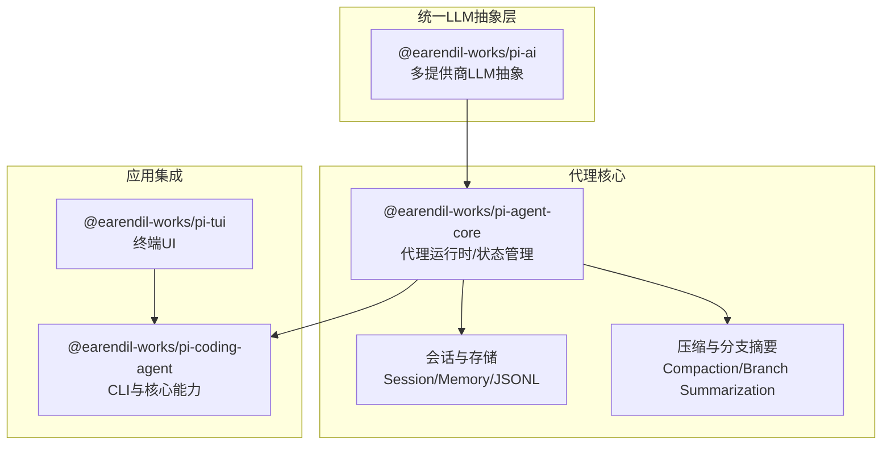
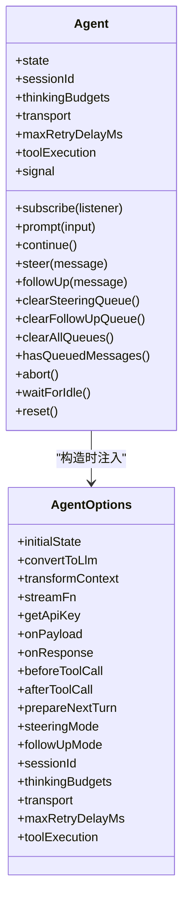
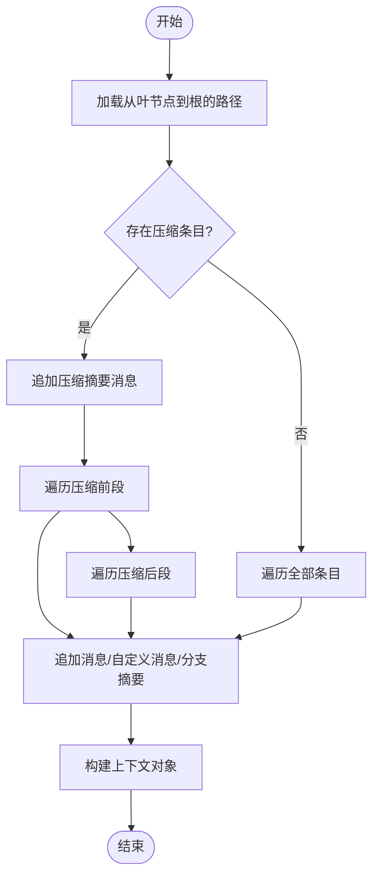
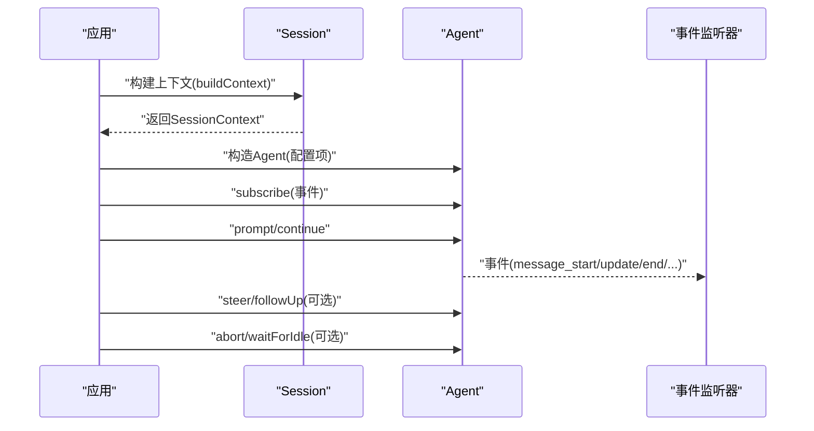
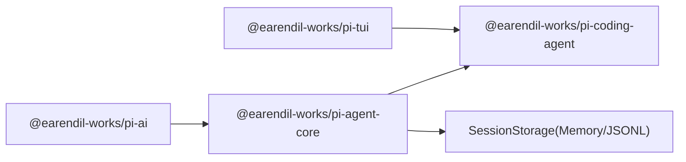

# SDK集成

<cite>
**本文引用的文件**
- [README.md](file://README.md)
- [package.json](file://package.json)
- [packages/agent/src/agent.ts](file://packages/agent/src/agent.ts)
- [packages/agent/src/harness/session/session.ts](file://packages/agent/src/harness/session/session.ts)
- [packages/agent/src/harness/types.ts](file://packages/agent/src/harness/types.ts)
- [packages/agent/src/harness/messages.ts](file://packages/agent/src/harness/messages.ts)
- [packages/agent/src/agent-loop.ts](file://packages/agent/src/agent-loop.ts)
- [packages/ai/package.json](file://packages/ai/package.json)
- [packages/coding-agent/package.json](file://packages/coding-agent/package.json)
- [packages/ai/src/index.ts](file://packages/ai/src/index.ts)
- [packages/agent/src/harness/env/nodejs.ts](file://packages/agent/src/harness/env/nodejs.ts)
- [packages/agent/src/harness/system-prompt.ts](file://packages/agent/src/harness/system-prompt.ts)
- [packages/agent/src/harness/skills.ts](file://packages/agent/src/harness/skills.ts)
- [packages/agent/src/harness/prompt-templates.ts](file://packages/agent/src/harness/prompt-templates.ts)
- [packages/agent/src/harness/session/memory-storage.ts](file://packages/agent/src/harness/session/memory-storage.ts)
- [packages/agent/src/harness/session/jsonl-storage.ts](file://packages/agent/src/harness/session/jsonl-storage.ts)
- [packages/agent/src/harness/session/repo-utils.ts](file://packages/agent/src/harness/session/repo-utils.ts)
- [packages/agent/src/harness/session/uuid.ts](file://packages/agent/src/harness/session/uuid.ts)
- [packages/agent/src/harness/session/jsonl-repo.ts](file://packages/agent/src/harness/session/jsonl-repo.ts)
- [packages/agent/src/harness/session/memory-repo.ts](file://packages/agent/src/harness/session/memory-repo.ts)
- [packages/agent/src/harness/compaction/compaction.ts](file://packages/agent/src/harness/compaction/compaction.ts)
- [packages/agent/src/harness/compaction/branch-summarization.ts](file://packages/agent/src/harness/compaction/branch-summarization.ts)
- [packages/agent/src/harness/compaction/utils.ts](file://packages/agent/src/harness/compaction/utils.ts)
- [packages/agent/src/harness/utils/shell-output.ts](file://packages/agent/src/harness/utils/shell-output.ts)
- [packages/agent/src/harness/env/nodejs.ts](file://packages/agent/src/harness/env/nodejs.ts)
- [packages/agent/src/harness/session/uuid.ts](file://packages/agent/src/harness/session/uuid.ts)
</cite>

## 目录
1. [简介](#简介)
2. [项目结构](#项目结构)
3. [核心组件](#核心组件)
4. [架构总览](#架构总览)
5. [详细组件分析](#详细组件分析)
6. [依赖关系分析](#依赖关系分析)
7. [性能考虑](#性能考虑)
8. [故障排查指南](#故障排查指南)
9. [结论](#结论)
10. [附录](#附录)

## 简介
本文件面向希望在应用中嵌入“Pi 编码代理”能力的开发者，提供从架构到API使用的完整集成指南。重点涵盖：
- 会话创建与生命周期管理
- 服务配置（模型、传输、令牌、预算等）
- 运行时管理（事件订阅、队列控制、中断与恢复）
- 程序化使用方法：如何调用 createAgentSession、createAgentSessionFromServices 等核心API
- 集成示例与最佳实践
- 错误处理、性能监控与调试技巧

Pi 编码代理基于统一的多提供商 LLM 抽象层，结合状态化代理运行时与可扩展工具集，支持在终端或应用内嵌场景下进行交互式编程与任务执行。

## 项目结构
该仓库采用 monorepo 结构，核心包包括：
- @earendil-works/pi-ai：统一多提供商 LLM API 抽象与工具
- @earendil-works/pi-agent-core：代理运行时、工具调用与状态管理
- @earendil-works/pi-coding-agent：交互式编码代理 CLI 及其核心能力
- @earendil-works/pi-tui：终端 UI 库（用于交互式界面）



图表来源
- [packages/ai/package.json:1-107](file://packages/ai/package.json#L1-L107)
- [packages/agent/src/agent.ts:1-558](file://packages/agent/src/agent.ts#L1-L558)
- [packages/agent/src/harness/session/session.ts:1-267](file://packages/agent/src/harness/session/session.ts#L1-L267)
- [packages/coding-agent/package.json:1-99](file://packages/coding-agent/package.json#L1-L99)

章节来源
- [README.md:19-58](file://README.md#L19-L58)
- [package.json:1-60](file://package.json#L1-L60)

## 核心组件
本节聚焦于与“会话创建、服务配置、运行时管理”直接相关的核心模块与API。

- 代理运行时（Agent）：封装状态、事件、工具调用与消息队列，提供 prompt/continue/steer/followUp 等入口，并暴露 subscribe 订阅生命周期事件。
- 会话（Session）：围绕会话树形记录进行上下文构建、消息追加、标签与分支摘要管理。
- 统一 LLM 抽象（pi-ai）：提供 streamSimple、模型与提供商抽象、传输与令牌配置等能力。
- 压缩与分支摘要（Compaction/Branch Summarization）：对长会话进行上下文压缩与摘要生成，降低token消耗并保持关键信息。

章节来源
- [packages/agent/src/agent.ts:166-558](file://packages/agent/src/agent.ts#L166-L558)
- [packages/agent/src/harness/session/session.ts:82-267](file://packages/agent/src/harness/session/session.ts#L82-L267)
- [packages/ai/src/index.ts](file://packages/ai/src/index.ts)
- [packages/agent/src/harness/compaction/compaction.ts](file://packages/agent/src/harness/compaction/compaction.ts)
- [packages/agent/src/harness/compaction/branch-summarization.ts](file://packages/agent/src/harness/compaction/branch-summarization.ts)

## 架构总览
下图展示了从应用到代理运行时、LLM抽象以及会话存储的整体交互路径。

```mermaid
sequenceDiagram
participant App as "应用"
participant Agent as "Agent(代理运行时)"
participant Loop as "AgentLoop(循环)"
participant AI as "pi-ai(统一LLM)"
participant Store as "SessionStorage(内存/JSONL)"
App->>Agent : "prompt/continue/subscribe"
Agent->>Loop : "runAgentLoop/runAgentLoopContinue"
Loop->>AI : "streamSimple/模型调用"
AI-->>Loop : "流式/非流式响应"
Loop-->>Agent : "事件(message_start/update/end/tool...)"
Agent-->>App : "事件回调/状态更新"
Agent->>Store : "appendMessage/appendEntry"
Store-->>Agent : "持久化确认"
```

图表来源
- [packages/agent/src/agent.ts:386-412](file://packages/agent/src/agent.ts#L386-L412)
- [packages/agent/src/agent-loop.ts](file://packages/agent/src/agent-loop.ts)
- [packages/ai/src/index.ts](file://packages/ai/src/index.ts)
- [packages/agent/src/harness/session/session.ts:127-140](file://packages/agent/src/harness/session/session.ts#L127-L140)

## 详细组件分析

### 代理运行时（Agent）类
- 职责：持有状态、事件分发、工具调用、消息队列（引导/后续）、生命周期控制（启动/中断/结束）。
- 关键能力：
  - prompt/continue：发起一轮或多轮对话
  - steer/followUp：注入引导消息与收尾消息
  - subscribe：订阅 agent 生命周期事件
  - reset/abort/waitForIdle：重置、中断与等待空闲
  - 配置项：convertToLlm、transformContext、streamFn、getApiKey、beforeToolCall/afterToolCall、prepareNextTurn、sessionId、thinkingBudgets、transport、maxRetryDelayMs、toolExecution、steeringMode/followUpMode



图表来源
- [packages/agent/src/agent.ts:95-219](file://packages/agent/src/agent.ts#L95-L219)
- [packages/agent/src/agent.ts:166-558](file://packages/agent/src/agent.ts#L166-L558)

章节来源
- [packages/agent/src/agent.ts:95-219](file://packages/agent/src/agent.ts#L95-L219)
- [packages/agent/src/agent.ts:166-558](file://packages/agent/src/agent.ts#L166-L558)

### 会话（Session）与上下文构建
- 会话树形记录：支持消息、模型变更、思考级别变更、活动工具变更、压缩、自定义条目、标签、分支摘要等。
- 上下文构建：根据路径回溯构建当前会话上下文（消息、思考级别、模型、活动工具），并支持压缩后的消息拼接。
- 存储实现：内存存储与 JSONL 文件存储，便于开发与生产环境切换。



图表来源
- [packages/agent/src/harness/session/session.ts:22-80](file://packages/agent/src/harness/session/session.ts#L22-L80)
- [packages/agent/src/harness/session/session.ts:109-116](file://packages/agent/src/harness/session/session.ts#L109-L116)

章节来源
- [packages/agent/src/harness/session/session.ts:82-267](file://packages/agent/src/harness/session/session.ts#L82-L267)
- [packages/agent/src/harness/session/memory-storage.ts](file://packages/agent/src/harness/session/memory-storage.ts)
- [packages/agent/src/harness/session/jsonl-storage.ts](file://packages/agent/src/harness/session/jsonl-storage.ts)

### 统一 LLM 抽象（pi-ai）
- 提供 streamSimple 等流式接口，支持多提供商（OpenAI、Anthropic、Google、Bedrock、Mistral 等）自动发现与配置。
- 支持传输层选择、令牌获取、响应与载荷回调、最大重试延迟等配置项，与 Agent 的配置项一一对应。

章节来源
- [packages/ai/package.json:1-107](file://packages/ai/package.json#L1-L107)
- [packages/ai/src/index.ts](file://packages/ai/src/index.ts)

### 压缩与分支摘要（Compaction/Branch Summarization）
- 在长会话中通过压缩减少上下文长度，同时保留关键摘要与首保留条目索引，保证上下文连贯性。
- 分支摘要用于标注分支切换点，便于后续导航与复盘。

章节来源
- [packages/agent/src/harness/compaction/compaction.ts](file://packages/agent/src/harness/compaction/compaction.ts)
- [packages/agent/src/harness/compaction/branch-summarization.ts](file://packages/agent/src/harness/compaction/branch-summarization.ts)
- [packages/agent/src/harness/compaction/utils.ts](file://packages/agent/src/harness/compaction/utils.ts)

### 程序化使用：会话创建与运行
以下为常见程序化集成步骤（以“伪API签名”形式描述，具体请参考源码路径）：
- 创建会话（Session）：通过 SessionStorage 实例化 Session，用于追加消息与元数据。
  - 示例路径：[packages/agent/src/harness/session/session.ts:82-95](file://packages/agent/src/harness/session/session.ts#L82-L95)
- 构建上下文（SessionContext）：调用 Session.buildContext 获取 messages、thinkingLevel、model、activeToolNames。
  - 示例路径：[packages/agent/src/harness/session/session.ts:114-116](file://packages/agent/src/harness/session/session.ts#L114-L116)
- 创建代理（Agent）：传入 convertToLlm、streamFn、getApiKey、beforeToolCall/afterToolCall、prepareNextTurn、sessionId、thinkingBudgets、transport、maxRetryDelayMs、toolExecution、steeringMode/followUpMode 等选项。
  - 示例路径：[packages/agent/src/agent.ts:201-219](file://packages/agent/src/agent.ts#L201-L219)
- 订阅事件：使用 Agent.subscribe 订阅 message_start/message_update/message_end/tool_execution_* 等事件。
  - 示例路径：[packages/agent/src/agent.ts:231-234](file://packages/agent/src/agent.ts#L231-L234)
- 发起对话：调用 prompt 或 continue；需要引导或收尾时使用 steer/followUp。
  - 示例路径：[packages/agent/src/agent.ts:324-365](file://packages/agent/src/agent.ts#L324-L365)
- 中断与等待：使用 abort 与 waitForIdle 控制运行生命周期。
  - 示例路径：[packages/agent/src/agent.ts:294-311](file://packages/agent/src/agent.ts#L294-L311)



图表来源
- [packages/agent/src/harness/session/session.ts:114-116](file://packages/agent/src/harness/session/session.ts#L114-L116)
- [packages/agent/src/agent.ts:201-219](file://packages/agent/src/agent.ts#L201-L219)
- [packages/agent/src/agent.ts:231-311](file://packages/agent/src/agent.ts#L231-L311)

## 依赖关系分析
- @earendil-works/pi-ai 作为统一 LLM 抽象层被 @earendil-works/pi-agent-core 引用，后者再被 @earendil-works/pi-coding-agent 引用。
- @earendil-works/pi-tui 为交互式 UI 提供支持，常与编码代理 CLI 搭配使用。
- 会话存储（Memory/JSONL）由会话模块提供，支持不同运行环境下的持久化策略。



图表来源
- [packages/ai/package.json:1-107](file://packages/ai/package.json#L1-L107)
- [packages/coding-agent/package.json:1-99](file://packages/coding-agent/package.json#L1-L99)
- [packages/agent/src/harness/session/memory-storage.ts](file://packages/agent/src/harness/session/memory-storage.ts)
- [packages/agent/src/harness/session/jsonl-storage.ts](file://packages/agent/src/harness/session/jsonl-storage.ts)

章节来源
- [packages/ai/package.json:1-107](file://packages/ai/package.json#L1-L107)
- [packages/coding-agent/package.json:1-99](file://packages/coding-agent/package.json#L1-L99)

## 性能考虑
- 传输与令牌：通过 transport 与 getApiKey 控制传输层与令牌获取，避免不必要的网络往返。
- 思考预算：利用 thinkingBudgets 限制推理阶段的 token 使用，平衡质量与成本。
- 工具执行模式：toolExecution 支持串行/并行，合理选择以平衡吞吐与一致性。
- 会话压缩：启用压缩与分支摘要，显著降低上下文长度，提升长会话稳定性。
- 流式输出：优先使用流式接口，尽早感知响应并减少等待时间。
- 重试上限：maxRetryDelayMs 限制供应商请求重试延迟，防止雪崩效应。

章节来源
- [packages/agent/src/agent.ts:194-219](file://packages/agent/src/agent.ts#L194-L219)
- [packages/agent/src/harness/compaction/compaction.ts](file://packages/agent/src/harness/compaction/compaction.ts)
- [packages/agent/src/harness/compaction/branch-summarization.ts](file://packages/agent/src/harness/compaction/branch-summarization.ts)

## 故障排查指南
- 事件回调异常：确保在 runWithLifecycle 内部触发的事件回调中不抛出未捕获异常，Agent 会在 finally 中清理运行状态。
  - 参考路径：[packages/agent/src/agent.ts:451-474](file://packages/agent/src/agent.ts#L451-L474)
- 中断与恢复：使用 abort 中断当前 run，随后可通过 waitForIdle 等待完成清理；reset 可清空状态与队列。
  - 参考路径：[packages/agent/src/agent.ts:294-322](file://packages/agent/src/agent.ts#L294-L322)
- 会话错误：Session 在移动/标签操作时可能抛出 SessionError，需捕获并处理“not_found”等错误类型。
  - 参考路径：[packages/agent/src/harness/session/session.ts:222-234](file://packages/agent/src/harness/session/session.ts#L222-L234)
- 事件顺序：agent_end 之后才会真正空闲，若需在结束后做资源回收，请在 agent_end 事件中执行。
  - 参考路径：[packages/agent/src/agent.ts:508-556](file://packages/agent/src/agent.ts#L508-L556)

章节来源
- [packages/agent/src/agent.ts:451-556](file://packages/agent/src/agent.ts#L451-L556)
- [packages/agent/src/harness/session/session.ts:222-234](file://packages/agent/src/harness/session/session.ts#L222-L234)

## 结论
Pi 编码代理 SDK 将统一 LLM 抽象、状态化代理运行时与会话存储有机结合，既适合 CLI 场景，也适合在应用中进行程序化嵌入。通过合理的配置（模型、传输、预算、工具执行模式）与事件驱动的运行时管理，开发者可以快速构建稳定、可观测且高性能的编码代理能力。

## 附录
- 入门与贡献：参见仓库根目录 README 与 CONTRIBUTING.md，了解开发流程与发布策略。
- 示例与扩展：编码代理包提供多种扩展示例，可作为集成参考。
- 环境要求：Node.js 版本要求 >= 22.19.0。

章节来源
- [README.md:63-90](file://README.md#L63-L90)
- [package.json:49-51](file://package.json#L49-L51)
- [packages/coding-agent/package.json:31-39](file://packages/coding-agent/package.json#L31-L39)