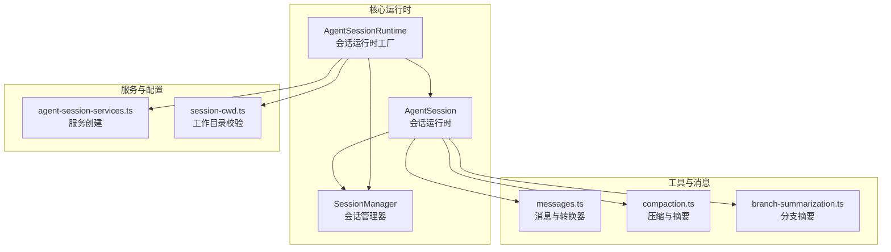
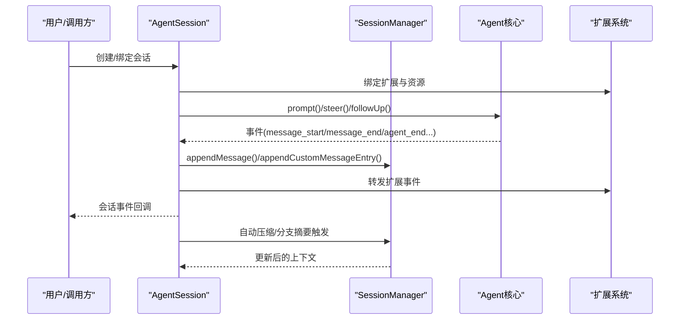
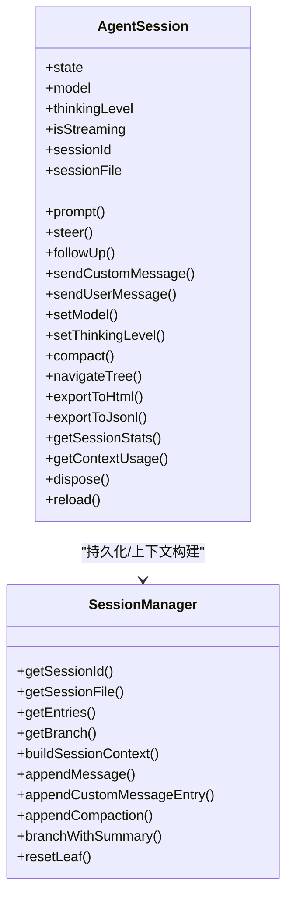
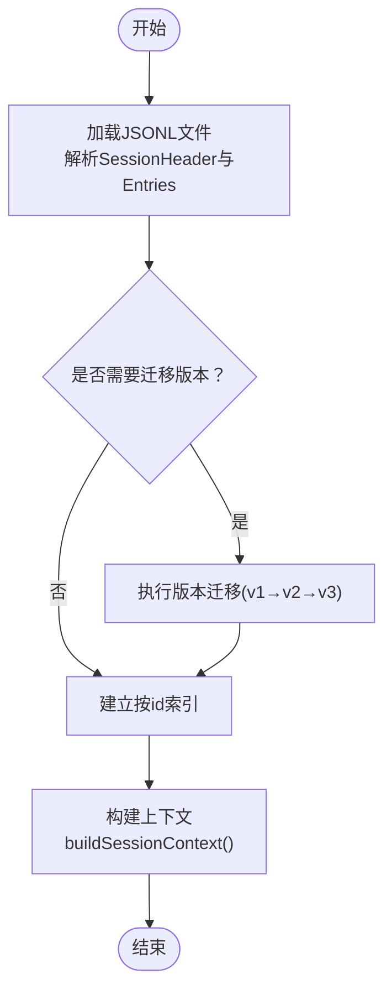
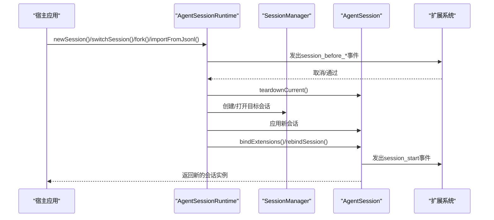
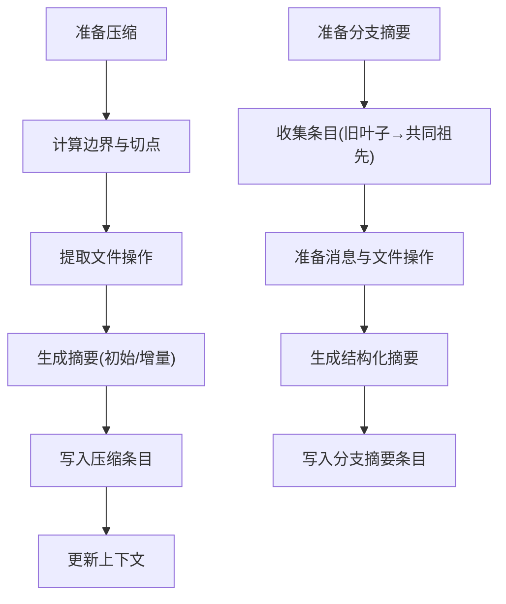
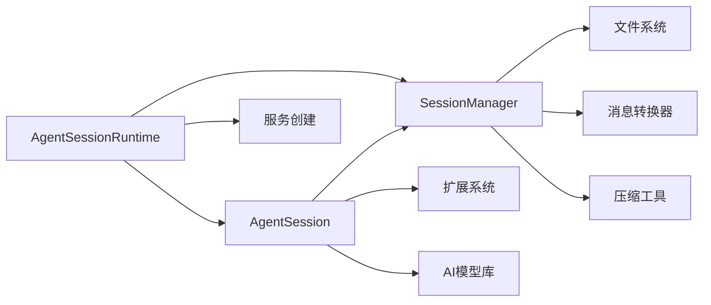

# 会话管理

<cite>
**本文档引用的文件**
- [agent-session.ts](file://packages/coding-agent/src/core/agent-session.ts)
- [session-manager.ts](file://packages/coding-agent/src/core/session-manager.ts)
- [agent-session-runtime.ts](file://packages/coding-agent/src/core/agent-session-runtime.ts)
- [agent-session-services.ts](file://packages/coding-agent/src/core/agent-session-services.ts)
- [session-cwd.ts](file://packages/coding-agent/src/core/session-cwd.ts)
- [messages.ts](file://packages/coding-agent/src/core/messages.ts)
- [compaction.ts](file://packages/coding-agent/src/core/compaction/compaction.ts)
- [branch-summarization.ts](file://packages/coding-agent/src/core/compaction/branch-summarization.ts)
- [11-sessions.ts](file://packages/coding-agent/examples/sdk/11-sessions.ts)
- [13-session-runtime.ts](file://packages/coding-agent/examples/sdk/13-session-runtime.ts)
</cite>

## 目录
1. [简介](#简介)
2. [项目结构](#项目结构)
3. [核心组件](#核心组件)
4. [架构总览](#架构总览)
5. [详细组件分析](#详细组件分析)
6. [依赖关系分析](#依赖关系分析)
7. [性能考虑](#性能考虑)
8. [故障排除指南](#故障排除指南)
9. [结论](#结论)
10. [附录](#附录)

## 简介
本文件面向Pi编码代理的会话管理系统，系统性阐述AgentSession类的设计与实现，涵盖会话生命周期管理、状态保存与恢复机制；同时深入解析SessionManager的工作原理，包括会话数据的持久化、分支管理与上下文切换。文档提供会话创建、继续、暂停与恢复的完整示例路径，并说明会话数据结构、存储格式以及性能优化策略，最后覆盖会话冲突、数据同步与并发访问等关键技术问题。

## 项目结构
Pi编码代理的会话管理由多个模块协同完成：
- AgentSession：统一的会话运行时，封装代理状态、事件订阅、自动压缩、重试、Bash执行、扩展绑定等能力。
- SessionManager：负责会话树形结构的读写、索引构建、上下文构建、分支摘要与压缩条目管理。
- AgentSessionRuntime：在需要替换活动会话（新建、恢复、分叉、导入）时，负责服务重建与会话替换。
- 会话消息与压缩工具：定义自定义消息类型、转换器、压缩与分支摘要算法。
- 示例：SDK示例展示了如何以不同模式控制会话持久化与打开。

**图表来源**
- [agent-session.ts](file://packages/coding-agent/src/core/agent-session.ts)
- [session-manager.ts](file://packages/coding-agent/src/core/session-manager.ts)
- [agent-session-runtime.ts](file://packages/coding-agent/src/core/agent-session-runtime.ts)
- [messages.ts](file://packages/coding-agent/src/core/messages.ts)
- [compaction.ts](file://packages/coding-agent/src/core/compaction/compaction.ts)
- [branch-summarization.ts](file://packages/coding-agent/src/core/compaction/branch-summarization.ts)
- [agent-session-services.ts](file://packages/coding-agent/src/core/agent-session-services.ts)
- [session-cwd.ts](file://packages/coding-agent/src/core/session-cwd.ts)

**章节来源**
- [agent-session.ts](file://packages/coding-agent/src/core/agent-session.ts)
- [session-manager.ts](file://packages/coding-agent/src/core/session-manager.ts)
- [agent-session-runtime.ts](file://packages/coding-agent/src/core/agent-session-runtime.ts)
- [messages.ts](file://packages/coding-agent/src/core/messages.ts)
- [compaction.ts](file://packages/coding-agent/src/core/compaction/compaction.ts)
- [branch-summarization.ts](file://packages/coding-agent/src/core/compaction/branch-summarization.ts)
- [agent-session-services.ts](file://packages/coding-agent/src/core/agent-session-services.ts)
- [session-cwd.ts](file://packages/coding-agent/src/core/session-cwd.ts)

## 核心组件
- AgentSession：统一的会话运行时，负责事件订阅与持久化、模型与思考层级管理、自动压缩、重试、Bash执行、扩展绑定与命令处理、树导航与分支摘要、导出与统计等。
- SessionManager：以JSONL追加树的形式管理会话，提供头信息、条目类型、树遍历、上下文构建、分支摘要与压缩条目管理、会话列表与信息构建、并发加载优化等。
- AgentSessionRuntime：在需要替换活动会话时，负责服务重建、会话替换、扩展绑定再绑定、事件传播与清理。
- 消息与压缩工具：定义自定义消息类型（如bashExecution、custom、branchSummary、compactionSummary），提供消息到LLM兼容消息的转换器，以及压缩与分支摘要的算法实现。

**章节来源**
- [agent-session.ts](file://packages/coding-agent/src/core/agent-session.ts)
- [session-manager.ts](file://packages/coding-agent/src/core/session-manager.ts)
- [agent-session-runtime.ts](file://packages/coding-agent/src/core/agent-session-runtime.ts)
- [messages.ts](file://packages/coding-agent/src/core/messages.ts)
- [compaction.ts](file://packages/coding-agent/src/core/compaction/compaction.ts)
- [branch-summarization.ts](file://packages/coding-agent/src/core/compaction/branch-summarization.ts)

## 架构总览
下图展示AgentSession与SessionManager之间的交互，以及事件流与持久化路径：

**图表来源**
- [agent-session.ts](file://packages/coding-agent/src/core/agent-session.ts)
- [session-manager.ts](file://packages/coding-agent/src/core/session-manager.ts)

## 详细组件分析

### AgentSession 类设计与实现
- 生命周期管理
  - 构造函数初始化：订阅Agent事件、安装工具钩子、构建运行时（工具注册、系统提示、扩展绑定）。
  - dispose：中止重试/压缩/分支摘要/Bash，断开Agent订阅，清理会话资源。
  - reload：重新加载设置、重置API提供者、重新加载资源与扩展，保持UI/命令上下文绑定。
- 事件与持久化
  - 内部事件处理器：在message_end时根据消息类型持久化（普通消息、自定义消息、扩展注入消息），并跟踪最近助手消息用于自动压缩检查。
  - 队列管理：支持“引导”（steer）与“后续”（followUp）消息队列，支持清空队列与查询待处理数量。
  - 扩展事件转发：将Agent事件映射为扩展事件，支持消息替换、工具调用拦截、系统提示修改等。
- 模型与思考层级
  - setModel/cycleModel：验证认证、更新模型、持久化变更、设置思考层级并保存到设置。
  - setThinkingLevel/cycleThinkingLevel：基于可用层级进行钳制与持久化。
- 自动压缩与重试
  - _checkCompaction：在溢出或阈值条件下触发自动压缩，支持“溢出恢复”与“阈值触发”两种场景。
  - _runAutoCompaction/_prepareRetry：实现可中断的压缩流程与指数退避重试。
- Bash执行与上下文注入
  - executeBash：执行命令，记录结果到会话历史，支持延迟注入以维持消息顺序。
- 树导航与分支摘要
  - navigateTree：在会话树内导航，必要时生成分支摘要并附加标签，更新Agent上下文。
- 导出与统计
  - exportToHtml/exportToJsonl：导出HTML报告与JSONL分支。
  - getSessionStats/getContextUsage：统计消息数、令牌用量、成本与上下文使用率。

**图表来源**
- [agent-session.ts](file://packages/coding-agent/src/core/agent-session.ts)
- [session-manager.ts](file://packages/coding-agent/src/core/session-manager.ts)

**章节来源**
- [agent-session.ts](file://packages/coding-agent/src/core/agent-session.ts)

### SessionManager 工作原理
- 数据结构与版本迁移
  - SessionHeader：标识会话类型、版本、ID、时间戳、工作目录、父会话。
  - SessionEntry：支持多种条目类型（消息、思考层级变更、模型变更、压缩、分支摘要、自定义、标签、会话信息）。
  - 版本迁移：从v1/v2迁移到当前版本（v3），确保向后兼容。
- 追加树与索引
  - 每个条目包含id与parentId，形成树形结构；leafId指向当前叶子节点。
  - 加载文件后建立按id的索引，支持O(1)查找。
- 上下文构建
  - buildSessionContext：从叶子回溯到根，处理压缩摘要、保留的消息、分支摘要，生成LLM可用的消息序列。
- 分支摘要与压缩
  - appendCompaction/branchWithSummary：写入压缩/分支摘要条目，更新Agent上下文。
  - getLatestCompactionEntry：定位最新压缩边界，避免过早触发压缩。
- 会话列表与信息
  - list/sort/并发加载：限制并发，避免阻塞UI；构建SessionInfo包含名称、消息数、首条消息、修改时间等。
- 文件操作与安全
  - 默认会话目录编码：将工作目录编码为安全路径，避免非法字符。
  - 会话文件存在性与损坏处理：空文件或无有效头时重建新会话并重写文件。

**图表来源**
- [session-manager.ts](file://packages/coding-agent/src/core/session-manager.ts)

**章节来源**
- [session-manager.ts](file://packages/coding-agent/src/core/session-manager.ts)

### AgentSessionRuntime 替换与上下文切换
- 新建/恢复/分叉/导入
  - newSession/switchSession/fork/importFromJsonl：在替换前发出session_before_*事件，允许扩展取消；teardown当前会话，应用新会话，完成后再绑定UI与扩展。
  - assertSessionCwdExists：当会话文件中的工作目录不存在时，抛出错误并提示用户选择当前目录或中止。
- 事件与诊断
  - 收集诊断信息（警告/错误），返回给上层决定是否中止启动。
  - 提供setRebindSession/setBeforeSessionInvalidate回调，确保UI与扩展上下文正确重建。

**图表来源**
- [agent-session-runtime.ts](file://packages/coding-agent/src/core/agent-session-runtime.ts)
- [session-cwd.ts](file://packages/coding-agent/src/core/session-cwd.ts)

**章节来源**
- [agent-session-runtime.ts](file://packages/coding-agent/src/core/agent-session-runtime.ts)
- [session-cwd.ts](file://packages/coding-agent/src/core/session-cwd.ts)

### 会话数据结构与存储格式
- 存储格式：每个会话为一个JSONL文件，首行为SessionHeader，后续每行一个SessionEntry。
- 条目类型：
  - message：普通对话消息（用户/助手/工具结果）
  - thinking_level_change/model_change：设置变更
  - compaction：压缩摘要与边界
  - branch_summary：分支摘要
  - custom/custom_message：扩展自定义数据与注入消息
  - label/session_info：标签与显示名
- 消息转换：messages.ts提供转换器，将自定义消息（如bashExecution、custom、branchSummary、compactionSummary）转换为LLM兼容消息。

**章节来源**
- [session-manager.ts](file://packages/coding-agent/src/core/session-manager.ts)
- [messages.ts](file://packages/coding-agent/src/core/messages.ts)

### 压缩与分支摘要算法
- 压缩（compaction.ts）
  - 准备阶段：计算边界、估计上下文令牌、确定切点、提取文件操作。
  - 生成摘要：支持初始与增量两种摘要，合并turn前缀摘要。
  - 结果持久化：写入压缩条目，更新Agent上下文。
- 分支摘要（branch-summarization.ts）
  - 收集：从旧叶子回溯到共同祖先，收集条目。
  - 准备：按时间倒序加入消息，累计文件操作，估算令牌预算。
  - 生成：构造提示，调用模型生成结构化摘要，附加文件清单。

**图表来源**
- [compaction.ts](file://packages/coding-agent/src/core/compaction/compaction.ts)
- [branch-summarization.ts](file://packages/coding-agent/src/core/compaction/branch-summarization.ts)

**章节来源**
- [compaction.ts](file://packages/coding-agent/src/core/compaction/compaction.ts)
- [branch-summarization.ts](file://packages/coding-agent/src/core/compaction/branch-summarization.ts)

### 会话创建、继续、暂停与恢复示例
- 在内存会话：SessionManager.inMemory()
- 新建持久化会话：SessionManager.create(cwd[, sessionDir])
- 继续最近会话：SessionManager.continueRecent(cwd[, sessionDir])
- 列出并打开指定会话：SessionManager.list(cwd[, sessionDir]) 后通过 SessionManager.open(path)
- 会话运行时示例：AgentSessionRuntime.newSession()/switchSession()/fork()/importFromJsonl()

**章节来源**
- [11-sessions.ts](file://packages/coding-agent/examples/sdk/11-sessions.ts)
- [13-session-runtime.ts](file://packages/coding-agent/examples/sdk/13-session-runtime.ts)

## 依赖关系分析
- AgentSession依赖SessionManager进行持久化与上下文构建；依赖扩展系统进行事件转发与命令处理；依赖AI模型库进行压缩与摘要生成。
- SessionManager依赖文件系统进行读写，依赖消息转换器与压缩工具。
- AgentSessionRuntime依赖服务创建模块与SessionManager，负责会话替换与扩展绑定的再绑定。

**图表来源**
- [agent-session.ts](file://packages/coding-agent/src/core/agent-session.ts)
- [session-manager.ts](file://packages/coding-agent/src/core/session-manager.ts)
- [agent-session-runtime.ts](file://packages/coding-agent/src/core/agent-session-runtime.ts)
- [messages.ts](file://packages/coding-agent/src/core/messages.ts)
- [compaction.ts](file://packages/coding-agent/src/core/compaction/compaction.ts)

**章节来源**
- [agent-session.ts](file://packages/coding-agent/src/core/agent-session.ts)
- [session-manager.ts](file://packages/coding-agent/src/core/session-manager.ts)
- [agent-session-runtime.ts](file://packages/coding-agent/src/core/agent-session-runtime.ts)

## 性能考虑
- 并发加载：SessionManager.list使用并发限制（MAX_CONCURRENT_SESSION_INFO_LOADS=10）避免大量文件IO阻塞。
- 令牌估算：压缩与分支摘要使用保守估算（字符/4），减少实际调用次数；仅在必要时生成摘要。
- 流式处理：AgentSession在流式响应期间延迟注入Bash结果，保证消息顺序与一致性。
- 缓存与索引：SessionManager对条目建立按id索引，提高上下文构建效率。
- 事件最小化：内部事件处理器仅在message_end时持久化，减少频繁写入。

[本节为通用指导，无需特定文件引用]

## 故障排除指南
- 会话工作目录缺失
  - 现象：打开会话时报错，提示会话文件中的工作目录不存在。
  - 处理：使用assertSessionCwdExists进行校验；若不存在，提示用户选择当前目录或中止。
- 认证失败
  - 现象：模型无API密钥或OAuth凭证过期。
  - 处理：AgentSession在发送请求前校验认证；提示用户登录对应提供商。
- 上下文溢出
  - 现象：助手消息标记为溢出。
  - 处理：自动压缩（溢出恢复）或手动压缩；必要时切换更大上下文窗口的模型。
- 重试失败
  - 现象：网络/限流/服务端错误导致重试。
  - 处理：指数退避重试，超过最大次数后停止；非可重试错误（配额/预算）不重试。
- 并发冲突
  - 现象：多处同时写入同一会话文件。
  - 处理：SessionManager以JSONL追加写入，避免并发写冲突；建议通过AgentSessionRuntime进行会话替换，避免直接并发操作底层文件。

**章节来源**
- [session-cwd.ts](file://packages/coding-agent/src/core/session-cwd.ts)
- [agent-session.ts](file://packages/coding-agent/src/core/agent-session.ts)
- [session-manager.ts](file://packages/coding-agent/src/core/session-manager.ts)

## 结论
Pi编码代理的会话管理系统通过AgentSession与SessionManager的协作，实现了高可靠、可扩展且易用的会话生命周期管理。AgentSession提供统一的事件驱动接口与丰富的运行时能力（压缩、重试、Bash、扩展绑定、树导航），SessionManager则以JSONL追加树形式高效持久化与构建上下文。配合AgentSessionRuntime，系统可在需要时安全地替换活动会话并保持扩展与UI上下文的一致性。通过版本迁移、并发加载与令牌估算等策略，系统在功能完整性与性能之间取得良好平衡。

[本节为总结，无需特定文件引用]

## 附录
- 会话数据结构速查
  - SessionHeader：type/version/id/timestamp/cwd/parentSession
  - SessionEntry：message/thinking_level_change/model_change/compaction/branch_summary/custom/custom_message/label/session_info
- 常用方法参考
  - AgentSession：prompt/steer/followUp/sendCustomMessage/sendUserMessage/setModel/setThinkingLevel/compact/navigateTree/exportToHtml/exportToJsonl/getSessionStats/getContextUsage/dispose/reload
  - SessionManager：getSessionId/getSessionFile/getEntries/getBranch/buildSessionContext/appendMessage/appendCustomMessageEntry/appendCompaction/branchWithSummary/resetLeaf/list/loadEntriesFromFile/findMostRecentSession

[本节为概览，无需特定文件引用]