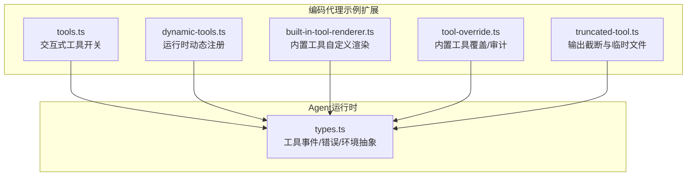
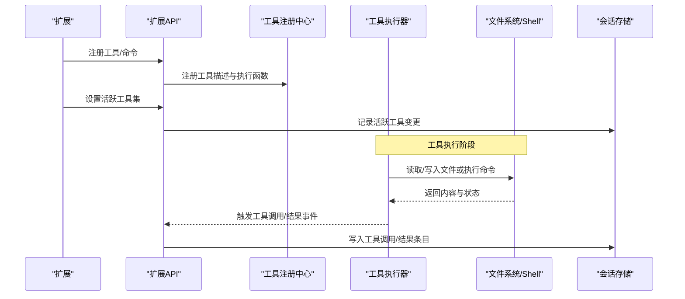
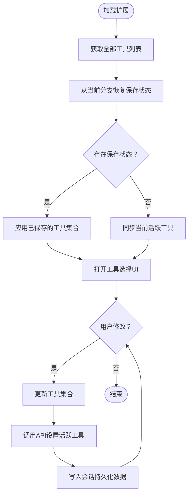
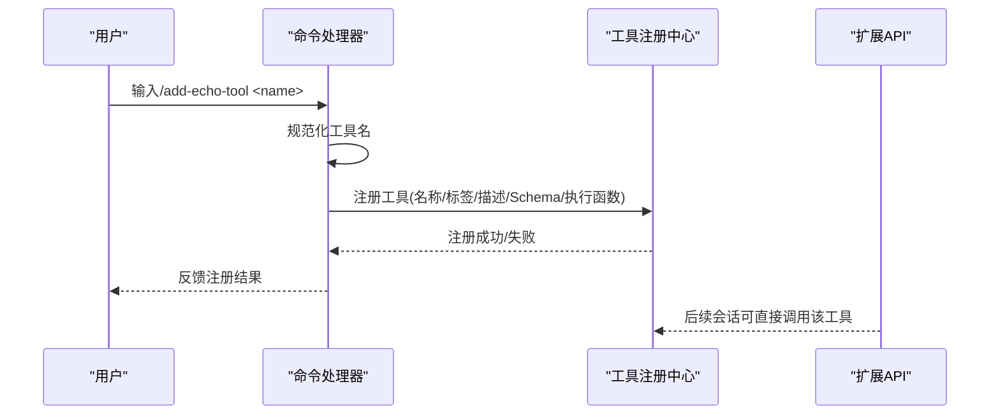
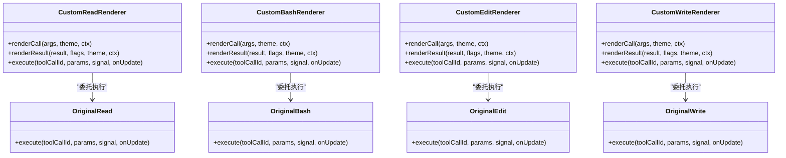
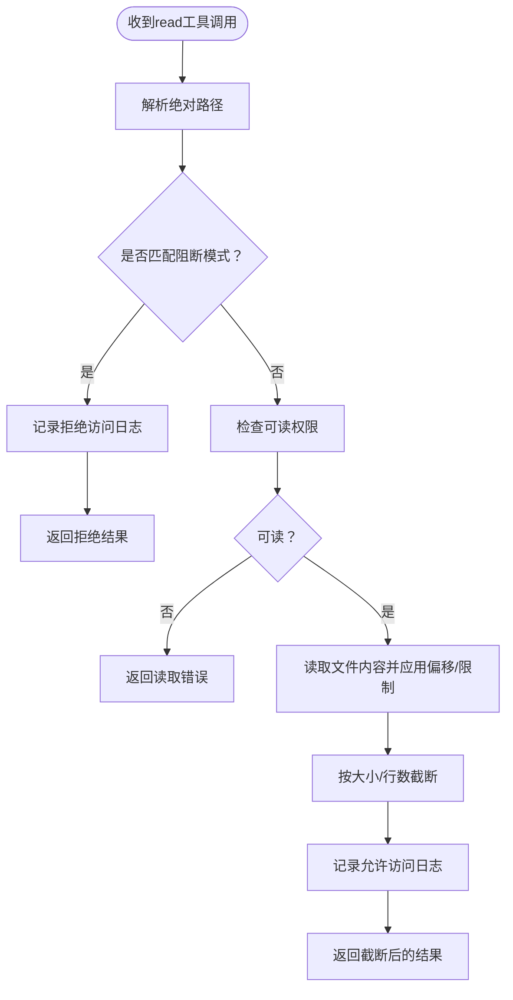
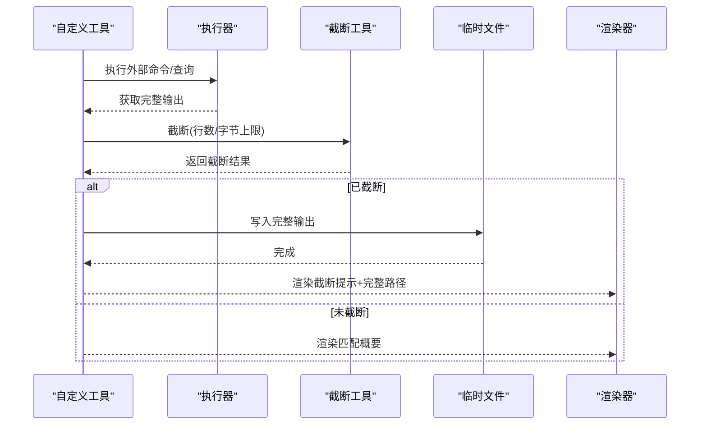
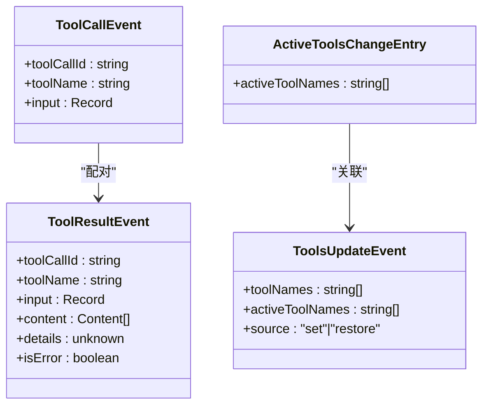
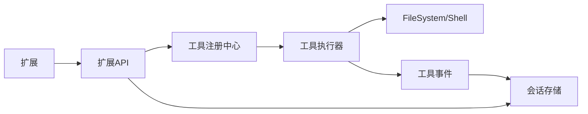

# 工具系统

<cite>
**本文引用的文件**
- [README.md](file://README.md)
- [tools.ts](file://packages/coding-agent/examples/extensions/tools.ts)
- [dynamic-tools.ts](file://packages/coding-agent/examples/extensions/dynamic-tools.ts)
- [built-in-tool-renderer.ts](file://packages/coding-agent/examples/extensions/built-in-tool-renderer.ts)
- [tool-override.ts](file://packages/coding-agent/examples/extensions/tool-override.ts)
- [truncated-tool.ts](file://packages/coding-agent/examples/extensions/truncated-tool.ts)
- [types.ts](file://packages/agent/src/harness/types.ts)
</cite>

## 目录
1. [简介](#简介)
2. [项目结构](#项目结构)
3. [核心组件](#核心组件)
4. [架构总览](#架构总览)
5. [详细组件分析](#详细组件分析)
6. [依赖关系分析](#依赖关系分析)
7. [性能考量](#性能考量)
8. [故障排查指南](#故障排查指南)
9. [结论](#结论)
10. [附录](#附录)

## 简介
本指南面向Pi编码代理的开发者，系统讲解工具系统的定义、注册与执行机制，覆盖内置工具（read、bash、edit、write等）与自定义工具的开发流程；详解工具配置选项（允许列表、禁止列表、禁用所有工具模式）的使用方式；给出工具接口规范、错误处理与性能优化建议；并通过工厂函数与扩展工具创建示例，帮助你安全、可控地扩展工具能力。

## 项目结构
Pi仓库采用多包结构，工具系统主要由以下部分组成：
- 编码代理示例扩展：提供交互式工具选择、动态注册工具、内置工具渲染覆盖、工具覆盖与审计、输出截断示例等。
- Agent运行时类型与事件：定义工具调用/结果事件、会话树与工具状态变更事件、文件系统与执行环境抽象等。

**图表来源**
- [tools.ts:1-142](file://packages/coding-agent/examples/extensions/tools.ts#L1-L142)
- [dynamic-tools.ts:1-75](file://packages/coding-agent/examples/extensions/dynamic-tools.ts#L1-L75)
- [built-in-tool-renderer.ts:1-250](file://packages/coding-agent/examples/extensions/built-in-tool-renderer.ts#L1-L250)
- [tool-override.ts:1-145](file://packages/coding-agent/examples/extensions/tool-override.ts#L1-L145)
- [truncated-tool.ts:1-196](file://packages/coding-agent/examples/extensions/truncated-tool.ts#L1-L196)
- [types.ts:558-724](file://packages/agent/src/harness/types.ts#L558-L724)

**章节来源**
- [README.md:19-57](file://README.md#L19-L57)
- [tools.ts:1-142](file://packages/coding-agent/examples/extensions/tools.ts#L1-L142)
- [dynamic-tools.ts:1-75](file://packages/coding-agent/examples/extensions/dynamic-tools.ts#L1-L75)
- [built-in-tool-renderer.ts:1-250](file://packages/coding-agent/examples/extensions/built-in-tool-renderer.ts#L1-L250)
- [tool-override.ts:1-145](file://packages/coding-agent/examples/extensions/tool-override.ts#L1-L145)
- [truncated-tool.ts:1-196](file://packages/coding-agent/examples/extensions/truncated-tool.ts#L1-L196)
- [types.ts:558-724](file://packages/agent/src/harness/types.ts#L558-L724)

## 核心组件
- 工具注册与生命周期
  - 工具通过扩展API进行注册，支持在会话启动后动态注册新工具。
  - 工具可提供参数Schema（TypeBox）、执行函数、可选的渲染函数（renderCall/renderResult）以及外壳渲染策略（renderShell）。
- 工具事件与会话状态
  - 工具调用与结果事件在运行时被记录到会话树中，便于追踪与复盘。
  - 工具激活集合（active tools）随会话分支持久化，支持跨分支导航恢复。
- 文件系统与执行环境
  - 运行时提供统一的FileSystem与Shell抽象，确保工具在不同环境下的一致行为。
- 错误与异常
  - 统一的Result包装与错误类型（FileError、ExecutionError、AgentHarnessError），避免抛出未知异常。

**章节来源**
- [tools.ts:21-141](file://packages/coding-agent/examples/extensions/tools.ts#L21-L141)
- [dynamic-tools.ts:24-74](file://packages/coding-agent/examples/extensions/dynamic-tools.ts#L24-L74)
- [built-in-tool-renderer.ts:32-249](file://packages/coding-agent/examples/extensions/built-in-tool-renderer.ts#L32-L249)
- [tool-override.ts:68-144](file://packages/coding-agent/examples/extensions/tool-override.ts#L68-L144)
- [truncated-tool.ts:48-195](file://packages/coding-agent/examples/extensions/truncated-tool.ts#L48-L195)
- [types.ts:558-724](file://packages/agent/src/harness/types.ts#L558-L724)

## 架构总览
工具系统围绕“扩展API + 工具注册 + 事件驱动 + 会话持久化”的架构展开。扩展通过API注册工具与命令，工具在执行时产生事件，这些事件被写入会话树，从而实现工具状态的可追溯与可恢复。

**图表来源**
- [tools.ts:34-64](file://packages/coding-agent/examples/extensions/tools.ts#L34-L64)
- [dynamic-tools.ts:51-54](file://packages/coding-agent/examples/extensions/dynamic-tools.ts#L51-L54)
- [types.ts:558-623](file://packages/agent/src/harness/types.ts#L558-L623)

## 详细组件分析

### 交互式工具选择组件（tools.ts）
- 功能要点
  - 提供“/tools”命令，打开UI以启用/禁用工具。
  - 将当前工具选择持久化到会话分支，并在分支切换时恢复。
  - 实时应用工具激活集合，保证与UI一致。
- 关键流程
  - 初始化：读取全部可用工具，从当前分支恢复上次保存的状态。
  - 交互：根据用户选择更新Set并调用API设置活跃工具。
  - 持久化：每次变更写入自定义会话条目，确保跨会话/分支恢复。

**图表来源**
- [tools.ts:38-64](file://packages/coding-agent/examples/extensions/tools.ts#L38-L64)
- [tools.ts:67-130](file://packages/coding-agent/examples/extensions/tools.ts#L67-L130)

**章节来源**
- [tools.ts:16-141](file://packages/coding-agent/examples/extensions/tools.ts#L16-L141)

### 动态工具注册组件（dynamic-tools.ts）
- 功能要点
  - 在会话启动时注册一个工具（如echo_session）。
  - 提供命令“/add-echo-tool <name>”在运行时动态注册新的echo工具。
  - 使用TypeBox定义参数Schema，确保输入校验。
- 安全与健壮性
  - 工具名规范化与去重，避免重复注册。
  - 执行函数返回标准结果结构，包含内容与细节信息。

**图表来源**
- [dynamic-tools.ts:17-22](file://packages/coding-agent/examples/extensions/dynamic-tools.ts#L17-L22)
- [dynamic-tools.ts:27-49](file://packages/coding-agent/examples/extensions/dynamic-tools.ts#L27-L49)
- [dynamic-tools.ts:56-73](file://packages/coding-agent/examples/extensions/dynamic-tools.ts#L56-L73)

**章节来源**
- [dynamic-tools.ts:1-75](file://packages/coding-agent/examples/extensions/dynamic-tools.ts#L1-L75)

### 内置工具渲染覆盖（built-in-tool-renderer.ts）
- 功能要点
  - 通过同名覆盖的方式替换内置工具（read、bash、edit、write）的渲染逻辑。
  - 保持原有执行逻辑不变，仅改变UI呈现（紧凑显示、高亮差异、显示统计等）。
  - 支持renderShell自渲染外壳，控制外层展示风格。
- 渲染策略
  - renderCall：展示调用参数摘要（路径、行数、超时等）。
  - renderResult：展示结果概要（行数、截断提示、展开后详情）。
  - 展开/收起：通过expanded标志控制是否展开完整输出。

**图表来源**
- [built-in-tool-renderer.ts:36-92](file://packages/coding-agent/examples/extensions/built-in-tool-renderer.ts#L36-L92)
- [built-in-tool-renderer.ts:95-151](file://packages/coding-agent/examples/extensions/built-in-tool-renderer.ts#L95-L151)
- [built-in-tool-renderer.ts:154-216](file://packages/coding-agent/examples/extensions/built-in-tool-renderer.ts#L154-L216)
- [built-in-tool-renderer.ts:219-248](file://packages/coding-agent/examples/extensions/built-in-tool-renderer.ts#L219-L248)

**章节来源**
- [built-in-tool-renderer.ts:1-250](file://packages/coding-agent/examples/extensions/built-in-tool-renderer.ts#L1-L250)

### 工具覆盖与审计（tool-override.ts）
- 功能要点
  - 以同名覆盖内置read工具，实现访问日志与敏感路径阻断。
  - 对允许访问的文件执行读取并应用截断策略，对拒绝访问的请求返回明确错误。
  - 提供“/read-log”命令查看最近访问日志。
- 安全与合规
  - 阻断模式匹配敏感路径（.env、密钥文件、SSH/AWS/GPG目录等）。
  - 日志记录访问时间、路径与结果，便于审计与溯源。

**图表来源**
- [tool-override.ts:76-125](file://packages/coding-agent/examples/extensions/tool-override.ts#L76-L125)
- [tool-override.ts:132-143](file://packages/coding-agent/examples/extensions/tool-override.ts#L132-L143)

**章节来源**
- [tool-override.ts:1-145](file://packages/coding-agent/examples/extensions/tool-override.ts#L1-L145)

### 输出截断与临时文件（truncated-tool.ts）
- 功能要点
  - 自定义工具必须对输出进行截断，避免LLM上下文溢出。
  - 使用内置截断工具（truncateHead）保留前N行/字节，必要时将完整输出写入临时文件。
  - 在结果中提示截断情况，并提供完整输出路径供LLM进一步检索。
- 渲染策略
  - renderCall：展示搜索模式、路径与glob。
  - renderResult：展示匹配数量、截断提示与展开视图中的前若干行。

**图表来源**
- [truncated-tool.ts:56-135](file://packages/coding-agent/examples/extensions/truncated-tool.ts#L56-L135)
- [truncated-tool.ts:137-194](file://packages/coding-agent/examples/extensions/truncated-tool.ts#L137-L194)

**章节来源**
- [truncated-tool.ts:1-196](file://packages/coding-agent/examples/extensions/truncated-tool.ts#L1-L196)

### 工具事件与会话持久化（types.ts）
- 工具事件
  - tool_call：记录工具调用ID、名称与输入参数。
  - tool_result：记录工具结果内容、细节与错误标记。
- 会话与工具状态
  - active_tools_change：记录活跃工具集合变更。
  - tools_update：记录工具集合与活跃集合的变更来源（设置/恢复）。
- 错误与异常
  - FileError、ExecutionError、AgentHarnessError等稳定错误码，便于上层处理与诊断。

**图表来源**
- [types.ts:558-623](file://packages/agent/src/harness/types.ts#L558-L623)
- [types.ts:357-420](file://packages/agent/src/harness/types.ts#L357-L420)

**章节来源**
- [types.ts:558-724](file://packages/agent/src/harness/types.ts#L558-L724)

## 依赖关系分析
- 扩展与API
  - 所有示例扩展均依赖扩展API提供的注册工具、设置活跃工具、事件监听等能力。
- 工具与运行时
  - 工具执行依赖FileSystem与Shell抽象，确保跨平台一致性。
- 事件与会话
  - 工具事件写入会话树，活跃工具变更也作为会话条目持久化，形成完整的可追溯链路。

**图表来源**
- [tools.ts:34-64](file://packages/coding-agent/examples/extensions/tools.ts#L34-L64)
- [dynamic-tools.ts:51-54](file://packages/coding-agent/examples/extensions/dynamic-tools.ts#L51-L54)
- [types.ts:558-623](file://packages/agent/src/harness/types.ts#L558-L623)

**章节来源**
- [tools.ts:1-142](file://packages/coding-agent/examples/extensions/tools.ts#L1-L142)
- [dynamic-tools.ts:1-75](file://packages/coding-agent/examples/extensions/dynamic-tools.ts#L1-L75)
- [types.ts:558-724](file://packages/agent/src/harness/types.ts#L558-L724)

## 性能考量
- 输出截断
  - 自定义工具必须严格遵守默认的行数与字节数上限，优先使用“截断头部”策略保留最相关的结果。
- I/O与缓冲
  - 大量输出场景下，优先将完整结果写入临时文件并在结果中提供路径，减少LLM上下文压力。
- 并发与队列
  - 文件写入应使用串行化队列，避免并发写冲突与竞态条件。
- 超时与取消
  - Shell执行应设置合理超时与AbortSignal，防止长时间阻塞影响用户体验。

[本节为通用指导，无需特定文件来源]

## 故障排查指南
- 工具未生效
  - 检查是否正确设置活跃工具集合，确认会话中存在active_tools_change条目。
  - 若使用覆盖/渲染覆盖，请确认工具名一致且执行函数委托正确。
- 输出过大导致上下文溢出
  - 确认已应用截断策略，并在结果中提供完整输出路径。
- 权限与路径问题
  - 使用FileSystem的错误码定位具体问题（如权限不足、路径不存在）。
- 审计与日志
  - 通过覆盖工具的日志文件查看访问记录，定位拒绝原因。

**章节来源**
- [tool-override.ts:47-60](file://packages/coding-agent/examples/extensions/tool-override.ts#L47-L60)
- [truncated-tool.ts:110-129](file://packages/coding-agent/examples/extensions/truncated-tool.ts#L110-L129)
- [types.ts:110-155](file://packages/agent/src/harness/types.ts#L110-L155)

## 结论
Pi工具系统通过扩展API实现了灵活的工具注册与执行机制，结合事件驱动与会话持久化，提供了强大的可追溯性与可恢复性。内置工具的渲染覆盖与审计功能进一步增强了安全性与可观测性。遵循输出截断、权限控制与错误处理最佳实践，可构建既高效又安全的工具生态。

[本节为总结，无需特定文件来源]

## 附录
- 工具配置选项
  - 允许列表：仅启用指定工具集合。
  - 禁止列表：排除某些工具，其余默认启用。
  - 禁用所有工具模式：关闭工具调用，仅允许显式技能与提示模板。
- 工具接口规范
  - 必填：name、description、parameters（TypeBox Schema）、execute函数。
  - 可选：renderCall、renderResult、renderShell、promptSnippet、promptGuidelines。
- 最佳实践
  - 参数Schema严格定义，执行函数返回标准化结果。
  - 输出截断与临时文件配合使用，避免上下文溢出。
  - 使用覆盖/渲染覆盖增强安全与可观测性。
  - 使用AbortSignal与超时控制，提升稳定性。

[本节为概念性内容，无需特定文件来源]