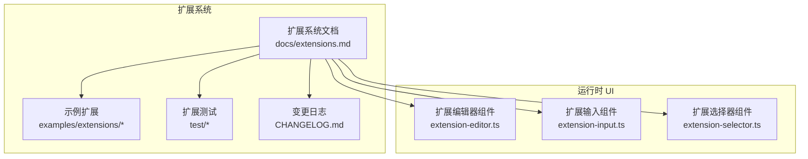
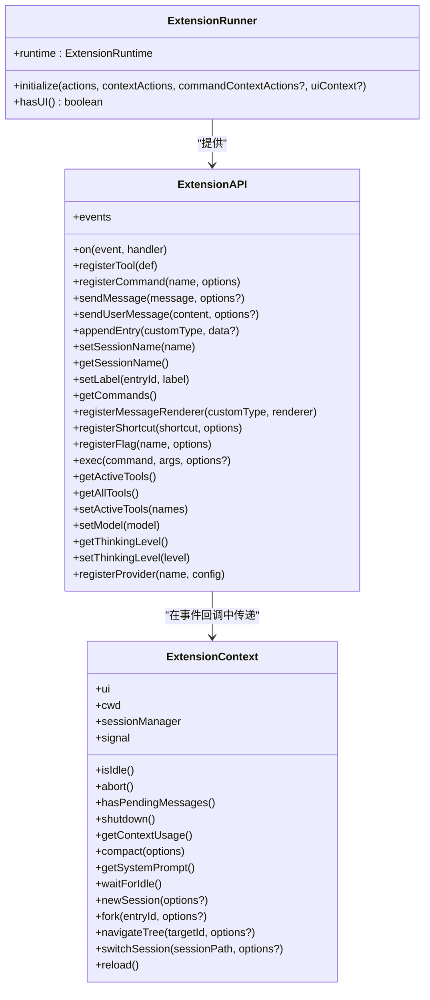
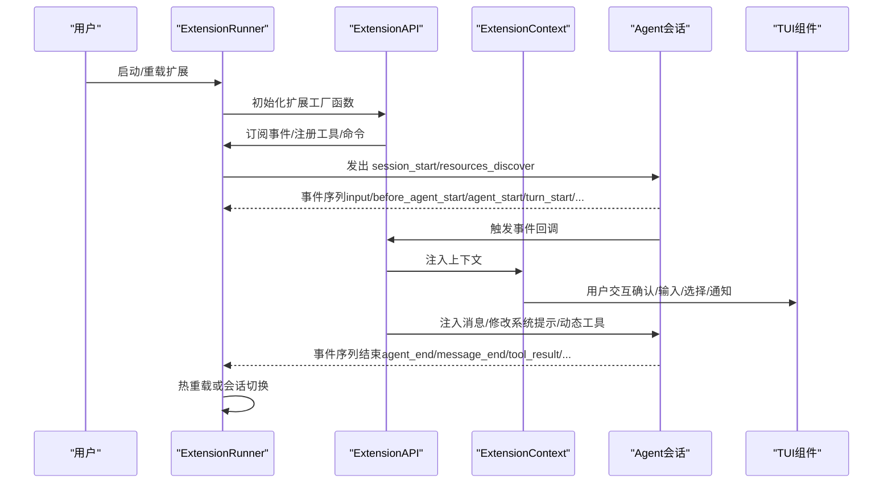
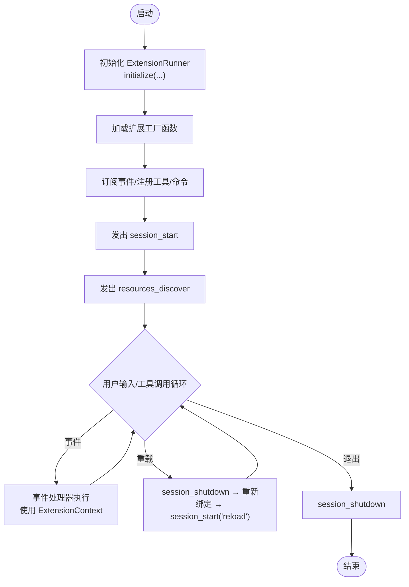
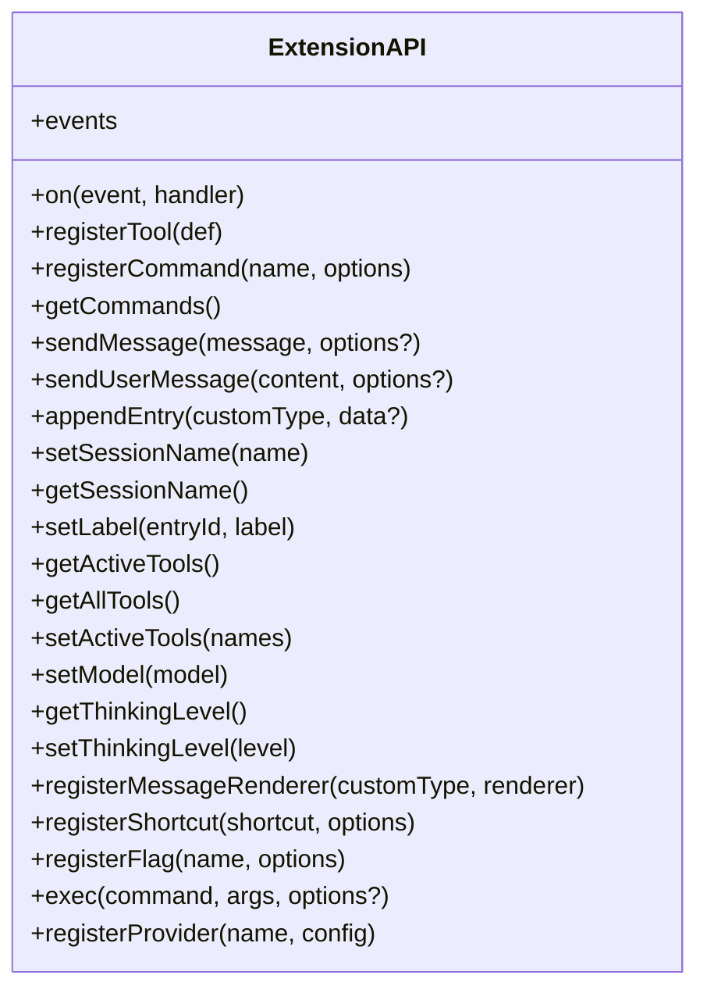
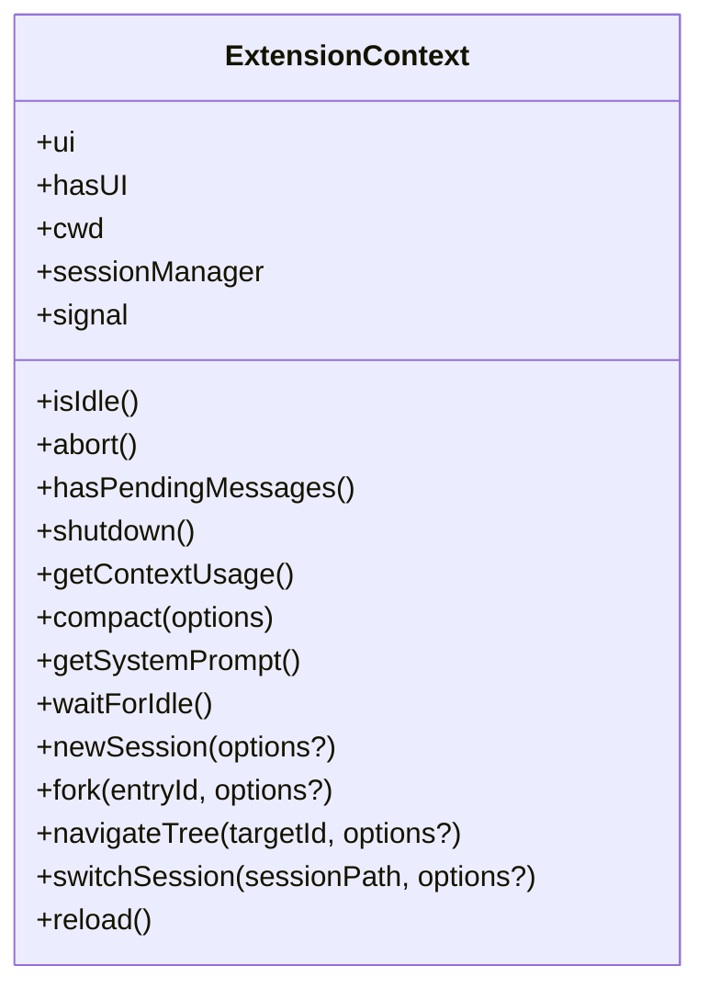
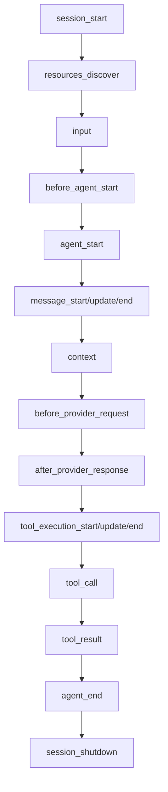
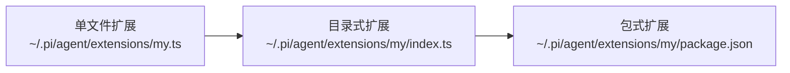
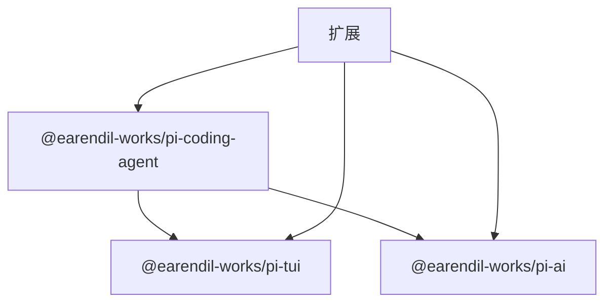

# 扩展集成

<cite>
**本文引用的文件**
- [README.md](file://README.md)
- [扩展系统文档](file://packages/coding-agent/docs/extensions.md)
- [命令示例](file://packages/coding-agent/examples/extensions/commands.ts)
- [自定义头部示例](file://packages/coding-agent/examples/extensions/custom-header.ts)
- [自定义页脚示例](file://packages/coding-agent/examples/extensions/custom-footer.ts)
- [扩展编辑器组件](file://packages/coding-agent/src/modes/interactive/components/extension-editor.ts)
- [扩展输入组件](file://packages/coding-agent/src/modes/interactive/components/extension-input.ts)
- [扩展选择器组件](file://packages/coding-agent/src/modes/interactive/components/extension-selector.ts)
- [扩展发现测试](file://packages/coding-agent/test/extensions-discovery.test.ts)
- [扩展输入事件测试](file://packages/coding-agent/test/extensions-input-event.test.ts)
- [扩展运行器测试](file://packages/coding-agent/test/extensions-runner.test.ts)
- [变更日志（扩展相关）](file://packages/coding-agent/CHANGELOG.md)
</cite>

## 目录
1. [简介](#简介)
2. [项目结构](#项目结构)
3. [核心组件](#核心组件)
4. [架构总览](#架构总览)
5. [详细组件分析](#详细组件分析)
6. [依赖关系分析](#依赖关系分析)
7. [性能考量](#性能考量)
8. [故障排查指南](#故障排查指南)
9. [结论](#结论)
10. [附录](#附录)

## 简介
本指南面向希望在 Pi 编码代理中构建扩展的开发者，系统性介绍扩展架构的设计原理、生命周期管理、事件处理与插件机制，并提供从零到一的开发实践路径。重点覆盖以下主题：
- ExtensionRunner：扩展运行时的启动、初始化与热重载
- ExtensionAPI：扩展可调用的能力集合（事件订阅、工具注册、命令注册、消息注入、模型与思维层级控制、事件总线等）
- ExtensionContext：扩展在事件回调中获得的上下文能力（UI 交互、会话状态、信号、会话替换操作等）

通过本文档，您将掌握如何编写自定义工具扩展、UI 组件扩展与功能增强扩展，理解扩展的配置、加载与运行时管理，并学会扩展间通信、资源共享与冲突化解策略。

## 项目结构
Pi 的扩展系统位于 coding-agent 包内，围绕“事件驱动 + 工具注册 + UI 渲染”的模式组织。关键位置如下：
- 扩展文档与示例：packages/coding-agent/docs/extensions.md 与 examples/extensions/
- 运行时 UI 组件：src/modes/interactive/components/ 下的扩展编辑器、输入与选择器组件
- 测试用例：test/ 下的扩展发现、输入事件与运行器测试
- 变更日志：CHANGELOG.md 中记录了 ExtensionRunner、ExtensionAPI、ExtensionContext 的演进

**图表来源**
- [扩展系统文档](file://packages/coding-agent/docs/extensions.md)
- [扩展编辑器组件](file://packages/coding-agent/src/modes/interactive/components/extension-editor.ts)
- [扩展输入组件](file://packages/coding-agent/src/modes/interactive/components/extension-input.ts)
- [扩展选择器组件](file://packages/coding-agent/src/modes/interactive/components/extension-selector.ts)
- [扩展发现测试](file://packages/coding-agent/test/extensions-discovery.test.ts)
- [扩展输入事件测试](file://packages/coding-agent/test/extensions-input-event.test.ts)
- [扩展运行器测试](file://packages/coding-agent/test/extensions-runner.test.ts)
- [变更日志（扩展相关）](file://packages/coding-agent/CHANGELOG.md)

**章节来源**
- [README.md](file://README.md)
- [扩展系统文档](file://packages/coding-agent/docs/extensions.md)

## 核心组件
本节聚焦扩展系统三要素：ExtensionRunner、ExtensionAPI、ExtensionContext 的职责与协作方式。

- ExtensionRunner
  - 负责扩展的发现、加载、初始化与热重载
  - 提供运行时参数（如 ExtensionRuntime），并以明确的初始化签名与 UI 检测接口
  - 支持按会话切换与 fork/clone 场景的扩展实例重建
- ExtensionAPI
  - 扩展对外暴露的编程接口，支持：
    - 事件订阅（pi.on）
    - 自定义工具注册（pi.registerTool）
    - 命令注册与自动补全（pi.registerCommand）
    - 消息注入与用户消息发送（pi.sendMessage / pi.sendUserMessage）
    - 会话持久化（pi.appendEntry）、标签设置（pi.setLabel）
    - 动态工具管理（pi.getActiveTools / pi.getAllTools / pi.setActiveTools）
    - 模型与思维层级控制（pi.setModel / pi.getThinkingLevel / pi.setThinkingLevel）
    - 事件总线（pi.events）
    - 注册动态模型提供方（pi.registerProvider）
    - 获取可用命令列表（pi.getCommands）
- ExtensionContext
  - 在事件回调中注入的上下文对象，提供：
    - UI 能力（ctx.ui）、工作目录（ctx.cwd）、会话管理器（ctx.sessionManager）
    - 信号（ctx.signal，用于取消与超时）
    - 控制流辅助（ctx.isIdle / ctx.abort / ctx.hasPendingMessages）
    - 关闭请求（ctx.shutdown）
    - 上下文用量查询（ctx.getContextUsage）
    - 触发压缩（ctx.compact）
    - 获取系统提示词（ctx.getSystemPrompt）
  - 对于命令场景，还提供会话替换能力（ctx.newSession / ctx.fork / ctx.switchSession / ctx.navigateTree / ctx.waitForIdle / ctx.reload）

**图表来源**
- [扩展系统文档](file://packages/coding-agent/docs/extensions.md)
- [变更日志（扩展相关）](file://packages/coding-agent/CHANGELOG.md)

**章节来源**
- [扩展系统文档](file://packages/coding-agent/docs/extensions.md)
- [变更日志（扩展相关）](file://packages/coding-agent/CHANGELOG.md)

## 架构总览
扩展系统采用“事件驱动 + 生命周期钩子 + 动态工具注册”的架构。整体流程如下：

**图表来源**
- [扩展系统文档](file://packages/coding-agent/docs/extensions.md)

**章节来源**
- [扩展系统文档](file://packages/coding-agent/docs/extensions.md)

## 详细组件分析

### ExtensionRunner：扩展运行时与生命周期
- 初始化阶段
  - 接收运行时参数（runtime: ExtensionRuntime）
  - 初始化签名从选项对象改为位置参数：initialize(actions, contextActions, commandContextActions?, uiContext?)
  - UI 检测接口 hasUI() 替代旧版 getHasUI()
- 会话与热重载
  - 支持 session_before_switch/session_shutdown/session_start 的完整生命周期
  - 支持 /reload 的热重载流程：发出 session_shutdown → 重新绑定扩展 → 发出 session_start(reason: "reload") 与 resources_discover(reason: "reload")
- 并发与顺序
  - 扩展加载顺序影响事件链与工具可见性
  - 并行工具执行模式下，工具调用的预检与完成顺序有特定保证

**图表来源**
- [扩展系统文档](file://packages/coding-agent/docs/extensions.md)
- [变更日志（扩展相关）](file://packages/coding-agent/CHANGELOG.md)

**章节来源**
- [扩展系统文档](file://packages/coding-agent/docs/extensions.md)
- [变更日志（扩展相关）](file://packages/coding-agent/CHANGELOG.md)

### ExtensionAPI：扩展编程接口
- 事件订阅与工具注册
  - pi.on(event, handler)：订阅各类生命周期事件
  - pi.registerTool(def)：注册自定义工具，支持动态启用/禁用与渲染定制
- 命令与消息
  - pi.registerCommand(name, options)：注册命令，支持自动补全
  - pi.getCommands()：获取当前可用命令列表（扩展/模板/技能）
  - pi.sendMessage / pi.sendUserMessage：注入消息与触发回合
- 会话与标签
  - pi.appendEntry / pi.setLabel：持久化扩展状态与标记
  - pi.setSessionName / pi.getSessionName：设置/获取会话名称
- 动态工具管理
  - pi.getActiveTools / pi.getAllTools / pi.setActiveTools：运行时切换工具集
- 模型与思维层级
  - pi.setModel / pi.getThinkingLevel / pi.setThinkingLevel：动态调整模型与思维层级
- 事件总线与提供方
  - pi.events：扩展间通信通道
  - pi.registerProvider：动态注册/覆盖模型提供方
- 其他
  - pi.registerMessageRenderer：自定义消息渲染
  - pi.registerShortcut / pi.registerFlag：快捷键与 CLI 标志
  - pi.exec：执行 shell 命令

**图表来源**
- [扩展系统文档](file://packages/coding-agent/docs/extensions.md)

**章节来源**
- [扩展系统文档](file://packages/coding-agent/docs/extensions.md)

### ExtensionContext：事件回调上下文
- UI 能力
  - ctx.ui：通知、确认、输入、编辑器、选择器、状态栏、小部件等
  - ctx.hasUI：判断是否处于交互模式
- 会话与状态
  - ctx.sessionManager：只读访问会话状态（分支、叶子、条目）
  - ctx.cwd：当前工作目录
- 控制与取消
  - ctx.signal：当前代理中断信号，用于 fetch/fork/exec 等可取消操作
  - ctx.isIdle / ctx.abort / ctx.hasPendingMessages：控制流辅助
  - ctx.shutdown：请求优雅关闭
- 会话替换（仅命令上下文）
  - ctx.waitForIdle：等待代理空闲
  - ctx.newSession / ctx.fork / ctx.switchSession / ctx.navigateTree：会话替换与导航
  - ctx.reload：触发热重载
- 其他
  - ctx.getContextUsage：当前上下文用量估算
  - ctx.compact：触发压缩
  - ctx.getSystemPrompt：获取系统提示词

**图表来源**
- [扩展系统文档](file://packages/coding-agent/docs/extensions.md)

**章节来源**
- [扩展系统文档](file://packages/coding-agent/docs/extensions.md)

### 事件处理与生命周期
扩展通过事件钩子参与 Agent 的完整生命周期，典型事件链如下：
- session_start / session_shutdown：会话开始/结束
- resources_discover：资源发现（技能/提示/主题路径）
- input：用户输入拦截与转换
- before_agent_start / agent_start / agent_end：回合前/开始/结束
- message_start / message_update / message_end：消息生命周期
- context / before_provider_request / after_provider_response：上下文与模型请求响应
- tool_execution_start / tool_execution_update / tool_execution_end：工具执行生命周期
- tool_call / tool_result：工具调用拦截与结果修改
- model_select / thinking_level_select：模型与思维层级变化
- session_before_compact / session_compact / session_before_tree / session_tree：会话树与压缩

**图表来源**
- [扩展系统文档](file://packages/coding-agent/docs/extensions.md)

**章节来源**
- [扩展系统文档](file://packages/coding-agent/docs/extensions.md)

### 插件机制与扩展样式
- 单文件扩展：适合小型功能，直接放置于全局或项目本地扩展目录
- 目录式扩展：入口 index.ts，配合多模块组织
- 包式扩展：包含 package.json，声明依赖并通过 node_modules 解析

**图表来源**
- [扩展系统文档](file://packages/coding-agent/docs/extensions.md)

**章节来源**
- [扩展系统文档](file://packages/coding-agent/docs/extensions.md)

### 扩展开发示例

#### 自定义工具扩展
- 目标：注册一个可被 LLM 调用的工具，支持参数校验、进度更新与自定义渲染
- 关键点：
  - 使用 pi.registerTool 定义工具（名称、描述、参数 Schema、execute、renderCall/renderResult）
  - 使用 pi.setActiveTools 动态启用/禁用工具
  - 使用 ctx.signal 处理可取消操作
- 示例参考：
  - [扩展系统文档 - 自定义工具](file://packages/coding-agent/docs/extensions.md)
  - [命令示例](file://packages/coding-agent/examples/extensions/commands.ts)

**章节来源**
- [扩展系统文档](file://packages/coding-agent/docs/extensions.md)
- [命令示例](file://packages/coding-agent/examples/extensions/commands.ts)

#### UI 组件扩展
- 目标：替换头部/页脚，或在编辑器中提供交互式输入
- 关键点：
  - 使用 ctx.ui.setHeader/setFooter 设置自定义 UI 组件
  - 使用 ctx.ui.select/confirm/input/editor 进行用户交互
  - 使用扩展编辑器/输入/选择器组件作为 UI 基础
- 示例参考：
  - [自定义头部示例](file://packages/coding-agent/examples/extensions/custom-header.ts)
  - [自定义页脚示例](file://packages/coding-agent/examples/extensions/custom-footer.ts)
  - [扩展编辑器组件](file://packages/coding-agent/src/modes/interactive/components/extension-editor.ts)
  - [扩展输入组件](file://packages/coding-agent/src/modes/interactive/components/extension-input.ts)
  - [扩展选择器组件](file://packages/coding-agent/src/modes/interactive/components/extension-selector.ts)

**章节来源**
- [自定义头部示例](file://packages/coding-agent/examples/extensions/custom-header.ts)
- [自定义页脚示例](file://packages/coding-agent/examples/extensions/custom-footer.ts)
- [扩展编辑器组件](file://packages/coding-agent/src/modes/interactive/components/extension-editor.ts)
- [扩展输入组件](file://packages/coding-agent/src/modes/interactive/components/extension-input.ts)
- [扩展选择器组件](file://packages/coding-agent/src/modes/interactive/components/extension-selector.ts)

#### 功能增强扩展
- 目标：在回合前后注入消息、修改系统提示、拦截工具调用、进行外部集成
- 关键点：
  - 使用 before_agent_start 注入消息或修改系统提示
  - 使用 tool_call 拦截工具调用并可阻断
  - 使用 tool_result 修改结果
  - 使用 pi.registerProvider 注册动态模型提供方
- 示例参考：
  - [扩展系统文档 - 事件与工具](file://packages/coding-agent/docs/extensions.md)

**章节来源**
- [扩展系统文档](file://packages/coding-agent/docs/extensions.md)

### 扩展配置、加载与运行时管理
- 扩展位置
  - 全局：~/.pi/agent/extensions/*.ts 或子目录 index.ts
  - 项目本地：.pi/extensions/*.ts 或子目录 index.ts
  - settings.json：packages 与 extensions 路径数组
- 加载机制
  - 通过 jiti 直接加载 TypeScript，无需编译
  - 异步工厂：可在工厂中进行一次性初始化（如远程配置拉取）
- 运行时管理
  - /reload：热重载（发出 session_shutdown → 重新绑定 → session_start('reload')
  - 会话替换：/new、/resume、/fork、/clone 触发 session_before_switch/session_shutdown → 新实例 → session_start
  - 命令入口：通过命令触发 reload，再由工具队列 followUp 形式触发

**章节来源**
- [扩展系统文档](file://packages/coding-agent/docs/extensions.md)

### 扩展间通信、资源共享与冲突解决
- 事件总线
  - 使用 pi.events.on/emit 在扩展间传递数据与状态
- 共享资源
  - 通过 ctx.sessionManager 共享会话状态
  - 通过 ctx.signal 协调可取消操作
- 冲突解决
  - 命令同名冲突：多个扩展注册同名命令时，系统保留并分配后缀（如 /review:1、/review:2）
  - 工具/命令优先级：按扩展加载顺序链式处理；工具调用拦截遵循“先到先得”原则
  - 会话替换：withSession 回调在新实例中执行，避免使用旧上下文对象

**章节来源**
- [扩展系统文档](file://packages/coding-agent/docs/extensions.md)

## 依赖关系分析
扩展系统与 Agent、TUI、AI 等包存在紧密耦合：
- @earendil-works/pi-coding-agent：扩展类型与 API
- @earendil-works/pi-tui：TUI 组件与主题
- @earendil-works/pi-ai：AI 工具与枚举类型

**图表来源**
- [扩展系统文档](file://packages/coding-agent/docs/extensions.md)

**章节来源**
- [扩展系统文档](file://packages/coding-agent/docs/extensions.md)

## 性能考量
- 工具并发执行：并行模式下工具预检顺序与完成顺序有特定保证，避免不必要的串行等待
- 事件链长度：尽量减少长链式中间件，避免在 message_update/tool_execution_update 中做重型计算
- 可取消操作：使用 ctx.signal 将外部调用纳入取消链路，避免资源泄漏
- UI 渲染：自定义 UI 组件应最小化无效重绘，利用 invalidate 与 onBranchChange 等回调

[本节为通用指导，不直接分析具体文件]

## 故障排查指南
- 扩展未生效
  - 检查扩展位置与 settings.json 配置
  - 确认扩展导出默认工厂函数且无语法错误
- 事件未触发
  - 确认事件名称正确，且在正确的生命周期阶段注册
  - 检查是否有更高优先级的拦截（如 input 事件的 handled/transform）
- 工具未出现
  - 确认已调用 pi.setActiveTools 启用工具
  - 检查工具 Schema 与参数类型
- UI 不显示
  - 检查 ctx.hasUI 与 TUI 状态
  - 确认自定义组件正确实现 render/invalidate/dispose
- 会话替换异常
  - 避免在 withSession 中使用旧上下文对象
  - 使用 ctx.waitForIdle 确保安全时机

**章节来源**
- [扩展系统文档](file://packages/coding-agent/docs/extensions.md)
- [扩展发现测试](file://packages/coding-agent/test/extensions-discovery.test.ts)
- [扩展输入事件测试](file://packages/coding-agent/test/extensions-input-event.test.ts)
- [扩展运行器测试](file://packages/coding-agent/test/extensions-runner.test.ts)

## 结论
Pi 的扩展系统以事件驱动为核心，结合 ExtensionRunner 的生命周期管理、ExtensionAPI 的丰富能力与 ExtensionContext 的上下文支持，形成了灵活、可扩展且易于集成的框架。通过本文档的架构总览、组件分析与实践示例，开发者可以快速上手并构建高质量的扩展，实现从工具增强到 UI 定制再到会话治理的全栈能力。

[本节为总结性内容，不直接分析具体文件]

## 附录
- 快速开始
  - 创建扩展文件并放置于自动发现路径
  - 使用 pi -e ./my-extension.ts 进行快速测试
  - 使用 /reload 实现热重载
- 参考示例
  - 命令列表：/commands 列表命令
  - 自定义头部/页脚：展示 UI 组件扩展
  - 扩展编辑器/输入/选择器：交互式 UI 组件基础

**章节来源**
- [扩展系统文档](file://packages/coding-agent/docs/extensions.md)
- [命令示例](file://packages/coding-agent/examples/extensions/commands.ts)
- [自定义头部示例](file://packages/coding-agent/examples/extensions/custom-header.ts)
- [自定义页脚示例](file://packages/coding-agent/examples/extensions/custom-footer.ts)
- [扩展编辑器组件](file://packages/coding-agent/src/modes/interactive/components/extension-editor.ts)
- [扩展输入组件](file://packages/coding-agent/src/modes/interactive/components/extension-input.ts)
- [扩展选择器组件](file://packages/coding-agent/src/modes/interactive/components/extension-selector.ts)