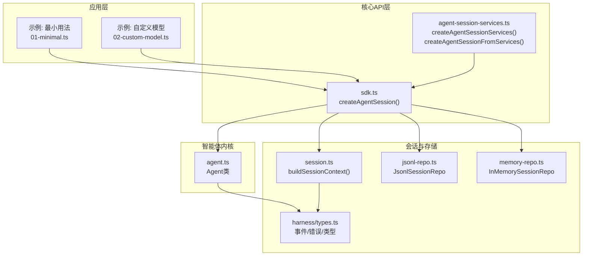
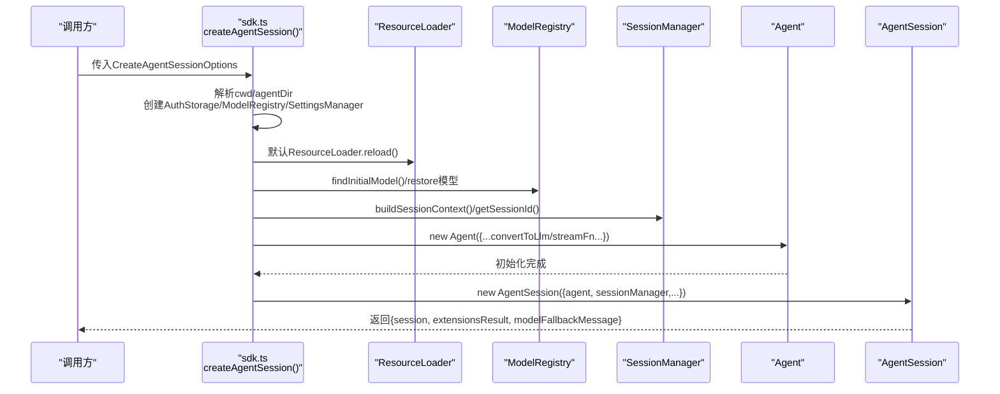
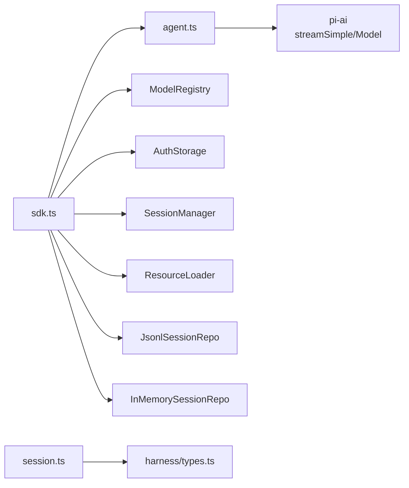

# 核心API

<cite>
**本文引用的文件**
- [packages/coding-agent/src/core/sdk.ts](file://packages/coding-agent/src/core/sdk.ts)
- [packages/coding-agent/src/core/agent-session-services.ts](file://packages/coding-agent/src/core/agent-session-services.ts)
- [packages/agent/src/agent.ts](file://packages/agent/src/agent.ts)
- [packages/agent/src/harness/types.ts](file://packages/agent/src/harness/types.ts)
- [packages/agent/src/harness/session/session.ts](file://packages/agent/src/harness/session/session.ts)
- [packages/agent/src/harness/session/jsonl-repo.ts](file://packages/agent/src/harness/session/jsonl-repo.ts)
- [packages/agent/src/harness/session/memory-repo.ts](file://packages/agent/src/harness/session/memory-repo.ts)
- [packages/coding-agent/examples/sdk/01-minimal.ts](file://packages/coding-agent/examples/sdk/01-minimal.ts)
- [packages/coding-agent/examples/sdk/02-custom-model.ts](file://packages/coding-agent/examples/sdk/02-custom-model.ts)
</cite>

## 目录
1. [简介](#简介)
2. [项目结构](#项目结构)
3. [核心组件](#核心组件)
4. [架构总览](#架构总览)
5. [详细组件分析](#详细组件分析)
6. [依赖关系分析](#依赖关系分析)
7. [性能考量](#性能考量)
8. [故障排查指南](#故障排查指南)
9. [结论](#结论)
10. [附录](#附录)

## 简介
本文件面向Pi编码代理的开发者，系统化阐述核心API createAgentSession的完整实现与使用方式。内容覆盖：
- createAgentSession函数的职责、输入参数、配置项与返回结果
- CreateAgentSessionOptions接口的每个字段作用与使用建议
- 从默认配置到复杂自定义配置的完整使用示例路径
- 错误处理策略、最佳实践与常见问题解决思路

## 项目结构
围绕createAgentSession的关键模块分布如下：
- 编排层：packages/coding-agent/src/core/sdk.ts 提供对外API入口与会话创建逻辑
- 服务层：packages/coding-agent/src/core/agent-session-services.ts 提供服务创建与从服务创建会话的能力
- 核心智能体：packages/agent/src/agent.ts 实现状态化Agent与事件循环
- 会话与存储：packages/agent/src/harness/session/* 提供会话构建、上下文恢复与存储抽象
- 类型与错误：packages/agent/src/harness/types.ts 定义事件、错误类型与会话树结构
- 示例：packages/coding-agent/examples/sdk/* 展示最小用法与自定义模型选择

图表来源
- [packages/coding-agent/src/core/sdk.ts:204-432](file://packages/coding-agent/src/core/sdk.ts#L204-L432)
- [packages/coding-agent/src/core/agent-session-services.ts:131-201](file://packages/coding-agent/src/core/agent-session-services.ts#L131-L201)
- [packages/agent/src/agent.ts:166-558](file://packages/agent/src/agent.ts#L166-L558)
- [packages/agent/src/harness/session/session.ts:22-120](file://packages/agent/src/harness/session/session.ts#L22-L120)
- [packages/agent/src/harness/session/jsonl-repo.ts:75-159](file://packages/agent/src/harness/session/jsonl-repo.ts#L75-L159)
- [packages/agent/src/harness/session/memory-repo.ts:8-49](file://packages/agent/src/harness/session/memory-repo.ts#L8-L49)
- [packages/agent/src/harness/types.ts:523-660](file://packages/agent/src/harness/types.ts#L523-L660)

章节来源
- [packages/coding-agent/src/core/sdk.ts:34-93](file://packages/coding-agent/src/core/sdk.ts#L34-L93)
- [packages/coding-agent/src/core/agent-session-services.ts:33-76](file://packages/coding-agent/src/core/agent-session-services.ts#L33-L76)

## 核心组件
- createAgentSession：对外唯一入口，负责解析cwd/agentDir、初始化认证与模型注册表、加载资源、选择模型与思考级别、构建Agent与AgentSession，并可恢复已有会话上下文。
- Agent：状态化智能体，封装消息、工具、事件订阅、队列（引导/后续）与生命周期管理。
- 会话与存储：通过Session与SessionManager在内存或JSONL文件中持久化会话树，支持分支摘要、压缩、标签等能力。
- 类型与错误：统一的事件类型、错误码与会话树条目类型，保证跨模块契约稳定。

章节来源
- [packages/coding-agent/src/core/sdk.ts:204-432](file://packages/coding-agent/src/core/sdk.ts#L204-L432)
- [packages/agent/src/agent.ts:166-558](file://packages/agent/src/agent.ts#L166-L558)
- [packages/agent/src/harness/types.ts:523-660](file://packages/agent/src/harness/types.ts#L523-L660)

## 架构总览
下图展示从调用createAgentSession到最终产出AgentSession的端到端流程，以及与Agent、会话存储、扩展运行器的交互。

图表来源
- [packages/coding-agent/src/core/sdk.ts:204-432](file://packages/coding-agent/src/core/sdk.ts#L204-L432)
- [packages/agent/src/agent.ts:166-219](file://packages/agent/src/agent.ts#L166-L219)

## 详细组件分析

### createAgentSession函数与CreateAgentSessionOptions详解
- 函数签名与职责
  - 入口：createAgentSession(options)
  - 职责：解析工作目录与全局配置目录；初始化认证与模型注册表；加载资源；选择模型与思考级别；构建Agent与AgentSession；必要时恢复会话上下文。
- 关键输入参数与行为
  - cwd：项目工作目录，默认取当前进程工作目录或SessionManager.getCwd()。用于资源发现与工具默认cwd。
  - agentDir：全局配置目录，默认取~/.pi/agent。用于auth.json与models.json等。
  - authStorage/modelRegistry：认证与模型注册表，可复用或自动创建。
  - model/thinkingLevel/scopedModels：模型与思考级别选择策略，支持从设置或会话恢复，且会按模型能力进行钳制。
  - noTools/tools/excludeTools/customTools：工具白名单/黑名单/自定义工具组合。
  - resourceLoader：资源加载器，默认使用DefaultResourceLoader并reload。
  - sessionManager：会话管理器，默认基于cwd与默认会话目录创建。
  - settingsManager：设置管理器，默认基于cwd与agentDir创建。
  - sessionStartEvent：扩展运行时启动会话事件元数据。
- 返回值
  - session：已初始化的AgentSession实例，承载Agent与会话能力。
  - extensionsResult：扩展加载结果，用于UI上下文等。
  - modelFallbackMessage：当无法恢复原模型时的降级提示。

章节来源
- [packages/coding-agent/src/core/sdk.ts:34-93](file://packages/coding-agent/src/core/sdk.ts#L34-L93)
- [packages/coding-agent/src/core/sdk.ts:204-432](file://packages/coding-agent/src/core/sdk.ts#L204-L432)

### Agent内部机制与生命周期
- Agent状态与事件
  - 状态：systemPrompt、model、thinkingLevel、tools/messages、isStreaming、pendingToolCalls、errorMessage等。
  - 事件：message_start/message_update/message_end/tool_execution_*、turn_end、agent_end等。
- 生命周期
  - runWithLifecycle：封装一次运行的生命周期，设置isStreaming、捕获错误、触发事件监听者、收尾finishRun。
  - handleRunFailure：在异常时生成失败消息并发出agent_end事件。
- 队列控制
  - steeringMode/followUpMode：引导消息与后续消息的注入策略（单次/全部）。
  - steer/followUp/clear*：消息排队与清空。
- 流式输出与回调
  - streamFn：默认使用streamSimple，支持超时、重试、传输方式、头部合并等。
  - onPayload/onResponse：扩展钩子，允许在请求前后注入处理。

章节来源
- [packages/agent/src/agent.ts:166-558](file://packages/agent/src/agent.ts#L166-L558)

### 会话上下文恢复与存储
- 上下文构建
  - buildSessionContext：从会话树路径提取messages、thinkingLevel、model、activeToolNames，并插入压缩/分支摘要等特殊消息。
- 存储实现
  - JsonlSessionRepo：基于JSONL文件的持久化，支持创建、打开、列出、删除、分叉。
  - InMemorySessionRepo：内存会话仓库，便于测试或临时场景。
- 错误类型
  - SessionError、AgentHarnessError等，提供稳定的错误码与定位。

章节来源
- [packages/agent/src/harness/session/session.ts:22-120](file://packages/agent/src/harness/session/session.ts#L22-L120)
- [packages/agent/src/harness/session/jsonl-repo.ts:75-159](file://packages/agent/src/harness/session/jsonl-repo.ts#L75-L159)
- [packages/agent/src/harness/session/memory-repo.ts:8-49](file://packages/agent/src/harness/session/memory-repo.ts#L8-L49)
- [packages/agent/src/harness/types.ts:196-227](file://packages/agent/src/harness/types.ts#L196-L227)

### 从服务创建会话（高级用法）
- createAgentSessionServices：先创建cwd绑定的服务集合（认证、设置、模型注册表、资源加载器），并收集诊断信息。
- createAgentSessionFromServices：在已有服务基础上，按cwd解析后的模型/思考级别/工具等选项创建AgentSession，便于跨平台/多cwd场景复用服务。

章节来源
- [packages/coding-agent/src/core/agent-session-services.ts:131-201](file://packages/coding-agent/src/core/agent-session-services.ts#L131-L201)

### API使用示例（路径）
- 最小用法：仅调用createAgentSession()，自动发现技能、扩展、工具与上下文文件，模型从设置或可用列表选择。
  - 参考：[packages/coding-agent/examples/sdk/01-minimal.ts:10](file://packages/coding-agent/examples/sdk/01-minimal.ts#L10)
- 自定义模型：显式选择模型与思考级别，或从可用模型中挑选。
  - 参考：[packages/coding-agent/examples/sdk/02-custom-model.ts:34-53](file://packages/coding-agent/examples/sdk/02-custom-model.ts#L34-L53)

章节来源
- [packages/coding-agent/examples/sdk/01-minimal.ts:10-26](file://packages/coding-agent/examples/sdk/01-minimal.ts#L10-L26)
- [packages/coding-agent/examples/sdk/02-custom-model.ts:34-53](file://packages/coding-agent/examples/sdk/02-custom-model.ts#L34-L53)

## 依赖关系分析
- 模块耦合
  - sdk.ts依赖：Agent、ModelRegistry、AuthStorage、SettingsManager、SessionManager、ResourceLoader、工具工厂等。
  - agent.ts对pi-ai的streamSimple与Message类型强依赖，对事件钩子与流式回调进行封装。
  - session.ts与jsonl-repo.ts/memory-repo.ts对会话树与存储进行抽象，避免上层感知具体实现。
- 外部依赖
  - pi-ai：提供Model、streamSimple、Message等类型与流式能力。
  - 文件系统与执行环境：由ResourceLoader与工具链提供，支持cwd相对路径与安全限制（如图片过滤）。

图表来源
- [packages/coding-agent/src/core/sdk.ts:204-432](file://packages/coding-agent/src/core/sdk.ts#L204-L432)
- [packages/agent/src/agent.ts:166-219](file://packages/agent/src/agent.ts#L166-L219)
- [packages/agent/src/harness/session/session.ts:22-120](file://packages/agent/src/harness/session/session.ts#L22-L120)
- [packages/agent/src/harness/session/jsonl-repo.ts:75-159](file://packages/agent/src/harness/session/jsonl-repo.ts#L75-L159)
- [packages/agent/src/harness/session/memory-repo.ts:8-49](file://packages/agent/src/harness/session/memory-repo.ts#L8-L49)

## 性能考量
- 流式传输与重试
  - 通过streamFn与provider重试设置控制超时、最大重试次数与最大退避延迟，减少网络抖动影响。
- 工具数量与上下文长度
  - 合理使用tools/excludeTools/noTools控制工具集规模，避免上下文过长导致token超限。
- 图片过滤
  - 当启用图片过滤时，convertToLlm会将图像替换为文本占位符，降低token消耗与带宽占用。
- 会话压缩
  - 使用压缩与分支摘要减少历史消息长度，提升响应速度与成本控制。

## 故障排查指南
- 常见错误与定位
  - 模型不可用：当无法恢复原模型或无可用模型时，会返回modelFallbackMessage，检查authStorage与ModelRegistry配置。
  - 会话不存在：打开JSONL会话时若文件缺失，抛出SessionError，确认cwd与会话路径。
  - 运行中再次prompt：Agent在运行中会拒绝新的prompt，需等待完成或使用steer/followUp队列。
- 排查步骤
  - 检查cwd与agentDir是否正确解析与存在。
  - 确认模型注册表中存在有效凭据。
  - 查看扩展加载结果与诊断信息（服务创建阶段）。
  - 在事件监听中打印关键事件（message_start/message_end/tool_execution_*）以定位卡点。

章节来源
- [packages/agent/src/harness/types.ts:196-227](file://packages/agent/src/harness/types.ts#L196-L227)
- [packages/agent/src/agent.ts:324-365](file://packages/agent/src/agent.ts#L324-L365)

## 结论
createAgentSession提供了从零到一的完整会话创建体验：自动发现与配置、模型与思考级别的智能选择、工具集的灵活控制、以及会话上下文的无缝恢复。结合Agent的事件驱动与队列机制，开发者可以快速搭建稳定、可观测、可扩展的编码代理应用。

## 附录

### CreateAgentSessionOptions字段速览与建议
- cwd：项目根目录，影响资源发现与工具默认cwd。
- agentDir：全局配置目录，存放认证与模型配置。
- authStorage/modelRegistry：认证与模型注册表，可复用或自动创建。
- model/thinkingLevel/scopedModels：优先从会话恢复，否则从设置或可用模型中选择，并按模型能力钳制。
- noTools/tools/excludeTools/customTools：控制工具集规模与来源。
- resourceLoader：默认ResourceLoader并reload，确保扩展与资源加载。
- sessionManager/settingsManager：会话与设置管理器，支持内存或JSONL存储。
- sessionStartEvent：扩展运行时启动事件元数据。

章节来源
- [packages/coding-agent/src/core/sdk.ts:34-93](file://packages/coding-agent/src/core/sdk.ts#L34-L93)