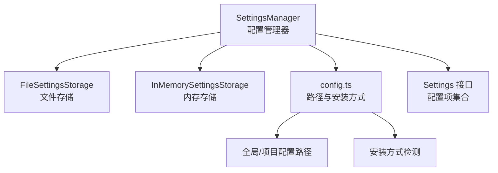
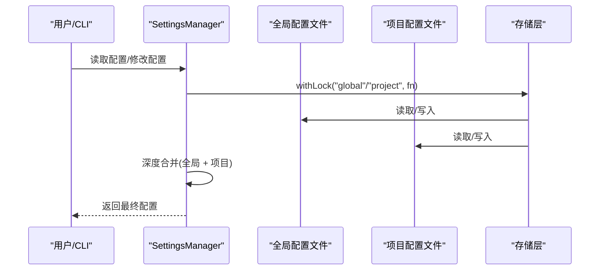
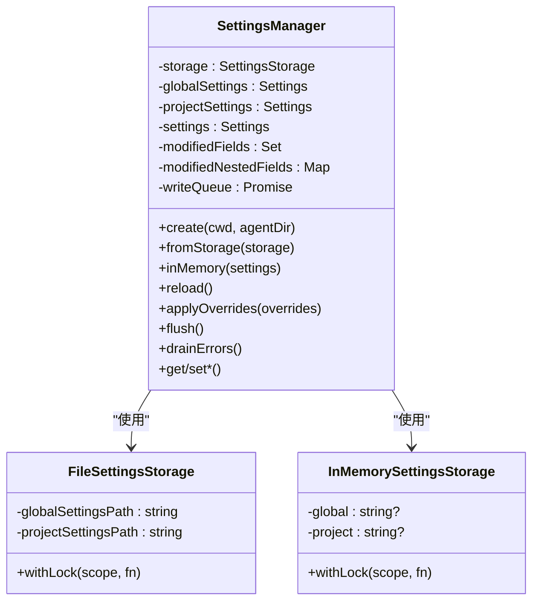
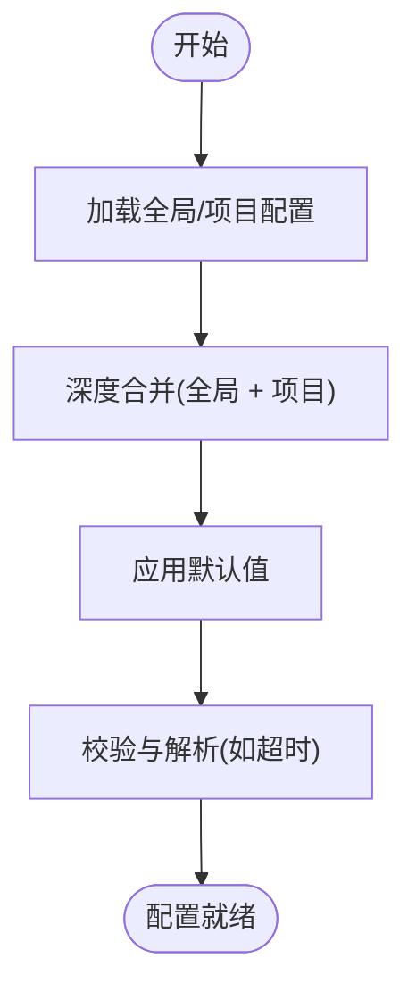
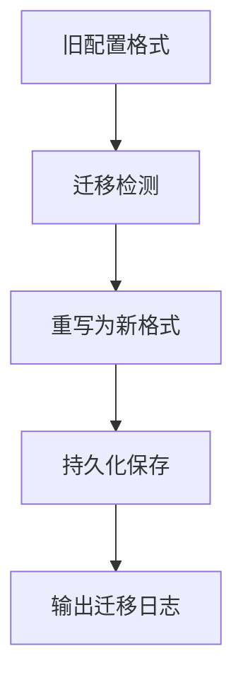
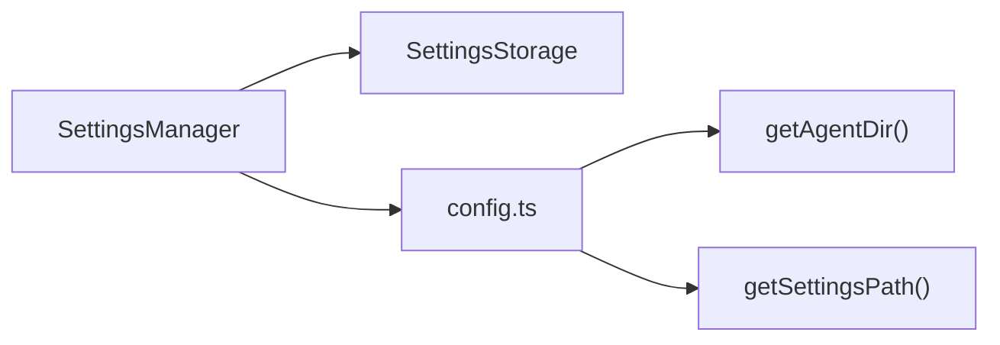

# 配置选项

<cite>
**本文引用的文件**
- [settings-manager.ts](file://packages/coding-agent/src/core/settings-manager.ts)
- [config.ts](file://packages/coding-agent/src/config.ts)
- [settings.md](file://packages/coding-agent/docs/settings.md)
- [config.test.ts](file://packages/coding-agent/test/config.test.ts)
- [config-value-migration.test.ts](file://packages/coding-agent/test/config-value-migration.test.ts)
</cite>

## 目录
1. [简介](#简介)
2. [项目结构](#项目结构)
3. [核心组件](#核心组件)
4. [架构总览](#架构总览)
5. [详细组件分析](#详细组件分析)
6. [依赖关系分析](#依赖关系分析)
7. [性能考量](#性能考量)
8. [故障排查指南](#故障排查指南)
9. [结论](#结论)
10. [附录](#附录)

## 简介
本指南面向Pi编码代理的配置系统，聚焦于SettingsManager的设计与使用、配置项全集、作用域与合并规则、默认值与迁移策略、以及在不同使用场景（开发、生产、特殊需求）下的实践建议。文档同时覆盖配置验证、冲突处理、兼容性与性能调优要点，帮助你安全地进行配置管理与运行时调整。

## 项目结构
与配置系统直接相关的代码主要位于以下文件：
- settings-manager.ts：定义配置接口、深度合并策略、文件存储与锁机制、SettingsManager类及运行时读写API
- config.ts：应用配置路径解析（全局与项目）、安装方式检测、包资源路径等
- settings.md：官方配置参考，涵盖所有配置项、默认值、示例与合并说明
- config.test.ts：安装方式与更新指令的测试用例，体现路径解析与环境变量影响
- config-value-migration.test.ts：历史配置值迁移示例（如auth.json、models.json中的键值迁移）

图表来源
- [settings-manager.ts:257-322](file://packages/coding-agent/src/core/settings-manager.ts#L257-L322)
- [config.ts:484-537](file://packages/coding-agent/src/config.ts#L484-L537)

章节来源
- [settings-manager.ts:257-322](file://packages/coding-agent/src/core/settings-manager.ts#L257-L322)
- [config.ts:484-537](file://packages/coding-agent/src/config.ts#L484-L537)

## 核心组件
- Settings接口：集中定义所有可配置项，包括模型与思维级别、UI显示、重试策略、消息传输、终端与图片、Shell与npm命令、会话目录、模型轮换、Markdown、资源加载（packages/extensions/skills/prompts/themes）等。
- SettingsManager：负责加载、合并、持久化与运行时读写配置；支持全局与项目两套配置，项目配置覆盖全局；内置深度合并与字段变更追踪；提供超时解析、错误记录与批量写入队列。
- 存储层：FileSettingsStorage基于文件系统与锁实现并发安全的读写；InMemorySettingsStorage用于测试或临时场景。
- 配置路径与安装方式：config.ts提供全局与项目配置文件路径、包资源路径、安装方式检测、自更新命令生成等。

章节来源
- [settings-manager.ts:77-116](file://packages/coding-agent/src/core/settings-manager.ts#L77-L116)
- [settings-manager.ts:257-322](file://packages/coding-agent/src/core/settings-manager.ts#L257-L322)
- [config.ts:484-537](file://packages/coding-agent/src/config.ts#L484-L537)

## 架构总览
SettingsManager通过“全局配置 + 项目配置”的双层设计实现灵活的配置体系。全局配置位于用户主目录下的agent目录中，项目配置位于当前工作目录的.pi子目录内。两者以深度合并的方式叠加，项目配置优先级更高。

图表来源
- [settings-manager.ts:288-322](file://packages/coding-agent/src/core/settings-manager.ts#L288-L322)
- [settings-manager.ts:509-570](file://packages/coding-agent/src/core/settings-manager.ts#L509-L570)

章节来源
- [settings-manager.ts:288-322](file://packages/coding-agent/src/core/settings-manager.ts#L288-L322)
- [settings-manager.ts:509-570](file://packages/coding-agent/src/core/settings-manager.ts#L509-L570)

## 详细组件分析

### SettingsManager 类与配置生命周期
- 加载与合并：从全局与项目存储加载，执行迁移与深度合并，得到最终运行时配置。
- 运行时修改：通过setter方法标记字段变更，异步批量写回；支持嵌套字段增量写入。
- 错误处理：记录加载/写入错误，提供drainErrors消费接口；对无效超时值抛出异常。
- 并发与一致性：withLock采用同步阻塞式重试与文件锁，避免并发写冲突。

图表来源
- [settings-manager.ts:257-322](file://packages/coding-agent/src/core/settings-manager.ts#L257-L322)
- [settings-manager.ts:171-238](file://packages/coding-agent/src/core/settings-manager.ts#L171-L238)
- [settings-manager.ts:240-255](file://packages/coding-agent/src/core/settings-manager.ts#L240-L255)

章节来源
- [settings-manager.ts:257-322](file://packages/coding-agent/src/core/settings-manager.ts#L257-L322)
- [settings-manager.ts:171-238](file://packages/coding-agent/src/core/settings-manager.ts#L171-L238)
- [settings-manager.ts:240-255](file://packages/coding-agent/src/core/settings-manager.ts#L240-L255)

### 配置项分类与默认值
以下为关键配置类别与默认值概览（具体以官方文档为准）：
- 模型与思维级别
  - defaultProvider、defaultModel、defaultThinkingLevel、hideThinkingBlock、thinkingBudgets
- UI与显示
  - theme、quietStartup、collapseChangelog、enableInstallTelemetry、doubleEscapeAction、treeFilterMode、editorPaddingX、autocompleteMaxVisible、showHardwareCursor
- 警告
  - warnings.anthropicExtraUsage
- 压缩与分支摘要
  - compaction.enabled/reserveTokens/keepRecentTokens；branchSummary.reserveTokens/skipPrompt
- 重试策略
  - retry.enabled/maxRetries/baseDelayMs；provider层timeoutMs/maxRetries/maxRetryDelayMs
- 消息传输
  - steeringMode/followUpMode/transport/httpIdleTimeoutMs/websocketConnectTimeoutMs
- 终端与图片
  - terminal.showImages/imageWidthCells/clearOnShrink；images.autoResize/blockImages
- Shell与npm
  - shellPath/shellCommandPrefix/npmCommand[]
- 会话
  - sessionDir
- 模型轮换
  - enabledModels[]
- Markdown
  - markdown.codeBlockIndent
- 资源加载
  - packages[]（字符串或对象过滤）、extensions[]、skills[]、prompts[]、themes[]、enableSkillCommands

章节来源
- [settings-manager.ts:77-116](file://packages/coding-agent/src/core/settings-manager.ts#L77-L116)
- [settings.md:14-282](file://packages/coding-agent/docs/settings.md#L14-L282)

### 默认值与合并策略
- 默认值来源：Getter方法对未显式配置的字段返回合理默认值（如思维级别默认“one-at-a-time”、HTTP空闲超时有常量默认值等）。
- 合并规则：全局与项目配置深度合并，项目配置覆盖全局；数组与对象按字段粒度处理，非数组对象递归合并。
- 超时解析：httpIdleTimeoutMs与websocketConnectTimeoutMs支持字符串解析与数值校验，非法值抛错。

图表来源
- [settings-manager.ts:118-147](file://packages/coding-agent/src/core/settings-manager.ts#L118-L147)
- [settings-manager.ts:736-738](file://packages/coding-agent/src/core/settings-manager.ts#L736-L738)

章节来源
- [settings-manager.ts:118-147](file://packages/coding-agent/src/core/settings-manager.ts#L118-L147)
- [settings-manager.ts:736-738](file://packages/coding-agent/src/core/settings-manager.ts#L736-L738)

### 配置迁移与兼容性
- 历史字段迁移：如queueMode→steeringMode、websockets布尔→transport枚举、skills对象格式→数组、retry.maxDelayMs→retry.provider.maxRetryDelayMs等。
- 值迁移示例：auth.json与models.json中的键值迁移（如API Key与Headers从大写常量迁移到$ENV_VAR显式语法），测试用例展示了迁移过程与日志提示。

图表来源
- [settings-manager.ts:349-409](file://packages/coding-agent/src/core/settings-manager.ts#L349-L409)
- [config-value-migration.test.ts:38-69](file://packages/coding-agent/test/config-value-migration.test.ts#L38-L69)
- [config-value-migration.test.ts:71-137](file://packages/coding-agent/test/config-value-migration.test.ts#L71-L137)

章节来源
- [settings-manager.ts:349-409](file://packages/coding-agent/src/core/settings-manager.ts#L349-L409)
- [config-value-migration.test.ts:38-69](file://packages/coding-agent/test/config-value-migration.test.ts#L38-L69)
- [config-value-migration.test.ts:71-137](file://packages/coding-agent/test/config-value-migration.test.ts#L71-L137)

### 使用场景与配置示例
- 开发环境
  - 建议启用quietStartup、collapseChangelog，便于快速迭代；根据需要开启install telemetry以便获取版本信息。
  - 可配置npmCommand指向本地工具链（如mise）以统一Node版本。
- 生产环境
  - 明确设置defaultProvider/defaultModel与transport，确保稳定连接；适当提高retry.maxRetries与baseDelayMs以应对瞬时波动。
  - 设置httpIdleTimeoutMs与websocketConnectTimeoutMs，避免长时间空闲导致的连接中断。
- 特殊需求场景
  - 大规模会话：设置sessionDir到高可靠磁盘，并定期备份。
  - 图像密集任务：调整terminal.imageWidthCells与images.autoResize平衡清晰度与带宽。
  - 自定义资源：通过packages[]与resources数组精确加载所需扩展、技能、提示词与主题。

章节来源
- [settings.md:235-282](file://packages/coding-agent/docs/settings.md#L235-L282)
- [settings-manager.ts:736-738](file://packages/coding-agent/src/core/settings-manager.ts#L736-L738)

### 配置验证与冲突处理
- 验证策略
  - 超时设置：parseTimeoutSetting解析字符串或数值，非法值抛错；httpIdleTimeoutMs写入前校验范围。
  - 锁与并发：withLock同步重试与文件锁，避免竞态；失败记录到errors列表。
- 冲突与覆盖
  - 项目配置覆盖全局配置；数组与对象按字段粒度合并，避免全量替换。
  - 对于不支持的字段类型或值，抛出明确错误，便于定位问题。

章节来源
- [settings-manager.ts:149-158](file://packages/coding-agent/src/core/settings-manager.ts#L149-L158)
- [settings-manager.ts:740-747](file://packages/coding-agent/src/core/settings-manager.ts#L740-L747)
- [settings-manager.ts:509-570](file://packages/coding-agent/src/core/settings-manager.ts#L509-L570)

## 依赖关系分析
- SettingsManager依赖存储层（文件/内存）与配置路径解析（config.ts）。
- 配置路径受环境变量影响（如PI_CODING_AGENT_DIR、PI_CODING_AGENT_SESSION_DIR），测试用例验证了路径解析与安装方式检测的正确性。

图表来源
- [settings-manager.ts:288-322](file://packages/coding-agent/src/core/settings-manager.ts#L288-L322)
- [config.ts:484-537](file://packages/coding-agent/src/config.ts#L484-L537)

章节来源
- [settings-manager.ts:288-322](file://packages/coding-agent/src/core/settings-manager.ts#L288-L322)
- [config.ts:484-537](file://packages/coding-agent/src/config.ts#L484-L537)
- [config.test.ts:148-168](file://packages/coding-agent/test/config.test.ts#L148-L168)

## 性能考量
- 合并与读取
  - 深度合并仅在配置变更后触发，避免频繁I/O；运行时读取通过Getter直接访问已合并结果。
- 写入批处理
  - 写入队列串行化，减少锁竞争与落盘频率；嵌套字段增量写入，降低覆盖成本。
- 超时与连接
  - 适配不同提供商的空闲与握手超时，避免长连接占用资源；必要时禁用超时以保证稳定性。

章节来源
- [settings-manager.ts:509-570](file://packages/coding-agent/src/core/settings-manager.ts#L509-L570)
- [settings-manager.ts:736-738](file://packages/coding-agent/src/core/settings-manager.ts#L736-L738)

## 故障排查指南
- 配置无法加载
  - 检查全局/项目settings.json是否为合法JSON；查看SettingsManager的errors列表与drainErrors输出。
- 写入失败或并发冲突
  - 确认目标文件存在且具备写权限；避免多进程同时修改同一配置；等待写队列flush完成。
- 超时设置无效
  - 确认传入数值为有限正数；检查环境变量与CLI参数是否覆盖了配置值。
- 安装方式与自更新
  - 使用config.ts提供的检测函数与更新指令生成逻辑，确认包管理器路径与全局安装状态。

章节来源
- [settings-manager.ts:474-478](file://packages/coding-agent/src/core/settings-manager.ts#L474-L478)
- [settings-manager.ts:572-574](file://packages/coding-agent/src/core/settings-manager.ts#L572-L574)
- [settings-manager.ts:740-747](file://packages/coding-agent/src/core/settings-manager.ts#L740-L747)
- [config.test.ts:148-168](file://packages/coding-agent/test/config.test.ts#L148-L168)

## 结论
Pi编码代理的配置系统以SettingsManager为核心，结合全局与项目两层配置、深度合并与迁移策略，提供了灵活、可维护且高性能的配置管理能力。通过合理的默认值、严格的验证与错误记录、以及针对不同场景的实践建议，可以有效提升开发与生产的稳定性与效率。

## 附录
- 官方配置参考与示例请参阅settings.md。
- 安装方式检测与更新指令生成逻辑见config.test.ts与config.ts。