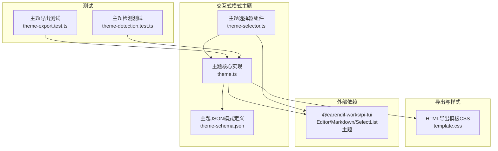
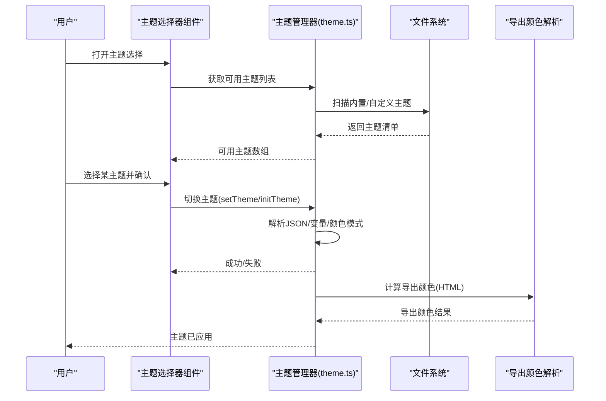
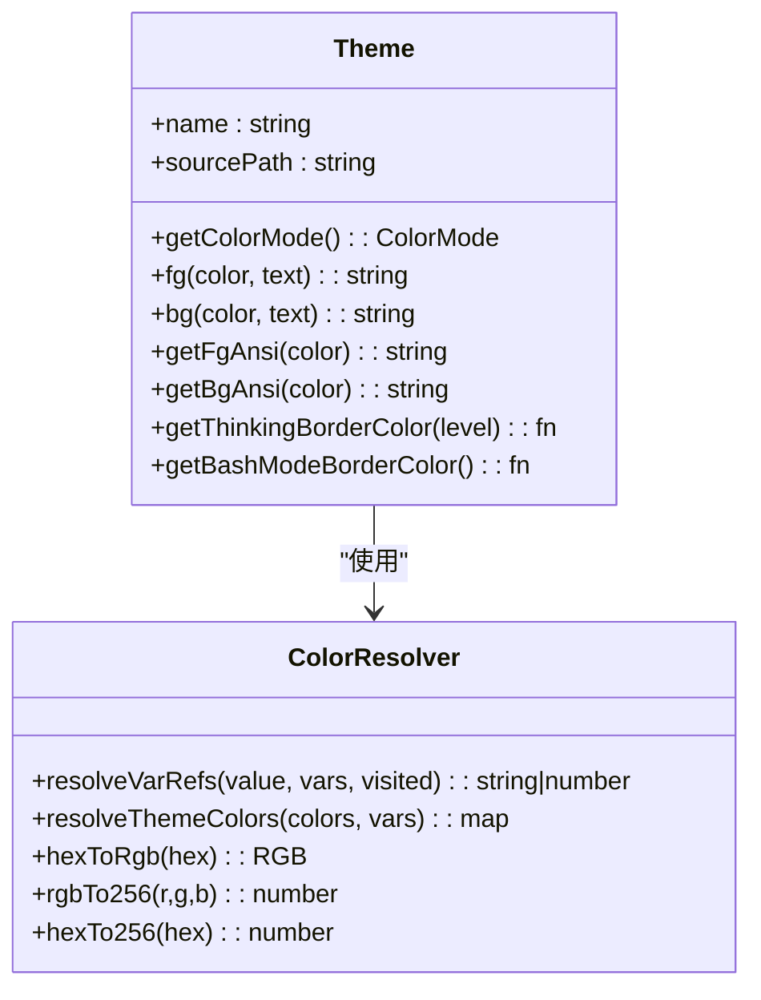
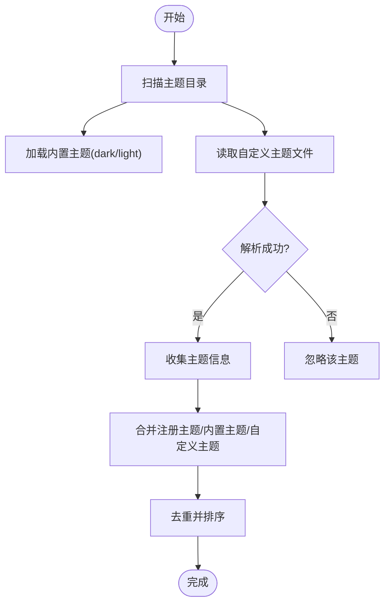
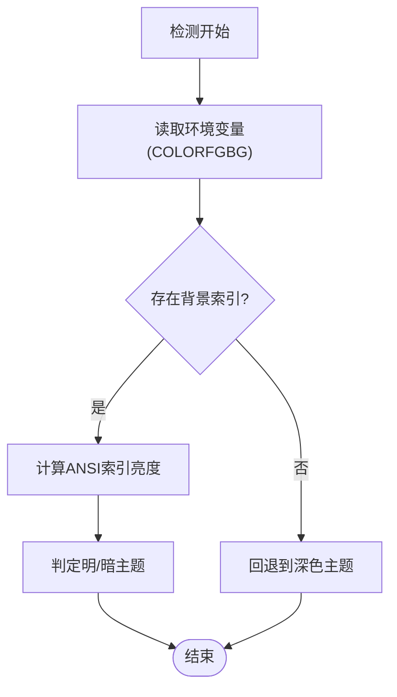
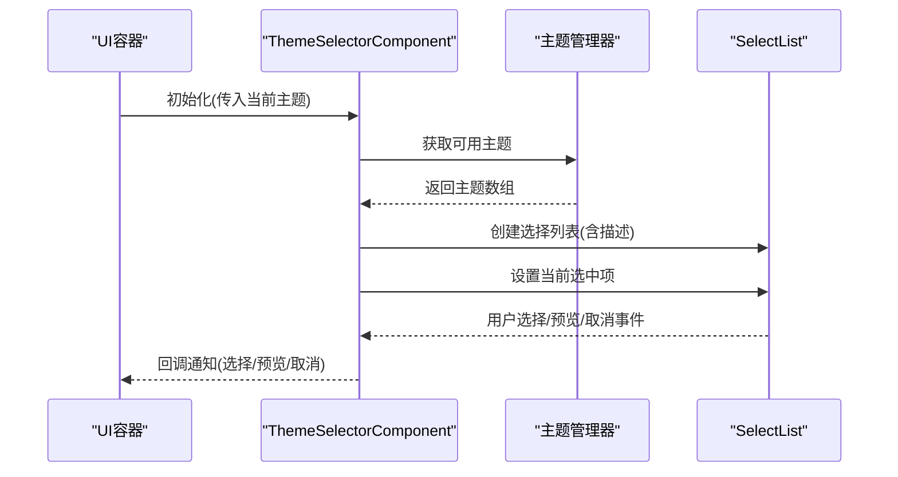
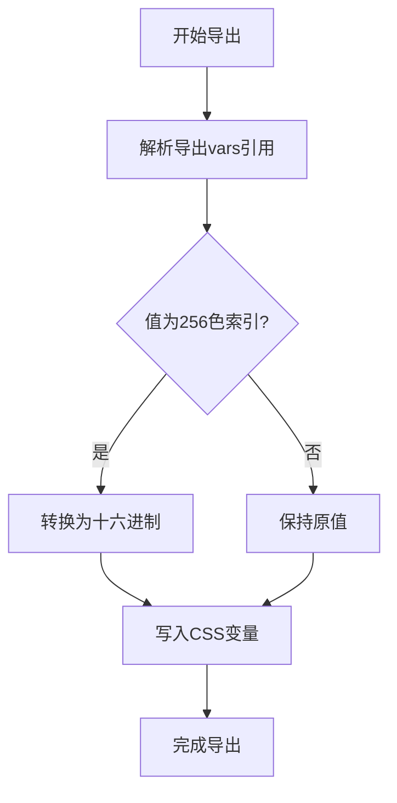
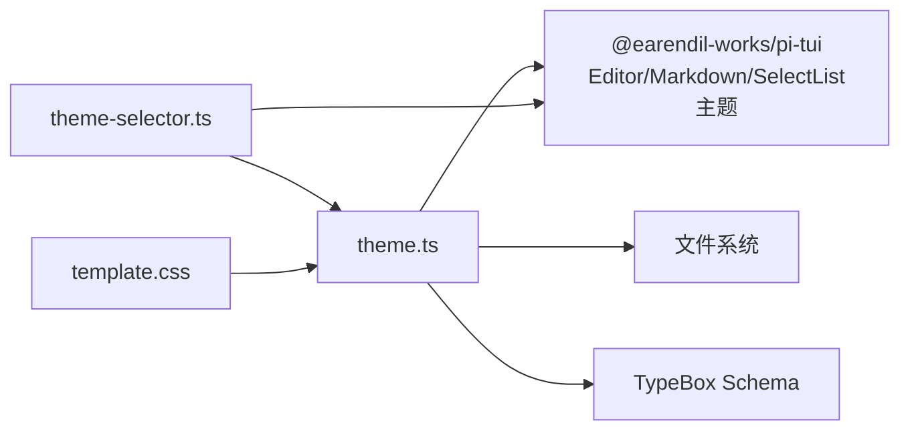

# 主题系统

<cite>
**本文引用的文件**
- [主题核心实现](file://packages/coding-agent/src/modes/interactive/theme/theme.ts)
- [主题JSON模式定义](file://packages/coding-agent/src/modes/interactive/theme/theme-schema.json)
- [HTML导出模板CSS](file://packages/coding-agent/src/core/export-html/template.css)
- [主题选择器组件](file://packages/coding-agent/src/modes/interactive/components/theme-selector.ts)
- [主题导出测试](file://packages/coding-agent/test/theme-export.test.ts)
- [主题检测测试](file://packages/coding-agent/test/theme-detection.test.ts)
- [根目录说明](file://README.md)
</cite>

## 目录
1. [简介](#简介)
2. [项目结构](#项目结构)
3. [核心组件](#核心组件)
4. [架构总览](#架构总览)
5. [详细组件分析](#详细组件分析)
6. [依赖关系分析](#依赖关系分析)
7. [性能考虑](#性能考虑)
8. [故障排除指南](#故障排除指南)
9. [结论](#结论)
10. [附录](#附录)

## 简介
本文件面向Pi编码代理交互式模式的主题系统，系统化阐述主题架构的设计原理与实现机制，涵盖颜色方案、字体设置、布局样式等主题元素的配置方法；提供默认主题结构分析与自定义主题开发指南；包含主题切换、动态更新与兼容性处理的技术细节，并给出主题定制的最佳实践与性能优化建议。

## 项目结构
主题系统位于交互式模式的子模块中，围绕“主题定义—解析—应用—导出”的完整链路构建，同时与终端UI库（@earendil-works/pi-tui）协作，确保在不同终端能力下正确渲染。

图表来源
- [主题核心实现:1-1238](file://packages/coding-agent/src/modes/interactive/theme/theme.ts#L1-L1238)
- [主题选择器组件:1-68](file://packages/coding-agent/src/modes/interactive/components/theme-selector.ts#L1-L68)
- [主题JSON模式定义:1-336](file://packages/coding-agent/src/modes/interactive/theme/theme-schema.json#L1-L336)
- [HTML导出模板CSS:1-1067](file://packages/coding-agent/src/core/export-html/template.css#L1-L1067)
- [主题导出测试:1-105](file://packages/coding-agent/test/theme-export.test.ts#L1-L105)
- [主题检测测试:1-72](file://packages/coding-agent/test/theme-detection.test.ts#L1-L72)

章节来源
- [根目录说明:1-90](file://README.md#L1-L90)

## 核心组件
- 主题类与颜色解析：负责加载、校验、解析变量引用、生成ANSI序列，并按终端能力选择真彩或256色调色板。
- 主题加载与发现：内置主题（dark/light）与自定义主题目录扫描，支持注册主题覆盖。
- 终端主题检测：基于环境变量与ANSI索引推断当前终端背景明暗，作为默认主题选择依据。
- 主题选择器组件：基于SelectList的交互式主题选择界面，支持预览与确认。
- 导出颜色解析：为HTML导出提供页面/卡片/信息区背景色，支持变量解析与256色转真彩。
- 模式定义与校验：通过JSON Schema严格约束主题字段与可选扩展，保证一致性与可维护性。

章节来源
- [主题核心实现:1-1238](file://packages/coding-agent/src/modes/interactive/theme/theme.ts#L1-L1238)
- [主题选择器组件:1-68](file://packages/coding-agent/src/modes/interactive/components/theme-selector.ts#L1-L68)
- [主题JSON模式定义:1-336](file://packages/coding-agent/src/modes/interactive/theme/theme-schema.json#L1-L336)

## 架构总览
主题系统采用“声明式配置 + 运行时解析 + 多目标导出”的架构。主题以JSON形式描述，运行时解析为ANSI序列用于终端渲染；同时为HTML导出提供CSS变量映射，确保一致的视觉体验。

图表来源
- [主题核心实现:777-800](file://packages/coding-agent/src/modes/interactive/theme/theme.ts#L777-L800)
- [主题选择器组件:26-58](file://packages/coding-agent/src/modes/interactive/components/theme-selector.ts#L26-L58)
- [主题导出测试:38-103](file://packages/coding-agent/test/theme-export.test.ts#L38-L103)

## 详细组件分析

### 主题类与颜色解析
- 颜色值类型：支持十六进制（#RRGGBB）、256色索引（0-255）、变量引用（vars中的键名）与空字符串（使用终端默认色）。
- 变量解析：递归解析vars引用，检测循环引用并抛出错误；支持嵌套与别名。
- ANSI序列生成：根据终端能力选择真彩（RGB）或256色（索引），并生成前景/背景ANSI序列。
- 思维等级边框：按思维级别映射到专用颜色，便于在终端中区分不同思考深度。
- Bash模式边框：为编辑器模式提供专用边框色。

图表来源
- [主题核心实现:322-421](file://packages/coding-agent/src/modes/interactive/theme/theme.ts#L322-L421)
- [主题核心实现:289-316](file://packages/coding-agent/src/modes/interactive/theme/theme.ts#L289-L316)
- [主题核心实现:167-287](file://packages/coding-agent/src/modes/interactive/theme/theme.ts#L167-L287)

章节来源
- [主题核心实现:167-287](file://packages/coding-agent/src/modes/interactive/theme/theme.ts#L167-L287)
- [主题核心实现:289-316](file://packages/coding-agent/src/modes/interactive/theme/theme.ts#L289-L316)
- [主题核心实现:322-421](file://packages/coding-agent/src/modes/interactive/theme/theme.ts#L322-L421)

### 主题加载与发现
- 内置主题：从主题目录读取dark.json与light.json，作为默认主题。
- 自定义主题：扫描自定义主题目录，过滤.json文件并尝试解析，忽略无效主题。
- 注册主题：支持在运行时注册主题对象，优先级高于同名文件主题。
- 加载顺序：优先注册主题 → 内置主题 → 自定义主题，去重后排序返回。

图表来源
- [主题核心实现:442-478](file://packages/coding-agent/src/modes/interactive/theme/theme.ts#L442-L478)
- [主题核心实现:480-503](file://packages/coding-agent/src/modes/interactive/theme/theme.ts#L480-L503)

章节来源
- [主题核心实现:442-503](file://packages/coding-agent/src/modes/interactive/theme/theme.ts#L442-L503)

### 终端主题检测与兼容性
- 检测来源：优先解析环境变量中的背景色索引（COLORFGBG），其次回退到默认深色主题。
- 能力感知：通过终端能力检测决定颜色模式（真彩/256色），并在运行时生成相应ANSI序列。
- 光谱计算：基于RGB亮度公式判断明暗主题，确保默认行为合理。

图表来源
- [主题核心实现:714-737](file://packages/coding-agent/src/modes/interactive/theme/theme.ts#L714-L737)
- [主题检测测试:14-39](file://packages/coding-agent/test/theme-detection.test.ts#L14-L39)

章节来源
- [主题核心实现:625-737](file://packages/coding-agent/src/modes/interactive/theme/theme.ts#L625-L737)
- [主题检测测试:14-71](file://packages/coding-agent/test/theme-detection.test.ts#L14-L71)

### 主题选择器组件
- 功能：提供交互式主题选择界面，支持当前主题标记、预览回调、确认与取消。
- 数据源：通过主题管理器获取可用主题列表，自动定位当前主题并预选。
- 布局：结合SelectList与动态边框组件，提供一致的TUI外观。

图表来源
- [主题选择器组件:13-67](file://packages/coding-agent/src/modes/interactive/components/theme-selector.ts#L13-L67)

章节来源
- [主题选择器组件:13-67](file://packages/coding-agent/src/modes/interactive/components/theme-selector.ts#L13-L67)

### HTML导出与主题映射
- CSS变量注入：模板中使用占位符{{THEME_VARS}}、{{BODY_BG}}等，由主题导出颜色解析函数替换。
- 导出颜色解析：支持vars变量解析、256色索引转换为十六进制、空值表示不设置。
- 测试验证：通过单元测试覆盖变量解析、递归引用与256色转真彩场景。

图表来源
- [HTML导出模板CSS:1-6](file://packages/coding-agent/src/core/export-html/template.css#L1-L6)
- [主题导出测试:38-103](file://packages/coding-agent/test/theme-export.test.ts#L38-L103)

章节来源
- [HTML导出模板CSS:1-6](file://packages/coding-agent/src/core/export-html/template.css#L1-L6)
- [主题导出测试:38-103](file://packages/coding-agent/test/theme-export.test.ts#L38-L103)

### 主题JSON模式定义
- 结构：name、vars（可选）、colors（必填）、export（可选）。
- 颜色令牌：覆盖UI文本、背景、消息、工具执行、Markdown、语法高亮、思维等级、Bash模式等。
- 校验：通过TypeBox编译后的Schema进行强类型校验，缺失必需颜色时提供明确错误信息。

章节来源
- [主题JSON模式定义:1-336](file://packages/coding-agent/src/modes/interactive/theme/theme-schema.json#L1-L336)

## 依赖关系分析
- 对终端UI库的依赖：主题类从@earendil-works/pi-tui导入Editor/Markdown/SelectList主题类型，确保与TUI组件风格一致。
- 文件系统依赖：读取内置主题与自定义主题目录，监听主题变更（watcher）以支持热更新。
- 类型与校验：使用TypeBox定义Schema并编译，提升运行时安全性与开发体验。

图表来源
- [主题核心实现:1-17](file://packages/coding-agent/src/modes/interactive/theme/theme.ts#L1-L17)
- [主题选择器组件:1-3](file://packages/coding-agent/src/modes/interactive/components/theme-selector.ts#L1-L3)
- [HTML导出模板CSS:1-6](file://packages/coding-agent/src/core/export-html/template.css#L1-L6)

章节来源
- [主题核心实现:1-17](file://packages/coding-agent/src/modes/interactive/theme/theme.ts#L1-L17)
- [主题选择器组件:1-3](file://packages/coding-agent/src/modes/interactive/components/theme-selector.ts#L1-L3)

## 性能考虑
- 颜色模式选择：优先使用真彩以获得最佳视觉效果，若终端不支持则回退至256色，避免额外转换成本。
- 缓存与懒加载：内置主题首次访问时读取并缓存，减少重复IO；自定义主题目录扫描仅在需要时进行。
- 变量解析：采用一次解析、多次复用策略，避免重复计算；对循环引用进行早期检测。
- 导出颜色：256色转真彩仅在需要时触发，且结果可被导出流程复用。
- 监听器管理：启用watcher时注意资源释放，避免内存泄漏；在错误回退时不启动watcher。

## 故障排除指南
- 主题加载失败：检查主题文件是否符合Schema，确认必需颜色是否齐全；查看错误信息中缺失的颜色列表。
- 变量引用错误：检查vars中是否存在循环引用或未定义的变量名；确保引用值类型合法。
- 终端颜色异常：确认终端能力（真彩/256色）与实际支持情况一致；检查环境变量COLORFGBG格式。
- 导出颜色为空：确认导出对象中的颜色值是否为空字符串（表示不设置），或256色索引是否有效。
- 主题切换无效：确认当前主题名称是否存在于可用列表；检查watcher状态与回调注册。

章节来源
- [主题核心实现:505-542](file://packages/coding-agent/src/modes/interactive/theme/theme.ts#L505-L542)
- [主题检测测试:14-71](file://packages/coding-agent/test/theme-detection.test.ts#L14-L71)
- [主题导出测试:38-103](file://packages/coding-agent/test/theme-export.test.ts#L38-L103)

## 结论
Pi编码代理交互式模式的主题系统通过声明式JSON配置与运行时解析相结合，实现了跨终端的一致视觉体验，并为HTML导出提供了无缝衔接。系统具备完善的校验、兼容与动态更新能力，既满足默认主题需求，又允许灵活的自定义扩展。遵循本文档的最佳实践与性能建议，可高效构建与维护高质量的主题体系。

## 附录

### 默认主题结构分析
- 内置主题：dark.json与light.json作为默认主题，提供完整的颜色令牌集合，适配明暗两种终端背景。
- 颜色令牌分布：UI文本/背景、消息区域、工具执行状态、Markdown渲染、语法高亮、思维等级与Bash模式均有专属配色。
- 导出颜色：默认导出对象为空，HTML导出时会从用户消息背景等颜色派生页面/卡片/信息区背景。

章节来源
- [主题核心实现:429-440](file://packages/coding-agent/src/modes/interactive/theme/theme.ts#L429-L440)
- [HTML导出模板CSS:1-6](file://packages/coding-agent/src/core/export-html/template.css#L1-L6)

### 自定义主题开发指南
- 基础要求：提供name与colors对象；vars为可选，支持变量别名与递归引用。
- 必备颜色：参考内置主题，确保所有必需颜色令牌均已定义。
- 导出颜色：如需HTML导出定制页面/卡片/信息区背景，可在export对象中指定对应颜色。
- 验证与测试：使用Schema进行本地校验；编写单元测试覆盖变量解析与颜色转换场景。

章节来源
- [主题JSON模式定义:34-297](file://packages/coding-agent/src/modes/interactive/theme/theme-schema.json#L34-L297)
- [主题导出测试:38-103](file://packages/coding-agent/test/theme-export.test.ts#L38-L103)

### 主题切换与动态更新
- 切换流程：通过setTheme/initTheme加载目标主题，内部完成解析与全局实例更新。
- 动态更新：启用watcher后，文件变更触发重新加载；错误时自动回退到深色主题并停止监听。
- 预览机制：主题选择器支持selectionChange回调，便于在不生效的情况下即时预览效果。

章节来源
- [主题核心实现:777-800](file://packages/coding-agent/src/modes/interactive/theme/theme.ts#L777-L800)
- [主题选择器组件:44-58](file://packages/coding-agent/src/modes/interactive/components/theme-selector.ts#L44-L58)